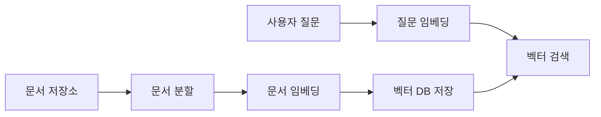
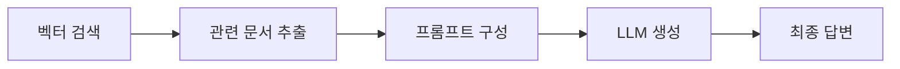

# LangChain을 이용한 RAG 시스템 구현 가이드

## 목차

1. [RAG 시스템 개요](#1-rag-시스템-개요)
   - 1.1. [RAG란 무엇인가](#11-rag란-무엇인가)
   - 1.2. [RAG의 핵심 구성요소](#12-rag의-핵심-구성요소)
   - 1.3. [RAG의 작동 원리](#13-rag의-작동-원리)
2. [기술 스택](#2-기술-스택)
   - 2.1. [LangChain](#21-langchain)
   - 2.2. [Google Generative AI](#22-google-generative-ai)
   - 2.3. [벡터 데이터베이스](#23-벡터-데이터베이스)
3. [RAG 시스템 구현](#3-rag-시스템-구현)
   - 3.1. [환경 설정](#31-환경-설정)
   - 3.2. [문서 준비 및 로딩](#32-문서-준비-및-로딩)
   - 3.3. [문서 분할 (Chunking)](#33-문서-분할-chunking)
   - 3.4. [임베딩 및 벡터 저장소 생성](#34-임베딩-및-벡터-저장소-생성)
   - 3.5. [검색기 (Retriever) 구성](#35-검색기-retriever-구성)
   - 3.6. [RAG 체인 생성](#36-rag-체인-생성)
   - 3.7. [질의응답 실행](#37-질의응답-실행)
4. [전체 MVP 코드](#4-전체-mvp-코드)
   - 4.1. [완전한 실행 코드](#41-완전한-실행-코드)
   - 4.2. [실행 결과 예시](#42-실행-결과-예시)
5. [성능 최적화 팁](#5-성능-최적화-팁)
   - 5.1. [청크 크기 조정](#51-청크-크기-조정)
   - 5.2. [검색 알고리즘 선택](#52-검색-알고리즘-선택)
   - 5.3. [프롬프트 엔지니어링](#53-프롬프트-엔지니어링)
6. [트러블슈팅](#6-트러블슈팅)
   - 6.1. [자주 발생하는 오류](#61-자주-발생하는-오류)
   - 6.2. [해결 방법](#62-해결-방법)
7. [용어 목록 (Glossary)](#7-용어-목록-glossary)

---

## 1. RAG 시스템 개요

### 1.1. RAG란 무엇인가

**RAG(Retrieval-Augmented Generation, 검색 증강 생성)** 는 대규모 언어 모델(LLM)의 한계를 극복하기 위한 기술입니다. LLM은 학습 데이터에 포함되지 않은 최신 정보나 특정 도메인 지식에 대해서는 정확한 답변을 제공하기 어렵습니다. RAG는 외부 지식 베이스에서 관련 정보를 검색하여 LLM에 제공함으로써 이 문제를 해결합니다.

**RAG의 필요성:**
- ✅ LLM의 학습 데이터 한계 극복
- ✅ 최신 정보 제공 가능
- ✅ 도메인 특화 지식 활용
- ✅ 환각(Hallucination) 현상 감소
- ✅ 답변의 출처 추적 가능

### 1.2. RAG의 핵심 구성요소

RAG 시스템은 크게 세 가지 구성요소로 이루어집니다:

1. **문서 저장소 (Document Store)**
   - 검색 대상이 되는 문서들의 집합
   - 텍스트, PDF, 웹 페이지 등 다양한 형태

2. **임베딩 모델 (Embedding Model)**
   - 텍스트를 벡터로 변환
   - 의미적 유사성 계산 가능

3. **벡터 데이터베이스 (Vector Database)**
   - 임베딩된 벡터를 저장
   - 빠른 유사도 검색 지원

4. **생성 모델 (Generation Model)**
   - 검색된 문맥을 활용해 답변 생성
   - GPT, Claude, Gemini 등

### 1.3. RAG의 작동 원리





**단계별 설명:**

1. **인덱싱 단계 (Indexing Phase)**
   - 문서를 작은 청크(Chunk)로 분할
   - 각 청크를 벡터로 임베딩
   - 벡터 데이터베이스에 저장

2. **검색 단계 (Retrieval Phase)**
   - 사용자 질문을 벡터로 임베딩
   - 유사도 기반으로 관련 문서 검색
   - 상위 k개의 문서 추출

3. **생성 단계 (Generation Phase)**
   - 검색된 문서를 프롬프트에 포함
   - LLM이 문맥을 참조하여 답변 생성
   - 출처 정보와 함께 답변 제공

---

## 2. 기술 스택

### 2.1. LangChain

**LangChain(랭체인)** 은 LLM 애플리케이션 개발을 위한 프레임워크입니다.

**주요 특징:**
- 🔗 다양한 LLM과의 통합 지원
- 📚 문서 로딩 및 처리 유틸리티
- 🔍 벡터 저장소 추상화
- ⛓️ 체인(Chain) 기반 워크플로우
- 🧠 메모리 및 상태 관리

**핵심 컴포넌트:**
- `Document Loaders`: 다양한 형식의 문서 로딩
- `Text Splitters`: 문서를 청크로 분할
- `Embeddings`: 텍스트 벡터화
- `Vector Stores`: 벡터 저장 및 검색
- `Chains`: 워크플로우 구성

### 2.2. Google Generative AI

**Google Generative AI API**는 Gemini 모델을 사용할 수 있는 인터페이스입니다.

**사용 이유:**
- 🚀 빠른 응답 속도
- 💰 경쟁력 있는 가격
- 🌏 한국어 지원 우수
- 📊 멀티모달 지원 (텍스트, 이미지 등)

**주요 모델:**
- `gemini-pro`: 텍스트 생성에 최적화
- `gemini-pro-vision`: 이미지 이해 가능
- `embedding-001`: 임베딩 생성 전용

### 2.3. 벡터 데이터베이스

이 가이드에서는 **FAISS(Facebook AI Similarity Search)** 를 사용합니다.

**FAISS 선택 이유:**
- ⚡ 빠른 검색 속도
- 💾 로컬 실행 가능 (서버 불필요)
- 🆓 완전 무료
- 📦 간단한 설치 및 사용

**대안:**
- `Chroma`: 오픈소스, 개발자 친화적
- `Pinecone`: 클라우드 기반, 확장성 우수
- `Weaviate`: GraphQL 지원

---

## 3. RAG 시스템 구현

### 3.1. 환경 설정

**필요한 라이브러리 설치:**

```bash
pip install langchain langchain-google-genai faiss-cpu python-dotenv
```

**라이브러리 설명:**
- `langchain`: RAG 파이프라인 구축
- `langchain-google-genai`: Google Gemini 연동
- `faiss-cpu`: 벡터 검색 엔진
- `python-dotenv`: 환경 변수 관리

**API 키 설정:**

1. [Google AI Studio](https://makersuite.google.com/app/apikey)에서 API 키 발급
2. 프로젝트 루트에 `.env` 파일 생성:

```env
GOOGLE_API_KEY=your_api_key_here
```

**환경 변수 로딩 코드:**

```python
import os
from dotenv import load_dotenv

# .env 파일에서 환경 변수 로딩
load_dotenv()

# API 키 확인
if not os.getenv("GOOGLE_API_KEY"):
    raise ValueError("GOOGLE_API_KEY가 설정되지 않았습니다!")
```

### 3.2. 문서 준비 및 로딩

RAG 시스템의 첫 단계는 검색 대상이 될 문서를 준비하는 것입니다.

**간단한 텍스트 문서 생성:**

```python
from langchain.docstore.document import Document

# 샘플 문서 생성
documents = [
    Document(
        page_content="LangChain은 대규모 언어 모델 애플리케이션을 구축하기 위한 프레임워크입니다. "
                     "문서 로딩, 텍스트 분할, 임베딩, 벡터 저장소 등의 기능을 제공합니다.",
        metadata={"source": "langchain_intro.txt", "page": 1}
    ),
    Document(
        page_content="RAG는 Retrieval-Augmented Generation의 약자로, 검색 증강 생성을 의미합니다. "
                     "외부 지식 베이스에서 관련 정보를 검색하여 LLM의 답변 품질을 향상시킵니다.",
        metadata={"source": "rag_concept.txt", "page": 1}
    ),
    Document(
        page_content="Google Gemini는 구글의 최신 대규모 언어 모델입니다. "
                     "텍스트 생성, 이미지 이해, 코드 작성 등 다양한 작업을 수행할 수 있습니다.",
        metadata={"source": "gemini_info.txt", "page": 1}
    ),
    Document(
        page_content="FAISS는 Facebook에서 개발한 벡터 유사도 검색 라이브러리입니다. "
                     "수백만 개의 벡터에서도 빠른 검색이 가능하며, CPU와 GPU를 모두 지원합니다.",
        metadata={"source": "faiss_guide.txt", "page": 1}
    )
]

print(f"총 {len(documents)}개의 문서가 로딩되었습니다.")
```

**실제 파일에서 로딩하는 방법:**

```python
from langchain.document_loaders import TextLoader, PyPDFLoader

# 텍스트 파일 로딩
loader = TextLoader("./data/document.txt", encoding="utf-8")
documents = loader.load()

# PDF 파일 로딩 (pypdf 설치 필요)
# loader = PyPDFLoader("./data/document.pdf")
# documents = loader.load()
```

### 3.3. 문서 분할 (Chunking)

긴 문서를 작은 조각으로 나누는 과정입니다. 적절한 청크 크기는 검색 품질에 큰 영향을 미칩니다.

**청크 크기 결정 기준:**
- 너무 작으면: 문맥 정보 손실
- 너무 크면: 검색 정확도 저하
- 권장 크기: 500-1000 토큰

```python
from langchain.text_splitter import RecursiveCharacterTextSplitter

# 텍스트 분할기 설정
text_splitter = RecursiveCharacterTextSplitter(
    chunk_size=500,        # 청크 크기 (문자 수)
    chunk_overlap=50,      # 청크 간 겹침 (문맥 유지)
    length_function=len,   # 길이 측정 함수
    separators=["\n\n", "\n", " ", ""]  # 분할 우선순위
)

# 문서 분할 실행
split_documents = text_splitter.split_documents(documents)

print(f"분할 결과: {len(documents)}개 문서 → {len(split_documents)}개 청크")
```

**분할 결과 확인:**

```python
# 첫 번째 청크 내용 확인
print("첫 번째 청크:")
print(split_documents[0].page_content)
print(f"\n메타데이터: {split_documents[0].metadata}")
```

### 3.4. 임베딩 및 벡터 저장소 생성

텍스트를 벡터로 변환하고 검색 가능한 형태로 저장합니다.

**임베딩 모델 초기화:**

```python
from langchain_google_genai import GoogleGenerativeAIEmbeddings

# Google Gemini 임베딩 모델 초기화
embeddings = GoogleGenerativeAIEmbeddings(
    model="models/embedding-001",
    google_api_key=os.getenv("GOOGLE_API_KEY")
)

# 임베딩 테스트
test_embedding = embeddings.embed_query("테스트 문장")
print(f"임베딩 벡터 차원: {len(test_embedding)}")
```

**벡터 저장소 생성:**

```python
from langchain.vectorstores import FAISS

# FAISS 벡터 저장소 생성
vectorstore = FAISS.from_documents(
    documents=split_documents,
    embedding=embeddings
)

print("벡터 저장소 생성 완료!")

# 저장소를 파일로 저장 (선택사항)
# vectorstore.save_local("./faiss_index")

# 저장된 저장소 로딩 (선택사항)
# vectorstore = FAISS.load_local("./faiss_index", embeddings)
```

**벡터 검색 테스트:**

```python
# 유사 문서 검색
query = "LangChain이 무엇인가요?"
similar_docs = vectorstore.similarity_search(query, k=2)

print(f"\n질문: {query}")
print("\n검색된 문서:")
for i, doc in enumerate(similar_docs, 1):
    print(f"\n{i}. {doc.page_content}")
    print(f"   출처: {doc.metadata.get('source', 'Unknown')}")
```

### 3.5. 검색기 (Retriever) 구성

벡터 저장소를 검색기로 변환합니다. 검색기는 질문에 대해 관련 문서를 자동으로 찾아줍니다.

```python
# 기본 검색기 생성
retriever = vectorstore.as_retriever(
    search_type="similarity",  # 검색 유형
    search_kwargs={"k": 3}     # 상위 3개 문서 반환
)

# 검색 테스트
retrieved_docs = retriever.get_relevant_documents("RAG가 무엇인가요?")
print(f"검색된 문서 개수: {len(retrieved_docs)}")
```

**검색 유형 옵션:**
- `similarity`: 단순 유사도 검색 (기본값)
- `mmr`: Maximum Marginal Relevance (다양성 고려)
- `similarity_score_threshold`: 유사도 임계값 기반

**MMR 검색 예시:**

```python
# 다양성을 고려한 검색
retriever_mmr = vectorstore.as_retriever(
    search_type="mmr",
    search_kwargs={
        "k": 3,              # 최종 반환 문서 수
        "fetch_k": 10,       # 초기 검색 문서 수
        "lambda_mult": 0.5   # 다양성 가중치 (0~1)
    }
)
```

### 3.6. RAG 체인 생성

검색기와 LLM을 연결하여 질의응답 시스템을 구축합니다.

**LLM 초기화:**

```python
from langchain_google_genai import ChatGoogleGenerativeAI

# Gemini 모델 초기화
llm = ChatGoogleGenerativeAI(
    model="gemini-pro",
    google_api_key=os.getenv("GOOGLE_API_KEY"),
    temperature=0.3,  # 창의성 조절 (0: 결정적, 1: 창의적)
    max_output_tokens=512
)
```

**프롬프트 템플릿 설정:**

```python
from langchain.prompts import PromptTemplate

# RAG용 프롬프트 템플릿
template = """당신은 친절한 AI 어시스턴트입니다. 주어진 문맥을 바탕으로 질문에 답변해주세요.
문맥에 없는 내용은 추측하지 말고, 모른다고 답변하세요.

문맥:
{context}

질문: {question}

답변:"""

prompt = PromptTemplate(
    template=template,
    input_variables=["context", "question"]
)
```

**RAG 체인 구성:**

```python
from langchain.chains import RetrievalQA

# RetrievalQA 체인 생성
qa_chain = RetrievalQA.from_chain_type(
    llm=llm,
    chain_type="stuff",      # 문서 결합 방식
    retriever=retriever,
    return_source_documents=True,  # 출처 문서 반환
    chain_type_kwargs={"prompt": prompt}
)
```

**체인 유형 (chain_type):**
- `stuff`: 모든 문서를 하나의 프롬프트에 포함 (기본, 가장 간단)
- `map_reduce`: 각 문서를 개별 처리 후 결합 (많은 문서 처리 시)
- `refine`: 순차적으로 답변을 개선 (정교한 답변 필요 시)
- `map_rerank`: 각 답변에 점수를 매겨 최선 선택

### 3.7. 질의응답 실행

이제 RAG 시스템을 사용하여 질문에 답변할 수 있습니다.

```python
# 질문 실행
question = "LangChain과 RAG의 관계는 무엇인가요?"
result = qa_chain({"query": question})

# 결과 출력
print(f"질문: {result['query']}")
print(f"\n답변: {result['result']}")

# 출처 문서 확인
print("\n참고한 문서:")
for i, doc in enumerate(result['source_documents'], 1):
    print(f"\n{i}. {doc.page_content[:100]}...")
    print(f"   출처: {doc.metadata.get('source', 'Unknown')}")
```

**스트리밍 방식 (실시간 출력):**

```python
from langchain.callbacks.streaming_stdout import StreamingStdOutCallbackHandler

# 스트리밍 LLM 설정
llm_streaming = ChatGoogleGenerativeAI(
    model="gemini-pro",
    google_api_key=os.getenv("GOOGLE_API_KEY"),
    temperature=0.3,
    streaming=True,
    callbacks=[StreamingStdOutCallbackHandler()]
)

# 스트리밍 체인 생성
qa_chain_streaming = RetrievalQA.from_chain_type(
    llm=llm_streaming,
    chain_type="stuff",
    retriever=retriever,
    return_source_documents=True
)

# 스트리밍 실행
print("답변 (스트리밍):")
result = qa_chain_streaming({"query": question})
```

---

## 4. 전체 MVP 코드

### 4.1. 완전한 실행 코드

아래는 복사하여 바로 실행 가능한 완전한 RAG 시스템 코드입니다.

```python
"""
LangChain + Google Gemini를 이용한 RAG 시스템 MVP
작성자: 김명환 (코드잇 AI 4기)
"""

import os
from dotenv import load_dotenv
from langchain.docstore.document import Document
from langchain.text_splitter import RecursiveCharacterTextSplitter
from langchain_google_genai import GoogleGenerativeAIEmbeddings, ChatGoogleGenerativeAI
from langchain.vectorstores import FAISS
from langchain.chains import RetrievalQA
from langchain.prompts import PromptTemplate

# 환경 변수 로딩
load_dotenv()

def main():
    # 1. 샘플 문서 생성
    documents = [
        Document(
            page_content="LangChain은 대규모 언어 모델 애플리케이션을 구축하기 위한 프레임워크입니다. "
                         "문서 로딩, 텍스트 분할, 임베딩, 벡터 저장소 등의 기능을 제공합니다.",
            metadata={"source": "langchain_intro.txt"}
        ),
        Document(
            page_content="RAG는 Retrieval-Augmented Generation의 약자로, 검색 증강 생성을 의미합니다. "
                         "외부 지식 베이스에서 관련 정보를 검색하여 LLM의 답변 품질을 향상시킵니다.",
            metadata={"source": "rag_concept.txt"}
        ),
        Document(
            page_content="Google Gemini는 구글의 최신 대규모 언어 모델입니다. "
                         "텍스트 생성, 이미지 이해, 코드 작성 등 다양한 작업을 수행할 수 있습니다.",
            metadata={"source": "gemini_info.txt"}
        ),
        Document(
            page_content="FAISS는 Facebook에서 개발한 벡터 유사도 검색 라이브러리입니다. "
                         "수백만 개의 벡터에서도 빠른 검색이 가능합니다.",
            metadata={"source": "faiss_guide.txt"}
        )
    ]
    
    # 2. 문서 분할
    text_splitter = RecursiveCharacterTextSplitter(
        chunk_size=500,
        chunk_overlap=50
    )
    split_docs = text_splitter.split_documents(documents)
    print(f"✅ 문서 분할 완료: {len(documents)} → {len(split_docs)} 청크")
    
    # 3. 임베딩 및 벡터 저장소 생성
    embeddings = GoogleGenerativeAIEmbeddings(
        model="models/embedding-001",
        google_api_key=os.getenv("GOOGLE_API_KEY")
    )
    
    vectorstore = FAISS.from_documents(
        documents=split_docs,
        embedding=embeddings
    )
    print("✅ 벡터 저장소 생성 완료")
    
    # 4. 검색기 설정
    retriever = vectorstore.as_retriever(
        search_type="similarity",
        search_kwargs={"k": 2}
    )
    
    # 5. LLM 초기화
    llm = ChatGoogleGenerativeAI(
        model="gemini-pro",
        google_api_key=os.getenv("GOOGLE_API_KEY"),
        temperature=0.3
    )
    
    # 6. 프롬프트 템플릿
    template = """당신은 친절한 AI 어시스턴트입니다. 주어진 문맥을 바탕으로 질문에 답변해주세요.
문맥에 없는 내용은 추측하지 말고, 모른다고 답변하세요.

문맥:
{context}

질문: {question}

답변:"""
    
    prompt = PromptTemplate(
        template=template,
        input_variables=["context", "question"]
    )
    
    # 7. RAG 체인 생성
    qa_chain = RetrievalQA.from_chain_type(
        llm=llm,
        chain_type="stuff",
        retriever=retriever,
        return_source_documents=True,
        chain_type_kwargs={"prompt": prompt}
    )
    print("✅ RAG 체인 생성 완료\n")
    
    # 8. 질의응답 실행
    questions = [
        "LangChain이 무엇인가요?",
        "RAG 시스템의 장점은 무엇인가요?",
        "FAISS의 주요 특징을 설명해주세요."
    ]
    
    for i, question in enumerate(questions, 1):
        print(f"\n{'='*60}")
        print(f"질문 {i}: {question}")
        print('='*60)
        
        result = qa_chain({"query": question})
        
        print(f"\n📝 답변:\n{result['result']}")
        
        print(f"\n📚 참고 문서:")
        for j, doc in enumerate(result['source_documents'], 1):
            print(f"  {j}. {doc.metadata.get('source', 'Unknown')}")
            print(f"     \"{doc.page_content[:80]}...\"")

if __name__ == "__main__":
    main()
```

### 4.2. 실행 결과 예시

```
✅ 문서 분할 완료: 4 → 4 청크
✅ 벡터 저장소 생성 완료
✅ RAG 체인 생성 완료

============================================================
질문 1: LangChain이 무엇인가요?
============================================================

📝 답변:
LangChain은 대규모 언어 모델 애플리케이션을 구축하기 위한 프레임워크입니다. 
문서 로딩, 텍스트 분할, 임베딩, 벡터 저장소와 같은 다양한 기능을 제공하여 
개발자들이 LLM 기반 애플리케이션을 쉽게 만들 수 있도록 돕습니다.

📚 참고 문서:
  1. langchain_intro.txt
     "LangChain은 대규모 언어 모델 애플리케이션을 구축하기 위한 프레임워크입니다. 문서 로딩, 텍스트 분할..."
  2. rag_concept.txt
     "RAG는 Retrieval-Augmented Generation의 약자로, 검색 증강 생성을 의미합니다..."

============================================================
질문 2: RAG 시스템의 장점은 무엇인가요?
============================================================

📝 답변:
RAG 시스템의 주요 장점은 외부 지식 베이스에서 관련 정보를 검색하여 
대규모 언어 모델(LLM)의 답변 품질을 향상시킨다는 것입니다. 이를 통해 
모델이 학습하지 않은 최신 정보나 도메인 특화 지식도 활용할 수 있습니다.

📚 참고 문서:
  1. rag_concept.txt
     "RAG는 Retrieval-Augmented Generation의 약자로, 검색 증강 생성을 의미합니다..."
  2. langchain_intro.txt
     "LangChain은 대규모 언어 모델 애플리케이션을 구축하기 위한 프레임워크입니다..."

============================================================
질문 3: FAISS의 주요 특징을 설명해주세요.
============================================================

📝 답변:
FAISS는 Facebook에서 개발한 벡터 유사도 검색 라이브러리로, 
수백만 개의 벡터에서도 빠른 검색이 가능하다는 것이 주요 특징입니다. 
대규모 데이터셋에서 효율적인 유사도 검색을 지원합니다.

📚 참고 문서:
  1. faiss_guide.txt
     "FAISS는 Facebook에서 개발한 벡터 유사도 검색 라이브러리입니다. 수백만 개의 벡터에서도..."
  2. langchain_intro.txt
     "LangChain은 대규모 언어 모델 애플리케이션을 구축하기 위한 프레임워크입니다..."
```

---

## 5. 성능 최적화 팁

### 5.1. 청크 크기 조정

청크 크기는 RAG 성능에 가장 큰 영향을 미치는 요소입니다.

**최적화 전략:**

```python
# 도메인별 권장 설정
configs = {
    "qa_short": {
        "chunk_size": 300,
        "chunk_overlap": 30,
        "description": "짧은 Q&A, FAQ"
    },
    "technical_docs": {
        "chunk_size": 800,
        "chunk_overlap": 100,
        "description": "기술 문서, 매뉴얼"
    },
    "legal_docs": {
        "chunk_size": 1500,
        "chunk_overlap": 200,
        "description": "법률 문서, 계약서"
    },
    "news_articles": {
        "chunk_size": 500,
        "chunk_overlap": 50,
        "description": "뉴스 기사, 블로그"
    }
}

# 실험적 접근
for name, config in configs.items():
    splitter = RecursiveCharacterTextSplitter(
        chunk_size=config["chunk_size"],
        chunk_overlap=config["chunk_overlap"]
    )
    # 성능 측정 및 비교
```

**청크 크기 계산 공식:**

$$
\text{Optimal Chunk Size} = \frac{\text{LLM Context Window}}{4} \times 0.7
$$

예: GPT-3.5 (4K context) → 최적 청크: ~700 토큰

### 5.2. 검색 알고리즘 선택

**유사도 검색 vs MMR:**

```python
# 성능 비교 테스트
def compare_retrievers(query, vectorstore):
    # 1. 단순 유사도
    retriever_sim = vectorstore.as_retriever(
        search_type="similarity",
        search_kwargs={"k": 5}
    )
    
    # 2. MMR (다양성 고려)
    retriever_mmr = vectorstore.as_retriever(
        search_type="mmr",
        search_kwargs={
            "k": 5,
            "fetch_k": 20,
            "lambda_mult": 0.5  # 0: 다양성 최대, 1: 유사도 최대
        }
    )
    
    # 3. 임계값 기반
    retriever_threshold = vectorstore.as_retriever(
        search_type="similarity_score_threshold",
        search_kwargs={
            "score_threshold": 0.7,
            "k": 5
        }
    )
    
    # 결과 비교
    results = {
        "similarity": retriever_sim.get_relevant_documents(query),
        "mmr": retriever_mmr.get_relevant_documents(query),
        "threshold": retriever_threshold.get_relevant_documents(query)
    }
    
    return results
```

**권장 사항:**
- 중복 정보가 많은 문서: **MMR** 사용
- 정확한 매칭 필요: **Similarity** 사용
- 품질 보장 필요: **Threshold** 사용

### 5.3. 프롬프트 엔지니어링

**고급 프롬프트 템플릿:**

```python
advanced_template = """당신은 전문 AI 어시스턴트입니다.

역할: 정확하고 신뢰할 수 있는 정보를 제공하는 전문가

지침:
1. 주어진 문맥만을 사용하여 답변하세요
2. 확실하지 않은 경우 "문맥에 해당 정보가 없습니다"라고 답변하세요
3. 답변은 간결하고 명확하게 작성하세요
4. 가능하면 출처를 언급하세요

문맥:
{context}

질문: {question}

답변 형식:
- 핵심 답변: [간결한 답변]
- 상세 설명: [필요시 추가 설명]
- 출처: [참고한 문서]

답변:"""

# Few-shot 예시 포함
few_shot_template = """당신은 전문 AI 어시스턴트입니다.

예시 1:
질문: LangChain의 주요 기능은?
답변: LangChain의 주요 기능은 문서 로딩, 텍스트 분할, 임베딩, 벡터 저장소 등입니다.

예시 2:
질문: 비트코인 가격은?
답변: 죄송합니다. 주어진 문맥에 비트코인 가격 정보가 없습니다.

이제 실제 질문에 답변해주세요:

문맥:
{context}

질문: {question}

답변:"""
```

**체인 타입별 성능 비교:**

| 체인 타입 | 속도 | 품질 | 토큰 소비 | 사용 사례 |
|---------|------|------|----------|----------|
| stuff | ⚡⚡⚡ | ⭐⭐⭐ | 💰 | 문서 개수 적음 (< 10) |
| map_reduce | ⚡⚡ | ⭐⭐⭐⭐ | 💰💰💰 | 문서 개수 많음 (> 10) |
| refine | ⚡ | ⭐⭐⭐⭐⭐ | 💰💰 | 정교한 답변 필요 |
| map_rerank | ⚡⚡ | ⭐⭐⭐⭐ | 💰💰💰 | 최적 답변 선택 필요 |

---

## 6. 트러블슈팅

### 6.1. 자주 발생하는 오류

**1. API 키 관련 오류**

```
Error: GOOGLE_API_KEY is not set
```

**원인:** 환경 변수가 설정되지 않음

**해결:**
```python
# .env 파일 확인
GOOGLE_API_KEY=your_actual_api_key_here

# 코드에서 확인
import os
print(os.getenv("GOOGLE_API_KEY"))  # None이 아니어야 함
```

**2. 임베딩 차원 불일치**

```
Error: Dimension mismatch: expected 768, got 384
```

**원인:** 저장된 벡터와 현재 임베딩 모델의 차원이 다름

**해결:**
```python
# 기존 벡터 저장소 삭제 후 재생성
import shutil
shutil.rmtree("./faiss_index")

# 새로운 벡터 저장소 생성
vectorstore = FAISS.from_documents(documents, embeddings)
```

**3. 메모리 부족 오류**

```
MemoryError: Unable to allocate array
```

**원인:** 너무 많은 문서를 한 번에 임베딩

**해결:**
```python
# 배치 처리
def embed_documents_in_batches(documents, embeddings, batch_size=100):
    vectorstore = None
    
    for i in range(0, len(documents), batch_size):
        batch = documents[i:i+batch_size]
        
        if vectorstore is None:
            vectorstore = FAISS.from_documents(batch, embeddings)
        else:
            batch_store = FAISS.from_documents(batch, embeddings)
            vectorstore.merge_from(batch_store)
    
    return vectorstore
```

**4. 검색 결과 없음**

```
Warning: No documents found for query
```

**원인:** 유사도 임계값이 너무 높음

**해결:**
```python
# 임계값 조정
retriever = vectorstore.as_retriever(
    search_type="similarity_score_threshold",
    search_kwargs={
        "score_threshold": 0.5,  # 0.7 → 0.5로 낮춤
        "k": 5
    }
)
```

**5. 느린 검색 속도**

**원인:** 대용량 벡터 데이터베이스

**해결:**
```python
# FAISS 인덱스 최적화
import faiss

# 기본 인덱스를 IVF 인덱스로 변경
quantizer = faiss.IndexFlatL2(embedding_dim)
index = faiss.IndexIVFFlat(quantizer, embedding_dim, nlist)

# 학습 및 추가
index.train(embeddings_array)
index.add(embeddings_array)
```

### 6.2. 해결 방법

**디버깅 체크리스트:**

```python
def debug_rag_system():
    """RAG 시스템 디버깅 함수"""
    
    print("🔍 RAG 시스템 진단 시작...\n")
    
    # 1. API 키 확인
    api_key = os.getenv("GOOGLE_API_KEY")
    print(f"✓ API 키: {'설정됨' if api_key else '❌ 미설정'}")
    
    # 2. 문서 로딩 확인
    try:
        docs = load_documents()
        print(f"✓ 문서 로딩: {len(docs)}개 성공")
    except Exception as e:
        print(f"❌ 문서 로딩 실패: {e}")
        return
    
    # 3. 임베딩 테스트
    try:
        embeddings = GoogleGenerativeAIEmbeddings(
            model="models/embedding-001",
            google_api_key=api_key
        )
        test_vec = embeddings.embed_query("테스트")
        print(f"✓ 임베딩: 차원 {len(test_vec)}")
    except Exception as e:
        print(f"❌ 임베딩 실패: {e}")
        return
    
    # 4. 벡터 저장소 확인
    try:
        vectorstore = FAISS.from_documents(docs, embeddings)
        print(f"✓ 벡터 저장소: 생성 성공")
    except Exception as e:
        print(f"❌ 벡터 저장소 실패: {e}")
        return
    
    # 5. 검색 테스트
    try:
        results = vectorstore.similarity_search("테스트", k=1)
        print(f"✓ 검색: {len(results)}개 문서 반환")
    except Exception as e:
        print(f"❌ 검색 실패: {e}")
        return
    
    # 6. LLM 테스트
    try:
        llm = ChatGoogleGenerativeAI(
            model="gemini-pro",
            google_api_key=api_key
        )
        response = llm.predict("안녕하세요")
        print(f"✓ LLM: 응답 성공")
    except Exception as e:
        print(f"❌ LLM 실패: {e}")
        return
    
    print("\n✅ 모든 진단 완료!")

# 실행
debug_rag_system()
```

**성능 모니터링:**

```python
import time
from functools import wraps

def measure_time(func):
    """실행 시간 측정 데코레이터"""
    @wraps(func)
    def wrapper(*args, **kwargs):
        start = time.time()
        result = func(*args, **kwargs)
        end = time.time()
        print(f"⏱️ {func.__name__}: {end - start:.2f}초")
        return result
    return wrapper

@measure_time
def create_vectorstore(documents, embeddings):
    return FAISS.from_documents(documents, embeddings)

@measure_time
def search_documents(vectorstore, query, k=3):
    return vectorstore.similarity_search(query, k=k)

@measure_time
def generate_answer(qa_chain, question):
    return qa_chain({"query": question})
```

---

## 7. 용어 목록 (Glossary)

| 영문 용어 | 설명 |
|---------|------|
| **Chain** | LangChain에서 여러 작업을 연결한 워크플로우. 문서 검색 → LLM 생성 등의 순차적 작업 구성 |
| **Chunking** | 긴 문서를 작은 조각(청크)으로 분할하는 과정. 검색 효율성과 문맥 이해를 위해 필요 |
| **Embedding** | 텍스트를 고차원 벡터로 변환하는 과정. 의미적 유사성을 수치로 표현 가능 |
| **FAISS** | Facebook AI Similarity Search. 대규모 벡터 유사도 검색을 위한 라이브러리 |
| **Hallucination** | LLM이 사실이 아닌 정보를 생성하는 현상. RAG로 감소 가능 |
| **LangChain** | LLM 애플리케이션 개발을 위한 프레임워크. 문서 처리, 체인 구성, 메모리 관리 등 제공 |
| **LLM** | Large Language Model. 대규모 언어 모델 (예: GPT, Gemini, Claude) |
| **MMR** | Maximum Marginal Relevance. 유사도와 다양성을 모두 고려한 검색 알고리즘 |
| **Prompt Template** | LLM에 전달할 프롬프트의 템플릿. 변수를 포함하여 동적으로 생성 가능 |
| **RAG** | Retrieval-Augmented Generation. 검색으로 얻은 문맥을 활용하여 LLM 답변 품질 향상 |
| **Retriever** | 벡터 저장소에서 관련 문서를 검색하는 컴포넌트. 다양한 검색 전략 지원 |
| **Token** | LLM이 처리하는 텍스트의 최소 단위. 일반적으로 단어의 일부 또는 전체 |
| **Vector Database** | 벡터를 저장하고 유사도 검색을 지원하는 데이터베이스. FAISS, Chroma, Pinecone 등 |
| **Vector Store** | 임베딩된 벡터를 저장하고 관리하는 시스템. LangChain에서 벡터 DB를 추상화 |

---

## 참고 자료

**공식 문서:**
- [LangChain Documentation](https://python.langchain.com/)
- [Google AI for Developers](https://ai.google.dev/)
- [FAISS Documentation](https://faiss.ai/)

**튜토리얼:**
- [LangChain RAG Tutorial](https://python.langchain.com/docs/use_cases/question_answering/)
- [Google Gemini API Quickstart](https://ai.google.dev/tutorials/python_quickstart)

**커뮤니티:**
- [LangChain GitHub](https://github.com/langchain-ai/langchain)
- [Google AI Discord](https://discord.gg/google-ai)

