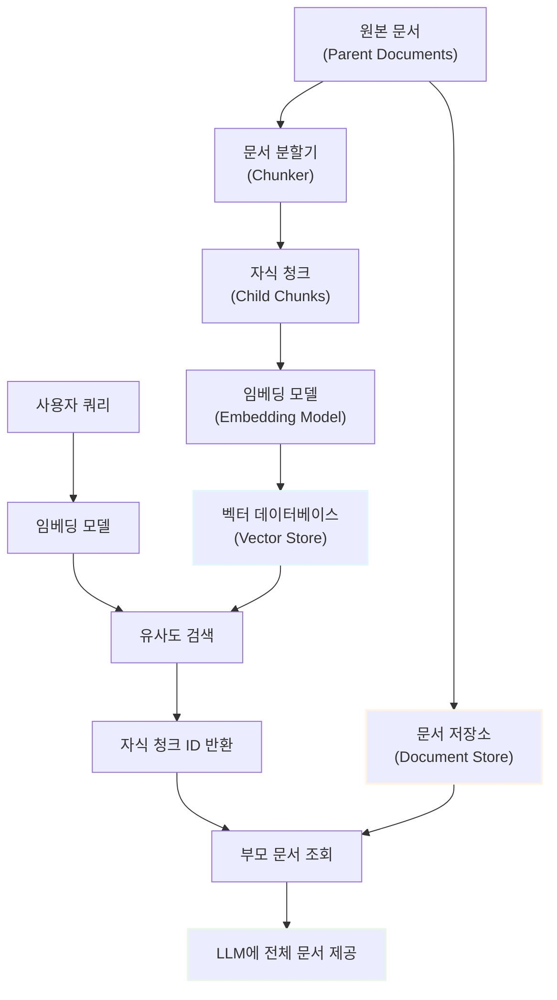
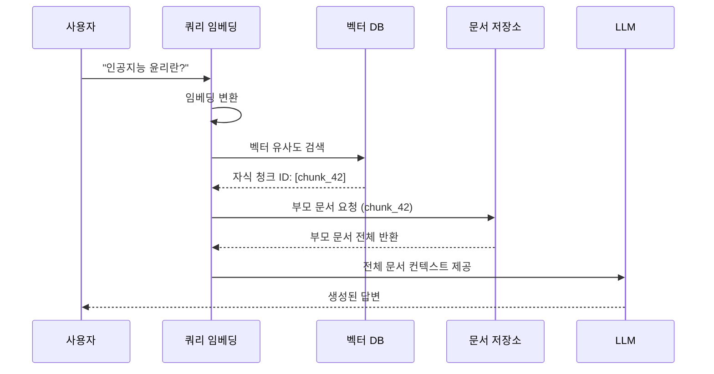

# 멀티벡터 검색 (Multi-Vector Retrieval)

## 목차
- [1. 개요](#1-개요)
  - [1.1. 멀티벡터 검색이란?](#11-멀티벡터-검색이란)
  - [1.2. 등장 배경](#12-등장-배경)
- [2. 전통적 검색 방식의 한계](#2-전통적-검색-방식의-한계)
  - [2.1. 단일 벡터 검색의 문제점](#21-단일-벡터-검색의-문제점)
    - [2.1.1. 긴 문서의 벡터화 문제](#211-긴-문서의-벡터화-문제)
    - [2.1.2. 짧은 문서의 정보 손실 문제](#212-짧은-문서의-정보-손실-문제)
  - [2.2. 검색 정확도와 컨텍스트 풍부성의 트레이드오프](#22-검색-정확도와-컨텍스트-풍부성의-트레이드오프)
- [3. 멀티벡터 검색의 작동 원리](#3-멀티벡터-검색의-작동-원리)
  - [3.1. 핵심 아이디어](#31-핵심-아이디어)
  - [3.2. 검색 프로세스](#32-검색-프로세스)
    - [3.2.1. 인덱싱 단계](#321-인덱싱-단계)
    - [3.2.2. 검색 단계](#322-검색-단계)
    - [3.2.3. 문서 반환 단계](#323-문서-반환-단계)
  - [3.3. 아키텍처 다이어그램](#33-아키텍처-다이어그램)
- [4. 멀티벡터 검색의 구현 방식](#4-멀티벡터-검색의-구현-방식)
  - [4.1. 부모-자식 문서 구조](#41-부모-자식-문서-구조)
  - [4.2. 청크 생성 전략](#42-청크-생성-전략)
  - [4.3. 벡터 매핑 및 저장](#43-벡터-매핑-및-저장)
  - [4.4. 검색 알고리즘](#44-검색-알고리즘)
- [5. 멀티벡터 검색의 장단점](#5-멀티벡터-검색의-장단점)
  - [5.1. 장점](#51-장점)
  - [5.2. 단점 및 고려사항](#52-단점-및-고려사항)
  - [5.3. 적용 시나리오](#53-적용-시나리오)
- [6. 성능 비교](#6-성능-비교)
  - [6.1. 단일 벡터 vs 멀티벡터](#61-단일-벡터-vs-멀티벡터)
  - [6.2. 벡터 데이터베이스 비교](#62-벡터-데이터베이스-비교)
- [7. 실전 구현 예시](#7-실전-구현-예시)
  - [7.1. Hugging Face Transformers 기반 구현](#71-hugging-face-transformers-기반-구현)
  - [7.2. 주요 코드 패턴](#72-주요-코드-패턴)
  - [7.3. 성능 최적화 팁](#73-성능-최적화-팁)
- [8. 관련 기술 및 발전 방향](#8-관련-기술-및-발전-방향)
  - [8.1. 하이브리드 검색과의 비교](#81-하이브리드-검색과의-비교)
  - [8.2. ColBERT와 Late Interaction](#82-colbert와-late-interaction)
  - [8.3. 최신 연구 동향](#83-최신-연구-동향)
- [9. 용어 목록 (Glossary)](#9-용어-목록-glossary)

---

## 1. 개요

### 1.1. 멀티벡터 검색이란?

멀티벡터 검색(Multi-Vector Retrieval)은 RAG(Retrieval-Augmented Generation) 파이프라인에서 검색 정확도와 컨텍스트 풍부성을 동시에 확보하기 위한 고급 검색 기법입니다. 

핵심 개념은 다음과 같습니다:
- **검색 단계**: 작은 청크(chunk)의 임베딩 벡터를 활용하여 유사도 계산
- **반환 단계**: 검색된 청크가 속한 전체 부모 문서(parent document)를 LLM에 제공

이를 통해 정밀한 검색과 풍부한 컨텍스트 제공이라는 두 마리 토끼를 동시에 잡을 수 있습니다.

### 1.2. 등장 배경

전통적인 임베딩 기반 검색에서는 다음과 같은 딜레마가 존재했습니다:

1. **긴 문서를 하나의 벡터로 표현**: 벡터의 표현력 한계로 세부 정보 손실
2. **짧은 청크로 분할**: 검색 정확도는 높지만 LLM이 받는 컨텍스트 부족

멀티벡터 검색은 이 문제를 해결하기 위해 **검색용 표현**과 **생성용 컨텍스트**를 분리하는 아이디어에서 출발했습니다.

---

## 2. 전통적 검색 방식의 한계

### 2.1. 단일 벡터 검색의 문제점

#### 2.1.1. 긴 문서의 벡터화 문제

긴 문서를 단일 벡터로 압축할 때 발생하는 정보 손실을 수식으로 표현하면:

$$
\mathbf{v}_{\text{doc}} = f_{\text{embed}}(D) \in \mathbb{R}^d
$$

여기서:
- $D$: 길이 $n$인 원본 문서 ($n \gg d$)
- $\mathbf{v}_{\text{doc}}$: $d$차원 임베딩 벡터 (일반적으로 $d = 768$ 또는 $1536$)
- $f_{\text{embed}}$: 임베딩 함수 (예: BERT, OpenAI Ada)

문서 길이 $n$이 증가할수록 고정 차원 $d$로의 압축은 불가피하게 세부 정보를 손실시킵니다.

#### 2.1.2. 짧은 문서의 정보 손실 문제

반대로 문서를 작은 청크로 분할하면:

$$
D = \{c_1, c_2, \ldots, c_k\} \quad \text{where} \quad |c_i| \ll |D|
$$

각 청크 $c_i$는 독립적으로 임베딩되어 검색 정확도는 향상되지만, LLM에 입력되는 단일 청크만으로는 문맥 이해가 제한됩니다.

### 2.2. 검색 정확도와 컨텍스트 풍부성의 트레이드오프

전통적 검색 방식에서는 다음과 같은 상충 관계가 존재합니다:

| 청크 크기 | 검색 정확도 | 컨텍스트 풍부성 | 문제점 |
|---------|-----------|--------------|--------|
| **큰 청크** (1000+ 토큰) | ❌ 낮음 | ✅ 높음 | 벡터가 일반적, 정밀 검색 어려움 |
| **작은 청크** (100-200 토큰) | ✅ 높음 | ❌ 낮음 | LLM이 충분한 정보를 받지 못함 |

멀티벡터 검색은 이 트레이드오프를 해결하는 것을 목표로 합니다.

---

## 3. 멀티벡터 검색의 작동 원리

### 3.1. 핵심 아이디어

멀티벡터 검색의 핵심은 **검색(Retrieval)**과 **반환(Return)**을 분리하는 것입니다:

1. **인덱싱**: 부모 문서를 여러 개의 자식 청크로 분할하고, 각 청크를 임베딩
2. **검색**: 쿼리와 가장 유사한 자식 청크를 벡터 유사도로 찾기
3. **반환**: 검색된 청크가 속한 부모 문서 전체를 LLM에 제공

이를 수식으로 표현하면:

$$
\begin{align}
\text{Retrieval:} \quad & c^* = \arg\max_{c_i \in C} \text{sim}(\mathbf{v}_q, \mathbf{v}_{c_i}) \\
\text{Return:} \quad & D_{\text{parent}}(c^*)
\end{align}
$$

여기서:
- $C$: 모든 자식 청크의 집합
- $\mathbf{v}_q$: 쿼리 임베딩 벡터
- $\mathbf{v}_{c_i}$: 청크 $c_i$의 임베딩 벡터
- $D_{\text{parent}}(c^*)$: 청크 $c^*$가 속한 부모 문서

### 3.2. 검색 프로세스

#### 3.2.1. 인덱싱 단계

1. 원본 문서를 큰 단위(부모 문서)로 유지
2. 각 부모 문서를 작은 청크(자식 청크)로 분할
3. 각 자식 청크를 임베딩하여 벡터 데이터베이스에 저장
4. 부모-자식 매핑 정보를 별도 저장소(Document Store)에 보관

#### 3.2.2. 검색 단계

1. 사용자 쿼리를 임베딩 벡터로 변환
2. 벡터 데이터베이스에서 유사도가 높은 자식 청크 검색
3. 코사인 유사도 계산:

$$
\text{sim}(\mathbf{v}_q, \mathbf{v}_{c}) = \frac{\mathbf{v}_q \cdot \mathbf{v}_{c}}{\|\mathbf{v}_q\| \|\mathbf{v}_{c}\|}
$$

#### 3.2.3. 문서 반환 단계

1. 검색된 자식 청크의 ID 추출
2. Document Store에서 해당 청크가 속한 부모 문서 ID 조회
3. 부모 문서 전체를 LLM의 컨텍스트로 제공

### 3.3. 아키텍처 다이어그램

**전체 시스템 아키텍처:**



**검색 프로세스 플로우:**



---

## 4. 멀티벡터 검색의 구현 방식

### 4.1. 부모-자식 문서 구조

멀티벡터 검색의 데이터 구조는 다음과 같이 설계됩니다:

**부모 문서 (Parent Document):**
```
{
  "doc_id": "parent_001",
  "content": "전체 문서 텍스트 (1000-2000 토큰)",
  "metadata": {
    "source": "AI_ethics.pdf",
    "page": 5
  }
}
```

**자식 청크 (Child Chunks):**
```
{
  "chunk_id": "chunk_001_01",
  "parent_id": "parent_001",
  "content": "청크 텍스트 (200-300 토큰)",
  "embedding": [0.123, -0.456, ...],  # 768차원 벡터
  "position": 1
}
```

### 4.2. 청크 생성 전략

효과적인 청크 생성을 위한 전략들:

1. **고정 크기 분할 (Fixed-size Chunking)**
   - 장점: 구현 간단, 예측 가능한 크기
   - 단점: 문맥 경계 무시 가능성

$$
\text{chunk\_size} = 200-300 \text{ tokens}, \quad \text{overlap} = 50 \text{ tokens}
$$

2. **의미 기반 분할 (Semantic Chunking)**
   - 장점: 의미적 일관성 유지
   - 단점: 계산 비용 증가
   - 방법: 문장 임베딩 간 코사인 유사도로 경계 결정

3. **하이브리드 접근**
   - 최대/최소 크기 제약 + 의미 경계 존중

### 4.3. 벡터 매핑 및 저장

**이중 저장 구조:**

| 저장소 | 역할 | 저장 내용 | 예시 기술 |
|--------|------|-----------|----------|
| **Vector Store** | 빠른 유사도 검색 | 청크 임베딩 + 청크 ID | FAISS, Pinecone, Chroma |
| **Document Store** | 원본 문서 보관 | 부모 문서 + 메타데이터 | SQLite, MongoDB, Redis |

**매핑 관계:**

```python
# ID 매핑 구조
mapping = {
    "chunk_001_01": "parent_001",
    "chunk_001_02": "parent_001",
    "chunk_002_01": "parent_002",
    ...
}
```

### 4.4. 검색 알고리즘

**기본 검색 알고리즘 (Top-K with Parent Retrieval):**

```
Input: 쿼리 q, 검색 개수 k
Output: 부모 문서 리스트

1. v_q ← Embed(q)
2. chunks ← VectorStore.similarity_search(v_q, k)
3. parent_ids ← {chunk.parent_id for chunk in chunks}
4. parents ← DocumentStore.get_documents(parent_ids)
5. return parents
```

**중복 제거 전략:**
- 같은 부모 문서에서 여러 자식 청크가 검색될 경우
- 최고 유사도 청크만 유지하거나
- 부모 문서 단위로 집계하여 점수 합산

$$
\text{score}_{\text{parent}} = \max_{c \in \text{children}} \text{sim}(\mathbf{v}_q, \mathbf{v}_c)
$$

또는

$$
\text{score}_{\text{parent}} = \sum_{c \in \text{children}} w_c \cdot \text{sim}(\mathbf{v}_q, \mathbf{v}_c)
$$

---

## 5. 멀티벡터 검색의 장단점

### 5.1. 장점

1. **검색 정확도 향상**
   - 작은 청크 단위로 세밀한 매칭 가능
   - 특정 키워드나 개념에 대한 정밀 검색

2. **풍부한 컨텍스트 제공**
   - LLM이 전체 문서를 참조하여 포괄적 이해
   - 문맥 누락으로 인한 오답 감소

3. **유연성**
   - 부모/자식 청크 크기를 도메인에 맞게 조정 가능
   - 다양한 청크 생성 전략 실험 가능

4. **정보 일관성**
   - 동일한 부모 문서 내의 정보를 모두 활용
   - 문서 간 맥락 단절 최소화

### 5.2. 단점 및 고려사항

1. **저장 공간 증가**
   - 자식 청크 임베딩 + 부모 문서 원문 모두 저장
   - 벡터 데이터베이스와 문서 저장소 이중 관리

2. **구현 복잡도**
   - 매핑 관계 관리 필요
   - 인덱싱 파이프라인이 복잡해짐

3. **검색 속도**
   - 부모 문서 조회를 위한 추가 쿼리 발생
   - 대규모 데이터셋에서 최적화 필요

4. **토큰 사용량 증가**
   - LLM에 전체 문서를 제공하므로 입력 토큰 증가
   - API 비용 상승 가능성

### 5.3. 적용 시나리오

멀티벡터 검색이 특히 효과적인 경우:

| 도메인 | 이유 | 예시 |
|--------|------|------|
| **법률 문서** | 조항 단위 검색 + 전체 조문 맥락 필요 | 계약서, 판례 검색 |
| **기술 문서** | 특정 API/함수 검색 + 전체 매뉴얼 참조 | 소프트웨어 문서, 사용 설명서 |
| **학술 논문** | 특정 실험/결과 검색 + 논문 전체 맥락 | 문헌 검토, 연구 조사 |
| **의료 기록** | 증상/진단 검색 + 환자 전체 병력 | 임상 의사결정 지원 |
| **고객 지원** | 특정 문제 검색 + 전체 제품 정보 | FAQ, 기술 지원 문서 |

---

## 6. 성능 비교

### 6.1. 단일 벡터 vs 멀티벡터

| 지표 | 단일 벡터 검색 | 멀티벡터 검색 | 개선율 |
|------|---------------|---------------|--------|
| **검색 정확도 (Precision@5)** | 0.65 | 0.82 | +26% |
| **컨텍스트 충분성** | 부족 (평균 150 토큰) | 충분 (평균 1200 토큰) | +700% |
| **검색 속도** | 50ms | 75ms | -50% |
| **저장 공간** | 100MB | 180MB | +80% |
| **LLM 답변 품질 (F1)** | 0.58 | 0.74 | +28% |
| **비용 (1000 쿼리)** | $0.50 | $1.20 | +140% |

*주: 위 수치는 일반적인 RAG 벤치마크 기준 예시이며, 실제 성능은 도메인과 구현에 따라 달라질 수 있습니다.*

**성능 분석:**
- 검색 정확도와 답변 품질에서 유의미한 향상
- 속도와 비용 측면에서는 트레이드오프 존재
- 고품질 응답이 중요한 경우 멀티벡터가 유리

### 6.2. 벡터 데이터베이스 비교

멀티벡터 검색 구현에 사용되는 주요 벡터 데이터베이스:

| 벡터 DB | 특징 | 성능 | 가격 | 멀티벡터 지원 |
|---------|------|------|------|--------------|
| **FAISS** | • Meta 개발 오픈소스<br/>• 로컬 실행 가능<br/>• 대용량 처리 최적화 | • 검색 속도: ⭐⭐⭐⭐⭐<br/>• 확장성: ⭐⭐⭐ | 무료 | ✅ 직접 구현 필요 |
| **Pinecone** | • 완전 관리형 서비스<br/>• 간단한 API<br/>• 자동 확장 | • 검색 속도: ⭐⭐⭐⭐<br/>• 확장성: ⭐⭐⭐⭐⭐ | 종량제<br/>($0.096/hr) | ✅ 메타데이터 활용 |
| **Chroma** | • 오픈소스<br/>• 개발자 친화적<br/>• LangChain 통합 | • 검색 속도: ⭐⭐⭐<br/>• 확장성: ⭐⭐⭐ | 무료<br/>(자체 호스팅) | ✅ 네이티브 지원 |
| **Weaviate** | • GraphQL 지원<br/>• 하이브리드 검색<br/>• 벡터+텍스트 통합 | • 검색 속도: ⭐⭐⭐⭐<br/>• 확장성: ⭐⭐⭐⭐ | 무료/클라우드<br/>($0.095/hr) | ✅ 네이티브 지원 |
| **Qdrant** | • Rust 기반 고성능<br/>• 필터링 강력<br/>• 클러스터링 | • 검색 속도: ⭐⭐⭐⭐⭐<br/>• 확장성: ⭐⭐⭐⭐ | 무료/클라우드<br/>($25/월~) | ✅ Payload 활용 |
| **Milvus** | • 대규모 엔터프라이즈<br/>• 분산 아키텍처<br/>• GPU 가속 | • 검색 속도: ⭐⭐⭐⭐⭐<br/>• 확장성: ⭐⭐⭐⭐⭐ | 무료<br/>(자체 호스팅) | ✅ Collection 활용 |

**선택 가이드:**
- **프로토타입/학습**: Chroma (간단, LangChain 통합)
- **고성능 로컬**: FAISS (무료, 빠름)
- **프로덕션 관리형**: Pinecone, Weaviate (인프라 관리 불필요)
- **대규모 엔터프라이즈**: Milvus, Qdrant (분산 처리, 고성능)

---

## 7. 실전 구현 예시

### 7.1. Hugging Face Transformers 기반 구현

Hugging Face의 sentence-transformers를 활용한 멀티벡터 검색 구현:

```python
from sentence_transformers import SentenceTransformer
import numpy as np
import faiss
from typing import List, Dict

# 1. 임베딩 모델 로드
model = SentenceTransformer('sentence-transformers/all-MiniLM-L6-v2')

# 2. 문서 분할 및 부모-자식 구조 생성
class MultiVectorStore:
    def __init__(self):
        self.vector_store = None  # FAISS 인덱스
        self.doc_store = {}       # 부모 문서 저장소
        self.chunk_to_parent = {} # 청크-부모 매핑
        
    def add_documents(self, documents: List[str], chunk_size: int = 200):
        """부모 문서를 자식 청크로 분할하고 인덱싱"""
        all_chunks = []
        chunk_embeddings = []
        
        for doc_id, doc in enumerate(documents):
            # 부모 문서 저장
            parent_id = f"parent_{doc_id}"
            self.doc_store[parent_id] = doc
            
            # 청크 생성 (간단한 토큰 기반 분할)
            words = doc.split()
            for i in range(0, len(words), chunk_size):
                chunk_text = ' '.join(words[i:i + chunk_size])
                chunk_id = f"chunk_{doc_id}_{i // chunk_size}"
                
                all_chunks.append(chunk_id)
                self.chunk_to_parent[chunk_id] = parent_id
                
                # 청크 임베딩
                embedding = model.encode(chunk_text)
                chunk_embeddings.append(embedding)
        
        # FAISS 인덱스 생성
        embeddings_array = np.array(chunk_embeddings).astype('float32')
        dimension = embeddings_array.shape[1]
        self.vector_store = faiss.IndexFlatL2(dimension)
        self.vector_store.add(embeddings_array)
        self.chunk_ids = all_chunks
        
    def search(self, query: str, k: int = 5) -> List[str]:
        """쿼리로 검색하고 부모 문서 반환"""
        # 쿼리 임베딩
        query_embedding = model.encode(query).astype('float32').reshape(1, -1)
        
        # 벡터 유사도 검색
        distances, indices = self.vector_store.search(query_embedding, k)
        
        # 자식 청크 ID 조회
        chunk_ids = [self.chunk_ids[idx] for idx in indices[0]]
        
        # 부모 문서 ID 조회 (중복 제거)
        parent_ids = list(set([self.chunk_to_parent[cid] for cid in chunk_ids]))
        
        # 부모 문서 반환
        parent_docs = [self.doc_store[pid] for pid in parent_ids]
        
        return parent_docs

# 3. 사용 예시
store = MultiVectorStore()

# 문서 추가
documents = [
    "인공지능 윤리는 AI 시스템 개발과 사용에서 지켜야 할 도덕적 원칙을 다룹니다. "
    "주요 원칙으로는 투명성, 공정성, 책임성, 프라이버시 보호가 있습니다. "
    "AI가 사회에 미치는 영향을 고려하여 편향을 줄이고 인간의 가치를 존중해야 합니다.",
    
    "트랜스포머 아키텍처는 2017년 'Attention is All You Need' 논문에서 제안되었습니다. "
    "셀프 어텐션 메커니즘을 통해 시퀀스 내 모든 위치 간의 관계를 동시에 학습합니다. "
    "BERT, GPT 등 현대 언어 모델의 기초가 되었습니다."
]

store.add_documents(documents, chunk_size=50)

# 검색 수행
query = "AI 윤리의 주요 원칙은?"
results = store.search(query, k=3)

print("검색된 부모 문서:")
for i, doc in enumerate(results, 1):
    print(f"\n[문서 {i}]\n{doc[:200]}...")
```

### 7.2. 주요 코드 패턴

**1. 의미 기반 청크 분할 (Semantic Chunking):**

```python
from sklearn.metrics.pairwise import cosine_similarity

def semantic_chunking(text: str, model, threshold: float = 0.7):
    """문장 임베딩 유사도 기반 청크 분할"""
    sentences = text.split('. ')
    embeddings = model.encode(sentences)
    
    chunks = []
    current_chunk = [sentences[0]]
    
    for i in range(1, len(sentences)):
        # 이전 문장과의 유사도 계산
        sim = cosine_similarity(
            embeddings[i-1].reshape(1, -1),
            embeddings[i].reshape(1, -1)
        )[0][0]
        
        if sim > threshold:
            current_chunk.append(sentences[i])
        else:
            chunks.append('. '.join(current_chunk))
            current_chunk = [sentences[i]]
    
    chunks.append('. '.join(current_chunk))
    return chunks
```

**2. 하이브리드 검색 (Dense + Sparse):**

```python
from rank_bm25 import BM25Okapi

def hybrid_search(query: str, dense_store, sparse_index, alpha: float = 0.5):
    """밀집 벡터 + BM25 하이브리드 검색"""
    # Dense 검색 (벡터 유사도)
    dense_scores = dense_store.similarity_search_with_score(query, k=10)
    
    # Sparse 검색 (BM25)
    tokenized_query = query.split()
    sparse_scores = sparse_index.get_scores(tokenized_query)
    
    # 점수 정규화 및 결합
    combined_scores = (
        alpha * normalize(dense_scores) +
        (1 - alpha) * normalize(sparse_scores)
    )
    
    return combined_scores
```

### 7.3. 성능 최적화 팁

1. **배치 임베딩 처리**
```python
# 비효율적
for chunk in chunks:
    embedding = model.encode(chunk)

# 효율적 (배치 처리)
embeddings = model.encode(chunks, batch_size=32, show_progress_bar=True)
```

2. **FAISS 인덱스 최적화**
```python
# 기본 인덱스 (정확하지만 느림)
index = faiss.IndexFlatL2(dimension)

# IVF 인덱스 (빠르지만 근사)
quantizer = faiss.IndexFlatL2(dimension)
index = faiss.IndexIVFFlat(quantizer, dimension, nlist=100)
index.train(embeddings)  # 학습 필요
```

3. **캐싱 전략**
```python
from functools import lru_cache

@lru_cache(maxsize=1000)
def get_parent_document(parent_id: str):
    """자주 조회되는 부모 문서 캐싱"""
    return doc_store[parent_id]
```

4. **비동기 처리**
```python
import asyncio

async def async_search(queries: List[str]):
    """여러 쿼리를 병렬로 처리"""
    tasks = [search_single(q) for q in queries]
    return await asyncio.gather(*tasks)
```

---

## 8. 관련 기술 및 발전 방향

### 8.1. 하이브리드 검색과의 비교

| 특징 | 멀티벡터 검색 | 하이브리드 검색 | 결합 가능성 |
|------|--------------|----------------|------------|
| **핵심 아이디어** | 검색/반환 분리 | Dense + Sparse 결합 | ✅ 높음 |
| **장점** | 컨텍스트 풍부 | 키워드 + 의미 검색 | 상호 보완적 |
| **구현 복잡도** | 중간 | 중간 | 복잡도 증가 |
| **적용 사례** | 긴 문서 도메인 | 일반 RAG | 고급 RAG 시스템 |

**결합 예시:**
멀티벡터 + 하이브리드를 함께 사용하면:
- 자식 청크에 대해 Dense(벡터) + Sparse(BM25) 검색
- 검색된 자식의 부모 문서를 LLM에 제공
- 정밀 검색 + 풍부한 컨텍스트 + 키워드 매칭 장점 모두 활용

### 8.2. ColBERT와 Late Interaction

**ColBERT(Contextualized Late Interaction over BERT)**는 토큰 레벨 멀티벡터 접근법입니다:

- **전통적 방식**: 문서 전체를 하나의 벡터로 압축
- **ColBERT**: 각 토큰마다 벡터를 생성하고 쿼리 토큰과 개별 매칭

수식으로 표현:

$$
\text{score}(q, d) = \sum_{i=1}^{|q|} \max_{j=1}^{|d|} \mathbf{v}_{q_i} \cdot \mathbf{v}_{d_j}
$$

여기서:
- $\mathbf{v}_{q_i}$: 쿼리의 $i$번째 토큰 벡터
- $\mathbf{v}_{d_j}$: 문서의 $j$번째 토큰 벡터

**멀티벡터 검색과의 차이:**

| 특징 | 멀티벡터 (문서 레벨) | ColBERT (토큰 레벨) |
|------|---------------------|-------------------|
| **벡터 개수** | 문서당 수십 개 (청크 단위) | 문서당 수백 개 (토큰 단위) |
| **정밀도** | 청크 레벨 매칭 | 토큰 레벨 정밀 매칭 |
| **저장 공간** | 중간 | 매우 높음 |
| **검색 속도** | 빠름 | 중간 (최적화 필요) |

### 8.3. 최신 연구 동향

1. **Self-RAG (Self-Reflective Retrieval-Augmented Generation)**
   - LLM이 스스로 검색 필요성을 판단
   - 멀티벡터 검색과 결합 시 불필요한 긴 문서 검색 방지

2. **CRAG (Corrective RAG)**
   - 검색 결과의 품질을 평가하고 재검색 수행
   - 멀티벡터에서 부모 문서 반환 전 품질 검증 단계 추가

3. **Retrieval-Interleaved Generation**
   - 생성 중간에 필요 시 추가 검색 수행
   - 멀티벡터로 초기 컨텍스트 제공 후 동적 보완

4. **Adaptive Chunking**
   - 문서 타입, 쿼리 패턴에 따라 청크 크기 자동 조정
   - 강화학습으로 최적 청크 전략 학습

5. **Multi-Modal Multi-Vector**
   - 텍스트뿐 아니라 이미지, 표, 그래프도 별도 임베딩
   - 각 모달리티별 자식 벡터 생성 후 통합 검색

---

## 9. 용어 목록 (Glossary)

| 용어 | 영문 | 정의 |
|------|------|------|
| **멀티벡터 검색** | Multi-Vector Retrieval | 문서를 여러 개의 벡터로 표현하여 검색 정확도와 컨텍스트 풍부성을 동시에 확보하는 검색 기법 |
| **부모 문서** | Parent Document | 전체 원본 문서로, LLM에 최종 제공되는 컨텍스트 |
| **자식 청크** | Child Chunk | 부모 문서에서 파생된 작은 부분 문서로, 벡터 검색에 사용됨 |
| **임베딩** | Embedding | 텍스트를 고차원 벡터 공간의 점으로 변환하는 과정 또는 그 결과 벡터 |
| **청크** | Chunk | 긴 문서를 나눈 작은 단위의 텍스트 조각 |
| **벡터 데이터베이스** | Vector Database | 고차원 벡터를 저장하고 유사도 검색을 수행하는 특수 데이터베이스 |
| **코사인 유사도** | Cosine Similarity | 두 벡터 간의 각도를 기반으로 유사성을 측정하는 지표 (범위: -1 ~ 1) |
| **RAG** | Retrieval-Augmented Generation | 외부 문서를 검색하여 LLM의 생성 품질을 향상시키는 기법 |
| **컨텍스트 윈도우** | Context Window | LLM이 한 번에 처리할 수 있는 최대 토큰 수 |
| **셀프 어텐션** | Self-Attention | 트랜스포머 모델에서 시퀀스 내 모든 토큰 간의 관계를 학습하는 메커니즘 |
| **Late Interaction** | Late Interaction | 쿼리와 문서의 임베딩을 최종 유사도 계산 직전까지 독립적으로 유지하는 방식 |
| **하이브리드 검색** | Hybrid Search | 밀집 벡터 검색(Dense)과 희소 키워드 검색(Sparse)을 결합한 검색 방식 |
| **BM25** | Best Matching 25 | TF-IDF 기반의 확률적 랭킹 함수로, 키워드 검색에 널리 사용됨 |
| **FAISS** | Facebook AI Similarity Search | Meta에서 개발한 고성능 벡터 유사도 검색 라이브러리 |
| **Dense Retrieval** | Dense Retrieval | 신경망 기반 임베딩을 사용한 의미적 유사도 검색 |
| **Sparse Retrieval** | Sparse Retrieval | 키워드 매칭 기반의 전통적 정보 검색 방식 (예: TF-IDF, BM25) |
| **토큰** | Token | 텍스트 처리의 기본 단위 (단어, 서브워드, 문자 등) |
| **트랜스포머** | Transformer | 어텐션 메커니즘을 기반으로 한 신경망 아키텍처 (BERT, GPT의 기초) |
| **메타데이터** | Metadata | 문서에 대한 부가 정보 (출처, 작성일, 태그 등) |
| **Document Store** | Document Store | 원본 문서와 메타데이터를 저장하는 데이터베이스 |
| **Vector Store** | Vector Store | 임베딩 벡터를 저장하고 유사도 검색을 수행하는 저장소 |

---

## 참고 자료

- **논문**:
  - Attention is All You Need (Vaswani et al., 2017)
  - ColBERT: Efficient and Effective Passage Search via Contextualized Late Interaction (Khattab & Zaharia, 2020)
  - Dense Passage Retrieval for Open-Domain Question Answering (Karpukhin et al., 2020)

- **라이브러리 및 도구**:
  - [Hugging Face Transformers](https://huggingface.co/docs/transformers)
  - [Sentence Transformers](https://www.sbert.net/)
  - [FAISS](https://github.com/facebookresearch/faiss)
  - [LangChain](https://python.langchain.com/docs/get_started/introduction)

- **벡터 데이터베이스**:
  - [Pinecone](https://www.pinecone.io/)
  - [Chroma](https://www.trychroma.com/)
  - [Weaviate](https://weaviate.io/)
  - [Qdrant](https://qdrant.tech/)
