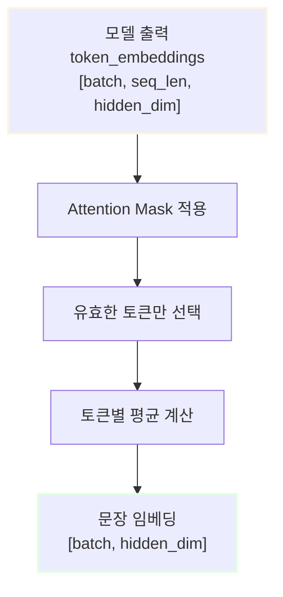

# 커스텀 임베딩 만들기: 허깅페이스 모델로 구현하기

## 목차

1. [커스텀 임베딩이란?](#1-커스텀-임베딩이란)
   - 1.1. [임베딩의 기본 개념](#11-임베딩의-기본-개념)
   - 1.2. [커스텀 임베딩이 필요한 이유](#12-커스텀-임베딩이-필요한-이유)
   - 1.3. [LangChain의 Embeddings 인터페이스](#13-langchain의-embeddings-인터페이스)
2. [허깅페이스 모델로 커스텀 임베딩 구현하기](#2-허깅페이스-모델로-커스텀-임베딩-구현하기)
   - 2.1. [필요한 라이브러리 설치](#21-필요한-라이브러리-설치)
   - 2.2. [평균 풀링(Mean Pooling) 이해하기](#22-평균-풀링mean-pooling-이해하기)
   - 2.3. [Embeddings 클래스 상속 및 구현](#23-embeddings-클래스-상속-및-구현)
   - 2.4. [완성된 커스텀 임베딩 클래스](#24-완성된-커스텀-임베딩-클래스)
3. [실전 예제: 커스텀 임베딩 사용하기](#3-실전-예제-커스텀-임베딩-사용하기)
   - 3.1. [모델 로드 및 초기화](#31-모델-로드-및-초기화)
   - 3.2. [텍스트 임베딩 생성](#32-텍스트-임베딩-생성)
   - 3.3. [벡터 스토어와 통합](#33-벡터-스토어와-통합)
4. [용어 목록 (Glossary)](#4-용어-목록-glossary)

---

## 1. 커스텀 임베딩이란?

### 1.1. 임베딩의 기본 개념

**임베딩(Embedding)**은 텍스트, 이미지 등의 데이터를 고정된 크기의 숫자 벡터로 변환하는 기술입니다. 의미가 유사한 텍스트는 벡터 공간에서 가까운 위치에 배치되어, 기계가 의미를 이해하고 비교할 수 있게 됩니다.


예를 들어, "강아지"와 "개"는 의미가 유사하므로 임베딩 벡터 간의 코사인 유사도(Cosine Similarity)가 높게 나타납니다.

### 1.2. 커스텀 임베딩이 필요한 이유

LangChain은 OpenAI, Cohere 등 주요 임베딩 서비스를 기본 지원하지만, 다음과 같은 경우 커스텀 임베딩이 필요합니다:

1. **등록되지 않은 모델 사용**: LangChain에서 공식 지원하지 않는 허깅페이스(Hugging Face) 모델 활용
2. **특화된 도메인**: 의료, 법률, 금융 등 특정 분야에 특화된 모델 사용
3. **한국어 최적화**: 한국어 성능이 우수한 모델 선택 (예: `jhgan/ko-sroberta-multitask`)
4. **비용 절감**: 무료 오픈소스 모델로 API 비용 절감
5. **프라이버시**: 민감한 데이터를 외부 API로 전송하지 않고 로컬 처리

### 1.3. LangChain의 Embeddings 인터페이스

LangChain은 다양한 임베딩 모델을 통일된 방식으로 사용할 수 있도록 **추상 클래스**인 `Embeddings`를 제공합니다.

```python
from langchain.embeddings.base import Embeddings
from typing import List

class Embeddings:
    """임베딩 인터페이스 추상 클래스"""
    
    def embed_documents(self, texts: List[str]) -> List[List[float]]:
        """여러 문서를 임베딩합니다."""
        raise NotImplementedError
    
    def embed_query(self, text: str) -> List[float]:
        """단일 쿼리를 임베딩합니다."""
        raise NotImplementedError
```

**핵심 메서드**:
- `embed_documents`: 여러 문서(문자열 리스트)를 한 번에 임베딩
- `embed_query`: 검색 쿼리 등 단일 문자열을 임베딩

---

## 2. 허깅페이스 모델로 커스텀 임베딩 구현하기

### 2.1. 필요한 라이브러리 설치

먼저 필요한 Python 라이브러리를 설치합니다:

```bash
pip install transformers torch langchain langchain-community
```

**라이브러리 설명**:
- `transformers`: 허깅페이스의 트랜스포머 모델 라이브러리
- `torch`: PyTorch 딥러닝 프레임워크
- `langchain`: LangChain 핵심 라이브러리
- `langchain-community`: 커뮤니티 통합 도구

### 2.2. 평균 풀링(Mean Pooling) 이해하기

트랜스포머(Transformer) 모델은 각 토큰마다 임베딩 벡터를 출력합니다. 예를 들어, "안녕하세요"라는 문장이 3개의 토큰으로 분리되면, 모델은 `[3, 768]` 크기의 텐서를 출력합니다 (768은 hidden dimension).

하지만 우리는 **문장 전체**를 대표하는 하나의 벡터 `[768]`이 필요합니다. 이를 위해 **평균 풀링(Mean Pooling)**을 사용합니다.



**평균 풀링 수식**:

문장 $s$의 토큰 임베딩을 $h_1, h_2, ..., h_n$이라 할 때, 문장 임베딩 $e_s$는:

$$
e_s = \frac{1}{n} \sum_{i=1}^{n} h_i
$$

단, Attention Mask $m_i \in \{0, 1\}$를 고려한 **가중 평균**:

$$
e_s = \frac{\sum_{i=1}^{n} m_i \cdot h_i}{\sum_{i=1}^{n} m_i}
$$

여기서:
- $m_i = 1$: 실제 토큰 (유효한 데이터)
- $m_i = 0$: 패딩 토큰 (무시해야 할 데이터)

**Python 구현**:

```python
import torch
import torch.nn.functional as F

def mean_pooling(model_output, attention_mask):
    """
    평균 풀링을 수행하여 문장 임베딩을 생성합니다.
    
    Args:
        model_output: 모델의 출력 (BaseModelOutputWithPoolingAndCrossAttentions)
        attention_mask: 어텐션 마스크 텐서 [batch_size, seq_length]
    
    Returns:
        torch.Tensor: 문장 임베딩 [batch_size, hidden_dim]
    """
    # 모델의 마지막 hidden state 추출
    token_embeddings = model_output[0]  # Shape: [batch_size, seq_length, hidden_dim]
    
    # attention_mask를 확장하여 token_embeddings와 같은 차원으로 만들기
    # [batch_size, seq_length] -> [batch_size, seq_length, hidden_dim]
    input_mask_expanded = attention_mask.unsqueeze(-1).expand(token_embeddings.size()).float()
    
    # 유효한 토큰의 임베딩만 합산
    sum_embeddings = torch.sum(token_embeddings * input_mask_expanded, dim=1)
    
    # 유효한 토큰의 개수로 나누기 (평균 계산)
    sum_mask = torch.clamp(input_mask_expanded.sum(dim=1), min=1e-9)  # 0으로 나누기 방지
    
    return sum_embeddings / sum_mask
```

**주요 포인트**:
1. `attention_mask`를 사용해 패딩 토큰을 제외
2. `unsqueeze(-1).expand()`로 차원 맞추기
3. `torch.clamp()`로 0 나누기 방지

### 2.3. Embeddings 클래스 상속 및 구현

이제 LangChain의 `Embeddings` 클래스를 상속받아 커스텀 임베딩을 구현합니다.

#### 2.3.1. embed_documents 메서드 구현

```python
from langchain.embeddings.base import Embeddings
from transformers import AutoTokenizer, AutoModel
import torch
from typing import List

class CustomHuggingFaceEmbeddings(Embeddings):
    """허깅페이스 모델을 사용한 커스텀 임베딩 클래스"""
    
    def __init__(self, model_name: str, device: str = None):
        """
        Args:
            model_name: 허깅페이스 모델 이름 (예: 'jhgan/ko-sroberta-multitask')
            device: 사용할 디바이스 ('cuda', 'cpu', 'mps' 등)
        """
        self.tokenizer = AutoTokenizer.from_pretrained(model_name)
        self.model = AutoModel.from_pretrained(model_name)
        
        # 디바이스 자동 설정
        if device is None:
            if torch.cuda.is_available():
                self.device = torch.device('cuda')
            elif torch.backends.mps.is_available():
                self.device = torch.device('mps')  # Apple Silicon
            else:
                self.device = torch.device('cpu')
        else:
            self.device = torch.device(device)
        
        self.model.to(self.device)
        self.model.eval()  # 추론 모드로 설정
    
    def embed_documents(self, texts: List[str]) -> List[List[float]]:
        """
        여러 문서를 임베딩합니다.
        
        Args:
            texts: 임베딩할 문서 리스트
        
        Returns:
            List[List[float]]: 각 문서의 임베딩 벡터 리스트
        """
        # 토큰화: padding과 truncation 적용
        encoded_input = self.tokenizer(
            texts,
            padding=True,
            truncation=True,
            max_length=512,
            return_tensors='pt'
        )
        
        # 디바이스로 이동
        encoded_input = {k: v.to(self.device) for k, v in encoded_input.items()}
        
        # 모델 추론 (gradient 계산 비활성화)
        with torch.no_grad():
            model_output = self.model(**encoded_input)
        
        # 평균 풀링 적용
        embeddings = self._mean_pooling(model_output, encoded_input['attention_mask'])
        
        # 정규화 (L2 normalization)
        embeddings = torch.nn.functional.normalize(embeddings, p=2, dim=1)
        
        # CPU로 이동 후 리스트로 변환
        return embeddings.cpu().tolist()
    
    def _mean_pooling(self, model_output, attention_mask):
        """평균 풀링 헬퍼 메서드"""
        token_embeddings = model_output[0]
        input_mask_expanded = attention_mask.unsqueeze(-1).expand(token_embeddings.size()).float()
        sum_embeddings = torch.sum(token_embeddings * input_mask_expanded, dim=1)
        sum_mask = torch.clamp(input_mask_expanded.sum(dim=1), min=1e-9)
        return sum_embeddings / sum_mask
```

#### 2.3.2. embed_query 메서드 구현

검색 쿼리는 단일 문자열이므로, `embed_documents`를 재사용합니다:

```python
    def embed_query(self, text: str) -> List[float]:
        """
        단일 쿼리를 임베딩합니다.
        
        Args:
            text: 임베딩할 쿼리 문자열
        
        Returns:
            List[float]: 쿼리의 임베딩 벡터
        """
        # embed_documents를 재사용 (리스트로 감싸서 전달)
        return self.embed_documents([text])[0]
```

**설계 원칙**:
- `embed_query`는 `embed_documents`를 호출하여 코드 중복 방지
- 단일 문자열을 리스트로 감싼 후, 첫 번째 결과만 반환

### 2.4. 완성된 커스텀 임베딩 클래스

전체 코드를 하나로 통합한 완성본입니다:

```python
from langchain.embeddings.base import Embeddings
from transformers import AutoTokenizer, AutoModel
import torch
import torch.nn.functional as F
from typing import List

class CustomHuggingFaceEmbeddings(Embeddings):
    """
    허깅페이스 모델을 사용한 커스텀 임베딩 클래스
    
    LangChain의 Embeddings 인터페이스를 구현하여,
    등록되지 않은 허깅페이스 모델로 임베딩을 생성합니다.
    """
    
    def __init__(self, model_name: str, device: str = None):
        """
        Args:
            model_name: 허깅페이스 모델 이름
            device: 사용할 디바이스 ('cuda', 'cpu', 'mps' 등)
        """
        self.tokenizer = AutoTokenizer.from_pretrained(model_name)
        self.model = AutoModel.from_pretrained(model_name)
        
        # 디바이스 자동 설정
        if device is None:
            if torch.cuda.is_available():
                self.device = torch.device('cuda')
            elif torch.backends.mps.is_available():
                self.device = torch.device('mps')
            else:
                self.device = torch.device('cpu')
        else:
            self.device = torch.device(device)
        
        self.model.to(self.device)
        self.model.eval()
        
        print(f"✅ 모델 로드 완료: {model_name}")
        print(f"📍 디바이스: {self.device}")
    
    def embed_documents(self, texts: List[str]) -> List[List[float]]:
        """여러 문서를 임베딩합니다."""
        encoded_input = self.tokenizer(
            texts,
            padding=True,
            truncation=True,
            max_length=512,
            return_tensors='pt'
        )
        
        encoded_input = {k: v.to(self.device) for k, v in encoded_input.items()}
        
        with torch.no_grad():
            model_output = self.model(**encoded_input)
        
        embeddings = self._mean_pooling(model_output, encoded_input['attention_mask'])
        embeddings = F.normalize(embeddings, p=2, dim=1)
        
        return embeddings.cpu().tolist()
    
    def embed_query(self, text: str) -> List[float]:
        """단일 쿼리를 임베딩합니다."""
        return self.embed_documents([text])[0]
    
    def _mean_pooling(self, model_output, attention_mask):
        """평균 풀링을 수행합니다."""
        token_embeddings = model_output[0]
        input_mask_expanded = attention_mask.unsqueeze(-1).expand(token_embeddings.size()).float()
        sum_embeddings = torch.sum(token_embeddings * input_mask_expanded, dim=1)
        sum_mask = torch.clamp(input_mask_expanded.sum(dim=1), min=1e-9)
        return sum_embeddings / sum_mask
```

---

## 3. 실전 예제: 커스텀 임베딩 사용하기

### 3.1. 모델 로드 및 초기화

한국어 임베딩에 최적화된 모델을 사용합니다:

```python
# 커스텀 임베딩 초기화
embeddings = CustomHuggingFaceEmbeddings(
    model_name="jhgan/ko-sroberta-multitask"
)
```

**추천 한국어 모델**:
- `jhgan/ko-sroberta-multitask`: 한국어 문장 임베딩 전용, 멀티태스크 학습
- `BM-K/KoSimCSE-roberta`: SimCSE 기반 한국어 모델
- `snunlp/KR-SBERT-V40K-klueNLI-augSTS`: KLUE 데이터셋 학습

**출력 예시**:
```
✅ 모델 로드 완료: jhgan/ko-sroberta-multitask
📍 디바이스: cuda
```

### 3.2. 텍스트 임베딩 생성

#### 단일 쿼리 임베딩

```python
# 단일 쿼리 임베딩
query = "인공지능 기술의 발전"
query_embedding = embeddings.embed_query(query)

print(f"쿼리: {query}")
print(f"임베딩 차원: {len(query_embedding)}")
print(f"임베딩 벡터 (처음 5개): {query_embedding[:5]}")
```

**출력**:
```
쿼리: 인공지능 기술의 발전
임베딩 차원: 768
임베딩 벡터 (처음 5개): [0.123, -0.456, 0.789, -0.234, 0.567]
```

#### 여러 문서 임베딩

```python
# 여러 문서 임베딩
documents = [
    "머신러닝은 데이터로부터 학습하는 알고리즘입니다.",
    "딥러닝은 인공 신경망을 사용한 기계학습 방법입니다.",
    "자연어 처리는 컴퓨터가 인간의 언어를 이해하는 기술입니다."
]

doc_embeddings = embeddings.embed_documents(documents)

print(f"문서 개수: {len(doc_embeddings)}")
print(f"각 문서의 임베딩 차원: {len(doc_embeddings[0])}")
```

**출력**:
```
문서 개수: 3
각 문서의 임베딩 차원: 768
```

#### 유사도 계산

임베딩 벡터 간의 코사인 유사도를 계산하여 의미적 유사성을 측정할 수 있습니다:

```python
import numpy as np

def cosine_similarity(vec1, vec2):
    """코사인 유사도 계산"""
    return np.dot(vec1, vec2) / (np.linalg.norm(vec1) * np.linalg.norm(vec2))

# 쿼리와 각 문서의 유사도 계산
query_vec = np.array(query_embedding)
for i, doc in enumerate(documents):
    doc_vec = np.array(doc_embeddings[i])
    similarity = cosine_similarity(query_vec, doc_vec)
    print(f"문서 {i+1} 유사도: {similarity:.4f} - {doc[:30]}...")
```

**출력**:
```
문서 1 유사도: 0.7234 - 머신러닝은 데이터로부터 학습하는 알고리즘...
문서 2 유사도: 0.8156 - 딥러닝은 인공 신경망을 사용한 기계학...
문서 3 유사도: 0.6892 - 자연어 처리는 컴퓨터가 인간의 언어...
```

### 3.3. 벡터 스토어와 통합

FAISS(Facebook AI Similarity Search)를 사용하여 벡터 데이터베이스를 구축합니다:

```python
from langchain_community.vectorstores import FAISS
from langchain.docstore.document import Document

# 문서 객체 생성
docs = [
    Document(page_content=text, metadata={"source": f"doc_{i}"})
    for i, text in enumerate(documents)
]

# FAISS 벡터 스토어 생성
vectorstore = FAISS.from_documents(
    documents=docs,
    embedding=embeddings
)

print("✅ 벡터 스토어 생성 완료!")
```

#### 유사도 검색 수행

```python
# 쿼리와 유사한 문서 검색
query = "인공지능과 신경망"
results = vectorstore.similarity_search(query, k=2)

print(f"\n🔍 쿼리: {query}\n")
for i, doc in enumerate(results, 1):
    print(f"{i}. {doc.page_content}")
    print(f"   (출처: {doc.metadata['source']})\n")
```

**출력**:
```
🔍 쿼리: 인공지능과 신경망

1. 딥러닝은 인공 신경망을 사용한 기계학습 방법입니다.
   (출처: doc_1)

2. 머신러닝은 데이터로부터 학습하는 알고리즘입니다.
   (출처: doc_0)
```

#### 점수 포함 검색

```python
# 유사도 점수와 함께 검색
results_with_scores = vectorstore.similarity_search_with_score(query, k=3)

print(f"🔍 쿼리: {query}\n")
for doc, score in results_with_scores:
    print(f"📄 문서: {doc.page_content[:50]}...")
    print(f"   유사도 점수: {score:.4f}\n")
```

**출력**:
```
🔍 쿼리: 인공지능과 신경망

📄 문서: 딥러닝은 인공 신경망을 사용한 기계학습 방법입니다...
   유사도 점수: 0.2341

📄 문서: 머신러닝은 데이터로부터 학습하는 알고리즘입니다...
   유사도 점수: 0.4567

📄 문서: 자연어 처리는 컴퓨터가 인간의 언어를 이해하는 기술...
   유사도 점수: 0.5892
```

> **참고**: FAISS의 거리 점수는 낮을수록 유사도가 높습니다 (L2 거리 기반).

### 완전한 RAG 파이프라인 예제

```python
from langchain.chains import RetrievalQA
from langchain_community.llms import HuggingFacePipeline

# 1. 커스텀 임베딩으로 벡터 스토어 생성
embeddings = CustomHuggingFaceEmbeddings("jhgan/ko-sroberta-multitask")
vectorstore = FAISS.from_documents(docs, embeddings)

# 2. 리트리버 설정
retriever = vectorstore.as_retriever(search_kwargs={"k": 2})

# 3. 검색 결과 확인
query = "딥러닝이 뭔가요?"
retrieved_docs = retriever.get_relevant_documents(query)

print(f"🔍 질문: {query}\n")
print("📚 검색된 문서:")
for i, doc in enumerate(retrieved_docs, 1):
    print(f"{i}. {doc.page_content}\n")
```

**출력**:
```
🔍 질문: 딥러닝이 뭔가요?

📚 검색된 문서:
1. 딥러닝은 인공 신경망을 사용한 기계학습 방법입니다.

2. 머신러닝은 데이터로부터 학습하는 알고리즘입니다.
```

---

## 4. 용어 목록 (Glossary)

| 영문 용어 | 한글 용어 | 설명 |
|---------|---------|------|
| Embedding | 임베딩 | 텍스트나 데이터를 고정 크기의 숫자 벡터로 변환한 것 |
| Transformer | 트랜스포머 | 어텐션 메커니즘 기반의 딥러닝 모델 아키텍처 |
| Mean Pooling | 평균 풀링 | 여러 벡터의 평균을 계산하여 하나의 대표 벡터를 만드는 기법 |
| Attention Mask | 어텐션 마스크 | 유효한 토큰과 패딩 토큰을 구분하는 이진 배열 |
| Token | 토큰 | 텍스트를 모델이 처리할 수 있는 최소 단위로 분할한 것 |
| Tokenizer | 토크나이저 | 텍스트를 토큰으로 분할하는 도구 |
| Hidden Dimension | 히든 차원 | 모델 내부에서 사용하는 벡터의 크기 (예: 768, 1024) |
| Cosine Similarity | 코사인 유사도 | 두 벡터 간의 각도를 이용한 유사도 측정 방법 |
| L2 Normalization | L2 정규화 | 벡터의 크기를 1로 만드는 정규화 기법 |
| Padding | 패딩 | 배치 처리를 위해 짧은 시퀀스를 특수 토큰으로 채우는 것 |
| Truncation | 트렁케이션 | 최대 길이를 초과하는 시퀀스를 자르는 것 |
| Hugging Face | 허깅페이스 | 오픈소스 NLP 모델과 도구를 제공하는 플랫폼 |
| LangChain | 랭체인 | LLM 기반 애플리케이션 개발을 위한 프레임워크 |
| Vector Store | 벡터 스토어 | 임베딩 벡터를 저장하고 검색하는 데이터베이스 |
| FAISS | 페이스 | Facebook AI에서 개발한 고속 유사도 검색 라이브러리 |
| RAG | 검색 증강 생성 | 외부 지식을 검색하여 생성 모델의 답변을 보강하는 기법 |
| Retriever | 리트리버 | 쿼리와 관련된 문서를 검색하는 컴포넌트 |
| Inference | 추론 | 학습된 모델로 예측을 수행하는 과정 |
| Batch Processing | 배치 처리 | 여러 데이터를 한 번에 묶어서 처리하는 방식 |
| GPU | 그래픽 처리 장치 | 병렬 연산에 특화된 하드웨어 (CUDA 지원) |
| CUDA | 쿠다 | NVIDIA GPU에서 병렬 처리를 수행하기 위한 플랫폼 |
| MPS | 메탈 성능 셰이더 | Apple Silicon에서 GPU 가속을 지원하는 프레임워크 |

---

## 참고 자료

- [Hugging Face Transformers 문서](https://huggingface.co/docs/transformers)
- [LangChain 공식 문서](https://python.langchain.com/docs/get_started/introduction)
- [FAISS GitHub](https://github.com/facebookresearch/faiss)
- [한국어 임베딩 모델 리더보드](https://huggingface.co/spaces/mteb/leaderboard)
