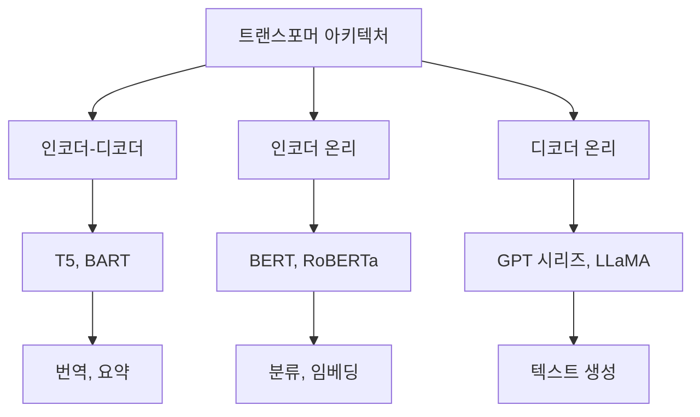
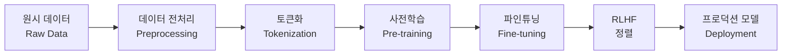
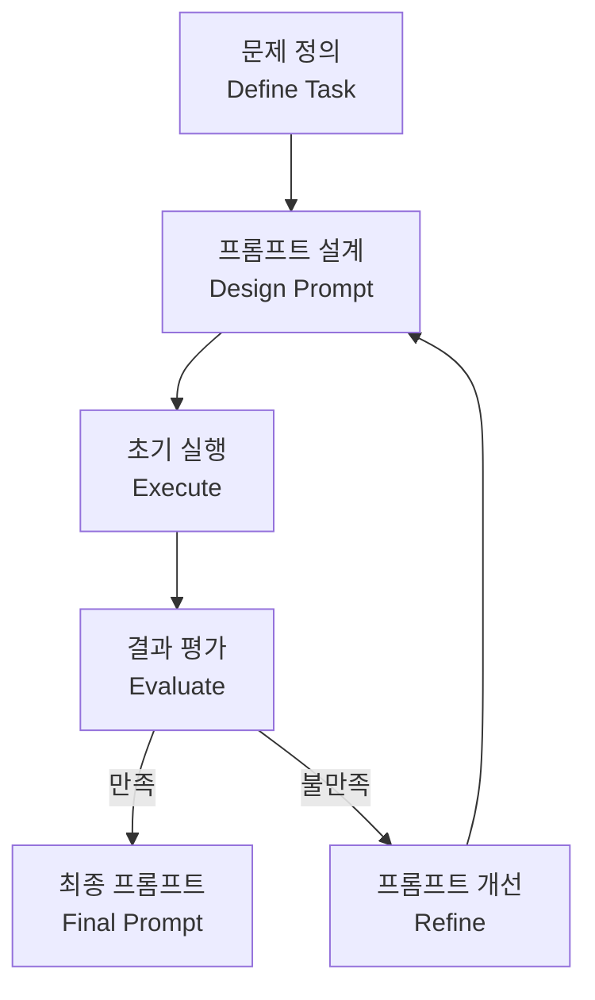
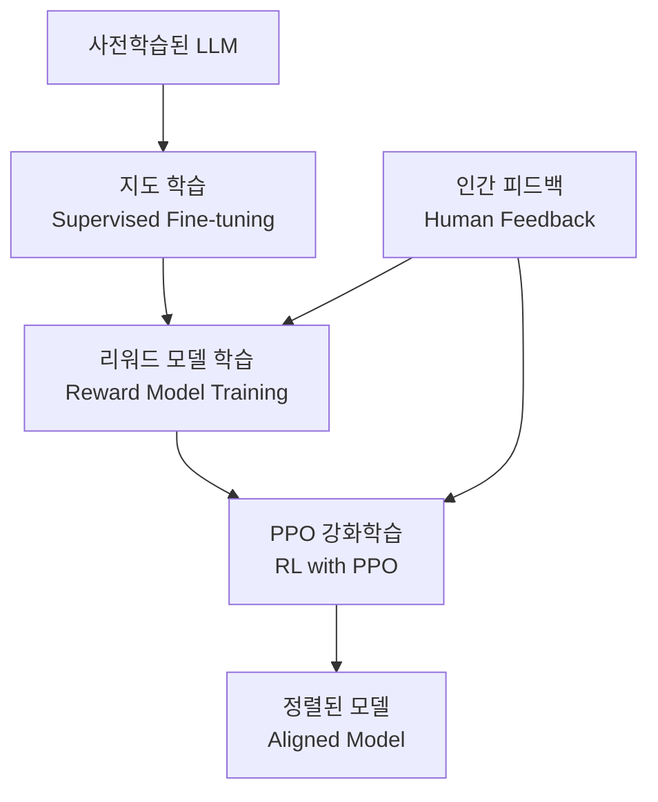

# 대규모 언어모델(LLM)과 프롬프트 엔지니어링

> AI 엔지니어를 위한 핵심 가이드

---

## 목차

1. [대규모 언어모델(LLM) 기초](#1-대규모-언어모델llm-기초)<br/>
   - 1.1. [LLM의 정의와 발전](#11-llm의-정의와-발전)<br/>
   - 1.2. [트랜스포머 아키텍처](#12-트랜스포머-아키텍처)<br/>
     - 1.2.1. [어텐션 메커니즘 핵심 개념](#121-어텐션-메커니즘-핵심-개념)<br/>
     - 1.2.2. [아키텍처 유형](#122-아키텍처-유형)<br/>
   - 1.3. [토큰화와 임베딩](#13-토큰화와-임베딩)<br/>
     - 1.3.1. [토큰화(Tokenization)](#131-토큰화tokenization)<br/>
     - 1.3.2. [임베딩(Embedding)](#132-임베딩embedding)<br/>
   - 1.4. [LLM 학습 파이프라인](#14-llm-학습-파이프라인)<br/>

2. [프롬프트 엔지니어링](#2-프롬프트-엔지니어링)<br/>
   - 2.1. [프롬프트의 정의와 중요성](#21-프롬프트의-정의와-중요성)<br/>
   - 2.2. [프롬프팅 워크플로우](#22-프롬프팅-워크플로우)<br/>
   - 2.3. [프롬프트 구성 요소](#23-프롬프트-구성-요소)<br/>
     - 2.3.1. [프롬프트 구조](#231-프롬프트-구조)<br/>
     - 2.3.2. [컨텍스트 윈도우(Context Window)](#232-컨텍스트-윈도우context-window)<br/>

3. [주요 프롬프트 기법](#3-주요-프롬프트-기법)<br/>
   - 3.1. [프롬프트 기법 비교](#31-프롬프트-기법-비교)<br/>
     - 3.1.1. [Zero-shot 프롬팅(Prompting)](#311-zero-shot-프롬팅prompting)<br/>
     - 3.1.2. [Few-shot 프롬팅](#312-few-shot-프롬팅)<br/>
     - 3.1.3. [Chain-of-Thought (CoT) 프롬팅](#313-chain-of-thought-cot-프롬팅)<br/>
   - 3.2. [실제 예시: 좋은 프롬프트 vs 나쁜 프롬프트](#32-실제-예시-좋은-프롬프트-vs-나쁜-프롬프트)<br/>
     - 3.2.1. [예시 1: 코드 생성](#321-예시-1-코드-생성)<br/>
     - 3.2.2. [예시 2: 텍스트 요약](#322-예시-2-텍스트-요약)<br/>
     - 3.2.3. [예시 3: 데이터 분석](#323-예시-3-데이터-분석)<br/>
     - 3.2.4. [예시 4: 창의적 글쓰기](#324-예시-4-창의적-글쓰기)<br/>

4. [학습 방법론](#4-학습-방법론)<br/>
   - 4.1. [주요 학습 방법](#41-주요-학습-방법)<br/>
     - 4.1.1. [사전학습(Pre-training)](#411-사전학습pre-training)<br/>
     - 4.1.2. [파인튜닝(Fine-tuning)](#412-파인튜닝fine-tuning)<br/>
     - 4.1.3. [RLHF (Reinforcement Learning from Human Feedback)](#413-rlhf-reinforcement-learning-from-human-feedback)<br/>
   - 4.2. [학습 방법론 비교](#42-학습-방법론-비교)<br/>

5. [실무 활용 가이드](#5-실무-활용-가이드)<br/>
   - 5.1. [시나리오별 프롬프트 전략](#51-시나리오별-프롬프트-전략)<br/>
     - 5.1.1. [코드 생성 및 디버깅](#511-코드-생성-및-디버깅)<br/>
     - 5.1.2. [데이터 분석](#512-데이터-분석)<br/>
     - 5.1.3. [문서 작성](#513-문서-작성)<br/>
     - 5.1.4. [교육 및 설명](#514-교육-및-설명)<br/>
   - 5.2. [일반적인 함정과 해결책](#52-일반적인-함정과-해결책)<br/>
     - 5.2.1. [애매한 프롬프트](#521-애매한-프롬프트)<br/>
     - 5.2.2. [컨텍스트 과부하](#522-컨텍스트-과부하)<br/>
     - 5.2.3. [할루시네이션(Hallucination)](#523-할루시네이션hallucination)<br/>
     - 5.2.4. [편향(Bias)과 공정성](#524-편향bias과-공정성)<br/>
     - 5.2.5. [과도한 장황함](#525-과도한-장황함)<br/>
     - 5.2.6. [형식 불일치](#526-형식-불일치)<br/>

6. [용어 목록](#6-용어-목록)<br/>

---

## 1. 대규모 언어모델(LLM) 기초

### 1.1. LLM의 정의와 발전

**대규모 언어모델(Large Language Model, LLM)**은 방대한 텍스트 데이터로 학습된 딥러닝 모델로, 자연어를 이해하고 생성하는 능력을 가진다.

**주요 발전 단계:**
- **2017년**: 트랜스포머(Transformer) 아키텍처 등장
- **2018년**: BERT (인코더 기반), GPT-1 (디코더 기반)
- **2019-2020년**: GPT-2, GPT-3 (파라미터 수 급증)
- **2022년**: ChatGPT (RLHF 적용)
- **2023-현재**: GPT-4, Claude, Gemini 등 멀티모달 LLM

### 1.2. 트랜스포머 아키텍처

트랜스포머는 **어텐션 메커니즘(Attention Mechanism)**을 기반으로 한 신경망 구조로, 순차적 데이터 처리의 병렬화를 가능하게 했다.

#### 1.2.1. 어텐션 메커니즘 핵심 개념

어텐션은 입력 시퀀스의 각 요소가 다른 요소들과 얼마나 관련되어 있는지를 계산한다.

**핵심 수식:**

$$\text{Attention}(Q, K, V) = \text{softmax}\left(\frac{QK^T}{\sqrt{d_k}}\right)V$$

- **Q (Query, 쿼리)**: "무엇을 찾고 있는가?"
- **K (Key, 키)**: "어떤 정보를 가지고 있는가?"
- **V (Value, 밸류)**: "실제 정보 내용"
- **$d_k$**: 키 벡터의 차원 (스케일링 팩터)

#### 1.2.2. 아키텍처 유형



**특징 비교:**

| 유형 | 구조 | 대표 모델 | 주요 용도 |
|------|------|-----------|-----------|
| 인코더-디코더 | 양방향 인코더 + 단방향 디코더 | T5, BART | 번역, 요약 |
| 인코더 온리 | 양방향 어텐션 | BERT | 분류, 임베딩 추출 |
| 디코더 온리 | 단방향 어텐션 | GPT, Claude | 텍스트 생성, 대화 |

### 1.3. 토큰화와 임베딩

#### 1.3.1. 토큰화(Tokenization)

텍스트를 모델이 처리할 수 있는 작은 단위로 분할하는 과정.

**토큰화 방법:**
- **단어 기반**: "Hello world" → ["Hello", "world"]
- **서브워드 기반 (BPE, WordPiece)**: "unhappiness" → ["un", "happiness"]
- **문자 기반**: "AI" → ["A", "I"]

**예시:**
```
입력: "인공지능은 미래다"
토큰: ["인공", "지능", "은", " 미래", "다"]
토큰 ID: [1234, 5678, 91, 1011, 1213]
```

#### 1.3.2. 임베딩(Embedding)

토큰을 고차원 벡터 공간의 점으로 변환하는 과정.

**임베딩 벡터 예시:**
```
"king" → [0.2, 0.5, -0.3, ..., 0.1]  (512차원)
"queen" → [0.3, 0.4, -0.2, ..., 0.0] (512차원)
```

**포지셔널 인코딩(Positional Encoding)**: 토큰의 위치 정보를 임베딩에 추가

$$PE_{(pos, 2i)} = \sin\left(\frac{pos}{10000^{2i/d}}\right)$$

$$PE_{(pos, 2i+1)} = \cos\left(\frac{pos}{10000^{2i/d}}\right)$$

### 1.4. LLM 학습 파이프라인



**각 단계 설명:**

1. **원시 데이터**: 웹 크롤링, 책, 논문 등 대규모 텍스트 코퍼스(Corpus)
2. **전처리**: 중복 제거, 품질 필터링, 포맷 정규화
3. **토큰화**: 텍스트를 토큰 시퀀스로 변환
4. **사전학습**: 다음 토큰 예측 등의 자기지도 학습(Self-supervised Learning)
5. **파인튜닝**: 특정 태스크에 맞게 추가 학습
6. **RLHF**: 인간 피드백을 통한 강화학습으로 모델 정렬(Alignment)
7. **배포**: 실제 서비스에 모델 적용

---

## 2. 프롬프트 엔지니어링

### 2.1. 프롬프트의 정의와 중요성

**프롬프트(Prompt)**는 LLM에게 전달하는 입력 텍스트로, 모델의 출력을 유도하는 지시사항이다.

**프롬프트 엔지니어링(Prompt Engineering)**은 원하는 출력을 얻기 위해 효과적인 프롬프트를 설계하는 기술이다.

**중요성:**
- 같은 모델도 프롬프트에 따라 성능이 크게 달라짐
- 파인튜닝 없이도 모델의 능력을 최대한 활용 가능
- 비용 효율적 (추가 학습 불필요)

### 2.2. 프롬프팅 워크플로우



**반복적 개선 프로세스:**
1. 명확한 태스크 정의
2. 초기 프롬프트 작성
3. 모델 실행 및 결과 확인
4. 문제점 파악 (애매함, 누락, 과도한 정보)
5. 프롬프트 수정 및 재실행
6. 만족할 때까지 반복

### 2.3. 프롬프트 구성 요소

#### 2.3.1. 프롬프트 구조

효과적인 프롬프트는 다음 요소를 포함한다:

1. **역할(Role)**: "당신은 전문 프로그래머입니다"
2. **컨텍스트(Context)**: 배경 정보 제공
3. **태스크(Task)**: 구체적인 요청 사항
4. **형식(Format)**: 원하는 출력 형태
5. **제약(Constraints)**: 제한 사항이나 주의사항

**구조 예시:**
```
[역할] 당신은 Python 전문가입니다.

[컨텍스트] 초보 개발자를 위한 튜토리얼을 작성 중입니다.

[태스크] 리스트 컴프리헨션을 설명해주세요.

[형식] 
- 개념 설명 (2-3문장)
- 간단한 코드 예시 1개
- 실무 활용 팁 1개

[제약] 전문 용어는 한글로 풀어서 설명해주세요.
```

#### 2.3.2. 컨텍스트 윈도우(Context Window)

모델이 한 번에 처리할 수 있는 토큰의 최대 개수.

현재(2025년 10월) 공개된 주요 LLM 모델의 공식 컨텍스트 윈도우 크기

| 모델 (개발사) | 출시 년월 | 컨텍스트 윈도우 크기 (토큰) | 주요 특징 및 비고 |
| :--- | :--- | :--- | :--- |
| **Gemini 2.5 Pro** (Google) | 2025년 4월 | **1,048,576 (1M)** | 현재 가장 안정적이고 효율적인 **1M 토큰** 활용 모델로 평가. (향후 2M 확장 계획 언급) |
| **Claude Sonnet 4.5** (Anthropic) | 2025년 9월 | **200,000 / 1,000,000 (1M)** | 일반 사용자는 **200K**가 기본. API 특정 티어에서 **1M**을 지원. |
| **GPT-5** (OpenAI) | 2025년 8월 | **400,000 / 272,000** | OpenAI의 플래그십 모델. 모델 변형 및 서비스 환경에 따라 지원 크기가 상이함. |
| **Mistral Large 2** (Mistral AI) | 2024년 7월 | **128,000 (128K)** | 유럽 Mistral AI의 최상위 모델. 높은 추론 능력과 안정성. |
| **GPT-4o** (OpenAI) | 2025년 5월 | **128,000 (128K)** | 멀티모달(음성, 이미지) 성능이 강화된 버전. GPT-4 Turbo와 동일한 컨텍스트 크기. |
| **Llama 3.1** (Meta) | 2024년 7월 | **128,000 (128K)** | 가장 강력한 오픈 소스 모델 중 하나. 이전 버전 대비 대폭 확장됨. |


**주의사항:**
- 컨텍스트가 길수록 처리 시간과 비용 증가
- 중요한 정보는 프롬프트 앞부분 또는 뒷부분에 배치 (중간 부분은 상대적으로 약함)

---

## 3. 주요 프롬프트 기법

### 3.1. 프롬프트 기법 비교

| 기법 | 설명 | 예시 제공 | 추론 단계 | 토큰 사용량 | 성능 | 적합한 사용처 |
|------|------|-----------|-----------|-------------|------|---------------|
| **Zero-shot** | 예시 없이 직접 요청 | ❌ | 단일 | ⭐ | ⭐⭐ | 일반적인 질문, 간단한 태스크 |
| **Few-shot** | 소수의 예시 제공 | ✅ (2-5개) | 단일 | ⭐⭐⭐ | ⭐⭐⭐⭐ | 패턴 학습, 형식 지정 |
| **Chain-of-Thought (CoT)** | 단계별 사고 과정 유도 | ✅ | 다단계 | ⭐⭐⭐⭐ | ⭐⭐⭐⭐⭐ | 복잡한 추론, 수학 문제 |
| **Self-Consistency** | 여러 경로로 답 생성 후 투표 | ✅ | 다단계 (병렬) | ⭐⭐⭐⭐⭐ | ⭐⭐⭐⭐⭐ | 정확도가 중요한 태스크 |
| **Tree-of-Thought (ToT)** | 트리 구조로 탐색 | ✅ | 다단계 (트리) | ⭐⭐⭐⭐⭐ | ⭐⭐⭐⭐⭐ | 전략적 계획, 게임 |

#### 3.1.1. Zero-shot 프롬팅(Prompting)

예시 없이 직접 태스크를 요청하는 가장 기본적인 방법.

**예시:**
```
프롬프트: "다음 문장의 감정을 분석해주세요: '오늘 날씨가 정말 좋네요!'"

응답: "긍정적인 감정입니다."
```

#### 3.1.2. Few-shot 프롬팅

몇 가지 예시를 제공하여 패턴을 학습하게 하는 방법.

**예시:**
```
프롬프트:
다음 예시를 참고하여 감정을 분석해주세요.

예시 1:
문장: "시험에 합격했어요!"
감정: 긍정 (기쁨)

예시 2:
문장: "비가 와서 약속을 취소했어요."
감정: 부정 (실망)

예시 3:
문장: "오늘 저녁은 파스타를 먹었어요."
감정: 중립

이제 다음 문장을 분석해주세요:
문장: "드디어 주말이다!"
감정: ?

응답: "긍정 (기대감)"
```

#### 3.1.3. Chain-of-Thought (CoT) 프롬팅

모델이 중간 추론 단계를 명시적으로 생성하도록 유도.

**기본 CoT 예시:**
```
프롬프트:
"사과 3개를 2명이 나눠 먹고, 남은 사과의 절반을 또 다른 1명에게 줬습니다. 
마지막에 남은 사과는 몇 개일까요? 단계별로 풀어서 설명해주세요."

응답:
"단계 1: 사과 3개를 2명이 나눠 먹으므로, 1명당 1.5개씩 먹습니다.
단계 2: 3 - (1.5 × 2) = 3 - 3 = 0개가 남습니다.
단계 3: 남은 사과가 0개이므로, 절반을 줄 수 없습니다.
답: 0개"
```

**Zero-shot CoT (자동 CoT):**
```
프롬프트: 
"문제를 단계별로 생각해봅시다 (Let's think step by step).

사과 5개를 3명이 똑같이 나눠 먹으려고 합니다. 1명당 몇 개를 먹을 수 있나요?"

응답:
"단계 1: 전체 사과는 5개입니다.
단계 2: 나눠 먹을 사람은 3명입니다.
단계 3: 5 ÷ 3 = 1.666...
단계 4: 1명당 약 1.67개를 먹을 수 있습니다."
```

### 3.2. 실제 예시: 좋은 프롬프트 vs 나쁜 프롬프트

#### 3.2.1. 예시 1: 코드 생성

❌ **나쁜 예시:**
```
사용자: "파이썬 코드 짜줘"

문제점:
- 무엇을 만들지 불명확
- 요구사항 없음
- 컨텍스트 부족
```

✅ **좋은 예시:**
```
사용자: 
"Python으로 CSV 파일을 읽어서 특정 컬럼의 평균값을 계산하는 함수를 작성해주세요.

요구사항:
- pandas 라이브러리 사용
- 함수명: calculate_column_average
- 파라미터: file_path (str), column_name (str)
- 반환값: float (평균값)
- 에러 처리: 파일이 없거나 컬럼이 없을 때 예외 처리
- 주석 포함

예시:
calculate_column_average('data.csv', 'age') → 32.5"
```

#### 3.2.2. 예시 2: 텍스트 요약

❌ **나쁜 예시:**
```
사용자: "이 글 요약해줘"
[긴 텍스트 붙여넣기]

문제점:
- 요약 길이 미지정
- 요약 스타일 불명확
- 타겟 독자 불명확
```

✅ **좋은 예시:**
```
사용자:
"다음 논문 초록을 고등학생도 이해할 수 있도록 3-4문장으로 요약해주세요.

요약 시 포함할 내용:
1. 연구 주제
2. 주요 발견
3. 실용적 의미

[논문 초록]
..."
```

#### 3.2.3. 예시 3: 데이터 분석

❌ **나쁜 예시:**
```
사용자: "이 데이터 분석해줘"
[데이터 붙여넣기]

문제점:
- 분석 목적 불명확
- 원하는 인사이트 미지정
- 출력 형식 불명확
```

✅ **좋은 예시:**
```
사용자:
"다음 월별 매출 데이터를 분석해주세요.

데이터: [2024년 1월~12월 매출]

분석 요청사항:
1. 전년 대비 성장률 계산
2. 최고/최저 매출 월 식별
3. 계절성 패턴 파악
4. 2025년 1분기 예측

출력 형식:
- 핵심 인사이트 3가지 (불릿 포인트)
- 간단한 시각화 제안
- 액션 아이템 2가지"
```

#### 3.2.4. 예시 4: 창의적 글쓰기

❌ **나쁜 예시:**
```
사용자: "이야기 하나 써줘"

문제점:
- 장르 미지정
- 분량 불명확
- 타겟 독자 불명확
- 톤 앤 매너 미지정
```

✅ **좋은 예시:**
```
사용자:
"10대 청소년을 위한 단편 SF 소설을 작성해주세요.

설정:
- 배경: 2150년 화성 식민지
- 주인공: 17세 여학생, 컴퓨터 해킹에 능함
- 갈등: 식민지의 생명 유지 시스템 오작동
- 분량: 약 1000-1500단어
- 톤: 긴장감 있지만 희망적인 결말

스타일: 빠른 전개, 생생한 묘사, 현대적인 대화체"
```

---

## 4. 학습 방법론

### 4.1. 주요 학습 방법

#### 4.1.1. 사전학습(Pre-training)

대규모 레이블 없는 텍스트 데이터로 모델을 학습시키는 단계.

**학습 목표:**
- **다음 토큰 예측(Next Token Prediction)**: "오늘 날씨가 정말 [?]" → "좋다"
- **마스크 언어 모델링(Masked Language Modeling)**: "오늘 [MASK]가 좋다" → "날씨"

**특징:**
- 자기지도 학습(Self-supervised Learning)
- 범용적인 언어 이해 능력 획득
- 수백 GB~TB의 텍스트 데이터 사용
- 막대한 컴퓨팅 자원 필요 (수백~수천 개의 GPU)

#### 4.1.2. 파인튜닝(Fine-tuning)

사전학습된 모델을 특정 태스크에 맞게 추가 학습시키는 단계.

**파인튜닝 유형:**

1. **전체 파인튜닝(Full Fine-tuning)**
   - 모든 파라미터를 업데이트
   - 높은 성능, 높은 비용

2. **LoRA (Low-Rank Adaptation)**
   - 일부 가중치 행렬만 학습
   - 효율적, 저비용
   - 수식: $W' = W + AB$ (A, B는 저랭크 행렬)

3. **어댑터(Adapter) 기반**
   - 작은 뉴럴 네트워크 모듈 추가
   - 기존 가중치 동결

#### 4.1.3. RLHF (Reinforcement Learning from Human Feedback)

인간 피드백을 활용한 강화학습으로 모델을 정렬(Alignment)하는 기법.

**RLHF 프로세스:**



**단계별 설명:**

1. **지도 학습(SFT)**: 고품질 인간 작성 응답으로 파인튜닝
2. **리워드 모델**: 인간 선호도 데이터로 보상 함수 학습
3. **강화학습**: PPO(Proximal Policy Optimization) 알고리즘으로 정책 최적화

**효과:**
- 유해한 출력 감소
- 인간 의도에 부합하는 응답 생성
- 사실성과 유용성 향상

### 4.2. 학습 방법론 비교

| 방법론 | 데이터 요구량 | 컴퓨팅 비용 | 학습 시간 | 범용성 | 전문성 | 주요 사용처 |
|--------|--------------|------------|----------|--------|--------|-------------|
| **사전학습** | 매우 큼<br/>(TB급) | 매우 높음<br/>(수천 GPU) | 수주~수개월 | ⭐⭐⭐⭐⭐ | ⭐ | 기반 모델 구축 |
| **전체 파인튜닝** | 중간<br/>(GB급) | 높음<br/>(수십 GPU) | 수일~수주 | ⭐⭐⭐ | ⭐⭐⭐⭐ | 도메인 특화 모델 |
| **LoRA 파인튜닝** | 작음<br/>(MB~GB급) | 낮음<br/>(단일~수 GPU) | 수시간~수일 | ⭐⭐⭐⭐ | ⭐⭐⭐ | 효율적 커스터마이징 |
| **프롬프트 엔지니어링** | 매우 작음<br/>(예시 몇 개) | 매우 낮음<br/>(추론만) | 즉시 | ⭐⭐⭐⭐ | ⭐⭐ | 빠른 프로토타입, 범용 태스크 |
| **RLHF** | 중간<br/>(인간 피드백) | 높음<br/>(수십 GPU) | 수일~수주 | ⭐⭐⭐⭐ | ⭐⭐⭐⭐ | 모델 정렬, 안전성 |

**사용처별 추천:**

| 상황 | 추천 방법 | 이유 |
|------|-----------|------|
| 새로운 언어 모델 개발 | 사전학습 | 기반부터 구축 필요 |
| 의료, 법률 등 전문 도메인 | 전체 파인튜닝 + RLHF | 높은 정확도와 안전성 요구 |
| 제한된 예산과 시간 | LoRA 파인튜닝 | 비용 효율적 |
| 빠른 실험과 프로토타입 | 프롬프트 엔지니어링 | 즉시 적용 가능 |
| 챗봇, 어시스턴트 개발 | SFT + RLHF | 인간 선호도 반영 필요 |

---

## 5. 실무 활용 가이드

### 5.1. 시나리오별 프롬프트 전략

#### 5.1.1. 코드 생성 및 디버깅

**전략:**
- 명확한 입출력 명세
- 사용 언어와 라이브러리 지정
- 에러 처리 요구사항
- 코드 스타일 가이드 (PEP8 등)

**프롬프트 템플릿:**
```
언어: [프로그래밍 언어]
목적: [기능 설명]
입력: [입력 형식 및 타입]
출력: [출력 형식 및 타입]
제약사항: [성능, 메모리 등]
스타일: [코딩 컨벤션]
```

#### 5.1.2. 데이터 분석

**전략:**
- 분석 목적 명시
- 데이터 구조 설명
- 원하는 인사이트 유형
- 시각화 요구사항

**프롬프트 템플릿:**
```
데이터: [데이터 설명]
분석 목표: [무엇을 알고 싶은가]
관심 지표: [KPI, 메트릭]
출력 형식: [테이블, 그래프, 요약문]
```

#### 5.1.3. 문서 작성

**전략:**
- 타겟 독자 정의
- 톤 앤 매너 지정
- 구조와 길이 명시
- 참조 자료 제공

**프롬프트 템플릿:**
```
문서 유형: [보고서, 블로그, 이메일 등]
독자: [배경지식 수준]
목적: [정보 전달, 설득 등]
톤: [공식적, 친근한 등]
길이: [단어/문단 수]
구조: [섹션 구성]
```

#### 5.1.4. 교육 및 설명

**전략:**
- 학습자 수준 고려
- 단계적 설명
- 예시와 비유 활용
- 이해도 확인 질문

**프롬프트 템플릿:**
```
주제: [개념/기술]
대상: [초급/중급/고급]
설명 방식: [비유, 예시, 단계별]
목표: [학습 후 할 수 있어야 하는 것]
```

### 5.2. 일반적인 함정과 해결책

#### 5.2.1. 애매한 프롬프트

**문제:**
```
❌ "AI에 대해 설명해줘"
```

**해결책:**
```
✅ "딥러닝을 처음 배우는 대학생에게 설명하듯이, 
지도학습과 비지도학습의 차이를 실생활 예시 2개씩 들어 
500자 이내로 설명해주세요."
```

**원칙:**
- 5W1H 활용 (누가, 무엇을, 언제, 어디서, 왜, 어떻게)
- 구체적인 제약 조건
- 명확한 출력 형식

#### 5.2.2. 컨텍스트 과부하

**문제:**
```
❌ [10페이지 분량의 문서 전체를 붙여넣고]
"이거 요약해줘"
```

**해결책:**
```
✅ "다음 문서의 핵심 내용을 3가지로 요약해주세요.
각 포인트는 1-2문장으로 작성해주세요.

[관련 부분만 발췌한 텍스트]"
```

**원칙:**
- 필요한 정보만 제공
- 긴 문서는 섹션별로 분할
- 중요 정보는 프롬프트 앞/뒤에 배치

#### 5.2.3. 할루시네이션(Hallucination)

모델이 사실이 아닌 정보를 생성하는 현상.

**예방 전략:**

1. **출처 요구:**
```
"답변 시 정보의 출처나 근거를 명시해주세요."
```

2. **불확실성 표현 허용:**
```
"확실하지 않은 정보는 '불확실함' 또는 '추정'이라고 표시해주세요."
```

3. **사실 확인 요청:**
```
"답변 후, 각 주장의 신뢰도를 0-100% 척도로 평가해주세요."
```

4. **RAG(Retrieval-Augmented Generation) 활용:**
```
"다음 참조 문서의 정보만 사용하여 답변해주세요.
문서에 없는 내용은 '정보 없음'이라고 답해주세요.

[참조 문서]
..."
```

#### 5.2.4. 편향(Bias)과 공정성

**문제:**
LLM은 학습 데이터의 편향을 반영할 수 있음.

**완화 전략:**

1. **다양성 명시:**
```
"다양한 관점을 균형있게 제시해주세요."
```

2. **중립적 표현 요구:**
```
"성별, 인종, 종교 등에 대해 중립적이고 포괄적인 언어를 사용해주세요."
```

3. **편향 확인 요청:**
```
"답변에 잠재적 편향이 있는지 스스로 검토하고, 
있다면 어떤 부분인지 언급해주세요."
```

#### 5.2.5. 과도한 장황함

**문제:**
```
❌ "Python이 뭐야?"
→ [3페이지 분량의 역사와 철학 설명]
```

**해결책:**
```
✅ "Python이 무엇인지 3문장 이내로 간단히 설명해주세요."
```

**원칙:**
- 명확한 길이 제한
- 핵심만 요구
- 필요시 추가 정보 요청

#### 5.2.6. 형식 불일치

**문제:**
```
❌ "데이터를 JSON으로 변환해줘"
→ [마크다운 코드 블록으로 감싼 JSON]
```

**해결책:**
```
✅ "다음 데이터를 순수 JSON 형식으로만 출력해주세요. 
마크다운 코드 블록이나 추가 설명 없이 JSON만 출력하세요.

출력 예시:
{"name": "example", "value": 123}"
```

**원칙:**
- 정확한 출력 형식 명시
- 예시 제공
- 불필요한 요소 제외 명시

---

## 6. 용어 목록

| 용어 | 영문 | 설명 |
|------|------|------|
| 대규모 언어모델 | Large Language Model (LLM) | 방대한 텍스트 데이터로 학습된 딥러닝 모델 |
| 트랜스포머 | Transformer | 어텐션 메커니즘 기반의 신경망 아키텍처 |
| 어텐션 메커니즘 | Attention Mechanism | 입력의 중요한 부분에 가중치를 부여하는 기법 |
| 토큰화 | Tokenization | 텍스트를 작은 단위로 분할하는 과정 |
| 임베딩 | Embedding | 토큰을 고차원 벡터로 변환하는 과정 |
| 프롬프트 | Prompt | LLM에 입력하는 지시사항 또는 질문 |
| 프롬프트 엔지니어링 | Prompt Engineering | 효과적인 프롬프트를 설계하는 기술 |
| 컨텍스트 윈도우 | Context Window | 모델이 한 번에 처리할 수 있는 최대 토큰 수 |
| 제로샷 | Zero-shot | 예시 없이 태스크를 수행하는 방식 |
| 퓨샷 | Few-shot | 소수의 예시를 제공하여 태스크를 수행하는 방식 |
| 사고의 연쇄 | Chain-of-Thought (CoT) | 단계별 추론 과정을 명시적으로 생성하는 기법 |
| 사전학습 | Pre-training | 대규모 데이터로 기본 언어 능력을 학습하는 단계 |
| 파인튜닝 | Fine-tuning | 특정 태스크에 맞게 추가 학습하는 단계 |
| 로라 | Low-Rank Adaptation (LoRA) | 효율적인 파인튜닝 기법 |
| 인간 피드백 강화학습 | Reinforcement Learning from Human Feedback (RLHF) | 인간 선호도를 반영하는 강화학습 기법 |
| 할루시네이션 | Hallucination | 모델이 사실이 아닌 정보를 생성하는 현상 |
| 정렬 | Alignment | 모델의 출력을 인간의 가치와 의도에 맞추는 과정 |
| 인코더 | Encoder | 입력을 이해하고 표현을 생성하는 구조 |
| 디코더 | Decoder | 표현을 기반으로 출력을 생성하는 구조 |
| 자기지도 학습 | Self-supervised Learning | 레이블 없이 데이터 자체로부터 학습하는 방식 |
| 파라미터 | Parameter | 모델의 학습 가능한 가중치 |
| 추론 | Inference | 학습된 모델로 예측을 수행하는 과정 |
| 검색 증강 생성 | Retrieval-Augmented Generation (RAG) | 외부 지식을 검색하여 생성에 활용하는 기법 |
| 코퍼스 | Corpus | 학습에 사용되는 대규모 텍스트 데이터 집합 |
| 서브워드 | Subword | 단어보다 작은 의미 단위 |
| 소프트맥스 | Softmax | 확률 분포로 변환하는 활성화 함수 |
| 셀프 어텐션 | Self-Attention | 입력 시퀀스 내부의 관계를 학습하는 어텐션 |
| 멀티헤드 어텐션 | Multi-head Attention | 여러 어텐션을 병렬로 수행하는 기법 |
| 포지셔널 인코딩 | Positional Encoding | 토큰의 위치 정보를 인코딩하는 기법 |
| 백본 모델 | Backbone Model | 기반이 되는 사전학습된 모델 |
| 다운스트림 태스크 | Downstream Task | 파인튜닝을 통해 수행하는 구체적인 작업 |
| 전이학습 | Transfer Learning | 한 도메인의 지식을 다른 도메인에 적용하는 학습 방식 |

---

## 참고문헌 및 추가 학습 자료

**논문:**
- Vaswani et al. (2017). "Attention Is All You Need"
- Devlin et al. (2018). "BERT: Pre-training of Deep Bidirectional Transformers"
- Brown et al. (2020). "Language Models are Few-Shot Learners" (GPT-3)
- Ouyang et al. (2022). "Training language models to follow instructions with human feedback"
- Wei et al. (2022). "Chain-of-Thought Prompting Elicits Reasoning in Large Language Models"

**온라인 자료:**
- Anthropic Documentation: https://docs.anthropic.com
- OpenAI Research: https://openai.com/research
- Hugging Face Courses: https://huggingface.co/learn
- DeepLearning.AI: https://www.deeplearning.ai

**커뮤니티:**
- r/MachineLearning (Reddit)
- Papers with Code: https://paperswithcode.com
- AI Alignment Forum: https://www.alignmentforum.org
