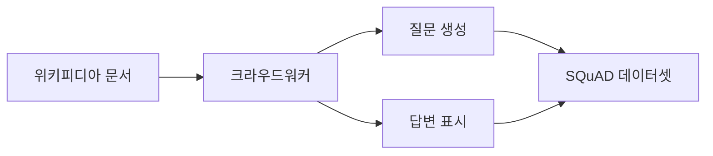
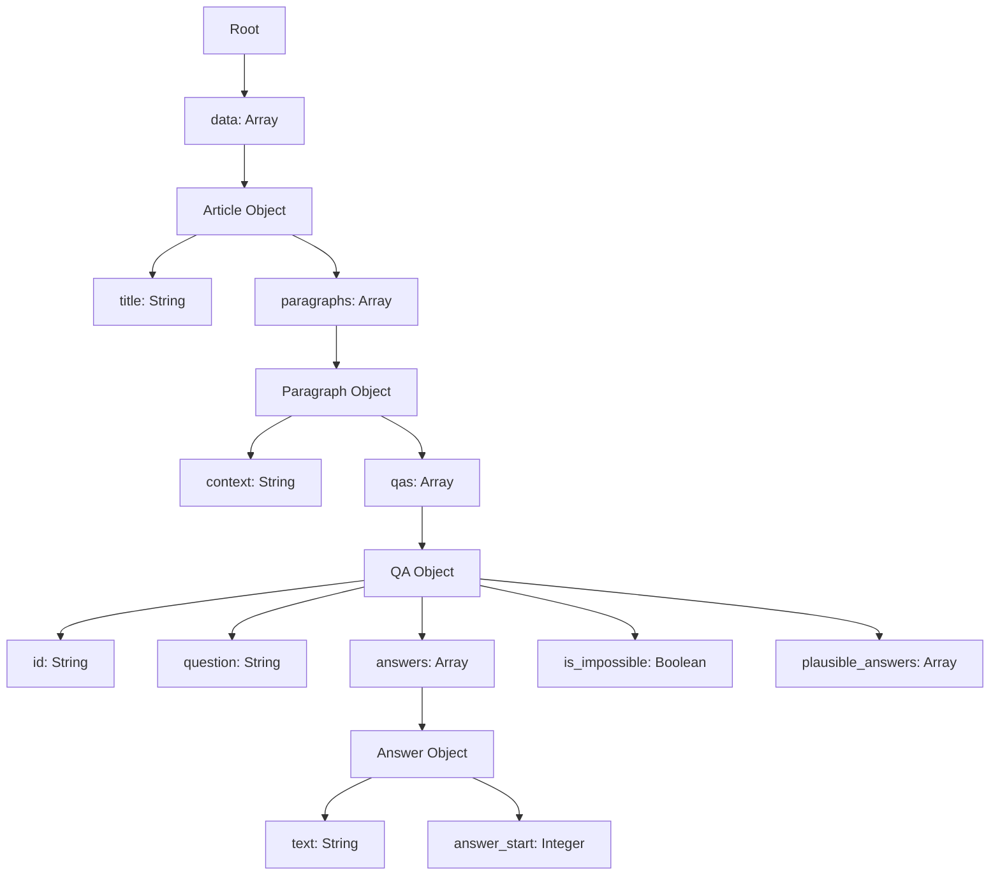
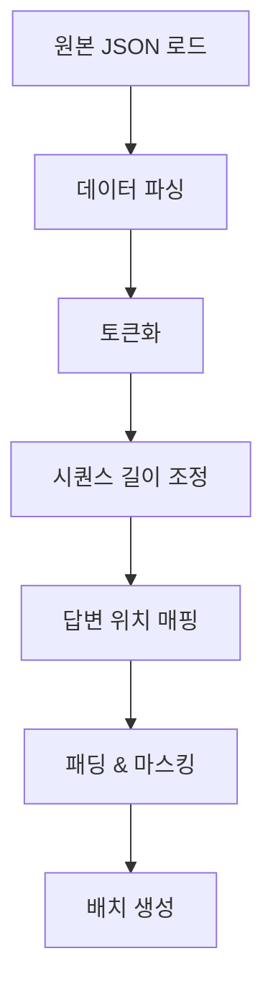
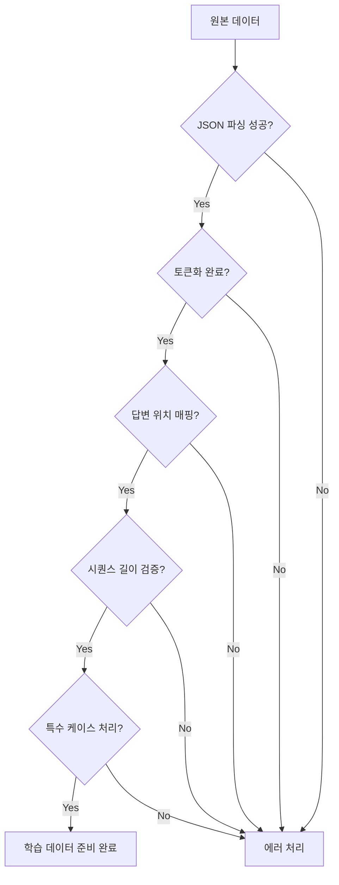

# SQuAD 데이터셋 완전 가이드

## 목차

1. [SQuAD 데이터셋 개요](#1-squad-데이터셋-개요)<br/>
   - 1.1. [정의와 목적](#11-정의와-목적)<br/>
   - 1.2. [버전별 특징](#12-버전별-특징)<br/>
   - 1.3. [데이터셋 규모](#13-데이터셋-규모)<br/>
2. [train-v2.0.json 구조 분석](#2-train-v20json-구조-분석)<br/>
   - 2.1. [전체 구조 개요](#21-전체-구조-개요)<br/>
   - 2.2. [계층적 데이터 구조](#22-계층적-데이터-구조)<br/>
   - 2.3. [주요 필드 설명](#23-주요-필드-설명)<br/>
   - 2.4. [답변 가능/불가능 질문](#24-답변-가능불가능-질문)<br/>
3. [데이터셋 특성 분석](#3-데이터셋-특성-분석)<br/>
   - 3.1. [질문 유형 분류](#31-질문-유형-분류)<br/>
   - 3.2. [답변 추출 메커니즘(Extractive QA)](#32-답변-추출-메커니즘extractive-qa)<br/>
   - 3.3. [적대적 예제(Adversarial Examples)](#33-적대적-예제adversarial-examples)<br/>
4. [Seq2Seq 모델링을 위한 데이터 전처리](#4-seq2seq-모델링을-위한-데이터-전처리)<br/>
   - 4.1. [데이터 전처리 파이프라인](#41-데이터-전처리-파이프라인)<br/>
   - 4.2. [토크나이제이션(Tokenization) 전략](#42-토크나이제이션tokenization-전략)<br/>
   - 4.3. [시퀀스 길이 처리](#43-시퀀스-길이-처리)<br/>
   - 4.4. [답변 불가능 질문 처리](#44-답변-불가능-질문-처리)<br/>
   - 4.5. [주의사항 및 함정](#45-주의사항-및-함정)<br/>
5. [SQuAD 데이터셋의 활용](#5-squad-데이터셋의-활용)<br/>
   - 5.1. [학습 가능한 태스크](#51-학습-가능한-태스크)<br/>
   - 5.2. [평가 지표(Evaluation Metrics)](#52-평가-지표evaluation-metrics)<br/>
   - 5.3. [벤치마크 모델](#53-벤치마크-모델)<br/>
   - 5.4. [실무 응용 사례](#54-실무-응용-사례)<br/>
6. [용어 목록](#6-용어-목록)<br/>
7. [추가 권장 사항](#추가-권장-사항)<br/>
8. [결론](#결론)<br/>

---

## 1. SQuAD 데이터셋 개요

### 1.1. 정의와 목적

**SQuAD**(Stanford Question Answering Dataset, 스쿼드)는 스탠포드 대학에서 개발한 독해 이해(reading comprehension) 데이터셋으로, 크라우드워커(crowdworker)들이 위키피디아 문서를 기반으로 작성한 질문들로 구성됩니다.<br/>
이 데이터셋의 핵심은 **추출적 질의응답(extractive question answering)** 태스크를 위해 설계되었다는 점입니다.



### 1.2. 버전별 특징

**SQuAD 1.1**
- 10만 개 이상의 질문-답변 쌍
- 500개 이상의 위키피디아 문서
- 모든 질문에 답변 존재 보장

**SQuAD 2.0**
- SQuAD 1.1의 10만 개 질문에 5만 개 이상의 답변 불가능 질문 추가
- 총 약 15만 개의 질문-답변 쌍
- 시스템이 답변 가능 여부를 판단하고, 불가능한 경우 답변을 보류해야 함

### 1.3. 데이터셋 규모

| 항목 | SQuAD 1.1 | SQuAD 2.0 |
|------|-----------|-----------|
| 질문-답변 쌍 | 107,785개 | ~150,000개 |
| 문서 수 | 536개 | 500+개 |
| 답변 불가능 질문 | 0개 | 50,000+개 |
| 파일 크기 | ~30MB | ~42MB |

---

## 2. train-v2.0.json 구조 분석

### 2.1. 전체 구조 개요

train-v2.0.json은 **계층적 JSON 구조**로 되어 있으며, 다음과 같은 최상위 필드를 포함합니다:

```json
{
  "version": "v2.0",
  "data": [...]
}
```

### 2.2. 계층적 데이터 구조



### 2.3. 주요 필드 설명

#### 2.3.1. 최상위 구조

| 필드 | 타입 | 설명 |
|------|------|------|
| `version` | String | 데이터셋 버전 (예: "v2.0") |
| `data` | Array | 모든 문서를 포함하는 배열 |

#### 2.3.2. Article 객체

각 Article 객체는 하나의 위키피디아 문서를 나타냅니다.

| 필드 | 타입 | 설명 |
|------|------|------|
| `title` | String | 문서의 제목 (예: "Beyoncé") |
| `paragraphs` | Array | 해당 문서의 단락들 |

#### 2.3.3. Paragraph 객체

각 단락은 문맥(컨텍스트, context)과 관련 질문들을 포함합니다.

| 필드 | 타입 | 설명 |
|------|------|------|
| `context` | String | 독해 지문 텍스트 (200~500 단어) |
| `qas` | Array | 해당 지문에 대한 질문-답변 쌍들 |

#### 2.3.4. QA 객체

질문-답변 쌍의 핵심 정보를 담고 있습니다.

| 필드 | 타입 | 설명 |
|------|------|------|
| `id` | String | 고유 식별자 (예: "56be85543aeaaa14008c9063") |
| `question` | String | 질문 텍스트 |
| `answers` | Array | 답변 객체들의 배열 (답변 가능 시) |
| `is_impossible` | Boolean | 답변 불가능 여부 (v2.0만 해당) |
| `plausible_answers` | Array | 그럴듯한 오답들 (답변 불가능 시) |

#### 2.3.5. Answer 객체

| 필드 | 타입 | 설명 |
|------|------|------|
| `text` | String | 답변 텍스트 |
| `answer_start` | Integer | context 내에서 답변의 시작 위치 (문자 인덱스) |

### 2.4. 답변 가능/불가능 질문

**답변 가능한 질문 예시:**
```json
{
  "id": "56be85543aeaaa14008c9063",
  "question": "When did Beyoncé start becoming popular?",
  "answers": [
    {
      "text": "in the late 1990s",
      "answer_start": 269
    }
  ],
  "is_impossible": false
}
```

**답변 불가능한 질문 예시:**
```json
{
  "id": "5a8c7595f038b7001ab6ef6a",
  "question": "What is Beyoncé's favorite color?",
  "answers": [],
  "is_impossible": true,
  "plausible_answers": [
    {
      "text": "blue",
      "answer_start": 150
    }
  ]
}
```

---

## 3. 데이터셋 특성 분석

### 3.1. 질문 유형 분류

SQuAD의 질문들은 다양한 유형으로 분류됩니다:

| 유형 | 예시 | 비율 |
|------|------|------|
| **Who** | "Who was the first president?" | ~15% |
| **What** | "What is the capital city?" | ~40% |
| **When** | "When did the war end?" | ~10% |
| **Where** | "Where was he born?" | ~8% |
| **Why** | "Why did this happen?" | ~12% |
| **How** | "How many people attended?" | ~15% |

### 3.2. 답변 추출 메커니즘(Extractive QA)

SQuAD는 **추출적 QA** 방식을 사용합니다:

- 답변은 항상 context 내의 **연속된 텍스트 스팬(span)**
- 생성형(generative) 답변이 아닌 **선택형(extractive)** 답변
- `answer_start` 인덱스로 정확한 위치 지정

$$
\text{Answer} = \text{context}[\text{\texttt{start\_idx}} : \text{\texttt{end\_idx}}]
$$

**중요한 수식적 표현:**

답변 스팬을 찾는 과정은 두 개의 포인터를 예측하는 문제로 정의됩니다:

$$
P_{\text{start}}(i) = \text{softmax}(W_s \cdot h_i)
$$

$$
P_{\text{end}}(j) = \text{softmax}(W_e \cdot h_j)
$$

여기서:
- $h_i$는 $i$번째 토큰의 인코딩된 표현(hidden representation)
- $W_s, W_e$는 학습 가능한 가중치 행렬(weight matrix)
- 최종 답변 스팬은 $(i, j)$로, $i \leq j$를 만족해야 함

### 3.3. 적대적 예제(Adversarial Examples)

SQuAD 2.0의 답변 불가능 질문들은 크라우드워커들이 답변 가능한 질문과 유사하게 보이도록 적대적으로 작성되었습니다.<br/>
이는 모델이 단순한 패턴 매칭이 아닌 진정한 이해력을 갖추도록 유도합니다.

**적대적 질문의 특징:**
- 문맥에 등장하는 엔티티(entity)나 키워드를 포함
- 답변 가능한 질문과 유사한 구문 구조
- 단순한 키워드 매칭으로는 식별 불가능

---

## 4. Seq2Seq 모델링을 위한 데이터 전처리

### 4.1. 데이터 전처리 파이프라인



### 4.2. 토크나이제이션(Tokenization) 전략

**주의사항:**

1. **서브워드 토크나이제이션(Subword Tokenization) 사용**
   - WordPiece, BPE(Byte Pair Encoding), SentencePiece 등 활용
   - 어휘(vocabulary) 크기 제어
   - 미등록 단어(OOV, Out-of-Vocabulary) 문제 완화

2. **답변 위치 재매핑 필수**
   - 원본 `answer_start`는 **문자(character) 기반 인덱스**
   - 토큰화 후 **토큰(token) 기반 인덱스**로 변환 필요
   - 오프셋(offset) 매핑 테이블 유지

**예시:**
```
원본 텍스트: "Beyoncé was born in 1981."
문자 인덱스: answer_start = 20 (for "1981")

토큰화 후: ["Beyoncé", "was", "born", "in", "1981", "."]
토큰 인덱스: token_start = 4, token_end = 4
```

3. **특수 토큰 처리**
   - `[CLS]`, `[SEP]`, `[PAD]` 등의 특수 토큰 추가
   - 실제 답변 위치는 특수 토큰을 고려하여 조정

### 4.3. 시퀀스 길이 처리

**Context 길이 분포:**
- 평균: 122 단어
- 중앙값: 113 단어
- 90 백분위수(percentile): 200 단어

**권장 최대 시퀀스 길이:**

$$
L_{\text{total}} = L_{\text{context}} + L_{\text{question}} + N_{\text{special}}
$$

일반적으로:
- BERT 계열: 384 또는 512 토큰
- Context: 최대 300-400 토큰
- Question: 최대 50-64 토큰

**긴 문맥 처리 전략:**

1. **슬라이딩 윈도우(Sliding Window)**
   - 긴 context를 오버랩(overlap)이 있는 청크(chunk)로 분할
   - 각 청크를 독립적으로 처리
   - 답변이 청크 경계에 걸치지 않도록 주의

2. **스트라이드(Stride) 설정**
   - 오버랩 비율: 50-128 토큰 권장
   - 답변 누락 방지

### 4.4. 답변 불가능 질문 처리

SQuAD 2.0의 핵심 도전 과제입니다.

**모델링 접근법:**

1. **이진 분류기(Binary Classifier) 추가**
   - 답변 가능 여부를 별도로 예측
   - Threshold 값 조정으로 정밀도(precision)와 재현율(recall) 조절

$$
P(\text{is\_answerable}) = \sigma(W_c \cdot h_{\text{CLS}})
$$

2. **시작 위치를 [CLS] 토큰으로 설정**
   - 답변 불가능 시 start = end = 0
   - Null threshold 설정: 답변 불가능일 확률이 높으면 보류

3. **손실 함수(Loss Function) 설계**

답변 가능한 경우:

$$
\mathcal{L}_{\text{span}} = -\log P_{\text{start}}(i^*) - \log P_{\text{end}}(j^*)
$$

답변 불가능한 경우:

$$
\mathcal{L}_{\text{null}} = -\log P_{\text{start}}(0) - \log P_{\text{end}}(0)
$$

전체 손실:

$$
\mathcal{L} = \mathbb{E}[\mathcal{L}_{\text{span}} + \lambda \cdot \mathcal{L}_{\text{null}}]
$$

여기서 $\lambda$는 균형 하이퍼파라미터(balancing hyperparameter)입니다.

### 4.5. 주의사항 및 함정

#### 4.5.1. 데이터 불균형(Class Imbalance)
- SQuAD 2.0에서 답변 가능:불가능 비율은 약 2:1
- 불균형 처리를 위한 가중치(weight) 조정 필요
- 오버샘플링(oversampling) 또는 언더샘플링(undersampling) 고려

#### 4.5.2. 답변 텍스트 정규화(Normalization)
- 대소문자(case) 처리
- 구두점(punctuation) 처리
- 공백(whitespace) 정규화
- 평가 시 정규화된 텍스트로 비교

```
원본: "  The answer is  1981. "
정규화: "the answer is 1981"
```

#### 4.5.3. 멀티 레퍼런스(Multiple References)
- 같은 질문에 여러 답변이 존재할 수 있음
- 평가 시 **모든 레퍼런스와 비교**하여 최대 점수 선택

#### 4.5.4. 문맥 이해의 중요성
- 단순 키워드 매칭으로는 낮은 성능
- 의미론적 이해(semantic understanding) 필수
- 공지시(coreference resolution) 및 추론(reasoning) 능력 필요

#### 4.5.5. Seq2Seq 특화 고려사항

**입력 형식 설계:**
```
[CLS] question [SEP] context [SEP]
또는
context [SEP] question [SEP]
```

**디코더(Decoder) 출력:**
- 추출적 QA이므로 생성이 아닌 **포인터 네트워크(Pointer Network)** 권장
- 시작/끝 인덱스를 직접 예측
- Seq2Seq보다는 인코더-기반(encoder-based) 모델이 더 효과적

**코드 최소화 예시:**
```python
# 토큰 인덱스 재매핑
char_to_token_map = tokenizer.encode_plus(
    context,
    return_offsets_mapping=True
)['offset_mapping']

# 문자 인덱스를 토큰 인덱스로 변환
def char_to_token_idx(char_idx):
    for i, (start, end) in enumerate(char_to_token_map):
        if start <= char_idx < end:
            return i
    return -1
```

---

## 5. SQuAD 데이터셋의 활용

### 5.1. 학습 가능한 태스크

SQuAD 데이터셋으로 다음과 같은 작업을 수행할 수 있습니다:

1. **추출적 질의응답(Extractive QA)**
   - 주요 태스크: 문맥에서 답변 스팬 추출
   - 모델: BERT, RoBERTa, ALBERT, ELECTRA

2. **독해 이해(Reading Comprehension)**
   - 텍스트 이해력 평가
   - 문맥 파악 능력 측정

3. **질문 생성(Question Generation)**
   - 역방향(reverse) 태스크
   - 문맥과 답변으로부터 질문 생성

4. **답변 가능성 분류(Answerability Classification)**
   - 질문이 답변 가능한지 판단
   - 신뢰도(confidence) 추정

### 5.2. 평가 지표(Evaluation Metrics)

#### 5.2.1. Exact Match (EM)

$$
\text{EM} = \frac{1}{N} \sum_{i=1}^{N} \mathbb{1}[\text{pred}_i = \text{gold}_i]
$$

- 예측과 정답이 **완전히 일치**할 때만 1점
- 이진 지표(binary metric): 0 또는 1
- 엄격한(strict) 평가 방식

#### 5.2.2. F1 Score

$$
\text{F1} = \frac{2 \cdot \text{Precision} \cdot \text{Recall}}{\text{Precision} + \text{Recall}}
$$

여기서:

$$
\text{Precision} = \frac{|\text{pred} \cap \text{gold}|}{|\text{pred}|}
$$

$$
\text{Recall} = \frac{|\text{pred} \cap \text{gold}|}{|\text{gold}|}
$$

- 토큰 레벨에서 오버랩(overlap) 측정
- 부분 일치(partial match)를 반영
- 더 완화된(lenient) 평가 방식

**예시:**
```
정답(Gold): "in the late 1990s"
예측(Prediction): "the late 1990s"

Precision = 3/3 = 1.0
Recall = 3/4 = 0.75
F1 = 2 * (1.0 * 0.75) / (1.0 + 0.75) = 0.857
```

#### 5.2.3. SQuAD 2.0 전용 지표

- 답변 불가능 질문에 대해 텍스트 예측 시 자동으로 0점
- Null threshold 최적화 필요

### 5.3. 벤치마크 모델

SQuAD 2.0 리더보드에서 인간 성능은 EM 86.831, F1 89.452를 기록했습니다.

**주요 모델 성능 (EM / F1):**
- **Human Performance**: 86.8 / 89.5
- **BERT-large**: ~80 / ~83
- **RoBERTa**: ~84 / ~87
- **ALBERT**: ~86 / ~89
- **최신 앙상블 모델(ensemble model)**: ~90 / ~93 (인간 초과)

### 5.4. 실무 응용 사례

1. **고객 지원 챗봇(Customer Support Chatbot)**
   - FAQ 문서 기반 자동 응답
   - 매뉴얼에서 답변 추출

2. **문서 검색 시스템(Document Retrieval)**
   - 질문 기반 관련 문단 검색
   - 법률 문서, 의료 기록 검색

3. **교육 플랫폼(Educational Platform)**
   - 자동 채점 시스템
   - 학습자 이해도 평가

4. **음성 비서(Voice Assistant)**
   - 사용자 질문에 대한 지식 베이스(knowledge base) 검색
   - 컨텍스트 기반 응답 생성

---

## 6. 용어 목록

| 한글 용어 | 영문 용어 | 설명 |
|-----------|-----------|------|
| 추출적 질의응답 | Extractive Question Answering | 문맥에서 답변을 직접 추출하는 방식 |
| 독해 이해 | Reading Comprehension | 텍스트를 읽고 이해하는 능력 |
| 크라우드워커 | Crowdworker | 온라인 플랫폼에서 작업하는 대중 노동자 |
| 스팬 | Span | 텍스트 내 연속된 토큰 시퀀스 |
| 토크나이제이션 | Tokenization | 텍스트를 토큰 단위로 분할하는 과정 |
| 서브워드 토크나이제이션 | Subword Tokenization | 단어를 더 작은 단위로 분할하는 기법 |
| 오프셋 매핑 | Offset Mapping | 원본과 변환된 인덱스 간 대응 관계 |
| 슬라이딩 윈도우 | Sliding Window | 고정 크기 창을 이동시키며 처리하는 기법 |
| 스트라이드 | Stride | 윈도우 이동 시 중첩되는 구간 |
| 이진 분류기 | Binary Classifier | 두 클래스 중 하나를 예측하는 모델 |
| 손실 함수 | Loss Function | 모델 예측과 실제 값의 차이를 측정하는 함수 |
| 데이터 불균형 | Class Imbalance | 클래스 간 샘플 수의 차이 |
| 정규화 | Normalization | 데이터를 표준 형식으로 변환 |
| 공지시 | Coreference Resolution | 같은 엔티티를 가리키는 표현 식별 |
| 포인터 네트워크 | Pointer Network | 입력 시퀀스의 위치를 출력하는 네트워크 |
| 앙상블 모델 | Ensemble Model | 여러 모델을 결합한 모델 |
| 정확 일치 | Exact Match | 예측과 정답이 완전히 동일한 경우 |
| 정밀도 | Precision | 예측 중 정답의 비율 |
| 재현율 | Recall | 정답 중 예측한 비율 |
| 인코더 | Encoder | 입력을 벡터 표현으로 변환하는 모듈 |
| 디코더 | Decoder | 벡터 표현에서 출력을 생성하는 모듈 |
| 임베딩 | Embedding | 단어나 토큰을 벡터로 표현 |
| 어텐션 메커니즘 | Attention Mechanism | 입력의 중요한 부분에 집중하는 기법 |
| 파인튜닝 | Fine-tuning | 사전 학습된 모델을 특정 태스크에 맞게 조정 |
| 배치 | Batch | 한 번에 처리하는 샘플들의 집합 |
| 하이퍼파라미터 | Hyperparameter | 학습 전에 설정하는 모델 매개변수 |
| 역전파 | Backpropagation | 손실을 역방향으로 전파하여 가중치 업데이트 |
| 경사 하강법 | Gradient Descent | 손실을 최소화하는 최적화 알고리즘 |
| 드롭아웃 | Dropout | 과적합 방지를 위한 정규화 기법 |
| 컨텍스트 | Context | 질문에 대한 답변을 포함하는 지문 |
| 적대적 예제 | Adversarial Examples | 모델을 속이기 위해 의도적으로 설계된 샘플 |

---

**참고 문헌**
- Rajpurkar, P., Zhang, J., Lopyrev, K., & Liang, P. (2016). SQuAD: 100,000+ Questions for Machine Comprehension of Text. arXiv:1606.05250.
- Rajpurkar, P., Jia, R., & Liang, P. (2018). Know What You Don't Know: Unanswerable Questions for SQuAD. arXiv:1806.03822.

**라이선스**
- CC BY-SA 4.0 (Creative Commons Attribution-ShareAlike 4.0)

---

## 추가 권장 사항

### 데이터 전처리 체크리스트



### 모델 선택 가이드

**태스크 목적에 따른 모델 추천:**

1. **최고 성능 추구 (연구용)**
   - 대형 트랜스포머(transformer) 모델: BERT-large, RoBERTa-large, ALBERT-xxlarge
   - 앙상블 기법 활용
   - 컴퓨팅 자원 필요: GPU 16GB+ 메모리

2. **효율성 중시 (프로덕션용)**
   - 경량 모델: DistilBERT, TinyBERT, MobileBERT
   - 지식 증류(knowledge distillation) 활용
   - 추론(inference) 속도 우선

3. **학습 목적 (교육용)**
   - BERT-base 또는 더 작은 모델
   - BiDAF, Match-LSTM 등 클래식(classic) 아키텍처
   - 구조 이해에 초점

### 흔한 실수와 해결책

#### 실수 1: 답변 위치 인덱싱 오류
**문제**: 토큰화 후 문자 기반 인덱스를 그대로 사용
**해결**: 오프셋 매핑 테이블을 생성하여 문자→토큰 인덱스 변환

#### 실수 2: 긴 문맥 잘림
**문제**: 최대 시퀀스 길이 초과로 답변 손실
**해결**: 슬라이딩 윈도우 기법 적용, 충분한 오버랩 설정

#### 실수 3: 답변 불가능 질문 무시
**문제**: SQuAD 1.1 방식으로만 학습
**해결**: is_impossible 플래그 활용, 별도 분류기 추가

#### 실수 4: 평가 시 정규화 생략
**문제**: 공백, 대소문자 차이로 정확도 저하
**해결**: 평가 전 텍스트 정규화 수행

#### 실수 5: 단일 레퍼런스만 고려
**문제**: 다중 정답 중 하나만 비교
**해결**: 모든 정답과 비교하여 최고 점수 선택

### 성능 향상 팁

1. **사전 학습 모델(Pre-trained Model) 활용**
   - BERT, RoBERTa 등의 사전 학습된 언어 모델 사용
   - 파인튜닝으로 빠른 수렴(convergence)

2. **데이터 증강(Data Augmentation)**
   - 역번역(back-translation)으로 질문 다양화
   - 동의어(synonym) 치환
   - 문맥 셔플링(context shuffling)

3. **앙상블 전략**
   - 서로 다른 아키텍처 모델 결합
   - 다양한 시드(seed) 값으로 학습한 모델 평균

4. **하이퍼파라미터 튜닝**
   - Learning rate: 2e-5 ~ 5e-5 (BERT 기준)
   - Batch size: 16 ~ 32 (메모리에 따라 조정)
   - Epochs: 2 ~ 4 (과적합 주의)

5. **후처리(Post-processing)**
   - 답변 길이 제약: 1 ~ 30 토큰
   - 신뢰도(confidence) 임계값 설정
   - 문법적 완전성 검증

### 디버깅 전략

**학습 중 모니터링 지표:**
- Training loss: 에폭(epoch)마다 감소 확인
- Validation EM/F1: 과적합 조기 발견
- Answerable vs Unanswerable 정확도: 균형 확인

**검증 방법:**
```python
# 샘플 예측 검증
def validate_prediction(context, question, pred_start, pred_end):
    # 1. 인덱스 범위 검증
    assert 0 <= pred_start <= len(context)
    assert pred_start <= pred_end
    
    # 2. 답변 추출
    answer = context[pred_start:pred_end+1]
    
    # 3. 공백 제거 후 검증
    if answer.strip() == "":
        print("경고: 빈 답변 예측")
    
    return answer
```

### 실전 프로젝트 체크리스트

- [ ] 데이터셋 다운로드 및 검증
- [ ] 토크나이저 선택 및 설정
- [ ] 전처리 파이프라인 구축
- [ ] 답변 위치 매핑 정확성 검증
- [ ] 긴 문맥 처리 전략 구현
- [ ] 답변 불가능 질문 처리 로직 추가
- [ ] 모델 아키텍처 설계
- [ ] 학습 루프 구현
- [ ] 평가 스크립트 작성
- [ ] 예측 결과 후처리
- [ ] 공식 평가 스크립트로 검증
- [ ] 오류 분석(error analysis) 수행

---

## 결론

SQuAD 데이터셋은 **기계 독해 능력**을 평가하는 가장 널리 사용되는 벤치마크입니다.<br/>
train-v2.0.json의 계층적 구조를 정확히 이해하고, 특히 **답변 위치 인덱싱**과 **답변 불가능 질문 처리**에 주의를 기울여야 합니다.

Seq2Seq 모델링 시 추출적 QA의 특성상 **포인터 네트워크** 방식이 더 적합하며, 토큰화 과정에서의 **인덱스 재매핑**이 핵심입니다.<br/>
전처리 단계에서 발생하는 오류가 최종 성능에 직접적인 영향을 미치므로, 체계적인 검증 절차가 필수적입니다.

현대의 트랜스포머 기반 모델들은 이미 인간 수준을 넘어섰지만, 진정한 언어 이해력을 평가하기 위해서는 답변 불가능 질문에 대한 올바른 판단 능력이 중요합니다. 이는 실제 응용 시스템에서 잘못된 정보 제공을 방지하는 안전 장치(safety mechanism)로 작용합니다.

---

**문서 버전**: 1.0  
**최종 수정일**: 2025-09-30  
**작성자**: AI Engineering Student