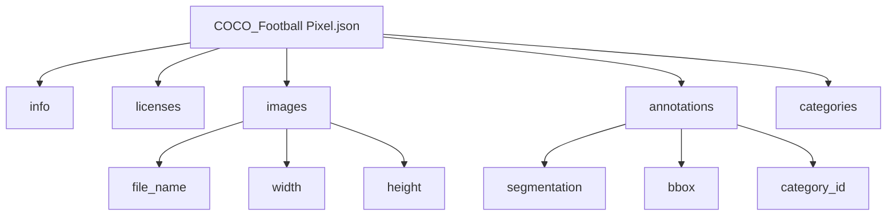

# 🧠 Football Semantic Segmentation Dataset 분석 보고서

## 목차

1. 데이터셋 개요  
   1.1 다운로드 및 경로  
   1.2 폴더 구조  
2. COCO JSON 구조  
   2.1 주요 필드 설명  
   2.2 Mermaid 구조도  
3. 기술적 의견 및 개선 제안  
4. 용어 목록

---

## 1. 데이터셋 개요

### 1.1 다운로드 및 경로

```python
import kagglehub

# 최신 버전 다운로드 권장
kagglehub_path = kagglehub.dataset_download("sadhliroomyprime/football-semantic-segmentation")

def get_path_data():
    return kagglehub_path

print("Path to dataset files:", get_path_data())
```

> ⚠️ 현재 설치된 `kagglehub` 버전은 `0.3.12`이며, 최신 버전 `0.3.13`으로 업그레이드하는 것이 권장됩니다.

---

### 1.2 폴더 구조

데이터셋은 다음과 같은 구조로 구성되어 있습니다:

```
football-semantic-segmentation/
├── About Acme AI.txt
├── COCO_Football Pixel.json
├── images/                      # 총 300개 이미지
└── www.acmeai.tech ODataset 3 - Football Semantic Segmentation.pdf
```

- `About Acme AI.txt`: 데이터셋 제작자 정보
- `COCO_Football Pixel.json`: 의미론적 분할 어노테이션
- `images/`: 실제 이미지 데이터 (300장)
- PDF 문서: 데이터셋 설명서

---

## 2. COCO JSON 구조

### 2.1 주요 필드 설명

```python
import json

coco_json_path = "football-semantic-segmentation/COCO_Football Pixel.json"
with open(coco_json_path, 'r') as f:
    coco_json_data = json.load(f)
# print_json_tree 함수는 별도 구현 필요
# print_json_tree(coco_json_data)
```

출력 구조:

```
|-- info
|-- licenses
|-- images [100 items]
|-- annotations [915 items]
|-- categories [11 items]
```

#### 📌 info

| 필드 | 설명 |
|------|------|
| description | 데이터셋 설명 |
| url | https://superannotate.ai |
| version | 1.0 |
| year | 2022 |
| contributor | Superannotate AI |
| date_created | 23/11/2022 |

#### 📌 licenses

| 필드 | 설명 |
|------|------|
| id | 라이선스 ID |
| name | Superannotate AI |
| url | https://superannotate.ai |

#### 📌 images

- 이미지 메타데이터: `id`, `file_name`, `width`, `height`

#### 📌 annotations

- 객체 어노테이션: `id`, `image_id`, `category_id`, `segmentation`, `bbox`, `area`, `iscrowd`

#### 📌 categories

| ID | 클래스 이름             |
|----|------------------------|
| 1  | Team A                |
| 2  | Team B                |
| 3  | Goalkeeper A          |
| 4  | Goalkeeper B          |
| 5  | Ball                  |
| 6  | Referee               |
| 7  | Audience              |
| 8  | Ground                |
| 9  | Advertisement         |
| 10 | Goal Bar              |
| 11 | Coaches & Officials   |

---

### 2.2 Mermaid 구조도

> Mermaid 다이어그램은 GitHub Pages 또는 Mermaid 지원 마크다운 뷰어에서만 정상적으로 표시됩니다.



---

## 3. 기술적 의견 및 개선 제안

### ✅ 장점

- COCO 포맷 기반으로 다양한 프레임워크에서 활용 가능
- 축구 경기의 다양한 객체를 세분화하여 분할
- 실제 경기 장면 기반으로 학습 데이터의 현실성이 높음

### ⚠️ 개선 제안

1. **이미지 수 불일치**  
   - `images` 필드에는 100개, 실제 폴더에는 300개 이미지 존재  
   → JSON 어노테이션이 전체 이미지에 대해 커버되지 않음

2. **클래스 불균형 가능성**  
   - `annotations` 수가 915개로 제한적이며, 일부 클래스에 집중되어 있을 수 있음  
   → 클래스별 분포 시각화 및 균형 조정 필요

3. **어노테이션 품질 검증**  
   - `segmentation` 필드가 폴리곤 기반인지 RLE 기반인지 명확히 구분 필요  
   → 모델 학습 시 성능에 직접적 영향

4. **라이선스 명확성 부족**  
   - Superannotate AI의 사용 조건이 명확히 기술되어야 함

---

## 4. 용어 목록

| 용어 | 정의 |
|------|------|
| COCO Format | 객체 검출 및 분할을 위한 JSON 기반 어노테이션 포맷 |
| Semantic Segmentation | 이미지의 각 픽셀을 의미 있는 클래스에 할당하는 작업 |
| Bounding Box | 객체를 감싸는 직사각형 영역 |
| Annotation | 이미지 내 객체에 대한 메타데이터 정보 |
| Category ID | 객체의 클래스 식별자 |
| Segmentation Mask | 객체의 픽셀 단위 분할 정보 |
| Crowd Annotation | 객체가 군집 형태로 존재할 경우 이를 표시하는 플래그 |
| Mermaid | GitHub Pages에서 구조를 시각화하기 위한 다이어그램 언어 |
| Superannotate | 데이터 어노테이션 및 관리 플랫폼 |
| Deep Learning | 인공신경망을 기반으로 한 머신러닝의 하위 분야 |

---