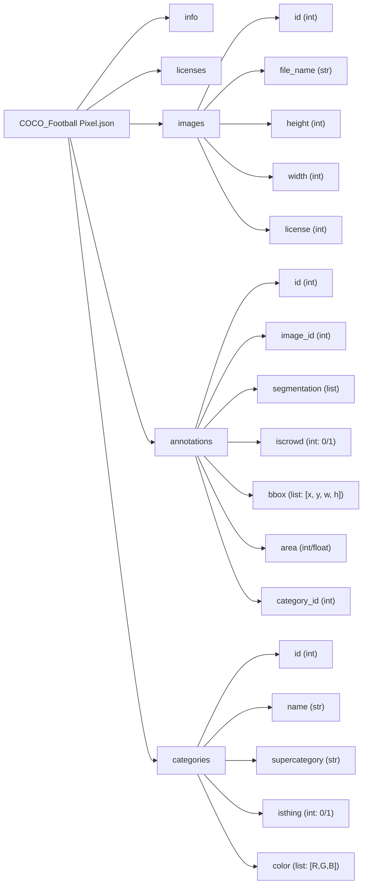

# 📁 Football Pixel.json 구조 분석

## 목차

1. [JSON 개요](#1-json-개요)  
   1.1 [COCO 포맷이란](#11-coco-포맷이란)  
   1.2 [주요 구성 요소](#12-주요-구성-요소)  
2. [필드별 구조 설명](#2-필드별-구조-설명)  
   2.1 [images](#21-images)  
   2.2 [annotations](#22-annotations)  
   2.3 [categories](#23-categories)  
3. [Mermaid 구조도](#3-mermaid-구조도)  
4. [수식 표현](#4-수식-표현)  
5. [용어 목록](#5-용어-목록)

---

## 1. JSON 개요

### 1.1 COCO 포맷이란

COCO(Common Objects in Context) 포맷은 객체 검출, 키포인트 추출, 의미론적 분할(Semantic Segmentation) 등을 위한 표준 JSON 구조입니다. 이 포맷은 다양한 딥러닝 프레임워크에서 호환되며, 학습 및 평가에 필요한 메타데이터를 체계적으로 제공합니다.

### 1.2 주요 구성 요소

```json
{
  "images": [...],
  "annotations": [...],
  "categories": [...],
  "info": {...},
  "licenses": [...]
}
```

---

## 2. 필드별 구조 설명

### 2.1 images

이미지 메타데이터를 담고 있으며, 각 항목은 다음과 같은 구조를 가집니다:

```json
{
  "id": 1,
  "file_name": "Frame 1  (14).jpg",
  "height": 1080,
  "width": 1920,
  "license": 1
}
```

- `id`: 이미지 고유 식별자
- `file_name`: 이미지 파일명
- `height`, `width`: 해상도 정보
- `license`: 라이선스 ID

---

### 2.2 annotations

객체 어노테이션 정보로, 이미지 내 객체의 위치와 형태를 정의합니다:

```json
{
  "id": 1,
  "image_id": 1,
  "segmentation": [[x1, y1, x2, y2, ..., xn, yn]],
  "iscrowd": 0,
  "bbox": [802.0, 366.0, 326.0, 714.0],
  "area": 87773,
  "category_id": 1392794
}
```

- `segmentation`: 객체의 픽셀 경계 좌표 (폴리곤 기반)
- `bbox`: 바운딩 박스 `[x, y, width, height]`
- `area`: 객체 면적
- `iscrowd`: 군집 여부 (0: 단일 객체, 1: 군집)
- `category_id`: 해당 객체의 클래스 ID

> ⚠️ 주의: `category_id` 값이 `1392794`처럼 매우 큰 숫자로 되어 있어, 실제 `categories` 목록과 매핑이 불명확할 수 있습니다. 이는 데이터셋 생성 시 ID 충돌 방지를 위한 UUID 기반일 가능성이 있습니다.

---

### 2.3 categories

객체 클래스 정의 정보입니다:

```json
{
  "id": 1393250,
  "name": "Goal Bar",
  "supercategory": "Goal Bar",
  "isthing": 1,
  "color": [98, 66, 21]
}
```

- `id`: 클래스 고유 ID
- `name`: 클래스 이름
- `supercategory`: 상위 분류
- `isthing`: 객체 여부 (1: 객체, 0: 배경)
- `color`: 시각화용 RGB 색상

> 예시 클래스: `"Goal Bar"`, `"Ball"`, `"Team A"`, `"Audience"` 등

---

## 3. Mermaid 구조도



---

## 4. 수식 표현

### 🎯 객체 면적 계산

$$
\text{Area}_{bbox} = \text{width} \times \text{height}
$$

예시:
$$
\text{Area}_{bbox} = 326.0 \times 714.0 = 232164
$$

> 실제 `area` 값은 분할된 마스크 기준으로 계산되며, 바운딩 박스 면적과 다를 수 있습니다.

---

## 5. 용어 목록

| 용어 | 정의 |
|------|------|
| COCO Format | 객체 검출 및 분할을 위한 JSON 기반 어노테이션 포맷 |
| Semantic Segmentation | 이미지의 각 픽셀을 의미 있는 클래스에 할당하는 작업 |
| Bounding Box | 객체를 감싸는 직사각형 영역 |
| Annotation | 이미지 내 객체에 대한 메타데이터 정보 |
| Category ID | 객체의 클래스 식별자 |
| Segmentation Mask | 객체의 픽셀 단위 분할 정보 |
| Crowd Annotation | 객체가 군집 형태로 존재할 경우 이를 표시하는 플래그 |
| Supercategory | 클래스의 상위 분류 개념 |
| isthing | 객체인지 배경인지 구분하는 플래그 |
| RGB Color | 시각화용 색상 정보 (Red, Green, Blue)

---
