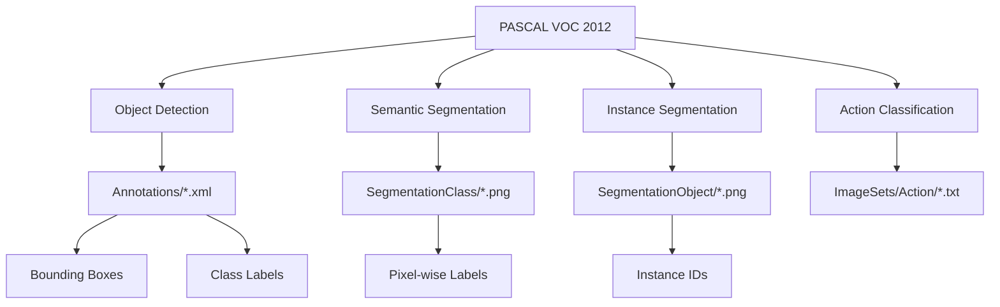

# PASCAL VOC 2012 데이터셋 및 torchvision.datasets.VOCSegmentation 가이드

## 목차
1. [PASCAL VOC 2012 데이터셋 개요](#1-pascal-voc-2012-데이터셋-개요)<br/>
   1.1. [데이터셋 소개](#11-데이터셋-소개)<br/>
   1.1.1. [핵심 특징](#111-핵심-특징)<br/>
   1.2. [클래스 구조](#12-클래스-구조)<br/>
   1.3. [데이터 분할](#13-데이터-분할)<br/>
2. [데이터셋 구조 및 특징](#2-데이터셋-구조-및-특징)<br/>
   2.1. [데이터 통계](#21-데이터-통계)<br/>
   2.2. [어노테이션 구조](#22-어노테이션-구조)<br/>
   2.2.1. [XML 어노테이션 파일 구조](#221-xml-어노테이션-파일-구조)<br/>
   2.2.2. [세그멘테이션 마스크](#222-세그멘테이션-마스크)<br/>
   2.3. [특별 클래스: Neutral Class](#23-특별-클래스-neutral-class)<br/>
3. [torchvision.datasets.VOCSegmentation](#3-torchvisiondatasetsvocSegmentation)<br/>
   3.1. [클래스 정의 및 매개변수](#31-클래스-정의-및-매개변수)<br/>
   3.2. [기본 사용법](#32-기본-사용법)<br/>
   3.2.1. [공식 다운로드 방법](#321-공식-다운로드-방법)<br/>
   3.2.2. [Kaggle Hub를 통한 안정적 다운로드](#322-kaggle-hub를-통한-안정적-다운로드)<br/>
   3.2.3. [디렉터리 구조 확인](#323-디렉터리-구조-확인)<br/>
   3.2.4. [ImageSets 폴더 구조 및 내용](#324-imagesets-폴더-구조-및-내용)<br/>
   3.3. [고급 사용법](#33-고급-사용법)<br/>
   3.3.1. [데이터 변환 적용](#331-데이터-변환-적용)<br/>
   3.3.2. [DataLoader와 함께 사용](#332-dataloader와-함께-사용)<br/>
4. [실제 구현 예제](#4-실제-구현-예제)<br/>
   4.1. [기본 데이터 로딩](#41-기본-데이터-로딩)<br/>
   4.2. [세그멘테이션 모델 학습용 파이프라인](#42-세그멘테이션-모델-학습용-파이프라인)<br/>
   4.3. [VOC 컬러맵 및 시각화](#43-voc-컬러맵-및-시각화)<br/>
   4.4. [XML 어노테이션 파싱](#44-xml-어노테이션-파싱)<br/>
5. [세그멘테이션 타입별 차이점](#5-세그멘테이션-타입별-차이점)<br/>
   5.1. [SegmentationClass vs SegmentationObject](#51-segmentationclass-vs-segmentationobject)<br/>
   5.2. [실제 사용 예제](#52-실제-사용-예제)<br/>
6. [벤치마킹 및 평가](#6-벤치마킹-및-평가)<br/>
   6.1. [표준 평가 메트릭](#61-표준-평가-메트릭)<br/>
   6.2. [현재 State-of-the-Art](#62-현재-state-of-the-art)<br/>

---

## 1. PASCAL VOC 2012 데이터셋 개요

### 1.1. 데이터셋 소개

PASCAL Visual Object Classes Challenge 2012 (VOC2012)는 컴퓨터 비전 분야에서 가장 널리 사용되는 벤치마크(벤치마크) 데이터셋 중 하나입니다. 이 데이터셋은 객체 검출(Object Detection), 의미론적 세그멘테이션(Semantic Segmentation, 시맨틱 세그멘테이션), 분류(Classification, 클래시피케이션) 작업을 위해 설계되었습니다.



#### 1.1.1. 핵심 특징

- **총 이미지 수**: 17,125개 (훈련/검증용)
- **테스트 이미지 수**: 5,138개
- **세그멘테이션 이미지**: 9,993개 (VOC2011의 7,062개에서 증가)
- **라벨링된 객체**: 27,450개 ROI(Region of Interest, 알오아이) 태그된 객체
- **세그멘테이션 마스크**: 2,913개 (Class 및 Object 각각)

### 1.2. 클래스 구조

VOC 2012 데이터셋은 총 **21개의 클래스**를 포함합니다 (배경 포함):

```
클래스 목록 (20개 객체 + 1개 배경):
- 사람: person
- 동물: bird, cat, cow, dog, horse, sheep
- 탈것: aeroplane, bicycle, boat, bus, car, motorbike, train
- 실내 물품: bottle, chair, diningtable, pottedplant, sofa, tvmonitor
- 특수: background (배경)
```

### 1.3. 데이터 분할

데이터는 다음과 같이 분할됩니다:

- **Train**: 훈련용 데이터
- **Val**: 검증용 데이터  
- **Trainval**: 훈련 + 검증 데이터 결합
- **Test**: 테스트용 데이터 (어노테이션은 공개되지 않음)

## 2. 데이터셋 구조 및 특징

### 2.1. 데이터 통계

```
세그멘테이션 파트 기준:
- 총 이미지: 7,282개
- 라벨링된 객체: 19,694개
- 클래스별 분포: 21개 클래스에 균등하게 분포
- 어노테이션 없는 이미지: 1,456개 (전체의 20%)
```

### 2.2. 어노테이션 구조

#### 2.2.1. XML 어노테이션 파일 구조

VOC 데이터셋의 어노테이션은 XML 형태로 저장되며, 각 이미지당 하나의 XML 파일이 생성됩니다. 다음은 기본 구조와 주요 노드(Node, 노드)들입니다:

```xml
<annotation>
    <folder>VOC2012</folder>                    <!-- 폴더명 -->
    <filename>2007_000001.jpg</filename>        <!-- 이미지 파일명 -->
    <source>                                    <!-- 데이터 출처 정보 -->
        <database>The VOC2007 Database</database>
        <annotation>PASCAL VOC2007</annotation>
    </source>
    <size>                                      <!-- 이미지 크기 정보 -->
        <width>353</width>                      <!-- 너비 (픽셀) -->
        <height>500</height>                    <!-- 높이 (픽셀) -->
        <depth>3</depth>                        <!-- 채널 수 (RGB=3) -->
    </size>
    <segmented>0</segmented>                    <!-- 세그멘테이션 여부 (0/1) -->
    
    <object>                                    <!-- 객체 정보 (여러 개 가능) -->
        <name>dog</name>                        <!-- 클래스 이름 -->
        <pose>Left</pose>                       <!-- 객체 방향 -->
        <truncated>1</truncated>                <!-- 잘림 여부 (0/1) -->
        <difficult>0</difficult>                <!-- 검출 난이도 (0/1) -->
        <bndbox>                                <!-- 바운딩 박스 좌표 -->
            <xmin>48</xmin>                     <!-- 좌상단 x 좌표 -->
            <ymin>240</ymin>                    <!-- 좌상단 y 좌표 -->
            <xmax>195</xmax>                    <!-- 우하단 x 좌표 -->
            <ymax>371</ymax>                    <!-- 우하단 y 좌표 -->
        </bndbox>
    </object>
    
    <!-- 추가 객체들... -->
</annotation>
```

**주요 노드 설명**:
- `<annotation>`: 루트 요소
- `<filename>`: 해당 이미지 파일명
- `<size>`: 이미지 해상도 정보 (width, height, depth)
- `<object>`: 개별 객체 정보 (이미지 내 여러 객체 존재 시 반복)
- `<name>`: VOC 20개 클래스 중 하나 (person, car, dog 등)
- `<bndbox>`: 바운딩 박스 좌표 (xmin, ymin, xmax, ymax)
- `<truncated>`: 객체가 이미지 경계에서 잘렸는지 여부
- `<difficult>`: 검출하기 어려운 객체인지 표시 (작거나 가려진 객체)

#### 2.2.2. 세그멘테이션 마스크

VOC 2012의 세그멘테이션 마스크는 **픽셀 수준의 인스턴스 세그멘테이션(Instance Segmentation, 인스턴스 세그멘테이션)** 어노테이션(Annotation, 어노테이션)을 제공합니다:

- 각 픽셀은 해당하는 객체 클래스 ID로 라벨링
- 픽셀값 0: 배경(background)
- 픽셀값 1-20: 각 객체 클래스
- 픽셀값 255: 경계(boundary) 픽셀 또는 "중립" 클래스

### 2.3. 특별 클래스: Neutral Class(뉴트럴 클래스)

VOC 2012의 독특한 특징 중 하나는 **Neutral Class(뉴트럴 클래스)**입니다:

- 객체의 경계(내부 및 외부 픽셀)를 특별한 중립 클래스로 표시
- 모든 객체의 경계가 하나의 통합된 마스크로 제공
- 객체별로 개별 중립 마스크를 제공하지 않음

## 3. torchvision.datasets.VOCSegmentation

### 3.1. 클래스 정의 및 매개변수

```python
class torchvision.datasets.VOCSegmentation(
    root: Union[str, Path],
    year: str = '2012',
    image_set: str = 'train',
    download: bool = False,
    transform: Optional[Callable] = None,
    target_transform: Optional[Callable] = None,
    transforms: Optional[Callable] = None
)
```

**매개변수 설명**:

- `root`: 데이터셋을 저장할 루트 디렉터리(디렉터리) 경로
- `year`: 사용할 VOC 데이터셋 연도 ('2007' 또는 '2012')
- `image_set`: 이미지 셋 선택 ('train', 'trainval', 'val', VOC2007의 경우 'test'도 가능)
- `download`: 인터넷에서 자동 다운로드 여부
- `transform`: 입력 이미지에 적용할 변환(Transform, 트랜스폼) 함수
- `target_transform`: 타겟(세그멘테이션 마스크)에 적용할 변환 함수
- `transforms`: 입력과 타겟 모두에 적용할 변환 함수

### 3.2. 기본 사용법

#### 3.2.1. 공식 다운로드 방법

```python
import torch
from torchvision import datasets, transforms
from torch.utils.data import DataLoader

# 기본 데이터셋 로딩 (공식 서버에서 다운로드)
dataset = datasets.VOCSegmentation(
    root='./data',
    year='2012',
    image_set='trainval',
    download=True  # 주의: 공식 서버에서 다운로드 실패할 수 있음
)

# 샘플 데이터 확인
image, target = dataset[0]
print(f"이미지 크기: {image.size}")
print(f"타겟 크기: {target.size}")
print(f"데이터셋 크기: {len(dataset)}")
```

#### 3.2.2. Kaggle Hub를 통한 안정적 다운로드 (권장)

공식 다운로드가 작동하지 않는 경우, Kaggle Hub를 통해 데이터셋을 다운로드하고 PyTorch가 인식할 수 있도록 디렉터리 구조를 재구성합니다:

```python
import os
import shutil
import kagglehub
import torchvision.datasets as datasets

def setup_voc_dataset():
    """Kaggle Hub를 통해 VOC 데이터셋 다운로드 및 구조 설정"""
    
    # Kaggle Hub에서 데이터셋 다운로드
    path = kagglehub.dataset_download("likhon148/visual-object-classes-voc-12")
    
    voc2012_path = os.path.join(path, "VOC2012")
    vocdevkit_path = os.path.join(path, "VOCdevkit")
    
    # PyTorch가 요구하는 디렉터리 구조로 재구성
    # 기대하는 구조: root/VOCdevkit/VOC2012/
    if os.path.exists(voc2012_path) and not os.path.exists(vocdevkit_path):
        os.makedirs(vocdevkit_path, exist_ok=True)
        
        try:
            # VOC2012 폴더를 VOCdevkit 내부로 이동
            shutil.move(voc2012_path, vocdevkit_path)
            print("데이터셋 구조 재구성 완료")
        except Exception as e:
            print(f"shutil.move 오류: {e}")
            # 대안: os.rename 사용
            try:
                target_path = os.path.join(vocdevkit_path, "VOC2012")
                os.rename(voc2012_path, target_path)
                print("os.rename을 통한 구조 재구성 완료")
            except Exception as e2:
                print(f"os.rename 오류: {e2}")
                raise Exception("데이터셋 구조 재구성 실패")
    
    return path

def load_voc_dataset(image_set='train'):
    """VOC 데이터셋 로딩"""
    
    # 데이터셋 경로 설정
    dataset_path = setup_voc_dataset()
    
    # PyTorch 데이터셋 로딩
    voc_dataset = datasets.VOCSegmentation(
        root=dataset_path,  # VOCdevkit가 있는 상위 폴더
        year='2012',
        image_set=image_set,
        download=False  # 이미 다운로드했으므로 False
    )
    
    print(f"데이터셋 로딩 완료: {len(voc_dataset)}개 샘플")
    return voc_dataset

# 사용 예제
try:
    dataset = load_voc_dataset('trainval')
    
    # 샘플 데이터 확인
    image, target = dataset[0]
    print(f"이미지 크기: {image.size}")
    print(f"타겟 크기: {target.size}")
    print(f"데이터셋 크기: {len(dataset)}")
    
except Exception as e:
    print(f"데이터셋 로딩 실패: {e}")
```

#### 3.2.3. 디렉터리 구조 확인

올바른 디렉터리 구조는 다음과 같아야 합니다:

```
dataset_path/
└── VOCdevkit/
    └── VOC2012/
        ├── Annotations/          # XML 형태의 어노테이션(어노테이션) 파일 [17,125개]
        ├── ImageSets/           # 훈련/검증/테스트 분할 정보
        │   ├── Action/          # 액션 분류용 파일들 [33개]
        │   ├── Layout/          # 사람 레이아웃용 파일들
        │   ├── Main/            # 주요 분할 정보 파일들 [63개]
        │   └── Segmentation/    # 세그멘테이션용 분할 정보
        ├── JPEGImages/          # 원본 JPEG 이미지들 [17,125개]
        ├── SegmentationClass/   # 클래스별 세그멘테이션 마스크 [2,913개]
        └── SegmentationObject/  # 객체별 세그멘테이션 마스크 [2,913개]
```

#### 3.2.4. ImageSets 폴더 구조 및 내용

**Main 폴더 (63개 파일)**:
Main 폴더에는 객체 검출 및 분류를 위한 이미지 분할 정보가 담겨있습니다.

```
ImageSets/Main/
├── train.txt              # 훈련용 이미지 리스트
├── val.txt                # 검증용 이미지 리스트  
├── trainval.txt           # 훈련+검증 이미지 리스트
├── aeroplane_train.txt    # 비행기 클래스별 훈련 데이터
├── aeroplane_val.txt      # 비행기 클래스별 검증 데이터
├── aeroplane_trainval.txt # 비행기 클래스별 전체 데이터
├── [클래스명]_train.txt   # 각 20개 클래스별 훈련 데이터
├── [클래스명]_val.txt     # 각 20개 클래스별 검증 데이터
└── [클래스명]_trainval.txt # 각 20개 클래스별 전체 데이터
```

파일 내용 예시:
```
# train.txt (이미지 ID만 저장)
2007_000027
2007_000032
2007_000042
...

# aeroplane_trainval.txt (이미지 ID + 해당 클래스 존재 여부)
2007_000027 -1    # -1: 비행기가 없음
2007_000032  1    #  1: 비행기가 있음
2007_000042 -1    # -1: 비행기가 없음
...
```

**Action 폴더 (33개 파일)**:
사람의 행동 분류를 위한 데이터 분할 정보입니다.

**VOC 2012 액션 분류 10개 카테고리**:
- jumping (점프하기)
- phoning (전화하기)  
- playinginstrument (악기 연주하기)
- reading (독서하기)
- ridingbike (자전거/오토바이 타기)
- ridinghorse (말 타기)
- running (달리기)
- takingphoto (사진 촬영하기)
- usingcomputer (컴퓨터 사용하기)
- walking (걷기)

액션 파일 내용 예시:
```
# phoning_train.txt (이미지 ID + 객체 인덱스 + 액션 여부)
2010_006215 1  1   # 이미지 2010_006215의 1번째 사람이 전화 중
2010_006217 1 -1   # 이미지 2010_006217의 1번째 사람이 전화하지 않음
2010_006217 2 -1   # 이미지 2010_006217의 2번째 사람이 전화하지 않음
...
```

### 3.3. 고급 사용법

#### 3.3.1. 데이터 변환 적용

```python
from torchvision import transforms
from PIL import Image
import numpy as np

# 이미지 변환 정의
image_transform = transforms.Compose([
    transforms.Resize((512, 512)),
    transforms.ToTensor(),
    transforms.Normalize(mean=[0.485, 0.456, 0.406], 
                        std=[0.229, 0.224, 0.225])
])

# 타겟 변환 정의 (세그멘테이션 마스크용)
target_transform = transforms.Compose([
    transforms.Resize((512, 512), interpolation=Image.NEAREST),
    transforms.ToTensor()
])

# 변환이 적용된 데이터셋
dataset = datasets.VOCSegmentation(
    root='./data',
    year='2012',
    image_set='trainval',
    download=True,
    transform=image_transform,
    target_transform=target_transform
)
```

#### 3.3.2. DataLoader와 함께 사용

```python
from torch.utils.data import DataLoader

# 배치 처리를 위한 DataLoader(데이터로더) 설정
dataloader = DataLoader(
    dataset,
    batch_size=8,
    shuffle=True,
    num_workers=4,
    pin_memory=True
)

# 배치 데이터 로딩 예제
for batch_idx, (images, targets) in enumerate(dataloader):
    print(f"배치 {batch_idx}: 이미지 shape {images.shape}, 타겟 shape {targets.shape}")
    if batch_idx == 0:  # 첫 번째 배치만 확인
        break
```

## 4. 실제 구현 예제

### 4.1. 기본 데이터 로딩 (Kaggle Hub 사용)

```python
import matplotlib.pyplot as plt
import numpy as np
import os
import shutil
import kagglehub
from torchvision import datasets

def setup_and_load_voc():
    """VOC 데이터셋 설정 및 로딩"""
    
    # Kaggle Hub에서 데이터셋 다운로드
    path = kagglehub.dataset_download("likhon148/visual-object-classes-voc-12")
    
    voc2012_path = os.path.join(path, "VOC2012")
    vocdevkit_path = os.path.join(path, "VOCdevkit")
    
    # 디렉터리 구조 재구성
    if os.path.exists(voc2012_path) and not os.path.exists(vocdevkit_path):
        os.makedirs(vocdevkit_path, exist_ok=True)
        try:
            shutil.move(voc2012_path, vocdevkit_path)
        except Exception as e:
            print(f"shutil.move 오류: {e}")
            try:
                os.rename(voc2012_path, os.path.join(vocdevkit_path, "VOC2012"))
            except Exception as e2:
                print(f"os.rename 오류: {e2}")
    
    # 데이터셋 로딩
    dataset = datasets.VOCSegmentation(
        root=path,
        year='2012',
        image_set='train',
        download=False
    )
    
    return dataset

def visualize_voc_sample(dataset, sample_idx=100):
    """VOC 데이터셋 샘플 시각화"""
    
    image, mask = dataset[sample_idx]
    
    plt.figure(figsize=(15, 5))
    
    # 원본 이미지
    plt.subplot(1, 3, 1)
    plt.imshow(image)
    plt.title('Original Image')
    plt.axis('off')
    
    # 세그멘테이션 마스크
    plt.subplot(1, 3, 2)
    mask_array = np.array(mask)
    plt.imshow(mask_array, cmap='tab20')
    plt.title('Segmentation Mask')
    plt.axis('off')
    
    # 마스크 통계
    unique_values = np.unique(mask_array)
    print(f"마스크 내 클래스 ID: {unique_values}")
    print(f"배경(0) 픽셀 수: {np.sum(mask_array == 0)}")
    print(f"경계(255) 픽셀 수: {np.sum(mask_array == 255)}")
    
    # 마스크 오버레이
    plt.subplot(1, 3, 3)
    plt.imshow(image)
    plt.imshow(mask_array, alpha=0.5, cmap='tab20')
    plt.title('Overlay')
    plt.axis('off')
    
    plt.tight_layout()
    plt.show()

# 사용 예제
try:
    dataset = setup_and_load_voc()
    print(f"데이터셋 크기: {len(dataset)}")
    
    # 샘플 시각화
    visualize_voc_sample(dataset, 50)
    
except Exception as e:
    print(f"오류 발생: {e}")
```

### 4.2. 세그멘테이션 모델 학습용 파이프라인

```python
import torch
import torch.nn as nn
from torch.utils.data import DataLoader
from torchvision import transforms

class SegmentationDataset:
    """세그멘테이션을 위한 커스텀 데이터셋 래퍼"""
    
    def __init__(self, root, year='2012', image_set='trainval', img_size=512):
        self.img_size = img_size
        
        # 이미지 전처리
        self.image_transform = transforms.Compose([
            transforms.Resize((img_size, img_size)),
            transforms.ToTensor(),
            transforms.Normalize(mean=[0.485, 0.456, 0.406], 
                               std=[0.229, 0.224, 0.225])
        ])
        
        # 마스크 전처리
        self.mask_transform = transforms.Compose([
            transforms.Resize((img_size, img_size), interpolation=Image.NEAREST),
            self.mask_to_tensor
        ])
        
        # VOC 데이터셋 로딩
        self.dataset = datasets.VOCSegmentation(
            root=root,
            year=year,
            image_set=image_set,
            download=False,
            transform=self.image_transform,
            target_transform=self.mask_transform
        )
    
    def mask_to_tensor(self, mask):
        """마스크를 텐서로 변환하고 클래스 인덱스 조정"""
        mask = np.array(mask)
        mask[mask == 255] = 0  # 경계 픽셀을 배경으로 처리
        return torch.LongTensor(mask)
    
    def __len__(self):
        return len(self.dataset)
    
    def __getitem__(self, idx):
        return self.dataset[idx]

def create_dataloaders(root='./data', batch_size=8, num_workers=4):
    """훈련 및 검증용 데이터로더 생성"""
    
    # 훈련용 데이터셋
    train_dataset = SegmentationDataset(
        root=root,
        year='2012',
        image_set='train'
    )
    
    # 검증용 데이터셋
    val_dataset = SegmentationDataset(
        root=root,
        year='2012',
        image_set='val'
    )
    
    # 데이터로더 생성
    train_loader = DataLoader(
        train_dataset,
        batch_size=batch_size,
        shuffle=True,
        num_workers=num_workers,
        pin_memory=True
    )
    
    val_loader = DataLoader(
        val_dataset,
        batch_size=batch_size,
        shuffle=False,
        num_workers=num_workers,
        pin_memory=True
    )
    
    return train_loader, val_loader

# 사용 예제
train_loader, val_loader = create_dataloaders()
print(f"훈련 배치 수: {len(train_loader)}")
print(f"검증 배치 수: {len(val_loader)}")
```

### 4.3. VOC 컬러맵 및 시각화

```python
import numpy as np
import matplotlib.pyplot as plt

def create_voc_colormap():
    """VOC 표준 컬러맵 생성 (256색)"""
    def bit_get(val, idx):
        return (val >> idx) & 1
    
    colormap = np.zeros((256, 3), dtype=np.uint8)
    for i in range(256):
        r = g = b = 0
        c = i
        for j in range(8):
            r |= bit_get(c, 0) << (7 - j)
            g |= bit_get(c, 1) << (7 - j)
            b |= bit_get(c, 2) << (7 - j)
            c >>= 3
        colormap[i] = [r, g, b]
    return colormap

# VOC 공식 컬러맵 (처음 21개 클래스)
VOC_COLORMAP = [
    (0, 0, 0),         # 0: background
    (128, 0, 0),       # 1: aeroplane
    (0, 128, 0),       # 2: bicycle
    (128, 128, 0),     # 3: bird
    (0, 0, 128),       # 4: boat
    (128, 0, 128),     # 5: bottle
    (0, 128, 128),     # 6: bus
    (128, 128, 128),   # 7: car
    (64, 0, 0),        # 8: cat
    (192, 0, 0),       # 9: chair
    (64, 128, 0),      # 10: cow
    (192, 128, 0),     # 11: diningtable
    (64, 0, 128),      # 12: dog
    (192, 0, 128),     # 13: horse
    (64, 128, 128),    # 14: motorbike
    (192, 128, 128),   # 15: person
    (0, 64, 0),        # 16: pottedplant
    (128, 64, 0),      # 17: sheep
    (0, 192, 0),       # 18: sofa
    (128, 192, 0),     # 19: train
    (0, 64, 128),      # 20: tvmonitor
]

VOC_CLASSES = [
    'background', 'aeroplane', 'bicycle', 'bird', 'boat', 'bottle', 'bus',
    'car', 'cat', 'chair', 'cow', 'diningtable', 'dog', 'horse', 'motorbike',
    'person', 'pottedplant', 'sheep', 'sofa', 'train', 'tvmonitor'
]

def visualize_with_voc_colormap(image, mask, title="VOC Segmentation"):
    """VOC 공식 컬러맵을 사용한 시각화"""
    
    fig, axes = plt.subplots(1, 3, figsize=(15, 5))
    
    # 원본 이미지
    axes[0].imshow(image)
    axes[0].set_title('Original Image')
    axes[0].axis('off')
    
    # 마스크 (공식 컬러맵)
    mask_colored = np.zeros((*mask.shape, 3), dtype=np.uint8)
    for class_id in range(len(VOC_COLORMAP)):
        mask_colored[mask == class_id] = VOC_COLORMAP[class_id]
    
    axes[1].imshow(mask_colored)
    axes[1].set_title('Segmentation Mask (VOC Colors)')
    axes[1].axis('off')
    
    # 오버레이
    axes[2].imshow(image)
    axes[2].imshow(mask_colored, alpha=0.5)
    axes[2].set_title('Overlay')
    axes[2].axis('off')
    
    plt.suptitle(title)
    plt.tight_layout()
    plt.show()
    
    # 클래스 통계 출력
    unique_classes = np.unique(mask)
    print("감지된 클래스:")
    for class_id in unique_classes:
        if class_id < len(VOC_CLASSES):
            class_name = VOC_CLASSES[class_id]
            pixel_count = np.sum(mask == class_id)
            print(f"  {class_id}: {class_name} ({pixel_count} pixels)")

def apply_colormap_to_mask(mask):
    """마스크에 VOC 컬러맵 적용"""
    mask = np.array(mask)
    colored_mask = np.zeros((*mask.shape, 3), dtype=np.uint8)
    
    for i, color in enumerate(VOC_COLORMAP[:21]):  # 21개 클래스만 사용
        colored_mask[mask == i] = color
    
    return colored_mask
```

### 4.4. XML 어노테이션 파싱

```python
import xml.etree.ElementTree as ET
from PIL import Image
import os

def parse_voc_xml(xml_file_path):
    """VOC XML 어노테이션 파일 파싱"""
    
    tree = ET.parse(xml_file_path)
    root = tree.getroot()
    
    # 이미지 정보 추출
    filename = root.find('filename').text
    size_info = root.find('size')
    width = int(size_info.find('width').text)
    height = int(size_info.find('height').text)
    depth = int(size_info.find('depth').text)
    
    # 객체 정보 추출
    objects = []
    for obj in root.findall('object'):
        name = obj.find('n').text
        pose = obj.find('pose').text
        truncated = int(obj.find('truncated').text)
        difficult = int(obj.find('difficult').text)
        
        # 바운딩 박스 정보
        bbox = obj.find('bndbox')
        xmin = int(bbox.find('xmin').text)
        ymin = int(bbox.find('ymin').text)
        xmax = int(bbox.find('xmax').text)
        ymax = int(bbox.find('ymax').text)
        
        objects.append({
            'name': name,
            'pose': pose,
            'truncated': truncated,
            'difficult': difficult,
            'bbox': [xmin, ymin, xmax, ymax]
        })
    
    return {
        'filename': filename,
        'size': {'width': width, 'height': height, 'depth': depth},
        'objects': objects
    }

def load_voc_annotations(annotations_dir):
    """VOC 어노테이션 디렉터리에서 모든 XML 파일 로딩"""
    
    annotations = {}
    xml_files = [f for f in os.listdir(annotations_dir) if f.endswith('.xml')]
    
    for xml_file in xml_files:
        xml_path = os.path.join(annotations_dir, xml_file)
        image_id = xml_file.replace('.xml', '')
        annotations[image_id] = parse_voc_xml(xml_path)
    
    return annotations

def visualize_xml_annotation(image_path, xml_path):
    """XML 어노테이션을 시각화"""
    
    # 이미지 로딩
    image = Image.open(image_path)
    
    # XML 파싱
    annotation = parse_voc_xml(xml_path)
    
    # 시각화
    plt.figure(figsize=(12, 8))
    plt.imshow(image)
    
    # 바운딩 박스 그리기
    ax = plt.gca()
    for obj in annotation['objects']:
        bbox = obj['bbox']
        rect = plt.Rectangle(
            (bbox[0], bbox[1]), 
            bbox[2] - bbox[0], 
            bbox[3] - bbox[1],
            fill=False, 
            color='red', 
            linewidth=2
        )
        ax.add_patch(rect)
        
        # 클래스 이름 표시
        plt.text(
            bbox[0], bbox[1] - 5,
            f"{obj['name']}",
            bbox=dict(boxstyle="round,pad=0.3", facecolor='yellow', alpha=0.7),
            fontsize=10
        )
    
    plt.title(f"Annotation: {annotation['filename']}")
    plt.axis('off')
    plt.tight_layout()
    plt.show()
    
    # 객체 정보 출력
    print(f"이미지 크기: {annotation['size']}")
    print(f"객체 수: {len(annotation['objects'])}")
    for i, obj in enumerate(annotation['objects']):
        print(f"객체 {i+1}: {obj['name']} - {obj['bbox']}")

# 사용 예제
def demo_xml_parsing(voc_root):
    """XML 파싱 데모"""
    
    annotations_dir = os.path.join(voc_root, "VOCdevkit/VOC2012/Annotations")
    images_dir = os.path.join(voc_root, "VOCdevkit/VOC2012/JPEGImages")
    
    # 첫 번째 XML 파일 선택
    xml_files = [f for f in os.listdir(annotations_dir) if f.endswith('.xml')][:5]
    
    for xml_file in xml_files:
        image_id = xml_file.replace('.xml', '')
        xml_path = os.path.join(annotations_dir, xml_file)
        image_path = os.path.join(images_dir, f"{image_id}.jpg")
        
        if os.path.exists(image_path):
            print(f"\n=== {image_id} ===")
            visualize_xml_annotation(image_path, xml_path)
            break
```

## 5. 세그멘테이션 타입별 차이점

### 5.1. SegmentationClass vs SegmentationObject

VOC 데이터셋에서 가장 중요한 개념 중 하나는 두 가지 세그멘테이션 타입의 차이입니다:

#### **SegmentationClass (Semantic Segmentation, 시맨틱 세그멘테이션)**
- **목적**: 클래스별 의미론적 세그멘테이션
- **특징**: 같은 클래스의 모든 객체를 같은 색상/ID로 표현

```python
# SegmentationClass 예시
# 이미지에 자동차 3대가 있다면
픽셀값 0 = 배경 (background)
픽셀값 7 = 모든 자동차 (car class) - 몇 대든 상관없이
픽셀값 15 = 모든 사람 (person class) - 몇 명이든 상관없이
픽셀값 255 = 경계/무시할 픽셀 (void)
```

#### **SegmentationObject (Instance Segmentation, 인스턴스 세그멘테이션)**
- **목적**: 객체별 인스턴스 세그멘테이션  
- **특징**: 같은 클래스라도 개별 객체를 다른 색상/ID로 구분

```python
# SegmentationObject 예시  
# 이미지에 자동차 3대가 있다면
픽셀값 0 = 배경 (background)
픽셀값 1 = 첫 번째 객체 (클래스 무관)
픽셀값 2 = 두 번째 객체 (클래스 무관)
픽셀값 3 = 세 번째 객체 (클래스 무관)
...
픽셀값 255 = 경계/무시할 픽셀 (void)
```

### 5.2. 실제 사용 예제

```python
def compare_segmentation_types(voc_root, image_id="2007_000032"):
    """SegmentationClass와 SegmentationObject 비교"""
    
    # 경로 설정
    image_path = os.path.join(voc_root, f"VOCdevkit/VOC2012/JPEGImages/{image_id}.jpg")
    class_path = os.path.join(voc_root, f"VOCdevkit/VOC2012/SegmentationClass/{image_id}.png")
    object_path = os.path.join(voc_root, f"VOCdevkit/VOC2012/SegmentationObject/{image_id}.png")
    
    # 이미지 로딩
    image = Image.open(image_path)
    class_mask = np.array(Image.open(class_path))
    object_mask = np.array(Image.open(object_path))
    
    # 시각화
    fig, axes = plt.subplots(2, 2, figsize=(15, 10))
    
    # 원본 이미지
    axes[0, 0].imshow(image)
    axes[0, 0].set_title('Original Image')
    axes[0, 0].axis('off')
    
    # SegmentationClass
    axes[0, 1].imshow(apply_colormap_to_mask(class_mask))
    axes[0, 1].set_title('SegmentationClass\n(Semantic Segmentation)')
    axes[0, 1].axis('off')
    
    # SegmentationObject  
    axes[1, 0].imshow(object_mask, cmap='tab20')
    axes[1, 0].set_title('SegmentationObject\n(Instance Segmentation)')
    axes[1, 0].axis('off')
    
    # 통계 비교
    axes[1, 1].axis('off')
    
    # 클래스 통계
    class_unique = np.unique(class_mask)
    object_unique = np.unique(object_mask)
    
    stats_text = f"""
    SegmentationClass 통계:
    - 고유값 개수: {len(class_unique)}
    - 값 범위: {class_unique.min()} ~ {class_unique.max()}
    - 감지된 클래스: {class_unique}
    
    SegmentationObject 통계:
    - 고유값 개수: {len(object_unique)}  
    - 값 범위: {object_unique.min()} ~ {object_unique.max()}
    - 객체 개수: {len(object_unique[object_unique > 0])}
    """
    
    axes[1, 1].text(0.1, 0.5, stats_text, fontsize=11, verticalalignment='center')
    axes[1, 1].set_title('Statistics Comparison')
    
    plt.tight_layout()
    plt.show()
    
    return class_mask, object_mask

# 사용법 비교 표
def print_usage_comparison():
    """사용 목적별 비교 테이블 출력"""
    
    comparison_data = {
        "특성": ["목적", "픽셀값 의미", "같은 클래스 객체", "주요 용도", "대표 모델"],
        "SegmentationClass": [
            "Semantic Segmentation",
            "클래스 ID (0-20, 255)",
            "모두 같은 값",
            "FCN, DeepLab 학습",
            "FCN, U-Net, DeepLabv3+"
        ],
        "SegmentationObject": [
            "Instance Segmentation", 
            "객체 인스턴스 ID (1,2,3...)",
            "각각 다른 값",
            "Mask R-CNN 학습",
            "Mask R-CNN, YOLACT"
        ]
    }
    
    print("=" * 80)
    print("VOC 세그멘테이션 타입 비교")
    print("=" * 80)
    
    for i, characteristic in enumerate(comparison_data["특성"]):
        print(f"{characteristic:15} | {comparison_data['SegmentationClass'][i]:25} | {comparison_data['SegmentationObject'][i]}")
        
    print("=" * 80)

# 실제 모델 학습 시 전처리 예제
def preprocess_for_training(mask_path, segmentation_type="class"):
    """학습용 마스크 전처리"""
    
    mask = np.array(Image.open(mask_path))
    
    if segmentation_type == "class":
        # Semantic segmentation용 전처리
        mask[mask == 255] = 0  # 경계 픽셀을 배경으로 처리
        # 또는: mask[mask == 255] = -1  # ignore_index로 설정
        processed_mask = torch.LongTensor(mask)
        
    elif segmentation_type == "object":
        # Instance segmentation용 전처리
        # 각 객체를 개별 마스크로 분리
        unique_objects = np.unique(mask)
        unique_objects = unique_objects[unique_objects > 0]  # 배경 제외
        
        instance_masks = []
        for obj_id in unique_objects:
            instance_mask = (mask == obj_id).astype(np.uint8)
            instance_masks.append(torch.tensor(instance_mask))
        
        processed_mask = torch.stack(instance_masks) if instance_masks else torch.empty(0, *mask.shape)
    
    return processed_mask
```

## 6. 벤치마킹 및 평가

### 6.1. 표준 평가 메트릭

VOC 2012 세그멘테이션 태스크(Task, 태스크)에서는 다음과 같은 메트릭(Metric, 메트릭)을 사용합니다:

#### **주요 메트릭들**

- **Mean Intersection over Union (mIoU, 엠아이오유)**: 평균 교집합 대비 합집합 비율
- **Pixel Accuracy**: 픽셀 단위 정확도
- **Mean Accuracy**: 클래스별 평균 정확도
- **Frequency Weighted IoU**: 빈도 가중 IoU

$\text{IoU} = \frac{\text{True Positive}}{\text{True Positive} + \text{False Positive} + \text{False Negative}}$

$\text{mIoU} = \frac{1}{N} \sum_{i=1}^{N} \text{IoU}_i$

$\text{Pixel Accuracy} = \frac{\sum_{i=1}^{N} n_{ii}}{\sum_{i=1}^{N} \sum_{j=1}^{N} n_{ij}}$

```python
def calculate_iou_metrics(pred_mask, true_mask, num_classes=21):
    """IoU 메트릭 계산"""
    
    # 혼동 행렬 계산
    mask = (true_mask >= 0) & (true_mask < num_classes)
    hist = np.bincount(
        num_classes * true_mask[mask].astype(int) + pred_mask[mask],
        minlength=num_classes ** 2
    ).reshape(num_classes, num_classes)
    
    # IoU 계산
    ious = []
    for i in range(num_classes):
        tp = hist[i, i]  # True Positive
        fp = hist[:, i].sum() - tp  # False Positive  
        fn = hist[i, :].sum() - tp  # False Negative
        
        if tp + fp + fn == 0:
            iou = float('nan')
        else:
            iou = tp / (tp + fp + fn)
        ious.append(iou)
    
    # 유효한 IoU 값들로 mIoU 계산
    valid_ious = [iou for iou in ious if not np.isnan(iou)]
    mean_iou = np.mean(valid_ious) if valid_ious else 0.0
    
    # Pixel Accuracy
    pixel_acc = np.diag(hist).sum() / hist.sum()
    
    # Mean Accuracy
    acc_per_class = np.diag(hist) / hist.sum(axis=1)
    acc_per_class = acc_per_class[~np.isnan(acc_per_class)]
    mean_acc = np.mean(acc_per_class)
    
    return {
        'mIoU': mean_iou,
        'Pixel_Accuracy': pixel_acc,
        'Mean_Accuracy': mean_acc,
        'IoU_per_class': ious
    }

def evaluate_model_performance(model, dataloader, device, num_classes=21):
    """모델 성능 평가"""
    
    model.eval()
    all_preds = []
    all_targets = []
    
    with torch.no_grad():
        for images, targets in dataloader:
            images = images.to(device)
            targets = targets.to(device)
            
            outputs = model(images)
            preds = torch.argmax(outputs, dim=1)
            
            all_preds.extend(preds.cpu().numpy())
            all_targets.extend(targets.cpu().numpy())
    
    # 전체 결과에 대해 메트릭 계산
    all_preds = np.concatenate(all_preds)
    all_targets = np.concatenate(all_targets)
    
    metrics = calculate_iou_metrics(all_preds, all_targets, num_classes)
    return metrics
```

### 6.2. 현재 State-of-the-Art

2025년 현재 PASCAL VOC 2012 테스트셋에서의 최고 성능:

#### **주요 모델들의 성능 비교**

| Model | Year | mIoU (%) | 특징 |
|-------|------|----------|------|
| **DeepLabv3+ (Xception-65-JFT)** | 2018 | **89.0** | 현재 최고 성능 |
| DeepLabv3 (ResNet-101) | 2017 | 85.7 | Atrous convolution |
| PSPNet (ResNet-101) | 2017 | 85.4 | Pyramid pooling |
| FCN (VGG-16) | 2015 | 67.2 | 초기 end-to-end 모델 |
| U-Net | 2015 | 72.0 | Skip connection |
| SegNet | 2017 | 60.1 | Encoder-decoder |

#### **최신 트렌드 및 기법들**

```python
# 최신 모델들에서 사용되는 주요 기법들
SOTA_TECHNIQUES = {
    "Attention Mechanisms": [
        "Self-Attention (Non-local Networks)",
        "Channel Attention (SE-Net)",
        "Spatial Attention (CBAM)"
    ],
    "Multi-Scale Processing": [
        "Atrous Spatial Pyramid Pooling (ASPP)",
        "Feature Pyramid Network (FPN)", 
        "Pyramid Scene Parsing (PSP)"
    ],
    "Advanced Training": [
        "Mixed Precision Training",
        "Knowledge Distillation",
        "Self-Training with Pseudo Labels",
        "Test Time Augmentation (TTA)"
    ],
    "Data Augmentation": [
        "CutMix", "MixUp", "AugMax",
        "Copy-Paste for Segmentation"
    ]
}

def print_sota_summary():
    """SOTA 모델 및 기법 요약"""
    
    print("🏆 PASCAL VOC 2012 Semantic Segmentation SOTA")
    print("=" * 60)
    print("Best Model: DeepLabv3+ (Xception-65-JFT)")
    print("Best mIoU: 89.0%")
    print("Key Innovation: Encoder-Decoder + Atrous Convolution")
    print()
    
    for category, techniques in SOTA_TECHNIQUES.items():
        print(f"📋 {category}:")
        for tech in techniques:
            print(f"   • {tech}")
        print()
```

---

## 용어 목록

| 용어 | 영문 | 설명 |
|------|------|------|
| 의미론적 세그멘테이션 | Semantic Segmentation | 이미지의 각 픽셀을 의미론적 클래스로 분류하는 작업 |
| 인스턴스 세그멘테이션 | Instance Segmentation | 같은 클래스 내에서도 개별 객체를 구분하는 세그멘테이션 |
| 관심 영역 | Region of Interest (ROI) | 이미지에서 특정 객체가 위치한 영역 |
| 어노테이션 | Annotation | 데이터에 대한 라벨링 또는 주석 정보 |
| 실측값 | Ground Truth | 정답으로 사용되는 실제 라벨 데이터 |
| 교집합 대비 합집합 | Intersection over Union (IoU) | 예측 영역과 실제 영역의 겹치는 정도를 나타내는 지표 |
| 평균 정밀도 | Mean Average Precision (mAP) | 객체 검출 성능을 측정하는 표준 지표 |
| 변환 | Transform | 데이터 전처리를 위한 변환 함수 |
| 데이터로더 | DataLoader | 배치 단위로 데이터를 로딩하는 PyTorch 유틸리티(유틸리티) |
| 벤치마크 | Benchmark | 모델 성능을 비교하기 위한 표준 데이터셋 |
| 캐글 허브 | Kaggle Hub | Kaggle에서 제공하는 데이터셋 다운로드 서비스 |
| 디렉터리 구조 | Directory Structure | 파일과 폴더의 계층적 조직 구조 |
| 안정적 다운로드 | Robust Download | 네트워크 오류에 강건한 다운로드 방식 |
| 아트러스 컨볼루션 | Atrous Convolution | 확장된 합성곱으로 수용장을 넓히는 기법