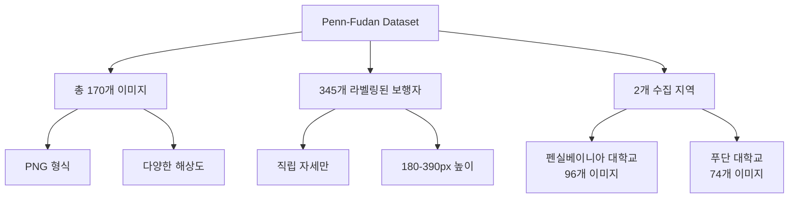
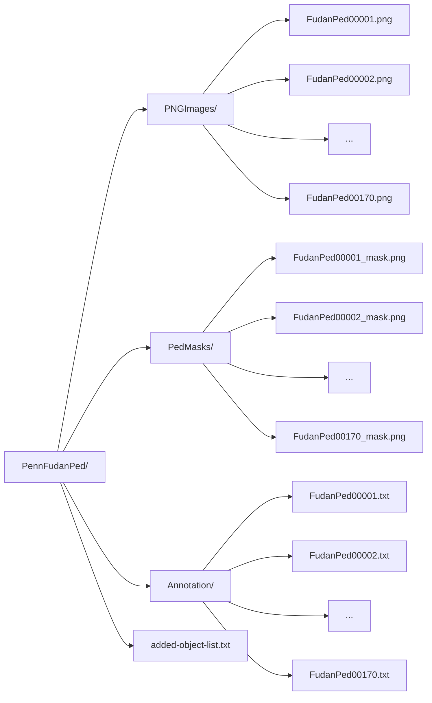
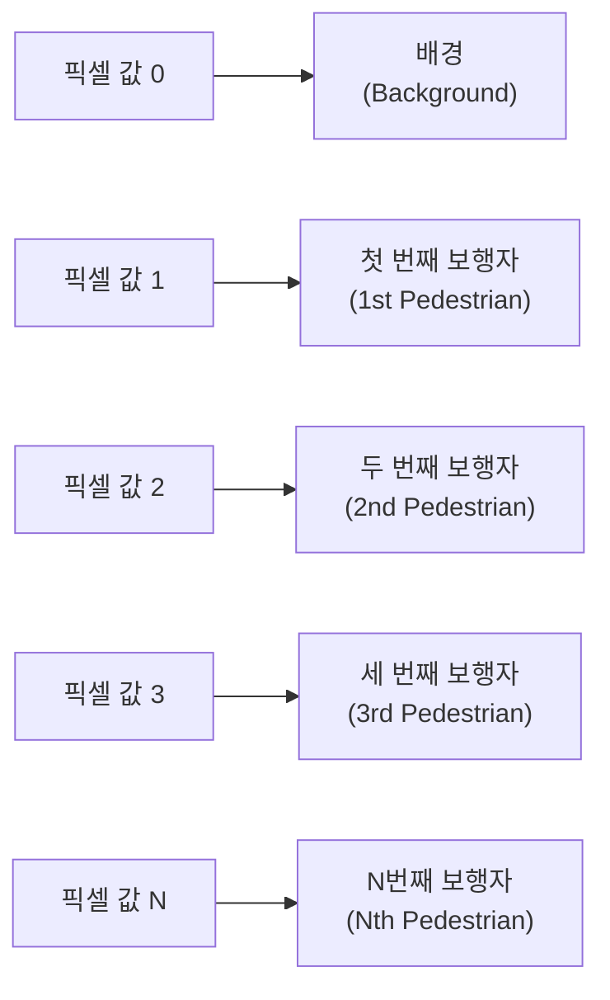
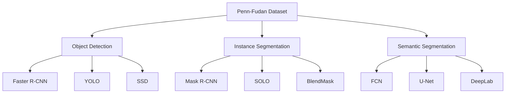

# Penn-Fudan Pedestrian 데이터셋

**작성자**: 코드잇 AI엔지니어 4기 김명환  
**작성일**: 2025년 8월 28일

---

## 1. 개요 (Overview)

Penn-Fudan Pedestrian Dataset은 보행자 탐지(pedestrian detection)와 인스턴스 세그멘테이션(instance segmentation)을 위한 컴퓨터 비전 데이터셋입니다. 펜실베이니아 대학교와 푸단 대학교 캠퍼스 및 주변 도심 지역에서 수집된 이미지로 구성되어 있습니다.

### 1.1. 데이터셋 기본 정보



### 1.2. 데이터셋 특징

- **수집 환경**: 캠퍼스 및 도시 거리 환경
- **촬영 조건**: 자연광, 다양한 시간대
- **보행자 자세**: 직립 상태의 보행자만 포함
- **크기 제한**: 보행자 높이 180-390 픽셀 범위
- **어노테이션 표준**: PASCAL VOC 1.00 호환

---

## 2. 디렉토리 구조 (Directory Structure)

### 2.1. 전체 폴더 구성



### 2.2. 각 폴더 설명

| 폴더명 | 설명 | 파일 형식 |
|--------|------|-----------|
| **PNGImages** | 원본 이미지 파일들 | PNG |
| **PedMasks** | 인스턴스 분할 마스크 파일들 | PNG (8-bit 그레이스케일) |
| **Annotation** | 바운딩 박스 및 메타데이터 | TXT (PASCAL VOC 형식) |

---

## 3. 클래스 정보 (Class Information)

### 3.1. 클래스 구성

Penn-Fudan Dataset은 **단일 클래스 데이터셋**입니다.

- **클래스 수**: 1개 (배경 제외)
- **클래스명**: `PASpersonWalking`
- **실제 의미**: 보행자 (Pedestrian)

### 3.2. 클래스 매핑 체계

| 클래스 ID | 클래스명 | 설명 |
|-----------|----------|------|
| 0 | background | 배경 영역 |
| 1 | pedestrian | 보행자 (`PASpersonWalking`) |

### 3.3. 클래스 제약사항

#### 포함되는 객체
- ✅ 직립 자세의 보행자
- ✅ 정면, 측면, 후면 보행자
- ✅ 180-390 픽셀 높이 범위
- ✅ 부분적으로 가려진 보행자 (최신 버전)

#### 제외되는 객체  
- ❌ 자전거를 탄 사람
- ❌ 차량 내부의 사람
- ❌ 앉아있거나 누워있는 사람
- ❌ 극도로 작은 보행자 (<180px)
- ❌ 심하게 가려진 보행자 (구버전)

---

## 4. 어노테이션 파일 구조 (Annotation Format)

### 4.1. 어노테이션 파일 예시

각 `txt` 파일은 다음과 같은 구조를 가집니다:

```
# Compatible with PASCAL Annotation Version 1.00
Image filename : "PennFudanPed/PNGImages/FudanPed00001.png"
Image size (X x Y x C) : 559 x 536 x 3
Database : "The Penn-Fudan-Pedestrian Database"
Objects with ground truth : 2 { "PASpersonWalking" "PASpersonWalking" }

# Top left pixel co-ordinates : (1, 1)
# Details for pedestrian 1 ("PASpersonWalking")
Original label for object 1 "PASpersonWalking" : "PennFudanPed"
Bounding box for object 1 "PASpersonWalking" (Xmin, Ymin) - (Xmax, Ymax) : (160, 182) - (302, 431)
Pixel mask for object 1 "PASpersonWalking" : "PennFudanPed/PedMasks/FudanPed00001_mask.png"

# Details for pedestrian 2 ("PASpersonWalking")
Original label for object 2 "PASpersonWalking" : "PennFudanPed"
Bounding box for object 2 "PASpersonWalking" (Xmin, Ymin) - (Xmax, Ymax) : (420, 171) - (535, 486)
Pixel mask for object 2 "PASpersonWalking" : "PennFudanPed/PedMasks/FudanPed00001_mask.png"
```

### 4.2. 주요 필드 설명

| 필드명 | 설명 | 예시 값 |
|--------|------|---------|
| **Image filename** | 원본 이미지 파일 경로 | `"PennFudanPed/PNGImages/FudanPed00001.png"` |
| **Image size** | 이미지 크기 (폭×높이×채널) | `559 x 536 x 3` |
| **Objects with ground truth** | 라벨링된 객체 수 | `2 { "PASpersonWalking" "PASpersonWalking" }` |
| **Bounding box** | 바운딩 박스 좌표 (1-based) | `(160, 182) - (302, 431)` |
| **Pixel mask** | 해당 마스크 파일 경로 | `"PennFudanPed/PedMasks/FudanPed00001_mask.png"` |

### 4.3. 좌표계 특성

- **좌표 기준점**: 좌상단 (1, 1)부터 시작 (1-based 인덱싱)
- **바운딩 박스 형식**: (Xmin, Ymin) - (Xmax, Ymax)
- **PASCAL VOC 호환**: 표준 PASCAL VOC 툴킷 사용 가능

---

## 5. 마스크 파일 특성 (Mask Characteristics)

### 5.1. 마스크 파일 기본 정보

- **파일 형식**: PNG (8-bit 그레이스케일)
- **해상도**: 원본 이미지와 동일
- **픽셀 값 범위**: 0-255 (실제 사용: 0~N)
- **저장 위치**: `PedMasks/` 폴더

### 5.2. 픽셀 값과 인스턴스 매핑



### 5.3. 마스크 품질 특성

#### 정밀도 특징
- **픽셀 단위** 정확한 경계선
- **세부 부위** 포함 (머리카락, 팔다리)
- **의복 경계선** 고려한 정밀 마스킹
- **매끄러운 경계** (앨리어싱 최소화)

#### 인스턴스 분할 특성
- **개별 인스턴스** 고유 픽셀 값 할당
- **겹침 상황**에서도 명확한 구분
- **연결된 단일 영역** (커넥티드 컴포넌트)
- **내부 홀** 거의 없는 단순한 형태

### 5.4. 시각화용 컬러 팔레트 (INSTANCE_COLORS)

마스크 시각화 및 결과 분석을 위한 권장 컬러 매핑:

| 인스턴스 | RGB 값 | 컬러명 | 시각적 표현 |
|----------|---------|--------|-------------|
| 배경 (0) | (0, 0, 0) | 검은색 | ⬛ |
| 인스턴스 1 | (255, 0, 0) | 빨간색 | 🟥 |
| 인스턴스 2 | (0, 255, 0) | 초록색 | 🟩 |
| 인스턴스 3 | (0, 0, 255) | 파란색 | 🟦 |
| 인스턴스 4 | (255, 255, 0) | 노란색 | 🟨 |
| 인스턴스 5 | (255, 0, 255) | 자주색 | 🟪 |
| 인스턴스 6 | (0, 255, 255) | 청록색 | 🟦 |
| 인스턴스 7 | (255, 128, 0) | 주황색 | 🟧 |
| 인스턴스 8 | (128, 0, 255) | 보라색 | 🟣 |

---

## 6. 데이터셋 통계 및 분포 (Statistics & Distribution)

### 6.1. 기본 통계

- **총 이미지 수**: 170개
- **총 보행자 인스턴스**: 345개
- **이미지당 평균 보행자 수**: 약 2.03개
- **최소 보행자 수**: 1개/이미지
- **최대 보행자 수**: 약 5-6개/이미지

### 6.2. 크기 분포 특성

#### 보행자 크기 범위
- **최소 높이**: 180 픽셀
- **최대 높이**: 390 픽셀  
- **평균 높이**: 약 285 픽셀 (추정)
- **종횡비**: 일반적인 인체 비율 (약 1:2.5)

#### 이미지 해상도
- **해상도 범위**: 다양한 크기 (최소 400×300 ~ 최대 800×600 정도)
- **종횡비**: 주로 4:3 또는 16:10 비율
- **파일 크기**: 이미지당 평균 100-500KB

### 6.3. 환경 다양성

#### 촬영 위치
- **펜실베이니아 대학교**: 96개 이미지 (56.5%)
- **푸단 대학교**: 74개 이미지 (43.5%)

#### 환경적 특성
- **캠퍼스 환경**: 보도, 광장, 건물 앞
- **도심 환경**: 도로변, 횡단보도, 상업지구
- **조명 조건**: 자연광, 그림자, 다양한 시간대
- **배경 다양성**: 건물, 나무, 차량 등

---

## 7. 활용 분야 및 태스크 (Applications & Tasks)

### 7.1. 주요 컴퓨터 비전 태스크



### 7.2. 적용 가능한 딥러닝 모델

#### Object Detection 모델
- **Faster R-CNN**: 높은 정확도의 2-stage 디텍터
- **YOLO 시리즈**: 실시간 처리 가능한 1-stage 디텍터  
- **SSD**: 다중 스케일 디텍터
- **RetinaNet**: 포컬 로스 적용 모델

#### Instance Segmentation 모델  
- **Mask R-CNN**: 가장 널리 사용되는 인스턴스 세그멘테이션 모델
- **SOLO/SOLOv2**: 인스턴스 세그멘테이션 전용 모델
- **BlendMask**: 실시간 인스턴스 세그멘테이션
- **CondInst**: 컨디셔널 인스턴스 세그멘테이션

### 7.3. 실제 응용 분야

- **보행자 안전 시스템**: 자율주행차, 스마트 시티
- **보안 감시**: CCTV 기반 보행자 추적
- **교통 분석**: 보행자 밀도 및 흐름 분석  
- **로보틱스**: 서비스 로봇의 인간 인식
- **증강현실**: 사람 검출 기반 AR 애플리케이션

---

## 8. 데이터셋 한계점 및 고려사항

### 8.1. 클래스 제한성

- **단일 클래스**: 보행자만 라벨링 (차량, 자전거 등 제외)
- **자세 제한**: 직립 자세만 포함 (앉기, 눕기 등 제외)
- **크기 제한**: 매우 작거나 큰 보행자 제외

### 8.2. 환경적 제약

- **지역 편향**: 특정 대학 캠퍼스 환경에 치중
- **문화적 편향**: 동아시아 및 북미 지역 한정
- **시간적 제약**: 특정 시기의 촬영 데이터

### 8.3. 어노테이션 한계

- **가림 처리**: 심하게 가려진 보행자는 불완전한 라벨링
- **경계 모호성**: 복잡한 배경에서 경계선 판단 어려움
- **일관성 문제**: 라벨러 간 주관적 판단 차이 가능

---

## 9. 다른 데이터셋과의 비교

### 9.1. 주요 보행자 데이터셋 비교

| 데이터셋 | 이미지 수 | 보행자 수 | 클래스 수 | 어노테이션 타입 |
|----------|-----------|-----------|-----------|----------------|
| **Penn-Fudan** | 170 | 345 | 1 | 박스 + 마스크 |
| COCO (Person) | 118K | 262K | 80 | 박스 + 마스크 |
| CityPersons | 5K | 35K | 3 | 박스만 |
| PASCAL VOC (Person) | 11K | 27K | 20 | 박스 + 마스크 |
| Caltech Pedestrian | 10시간 | 350K | 1 | 박스만 |

### 9.2. Penn-Fudan의 차별점

#### 장점
- **고품질 어노테이션**: 정밀한 인스턴스 마스크
- **PASCAL VOC 호환**: 표준 툴킷 사용 가능
- **교육용 최적화**: 학습 및 연구에 적절한 크기
- **명확한 인스턴스 구분**: 겹침 상황에서도 정확한 분리

#### 단점  
- **제한된 크기**: 170개 이미지로 상대적으로 소규모
- **환경 다양성 부족**: 특정 지역에 한정
- **단일 클래스**: 다중 클래스 학습에 부적합

---

## 10. 데이터 사용 가이드라인

### 10.1. 저작권 및 라이선스

- **학술 연구 목적**: 자유로운 사용 허용
- **상업적 이용**: 저작권자의 명시적 허가 필요
- **재배포 제한**: 원본 데이터의 무단 재게시 금지
- **인용 의무**: 관련 논문 및 데이터셋 출처 명시

### 10.2. 권장 사용 방법

#### 학습 데이터 분할
- **훈련 세트**: 전체의 70-80% (약 120-136개 이미지)
- **검증 세트**: 전체의 10-15% (약 17-26개 이미지)  
- **테스트 세트**: 전체의 10-15% (약 17-26개 이미지)

#### 데이터 증강 권장사항
- **수평 뒤집기**: 50% 확률 적용
- **색상 조정**: 밝기, 대비, 채도 변경
- **크기 조정**: 0.8-1.2배 스케일링
- **회전**: ±5도 범위 내 미세 회전

### 10.3. 평가 지표 (Evaluation Metrics)

#### Object Detection 평가
- **mAP (mean Average Precision)**: IoU 임계값별 정확도
- **AP50**: IoU=0.5에서의 애버리지 프리시전
- **AP75**: IoU=0.75에서의 애버리지 프리시전
- **Recall**: 실제 보행자 중 검출된 비율

#### Instance Segmentation 평가
- **Mask mAP**: 마스크 기반 평균 정확도
- **Box mAP**: 바운딩 박스 기반 평균 정확도  
- **Segmentation IoU**: 픽셀 단위 인터섹션 오버 유니온 비율

---

## 11. 관련 연구 및 참고문헌

### 11.1. 원본 논문

**[1] Object Detection Combining Recognition and Segmentation**
- 저자: Liming Wang, Jianbo Shi, Gang Song, I-fan Shen
- 학회: Eighth Asian Conference on Computer Vision (ACCV) 2007
- 내용: 인식과 분할을 결합한 객체 검출 방법론

### 11.2. 데이터셋 관련 정보

- **공식 웹사이트**: https://www.cis.upenn.edu/~jshi/ped_html/
- **다운로드 링크**: https://www.cis.upenn.edu/~jshi/ped_html/PennFudanPed.zip
- **파일 크기**: 압축 파일 약 51MB, 압축 해제 후 52MB
- **연락처**: limingw@seas.upenn.edu, jshi@cis.upenn.edu

### 11.3. 활용 논문 예시

- Faster R-CNN 기반 보행자 검출 연구
- Mask R-CNN을 이용한 인스턴스 분할 연구
- YOLO 계열 모델의 보행자 검출 성능 분석
- 실시간 보행자 추적 시스템 구현

---

## 용어 목록 (Glossary)

| 용어 | 설명 |
|------|------|
| **Annotation** | 데이터에 라벨이나 메타정보를 부여하는 작업 |
| **Bounding Box** | 객체를 감싸는 최소 사각형 영역 |
| **Ground Truth** | 정답 데이터, 실제 참값 |
| **Instance Segmentation** | 개별 객체 단위로 픽셀을 분할하는 기법 |
| **IoU (Intersection over Union)** | 교집합/합집합 비율, 객체 검출 성능 지표 |
| **mAP (mean Average Precision)** | 평균 정밀도, 객체 검출 모델 성능 평가 지표 |
| **Mask** | 객체의 정확한 형태를 나타내는 픽셀 단위 영역 |
| **Object Detection** | 이미지에서 특정 객체를 찾고 위치를 식별하는 기법 |
| **Occlusion** | 객체가 다른 객체에 의해 가려지는 현상 |
| **PASCAL VOC** | 컴퓨터 비전 분야의 표준 데이터셋 및 어노테이션 형식 |
| **Pedestrian** | 보행자 |
| **Pixel** | 이미지의 최소 구성 단위 |
| **Semantic Segmentation** | 픽셀별로 클래스를 분류하는 기법 |
