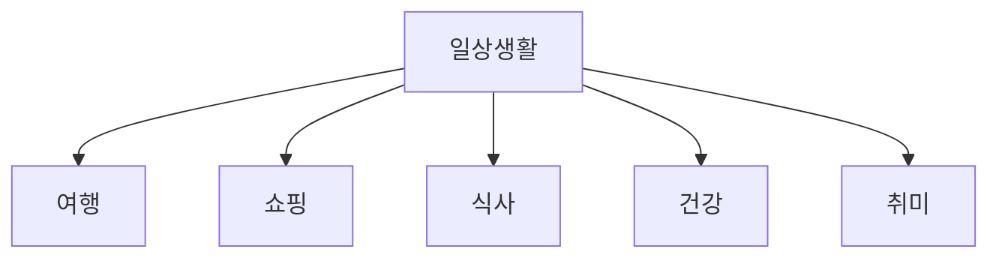

# 일상생활 및 구어체 한영 번역 데이터셋 분석

## 목차

1. [데이터셋 개요](#1-데이터셋-개요)<br/>
   1.1. [목적 및 활용 범위](#11-목적-및-활용-범위)<br/>
   1.2. [데이터 규모](#12-데이터-규모)<br/>
   1.3. [데이터 분할 전략](#13-데이터-분할-전략)<br/>

2. [데이터 스키마](#2-데이터-스키마)<br/>
   2.1. [필드 구조](#21-필드-구조)<br/>
   2.2. [학습 타겟 필드](#22-학습-타겟-필드)<br/>
   2.3. [메타데이터 필드](#23-메타데이터-필드)<br/>

3. [도메인 분석](#3-도메인-분석)<br/>
   3.1. [도메인 분류 체계](#31-도메인-분류-체계)<br/>
   3.2. [서브도메인 특성](#32-서브도메인-특성)<br/>
   3.3. [구어체 데이터 특징](#33-구어체-데이터-특징)<br/>

4. [텍스트 통계 분석](#4-텍스트-통계-분석)<br/>
   4.1. [문장 길이 분포](#41-문장-길이-분포)<br/>
   4.2. [단어 비율 분석](#42-단어-비율-분석)<br/>
   4.3. [어휘 다양성](#43-어휘-다양성)<br/>

5. [학습 데이터 품질 고려사항](#5-학습-데이터-품질-고려사항)<br/>
   5.1. [알려지지 않은 단어 처리](#51-알려지지-않은-단어-처리)<br/>
   5.2. [특수 문자 패턴](#52-특수-문자-패턴)<br/>
   5.3. [품질 이상치](#53-품질-이상치)<br/>

6. [신경망 기계번역 모델링 전략](#6-신경망-기계번역-모델링-전략)<br/>
   6.1. [시퀀스 길이 최적화](#61-시퀀스-길이-최적화)<br/>
   6.2. [배치 구성 전략](#62-배치-구성-전략)<br/>
   6.3. [평가 메트릭](#63-평가-메트릭)<br/>

7. [데이터셋 특성 요약](#7-데이터셋-특성-요약)<br/>

8. [용어 목록](#8-용어-목록)<br/>

---

## 1. 데이터셋 개요

### 1.1. 목적 및 활용 범위

본 데이터셋은 **일상생활 및 구어체** 표현에 특화된 한국어-영어 신경망 기계번역(Neural Machine Translation, NMT) 모델 학습을 위해 구축되었다.<br/>
일반적인 문어체 번역 시스템과 달리, 실제 대화에서 자주 사용되는 구어적 표현, 감탄사, 생략 표현 등을 포괄하여 보다 자연스러운 일상 대화 번역을 목표로 한다.

**주요 활용 시나리오(scenario)**
- 실시간 대화 번역 시스템
- 자막 번역 엔진
- 챗봇 및 대화형 인공지능
- 여행 및 일상 커뮤니케이션(communication) 지원 애플리케이션(application)

### 1.2. 데이터 규모

| 구분 | 파일명 | 파일 크기 | 샘플 수 |
|------|--------|-----------|---------|
| **훈련 데이터** | 일상생활및구어체_한영_train_set.json | 949MB | 약 1,031,323개 |
| **검증 데이터** | 일상생활및구어체_한영_valid_set.json | 118MB | 약 136,175개 |
| **합계** | - | 1,067MB | **1,167,498개** |

훈련 데이터와 검증 데이터의 비율은 약 **88.3:11.7**로, 일반적인 머신러닝(machine learning) 프랙티스(practice)에서 권장하는 80:20 또는 90:10 분할 전략과 유사하다.

### 1.3. 데이터 분할 전략

데이터는 **무작위 분할(random split)**이 아닌 **전략적 분할(stratified split)**로 구성되었을 가능성이 높다. 이는 도메인별, 출처별 분포가 훈련 데이터와 검증 데이터 간에 일관성을 유지하도록 하여, 모델이 특정 도메인에 과적합(overfitting)되는 것을 방지한다.

**분할 시 고려 요소**
- 도메인 및 서브도메인 균형
- 문장 길이 분포 일관성
- 출처(source) 다양성 확보

---

## 2. 데이터 스키마

### 2.1. 필드 구조

각 샘플은 JSON 오브젝트(object) 형태로 저장되며, 다음과 같은 필드로 구성된다.

```json
{
  "sn": "KTOS062012215138740",
  "data_set": "일상생활및구어체",
  "domain": "일상생활",
  "subdomain": "여행",
  "ko_original": ">아, 진짜요?",
  "ko": ">아, 진짜요?",
  "mt": "Oh, really?",
  "en": ">Oh, really?",
  "source_language": "ko",
  "target_language": "en",
  "word_count_ko": 2,
  "word_count_en": 2,
  "word_ratio": 1.0,
  "file_name": "여행_KTOS.xlsx",
  "source": "SBS",
  "license": "open",
  "style": "구어체",
  "included_unknown_words": false,
  "ner": null
}
```

### 2.2. 학습 타겟 필드

본 미션에서는 다음과 같이 필드를 활용한다:

**입력 (Source)**
- **`ko`**: 한국어 원문 (전처리된 버전)
- `ko_original`: 원본 한국어 (참고용)

**출력 (Target)**
- **`mt`**: 기계번역 결과 또는 번역 타겟 (학습 및 평가에 사용)
- `en`: 사람이 번역한 참조 번역 (분석 참고용, 학습에 미사용)

**학습 페어(pair)**: `ko` → `mt`

신경망 모델은 `ko` 필드를 인코더(encoder) 입력으로 받아, `mt` 필드를 디코더(decoder) 타겟으로 예측하도록 학습된다. 이는 시퀀스-투-시퀀스(sequence-to-sequence) 아키텍처(architecture)의 전형적인 학습 방식이다.

### 2.3. 메타데이터 필드

| 필드명 | 타입 | 설명 |
|--------|------|------|
| `sn` | 문자열 | 샘플 고유 식별자 (Serial Number) |
| `data_set` | 문자열 | 데이터셋 카테고리(category) |
| `domain` | 문자열 | 대분류 도메인 |
| `subdomain` | 문자열 | 소분류 서브도메인 |
| `source_language` | 문자열 | 소스 언어 코드 (`ko`) |
| `target_language` | 문자열 | 타겟 언어 코드 (`en`) |
| `word_count_ko` | 정수 | 한국어 단어 수 |
| `word_count_en` | 정수 | 영어 단어 수 |
| `word_ratio` | 실수 | 영어/한국어 단어 비율 |
| `file_name` | 문자열 | 원본 파일명 |
| `source` | 문자열 | 데이터 출처 (예: SBS) |
| `license` | 문자열 | 라이선스 정보 |
| `style` | 문자열 | 문체 스타일 (구어체/문어체) |
| `included_unknown_words` | 불린 | 미등록 단어 포함 여부 |
| `ner` | 객체/널 | 개체명 인식 정보 |

---

## 3. 도메인 분석

### 3.1. 도메인 분류 체계

데이터는 계층적 도메인 구조로 분류된다. 대분류 `domain`과 세부 분류 `subdomain`으로 구성되어 있다.

**예시 계층 구조**



이러한 도메인 분류는 다음과 같은 이점을 제공한다:
- **도메인 특화 모델 학습**: 특정 도메인에 집중한 파인튜닝(fine-tuning) 가능
- **성능 평가 세분화**: 도메인별 번역 품질 측정
- **데이터 증강 전략**: 부족한 도메인 선택적 보완

### 3.2. 서브도메인 특성

서브도메인은 실제 사용 맥락(context)을 반영한다. 예를 들어 "여행" 서브도메인에는 다음과 같은 표현이 포함될 가능성이 높다:
- 호텔 예약 대화
- 길 찾기 표현
- 관광지 안내
- 교통수단 관련 표현

각 서브도메인은 특정 어휘 집합(vocabulary set)과 문장 패턴을 공유하므로, 도메인 인식(domain-aware) 학습 전략을 수립할 수 있다.

### 3.3. 구어체 데이터 특징

`style: "구어체"` 필드가 나타내는 특성은 다음과 같다:

**구어체 표현의 특징**
- **생략 표현**: "나 오늘 안 가" (→ "나는 오늘 가지 않아")
- **감탄사**: "아", "오", "어머", "헉"
- **반말 및 존댓말 혼용**: 다양한 격식 수준
- **특수 기호**: ">", "~", "..." 등의 대화 마커(marker)
- **문장 단절**: 완전하지 않은 문장 구조

이러한 특성은 전통적인 문어체 중심 번역 모델과 차별화되는 핵심 요소이다.

---

## 4. 텍스트 통계 분석

### 4.1. 문장 길이 분포

**단어 수 기준 통계**

샘플 데이터 기준으로 `word_count_ko=2`, `word_count_en=2`인 매우 짧은 문장이 존재한다. 일상생활 및 구어체 데이터의 특성상 다음과 같은 분포가 예상된다:

| 문장 길이 구간 | 예상 비율 | 특징 |
|---------------|-----------|------|
| 1~5 단어 | 높음 | 짧은 응답, 감탄사 |
| 6~15 단어 | 중간 | 일반적인 대화 문장 |
| 16~30 단어 | 낮음 | 설명적 문장 |
| 31+ 단어 | 매우 낮음 | 복잡한 서술 |

구어체 데이터는 문어체에 비해 **평균 문장 길이가 짧고**, **분산(variance)이 크다**는 특징을 보인다.

**시퀀스 길이 고려사항**

신경망 번역 모델에서는 토큰(token) 기준 길이가 중요하다. 단어 수와 토큰 수의 관계는 토크나이제이션(tokenization) 방법에 따라 달라진다:

$$
\text{Token Count} = \text{Word Count} \times \text{Tokenization Factor}
$$

예를 들어, 서브워드(subword) 토크나이저를 사용할 경우 팩터(factor)는 1.2~1.8 정도가 될 수 있다.

### 4.2. 단어 비율 분석

`word_ratio` 필드는 다음과 같이 계산된다:

$$
\text{word\_ratio} = \frac{\text{word\_count\_en}}{\text{word\_count\_ko}}
$$

샘플 데이터에서 `word_ratio=1.0`은 한국어와 영어의 단어 수가 동일함을 의미한다. 그러나 일반적으로 한영 번역에서는 다음과 같은 경향이 있다:

**일반적인 비율 범위**
- **평균 비율**: 0.8 ~ 1.2
- **한국어가 더 긴 경우**: 조사, 어미 등이 별도 단어로 카운트될 때
- **영어가 더 긴 경우**: 관사, 전치사 등이 추가될 때

**이상치(outlier) 탐지**

매우 높거나 낮은 `word_ratio` (예: 0.3 이하 또는 3.0 이상)는 다음을 의미할 수 있다:
- 번역 오류
- 의역(paraphrase) 정도가 높음
- 전문 용어의 설명적 번역

### 4.3. 어휘 다양성

**어휘 풍부도 측정**

전체 데이터셋의 어휘 다양성은 타입-토큰 비율(Type-Token Ratio, TTR)로 측정할 수 있다:

$$
\text{TTR} = \frac{\text{Unique Words}}{\text{Total Words}}
$$

구어체 데이터는 문어체에 비해 다음과 같은 특성을 보인다:
- **낮은 TTR**: 반복되는 일상 표현이 많음
- **높은 빈도 집중도**: 상위 1000개 단어가 전체의 80% 이상 커버
- **도메인별 편차**: 전문적인 서브도메인일수록 TTR 증가

**커버리지(coverage) 분석**

학습 데이터의 어휘가 검증 데이터를 얼마나 커버하는지는 중요한 지표이다:

$$
\text{Vocabulary Coverage} = \frac{\text{Valid Vocab} \cap \text{Train Vocab}}{\text{Valid Vocab}} \times 100\%
$$

이상적으로는 95% 이상의 커버리지가 확보되어야 모델이 검증 데이터에서 안정적인 성능을 발휘할 수 있다.

---

## 5. 학습 데이터 품질 고려사항

### 5.1. 알려지지 않은 단어 처리

`included_unknown_words: false` 필드는 해당 샘플에 미등록 단어가 포함되지 않았음을 나타낸다.

**알려지지 않은 단어(Unknown Words)의 영향**
- **학습 단계**: 모델이 학습하지 못한 패턴이 포함되어 노이즈(noise) 발생
- **추론 단계**: 어휘 외 토큰(Out-of-Vocabulary, OOV)으로 처리되어 성능 저하
- **서브워드 토크나이저 활용**: BPE(Byte Pair Encoding), SentencePiece 등으로 OOV 문제 완화

**품질 관리 전략**
- Unknown words가 포함된 샘플은 별도 분석
- 도메인별 전문 용어 사전(lexicon) 구축
- 데이터 클리닝 시 우선순위 조정

### 5.2. 특수 문자 패턴

샘플에서 나타난 `">아, 진짜요?"` 같은 표현은 다음과 같은 특수 패턴을 포함한다:

**대화 마커**
- `>`: 인용 또는 화자 전환
- `...`: 말줄임, 머뭇거림
- `~`: 어감 표현

**문장 부호 처리**
- 느낌표, 물음표의 빈도가 높음
- 여러 부호 연속 사용 (예: "??", "!!")

이러한 패턴은 구어체의 감정과 뉘앙스(nuance)를 전달하는 중요한 요소이므로, 전처리 시 제거하지 않고 보존해야 한다. 다만, 토크나이저가 이를 적절히 처리할 수 있도록 설정해야 한다.

### 5.3. 품질 이상치

**잠재적 품질 이슈**
- **단일 단어 샘플**: 맥락 없는 단어만 포함된 경우
- **번역 불일치**: `ko`와 `mt`의 의미가 크게 다른 경우
- **중복 데이터**: 동일한 문장 쌍이 반복되는 경우
- **노이즈 문자**: 특수 인코딩 오류나 불필요한 기호

**품질 검증 방법**
- 문장 길이 분포의 통계적 이상치 탐지
- 번역 일관성 체크 (예: 역번역 스코어)
- 데이터 중복도 측정 (해시 기반 중복 제거)

---

## 6. 신경망 기계번역 모델링 전략

### 6.1. 시퀀스 길이 최적화

**동적 시퀀스 길이 설정**

고정된 최대 길이(max length)를 설정하는 대신, 데이터 분포에 기반한 동적 설정이 효율적이다:

$$
\text{Max Length} = \text{Percentile}_{95}(\text{Sequence Lengths}) + \text{Padding}
$$

예를 들어, 95 퍼센타일(percentile)이 50 토큰이라면 최대 길이를 60~64 토큰으로 설정하여 대부분의 데이터를 커버하면서도 메모리 효율을 유지할 수 있다.

**버킷팅(bucketing) 전략**

시퀀스 길이가 다양한 구어체 데이터에서는 버킷팅이 효과적이다:
- **짧은 시퀀스 버킷**: 1~10 토큰
- **중간 시퀀스 버킷**: 11~30 토큰
- **긴 시퀀스 버킷**: 31~60 토큰

각 버킷별로 배치를 구성하여 패딩(padding) 낭비를 최소화한다.

### 6.2. 배치 구성 전략

**배치 크기 결정**

GPU 메모리와 학습 속도를 고려한 배치 크기 설정:

$$
\text{Effective Batch Size} = \text{Batch Size} \times \text{Gradient Accumulation Steps}
$$

일반적인 설정:
- **작은 모델 (< 100M 파라미터(parameters))**: Batch size 32~64
- **중간 모델 (100M~500M)**: Batch size 16~32
- **큰 모델 (> 500M)**: Batch size 8~16, Gradient accumulation 사용

**도메인 균형 배치 샘플링**

각 배치에 여러 도메인이 고르게 포함되도록 샘플링하여 모델이 특정 도메인에 편향(bias)되지 않도록 한다.

### 6.3. 평가 메트릭

**BLEU 스코어**

가장 널리 사용되는 번역 품질 메트릭:

$$
\text{BLEU} = \text{BP} \times \exp\left(\sum_{n=1}^{N} w_n \log p_n\right)
$$

여기서:
- $\text{BP}$: Brevity Penalty (짧은 번역 패널티)
- $p_n$: n-gram precision
- $w_n$: 가중치 (일반적으로 균등 분배)

**추가 메트릭**
- **METEOR**: 동의어 및 형태소 고려
- **chrF**: 문자 수준 F-score
- **BERTScore**: 의미론적(semantic) 유사도
- **TER (Translation Edit Rate)**: 편집 거리 기반

구어체 데이터는 문어체보다 다양한 표현이 가능하므로, 단일 메트릭이 아닌 **다중 메트릭 앙상블(ensemble) 평가**가 권장된다.

**손실 함수(Loss Function)**

학습 중에는 크로스 엔트로피 손실을 사용:

$$
\mathcal{L} = -\frac{1}{N}\sum_{i=1}^{N}\sum_{t=1}^{T} \log P(y_t^{(i)} | y_{<t}^{(i)}, x^{(i)})
$$

여기서:
- $x^{(i)}$: 입력 시퀀스 (`ko`)
- $y_t^{(i)}$: 시간 단계 $t$의 타겟 토큰 (`mt`)
- $P$: 모델의 예측 확률

---

## 7. 데이터셋 특성 요약

### 주요 강점

1. **대규모 코퍼스**: 약 117만 개 샘플로 딥러닝 모델 학습에 충분한 규모
2. **구어체 특화**: 실제 대화 표현에 최적화된 데이터
3. **도메인 다양성**: 여행, 쇼핑 등 다양한 일상생활 도메인 커버
4. **풍부한 메타데이터**: 도메인, 스타일, 출처 등 분석 및 필터링 가능한 정보 제공
5. **품질 관리**: Unknown words 플래그 등 품질 지표 포함

### 주요 고려사항

1. **짧은 문장 편중**: 구어체 특성상 매우 짧은 문장이 많아 컨텍스트(context) 부족 가능
2. **도메인 불균형 가능성**: 특정 서브도메인에 데이터 집중될 수 있음
3. **특수 문자 처리**: 대화 마커 및 특수 기호에 대한 적절한 처리 필요
4. **번역 일관성**: `mt` 필드의 번역 품질 균일성 확인 필요
5. **어휘 커버리지**: 저빈도 단어 및 전문 용어 처리 전략 수립 필요

### 권장 학습 전략

1. **워밍업(warm-up) 학습**: 작은 학습률로 시작하여 점진적 증가
2. **라벨 스무딩(label smoothing)**: 과신(overconfidence) 방지
3. **드롭아웃(dropout)**: 과적합 방지를 위한 정규화(regularization)
4. **체크포인트(checkpoint) 저장**: 에폭(epoch)별 모델 저장 및 조기 종료(early stopping)
5. **도메인 어댑테이션(domain adaptation)**: 특정 도메인 파인튜닝 고려

---

## 8. 용어 목록

| 용어 | 설명 |
|------|------|
| **Neural Machine Translation (NMT)** | 심층 신경망을 사용한 기계번역 기법 |
| **Encoder-Decoder Architecture** | 입력을 인코딩하고 출력을 디코딩하는 신경망 구조 |
| **Sequence-to-Sequence** | 가변 길이 시퀀스를 다른 시퀀스로 변환하는 모델 |
| **Token** | 텍스트를 구성하는 최소 단위 (단어, 서브워드, 문자 등) |
| **Tokenization** | 텍스트를 토큰으로 분할하는 과정 |
| **Subword Tokenization** | 단어를 더 작은 의미 단위로 분할하는 기법 |
| **Out-of-Vocabulary (OOV)** | 학습 시 보지 못한 어휘 |
| **Byte Pair Encoding (BPE)** | 데이터 압축 기반 서브워드 토크나이제이션 알고리즘 |
| **Corpus** | 언어 연구나 학습에 사용되는 대규모 텍스트 집합 |
| **Domain** | 특정 주제나 분야 |
| **Fine-tuning** | 사전 학습된 모델을 특정 작업에 맞게 추가 학습 |
| **Overfitting** | 학습 데이터에 과도하게 적합하여 일반화 성능 저하 |
| **Batch** | 한 번의 학습 단계에서 사용되는 샘플 묶음 |
| **Epoch** | 전체 학습 데이터를 한 번 순회하는 단위 |
| **Gradient Accumulation** | 작은 배치를 여러 번 축적하여 큰 배치 효과 |
| **Padding** | 시퀀스 길이를 맞추기 위해 추가하는 빈 토큰 |
| **Bucketing** | 비슷한 길이의 시퀀스를 묶어 처리하는 기법 |
| **Cross-Entropy Loss** | 분류 문제에서 예측과 실제 값의 차이를 측정하는 손실 함수 |
| **BLEU Score** | 기계번역 품질을 측정하는 자동 평가 지표 |
| **Perplexity** | 언어 모델의 성능을 측정하는 지표 (낮을수록 좋음) |
| **Attention Mechanism** | 입력의 중요한 부분에 집중하는 신경망 메커니즘 |
| **Transformer** | 어텐션 메커니즘 기반의 현대적 신경망 아키텍처 |
| **Learning Rate** | 모델 가중치 업데이트 속도를 조절하는 하이퍼파라미터 |
| **Warm-up** | 학습 초기에 작은 학습률로 시작하여 점진적으로 증가시키는 기법 |
| **Label Smoothing** | 정답 레이블을 부드럽게 하여 과신을 방지하는 정규화 기법 |
| **Dropout** | 학습 중 일부 뉴런을 무작위로 비활성화하여 과적합 방지 |
| **Regularization** | 모델의 복잡도를 제한하여 일반화 성능을 높이는 기법 |
| **Checkpoint** | 학습 중간에 저장되는 모델 상태 스냅샷 |
| **Early Stopping** | 검증 성능이 악화될 때 학습을 조기 종료하는 기법 |
| **Type-Token Ratio (TTR)** | 고유 단어 수 대비 전체 단어 수의 비율 |
| **Coverage** | 학습 어휘가 평가 어휘를 커버하는 비율 |
| **Stratified Split** | 각 클래스나 도메인의 비율을 유지하며 데이터 분할 |
| **Outlier** | 통계적으로 정상 범위를 벗어난 이상치 |
| **Paraphrase** | 의미는 유지하면서 표현을 바꾸는 것 |
| **Lexicon** | 특정 도메인이나 언어의 어휘 목록 |
| **Nuance** | 미묘한 의미나 감정의 차이 |
| **Bias** | 모델이 특정 패턴이나 데이터에 편향된 상태 |
| **Semantic** | 의미론적, 의미와 관련된 |
| **Ensemble** | 여러 모델이나 메트릭을 결합하는 기법 |
| **Brevity Penalty** | BLEU 스코어에서 짧은 번역에 부과하는 패널티 |
| **n-gram** | 연속된 n개의 단어 또는 토큰 시퀀스 |
| **Precision** | 예측한 것 중 정답인 비율 |
| **F-score** | 정밀도와 재현율의 조화 평균 |
| **Edit Distance** | 한 문자열을 다른 문자열로 변환하는 최소 편집 횟수 |
| **Hyperparameter** | 학습 과정을 제어하는 외부 설정 값 |
| **Inference** | 학습된 모델을 사용하여 예측하는 과정 |
| **Baseline** | 비교 기준이 되는 기본 모델 |
| **Benchmark** | 모델 성능을 평가하기 위한 표준 데이터셋이나 작업 |
| **Preprocessing** | 원시 데이터를 모델 입력에 적합한 형태로 변환 |
| **Postprocessing** | 모델 출력을 최종 결과로 변환하는 후처리 |
| **Data Augmentation** | 기존 데이터를 변형하여 학습 데이터 증가 |
| **Vocabulary Size** | 모델이 다루는 고유 토큰의 총 개수 |
| **Embedding** | 토큰을 고차원 벡터 공간으로 매핑하는 표현 |
| **Beam Search** | 여러 후보를 유지하며 최적의 시퀀스를 탐색하는 디코딩 기법 |
| **Greedy Decoding** | 각 단계에서 가장 확률이 높은 토큰을 선택하는 디코딩 |
| **Temperature** | 확률 분포의 날카로움을 조절하는 샘플링 파라미터 |
| **Context Window** | 모델이 한 번에 처리할 수 있는 입력 범위 |
| **Parallelization** | 연산을 병렬로 처리하여 학습 속도 향상 |
| **Gradient Descent** | 손실을 최소화하기 위해 기울기를 따라 파라미터 업데이트 |
| **Backpropagation** | 신경망에서 기울기를 역방향으로 전파하는 알고리즘 |
| **Activation Function** | 뉴런의 출력을 결정하는 비선형 함수 |
| **Loss Function** | 모델 예측과 실제 값의 차이를 수치화하는 함수 |
| **Optimizer** | 손실을 최소화하기 위한 파라미터 업데이트 알고리즘 |
| **Adam** | 적응적 학습률을 사용하는 인기 있는 옵티마이저 |
| **Learning Rate Scheduler** | 학습 과정에서 학습률을 동적으로 조절하는 메커니즘 |
| **Validation Set** | 모델 성능을 평가하고 하이퍼파라미터를 조정하기 위한 데이터셋 |
| **Test Set** | 최종 모델 성능을 평가하기 위한 별도 데이터셋 |
| **Generalization** | 학습 데이터를 넘어 새로운 데이터에 대한 성능 |
| **Transfer Learning** | 한 작업에서 학습한 지식을 다른 작업에 적용 |
| **Zero-shot Learning** | 학습하지 않은 작업을 수행하는 능력 |
| **Few-shot Learning** | 소량의 예시만으로 새로운 작업을 학습 |
| **Multilingual Model** | 여러 언어를 동시에 처리할 수 있는 모델 |
| **Monolingual Model** | 단일 언어 또는 언어 쌍에 특화된 모델 |

---

## 부록: 데이터셋 활용 시나리오

### A. 기본 학습 파이프라인


### B. 도메인 특화 학습

특정 도메인에 집중한 학습이 필요한 경우:

1. **전체 도메인 사전 학습**: 모든 데이터로 기본 모델 학습
2. **도메인 필터링**: 특정 서브도메인 데이터만 추출
3. **파인튜닝**: 해당 도메인으로 추가 학습
4. **도메인별 평가**: 해당 도메인 검증 데이터로 성능 측정

### C. 점진적 학습 전략

데이터가 단계적으로 추가되는 경우:

1. **초기 학습**: 기본 데이터셋으로 베이스라인(baseline) 모델 구축
2. **데이터 추가**: 새로운 도메인 또는 스타일 데이터 수집
3. **증분 학습**: 기존 모델을 새 데이터로 업데이트
4. **성능 모니터링**: 전체 도메인에서 성능 유지 확인

### D. 앙상블 모델 구축

여러 전문 모델을 결합하는 전략:

1. **도메인별 전문가 모델**: 각 서브도메인에 특화된 모델 학습
2. **라우터(router) 모델**: 입력 문장의 도메인을 분류
3. **앙상블 추론**: 적절한 전문가 모델 선택 또는 결합
4. **가중 투표**: 여러 모델의 출력을 가중 평균

---

## 부록: 데이터 품질 개선 방안

### 1. 노이즈 필터링

**자동 필터링 기준**
- 문장 길이 이상치 제거 (너무 짧거나 긴 문장)
- 번역 비율 이상치 제거 (word_ratio가 극단적인 경우)
- 특수 문자 과다 포함 샘플 검토
- 중복 샘플 제거

### 2. 품질 주석(annotation)

**수동 검수 우선순위**
1. Unknown words 포함 샘플
2. 번역 비율이 비정상적인 샘플
3. 매우 짧거나 긴 샘플
4. 고빈도로 등장하는 패턴

### 3. 데이터 증강 기법

**역번역(back-translation)**
- 영어 → 한국어 → 영어로 재번역하여 다양한 표현 생성
- 기존 데이터의 2~3배 증강 가능

**동의어 치환**
- 동의어 사전을 활용한 단어 교체
- 의미 보존하면서 표현 다양화

**문장 재구성**
- 문장 순서 변경 (복문의 경우)
- 능동태/피동태 전환

### 4. 균형 잡힌 샘플링

**도메인 균형**
- 과대표현된(over-represented) 도메인 샘플 다운샘플링(downsampling)
- 과소표현된(under-represented) 도메인 업샘플링(upsampling) 또는 증강

**길이 균형**
- 짧은 문장 위주를 보완하기 위해 중간 길이 샘플 증가
- 버킷별 균등 분포 유도

---

## 부록: 실험 설계 가이드

### 실험 1: 베이스라인 구축

**목표**: 기본 성능 확인

**설정**
- 모델: Transformer (base 또는 small)
- 배치 크기: 32
- 에폭: 10~20
- 학습률: 1e-4 (Adam 옵티마이저)
- 토크나이저: BPE (vocab size 32k)

**평가**
- BLEU, METEOR, chrF 측정
- 도메인별 성능 분석
- 추론 속도 측정

### 실험 2: 토크나이저 비교

**목표**: 최적 토크나이제이션 전략 선택

**비교 대상**
1. 단어 기반 토크나이저
2. BPE (Byte Pair Encoding)
3. SentencePiece (Unigram LM)
4. 자모 기반 토크나이저 (한국어 특화)

**평가 지표**
- 번역 품질 (BLEU)
- 어휘 크기
- OOV 비율
- 추론 속도

### 실험 3: 모델 크기 스케일링

**목표**: 모델 용량과 성능의 관계 파악

**모델 변형**
- Transformer-Tiny (hidden 256, layers 4)
- Transformer-Small (hidden 512, layers 6)
- Transformer-Base (hidden 768, layers 12)
- Transformer-Large (hidden 1024, layers 24)

**분석**
- 성능 대비 파라미터 수 효율성
- 학습 시간 및 메모리 사용량
- 과적합 경향성

### 실험 4: 학습 전략 비교

**목표**: 최적 학습 기법 발견

**전략**
1. 표준 학습
2. 라벨 스무딩 적용
3. 드롭아웃 비율 조정 (0.1, 0.2, 0.3)
4. 학습률 스케줄링 (cosine annealing, step decay)
5. 혼합 정밀도(mixed precision) 학습

**측정**
- 최종 성능
- 수렴 속도
- 학습 안정성

### 실험 5: 도메인 적응

**목표**: 도메인 특화 성능 향상

**방법**
1. 전체 데이터 사전 학습
2. 특정 도메인 파인튜닝
3. 도메인 태그 추가 학습
4. 멀티태스크 학습 (multi-task learning)

**평가**
- 타겟 도메인 성능 향상도
- 다른 도메인 성능 유지율
- 전이 학습 효과

---

## 참고문헌 및 리소스

### 핵심 논문

1. **Attention Is All You Need** (Vaswani et al., 2017)
   - Transformer 아키텍처 제안

2. **Neural Machine Translation by Jointly Learning to Align and Translate** (Bahdanau et al., 2014)
   - 어텐션 메커니즘 도입

3. **SentencePiece: A simple and language independent approach to subword tokenization** (Kudo & Richardson, 2018)
   - 언어 독립적 토크나이제이션

4. **BLEU: a Method for Automatic Evaluation of Machine Translation** (Papineni et al., 2002)
   - 기계번역 평가 메트릭

### 오픈소스 도구

- **Hugging Face Transformers**: 사전 학습 모델 및 토크나이저
- **OpenNMT**: 신경망 기계번역 프레임워크
- **SentencePiece**: 토크나이제이션 라이브러리
- **SacreBLEU**: 표준화된 BLEU 계산
- **TensorBoard**: 학습 모니터링 및 시각화

### 데이터셋

- **AI Hub**: 한국어 AI 데이터셋 포털
- **WMT (Workshop on Machine Translation)**: 국제 번역 벤치마크
- **OPUS**: 다국어 병렬 코퍼스

---

## 문서 개정 이력

| 버전 | 날짜 | 변경 사항 | 작성자 |
|------|------|-----------|--------|
| 1.0 | 2025-10-14 | 초기 문서 작성 | 김명환 |
