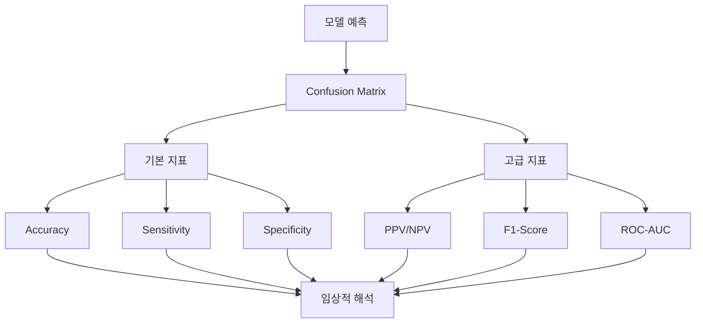
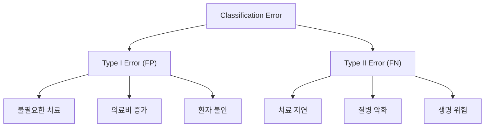
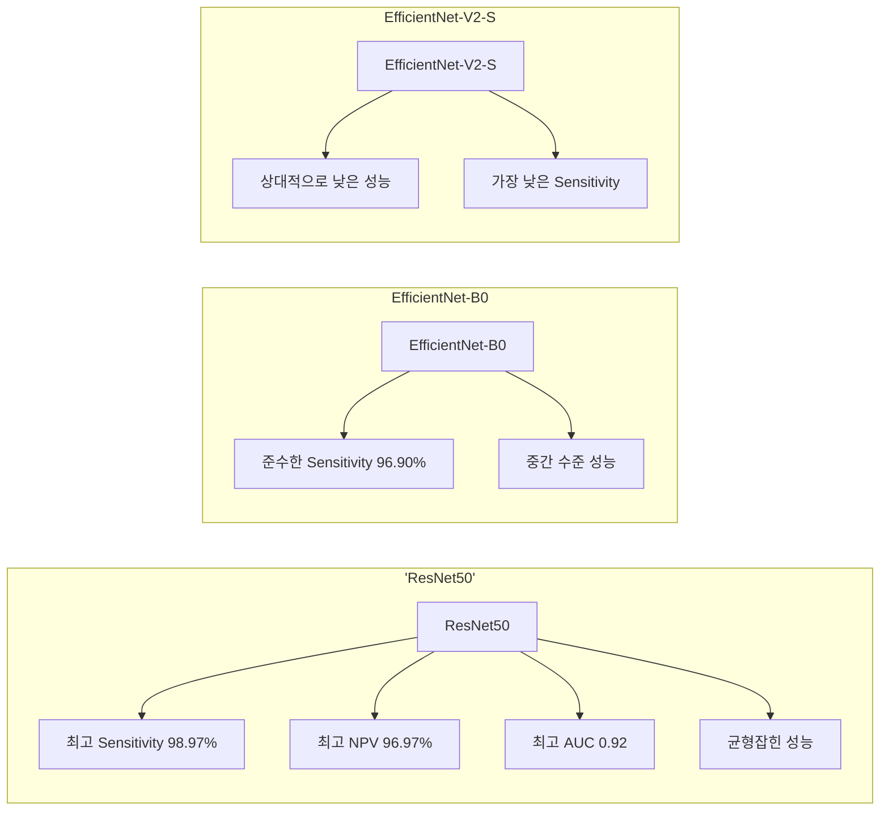
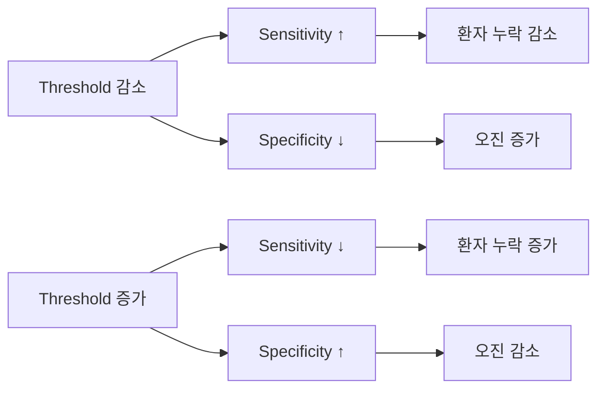

# 의료 진단 모델 성능 지표 분석 가이드

## 목차
1. [개요](#1-개요)
2. [Confusion Matrix 이해](#2-confusion-matrix-이해)
3. [핵심 성능 지표 분석](#3-핵심-성능-지표-분석)
   - 3.1. [기본 정확도 지표](#31-기본-정확도-지표)
   - 3.2. [민감도와 특이도](#32-민감도와-특이도)
   - 3.3. [예측값 지표](#33-예측값-지표)
   - 3.4. [통합 성능 지표](#34-통합-성능-지표)
4. [의료 진단 특화 해석](#4-의료-진단-특화-해석)
5. [모델 성능 비교 전략](#5-모델-성능-비교-전략)
6. [실무 적용 가이드라인](#6-실무-적용-가이드라인)
7. [용어 목록](#7-용어-목록)

---

## 1. 개요

의료 진단 모델의 성능 평가는 환자의 생명과 직결되는 중요한 과정입니다. 본 문서는 Classification 모델의 다양한 Metric을 이해하고, 의료 진단 맥락에서 적절히 해석하는 방법을 제시합니다.

---

## 2. Confusion Matrix 이해

### 2.1. 기본 구조

Confusion Matrix는 분류 모델의 성능을 시각화하는 핵심 도구입니다.

| | **실제 클래스** | |
|---|---|---|
| **예측 클래스** | **폐렴(+)** | **정상(-)** |
| **폐렴(+)** | TP | FP |
| **정상(-)** | FN | TN |

### 2.2. 각 요소의 의미

- **TP (True Positive)**: 실제 폐렴 환자를 올바르게 폐렴으로 예측
- **TN (True Negative)**: 실제 정상인을 올바르게 정상으로 예측
- **FP (False Positive)**: 정상인을 폐렴으로 잘못 예측 (Type I Error)
- **FN (False Negative)**: 폐렴 환자를 정상으로 잘못 예측 (Type II Error)

---

## 3. 핵심 성능 지표 분석

### 3.1. 기본 정확도 지표

#### 3.1.1. Accuracy (정확도)

$$\text{Accuracy} = \frac{TP + TN}{TP + TN + FP + FN}$$

- **정의**: 전체 예측 중 올바른 예측의 비율
- **특징**: Class Imbalance 상황에서 오해의 소지
- **한계**: 희귀 질환 진단 시 모든 케이스를 음성으로 예측해도 높은 정확도 달성 가능

### 3.2. 민감도와 특이도

#### 3.2.1. Sensitivity (민감도/재현율)

$$\text{Sensitivity} = \frac{TP}{TP + FN} = 1 - \text{False Negative Rate}$$

- **정의**: 실제 양성 케이스 중 올바르게 탐지한 비율
- **의료적 중요성**: 환자를 놓치지 않는 능력 (가장 중요한 지표)
- **목표값**: 의료 진단에서는 일반적으로 95% 이상 요구

#### 3.2.2. Specificity (특이도)

$$\text{Specificity} = \frac{TN}{TN + FP} = 1 - \text{False Positive Rate}$$

- **정의**: 실제 음성 케이스 중 올바르게 식별한 비율
- **의료적 의미**: 불필요한 치료와 검사를 줄이는 능력
- **Trade-off**: Sensitivity와 역상관 관계

#### 3.2.3. ROC Curve 분석

### 3.3. 예측값 지표

#### 3.3.1. Positive Predictive Value (PPV/Precision)

$$\text{PPV} = \frac{TP}{TP + FP}$$

- **정의**: 양성으로 예측된 케이스 중 실제 양성인 비율
- **실무적 의미**: "양성 진단의 신뢰도"
- **Prevalence(프리벨런스) 의존성**: 질병 유병률에 크게 영향받음

#### 3.3.2. Negative Predictive Value (NPV)

$$\text{NPV} = \frac{TN}{TN + FN}$$

- **정의**: 음성으로 예측된 케이스 중 실제 음성인 비율
- **임상적 가치**: "추가 검사 없이 귀가 가능한 정도"
- **안전성 지표**: 높을수록 음성 진단에 대한 확신 증가

### 3.4. 통합 성능 지표

#### 3.4.1. F1-Score

$$\text{F1-Score} = 2 \times \frac{\text{Precision} \times \text{Recall}}{\text{Precision} + \text{Recall}}$$

- **정의**: Precision과 Recall의 조화평균(Harmonic Mean)
- **활용**: Class Imbalance 상황에서 균형잡힌 성능 평가
- **범위**: 0~1, 1에 가까울수록 우수

#### 3.4.2. ROC-AUC (Area Under Curve)

$$\text{AUC} = \int_0^1 \text{TPR}(t) \, d\text{FPR}(t)$$

- **정의**: ROC 곡선 아래 영역의 넓이
- **해석 기준**:
  - 0.5: Random Classifier 수준
  - 0.7-0.8: Acceptable Performance
  - 0.8-0.9: Excellent Performance  
  - 0.9+: Outstanding Performance
- **장점**: Threshold-independent한 성능 평가

---

## 4. 의료 진단 특화 해석

### 4.1. Error Type의 임상적 Impact

### 4.2. 지표별 우선순위

#### 4.2.1. 1순위: Sensitivity
- **근거**: False Negative의 치명적 결과
- **목표**: 최대한 높게 설정 (≥95%)
- **전략**: Threshold 조정을 통한 최적화

#### 4.2.2. 2순위: NPV
- **근거**: 음성 진단의 안전성 보장
- **활용**: Discharge Decision 지원
- **기준**: 일반적으로 90% 이상 요구

#### 4.2.3. 3순위: AUC
- **근거**: 전반적 변별능력(Discriminative Ability) 평가
- **활용**: 모델 간 객관적 비교
- **기준**: 의료 진단에서는 0.8 이상 선호

### 4.3. Prevalence Effect 고려

실제 임상 환경에서는 질병의 유병률(Prevalence)이 PPV와 NPV에 큰 영향을 미칩니다.

$$\text{PPV} = \frac{\text{Sensitivity} \times \text{Prevalence}}{\text{Sensitivity} \times \text{Prevalence} + (1-\text{Specificity}) \times (1-\text{Prevalence})}$$

---

## 5. 모델 성능 비교 전략

### 5.1. 제시된 모델 분석

| Model | Sensitivity | Specificity | PPV | NPV | F1-Score | ROC-AUC |
|-------|-------------|-------------|-----|-----|----------|---------|
| EfficientNet-B0 | 96.90% | 51.08% | 76.84% | 90.77% | 0.7811 | 0.9057 |
| EfficientNet-V2-S | 95.09% | 44.59% | 74.19% | 84.43% | 0.7401 | 0.8709 |
| ResNet50 | **98.97%** | **55.41%** | **78.81%** | **96.97%** | **0.8131** | **0.9200** |

### 5.2. 종합 평가

---

## 6. 실무 적용 가이드라인

### 6.1. 모델 선택 기준

#### 6.1.1. Primary Screening Tool
- **우선 조건**: Sensitivity ≥ 95%
- **추천 모델**: ResNet50 (98.97%)
- **근거**: 환자 누락 최소화

#### 6.1.2. Secondary Validation
- **고려 사항**: Specificity와 PPV 균형
- **전략**: 앙상블 방법(Ensemble Method) 적용 고려
- **목표**: False Positive Rate 감소

### 6.2. Threshold Optimization

### 6.3. 실무 Implementation Strategy

1. **Stage 1**: High Sensitivity Model로 Screening
2. **Stage 2**: 의료진의 Second Opinion
3. **Stage 3**: 필요시 추가 검사 시행
4. **Stage 4**: 최종 진단 확정

---

## 7. 용어 목록

| 용어 | 영문 | 의미 |
|------|------|------|
| 정확도 | Accuracy | 전체 예측 중 올바른 예측의 비율 |
| 민감도 | Sensitivity | 실제 양성 중 올바르게 탐지한 비율 |
| 특이도 | Specificity | 실제 음성 중 올바르게 식별한 비율 |
| 정밀도 | Precision | 양성 예측 중 실제 양성인 비율 |
| 재현율 | Recall | Sensitivity와 동일한 의미 |
| 양성예측도 | PPV (Positive Predictive Value) | 양성으로 예측된 케이스 중 실제 양성인 비율 |
| 음성예측도 | NPV (Negative Predictive Value) | 음성으로 예측된 케이스 중 실제 음성인 비율 |
| 혼동행렬 | Confusion Matrix | 분류 결과를 표로 정리한 것 |
| 곡선하면적 | AUC (Area Under Curve) | ROC 곡선 아래 영역의 넓이 |
| 수신자조작특성 | ROC (Receiver Operating Characteristic) | 민감도와 위양성률의 관계를 나타내는 곡선 |
| 참양성 | True Positive | 올바른 양성 예측 |
| 참음성 | True Negative | 올바른 음성 예측 |
| 거짓양성 | False Positive | 잘못된 양성 예측 (제1종 오류) |
| 거짓음성 | False Negative | 잘못된 음성 예측 (제2종 오류) |
| 유병률 | Prevalence | 전체 인구 중 질병을 가진 비율 |
| 클래스불균형 | Class Imbalance | 데이터셋의 클래스 분포가 불균등한 상태 |
| 임계값 | Threshold | 분류 결정을 위한 기준점 |
| 조화평균 | Harmonic Mean | 역수들의 산술평균의 역수 |
| 변별능력 | Discriminative Ability | 클래스를 구분하는 능력 |
| 앙상블 | Ensemble | 여러 모델을 결합한 기법 |