# 객체 인식(Object Detection)

## 목차

1. [객체 인식 개요](#1-객체-인식-개요)<br/>
   1.1. [정의 및 기본 개념](#11-정의-및-기본-개념)<br/>
   1.2. [객체 인식이 어려운 이유](#12-객체-인식이-어려운-이유)<br/>
   1.3. [Stage Detector 분류](#13-stage-detector-분류)<br/>

2. [데이터셋과 성능 평가](#2-데이터셋과-성능-평가)<br/>
   2.1. [주요 데이터셋](#21-주요-데이터셋)<br/>
   2.2. [혼동 매트릭스 기초](#22-혼동-매트릭스-기초)<br/>
   2.3. [정밀도와 재현율](#23-정밀도와-재현율)<br/>
   2.4. [Average Precision](#24-average-precision)<br/>

3. [객체 위치화 기법](#3-객체-위치화-기법)<br/>
   3.1. [Object Localization](#31-object-localization)<br/>
   3.2. [Region Proposal](#32-region-proposal)<br/>

4. [Two-Stage Detector](#4-two-stage-detector)<br/>
   4.1. [R-CNN](#41-r-cnn)<br/>
   4.2. [Fast R-CNN](#42-fast-r-cnn)<br/>
   4.3. [Faster R-CNN과 RPN](#43-faster-r-cnn과-rpn)<br/>
   4.4. [Anchor Box 시스템](#44-anchor-box-시스템)<br/>

5. [One-Stage Detector](#5-one-stage-detector)<br/>
   5.1. [YOLO](#51-yolo)<br/>
   5.2. [SSD](#52-ssd)<br/>

6. [고급 기법](#6-고급-기법)<br/>
   6.1. [Feature Pyramid Network](#61-feature-pyramid-network)<br/>

7. [용어집](#7-용어집)<br/>

---

## 1. 객체 인식 개요

### 1.1. 정의 및 기본 개념

**객체 인식(Object Detection)**은 이미지나 비디오에서 관심 있는 객체들을 찾아내고, 그 위치를 정확히 파악하는 컴퓨터 비전 태스크입니다.

#### 컴퓨터 비전 태스크 비교

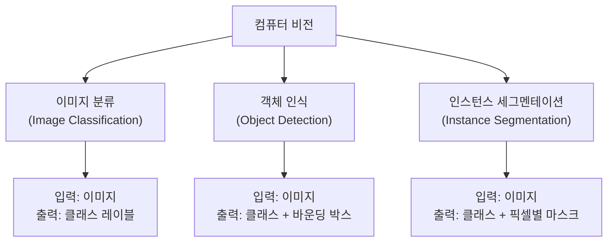

#### 객체 인식의 핵심 구성요소

1. **분류(Classification)**: "이것이 무엇인가?" - 고양이, 개, 자동차 등
2. **위치화(Localization)**: "어디에 있는가?" - 바운딩 박스 좌표

### 1.2. 객체 인식이 어려운 이유

#### 1.2.1. 시각적 변화 (Visual Variations)

- **조명 변화**: 밝기, 그림자, 색온도 변화
- **시점 변화**: 회전, 기울어짐, 원근법
- **스케일 변화**: 가까운 객체 vs 먼 객체
- **부분 가림(Occlusion)**: 객체의 일부가 가려진 상황

#### 1.2.2. 클래스 내 다양성(Intra-class Variation)

같은 클래스 내에서도 외형이 매우 다양함
- 예: 다양한 품종의 개, 여러 모델의 자동차

#### 1.2.3. 복잡한 배경 (Complex Backgrounds)

- 배경과 객체의 구분이 어려운 경우
- 배경 잡음(Background Clutter)

#### 1.2.4. 다중 객체 처리

- 한 이미지에 여러 객체가 존재
- 객체 간 겹침과 상호작용

### 1.3. Stage Detector 분류

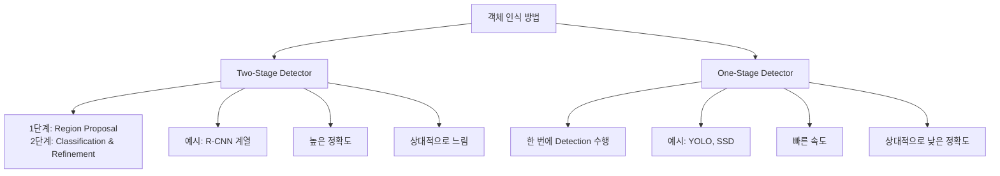

---

## 2. 데이터셋과 성능 평가

### 2.1. 주요 데이터셋

#### 2.1.1. PASCAL VOC (Visual Object Classes)
- **연도**: 2005-2012
- **클래스 수**: 20개 (사람, 동물, 교통수단, 가구 등)
- **특징**: 객체 인식 연구의 기준점 역할

#### 2.1.2. MS COCO (Common Objects in Context)
- **클래스 수**: 80개
- **이미지 수**: 약 200K장 (훈련용)
- **특징**: 복잡한 장면, 다중 객체, 세그멘테이션 어노테이션 포함

#### 2.1.3. Open Images
- **클래스 수**: 600개
- **이미지 수**: 900K장
- **특징**: 구글에서 제공하는 대규모 데이터셋

### 2.2. 혼동 매트릭스(Confusion Matrix) 기초

객체 인식에서 성능 평가의 기본이 되는 개념입니다.

#### 2.2.1. 기본 정의

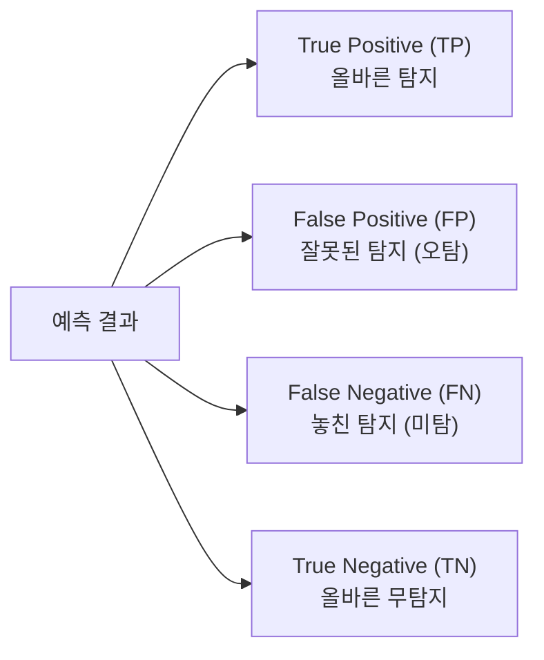

#### 2.2.2. 구체적 예시: 고양이 탐지기

| 실제 상황 | 모델 예측 | 결과 | 설명 |
|-----------|-----------|------|------|
| 고양이 있음 | "고양이 탐지!" | **TP** | ✅ 올바른 탐지 |
| 고양이 있음 | "탐지 안됨" | **FN** | ❌ 놓친 탐지 (미탐) |
| 고양이 없음 | "고양이 탐지!" | **FP** | ❌ 잘못된 탐지 (오탐) |
| 고양이 없음 | "탐지 안됨" | **TN** | ✅ 올바른 무탐지 |

#### 2.2.3. IoU 기준

객체 인식에서는 **IoU (Intersection over Union)** 임계값을 사용해 TP/FP를 판단합니다.

$$IoU = \frac{\text{예측 박스} \cap \text{실제 박스}}{\text{예측 박스} \cup \text{실제 박스}}$$

- **IoU ≥ 0.5**: True Positive
- **IoU < 0.5**: False Positive

### 2.3. 정밀도와 재현율

#### 2.3.1. 수식 정의

**정밀도(Precision)**: 모델이 Positive로 예측한 것 중 실제 Positive 비율
$$Precision = \frac{TP}{TP + FP}$$

**재현율(Recall)**: 실제 Positive 중 모델이 올바르게 찾아낸 비율
$$Recall = \frac{TP}{TP + FN}$$

#### 2.3.2. 직관적 이해

- **정밀도가 높다** = 모델이 확신할 때만 탐지 (보수적)
- **재현율이 높다** = 모든 객체를 놓치지 않으려 함 (적극적)

#### 2.3.3. 트레이드오프(Trade-off)

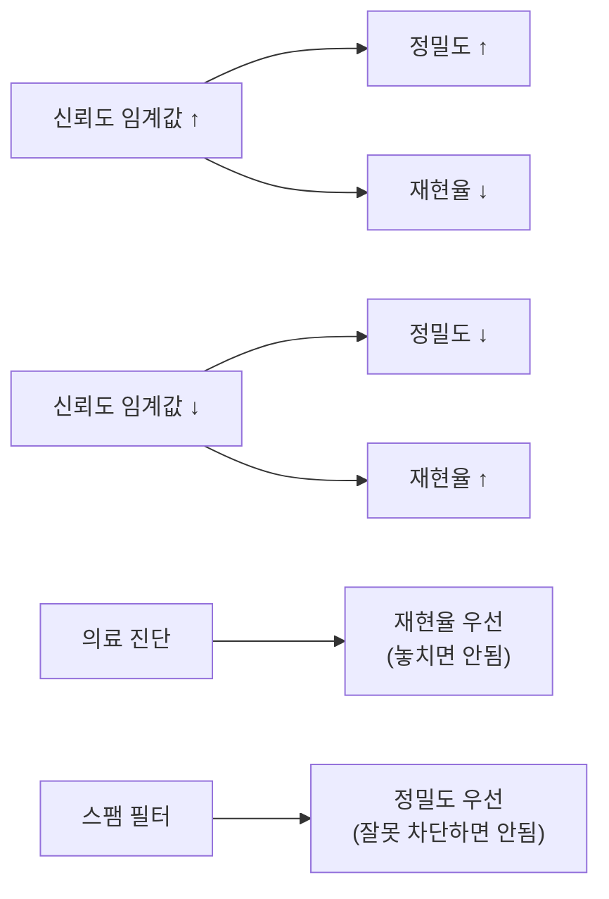

### 2.4. Average Precision (AP)

#### 2.4.1. PR 곡선 (Precision-Recall Curve)

- X축: 재현율 (Recall)
- Y축: 정밀도 (Precision)
- 곡선 아래 면적이 **Average Precision (AP)**

#### 2.4.2. mAP (mean Average Precision)

$$mAP = \frac{1}{N} \sum_{i=1}^{N} AP_i$$

여기서 N은 클래스 개수

#### 2.4.3. COCO 메트릭스

- **AP@0.5**: IoU 0.5에서의 AP
- **AP@0.75**: IoU 0.75에서의 AP  
- **AP@[0.5:0.95]**: IoU 0.5~0.95 범위에서 평균 AP

---

## 3. 객체 위치화 기법

### 3.1. Object Localization

#### 3.1.1. 바운딩 박스(Bounding Box)

객체의 위치를 나타내는 직사각형 영역

**표현 방식**:
- **(x₁, y₁, x₂, y₂)**: 좌상단, 우하단 좌표
- **(x_c, y_c, w, h)**: 중심점, 너비, 높이
- **[x, y, w, h]**: 좌상단 좌표, 너비, 높이

#### 3.1.2. 위치화 손실 함수

**Smooth L1 Loss**: 
$$L_{loc} = \begin{cases}
0.5x^2 & \text{if } |x| < 1 \\
|x| - 0.5 & \text{otherwise}
\end{cases}$$

### 3.2. Region Proposal

#### 3.2.1. 전통적 방법: Selective Search

1. **Over-segmentation**: 이미지를 작은 영역들로 분할
2. **Hierarchical Grouping**: 유사한 영역들을 병합
3. **Region Proposal**: 후보 영역 생성

#### 3.2.2. 특징

- **장점**: 클래스에 무관한(Class-agnostic) 후보 생성
- **단점**: 느린 속도 (CPU 기반)

### 3.3. Non-Maximum Suppression (NMS)

#### 3.3.1. 문제 상황

하나의 객체에 대해 여러 개의 바운딩 박스가 생성되는 문제

#### 3.3.2. NMS 알고리즘

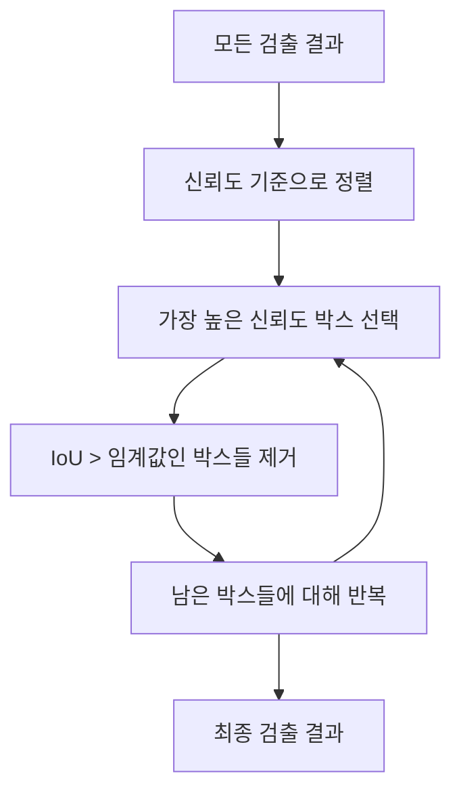

#### 3.3.3. 수식

IoU가 임계값(보통 0.5) 이상인 박스들을 제거:

$$\text{suppress if } IoU(b_i, b_{selected}) > \text{threshold}$$

---

## 4. Two-Stage Detector

### 4.1. R-CNN

#### 4.1.1. 아키텍처 개요

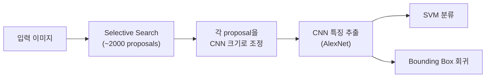

#### 4.1.2. 주요 특징

- **Region Proposal**: Selective Search 사용
- **특징 추출**: 각 proposal을 개별적으로 CNN에 입력
- **분류**: SVM 분류기 사용
- **후처리**: Non-Maximum Suppression

#### 4.1.3. 한계점

- **속도**: 매우 느림 (이미지당 47초)
- **메모리**: 각 proposal마다 CNN 연산 필요
- **복잡성**: 다단계 훈련 과정

### 4.2. Fast R-CNN

#### 4.2.1. 주요 개선사항

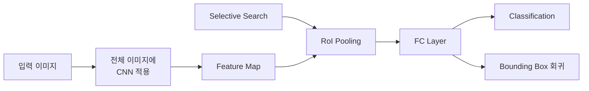

#### 4.2.2. RoI Pooling

**Region of Interest (RoI) Pooling**: 가변 크기의 feature map 영역을 고정 크기로 변환

1. Feature map에서 RoI 영역 추출
2. 영역을 H×W 그리드로 분할
3. 각 그리드에서 max pooling 수행

#### 4.2.3. 다중 태스크 손실(Multi-task Loss)

$$L = L_{cls} + \lambda L_{loc}$$

- **$L_{cls}$**: 분류 손실 (Cross-entropy)
- **$L_{loc}$**: 위치화 손실 (Smooth L1)
- **λ**: 가중치 (보통 1)

### 4.3. Faster R-CNN과 RPN

#### 4.3.1. 전체 아키텍처

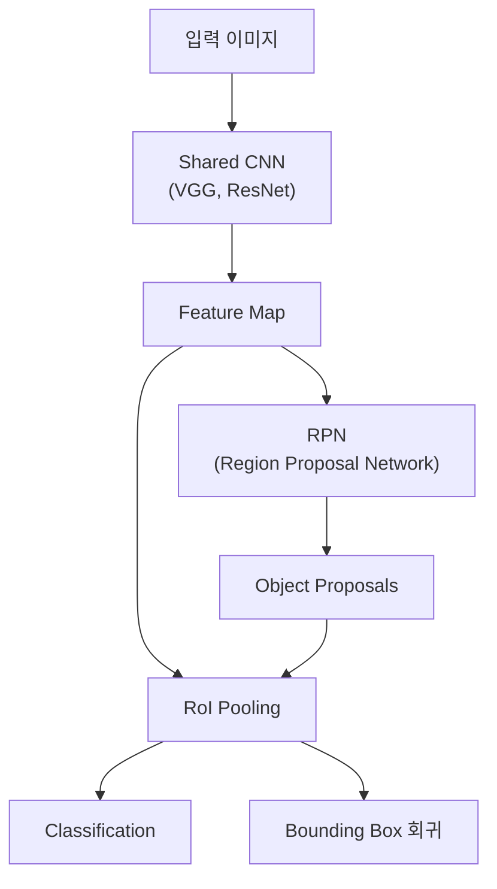

#### 4.3.2. Region Proposal Network (RPN)

**핵심 아이디어**: CNN으로 region proposal을 생성

**구조**:
1. **Anchor 생성**: 각 위치에서 다양한 크기/비율의 anchor box 생성
2. **Objectness 분류**: 객체 존재 여부 판단
3. **Anchor 회귀**: Anchor box 위치 조정

#### 4.3.3. 앵커(Anchor) 시스템

**앵커 박스**: 각 feature map 위치에서 미리 정의된 크기와 비율의 박스들

- **크기**: 128², 256², 512² 픽셀
- **비율**: 1:1, 1:2, 2:1
- **총 개수**: 3×3 = 9개 앵커 (각 위치당)

### 4.4. Anchor Box 시스템

#### 4.4.1. 앵커 생성

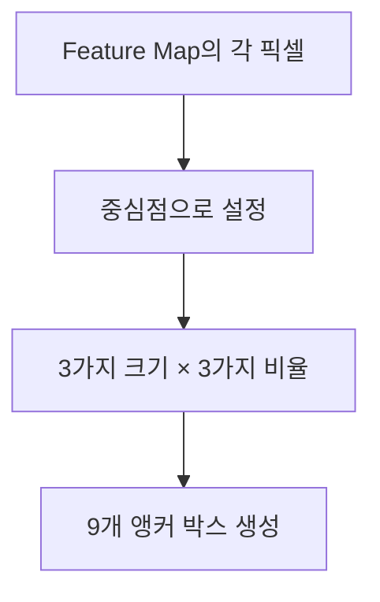

#### 4.4.2. 앵커 라벨링

- **Positive Anchor**: 
  - IoU > 0.7인 앵커
  - 각 GT와 가장 높은 IoU를 가진 앵커
  
- **Negative Anchor**: IoU < 0.3인 앵커

- **무시**: 0.3 ≤ IoU ≤ 0.7인 앵커

#### 4.4.3. RPN 손실 함수

$$L_{RPN} = \frac{1}{N_{cls}} \sum L_{cls}(p_i, p_i^*) + \lambda \frac{1}{N_{reg}} \sum p_i^* L_{reg}(t_i, t_i^*)$$

- **분류 손실**: 객체/배경 분류
- **회귀 손실**: 앵커 박스 조정

---

## 5. One-Stage Detector

### 5.1. YOLO (You Only Look Once)

#### 5.1.1. 핵심 아이디어

"이미지를 한 번만 봐도 모든 객체를 탐지할 수 있다"

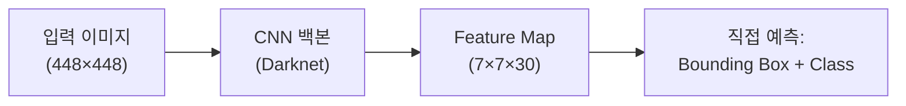

#### 5.1.2. 그리드 기반 예측

1. **이미지 분할**: 입력을 S×S 그리드로 분할 (S=7)
2. **각 그리드 셀**:
   - B개의 바운딩 박스 예측 (B=2)
   - 각 박스의 신뢰도 예측
   - C개 클래스 확률 예측 (C=20 for PASCAL VOC)

#### 5.1.3. 출력 텐서

**크기**: S × S × (B×5 + C) = 7 × 7 × 30

**구성**:
- **바운딩 박스**: (x, y, w, h, confidence) × 2
- **클래스 확률**: 20개 클래스

#### 5.1.4. YOLO 손실 함수

$$L = \lambda_{coord} \sum_{i=0}^{S^2} \sum_{j=0}^{B} \mathbb{1}_{ij}^{obj} [(x_i - \hat{x}_i)^2 + (y_i - \hat{y}_i)^2]$$

$$+ \lambda_{coord} \sum_{i=0}^{S^2} \sum_{j=0}^{B} \mathbb{1}_{ij}^{obj} [(\sqrt{w_i} - \sqrt{\hat{w}_i})^2 + (\sqrt{h_i} - \sqrt{\hat{h}_i})^2]$$

$$+ \sum_{i=0}^{S^2} \sum_{j=0}^{B} \mathbb{1}_{ij}^{obj} (C_i - \hat{C}_i)^2$$

$$+ \lambda_{noobj} \sum_{i=0}^{S^2} \sum_{j=0}^{B} \mathbb{1}_{ij}^{noobj} (C_i - \hat{C}_i)^2$$

$$+ \sum_{i=0}^{S^2} \mathbb{1}_i^{obj} \sum_{c \in classes} (p_i(c) - \hat{p}_i(c))^2$$

#### 5.1.5. YOLO의 장단점

**장점**:
- **속도**: 실시간 처리 가능 (45 FPS)
- **전역적 맥락**: 전체 이미지를 고려한 예측
- **단순함**: End-to-end 훈련

**단점**:
- **작은 객체 탐지 어려움**: 그리드 크기 제한
- **동일 그리드 내 다중 객체**: 한 그리드당 하나의 클래스만 예측
- **새로운 종횡비**: 훈련 중 보지 못한 비율의 객체에 취약

### 5.2. SSD (Single Shot MultiBox Detector)

#### 5.2.1. 멀티스케일 특징 활용

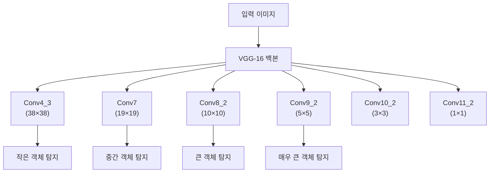

#### 5.2.2. Default Box (앵커)

각 feature map에서 다양한 크기와 비율의 default box 사용:

**스케일**: $s_k = s_{min} + \frac{s_{max} - s_{min}}{m-1}(k-1)$

**종횡비**: $a_r \in \{1, 2, 3, \frac{1}{2}, \frac{1}{3}\}$

#### 5.2.3. SSD vs YOLO 비교

| 특징 | YOLO v1 | SSD |
|------|---------|-----|
| **특징맵** | 단일 (7×7) | 멀티스케일 (6개) |
| **앵커** | 없음 | Default box 사용 |
| **작은 객체** | 어려움 | 효과적 |
| **속도** | 45 FPS | 59 FPS |
| **정확도** | 낮음 | 높음 |

---

## 6. 고급 기법

### 6.1. Feature Pyramid Network (FPN)

#### 6.1.1. 동기

**문제**: 서로 다른 크기의 객체를 효과적으로 탐지하기 어려움

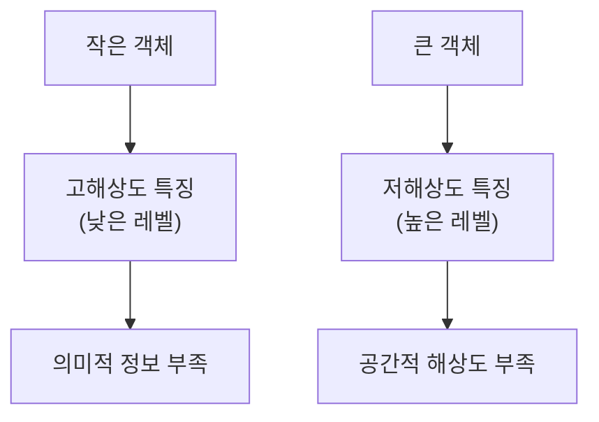

#### 6.1.2. FPN 아키텍처

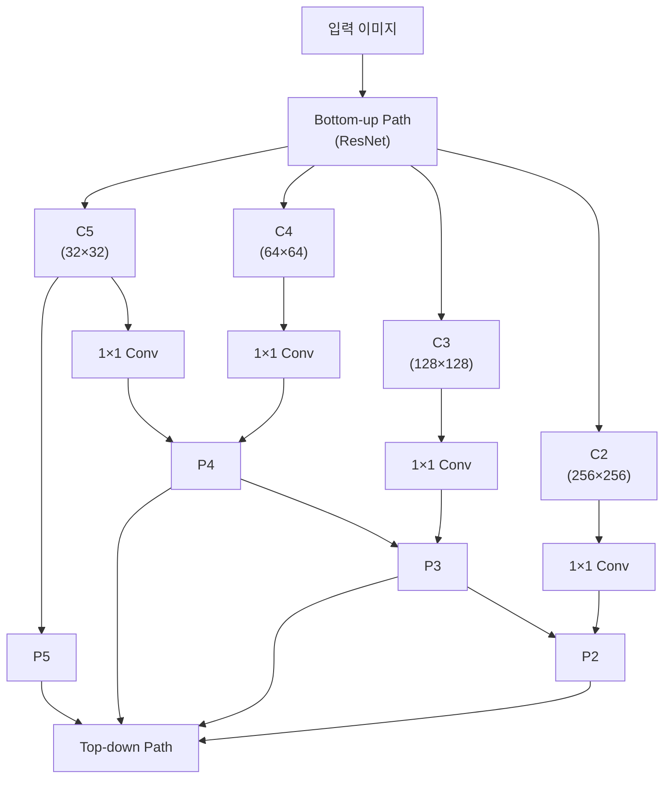

#### 6.1.3. 핵심 구성요소

**Bottom-up Pathway**: 표준 CNN의 피드포워드 계산

**Top-down Pathway**: 
- 상위 레벨에서 의미적으로 강한 특징을 전파
- 2×2 upsampling 사용

**Lateral Connections**:
- 1×1 convolution으로 채널 수 맞춤
- Element-wise addition으로 결합

#### 6.1.4. FPN의 장점

- **멀티스케일**: 각 피라미드 레벨에서 다른 크기 객체 탐지
- **의미적 특징**: 모든 레벨에서 강한 의미적 특징 활용
- **효율성**: 추가적인 계산 비용 최소화

---

## 7. 용어집

### A-F
- **Anchor Box**: 미리 정의된 다양한 크기와 비율의 후보 영역
- **Average Precision (AP)**: PR 곡선 아래 면적으로, 모델 성능 평가 지표
- **Bounding Box**: 객체 위치를 나타내는 직사각형 영역
- **Feature Map**: CNN 층을 통과한 후 생성되는 특징 맵
- **Feature Pyramid Network (FPN)**: 다중 스케일 특징을 활용하는 네트워크 구조
- **False Negative (FN)**: 실제 양성을 음성으로 잘못 예측 (미탐)
- **False Positive (FP)**: 실제 음성을 양성으로 잘못 예측 (오탐)

### G-N
- **Ground Truth**: 실제 정답 라벨
- **IoU (Intersection over Union)**: 예측 영역과 실제 영역의 겹침 정도
- **mAP (mean Average Precision)**: 모든 클래스의 평균 AP 값
- **Non-Maximum Suppression (NMS)**: 중복된 검출 결과를 제거하는 후처리 기법

### O-R
- **Object Detection**: 이미지에서 객체의 위치와 클래스를 동시에 예측하는 작업
- **Object Localization**: 객체의 위치를 바운딩 박스로 찾는 작업
- **One-Stage Detector**: 한 번의 네트워크 통과로 검출을 수행하는 방법
- **Precision**: 모델이 양성으로 예측한 것 중 실제 양성의 비율
- **R-CNN**: Region-based Convolutional Neural Network
- **Recall**: 실제 양성 중 모델이 올바르게 찾은 비율
- **Region Proposal**: 객체가 있을 가능성이 높은 영역을 제안하는 기법
- **Region Proposal Network (RPN)**: CNN으로 region proposal을 생성하는 네트워크
- **RoI Pooling**: 다양한 크기의 영역을 고정 크기로 변환하는 풀링 기법

### S-Z
- **Selective Search**: 계층적 그룹화를 통한 전통적인 region proposal 방법
- **SSD (Single Shot MultiBox Detector)**: 다중 스케일 특징맵을 사용하는 one-stage detector
- **True Negative (TN)**: 실제 음성을 음성으로 올바르게 예측
- **True Positive (TP)**: 실제 양성을 양성으로 올바르게 예측
- **Two-Stage Detector**: 두 단계로 나누어 검출을 수행하는 방법 (proposal + classification)
- **YOLO (You Only Look Once)**: 그리드 기반의 대표적인 one-stage detector

---

## 부록: 실습 가이드

### A.1. 데이터셋 준비

#### COCO 형식 어노테이션 예시
```json
{
  "images": [
    {
      "id": 1,
      "width": 640,
      "height": 480,
      "file_name": "image001.jpg"
    }
  ],
  "annotations": [
    {
      "id": 1,
      "image_id": 1,
      "category_id": 1,
      "bbox": [100, 100, 200, 150],
      "area": 30000,
      "iscrowd": 0
    }
  ],
  "categories": [
    {
      "id": 1,
      "name": "person",
      "supercategory": "person"
    }
  ]
}
```

### A.2. 성능 분석 체크리스트

#### 모델 성능이 낮을 때 점검사항

1. **데이터 품질**
   - 어노테이션 정확성 확인
   - 클래스 불균형 문제
   - 이미지 품질 및 다양성

2. **하이퍼파라미터**
   - 학습률(Learning Rate) 조정
   - 배치 크기(Batch Size) 최적화
   - 앵커 박스 설정

3. **아키텍처**
   - 백본 네트워크 선택
   - FPN 적용 여부
   - 앵커 크기/비율 조정

4. **후처리**
   - NMS 임계값 조정
   - 신뢰도 임계값 설정

### A.3. 모델 선택 가이드

#### 용도별 권장 모델

| 목적 | 권장 모델 | 특징 |
|------|-----------|------|
| **실시간 처리** | YOLOv5, YOLOv8 | 빠른 속도, 적당한 정확도 |
| **높은 정확도** | Faster R-CNN + FPN | 느린 속도, 높은 정확도 |
| **균형잡힌 성능** | SSD, RetinaNet | 중간 속도/정확도 |
| **모바일/엣지** | MobileNet-SSD | 경량화, 낮은 연산량 |

#### 하드웨어별 권장사항

- **GPU 서버**: Faster R-CNN, Mask R-CNN
- **일반 PC**: YOLO, SSD
- **모바일**: MobileNet 기반 모델
- **CPU 전용**: 경량화된 YOLO 버전

### A.4. 최신 동향 (2024-2025)

#### Transformer 기반 방법들

**DETR (Detection Transformer)**
- CNN + Transformer 구조
- Anchor-free 방식
- Set prediction 문제로 접근

**특징**:
- 복잡한 후처리 과정 불필요
- End-to-end 훈련 가능
- 수렴 속도가 느림

#### Vision Transformer (ViT) 백본

**DINO (self-DIstillation with NO labels)**
- Self-supervised 학습
- 강력한 시각적 표현 학습

#### YOLO 최신 버전들

**YOLOv8 (2023)**
- Anchor-free 설계
- 개선된 손실 함수
- 더 나은 정확도-속도 트레이드오프

**YOLOv9 (2024)**
- Programmable Gradient Information (PGI)
- Generalized Efficient Layer Aggregation Network (GELAN)

### A.5. 평가 메트릭 상세

#### COCO 평가 메트릭 완전 가이드

| 메트릭 | 설명 | IoU 임계값 | 객체 크기 |
|--------|------|------------|-----------|
| **AP** | 전체 Average Precision | 0.5:0.95 | 전체 |
| **AP₅₀** | IoU=0.5에서의 AP | 0.5 | 전체 |
| **AP₇₅** | IoU=0.75에서의 AP | 0.75 | 전체 |
| **APₛ** | 작은 객체에 대한 AP | 0.5:0.95 | 면적 < 32² |
| **APₘ** | 중간 객체에 대한 AP | 0.5:0.95 | 32² < 면적 < 96² |
| **APₗ** | 큰 객체에 대한 AP | 0.5:0.95 | 면적 > 96² |

#### Recall 메트릭

| 메트릭 | 설명 | 최대 검출 수 |
|--------|------|---------------|
| **AR¹** | 이미지당 최대 1개 검출 | 1 |
| **AR¹⁰** | 이미지당 최대 10개 검출 | 10 |
| **AR¹⁰⁰** | 이미지당 최대 100개 검출 | 100 |

### A.6. 실무 팁

#### 학습 안정화 기법

1. **Warmup**: 초기 학습률을 천천히 증가
2. **Gradient Clipping**: 그래디언트 폭발 방지
3. **Mixed Precision**: 메모리 효율성 향상
4. **Data Augmentation**: 
   - Mosaic, MixUp
   - CutMix, CopyPaste
   - 색상/밝기 변화

#### 디버깅 체크리스트

1. **학습 곡선 분석**
   - Loss가 감소하는가?
   - Validation loss와 차이는?
   - Overfitting 징후는?

2. **예측 결과 시각화**
   - 바운딩 박스 위치 확인
   - 클래스 예측 정확성
   - 신뢰도 분포 분석

3. **앵커 분석**
   - 앵커와 GT의 매칭 비율
   - 앵커 크기 분포
   - 각 레벨별 할당 통계

### A.7. 추가 학습 자료

#### 핵심 논문 목록

1. **R-CNN 계열**
   - R-CNN (2014): "Rich feature hierarchies for accurate object detection"
   - Fast R-CNN (2015): "Fast R-CNN"
   - Faster R-CNN (2015): "Faster R-CNN: Towards Real-Time Object Detection"

2. **YOLO 계열**
   - YOLOv1 (2016): "You Only Look Once: Unified, Real-Time Object Detection"
   - YOLOv2 (2017): "YOLO9000: Better, Faster, Stronger"
   - YOLOv3 (2018): "YOLOv3: An Incremental Improvement"

3. **기타 중요 논문**
   - SSD (2016): "SSD: Single Shot MultiBox Detector"
   - FPN (2017): "Feature Pyramid Networks for Object Detection"
   - RetinaNet (2017): "Focal Loss for Dense Object Detection"

#### 온라인 리소스

- **Papers With Code**: 최신 논문과 코드
- **Detectron2**: Facebook의 객체 인식 라이브러리
- **YOLOv5/v8**: Ultralytics 구현
- **MMDetection**: OpenMMLab의 통합 프레임워크

---

*이 문서는 객체 인식의 기초부터 최신 동향까지 포괄적으로 다루고 있습니다. 실습과 함께 학습하시면 더욱 효과적입니다.*