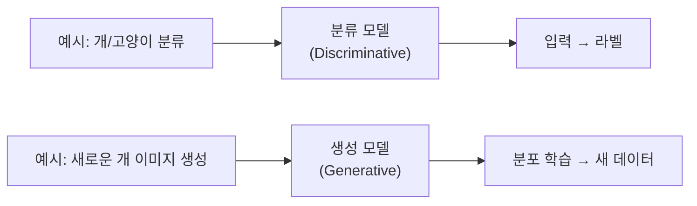
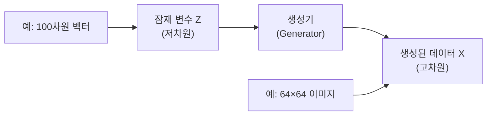
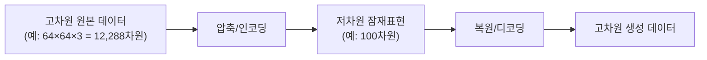
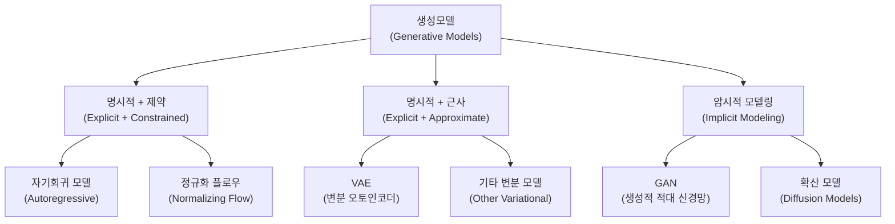
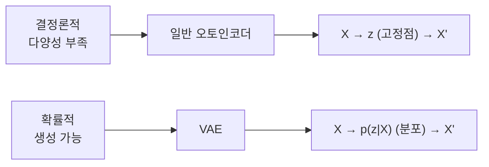
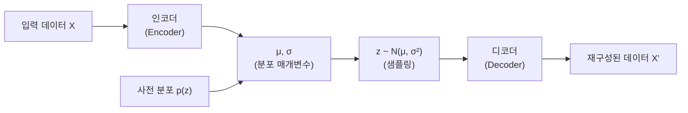
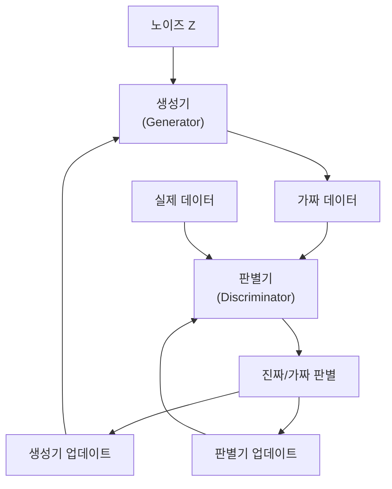
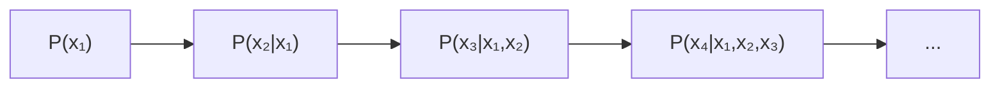
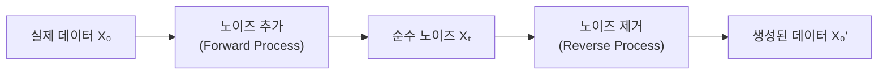

# 생성모델(Generative Models)

## 목차
1. [생성모델의 개념과 분류와의 차이점](#1-생성모델의-개념과-분류와의-차이점)<br/>
   1.1. [생성모델이란 무엇인가](#11-생성모델이란-무엇인가)<br/>
   1.2. [분류 모델과의 핵심 차이점](#12-분류-모델과의-핵심-차이점)<br/>
2. [생성모델의 특징](#2-생성모델의-특징)<br/>
   2.1. [확률 분포 학습](#21-확률-분포-학습)<br/>
   2.2. [새로운 데이터 생성](#22-새로운-데이터-생성)<br/>
   2.3. [잠재 공간 표현](#23-잠재-공간-표현)<br/>
3. [생성모델의 필수 조건](#3-생성모델의-필수-조건)<br/>
4. [표현학습과 생성모델](#4-표현학습과-생성모델)<br/>
   4.1. [표현학습의 개념](#41-표현학습의-개념)<br/>
   4.2. [생성모델에서의 표현학습 역할](#42-생성모델에서의-표현학습-역할)<br/>
5. [생성 모델링 방식 분류](#5-생성-모델링-방식-분류)<br/>
   5.1. [명시적 밀도 모델링 + 제약조건](#51-명시적-밀도-모델링--제약조건)<br/>
   5.2. [명시적 밀도 모델링 + 근사](#52-명시적-밀도-모델링--근사)<br/>
   5.3. [암시적 밀도 모델링](#53-암시적-밀도-모델링)<br/>
6. [오토인코더와 생성모델](#6-오토인코더와-생성모델)<br/>
   6.1. [일반 오토인코더의 구조와 한계](#61-일반-오토인코더의-구조와-한계)<br/>
   6.2. [생성모델로서의 한계점](#62-생성모델로서의-한계점)<br/>
7. [주요 생성모델 상세 분석](#7-주요-생성모델-상세-분석)<br/>
   7.1. [변분 오토인코더 (VAE)](#71-변분-오토인코더-vae)<br/>
   7.2. [생성적 적대 신경망 (GAN)](#72-생성적-적대-신경망-gan)<br/>
   7.3. [심층 합성곱 GAN (DCGAN)](#73-심층-합성곱-gan-dcgan)<br/>
   7.4. [자기회귀 모델](#74-자기회귀-모델)<br/>
   7.5. [정규화 플로우](#75-정규화-플로우)<br/>
   7.6. [확산 모델](#76-확산-모델)<br/>
8. [KL 발산과 정보 이론](#8-kl-발산과-정보-이론)<br/>
   8.1. [KL 발산의 정의와 의미](#81-kl-발산의-정의와-의미)<br/>
   8.2. [교차 엔트로피와의 관계](#82-교차-엔트로피와의-관계)<br/>
   8.3. [VAE에서의 KL 발산 역할](#83-vae에서의-kl-발산-역할)<br/>
9. [용어 목록](#9-용어-목록)<br/>

---

## 1. 생성모델의 개념과 분류와의 차이점

### 1.1. 생성모델이란 무엇인가

생성모델(Generative Models, 제너러티브 모델즈)은 주어진 데이터의 확률 분포를 학습하여 **새로운 데이터를 생성**하는 머신러닝 모델입니다. 

생성모델은 기존의 데이터를 **"이해"**하고, 그 특성을 반영한 새로운 샘플을 만들어낼 수 있습니다. 핵심은 다음과 같습니다:

- 훈련 데이터가 어떤 분포에서 나왔는지 학습
- 학습한 분포에서 새로운 샘플을 생성
- 데이터의 내재된 패턴과 구조를 이해

### 1.2. 분류 모델과의 핵심 차이점



**분류 모델 (Discriminative Models, 디스크리미너티브 모델즈)**:
- 목적: 입력 데이터를 올바른 클래스로 분류
- 학습: P(Y|X) - 입력 X가 주어졌을 때 라벨 Y의 조건부 확률
- 출력: 클래스 라벨 또는 확률값
- 예시: "이 이미지는 개인가 고양이인가?"

**생성 모델 (Generative Models)**:
- 목적: 새로운 데이터 생성
- 학습: P(X) 또는 P(X,Y) - 데이터 X의 확률 분포
- 출력: 새로운 데이터 샘플
- 예시: "개처럼 보이는 새로운 이미지를 만들어보자"

---

## 2. 생성모델의 특징

### 2.1. 확률 분포 학습

생성모델의 가장 중요한 특징은 **데이터의 확률 분포 P(X)를 학습**한다는 것입니다.

$$P(X) = \int P(X|Z)P(Z)dZ$$

여기서:
- X는 관찰된 데이터
- Z는 잠재 변수(Latent Variable, 레이턴트 베리어블)
- 모델은 이 분포를 근사하거나 직접 학습

### 2.2. 새로운 데이터 생성

학습된 분포에서 **샘플링(Sampling, 샘플링)**을 통해 새로운 데이터를 생성합니다:

$$X_{new} \sim P(X)$$

이때 생성된 데이터는:
- 훈련 데이터와 유사한 특성을 가짐
- 하지만 완전히 새로운 샘플
- 다양성(Diversity, 다이버시티)과 품질(Quality, 퀄리티)의 균형

### 2.3. 잠재 공간 표현

대부분의 생성모델은 **잠재 공간(Latent Space, 레이턴트 스페이스)**을 활용합니다:



---

## 3. 생성모델의 필수 조건

생성모델이라고 할 수 있는 모델의 **필수 조건**들:

1. **분포 학습 능력**: 데이터의 확률 분포 P(X)를 학습할 수 있어야 함

2. **샘플 생성 능력**: 학습된 분포에서 새로운 샘플을 생성할 수 있어야 함

3. **일반화 성능**: 훈련 데이터를 단순 암기가 아닌, 패턴을 학습해야 함

4. **확률적 특성**: 동일한 입력(또는 조건)에 대해 다양한 출력을 생성할 수 있어야 함

**이 조건들을 만족하지 않으면 생성모델이라고 할 수 없습니다.**

---

## 4. 표현학습과 생성모델

### 4.1. 표현학습의 개념

표현학습(Representation Learning, 리프리젠테이션 러닝)은 원본 데이터(raw data, 로 데이터)에서 중요한 특징(feature, 피처)을 자동으로 학습하여, 모델이 더 효과적으로 학습할 수 있도록 하는 기법입니다.

**핵심 아이디어**:
- 고차원 표본 공간을 직접 모델링하는 대신
- 저차원의 잠재공간(latent space)을 사용해 훈련 세트의 각 샘플을 표현
- 이를 원본 공간의 포인트에 매핑



### 4.2. 생성모델에서의 표현학습 역할

생성모델의 진정한 가치는 **의미있는 표현을 학습**하는 데 있습니다:

- **차원 축소**: 12,288차원을 100차원으로 압축
- **의미 추출**: 압축 과정에서 핵심 특징만 보존
- **구조 발견**: 데이터의 내재된 구조와 패턴 파악

**표현학습의 품질 평가**:
- 재구성 품질: 원본을 얼마나 잘 복원하는가?
- 의미적 연속성: 잠재공간에서의 보간이 자연스러운가?
- 전이학습 성능: 다운스트림 태스크에서 유용한가?

---

## 5. 생성 모델링 방식 분류

생성모델은 **밀도함수 p(x) 모델링 방식**에 따라 세 가지로 분류됩니다:



### 5.1. 명시적 밀도 모델링 + 제약조건

**밀도함수 p(x)를 명시적으로 모델링하지만, 계산 가능하도록 모델 구조를 제약**:

**핵심 아이디어**: 
- 목표: p(x)를 정확히 계산하고 싶음
- 문제: 고차원에서는 너무 복잡함  
- 해결: 모델 구조를 제약해서 계산 가능하게 만듦

**특징**:
- 정확한 우도(Likelihood) 계산 가능
- 수학적으로 엄밀한 접근
- 모델 구조의 제약으로 인한 표현력 한계

### 5.2. 명시적 밀도 모델링 + 근사

**다루기 쉬운 밀도함수의 근사치를 명시적으로 모델링**:

**핵심 아이디어**:
- 목표: p(x)를 알고 싶지만 정확히는 어려움
- 해결: 계산 가능한 하한(Lower Bound)을 최적화

**특징**:
- 근사적 우도 계산 (보통 하한값)
- 베이지안 추론 기반
- 이론적 기반이 탄탄함

### 5.3. 암시적 밀도 모델링

**데이터를 직접 생성하는 확률적 과정을 통해 밀도함수를 암묵적으로 모델링**:

**핵심 아이디어**:
- 목표: p(x)를 직접 계산할 필요 없음
- 해결: 샘플링 과정 자체를 학습

**특징**:
- 우도를 직접 계산할 수 없음
- 생성 과정을 통해서만 분포를 표현
- 더 유연하고 강력한 생성 능력
- 고품질 샘플 생성 가능

---

## 6. 오토인코더와 생성모델

### 6.1. 일반 오토인코더의 구조와 한계

**오토인코더(Autoencoder, 오토인코더)**는 인코더와 디코더로 구성되어 입력 데이터를 압축한 후 다시 복원하는 구조입니다.

**구조**:
- **인코더(Encoder)**: 데이터를 압축된 형태로 변환. 고차원 데이터를 저차원으로 변환하여 핵심 특징을 추출
- **디코더(Decoder)**: 압축된 표현을 다시 원래 데이터로 복원. 잠재 표현(latent representation)을 기반으로 데이터를 재구성

**목적**: 데이터의 중요한 특징을 추출하여 차원 축소나 노이즈 제거 등 다양한 용도로 사용

**특징**: 결정론적 매핑을 수행하며, 입력 데이터를 그대로 재현하는 데 초점을 맞춤

### 6.2. 생성모델로서의 한계점

일반 오토인코더가 생성모델로 사용되기 어려운 이유:

**1. 결정론적 특성**:
- 잠재 공간이 고정된 값으로 표현되기 때문에 새로운 데이터를 생성하는 데 한계
- 같은 입력에 대해 항상 같은 출력 → 다양성 부족

**2. 잠재 공간 규제 미흡**:
- 잠재 변수들이 의미 있는 분포를 형성하지 않음
- 임의의 샘플링 시 비현실적인 결과가 나타날 수 있음
- 훈련 데이터의 잠재표현들 사이에 "구멍"이 존재



**결론**: 일반 오토인코더는 특징 추출과 차원 축소에는 유용하지만, 새로운 데이터 생성에는 부적합합니다.

---

## 7. 주요 생성모델 상세 분석

### 7.1. 변분 오토인코더 (VAE)

**VAE(Variational AutoEncoder, 베리에이셔널 오토인코더)**는 2013년에 제안된 생성모델로, 입력 데이터를 저차원 잠재 공간의 확률 분포로 인코딩한 후, 이 공간에서 샘플링하여 데이터를 재구성합니다.

#### 핵심 아이디어

**확률적 인코딩**: 데이터를 하나의 결정적 값이 아니라, 분포(예: 가우시안 분포)로 표현하여 다양한 샘플을 생성할 수 있습니다.



#### 가우시안 분포와 매개변수

VAE에서 사용하는 **가우시안 분포(정규분포, 노멀 디스트리뷰션)**는 연속 확률 분포 중 하나로, 평균값 주변에 데이터가 집중되고, 멀어질수록 확률이 점차 감소하는 종 모양(bell curve)의 분포입니다.

**주요 매개변수**:
- **평균 μ**: 분포의 중심을 나타내며, 데이터의 중심 위치를 의미
- **표준편차 σ**: 데이터가 평균 주변에서 얼마나 퍼져 있는지를 나타내며, 분포의 폭을 결정

#### 베이지안 추론 기반

VAE는 **베이지안 추론(Bayesian Inference)**을 활용하여 p(x)의 하한(Lower Bound)을 최적화합니다.

**변분 추론(Variational Inference)**: 복잡한 사후분포를 간단한 분포로 근사하는 기법

**ELBO(Evidence Lower BOund)** 최적화:
$$\log p(x) \geq \mathbb{E}_{q(z|x)}[\log p(x|z)] - D_{KL}(q(z|x)||p(z))$$

#### 손실 함수

$$\mathcal{L}_{VAE} = \mathcal{L}_{reconstruction} + \beta \cdot \mathcal{L}_{KL}$$

- **재구성 손실**: 원본과 재구성된 데이터 간의 차이
- **KL 발산**: 잠재 분포와 사전 분포 간의 차이 (정규화 역할)

#### 재매개화 트릭

샘플링 과정을 미분 가능하게 만들기 위한 기법:
$$z = \mu + \sigma \odot \epsilon, \quad \epsilon \sim \mathcal{N}(0, I)$$

#### 장단점

**장점**: 
- 안정적 훈련
- 해석 가능한 잠재 공간
- 확률적 추론 가능
- 이론적 기반 탄탄

**단점**: 
- 상대적으로 흐릿한 생성 결과
- 후방 붕괴(Posterior Collapse) 현상
- KL 정규화로 인한 표현력 제한

### 7.2. 생성적 적대 신경망 (GAN)

**GAN(Generative Adversarial Networks, 제너러티브 어드버서리얼 네트웍스)**은 2014년에 제안된 생성모델로, 두 개의 신경망이 서로 경쟁하며 학습하는 방식입니다.

#### 핵심 아이디어

**적대적 훈련**: 생성자와 판별자가 서로 경쟁하며 학습

#### 구성 요소

**생성자(Generator) G**:
- 입력: 랜덤 노이즈 z (예: 표준 정규분포로부터 샘플링)
- 출력: 실제 데이터와 유사한 "가짜" 데이터 x̃ = G(z)

**판별자(Discriminator) D**:
- 입력: 실제 데이터 x 또는 생성된 데이터 G(z)
- 출력: 데이터가 실제일 확률 D(x) (보통 0에서 1 사이의 값)



#### 적대적 학습 목표

**목표**:
- **생성자**: 판별자가 생성된 데이터를 진짜라고 오판하도록 만드는 것
- **판별자**: 실제 데이터와 생성 데이터를 올바르게 구분하는 것

#### 미니맥스 게임

$$\min_G \max_D V(D,G) = \mathbb{E}_{x \sim p_{data}(x)}[\log D(x)] + \mathbb{E}_{z \sim p_z(z)}[\log(1-D(G(z)))]$$

#### 암시적 밀도 모델링

- **밀도함수 p(x)를 직접 계산하지 않음**
- 생성 과정 G(z)만 학습
- 판별기 D(x)를 통해 분포 매칭

#### 장단점

**장점**: 
- 매우 선명한 생성 결과
- 빠른 샘플링
- 표현력이 뛰어남

**단점**: 
- 불안정한 훈련
- 모드 붕괴(Mode Collapse)
- 우도 계산 불가
- 하이퍼파라미터에 민감

### 7.3. 심층 합성곱 GAN (DCGAN)

**DCGAN(Deep Convolutional GAN, 딥 컨볼루셔널 GAN)**은 2015년에 제안된 GAN의 개선 버전으로, CNN 기반의 구조와 아키텍처 제약을 도입하여 기존 GAN의 학습 불안정 문제를 개선했습니다.

#### 핵심 아이디어

**주요 목표**: 라벨이 없는 데이터(비지도 학습)로부터 좋은 이미지 표현(feature representation)을 학습하고, 이를 바탕으로 자연스러운 이미지를 생성하거나 분류 등 다양한 응용에 활용

#### 아키텍처 개선사항

**1. 합성곱 구조 도입**:
- CNN의 구조적 강점을 활용
- 이미지에 특화된 inductive bias 제공

**2. 풀링 제거**:
- 최대 풀링(Max Pooling) 대신 스트라이드 합성곱(Strided Convolution) 사용
- 정보 손실 최소화

**3. 배치 정규화**:
- 배치 정규화(Batch Normalization)를 통해 안정적인 학습 도모
- 내부 공변량 이동(Internal Covariate Shift) 감소

#### 비지도 표현학습의 의의

- **기존**: "분류를 위해서는 라벨이 필요하다"
- **DCGAN**: "생성을 잘하면 표현도 자동으로 좋아진다"

DCGAN의 판별자를 특징 추출기(feature extractor)로 사용했을 때 분류 성능이 우수함을 입증했습니다.

#### 장단점

**장점**: 
- 기존 GAN 대비 안정적 훈련
- 고품질 이미지 생성
- 학습된 표현의 의미적 활용 가능

**단점**: 
- 여전한 모드 붕괴 문제
- 아키텍처 제약에 의한 설계 복잡성

### 7.4. 자기회귀 모델

**자기회귀 모델(Autoregressive Models, 오토리그레시브 모델즈)**은 연쇄법칙을 사용하여 결합확률을 조건부확률의 곱으로 분해하는 명시적 밀도 모델입니다.

#### 핵심 아이디어

**연쇄법칙(Chain Rule)**을 활용한 순차적 생성:
$$P(x_1, x_2, ..., x_n) = \prod_{i=1}^{n} P(x_i | x_1, x_2, ..., x_{i-1})$$



#### 제약 조건

- **순서 종속성**: 각 차원을 특정 순서로 생성해야 함
- **조건부 독립성**: 복잡한 의존관계를 단순화

#### 대표 모델

- **PixelCNN**: 이미지의 각 픽셀을 순차적으로 생성
- **WaveNet**: 오디오 신호의 각 샘플을 순차적으로 생성
- **GPT**: 텍스트의 각 토큰을 순차적으로 생성

#### 장단점

**장점**: 
- 정확한 확률 계산 가능
- 안정적 훈련
- 이론적 기반 탄탄

**단점**: 
- 느린 생성 속도
- 병렬화 어려움
- 순서에 민감

### 7.5. 정규화 플로우

**정규화 플로우(Normalizing Flow, 노멀라이징 플로우)**는 가역 변환을 통해 간단한 분포를 복잡한 분포로 변환하는 명시적 밀도 모델입니다.

#### 핵심 아이디어

**가역 변환(Invertible Transformation)**의 연속 적용:
$$Z_0 \xrightarrow{f_1} Z_1 \xrightarrow{f_2} ... \xrightarrow{f_K} Z_K = X$$

#### 제약 조건

- **가역성**: 모든 변환이 역함수를 가져야 함
- **야코비안 계산**: det(∂f/∂z)가 효율적으로 계산 가능해야 함

#### 확률 밀도 변환

변수 변환 공식(Change of Variables)을 활용:
$\log p(x) = \log p(z) + \sum_{i=1}^{K} \log \left| \det \frac{\partial f_i}{\partial z_{i-1}} \right|$

#### 장단점

**장점**: 
- 정확한 우도 계산
- 안정적 훈련
- 양방향 매핑 가능

**단점**: 
- 아키텍처 제약
- 계산 비용
- 표현력 한계

### 7.6. 확산 모델

**확산 모델(Diffusion Models, 디퓨전 모델즈)**은 마르코프 체인을 통한 점진적 노이즈 추가/제거 과정을 학습하는 암시적 밀도 모델입니다.

#### 핵심 아이디어



#### 암시적 모델링 특성

- **순방향 과정**: 미리 정의된 노이즈 추가 (고정)
- **역방향 과정**: 학습해야 할 노이즈 제거 (매개변수화)
- 밀도함수를 직접 계산하지 않고 확률적 과정만 학습

#### 수학적 정의

**순방향 과정**:
$q(x_t|x_{t-1}) = \mathcal{N}(x_t; \sqrt{1-\beta_t}x_{t-1}, \beta_t I)$

**역방향 과정**:
$p_\theta(x_{t-1}|x_t) = \mathcal{N}(x_{t-1}; \mu_\theta(x_t, t), \Sigma_\theta(x_t, t))$

#### 장단점

**장점**: 
- 높은 생성 품질
- 안정적 훈련
- 다양성 보장
- 이론적 기반 탄탄

**단점**: 
- 매우 느린 생성 속도 (수백~수천 단계)
- 계산 비용이 높음

---

## 8. KL 발산과 정보 이론

### 8.1. KL 발산의 정의와 의미

**KL 발산(KL Divergence, 쿨백-라이블러 발산)**은 두 확률 분포 P와 Q가 얼마나 다른지, 즉 Q로 P를 근사할 때 얼마나 많은 추가 정보가 필요한지를 수식으로 나타낸 것입니다.

$D_{KL}(P || Q) = \mathbb{E}_{x \sim P}[\log P(x) - \log Q(x)] = \mathbb{E}_{x \sim P}\left[\log \frac{P(x)}{Q(x)}\right]$

#### 정보 이론적 해석

- **"추가 정보"의 의미**: Q를 사용해서 P를 인코딩할 때 필요한 여분의 비트 수
- **KL = 0**: 두 분포가 동일 (추가 정보 불필요)
- **KL > 0**: Q가 P를 부정확하게 근사 (추가 정보 필요)

#### 비대칭성

KL 발산은 비대칭적입니다:
$D_{KL}(P || Q) \neq D_{KL}(Q || P)$

### 8.2. 교차 엔트로피와의 관계

**KL 발산은 교차 엔트로피에서 P의 엔트로피를 뺀 나머지, 즉 Q가 P에 비해 얼마나 비효율적인지를 나타냅니다.**

$D_{KL}(P || Q) = H(P, Q) - H(P)$

여기서:
- $H(P, Q) = -\mathbb{E}_{x \sim P}[\log Q(x)]$: 교차 엔트로피
- $H(P) = -\mathbb{E}_{x \sim P}[\log P(x)]$: P의 엔트로피

#### 직관적 의미

```
H(P): P 자체를 인코딩하는 데 필요한 최소 비트 (이론적 한계)
H(P, Q): Q를 사용해서 P를 인코딩하는 데 필요한 비트 (실제 사용)
KL(P || Q): "낭비되는" 비트 = 압축 비효율성
```

#### 머신러닝에서의 활용

분류 문제에서:
$\text{Cross-Entropy Loss} = H(\text{실제라벨}, \text{예측확률}) = H(\text{실제라벨}) + D_{KL}(\text{실제라벨} || \text{예측확률})$

H(실제라벨)은 상수이므로:
**Cross-Entropy 최소화 = KL 발산 최소화 = 실제 분포에 가까운 예측**

### 8.3. VAE에서의 KL 발산 역할

#### VAE 손실함수에서의 KL 항

$\mathcal{L}_{VAE} = \mathcal{L}_{reconstruction} + \beta \cdot D_{KL}(q(z|x) || p(z))$

#### 구체적 의미

```
KL(q(z|x) || p(z)) = KL(N(μ, σ²) || N(0, 1))
```

**직관적 해석**:
- q(z|x): "이 데이터 x에 대한 우리의 잠재표현 믿음"
- p(z): "미리 정해둔 표준 분포 N(0,1)"
- KL: "우리 믿음이 표준에서 얼마나 벗어났는지"

#### 정규화 효과

KL 발산은 다음과 같은 정규화 효과를 제공합니다:

1. **연속성**: 잠재공간을 표준정규분포로 "부드럽게" 만듦
2. **샘플링 가능성**: 임의의 점에서 샘플링해도 의미있는 결과
3. **구조화**: 잠재공간이 "덩어리덩어리" 나뉘지 않고 연결됨

#### 가우시안 분포 간 KL 발산

가우시안 분포 간의 KL 발산은 닫힌 해가 있어 계산이 효율적입니다:

$D_{KL}(\mathcal{N}(\mu, \sigma^2) || \mathcal{N}(0, 1)) = \frac{1}{2}\left(\mu^2 + \sigma^2 - 1 - \log \sigma^2\right)$

#### β-VAE와 트레이드오프

```
β가 클 때: 강한 정규화 → 깔끔한 잠재공간, 낮은 재구성 품질
β가 작을 때: 약한 정규화 → 높은 재구성 품질, 불규칙한 잠재공간
```

**최적의 β 선택**은 다음 사항들을 고려해야 합니다:
- 데이터의 복잡성
- 잠재공간의 해석가능성 요구도
- 생성 품질과 다양성의 균형

---

## 9. 용어 목록

| 용어 | 영어 | 설명 |
|------|------|------|
| 생성모델 | Generative Models | 데이터의 확률 분포를 학습하여 새로운 데이터를 생성하는 모델 |
| 분류모델 | Discriminative Models | 입력 데이터를 특정 클래스로 분류하는 모델 |
| 표현학습 | Representation Learning | 원본 데이터에서 중요한 특징을 자동으로 학습하는 기법 |
| 잠재변수 | Latent Variable | 직접 관찰되지 않는 숨겨진 변수 |
| 잠재공간 | Latent Space | 잠재변수들이 존재하는 저차원 표현 공간 |
| 확률밀도함수 | Probability Density Function | 연속확률변수의 확률분포를 나타내는 함수 |
| 우도 | Likelihood | 주어진 모델에서 관찰된 데이터가 나올 확률 |
| 베이지안 추론 | Bayesian Inference | 베이즈 정리를 사용한 확률적 추론 방법 |
| 변분 추론 | Variational Inference | 복잡한 분포를 간단한 분포로 근사하는 기법 |
| 변분 오토인코더 | Variational AutoEncoder | 베이지안 추론을 활용한 생성모델 |
| 생성적 적대 신경망 | Generative Adversarial Networks | 생성기와 판별기가 경쟁하며 학습하는 모델 |
| 심층 합성곱 GAN | Deep Convolutional GAN | CNN 구조를 도입한 개선된 GAN |
| 자기회귀 모델 | Autoregressive Models | 이전 값들을 조건으로 하여 순차적으로 생성하는 모델 |
| 정규화 플로우 | Normalizing Flow | 가역변환을 통해 확률분포를 변형하는 모델 |
| 확산 모델 | Diffusion Models | 노이즈 추가와 제거 과정을 학습하는 생성모델 |
| 가우시안 분포 | Gaussian Distribution | 정규분포라고도 하며 종 모양의 연속확률분포 |
| KL 발산 | KL Divergence | 두 확률분포 간의 차이를 측정하는 지표 |
| 교차 엔트로피 | Cross Entropy | 한 분포를 다른 분포로 근사할 때 필요한 정보량 |
| 엔트로피 | Entropy | 확률분포의 불확실성 또는 정보량을 나타내는 지표 |
| 연쇄법칙 | Chain Rule | 결합확률을 조건부확률의 곱으로 분해하는 법칙 |
| 가역변환 | Invertible Transformation | 역함수가 존재하는 양방향 변환 |
| 마르코프 체인 | Markov Chain | 현재 상태가 바로 이전 상태에만 의존하는 확률 과정 |
| 모드 붕괴 | Mode Collapse | GAN에서 생성기가 다양성을 잃고 특정 패턴만 생성하는 현상 |
| 후방 붕괴 | Posterior Collapse | VAE에서 잠재변수가 사용되지 않는 현상 |
| 재매개화 트릭 | Reparameterization Trick | 확률적 노드를 미분 가능하게 만드는 기법 |
| 배치 정규화 | Batch Normalization | 각 배치의 입력을 정규화하여 학습을 안정화하는 기법 |
| 스트라이드 합성곱 | Strided Convolution | 보폭을 늘려 다운샘플링 효과를 얻는 합성곱 연산 |