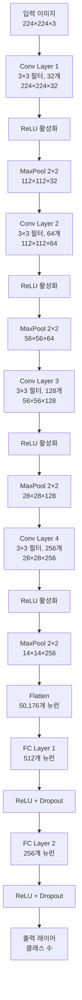
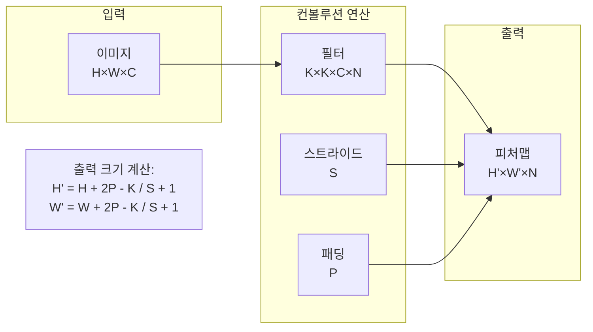
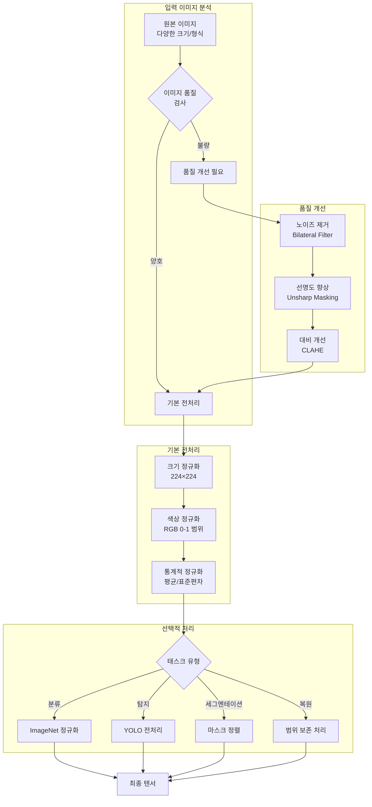
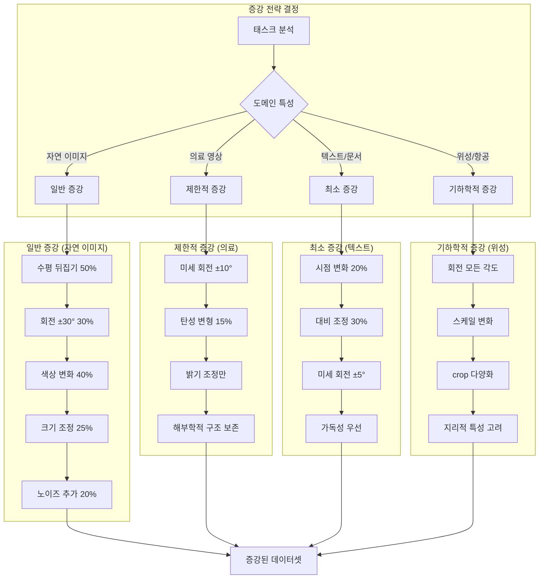
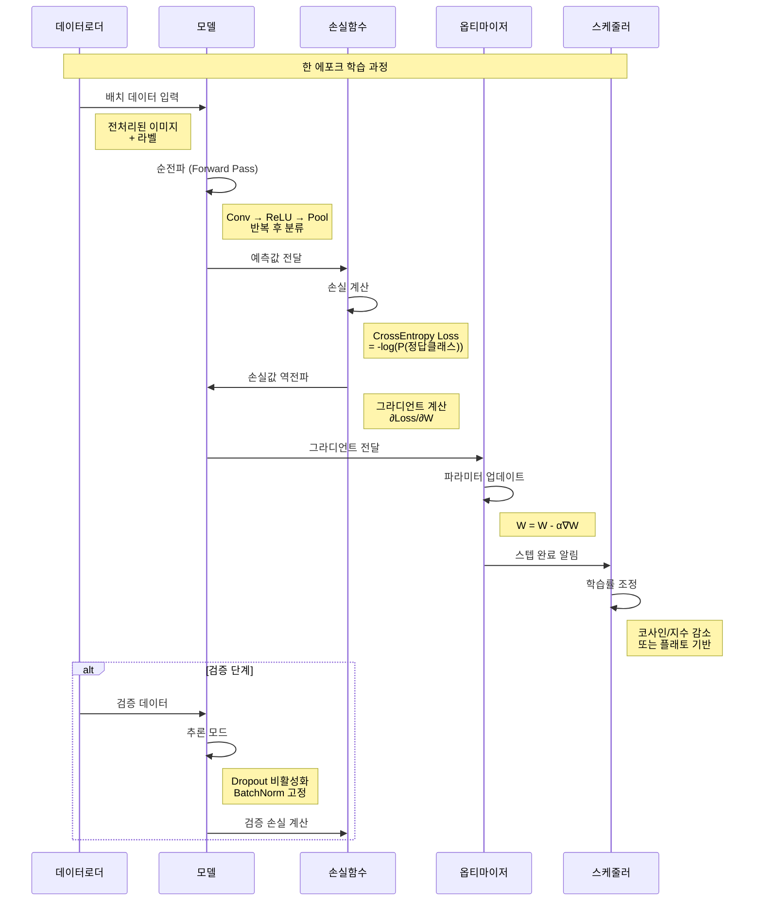

# 이미지와 컴퓨터비전 학습자료

> **작성자**: 코드잇 AI엔지니어 4기 김명환  
> **최종 수정**: 2025년 8월 14일

## 목차
1. [컴퓨터 비전 개요](#컴퓨터-비전-개요)
2. [디지털 이미지의 구조](#디지털-이미지의-구조)
3. [전통적인 컴퓨터 비전 방법](#전통적인-컴퓨터-비전-방법)
4. [딥러닝과 CNN](#딥러닝과-cnn)
5. [CNN 구성 요소](#cnn-구성-요소)
6. [CNN 아키텍처 시각화](#cnn-아키텍처-시각화)
7. [이미지 처리 파이프라인](#이미지-처리-파이프라인)
8. [이미지 전처리 방법과 종류](#이미지-전처리-방법과-종류)
9. [이미지 증강(Data Augmentation)](#이미지-증강data-augmentation)
10. [정규화의 장단점과 실제 적용](#정규화의-장단점과-실제-적용)
11. [주요 컴퓨터 비전 태스크](#주요-컴퓨터-비전-태스크)
12. [유명한 CNN 아키텍처](#유명한-cnn-아키텍처)
13. [실용 응용 분야](#실용-응용-분야)
14. [용어 정리](#용어-정리)
15. [부록: 상세 구현 코드](#부록-상세-구현-코드)

---

## 컴퓨터 비전 개요

### 컴퓨터 비전이란?

**컴퓨터 비전**(Computer Vision)은 컴퓨터가 사람처럼 이미지나 비디오를 "보고" 이해할 수 있게 하는 AI 분야입니다.

#### 인간 시각 vs 컴퓨터 시각

| 구분 | 인간의 시각 처리 | 컴퓨터의 시각 처리 |
|------|----------------|------------------|
| **처리 과정** | 눈 → 시신경 → 뇌의 시각피질 | 센서 → 디지털 신호 → 알고리즘 |
| **인식 속도** | 즉시 객체 인식, 깊이 감지 | 계산을 통한 분석 필요 |
| **이해 방식** | 맥락적 이해 | 픽셀 단위 수치 데이터 |
| **학습 방법** | 경험과 직관 | 패턴 매칭과 통계적 학습 |

### 컴퓨터 비전의 목표

1. **인식(Recognition)**: "이것은 무엇인가?"
2. **분할(Segmentation)**: "어디에 무엇이 있는가?"
3. **추적(Tracking)**: "어떻게 움직이는가?"
4. **재구성(Reconstruction)**: "3D 형태는 어떤가?"

---

## 디지털 이미지의 구조

### 픽셀의 개념

디지털 이미지는 **픽셀(Pixel, Picture Element)**이라는 작은 점들의 격자로 구성됩니다.

#### 흑백 이미지 구조 예시

```
5x5 픽셀 흑백 이미지 (0=검정, 255=흰색)

[  0  50 100 150 255]
[ 25  75 125 175 200]
[ 50 100 150 200 225]
[ 75 125 175 225 250]
[100 150 200 250 255]
```

#### 컬러 이미지 구조 (RGB)

```
각 픽셀이 3개의 값을 가짐:
픽셀 (0,0) = [R: 255, G: 0, B: 0]    # 빨간색
픽셀 (0,1) = [R: 0, G: 255, B: 0]    # 녹색  
픽셀 (0,2) = [R: 0, G: 0, B: 255]    # 파란색
```

### 이미지 해상도와 차원

- **해상도**: 이미지의 픽셀 개수 (예: 1920x1080)
- **차원**: 채널 수
  - 흑백: 1차원 (Height × Width × 1)
  - 컬러: 3차원 (Height × Width × 3)
  - RGBA: 4차원 (Height × Width × 4, Alpha는 투명도)

---

## 전통적인 컴퓨터 비전 방법

딥러닝 이전에는 수동으로 특징을 정의해야 했습니다.

### 1. 에지 디텍션(Edge Detection)

**목적**: 이미지에서 경계선 찾기

#### Sobel 필터 예제

```
수직 에지 검출:          수평 에지 검출:
[-1  0  1]              [-1 -2 -1]
[-2  0  2]              [ 0  0  0]
[-1  0  1]              [ 1  2  1]
```

### 2. 컨볼루션 연산 기본

```
이미지:    필터:    결과:
[1 2 3]   [1 0]    [1×1+2×0 = 1]
[4 5 6] * [0 1] =  [4×1+5×0 = 4]
[7 8 9]            [7×1+8×0 = 7]
```

### 전통적 방법의 한계

1. **수동 특징 설계**: 사람이 직접 어떤 특징을 찾을지 정의
2. **도메인 특화**: 한 문제에 최적화된 방법이 다른 문제에는 부적합
3. **복잡한 패턴 인식 한계**: 고차원적 패턴 인식 어려움
4. **확장성 부족**: 새로운 객체나 상황에 대한 일반화 어려움

---

## 딥러닝과 CNN

### 딥러닝의 혁신

**패러다임 변화:**
- **전통적 방법**: 수동 특징 설계 → 분류기
- **딥러닝**: 데이터로부터 자동으로 특징 학습 → 종단간(End-to-End) 학습

### 컨볼루셔널 신경망(CNN) 소개

**CNN**(Convolutional Neural Network, 컨볼루셔널[kən.və.ˈluː.ʃən.əl])은 이미지의 공간적 특성을 활용한 신경망입니다.

#### CNN의 핵심 아이디어

1. **지역 연결성(Local Connectivity)**: 인근 픽셀들만 연결
2. **파라미터 공유(Parameter Sharing)**: 같은 필터를 전체 이미지에 적용  
3. **평행이동 불변성(Translation Invariance)**: 객체의 위치가 바뀌어도 인식 가능

---

## CNN 아키텍처 시각화

### 전체 CNN 파이프라인



### 컨볼루션 연산 상세 과정



### 주요 CNN 아키텍처 비교

```mermaid
graph TD
    subgraph "LeNet-5 (1998)"
        L1[32×32×1] --> L2[Conv 6@5×5] --> L3[Pool] --> L4[Conv 16@5×5] --> L5[Pool] --> L6[FC 120] --> L7[FC 84] --> L8[Output 10]
    end
    
    subgraph "AlexNet (2012)"
        A1[227×227×3] --> A2[Conv 96@11×11] --> A3[Pool] --> A4[Conv 256@5×5] --> A5[Pool] --> A6[Conv 384@3×3] --> A7[Conv 384@3×3] --> A8[Conv 256@3×3] --> A9[Pool] --> A10[FC 4096] --> A11[FC 4096] --> A12[Output 1000]
    end
    
    subgraph "ResNet Block"
        R1[Input] --> R2[Conv 3×3]
        R2 --> R3[BatchNorm]
        R3 --> R4[ReLU]
        R4 --> R5[Conv 3×3]
        R5 --> R6[BatchNorm]
        R1 --> R7[Identity/1×1 Conv]
        R6 --> R8[Add]
        R7 --> R8
        R8 --> R9[ReLU]
        R9 --> R10[Output]
    end
```


---

## 이미지 처리 파이프라인

### 전체 이미지 모델링 파이프라인

```mermaid
flowchart TD
    subgraph DataCollection ["데이터 수집"]
        A1["원시 이미지 데이터"] --> A2["데이터 라벨링"]
        A2 --> A3["데이터셋 분할<br/>Train/Validation/Test"]
    end
    
    subgraph Preprocessing ["전처리 단계"]
        B1["크기 조정<br/>Resize/Crop"] --> B2["색공간 변환<br/>RGB/HSV/Grayscale"]
        B2 --> B3["정규화<br/>0-1 or -1~1 범위"]
        B3 --> B4["노이즈 제거<br/>필터링"]
    end
    
    subgraph DataAug ["데이터 증강"]
        C1["기하학적 변환<br/>회전/이동/크기조정"] --> C2["색상 변환<br/>밝기/대비/채도"]
        C2 --> C3["노이즈 추가<br/>Gaussian/Salt&Pepper"]
        C3 --> C4["고급 증강<br/>Mixup/CutMix"]
    end
    
    subgraph Training ["모델 학습"]
        D1["CNN 아키텍처<br/>선택/설계"] --> D2["손실함수 정의<br/>CrossEntropy/MSE"]
        D2 --> D3["옵티마이저 설정<br/>Adam/SGD"]
        D3 --> D4["학습률 스케줄링"]
        D4 --> D5["배치 단위 학습"]
    end
    
    subgraph Evaluation ["평가 및 최적화"]
        E1["검증 성능 측정<br/>Accuracy/F1-Score"] --> E2["하이퍼파라미터<br/>튜닝"]
        E2 --> E3["모델 앙상블<br/>여러 모델 조합"]
        E3 --> E4["최종 모델 선택"]
    end
    
    subgraph Deployment ["배포 및 추론"]
        F1["모델 압축<br/>Quantization/Pruning"] --> F2["추론 최적화<br/>TensorRT/ONNX"]
        F2 --> F3["실시간 처리<br/>스트리밍/배치"]
        F3 --> F4["성능 모니터링<br/>정확도/속도 추적"]
    end
    
    A3 --> B1
    B4 --> C1
    C4 --> D1
    D5 --> E1
    E4 --> F1
```



### 이미지 전처리 세부 과정



### 데이터 증강 전략 플로우



### 모델 학습 과정 상세화


---

## CNN 구성 요소

### 1. 컨볼루션 레이어(Convolution Layer)

#### 기본 컨볼루션 연산

```
입력 (4x4):              필터 (3x3):
[1  2  3  4 ]           [1  0  1]
[5  6  7  8 ]           [0  1  0]  
[9  10 11 12]           [1  0  1]
[13 14 15 16]

결과 (2x2):
[37  43]  # 1×1+2×0+3×1+5×0+6×1+7×0+9×1+10×0+11×1 = 37
[63  69]
```

#### 주요 하이퍼파라미터

**스트라이드(Stride)**: 필터가 이동하는 간격
```
스트라이드 1: 1픽셀씩 이동
스트라이드 2: 2픽셀씩 이동 (크기 절반으로 축소)
```

**패딩(Padding)**: 가장자리에 값 추가
```
원본 (3x3) → 제로 패딩 → (5x5)
[1 2 3]      [0 0 0 0 0]
[4 5 6]  →   [0 1 2 3 0]
[7 8 9]      [0 4 5 6 0]
             [0 7 8 9 0]
             [0 0 0 0 0]
```

### 2. 활성화 함수 - ReLU

```python
ReLU(x) = max(0, x)

입력: [-2, -1, 0, 1, 2]
출력: [ 0,  0, 0, 1, 2]
```

### 3. 풀링 레이어(Pooling Layer)

#### 맥스 풀링 예제

```
입력 (4x4):              2x2 맥스 풀링:    출력 (2x2):
[1  3  2  4]            각 2x2 영역의     [7  8]
[5  7  6  8]      →     최댓값 선택  →    [15 16] 
[9  11 10 12]
[13 15 14 16]
```

---

## 이미지 전처리 방법과 종류

### 전처리의 목적

1. **데이터 표준화**: 모델이 일관성 있게 학습
2. **성능 향상**: 노이즈 제거, 대비 개선
3. **계산 효율성**: 이미지 크기 조정으로 연산량 감소
4. **일반화 성능**: 다양한 조건에 robust한 모델 구축

### 1. 기본 전처리 방법

#### 크기 조정(Resizing)

```python
# 간단한 크기 조정 예시
import cv2
resized = cv2.resize(image, (224, 224))
```

**보간 방법 비교:**

| 방법 | 특징 | 용도 |
|------|------|------|
| INTER_LINEAR | 선형 보간, 빠름 | 일반적 용도 |
| INTER_CUBIC | 3차 보간, 부드러움 | 품질 중시 |
| INTER_AREA | 축소에 최적화 | 다운샘플링 |

#### 색공간 변환

```python
# 주요 색공간 변환
gray = cv2.cvtColor(image, cv2.COLOR_RGB2GRAY)  # 그레이스케일
hsv = cv2.cvtColor(image, cv2.COLOR_RGB2HSV)    # HSV
lab = cv2.cvtColor(image, cv2.COLOR_RGB2LAB)    # LAB
```

**색공간별 특징:**
- **RGB**: 기본 색공간, 하드웨어 친화적
- **HSV**: 색상 분리 용이, 색상 기반 필터링에 유용
- **LAB**: 인간 시각과 유사, 색상 보정에 효과적

### 2. 히스토그램 처리

#### 히스토그램 평활화

```python
# 그레이스케일 히스토그램 평활화
equalized = cv2.equalizeHist(gray_image)

# CLAHE (적응적 히스토그램 평활화)
clahe = cv2.createCLAHE(clipLimit=2.0, tileGridSize=(8,8))
clahe_result = clahe.apply(gray_image)
```

**언제 사용하나:**
- 대비가 낮은 이미지
- 의료 영상 분석
- 저조도 환경 이미지

### 3. 노이즈 제거

```python
# 가우시안 블러 - 일반적 노이즈 제거
gaussian = cv2.GaussianBlur(image, (5, 5), 0)

# 미디언 필터 - Salt-and-pepper 노이즈
median = cv2.medianBlur(image, 5)

# 양방향 필터 - 엣지 보존하며 노이즈 제거
bilateral = cv2.bilateralFilter(image, 9, 75, 75)
```

---

## 이미지 증강(Data Augmentation)

### 증강의 목적

1. **데이터 부족 해결**: 제한된 데이터셋 확장
2. **과적합 방지**: 다양한 변형으로 일반화 성능 향상
3. **불변성 학습**: 변환에 robust한 모델 구축
4. **데이터 불균형 해결**: 클래스별 데이터 균형화

### 1. 기하학적 변환

#### 회전(Rotation)

```python
# 무작위 회전 (-30도 ~ +30도)
angle = random.uniform(-30, 30)
rotated = cv2.warpAffine(image, rotation_matrix, (w, h))
```

**권장 각도:**
- 일반 객체: ±15도
- 자연 이미지: ±30도  
- 텍스트/숫자: ±10도 (가독성 고려)

#### 평행이동(Translation)

```python
# 이미지 크기의 10% 범위 내 이동
shift_x = int(width * 0.1 * random.uniform(-1, 1))
shift_y = int(height * 0.1 * random.uniform(-1, 1))
```

#### 확대/축소(Scaling)

```python
# 0.8배 ~ 1.2배 크기 변화
scale = random.uniform(0.8, 1.2)
scaled = cv2.resize(image, None, fx=scale, fy=scale)
```

### 2. 색상 및 밝기 변환

#### 밝기 조정

```python
# 밝기 ±50 범위 조정
brightness = random.randint(-50, 50)
bright_image = cv2.add(image, np.ones(image.shape, dtype=np.uint8) * brightness)
```

#### 대비 조정

```python
# 0.7배 ~ 1.3배 대비 변화
contrast = random.uniform(0.7, 1.3)
contrasted = np.clip((image - 128) * contrast + 128, 0, 255)
```

### 3. 고급 증강 기법

#### 믹스업(Mixup)

두 이미지를 선형 결합하여 새로운 훈련 샘플 생성

```
mixed_image = λ × image1 + (1-λ) × image2
mixed_label = λ × label1 + (1-λ) × label2
```

#### CutMix

한 이미지의 일부를 다른 이미지로 교체

```
이미지1의 사각형 영역을 이미지2로 대체
라벨도 영역 비율에 따라 조합
```

### 4. 증강 전략과 고려사항

#### 태스크별 증강 전략

| 태스크 | 권장 증강 | 주의사항 |
|--------|-----------|----------|
| **이미지 분류** | 회전, 이동, 색상 변화 | 과도한 변형 주의 |
| **객체 탐지** | 수평 뒤집기, 크기 조정 | 바운딩 박스 함께 변환 |
| **세그멘테이션** | 탄성 변형, 회전 | 마스크와 이미지 동일 변환 |
| **의료 영상** | 회전, 탄성 변형 | 해부학적 구조 보존 |

#### 데이터 의존적 고려사항

```python
# 도메인별 증강 예시

# 자연 이미지
natural_augmentations = [
    'horizontal_flip',      # 좌우 반전 OK
    'rotation',            # 회전 OK  
    'color_jitter',        # 색상 변화 OK
    'gaussian_noise'       # 노이즈 추가 OK
]

# 의료 영상
medical_augmentations = [
    'rotation',            # 제한적 회전
    'elastic_deformation', # 조직 변형 시뮬레이션
    'brightness_adjust',   # 촬영 조건 차이
    # 'horizontal_flip'    # 해부학적 이유로 제외
]

# 텍스트/문서
text_augmentations = [
    'slight_rotation',     # 미세한 회전만
    'perspective_change',  # 시점 변화
    'contrast_adjust',     # 대비 조정
    # 'color_change'       # 텍스트 색상은 보존
]
```

---

## 정규화의 장단점과 실제 적용

### 정규화 방법들

#### 1. 기본 정규화 방법

```python
# Min-Max 정규화 (0-1 범위)
normalized = (image - image.min()) / (image.max() - image.min())

# 단순 스케일링 (0-1 범위)
simple_norm = image.astype(np.float32) / 255.0

# Z-score 정규화 (평균 0, 표준편차 1)
z_norm = (image - image.mean()) / image.std()

# ImageNet 정규화 (사전훈련 모델용)
imagenet_norm = (image/255.0 - [0.485, 0.456, 0.406]) / [0.229, 0.224, 0.225]
```

### 정규화의 장점

1. **훈련 안정성 향상**
   - 그라디언트 크기 조절
   - 수치적 안정성 확보

2. **수렴 속도 향상**
   - 적절한 학습률 사용 가능
   - 더 빠른 최적화

3. **사전훈련 모델 호환**
   - Transfer Learning 시 필수
   - 모델 간 일관성 유지

### 정규화의 단점과 이미지 복원에서의 문제

#### 1. 정보 손실 문제

```python
# 절대적 밝기 정보 손실 예시
bright_image = np.array([[200, 220, 240]])  # 밝은 이미지
dark_image = np.array([[20, 22, 24]])       # 어두운 이미지

# Min-Max 정규화 후 둘 다 [0, 0.5, 1.0]이 됨
# → 원본의 절대적 밝기 차이 소실
```

#### 2. 이미지 복원에서 성능 저하 원인

**복원 태스크의 특수성:**

| 일반 분류 | 이미지 복원 |
|-----------|-------------|
| 상대적 패턴 중요 | 절대적 값 중요 |
| 정규화로 안정성 ↑ | 정규화로 정보 손실 |
| 분류 경계 학습 | 픽셀 값 정확도 중요 |

#### 3. 복원 태스크에서의 대안

**1) 적응적 정규화**

```python
# 지역적 정규화 - 패치별로 다른 정규화
def adaptive_normalization(image, patch_size=64):
    h, w = image.shape[:2]
    normalized = np.zeros_like(image, dtype=np.float32)
    
    for i in range(0, h, patch_size):
        for j in range(0, w, patch_size):
            patch = image[i:i+patch_size, j:j+patch_size]
            # 패치별 개별 정규화
            norm_patch = (patch - patch.mean()) / (patch.std() + 1e-8)
            normalized[i:i+patch_size, j:j+patch_size] = norm_patch
    
    return normalized
```

**2) 범위 보존 정규화**

```python
# 원본 범위 정보 보존
def range_preserving_norm(image):
    # 정규화와 함께 범위 정보 저장
    min_val, max_val = image.min(), image.max()
    normalized = (image - min_val) / (max_val - min_val)
    return normalized, min_val, max_val

def denormalize(normalized, min_val, max_val):
    # 복원 시 원래 범위로 되돌림
    return normalized * (max_val - min_val) + min_val
```

**3) 복원 전용 전처리**

```python
# 이미지 복원에 적합한 전처리
def restoration_preprocessing(image):
    # 1. 노이즈 제거 (과도하지 않게)
    denoised = cv2.bilateralFilter(image, 5, 25, 25)
    
    # 2. 정규화 대신 단순 타입 변환
    processed = denoised.astype(np.float32)
    
    # 3. 0-1 범위로 스케일링 (정보 보존)
    if processed.max() > 1.0:
        processed = processed / 255.0
    
    return processed
```

### 복원 성능 저하 해결 방안

#### 1. 손실 함수 개선

```python
# 정규화된 공간에서의 손실보다 원본 공간 손실 사용
def perceptual_loss(restored, target):
    # VGG 특징을 이용한 지각적 손실
    # 정규화 영향 최소화
    pass

def combined_loss(restored, target):
    # L1 + Perceptual + GAN Loss 조합
    # 픽셀 단위 정확도와 지각적 품질 모두 고려
    pass
```

#### 2. 네트워크 아키텍처 조정

```python
# 복원용 네트워크 설계 시 고려사항
class RestorationNetwork(nn.Module):
    def __init__(self):
        super().__init__()
        # 1. Skip connection으로 저수준 정보 보존
        # 2. 다중 스케일 특징 활용
        # 3. 정규화 레이어 신중히 사용
        pass
```

#### 3. 훈련 전략 수정

```python
# 점진적 훈련 방법
def progressive_training():
    # 1단계: 정규화 없이 기본 복원 학습
    # 2단계: 약한 정규화 적용
    # 3단계: 최종 fine-tuning
    pass
```

---

## 주요 컴퓨터 비전 태스크

### 1. 이미지 분류(Image Classification)

**목표**: 이미지 전체를 하나의 클래스로 분류

```python
# 출력 예시
입력: 고양이 사진
출력: {"고양이": 0.95, "개": 0.03, "새": 0.01, "기타": 0.01}
```

### 2. 객체 탐지(Object Detection)

**목표**: 이미지에서 여러 객체의 위치와 클래스를 동시에 찾기

```python
# 바운딩 박스 형식: [x, y, width, height, class, confidence]
출력 = [
    [100, 50, 200, 150, "사람", 0.92],
    [300, 80, 100, 120, "자동차", 0.87],
    [450, 200, 80, 60, "신호등", 0.79]
]
```

### 3. 시맨틱 세그멘테이션(Semantic Segmentation)

**목표**: 픽셀 단위로 클래스 분류

```
원본 이미지:           세그멘테이션 결과:
[하늘 하늘 나무 나무]  [클래스1 클래스1 클래스2 클래스2]
[하늘 하늘 나무 나무]  [클래스1 클래스1 클래스2 클래스2]
[길  길  차  차 ]    [클래스3 클래스3 클래스4 클래스4]
```

### 4. 인스턴스 세그멘테이션(Instance Segmentation)

**시맨틱 vs 인스턴스 비교:**

```
시맨틱: [사람 사람 배경]  →  인스턴스: [사람1 사람2 배경]
        같은 클래스 통합      →           개별 객체 구분
```

---

## 유명한 CNN 아키텍처

### 1. LeNet-5 (1998년)

```
입력(32×32×1) → Conv1 → Pool1 → Conv2 → Pool2 → FC → 출력(10)
```

**특징:**
- 최초의 성공적인 CNN
- 손글씨 숫자 인식용
- 시그모이드 활성화 함수

### 2. AlexNet (2012년)

**혁신 요소:**
1. **ReLU 활성화 함수** 도입
2. **드롭아웃**으로 과적합 방지  
3. **GPU 병렬 처리** 활용
4. **데이터 어그멘테이션** 적용

### 3. VGG (2014년)

**핵심**: 작은 3×3 필터를 깊게 쌓기

```
왜 3×3 필터?
- 7×7 필터 1개 = 49개 파라미터
- 3×3 필터 3개 = 27개 파라미터 (같은 수용영역, 더 적은 파라미터)
```

### 4. ResNet (2015년)

**문제**: 깊은 네트워크의 그라디언트 소실

**해결**: 잔차 연결(Residual Connection)

```
전통적: H(x) = F(x)
ResNet: H(x) = F(x) + x  ← 스킵 연결 추가
```

### 5. EfficientNet (2019년)

**복합 스케일링**: 깊이 + 너비 + 해상도 동시 조정

```
깊이: d = α^φ
너비: w = β^φ  
해상도: r = γ^φ
제약: α × β² × γ² ≈ 2
```

---

## 실용 응용 분야

### 1. 자율주행

**핵심 기술:**
- 차선 인식 (세그멘테이션)
- 신호등 분류 (객체 탐지)
- 보행자 추적 (다중 객체 추적)

### 2. 의료 영상

**응용 분야:**
- X-ray 판독 보조
- 피부암 진단
- 망막 병변 탐지

### 3. 제조업

**품질 관리:**
- 표면 결함 탐지
- 부품 조립 확인
- 치수 측정 자동화

### 4. 보안 및 감시

**기능:**
- 얼굴 인식 출입 통제
- 이상 행동 탐지
- 차량 번호판 인식

### 5. 소매업

**활용:**
- 무인 계산대
- 재고 관리
- 고객 행동 분석

---
---

## 용어 정리

### A-C

**CNN (Convolutional Neural Network)**
: 이미지 처리에 특화된 신경망, 컨볼루션 연산을 통해 특징을 추출

**컨볼루션(Convolution)**
: 필터를 이미지에 슬라이딩하며 특징을 추출하는 연산

**CLAHE (Contrast Limited Adaptive Histogram Equalization)**
: 지역적 대비 향상 기법, 과도한 대비 증가 방지

### D-F

**드롭아웃(Dropout)**
: 과적합을 방지하기 위해 일부 뉴런을 임의로 비활성화하는 기법

**데이터 어그멘테이션(Data Augmentation)**
: 기존 데이터를 변형하여 훈련 데이터를 늘리는 기법

**피처 맵(Feature Map)**
: 컨볼루션 레이어에서 출력되는 특징이 추출된 이미지

### G-P

**HSV**
: Hue(색조), Saturation(채도), Value(명도) 색공간

**ImageNet**
: 대규모 이미지 분류 데이터셋, 사전훈련 모델의 기준

**커널/필터(Kernel/Filter)**
: 컨볼루션 연산에 사용되는 작은 크기의 가중치 행렬

**풀링(Pooling)**
: 이미지 크기를 줄이면서 중요한 정보를 보존하는 기법

### R-Z

**ReLU (Rectified Linear Unit)**
: 음수를 0으로, 양수는 그대로 출력하는 활성화 함수, f(x) = max(0, x)

**ResNet (Residual Network)**
: 잔차 연결을 도입하여 매우 깊은 네트워크 학습을 가능하게 한 아키텍처

**RGB**
: Red(빨강), Green(녹색), Blue(파랑) 색공간, 컴퓨터 디스플레이의 기본 색상 모델

**스트라이드(Stride)**
: 컨볼루션이나 풀링 연산에서 필터가 이동하는 간격

**시맨틱 세그멘테이션(Semantic Segmentation)**
: 픽셀 단위로 객체의 클래스를 분류하는 태스크

**배치 노멀라이제이션(Batch Normalization)**
: 미니배치의 평균과 분산을 이용해 입력을 정규화하여 학습 안정성을 높이는 기법

**백프로파게이션(Backpropagation)**
: 출력층에서 입력층으로 오차를 역전파하여 가중치를 업데이트하는 알고리즘

**오버피팅(Overfitting)**
: 훈련 데이터에만 과도하게 적합하여 새로운 데이터에 대한 일반화 성능이 떨어지는 현상

**언더피팅(Underfitting)**
: 모델이 너무 단순하여 훈련 데이터의 패턴조차 제대로 학습하지 못하는 현상

**전이 학습(Transfer Learning)**
: 사전 훈련된 모델의 지식을 새로운 태스크에 활용하는 기법

**데이터 어그멘테이션(Data Augmentation)**
: 기존 데이터를 변형하여 훈련 데이터의 양과 다양성을 늘리는 기법

**앙상블(Ensemble)**
: 여러 모델의 예측을 결합하여 더 나은 성능을 얻는 기법

**하이퍼파라미터(Hyperparameter)**
: 학습 전에 설정하는 매개변수 (학습률, 배치 크기, 에포크 수 등)

**그라디언트 디센트(Gradient Descent)**
: 손실함수의 기울기를 이용해 최적의 가중치를 찾는 최적화 알고리즘

**교차 검증(Cross Validation)**
: 데이터를 여러 부분으로 나누어 모델의 일반화 성능을 평가하는 기법

**F1 스코어(F1 Score)**
: 정밀도와 재현율의 조화평균, 불균형 데이터셋 평가에 유용

**IoU (Intersection over Union)**
: 객체 탐지와 세그멘테이션에서 예측과 실제 영역의 겹침 정도를 측정하는 지표

**mAP (mean Average Precision)**
: 객체 탐지 모델의 성능을 측정하는 표준 지표

**NMS (Non-Maximum Suppression)**
: 객체 탐지에서 중복된 바운딩 박스를 제거하는 후처리 기법

**YOLO (You Only Look Once)**
: 실시간 객체 탐지를 위한 단일 신경망 아키텍처

**U-Net**
: 의료 영상 세그멘테이션에 널리 사용되는 인코더-디코더 구조의 네트워크

**VGG**
: 작은 3×3 필터를 깊게 쌓은 CNN 아키텍처의 대표작

**가중치 감쇠(Weight Decay)**
: 과적합을 방지하기 위해 가중치에 페널티를 부과하는 정규화 기법

**학습률 스케줄링(Learning Rate Scheduling)**
: 훈련 과정에서 학습률을 동적으로 조정하는 기법

**조기 종료(Early Stopping)**
: 검증 성능이 개선되지 않을 때 훈련을 중단하여 과적합을 방지하는 기법

---
---

## 부록: 상세 구현 코드

### A. 완전한 이미지 분류 파이프라인

```python
import torch
import torch.nn as nn
import torch.optim as optim
import torchvision.transforms as transforms
from torch.utils.data import DataLoader
from torchvision.datasets import CIFAR10
import numpy as np
import matplotlib.pyplot as plt

class CompleteCNN(nn.Module):
    """완전한 CNN 분류 모델"""
    
    def __init__(self, num_classes=10):
        super(CompleteCNN, self).__init__()
        
        # 특징 추출 부분
        self.features = nn.Sequential(
            # 첫 번째 블록: 32x32x3 → 16x16x32
            nn.Conv2d(3, 32, 3, padding=1),
            nn.BatchNorm2d(32),
            nn.ReLU(inplace=True),
            nn.MaxPool2d(2, 2),
            
            # 두 번째 블록: 16x16x32 → 8x8x64
            nn.Conv2d(32, 64, 3, padding=1),
            nn.BatchNorm2d(64),
            nn.ReLU(inplace=True),
            nn.MaxPool2d(2, 2),
            
            # 세 번째 블록: 8x8x64 → 4x4x128
            nn.Conv2d(64, 128, 3, padding=1),
            nn.BatchNorm2d(128),
            nn.ReLU(inplace=True),
            nn.MaxPool2d(2, 2),
            
            # 네 번째 블록: 4x4x128 → 2x2x256
            nn.Conv2d(128, 256, 3, padding=1),
            nn.BatchNorm2d(256),
            nn.ReLU(inplace=True),
            nn.MaxPool2d(2, 2),
        )
        
        # 분류기 부분
        self.classifier = nn.Sequential(
            nn.Dropout(0.5),
            nn.Linear(256 * 2 * 2, 512),
            nn.ReLU(inplace=True),
            nn.Dropout(0.5),
            nn.Linear(512, 256),
            nn.ReLU(inplace=True),
            nn.Linear(256, num_classes)
        )
    
    def forward(self, x):
        x = self.features(x)
        x = x.view(x.size(0), -1)  # 평탄화
        x = self.classifier(x)
        return x

class AdvancedImagePreprocessor:
    """고급 이미지 전처리 클래스"""
    
    def __init__(self, target_size=(224, 224)):
        self.target_size = target_size
        
    def preprocess_for_training(self):
        """훈련용 전처리 (증강 포함)"""
        return transforms.Compose([
            transforms.Resize(256),
            transforms.RandomCrop(224),
            transforms.RandomHorizontalFlip(p=0.5),
            transforms.RandomRotation(degrees=10),
            transforms.ColorJitter(
                brightness=0.2,
                contrast=0.2, 
                saturation=0.2,
                hue=0.1
            ),
            transforms.ToTensor(),
            transforms.Normalize(
                mean=[0.485, 0.456, 0.406],
                std=[0.229, 0.224, 0.225]
            ),
            transforms.RandomErasing(p=0.1)  # 무작위 영역 지우기
        ])
    
    def preprocess_for_validation(self):
        """검증/테스트용 전처리 (증강 없음)"""
        return transforms.Compose([
            transforms.Resize(256),
            transforms.CenterCrop(224),
            transforms.ToTensor(),
            transforms.Normalize(
                mean=[0.485, 0.456, 0.406],
                std=[0.229, 0.224, 0.225]
            )
        ])

class TrainingManager:
    """훈련 관리 클래스"""
    
    def __init__(self, model, device='cuda'):
        self.model = model.to(device)
        self.device = device
        self.train_losses = []
        self.val_accuracies = []
        
    def train_epoch(self, train_loader, criterion, optimizer):
        """한 에포크 훈련"""
        self.model.train()
        running_loss = 0.0
        correct = 0
        total = 0
        
        for batch_idx, (data, target) in enumerate(train_loader):
            data, target = data.to(self.device), target.to(self.device)
            
            # 그라디언트 초기화
            optimizer.zero_grad()
            
            # 순전파
            output = self.model(data)
            loss = criterion(output, target)
            
            # 역전파
            loss.backward()
            optimizer.step()
            
            # 통계 계산
            running_loss += loss.item()
            _, predicted = output.max(1)
            total += target.size(0)
            correct += predicted.eq(target).sum().item()
            
            if batch_idx % 100 == 0:
                print(f'Batch {batch_idx}: Loss {loss.item():.4f}, '
                      f'Acc {100.*correct/total:.2f}%')
        
        epoch_loss = running_loss / len(train_loader)
        epoch_acc = 100. * correct / total
        self.train_losses.append(epoch_loss)
        
        return epoch_loss, epoch_acc
    
    def validate(self, val_loader, criterion):
        """검증 수행"""
        self.model.eval()
        val_loss = 0
        correct = 0
        total = 0
        
        with torch.no_grad():
            for data, target in val_loader:
                data, target = data.to(self.device), target.to(self.device)
                output = self.model(data)
                val_loss += criterion(output, target).item()
                
                _, predicted = output.max(1)
                total += target.size(0)
                correct += predicted.eq(target).sum().item()
        
        val_loss /= len(val_loader)
        val_acc = 100. * correct / total
        self.val_accuracies.append(val_acc)
        
        return val_loss, val_acc
    
    def train_complete_pipeline(self, train_loader, val_loader, epochs=50):
        """전체 훈련 파이프라인"""
        # 손실함수와 옵티마이저 설정
        criterion = nn.CrossEntropyLoss()
        optimizer = optim.Adam(self.model.parameters(), lr=0.001, weight_decay=1e-4)
        scheduler = optim.lr_scheduler.ReduceLROnPlateau(
            optimizer, mode='min', factor=0.5, patience=5
        )
        
        best_val_acc = 0
        
        for epoch in range(epochs):
            print(f'\nEpoch {epoch+1}/{epochs}')
            print('-' * 30)
            
            # 훈련
            train_loss, train_acc = self.train_epoch(train_loader, criterion, optimizer)
            
            # 검증
            val_loss, val_acc = self.validate(val_loader, criterion)
            
            # 학습률 조정
            scheduler.step(val_loss)
            
            print(f'Train Loss: {train_loss:.4f}, Train Acc: {train_acc:.2f}%')
            print(f'Val Loss: {val_loss:.4f}, Val Acc: {val_acc:.2f}%')
            
            # 최고 성능 모델 저장
            if val_acc > best_val_acc:
                best_val_acc = val_acc
                torch.save(self.model.state_dict(), 'best_model.pth')
                print(f'New best model saved! Val Acc: {val_acc:.2f}%')

# 사용 예시
def main():
    # 데이터 준비
    preprocessor = AdvancedImagePreprocessor()
    
    train_dataset = CIFAR10(
        root='./data', 
        train=True, 
        download=True, 
        transform=preprocessor.preprocess_for_training()
    )
    
    val_dataset = CIFAR10(
        root='./data', 
        train=False, 
        download=True, 
        transform=preprocessor.preprocess_for_validation()
    )
    
    train_loader = DataLoader(train_dataset, batch_size=32, shuffle=True)
    val_loader = DataLoader(val_dataset, batch_size=32, shuffle=False)
    
    # 모델 생성 및 훈련
    model = CompleteCNN(num_classes=10)
    trainer = TrainingManager(model)
    trainer.train_complete_pipeline(train_loader, val_loader, epochs=50)

if __name__ == "__main__":
    main()
```

### B. 고급 데이터 증강 기법

```python
import cv2
import numpy as np
import random
from scipy.ndimage import gaussian_filter, map_coordinates
import albumentations as A

class AdvancedAugmentation:
    """고급 데이터 증강 클래스"""
    
    def __init__(self, image_size=224):
        self.image_size = image_size
        
    def get_albumentations_transform(self, is_training=True):
        """Albumentations를 이용한 강력한 증강"""
        if is_training:
            return A.Compose([
                A.Resize(self.image_size, self.image_size),
                A.HorizontalFlip(p=0.5),
                A.ShiftScaleRotate(
                    shift_limit=0.1,
                    scale_limit=0.2,
                    rotate_limit=30,
                    p=0.5
                ),
                A.OneOf([
                    A.GaussianBlur(blur_limit=3),
                    A.MotionBlur(blur_limit=3),
                    A.MedianBlur(blur_limit=3),
                ], p=0.3),
                A.OneOf([
                    A.RandomBrightnessContrast(
                        brightness_limit=0.2,
                        contrast_limit=0.2
                    ),
                    A.HueSaturationValue(
                        hue_shift_limit=20,
                        sat_shift_limit=30,
                        val_shift_limit=20
                    ),
                    A.CLAHE(clip_limit=2.0),
                ], p=0.5),
                A.OneOf([
                    A.GaussNoise(var_limit=(10.0, 50.0)),
                    A.ISONoise(),
                    A.MultiplicativeNoise(),
                ], p=0.3),
                A.CoarseDropout(
                    max_holes=8,
                    max_height=32,
                    max_width=32,
                    p=0.3
                ),
                A.Normalize(
                    mean=[0.485, 0.456, 0.406],
                    std=[0.229, 0.224, 0.225]
                )
            ])
        else:
            return A.Compose([
                A.Resize(self.image_size, self.image_size),
                A.Normalize(
                    mean=[0.485, 0.456, 0.406],
                    std=[0.229, 0.224, 0.225]
                )
            ])
    
    def elastic_deformation(self, image, alpha=200, sigma=20):
        """탄성 변형 (필기체 인식에 효과적)"""
        random_state = np.random.RandomState(None)
        h, w = image.shape[:2]
        
        dx = gaussian_filter(
            (random_state.rand(h, w) * 2 - 1), 
            sigma, mode="constant", cval=0
        ) * alpha
        dy = gaussian_filter(
            (random_state.rand(h, w) * 2 - 1), 
            sigma, mode="constant", cval=0
        ) * alpha
        
        x, y = np.meshgrid(np.arange(w), np.arange(h))
        indices = np.reshape(y + dy, (-1, 1)), np.reshape(x + dx, (-1, 1))
        
        if len(image.shape) == 3:
            deformed = np.zeros_like(image)
            for i in range(image.shape[2]):
                deformed[:, :, i] = map_coordinates(
                    image[:, :, i], indices, order=1, mode='reflect'
                ).reshape(h, w)
        else:
            deformed = map_coordinates(
                image, indices, order=1, mode='reflect'
            ).reshape(h, w)
        
        return deformed.astype(np.uint8)
    
    def mixup(self, image1, image2, label1, label2, alpha=0.2):
        """믹스업 증강"""
        if alpha > 0:
            lam = np.random.beta(alpha, alpha)
        else:
            lam = 1
        
        mixed_image = lam * image1 + (1 - lam) * image2
        mixed_label = lam * label1 + (1 - lam) * label2
        
        return mixed_image.astype(np.uint8), mixed_label
    
    def cutmix(self, image1, image2, label1, label2, alpha=1.0):
        """CutMix 증강"""
        lam = np.random.beta(alpha, alpha)
        h, w = image1.shape[:2]
        
        cut_ratio = np.sqrt(1. - lam)
        cut_w = int(w * cut_ratio)
        cut_h = int(h * cut_ratio)
        
        cx = np.random.randint(w)
        cy = np.random.randint(h)
        
        bbx1 = np.clip(cx - cut_w // 2, 0, w)
        bby1 = np.clip(cy - cut_h // 2, 0, h)
        bbx2 = np.clip(cx + cut_w // 2, 0, w)
        bby2 = np.clip(cy + cut_h // 2, 0, h)
        
        result = image1.copy()
        result[bby1:bby2, bbx1:bbx2] = image2[bby1:bby2, bbx1:bbx2]
        
        lam = 1 - ((bbx2 - bbx1) * (bby2 - bby1) / (w * h))
        mixed_label = lam * label1 + (1 - lam) * label2
        
        return result, mixed_label

### C. 이미지 복원을 위한 특별한 전처리

```python
class RestorationPreprocessor:
    """이미지 복원용 전처리 클래스"""
    
    def __init__(self):
        self.device = torch.device('cuda' if torch.cuda.is_available() else 'cpu')
    
    def adaptive_normalization(self, image, patch_size=64):
        """지역적 적응 정규화"""
        if isinstance(image, torch.Tensor):
            image = image.cpu().numpy()
        
        h, w = image.shape[:2]
        normalized = np.zeros_like(image, dtype=np.float32)
        
        for i in range(0, h, patch_size):
            for j in range(0, w, patch_size):
                end_i = min(i + patch_size, h)
                end_j = min(j + patch_size, w)
                patch = image[i:end_i, j:end_j]
                
                # 패치별 정규화
                patch_mean = patch.mean()
                patch_std = patch.std() + 1e-8
                normalized[i:end_i, j:end_j] = (patch - patch_mean) / patch_std
        
        return normalized
    
    def range_preserving_preprocess(self, image):
        """범위 보존 전처리"""
        if isinstance(image, np.ndarray):
            image = torch.from_numpy(image).float()
        
        # 원본 범위 저장
        min_val = image.min()
        max_val = image.max()
        
        # 0-1 정규화
        if max_val > min_val:
            normalized = (image - min_val) / (max_val - min_val)
        else:
            normalized = image
        
        return normalized, min_val, max_val
    
    def restoration_specific_denoising(self, image):
        """복원용 특화 노이즈 제거"""
        # 1. 보존적 양방향 필터링
        if len(image.shape) == 3:
            denoised = cv2.bilateralFilter(image, 5, 25, 25)
        else:
            denoised = cv2.bilateralFilter(image, 5, 25, 25)
        
        # 2. 엣지 보존 스무딩
        kernel = np.array([[0, -1, 0], 
                          [-1, 5, -1], 
                          [0, -1, 0]]) * 0.1
        
        sharpened = cv2.filter2D(denoised, -1, kernel)
        
        # 3. 원본과 혼합 (60% 원본, 40% 처리된 이미지)
        result = 0.6 * image + 0.4 * sharpened
        
        return np.clip(result, 0, 255).astype(np.uint8)

### D. 모델 평가 및 시각화

```python
import matplotlib.pyplot as plt
import seaborn as sns
from sklearn.metrics import classification_report, confusion_matrix
import torch.nn.functional as F

class ModelEvaluator:
    """모델 평가 클래스"""
    
    def __init__(self, model, device='cuda'):
        self.model = model
        self.device = device
        self.class_names = None
    
    def evaluate_classification(self, test_loader, class_names=None):
        """분류 모델 종합 평가"""
        self.model.eval()
        self.class_names = class_names
        
        all_predictions = []
        all_targets = []
        all_probabilities = []
        
        with torch.no_grad():
            for data, target in test_loader:
                data, target = data.to(self.device), target.to(self.device)
                output = self.model(data)
                
                # 확률과 예측값 저장
                probabilities = F.softmax(output, dim=1)
                _, predicted = output.max(1)
                
                all_predictions.extend(predicted.cpu().numpy())
                all_targets.extend(target.cpu().numpy())
                all_probabilities.extend(probabilities.cpu().numpy())
        
        # 성능 메트릭 계산
        accuracy = np.mean(np.array(all_predictions) == np.array(all_targets))
        
        # 분류 리포트
        report = classification_report(
            all_targets, all_predictions, 
            target_names=class_names,
            output_dict=True
        )
        
        # 혼동 행렬
        cm = confusion_matrix(all_targets, all_predictions)
        
        return {
            'accuracy': accuracy,
            'classification_report': report,
            'confusion_matrix': cm,
            'predictions': all_predictions,
            'targets': all_targets,
            'probabilities': all_probabilities
        }
    
    def plot_confusion_matrix(self, cm, class_names=None):
        """혼동 행렬 시각화"""
        plt.figure(figsize=(10, 8))
        sns.heatmap(
            cm, 
            annot=True, 
            fmt='d', 
            cmap='Blues',
            xticklabels=class_names or range(cm.shape[1]),
            yticklabels=class_names or range(cm.shape[0])
        )
        plt.title('Confusion Matrix')
        plt.xlabel('Predicted Label')
        plt.ylabel('True Label')
        plt.tight_layout()
        plt.show()
    
    def plot_training_history(self, train_losses, val_accuracies):
        """훈련 과정 시각화"""
        fig, (ax1, ax2) = plt.subplots(1, 2, figsize=(15, 5))
        
        # 손실 그래프
        ax1.plot(train_losses, label='Training Loss')
        ax1.set_title('Training Loss Over Time')
        ax1.set_xlabel('Epoch')
        ax1.set_ylabel('Loss')
        ax1.legend()
        ax1.grid(True)
        
        # 정확도 그래프
        ax2.plot(val_accuracies, label='Validation Accuracy', color='orange')
        ax2.set_title('Validation Accuracy Over Time')
        ax2.set_xlabel('Epoch')
        ax2.set_ylabel('Accuracy (%)')
        ax2.legend()
        ax2.grid(True)
        
        plt.tight_layout()
        plt.show()
    
    def visualize_predictions(self, test_loader, num_samples=16):
        """예측 결과 시각화"""
        self.model.eval()
        
        # 몇 개 샘플 가져오기
        data_iter = iter(test_loader)
        images, labels = next(data_iter)
        images, labels = images.to(self.device), labels.to(self.device)
        
        with torch.no_grad():
            outputs = self.model(images)
            probabilities = F.softmax(outputs, dim=1)
            _, predictions = outputs.max(1)
        
        # 시각화
        fig, axes = plt.subplots(4, 4, figsize=(12, 12))
        fig.suptitle('Model Predictions vs Ground Truth', fontsize=16)
        
        for i in range(min(num_samples, 16)):
            ax = axes[i // 4, i % 4]
            
            # 이미지 정규화 해제 및 표시
            img = images[i].cpu()
            if img.shape[0] == 3:  # RGB
                # ImageNet 정규화 해제
                mean = torch.tensor([0.485, 0.456, 0.406]).view(3, 1, 1)
                std = torch.tensor([0.229, 0.224, 0.225]).view(3, 1, 1)
                img = img * std + mean
                img = torch.clamp(img, 0, 1)
                img = img.permute(1, 2, 0)
            else:  # Grayscale
                img = img.squeeze()
            
            ax.imshow(img, cmap='gray' if len(img.shape) == 2 else None)
            
            # 제목 설정
            true_label = labels[i].item()
            pred_label = predictions[i].item()
            confidence = probabilities[i][pred_label].item()
            
            color = 'green' if true_label == pred_label else 'red'
            title = f'True: {true_label}\nPred: {pred_label} ({confidence:.2f})'
            
            if self.class_names:
                title = f'True: {self.class_names[true_label]}\n'
                title += f'Pred: {self.class_names[pred_label]} ({confidence:.2f})'
            
            ax.set_title(title, color=color, fontsize=10)
            ax.axis('off')
        
        plt.tight_layout()
        plt.show()

### E. 성능 최적화 및 배포

```python
class ModelOptimizer:
    """모델 최적화 클래스"""
    
    def __init__(self, model):
        self.model = model
    
    def quantize_model(self, calibration_loader):
        """모델 양자화 (INT8)"""
        # PyTorch 양자화
        self.model.eval()
        
        # 칼리브레이션
        self.model.qconfig = torch.quantization.get_default_qconfig('fbgemm')
        torch.quantization.prepare(self.model, inplace=True)
        
        # 칼리브레이션 데이터로 실행
        with torch.no_grad():
            for data, _ in calibration_loader:
                self.model(data)
        
        # 양자화 수행
        quantized_model = torch.quantization.convert(self.model, inplace=False)
        
        return quantized_model
    
    def prune_model(self, amount=0.3):
        """모델 가지치기"""
        import torch.nn.utils.prune as prune
        
        parameters_to_prune = []
        for module in self.model.modules():
            if isinstance(module, (nn.Conv2d, nn.Linear)):
                parameters_to_prune.append((module, 'weight'))
        
        # 전역 가지치기 적용
        prune.global_unstructured(
            parameters_to_prune,
            pruning_method=prune.L1Unstructured,
            amount=amount,
        )
        
        # 가지치기된 가중치 제거
        for module, param in parameters_to_prune:
            prune.remove(module, param)
        
        return self.model
    
    def export_to_onnx(self, input_shape, output_path):
        """ONNX 형식으로 내보내기"""
        dummy_input = torch.randn(1, *input_shape)
        torch.onnx.export(
            self.model,
            dummy_input,
            output_path,
            export_params=True,
            opset_version=11,
            do_constant_folding=True,
            input_names=['input'],
            output_names=['output'],
            dynamic_axes={
                'input': {0: 'batch_size'},
                'output': {0: 'batch_size'}
            }
        )
    
    def measure_inference_time(self, input_shape, num_runs=100):
        """추론 속도 측정"""
        self.model.eval()
        dummy_input = torch.randn(1, *input_shape)
        
        # GPU 워밍업
        if torch.cuda.is_available():
            dummy_input = dummy_input.cuda()
            self.model = self.model.cuda()
            for _ in range(10):
                _ = self.model(dummy_input)
            torch.cuda.synchronize()
        
        # 시간 측정
        import time
        start_time = time.time()
        
        with torch.no_grad():
            for _ in range(num_runs):
                _ = self.model(dummy_input)
                if torch.cuda.is_available():
                    torch.cuda.synchronize()
        
        end_time = time.time()
        avg_time = (end_time - start_time) / num_runs
        
        print(f"Average inference time: {avg_time*1000:.2f} ms")
        print(f"FPS: {1/avg_time:.2f}")
        
        return avg_time

# 사용 예시
def complete_pipeline_example():
    """전체 파이프라인 사용 예시"""
    
    # 1. 데이터 준비
    preprocessor = AdvancedImagePreprocessor()
    augmentation = AdvancedAugmentation()
    
    # 2. 모델 생성
    model = CompleteCNN(num_classes=10)
    
    # 3. 훈련
    trainer = TrainingManager(model)
    # trainer.train_complete_pipeline(train_loader, val_loader)
    
    # 4. 평가
    evaluator = ModelEvaluator(model)
    # results = evaluator.evaluate_classification(test_loader, class_names)
    # evaluator.plot_confusion_matrix(results['confusion_matrix'], class_names)
    
    # 5. 최적화
    optimizer = ModelOptimizer(model)
    # quantized_model = optimizer.quantize_model(calibration_loader)
    # pruned_model = optimizer.prune_model(amount=0.3)
    
    # 6. 배포
    # optimizer.export_to_onnx((3, 224, 224), 'model.onnx')
    # optimizer.measure_inference_time((3, 224, 224))
    
    print("완전한 컴퓨터 비전 파이프라인 준비 완료!")

if __name__ == "__main__":
    complete_pipeline_example()
```

### F. 실시간 추론 시스템

```python
class RealTimeInference:
    """실시간 추론 시스템"""
    
    def __init__(self, model_path, class_names=None):
        self.device = torch.device('cuda' if torch.cuda.is_available() else 'cpu')
        self.model = self.load_model(model_path)
        self.class_names = class_names
        self.preprocessor = AdvancedImagePreprocessor()
        
    def load_model(self, model_path):
        """모델 로드"""
        model = CompleteCNN(num_classes=10)  # 클래스 수에 맞게 조정
        model.load_state_dict(torch.load(model_path, map_location=self.device))
        model.to(self.device)
        model.eval()
        return model
    
    def preprocess_frame(self, frame):
        """프레임 전처리"""
        # OpenCV BGR -> RGB 변환
        frame_rgb = cv2.cvtColor(frame, cv2.COLOR_BGR2RGB)
        
        # PIL Image로 변환
        from PIL import Image
        pil_image = Image.fromarray(frame_rgb)
        
        # 전처리 적용
        transform = self.preprocessor.preprocess_for_validation()
        tensor = transform(pil_image).unsqueeze(0)
        
        return tensor.to(self.device)
    
    def predict_frame(self, frame):
        """단일 프레임 예측"""
        preprocessed = self.preprocess_frame(frame)
        
        with torch.no_grad():
            output = self.model(preprocessed)
            probabilities = F.softmax(output, dim=1)
            confidence, predicted = probabilities.max(1)
        
        pred_class = predicted.item()
        conf_score = confidence.item()
        
        return pred_class, conf_score
    
    def run_webcam_inference(self):
        """웹캠 실시간 추론"""
        cap = cv2.VideoCapture(0)
        
        try:
            while True:
                ret, frame = cap.read()
                if not ret:
                    break
                
                # 예측 수행
                pred_class, confidence = self.predict_frame(frame)
                
                # 결과 표시
                label = f"Class: {pred_class}"
                if self.class_names and pred_class < len(self.class_names):
                    label = f"Class: {self.class_names[pred_class]}"
                
                label += f" ({confidence:.2f})"
                
                # 텍스트 오버레이
                cv2.putText(frame, label, (10, 30), 
                           cv2.FONT_HERSHEY_SIMPLEX, 1, (0, 255, 0), 2)
                
                # 화면 표시
                cv2.imshow('Real-time Classification', frame)
                
                # 'q' 키로 종료
                if cv2.waitKey(1) & 0xFF == ord('q'):
                    break
        
        finally:
            cap.release()
            cv2.destroyAllWindows()

# 실시간 추론 시스템 사용 예시
def run_realtime_demo():
    """실시간 추론 데모"""
    # CIFAR-10 클래스 이름
    cifar10_classes = [
        'airplane', 'automobile', 'bird', 'cat', 'deer',
        'dog', 'frog', 'horse', 'ship', 'truck'
    ]
    
    # 실시간 추론 시스템 초기화
    inference_system = RealTimeInference(
        model_path='best_model.pth',
        class_names=cifar10_classes
    )
    
    # 웹캠 추론 실행
    print("웹캠 추론을 시작합니다. 'q'를 눌러 종료하세요.")
    inference_system.run_webcam_inference()
```
