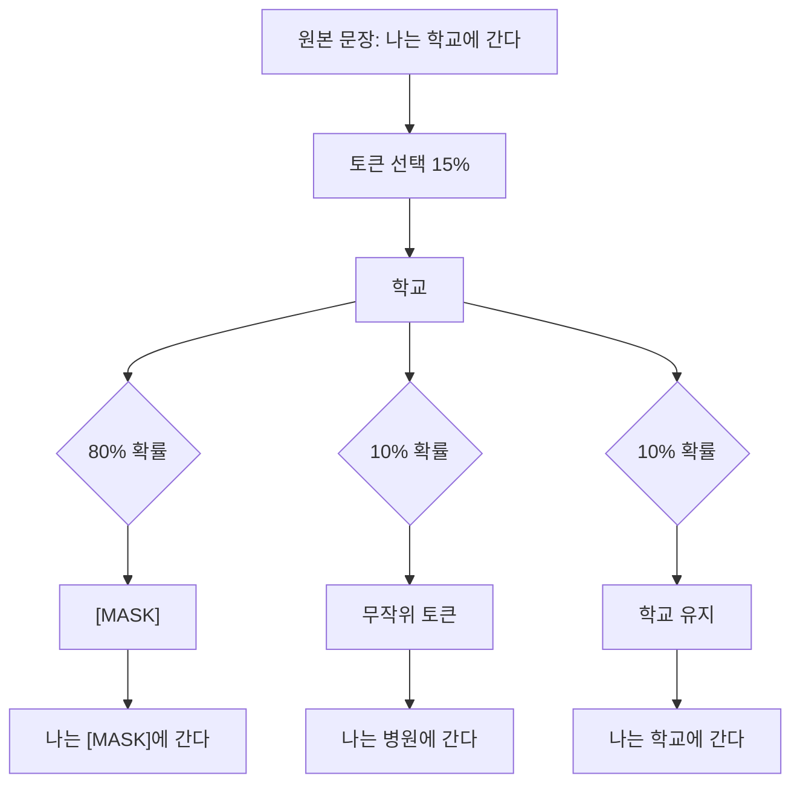
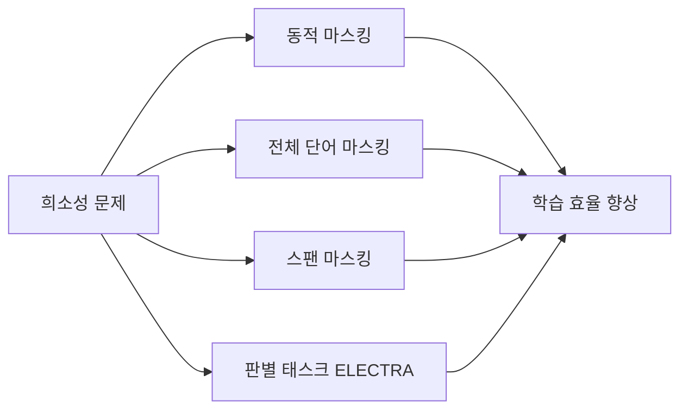
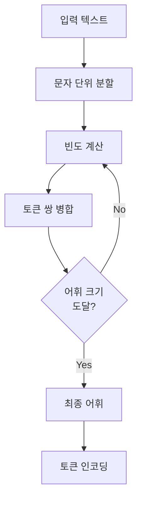
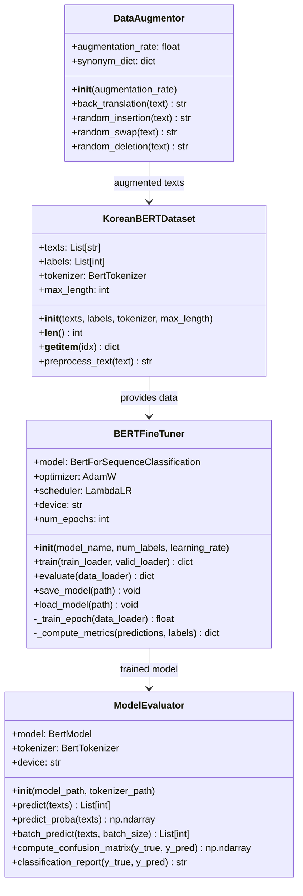
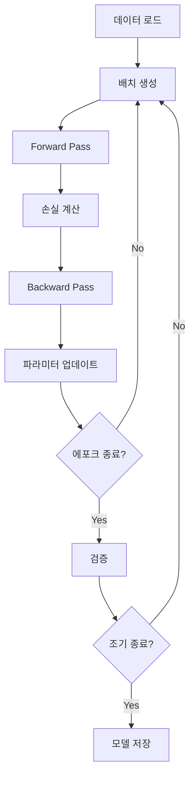
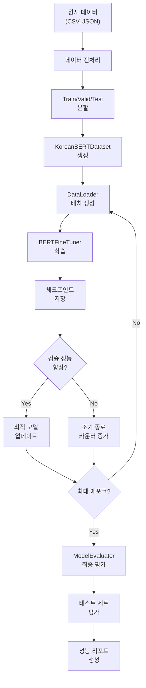
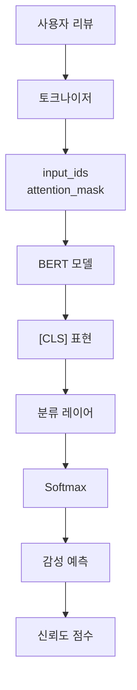
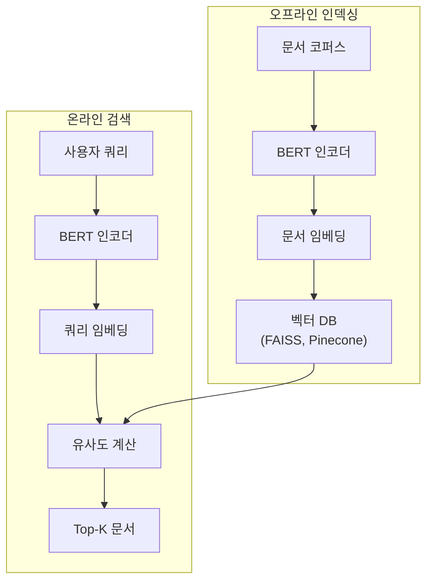
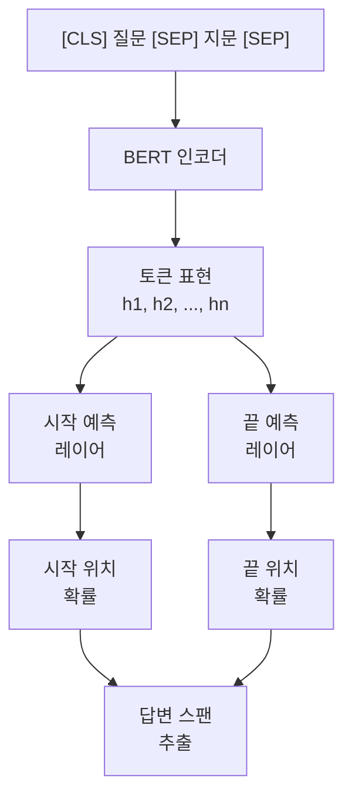

# BERT: Bidirectional Encoder Representations from Transformers

## 1. BERT 개요

### 1.1. BERT란 무엇인가

BERT(Bidirectional Encoder Representations from Transformers, 버트)는 2018년 구글에서 발표한 사전학습(pre-training) 언어 모델이다. 기존의 단방향 또는 얕은 양방향 모델과 달리, BERT는 깊은 양방향 컨텍스트(bidirectional context)를 학습하여 자연어 이해 태스크에서 혁신적인 성능을 달성했다.

BERT의 핵심 아이디어는 대규모 텍스트 코퍼스(corpus)에서 마스크드 랭귀지 모델링(Masked Language Modeling, MLM)과 다음 문장 예측(Next Sentence Prediction, NSP)을 통해 사전학습을 수행한 후, 특정 태스크에 파인튜닝(fine-tuning)하는 것이다.

### 1.2. 트랜스포머 인코더 아키텍처

BERT는 트랜스포머(Transformer)의 인코더(encoder) 부분만을 사용한다. 트랜스포머 아키텍처는 셀프 어텐션(self-attention) 메커니즘을 통해 입력 시퀀스의 모든 위치 간 관계를 병렬로 계산할 수 있다.


BERT-Base는 12개의 트랜스포머 레이어, 768차원의 히든 스테이트(hidden state), 12개의 어텐션 헤드를 가진다. BERT-Large는 24개 레이어, 1024차원, 16개 헤드로 구성된다.

**셀프 어텐션 메커니즘:**

$$
\text{Attention}(Q, K, V) = \text{softmax}\left(\frac{QK^T}{\sqrt{d_k}}\right)V
$$

여기서 $Q$, $K$, $V$는 각각 쿼리(query), 키(key), 밸류(value) 행렬이며, $d_k$는 키 벡터의 차원이다.

### 1.3. 양방향 컨텍스트 학습

전통적인 언어 모델은 왼쪽에서 오른쪽(left-to-right) 또는 오른쪽에서 왼쪽으로만 컨텍스트를 학습했다. 반면 BERT는 마스킹 기법을 통해 양쪽 방향의 컨텍스트를 동시에 학습한다.

**예시:**
- 입력: "나는 [MASK]에 갔다"
- BERT는 "나는"과 "갔다" 양쪽 컨텍스트를 모두 고려하여 [MASK]를 예측

이러한 양방향 학습은 문맥 의존적인 단어 표현을 생성하여, 동음이의어(polysemy) 문제를 효과적으로 해결한다.

---

## 2. BERT의 상용화 현황 (2025년 기준)

### 2.1. 주요 활용 사례

#### 2.1.1. 검색 엔진 (Google Search)

구글은 2019년부터 BERT를 검색 알고리즘에 통합하여 사용자 쿼리의 의도를 더 정확하게 이해한다. 특히 전치사나 접속사가 중요한 롱테일 쿼리(long-tail query)에서 성능이 크게 향상되었다.

**적용 예시:**
- 쿼리: "2019 brazil traveler to usa need a visa"
- BERT 이전: "brazil"과 "usa" 키워드 중심 검색
- BERT 이후: "to"의 방향성을 이해하여 브라질 여행자의 미국 비자 필요성 검색

#### 2.1.2. 고객 지원 챗봇

금융권, 통신사, 이커머스 기업들은 BERT 기반 인텐트 분류(intent classification)를 활용하여 고객 문의를 자동으로 분류하고 적절한 응답을 제공한다.

- **네이버 클로바**: 한국어 BERT 모델을 활용한 대화형 AI
- **카카오뱅크**: 고객 문의 자동 분류 및 라우팅
- **통신3사**: 요금제 상담, 장애 접수 자동화

#### 2.1.3. 문서 분석 플랫폼

법률, 의료, 금융 분야에서 BERT는 대량의 문서를 분석하고 중요 정보를 추출하는 데 활용된다.

- **LegalTech**: 계약서 리뷰, 판례 검색
- **MedTech**: 의료 기록 분석, 질병 코드 자동 분류
- **FinTech**: 재무제표 분석, 리스크 평가

### 2.2. 주소 정규화 및 매칭 시스템

#### 2.2.1. 배달 서비스에서의 주소 처리

배달의민족, 쿠팡이츠 등 배달 플랫폼은 BERT를 활용하여 다양한 형식의 주소 입력을 표준 주소로 변환한다.

**문제점:**
- 사용자 입력: "강남구 역삼동 테헤란로 어디쯤"
- 불완전하거나 구어체 주소 입력
- 약칭과 정식 명칭의 혼용

**BERT 활용:**
- 컨텍스트를 이해하여 모호한 주소 해석
- 유사 주소 후보군 생성 및 랭킹
- 오타 및 띄어쓰기 오류 보정

#### 2.2.2. 물류 기업의 주소 표준화

CJ대한통운, 한진택배 등 물류 기업은 BERT 기반 주소 매칭 시스템을 구축하여 배송 효율을 개선한다.


**핵심 기능:**
- 신주소/구주소 자동 매칭
- 건물명, 랜드마크 기반 주소 해석
- 도로명/지번 혼용 입력 처리

#### 2.2.3. 금융권 주소 검증

은행, 보험사는 고객 주소의 실존 여부와 정확성을 검증하는 데 BERT를 활용한다.

**적용 사례:**
- 대출 신청 시 주소 실존 검증
- 보험 계약 시 위험 지역 판단
- 우편물 반송률 감소

---

## 3. 사전학습 메커니즘

### 3.1. Masked Language Model (MLM)

#### 3.1.1. 마스킹 전략

MLM은 입력 시퀀스의 일부 토큰을 무작위로 마스킹하고, 모델이 컨텍스트를 기반으로 원래 토큰을 예측하도록 학습한다.

**마스킹 규칙:**
1. 전체 토큰의 15%를 선택
2. 선택된 토큰 중:
   - 80%: [MASK] 토큰으로 교체
   - 10%: 무작위 토큰으로 교체
   - 10%: 원본 토큰 유지



**목적 함수:**

$$
\mathcal{L}_{\text{MLM}} = -\mathbb{E}_{\mathbf{x}} \left[ \sum_{i \in \mathcal{M}} \log P(x_i | \mathbf{x}_{\backslash \mathcal{M}}) \right]
$$

여기서 $\mathcal{M}$은 마스킹된 토큰의 인덱스 집합이고, $\mathbf{x}_{\backslash \mathcal{M}}$는 마스킹되지 않은 토큰들이다.

#### 3.1.2. 마스킹 희소성 문제

**문제 정의:**

마스킹 희소성(masking sparsity) 문제는 전체 토큰 중 15%만 마스킹되므로, 각 토큰이 학습에 기여하는 빈도가 낮다는 것을 의미한다.

**구체적 문제점:**

1. **학습 비효율성**: 85%의 토큰은 손실 함수(loss function) 계산에 직접 기여하지 않음
2. **수렴 속도**: 모든 토큰을 충분히 학습하려면 더 많은 에포크(epoch) 필요
3. **불균형 학습**: 자주 등장하는 토큰은 충분히 학습되지만, 희귀 토큰은 학습 기회가 부족

**수치적 예시:**

10,000개 토큰으로 구성된 코퍼스에서:
- 마스킹되는 토큰: $10,000 \times 0.15 = 1,500$개
- 학습에 직접 사용: 1,500개
- 미사용: 8,500개

#### 3.1.3. 희소성 문제의 영향과 해결방안

**영향:**

$$
\text{학습 효율} = \frac{\text{마스킹된 토큰 수}}{\text{전체 토큰 수}} = \frac{0.15N}{N} = 0.15
$$

실제로는 약 85%의 계산 자원이 예측 태스크에 직접 기여하지 않는다.

**해결 방안:**

1. **동적 마스킹(Dynamic Masking)**: RoBERTa에서 제안된 방법으로, 에포크마다 다른 토큰을 마스킹
   
2. **전체 단어 마스킹(Whole Word Masking)**: WordPiece로 분할된 서브워드를 개별적으로 마스킹하지 않고 전체 단어를 마스킹
   - 기존: "playing" → ["play", "##ing"] 중 하나만 마스킹
   - 개선: "playing" → ["[MASK]", "[MASK]"] 전체 마스킹

3. **증가된 마스킹 비율**: ELECTRA는 15% 대신 모든 토큰에 대해 교체 여부를 판별하는 태스크 사용

4. **스팬 마스킹(Span Masking)**: SpanBERT는 연속된 토큰 시퀀스를 마스킹하여 더 복잡한 패턴 학습



### 3.2. Next Sentence Prediction (NSP)

NSP는 두 문장 간의 관계를 이해하기 위한 이진 분류(binary classification) 태스크다.

**입력 형식:**
```
[CLS] 문장 A [SEP] 문장 B [SEP]
```

**레이블:**
- IsNext (50%): B가 A의 실제 다음 문장
- NotNext (50%): B가 A와 무관한 무작위 문장

**목적 함수:**

$$
\mathcal{L}_{\text{NSP}} = -\mathbb{E} \left[ y \log P(\text{IsNext}) + (1-y) \log P(\text{NotNext}) \right]
$$

**한계점:**

RoBERTa 연구에서 NSP의 효과가 미미하거나 부정적일 수 있음이 밝혀졌다. 대신 문장 순서 예측(Sentence Order Prediction, SOP)이나 NSP 제거가 더 효과적일 수 있다.

---

## 4. WordPiece 토크나이제이션

### 4.1. WordPiece 알고리즘 원리

WordPiece는 서브워드(subword) 토크나이제이션 알고리즘으로, 단어를 더 작은 의미 단위로 분해한다.

**동작 원리:**

1. **초기화**: 모든 개별 문자를 어휘(vocabulary)에 추가
2. **반복 병합**: 가장 빈번한 인접 토큰 쌍을 병합하여 새로운 토큰 생성
3. **종료**: 목표 어휘 크기에 도달할 때까지 반복



**예시:**

```
원본: "playing"
토크나이제이션: ["play", "##ing"]
```

`##`는 서브워드의 시작이 아님을 나타내는 접두사다.

**장점:**
- 미등록 단어(OOV, Out-of-Vocabulary) 문제 해결
- 어휘 크기 제어로 메모리 효율성
- 형태소적 의미 보존

### 4.2. 특수 토큰 체계

BERT는 5가지 특수 토큰을 사용하여 입력 시퀀스를 구조화한다.

#### 4.2.1. [CLS]: 분류 토큰

**역할:**
- 모든 입력 시퀀스의 시작 부분에 위치
- 전체 시퀀스의 표현을 집약(aggregate)
- 분류 태스크에서 이 토큰의 최종 히든 스테이트를 사용

**수식:**

$$
\mathbf{h}_{\text{[CLS]}} = \text{BERT}(\text{input})_0
$$

분류 확률:

$$
P(c) = \text{softmax}(\mathbf{W} \mathbf{h}_{\text{[CLS]}} + \mathbf{b})
$$

#### 4.2.2. [SEP]: 구분 토큰

**역할:**
- 문장 경계를 표시
- 단일 문장 입력: `[CLS] 문장 [SEP]`
- 문장 쌍 입력: `[CLS] 문장1 [SEP] 문장2 [SEP]`

**세그먼트 임베딩(Segment Embedding):**

[SEP] 토큰과 함께 세그먼트 임베딩을 사용하여 문장을 구분:

$$
\mathbf{e}_{\text{input}} = \mathbf{e}_{\text{token}} + \mathbf{e}_{\text{position}} + \mathbf{e}_{\text{segment}}
$$

#### 4.2.3. [MASK]: 마스크 토큰

**역할:**
- MLM 사전학습 시 마스킹된 위치를 표시
- 파인튜닝 시에는 사용하지 않음

**사전학습과 파인튜닝 불일치:**

사전학습 시 [MASK]를 보지만, 파인튜닝 시에는 보지 못하는 불일치가 발생한다. 이를 완화하기 위해 15% 중 80%만 [MASK]로 교체한다.

#### 4.2.4. [PAD]: 패딩 토큰

**역할:**
- 배치(batch) 내 시퀀스 길이를 동일하게 맞춤
- 어텐션 계산 시 [PAD] 토큰은 마스킹되어 무시됨

**어텐션 마스크:**

$$
\text{AttentionMask}[i] = \begin{cases}
1 & \text{if token}[i] \neq \text{[PAD]} \\
0 & \text{if token}[i] = \text{[PAD]}
\end{cases}
$$

#### 4.2.5. [UNK]: 미등록 토큰

**역할:**
- 어휘에 없는 토큰을 대체
- WordPiece 덕분에 실제로 드물게 발생

**발생 사례:**
- 특수 문자나 이모지
- 매우 희귀한 전문 용어
- 잘못된 인코딩

### 4.3. 토크나이저 실전 예제

**단일 문장 토크나이제이션:**

```python
from transformers import BertTokenizer

tokenizer = BertTokenizer.from_pretrained('bert-base-multilingual-cased')

text = "BERT는 자연어 처리에 혁명을 가져왔다."

# 토큰화
tokens = tokenizer.tokenize(text)
# ['B', '##ER', '##T', '##는', '자연', '##어', '처리', '##에', '혁명', '##을', '가져', '##왔', '##다', '.']

# ID 변환
input_ids = tokenizer.encode(text, add_special_tokens=True)
# [101, 2356, 17953, 2102, 9428, ... , 102]
# 101: [CLS], 102: [SEP]

# 디코딩
decoded = tokenizer.decode(input_ids)
# "[CLS] BERT는 자연어 처리에 혁명을 가져왔다. [SEP]"
```

**문장 쌍 토크나이제이션:**

```python
sentence_a = "BERT는 양방향 인코더다."
sentence_b = "트랜스포머 아키텍처를 사용한다."

encoding = tokenizer(
    sentence_a,
    sentence_b,
    add_special_tokens=True,
    max_length=128,
    padding='max_length',
    truncation=True,
    return_tensors='pt'
)

# encoding['input_ids']: [CLS] A [SEP] B [SEP] [PAD] ...
# encoding['token_type_ids']: [0, 0, ..., 0, 1, 1, ..., 1, 0, ...]
# encoding['attention_mask']: [1, 1, ..., 1, 0, 0, ...]
```

**특수 토큰 처리:**

```python
# 특수 토큰 ID 확인
print(tokenizer.cls_token_id)  # 101
print(tokenizer.sep_token_id)  # 102
print(tokenizer.pad_token_id)  # 0
print(tokenizer.mask_token_id) # 103
print(tokenizer.unk_token_id)  # 100

# 커스텀 토큰 추가
tokenizer.add_tokens(['[CUSTOM]'])
tokenizer.add_special_tokens({'additional_special_tokens': ['[SPECIAL]']})
```

---

## 5. 한글 BERT 파인튜닝

### 5.1. 한국어 처리 고려사항

한국어는 교착어(agglutinative language)로서 다음과 같은 특성을 가진다:

**언어학적 특성:**
1. **조사와 어미 결합**: "학교에서는" → "학교" + "에서" + "는"
2. **띄어쓰기 모호성**: "아버지가방에들어가신다"
3. **존댓말/반말 체계**: 동일한 의미, 다른 형태
4. **한자어/외래어 혼용**: "컴퓨터", "電腦", "computer"

**토크나이저 선택:**
- **Multilingual BERT**: 104개 언어 지원, 범용적
- **KoBERT(SKT)**: 한국어 위키피디아 + 뉴스 학습
- **KorBERT(ETRI)**: 형태소 분석 기반 토크나이제이션
- **KoELECTRA**: ELECTRA 아키텍처, 높은 효율성

### 5.2. 파인튜닝 클래스 설계



#### 5.2.1. KoreanBERTDataset 클래스

**책임(Responsibility):**
- 텍스트 데이터와 레이블을 토크나이징
- PyTorch Dataset 인터페이스 구현
- 전처리 및 데이터 증강(augmentation)

**주요 메서드:**
- `__init__`: 데이터, 토크나이저, 최대 길이 초기화
- `__len__`: 데이터셋 크기 반환
- `__getitem__`: 배치 샘플링을 위한 인덱싱
- `preprocess_text`: 한국어 특화 전처리 (띄어쓰기 정규화, 특수문자 처리)

**입출력 형식:**
```python
# 입력
texts = ["한글 BERT 파인튜닝", "자연어 처리 학습"]
labels = [0, 1]

# 출력 (딕셔너리)
{
    'input_ids': tensor([101, 9821, ..., 102]),
    'attention_mask': tensor([1, 1, ..., 0]),
    'token_type_ids': tensor([0, 0, ..., 0]),
    'labels': tensor(0)
}
```

#### 5.2.2. BERTFineTuner 클래스

**책임:**
- 모델 학습 루프 관리
- 옵티마이저(optimizer) 및 스케줄러(scheduler) 설정
- 검증(validation) 및 조기 종료(early stopping)
- 체크포인트(checkpoint) 저장

**핵심 구성요소:**

1. **옵티마이저**: AdamW (weight decay 포함)
   $$
   \theta_{t+1} = \theta_t - \eta \left( \frac{m_t}{\sqrt{v_t} + \epsilon} + \lambda \theta_t \right)
   $$

2. **학습률 스케줄러**: 선형 웜업(linear warmup) + 감쇠(decay)
   $$
   \text{lr}(t) = \begin{cases}
   \text{lr}_{\text{max}} \cdot \frac{t}{t_{\text{warmup}}} & t < t_{\text{warmup}} \\
   \text{lr}_{\text{max}} \cdot \frac{T - t}{T - t_{\text{warmup}}} & t \geq t_{\text{warmup}}
   \end{cases}
   $$

3. **손실 함수**: Cross-Entropy Loss
   $$
   \mathcal{L} = -\frac{1}{N} \sum_{i=1}^{N} \sum_{c=1}^{C} y_{i,c} \log(\hat{y}_{i,c})
   $$

**학습 파이프라인:**



#### 5.2.3. ModelEvaluator 클래스

**책임:**
- 학습된 모델로 추론(inference) 수행
- 배치 예측으로 대용량 데이터 처리
- 성능 메트릭(metric) 계산
- 혼동 행렬(confusion matrix) 생성

**주요 메서드:**
- `predict`: 단일/다중 텍스트 예측
- `predict_proba`: 클래스별 확률 반환
- `batch_predict`: 메모리 효율적 배치 처리
- `compute_confusion_matrix`: 분류 성능 시각화
- `classification_report`: precision, recall, F1-score 계산

**평가 메트릭:**

$
\text{Accuracy} = \frac{TP + TN}{TP + TN + FP + FN}
$

$
\text{Precision} = \frac{TP}{TP + FP}
$

$
\text{Recall} = \frac{TP}{TP + FN}
$

$
\text{F1-Score} = 2 \cdot \frac{\text{Precision} \cdot \text{Recall}}{\text{Precision} + \text{Recall}}
$

### 5.3. 학습 파이프라인 구조



**권장 하이퍼파라미터:**

| 파라미터 | 값 | 설명 |
|---------|-----|------|
| learning_rate | 2e-5 ~ 5e-5 | BERT 파인튜닝 권장값 |
| batch_size | 16 ~ 32 | GPU 메모리에 따라 조정 |
| num_epochs | 3 ~ 5 | 과적합 방지 |
| max_length | 128 ~ 512 | 태스크에 따라 선택 |
| warmup_steps | 전체의 10% | 안정적 학습 |
| weight_decay | 0.01 | 정규화 |

---

## 6. 다운스트림 태스크

### 6.1. 텍스트 분류

#### 6.1.1. 문서 분류 구조

텍스트 분류는 BERT의 [CLS] 토큰 표현을 사용하여 카테고리를 예측한다.


**아키텍처:**

$
\mathbf{h}_{\text{CLS}} = \text{BERT}(\text{input})_0
$

$
\mathbf{logits} = \mathbf{W} \mathbf{h}_{\text{CLS}} + \mathbf{b}
$

$
P(y = c | \text{input}) = \frac{\exp(\text{logits}_c)}{\sum_{k=1}^{C} \exp(\text{logits}_k)}
$

**구현 예시 (클래스 정의):**

```python
class BERTClassifier:
    """
    BERT 기반 텍스트 분류기
    
    Attributes:
        bert_model: 사전학습된 BERT 모델
        classifier: 분류 헤드 (Linear layer)
        dropout: 드롭아웃 레이어
    """
    
    def __init__(self, num_labels, dropout_rate=0.1):
        self.bert = BertModel.from_pretrained('bert-base-multilingual-cased')
        self.dropout = nn.Dropout(dropout_rate)
        self.classifier = nn.Linear(768, num_labels)
    
    def forward(self, input_ids, attention_mask, token_type_ids):
        # BERT 출력
        outputs = self.bert(
            input_ids=input_ids,
            attention_mask=attention_mask,
            token_type_ids=token_type_ids
        )
        
        # [CLS] 토큰 표현 추출
        pooled_output = outputs.pooler_output
        
        # 드롭아웃 적용
        pooled_output = self.dropout(pooled_output)
        
        # 분류
        logits = self.classifier(pooled_output)
        
        return logits
```

#### 6.1.2. 감성 분석 예제

**태스크 정의:**

입력 텍스트의 감성을 긍정(Positive), 부정(Negative), 중립(Neutral)로 분류

**데이터 형식:**

| 텍스트 | 레이블 |
|--------|--------|
| "이 영화 정말 재미있어요!" | 긍정 (0) |
| "시간 낭비했네요." | 부정 (1) |
| "그냥 그래요." | 중립 (2) |

**추론 프로세스:**



### 6.2. 시맨틱 검색

#### 6.2.1. 임베딩 기반 검색

시맨틱 검색(semantic search)은 키워드 매칭이 아닌 의미 유사도를 기반으로 관련 문서를 찾는다.

**프로세스:**

1. **문서 인덱싱**: 모든 문서를 BERT로 임베딩하여 벡터 DB에 저장
2. **쿼리 인코딩**: 사용자 쿼리를 동일한 방법으로 임베딩
3. **유사도 계산**: 쿼리 벡터와 문서 벡터 간 유사도 측정
4. **랭킹**: 유사도 높은 순으로 정렬하여 반환



**문장 임베딩 추출:**

BERT는 토큰 레벨 출력을 제공하므로, 문장 임베딩을 얻기 위한 전략이 필요하다:

1. **[CLS] 토큰 사용**:
   $
   \mathbf{e}_{\text{sentence}} = \mathbf{h}_{\text{[CLS]}}
   $

2. **평균 풀링(Mean Pooling)**:
   $
   \mathbf{e}_{\text{sentence}} = \frac{1}{N} \sum_{i=1}^{N} \mathbf{h}_i
   $

3. **최대 풀링(Max Pooling)**:
   $
   \mathbf{e}_{\text{sentence}} = \max_{i=1}^{N} \mathbf{h}_i
   $

#### 6.2.2. 유사도 계산 방법

**코사인 유사도(Cosine Similarity):**

$
\text{sim}(\mathbf{q}, \mathbf{d}) = \frac{\mathbf{q} \cdot \mathbf{d}}{|\mathbf{q}| \cdot |\mathbf{d}|} = \frac{\sum_{i=1}^{n} q_i d_i}{\sqrt{\sum_{i=1}^{n} q_i^2} \cdot \sqrt{\sum_{i=1}^{n} d_i^2}}
$

**유클리드 거리(Euclidean Distance):**

$
\text{dist}(\mathbf{q}, \mathbf{d}) = \sqrt{\sum_{i=1}^{n} (q_i - d_i)^2}
$

**내적(Dot Product):**

$
\text{score}(\mathbf{q}, \mathbf{d}) = \mathbf{q} \cdot \mathbf{d} = \sum_{i=1}^{n} q_i d_i
$

**검색 효율성:**

대규모 문서 검색을 위해 근사 최근접 이웃(Approximate Nearest Neighbor, ANN) 알고리즘 사용:
- **FAISS**: Facebook의 벡터 검색 라이브러리
- **HNSW**: 계층적 그래프 기반 검색
- **ScaNN**: Google의 확장 가능한 검색

### 6.3. 정보 추출

#### 6.3.1. 개체명 인식 (NER)

NER(Named Entity Recognition)은 텍스트에서 인명(PER), 지명(LOC), 기관명(ORG), 날짜(DATE) 등을 식별한다.

**토큰 분류 아키텍처:**


각 토큰에 대해 독립적으로 분류를 수행:

$
P(y_i = \text{tag} | \text{input}) = \text{softmax}(\mathbf{W} \mathbf{h}_i + \mathbf{b})
$

**BIO 태깅 스키마:**

| 토큰 | 레이블 | 의미 |
|------|--------|------|
| 삼성 | B-ORG | 기관명 시작 |
| 전자 | I-ORG | 기관명 내부 |
| 는 | O | 엔티티 아님 |
| 서울 | B-LOC | 지명 시작 |
| 에 | O | 엔티티 아님 |
| 있다 | O | 엔티티 아님 |

**CRF 레이어 추가:**

순수 BERT보다 CRF(Conditional Random Field)를 추가하면 레이블 간 전이 확률(transition probability)을 학습하여 성능이 향상된다:

$
P(\mathbf{y} | \mathbf{x}) = \frac{\exp(\text{score}(\mathbf{x}, \mathbf{y}))}{\sum_{\mathbf{y}'} \exp(\text{score}(\mathbf{x}, \mathbf{y}'))}
$

$
\text{score}(\mathbf{x}, \mathbf{y}) = \sum_{i=1}^{n} \left( \mathbf{W}_{y_i} \mathbf{h}_i + T_{y_{i-1}, y_i} \right)
$

여기서 $T$는 전이 행렬(transition matrix)이다.

#### 6.3.2. 질의응답 (QA)

**태스크 정의:**

주어진 지문(context)에서 질문(question)에 대한 답변의 시작과 끝 위치를 예측

**입력 형식:**

```
[CLS] 질문 [SEP] 지문 [SEP]
```

**출력:**

- 시작 위치 확률: $P_{\text{start}}(i)$
- 끝 위치 확률: $P_{\text{end}}(i)$



**수식:**

시작 위치 로짓(logit):

$
\text{logits}_{\text{start}} = \mathbf{W}_{\text{start}} \mathbf{h}_i
$

끝 위치 로짓:

$
\text{logits}_{\text{end}} = \mathbf{W}_{\text{end}} \mathbf{h}_i
$

최종 답변 스팬(span) 점수:

$
\text{score}(i, j) = \text{logits}_{\text{start}}[i] + \text{logits}_{\text{end}}[j]
$

최적 답변:

$
(i^*, j^*) = \arg\max_{i \leq j} \text{score}(i, j)
$

**예제:**

- **질문**: "BERT는 누가 만들었나요?"
- **지문**: "BERT는 2018년 구글에서 개발한 사전학습 모델이다."
- **답변**: "구글" (토큰 인덱스 6-6)

---

## 7. 부록

### 7.1. BERT 변형 모델

#### 7.1.1. RoBERTa

**RoBERTa**(Robustly Optimized BERT Approach, 로버타)는 BERT의 학습 전략을 개선한 모델이다.

**주요 개선점:**

1. **동적 마스킹**: 에포크마다 다른 마스킹 패턴 적용
2. **NSP 제거**: NSP 태스크가 불필요함을 발견
3. **더 큰 배치**: 배치 크기를 8K로 증가
4. **더 긴 학습**: 학습 스텝 수 대폭 증가
5. **바이트 레벨 BPE**: WordPiece 대신 BPE 사용

**성능:**

대부분의 벤치마크에서 BERT를 능가하며, 특히 GLUE, SQuAD에서 SOTA 달성

#### 7.1.2. ALBERT

**ALBERT**(A Lite BERT, 알버트)는 파라미터 효율성을 개선한 경량 모델이다.

**핵심 기법:**

1. **인수분해 임베딩 파라미터(Factorized Embedding Parameterization)**:
   
   $
   V \times H \rightarrow V \times E + E \times H
   $
   
   어휘 크기 $V$와 히든 크기 $H$를 직접 연결하지 않고 저차원 $E$를 거침

2. **레이어 간 파라미터 공유(Cross-layer Parameter Sharing)**:
   
   모든 트랜스포머 레이어가 동일한 파라미터 사용

3. **SOP (Sentence Order Prediction)**:
   
   NSP 대신 문장 순서가 올바른지 예측

**결과:**

BERT-Large보다 18배 적은 파라미터로 유사한 성능

#### 7.1.3. DistilBERT

**DistilBERT**(디스틸버트)는 지식 증류(knowledge distillation)를 통해 BERT를 압축한 모델이다.

**증류 프로세스:**

학생 모델(student)이 교사 모델(teacher, BERT)의 출력을 모방하도록 학습:

$
\mathcal{L}_{\text{distil}} = \alpha \mathcal{L}_{\text{CE}} + (1-\alpha) \mathcal{L}_{\text{KD}}
$

여기서:
- $\mathcal{L}_{\text{CE}}$: 정답 레이블에 대한 Cross-Entropy
- $\mathcal{L}_{\text{KD}}$: 교사의 소프트 타겟(soft target)에 대한 KL Divergence

$
\mathcal{L}_{\text{KD}} = \text{KL}\left( \frac{\exp(z_t / T)}{\sum \exp(z_t / T)} \bigg\| \frac{\exp(z_s / T)}{\sum \exp(z_s / T)} \right)
$

$T$는 온도(temperature) 하이퍼파라미터

**효율성:**

- 파라미터: 40% 감소
- 속도: 60% 향상
- 성능: 97% 유지

### 7.2. 하이퍼파라미터 권장값

**일반적 권장값:**

| 하이퍼파라미터 | 소형 데이터셋 | 대형 데이터셋 |
|---------------|--------------|--------------|
| Learning Rate | 5e-5 | 3e-5 |
| Batch Size | 16 | 32-64 |
| Epochs | 3-4 | 2-3 |
| Warmup Ratio | 0.1 | 0.06 |
| Weight Decay | 0.01 | 0.01 |
| Max Gradient Norm | 1.0 | 1.0 |
| Dropout Rate | 0.1 | 0.1 |

**태스크별 권장값:**

- **텍스트 분류**: lr=2e-5, batch=16, epoch=3
- **NER**: lr=5e-5, batch=32, epoch=4
- **QA**: lr=3e-5, batch=12, epoch=2
- **시맨틱 유사도**: lr=2e-5, batch=16, epoch=3

**학습률 스케줄러:**

```python
# 선형 스케줄러 (권장)
scheduler = get_linear_schedule_with_warmup(
    optimizer,
    num_warmup_steps=total_steps * 0.1,
    num_training_steps=total_steps
)

# 코사인 스케줄러 (대안)
scheduler = get_cosine_schedule_with_warmup(
    optimizer,
    num_warmup_steps=total_steps * 0.1,
    num_training_steps=total_steps
)
```

### 7.3. 실무 최적화 팁

**1. 혼합 정밀도 학습(Mixed Precision Training):**

FP16 연산을 사용하여 메모리와 속도 향상:

```python
from torch.cuda.amp import autocast, GradScaler

scaler = GradScaler()

with autocast():
    outputs = model(input_ids, attention_mask)
    loss = criterion(outputs, labels)

scaler.scale(loss).backward()
scaler.step(optimizer)
scaler.update()
```

**2. 그래디언트 누적(Gradient Accumulation):**

작은 GPU에서 큰 유효 배치 크기 구현:

```python
accumulation_steps = 4

for i, batch in enumerate(dataloader):
    loss = model(batch) / accumulation_steps
    loss.backward()
    
    if (i + 1) % accumulation_steps == 0:
        optimizer.step()
        optimizer.zero_grad()
```

**3. 동적 패딩(Dynamic Padding):**

배치 내 최대 길이에만 맞춰 패딩:

```python
from torch.nn.utils.rnn import pad_sequence

def collate_fn(batch):
    input_ids = [item['input_ids'] for item in batch]
    input_ids = pad_sequence(input_ids, batch_first=True, padding_value=0)
    return input_ids
```

**4. 레이어 동결(Layer Freezing):**

하위 레이어를 동결하여 학습 속도 향상:

```python
# 처음 6개 레이어 동결
for param in model.bert.encoder.layer[:6].parameters():
    param.requires_grad = False
```

**5. 앙상블(Ensemble):**

여러 모델의 예측을 결합하여 성능 향상:

```python
predictions = []
for model in models:
    pred = model.predict(input_data)
    predictions.append(pred)

# 소프트 보팅
final_pred = np.mean(predictions, axis=0)
```

---

## 8. 용어 목록

| 용어 | 영문 | 설명 |
|------|------|------|
| 어텐션 메커니즘 | Attention Mechanism | 입력 시퀀스의 중요한 부분에 가중치를 부여하는 기법 |
| 양방향 | Bidirectional | 좌우 양쪽 컨텍스트를 동시에 고려하는 방식 |
| 임베딩 | Embedding | 토큰을 고차원 벡터 공간에 매핑한 표현 |
| 인코더 | Encoder | 입력을 압축된 표현으로 변환하는 신경망 |
| 토큰 | Token | 텍스트를 구성하는 최소 단위 |
| 토크나이제이션 | Tokenization | 텍스트를 토큰으로 분할하는 과정 |
| 트랜스포머 | Transformer | 어텐션 메커니즘 기반 신경망 아키텍처 |
| 파인튜닝 | Fine-tuning | 사전학습된 모델을 특정 태스크에 맞게 추가 학습 |
| 마스킹 | Masking | 입력의 일부를 가려 모델이 예측하도록 하는 기법 |
| 서브워드 | Subword | 단어보다 작은 의미 단위 |
| 히든 스테이트 | Hidden State | 신경망 내부의 중간 표현 |
| 셀프 어텐션 | Self-Attention | 입력 시퀀스 내 요소들 간의 관계를 계산하는 어텐션 |
| 사전학습 | Pre-training | 대규모 데이터로 범용적 표현을 먼저 학습 |
| 다운스트림 태스크 | Downstream Task | 사전학습 후 수행하는 실제 응용 태스크 |
| 코퍼스 | Corpus | 학습에 사용되는 대규모 텍스트 모음 |
| 컨텍스트 | Context | 특정 단어나 문장을 둘러싼 주변 정보 |
| 세그먼트 임베딩 | Segment Embedding | 문장 구분을 위한 추가 임베딩 |
| 포지셔널 인코딩 | Positional Encoding | 토큰의 위치 정보를 인코딩 |
| 멀티헤드 어텐션 | Multi-head Attention | 여러 어텐션 헤드를 병렬로 사용 |
| 피드포워드 네트워크 | Feed-forward Network | 각 위치에 독립적으로 적용되는 완전 연결 레이어 |
| 레이어 정규화 | Layer Normalization | 레이어 출력을 정규화하여 학습 안정화 |
| 드롭아웃 | Dropout | 과적합 방지를 위한 정규화 기법 |
| 잔차 연결 | Residual Connection | 입력을 출력에 더하여 그래디언트 흐름 개선 |
| 옵티마이저 | Optimizer | 모델 파라미터를 업데이트하는 알고리즘 |
| 학습률 | Learning Rate | 파라미터 업데이트 크기를 조절하는 하이퍼파라미터 |
| 배치 크기 | Batch Size | 한 번에 처리하는 샘플 수 |
| 에포크 | Epoch | 전체 학습 데이터를 한 번 순회하는 단위 |
| 손실 함수 | Loss Function | 모델 예측과 정답의 차이를 측정 |
| 그래디언트 | Gradient | 손실 함수의 파라미터에 대한 미분값 |
| 역전파 | Backpropagation | 그래디언트를 계산하여 파라미터를 업데이트 |
| 과적합 | Overfitting | 학습 데이터에만 지나치게 최적화되는 현상 |
| 조기 종료 | Early Stopping | 검증 성능이 향상되지 않으면 학습 중단 |
| 체크포인트 | Checkpoint | 학습 중간 상태를 저장한 파일 |
| 추론 | Inference | 학습된 모델로 예측을 수행 |
| 임베딩 차원 | Embedding Dimension | 임베딩 벡터의 크기 |
| 어휘 크기 | Vocabulary Size | 모델이 인식하는 고유 토큰 수 |
| 시퀀스 길이 | Sequence Length | 입력 토큰의 개수 |
| 패딩 | Padding | 시퀀스 길이를 맞추기 위한 더미 토큰 추가 |
| 트렁케이션 | Truncation | 최대 길이를 초과하는 시퀀스 자르기 |
| 소프트맥스 | Softmax | 로짓을 확률 분포로 변환하는 함수 |
| 로짓 | Logit | 활성화 함수 적용 전 선형 레이어 출력 |
| 크로스 엔트로피 | Cross-Entropy | 분류 문제의 손실 함수 |
| 코사인 유사도 | Cosine Similarity | 벡터 간 각도 기반 유사도 |
| 유클리드 거리 | Euclidean Distance | 벡터 간 직선 거리 |
| 근사 최근접 이웃 | Approximate Nearest Neighbor | 효율적 유사 벡터 검색 알고리즘 |
| 개체명 인식 | Named Entity Recognition | 텍스트에서 고유 명사 식별 |
| 질의응답 | Question Answering | 질문에 대한 답변 추출 |
| 감성 분석 | Sentiment Analysis | 텍스트의 긍정/부정 판단 |
| 문서 분류 | Document Classification | 문서를 카테고리로 분류 |
| 시맨틱 검색 | Semantic Search | 의미 기반 문서 검색 |
| 지식 증류 | Knowledge Distillation | 큰 모델의 지식을 작은 모델로 전달 |
| 앙상블 | Ensemble | 여러 모델의 예측을 결합 |
| 혼합 정밀도 | Mixed Precision | FP16과 FP32를 혼용한 학습 |
| 그래디언트 누적 | Gradient Accumulation | 여러 배치의 그래디언트를 누적 |
| 동적 패딩 | Dynamic Padding | 배치별 최대 길이에 맞춰 패딩 |
| 레이어 동결 | Layer Freezing | 특정 레이어의 파라미터를 고정 |
| 웜업 | Warmup | 학습 초기에 학습률을 점진적으로 증가 |
| 가중치 감쇠 | Weight Decay | 파라미터 크기에 페널티를 부과하는 정규화 |
| 그래디언트 클리핑 | Gradient Clipping | 그래디언트 폭발 방지를 위한 상한 설정 |
| 베이스라인 | Baseline | 비교 대상이 되는 기본 모델 |
| 벤치마크 | Benchmark | 모델 성능을 평가하는 표준 데이터셋 |
| 스팬 | Span | 연속된 토큰 시퀀스 |
| 전이 학습 | Transfer Learning | 한 태스크에서 학습한 지식을 다른 태스크에 적용 |
| 멀티태스크 학습 | Multi-task Learning | 여러 태스크를 동시에 학습 |
| 제로샷 학습 | Zero-shot Learning | 학습 데이터 없이 새로운 태스크 수행 |
| 퓨샷 학습 | Few-shot Learning | 적은 학습 데이터로 새로운 태스크 수행 |
| 프롬프트 | Prompt | 모델에 입력하는 지시문이나 템플릿 |
| 어텐션 마스크 | Attention Mask | 패딩 토큰을 무시하기 위한 마스크 |
| 토큰 타입 ID | Token Type IDs | 문장 구분을 위한 세그먼트 식별자 |
| 풀링 | Pooling | 다수의 값을 하나로 집계하는 연산 |
| 활성화 함수 | Activation Function | 비선형성을 도입하는 함수 |
| GELU | Gaussian Error Linear Unit | 트랜스포머에서 사용되는 활성화 함수 |
| BPE | Byte-Pair Encoding | 서브워드 토크나이제이션 알고리즘 |
| CRF | Conditional Random Field | 시퀀스 레이블링을 위한 확률 모델 |
| 혼동 행렬 | Confusion Matrix | 분류 결과를 시각화한 행렬 |
| 정밀도 | Precision | 양성으로 예측한 것 중 실제 양성 비율 |
| 재현율 | Recall | 실제 양성 중 양성으로 예측한 비율 |
| F1 점수 | F1 Score | 정밀도와 재현율의 조화평균 |
| 정확도 | Accuracy | 전체 중 정확히 예측한 비율 |
| AUC | Area Under the Curve | ROC 곡선 아래 면적 |
| 교착어 | Agglutinative Language | 접사가 결합되어 단어를 형성하는 언어 |
| 형태소 | Morpheme | 의미를 가진 최소 언어 단위 |
| 조사 | Postposition | 한국어의 격조사, 보조사 등 |
| 어미 | Ending | 용언의 어간 뒤에 붙는 요소 |
| 데이터 증강 | Data Augmentation | 학습 데이터를 인위적으로 확장 |
| 역번역 | Back Translation | 다른 언어로 번역 후 재번역하여 증강 |
| 랜덤 삽입 | Random Insertion | 무작위 단어를 삽입하여 증강 |
| 랜덤 교체 | Random Swap | 단어 순서를 무작위로 교체 |
| 랜덤 삭제 | Random Deletion | 무작위 단어를 삭제하여 증강 |
| 벡터 데이터베이스 | Vector Database | 임베딩 벡터를 저장하고 검색하는 DB |
| 시맨틱 유사도 | Semantic Similarity | 의미적 유사성 |
| 인텐트 분류 | Intent Classification | 사용자 의도 파악 |
| 슬롯 필링 | Slot Filling | 대화에서 필요한 정보 추출 |
| 공동 참조 해결 | Coreference Resolution | 동일 개체를 가리키는 표현 연결 |
| 관계 추출 | Relation Extraction | 엔티티 간 관계 식별 |
| 문장 임베딩 | Sentence Embedding | 문장 전체를 벡터로 표현 |
| 컨텍스추얼 임베딩 | Contextual Embedding | 문맥에 따라 달라지는 임베딩 |
| 스태틱 임베딩 | Static Embedding | 문맥과 무관한 고정 임베딩 |
| 동음이의어 | Polysemy | 하나의 단어가 여러 의미를 가짐 |
| 희귀 토큰 | Rare Token | 코퍼스에서 드물게 등장하는 토큰 |
| 미등록 단어 | Out-of-Vocabulary | 어휘에 없는 단어 |
| 롱테일 쿼리 | Long-tail Query | 특정하고 긴 검색 질의 |
| 전치사 | Preposition | 명사 앞에서 관계를 나타내는 품사 |
| 접속사 | Conjunction | 단어나 문장을 연결하는 품사 |
| 랜드마크 | Landmark | 지리적 특징물 |
| 신주소 | New Address | 도로명 기반 주소 체계 |
| 구주소 | Old Address | 지번 기반 주소 체계 |
| 주소 정규화 | Address Normalization | 다양한 주소 형식을 표준 형식으로 변환 |
| 주소 매칭 | Address Matching | 유사 주소를 찾아 연결 |
| 실존 검증 | Existence Verification | 주소의 실제 존재 여부 확인 |
| 테크 스택 | Tech Stack | 기술 구성 요소의 조합 |
| 리걸테크 | LegalTech | 법률 분야 기술 |
| 메드테크 | MedTech | 의료 분야 기술 |
| 핀테크 | FinTech | 금융 분야 기술 |
| 판례 | Precedent | 과거 법원 판결 사례 |
| 재무제표 | Financial Statement | 기업의 재무 상태 보고서 |
| 리스크 평가 | Risk Assessment | 위험 요소 분석 및 평가 |
| 배송 효율 | Delivery Efficiency | 배송 과정의 효율성 |
| 우편물 반송률 | Mail Return Rate | 배달 실패로 반송되는 비율 |
| 위험 지역 | Risk Area | 보험 등에서 위험도가 높은 지역 |
| 구어체 | Colloquial | 일상 대화에서 사용하는 표현 |
| 약칭 | Abbreviation | 단어나 구를 줄인 형태 |
| 정식 명칭 | Official Name | 공식적으로 정해진 이름 |
| 오타 | Typo | 철자 오류 |
| 띄어쓰기 | Spacing | 단어 간 공백 |
| 좌표 변환 | Coordinate Transformation | 위치 정보를 좌표계로 변환 |
| 불완전 입력 | Incomplete Input | 정보가 일부 누락된 입력 |
| 모호한 주소 | Ambiguous Address | 여러 의미로 해석 가능한 주소 |
| 후보군 | Candidate Set | 가능한 답안들의 집합 |
| 랭킹 | Ranking | 우선순위 매기기 |
| 표준 주소 | Standard Address | 정규화된 표준 형식의 주소 |
| 건물명 | Building Name | 건물의 공식 명칭 |
| 지번 | Lot Number | 토지 구획 번호 |
| 도로명 | Street Name | 도로의 공식 명칭 |