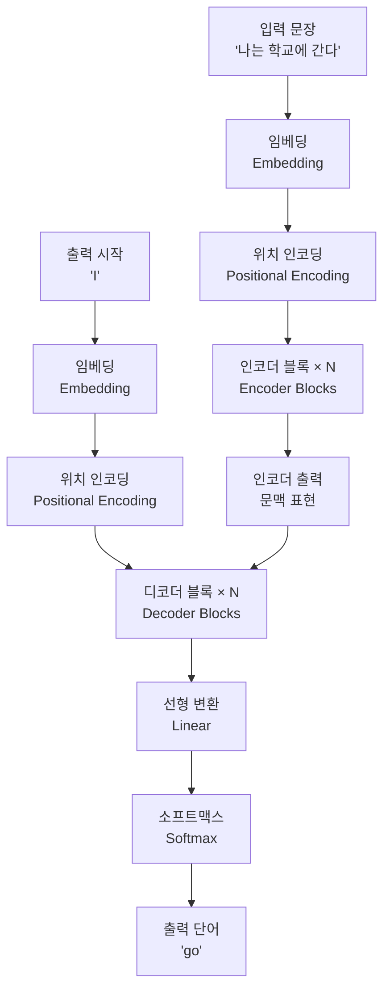
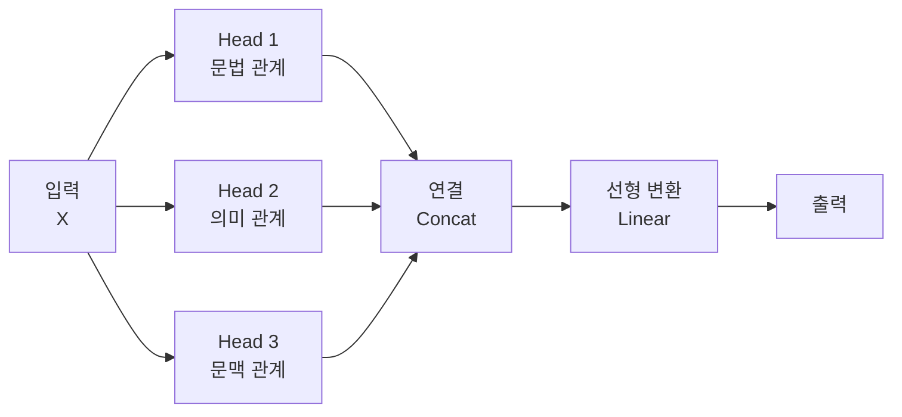
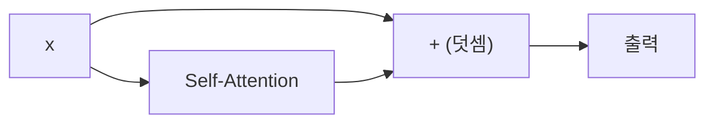
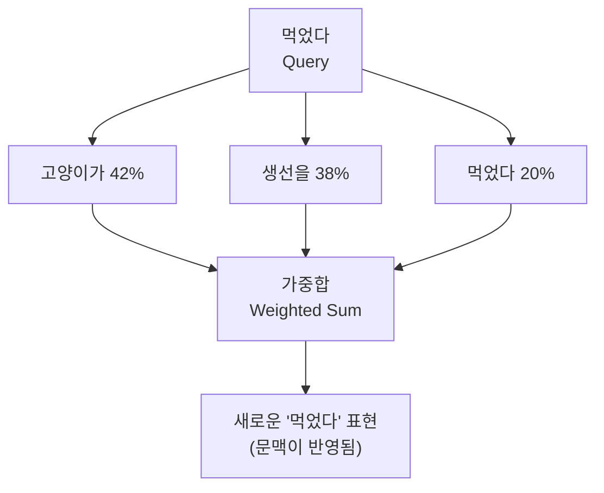
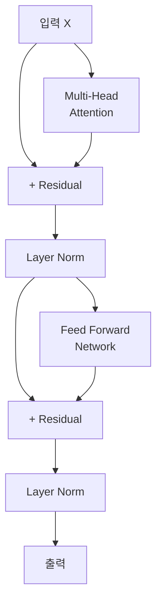

# Transformer 아키텍처(Architecture)

## 목차
1. [Transformer란 무엇인가](#1-transformer란-무엇인가)<br/>
   1. 1.1. [탄생 배경](#11-탄생-배경)<br/>
   1. 1.2. [핵심 아이디어](#12-핵심-아이디어)<br/>
2. [Transformer의 전체 구조](#2-transformer의-전체-구조)<br/>
   1. 2.1. [인코더-디코더 아키텍처](#21-인코더-디코더-아키텍처)<br/>
   1. 2.2. [데이터 흐름](#22-데이터-흐름)<br/>
3. [Self-Attention 메커니즘](#3-self-attention-메커니즘)<br/>
   1. 3.1. [Attention이란](#31-attention이란)<br/>
   1. 3.2. [Query, Key, Value의 개념](#32-query-key-value의-개념)<br/>
   1. 3.3. [Attention 계산 과정](#33-attention-계산-과정)<br/>
   1. 3.4. [Multi-Head Attention](#34-multi-head-attention)<br/>
4. [Transformer의 핵심 컴포넌트](#4-transformer의-핵심-컴포넌트)<br/>
   1. 4.1. [Layer Normalization](#41-layer-normalization)<br/>
   1. 4.2. [Residual Connection](#42-residual-connection)<br/>
   1. 4.3. [Feed Forward Network](#43-feed-forward-network)<br/>
   1. 4.4. [Positional Encoding](#44-positional-encoding)<br/>
5. [Transformer 동작 예제](#5-transformer-동작-예제)<br/>
   1. 5.1. [입력 문장 처리](#51-입력-문장-처리)<br/>
   1. 5.2. [Self-Attention 계산 예제](#52-self-attention-계산-예제)<br/>
6. [PyTorch 구현](#6-pytorch-구현)<br/>
   1. 6.1. [기본 구조](#61-기본-구조)<br/>
   1. 6.2. [핵심 코드](#62-핵심-코드)<br/>
7. [학습 원리](#7-학습-원리)<br/>
   1. 7.1. [손실 함수](#71-손실-함수)<br/>
   1. 7.2. [최적화](#72-최적화)<br/>
8. [용어 목록](#8-용어-목록)<br/>

---

## 1. Transformer란 무엇인가

### 1.1. 탄생 배경

2017년 이전까지 자연어 처리(NLP, Natural Language Processing)는 주로 RNN(Recurrent Neural Network, 리커런트 뉴럴 네트워크)과 LSTM(Long Short-Term Memory, 롱 쇼트 텀 메모리)을 사용했습니다. 하지만 이들은 치명적인 문제가 있었습니다.

**RNN/LSTM의 문제점:**
- **순차 처리(Sequential Processing, 시퀀셜 프로세싱) 강제**: "나는 학교에 간다"를 처리할 때 "나는" → "학교에" → "간다" 순서대로만 처리 가능
- **장거리 의존성(Long-range Dependency, 롱 레인지 디펜던시) 문제**: 문장이 길어지면 앞의 정보를 잊어버림
- **병렬화(Parallelization, 패러렐라이제이션) 불가능**: GPU를 효율적으로 활용할 수 없음

Google의 연구팀은 2017년 논문 "Attention is All You Need"에서 이 문제들을 해결한 Transformer를 제안했습니다.

### 1.2. 핵심 아이디어

Transformer의 혁명적인 아이디어는 **"순서대로 읽지 말고, 모든 단어를 한 번에 보자"**입니다.

**비유로 이해하기:**

RNN 방식: 책을 첫 페이지부터 마지막 페이지까지 순서대로 읽는 것
```
나는 → (기억) → 학교에 → (기억) → 간다
```

Transformer 방식: 책의 모든 페이지를 펼쳐놓고 동시에 보는 것
```
나는 ←→ 학교에 ←→ 간다
  ↓       ↓       ↓
모든 단어가 서로를 동시에 참조
```

---

## 2. Transformer의 전체 구조

### 2.1. 인코더-디코더 아키텍처

Transformer는 크게 **인코더(Encoder, 인코더)**와 **디코더(Decoder, 디코더)**로 구성됩니다.



### 2.2. 데이터 흐름

**인코더의 역할**: 입력 문장을 이해하여 의미 있는 표현(Representation, 레프리젠테이션)으로 변환
**디코더의 역할**: 인코더의 표현을 보면서 출력 문장을 생성

**예시: 번역 과정**
```
입력: "나는 학교에 간다"
        ↓
인코더: [0.2, 0.8, ...], [0.5, 0.3, ...], [0.1, 0.9, ...] ← 각 단어의 의미 벡터
        ↓
디코더: "I" → "go" → "to" → "school"
```

---

## 3. Self-Attention 메커니즘

### 3.1. Attention이란

Attention은 **"어떤 단어에 집중해야 하는가"**를 결정하는 메커니즘입니다.

**예시: "그는 학교에 갔다. 그는 선생님을 만났다."**

두 번째 문장의 "그는"을 이해하려면:
- 첫 번째 문장의 주어를 봐야 함 ✓
- "학교에"는 덜 중요함 △
- "갔다"는 중요하지 않음 ✗

Attention은 이런 중요도를 자동으로 학습합니다.

### 3.2. Query, Key, Value의 개념

Self-Attention의 핵심은 세 가지 벡터입니다:

**Query(쿼리)**: "나는 무엇을 찾고 있는가?"
**Key(키)**: "나는 어떤 정보를 가지고 있는가?"
**Value(밸류)**: "내가 전달할 실제 정보는 무엇인가?"

**도서관 비유:**
```
Query: "머신러닝 책을 찾고 싶어요" (검색어)
Key: 각 책의 제목과 키워드 (색인)
Value: 실제 책의 내용 (정보)
```

**문장 예시: "고양이가 생선을 먹었다"**

| 단어 | Query (찾는 것) | Key (가진 것) | Value (전달할 것) |
|------|----------------|---------------|------------------|
| 고양이가 | "누가 행동했나?" | "주어" | [고양이의 의미 벡터] |
| 생선을 | "무엇을?" | "목적어" | [생선의 의미 벡터] |
| 먹었다 | "어떤 행동?" | "동사" | [먹다의 의미 벡터] |

### 3.3. Attention 계산 과정

**단계별 계산:**

**1단계: Query와 Key의 내적(Dot Product, 닷 프로덕트)**

각 단어의 Query와 모든 단어의 Key를 비교합니다.

$$\text{Score}_{ij} = Q_i \cdot K_j^T$$

"먹었다"의 Query로 모든 단어 검색:
```
"먹었다" Query · "고양이가" Key = 0.9 (높은 관련성)
"먹었다" Query · "생선을" Key = 0.8 (높은 관련성)
"먹었다" Query · "먹었다" Key = 0.3 (낮은 관련성)
```

**2단계: 스케일링(Scaling, 스케일링)**

너무 큰 값을 방지하기 위해 √d_k로 나눕니다.

$$\text{Score}_{ij} = \frac{Q_i \cdot K_j^T}{\sqrt{d_k}}$$

여기서 d_k는 Key 벡터의 차원(Dimension, 디멘션)입니다.

**3단계: 소프트맥스(Softmax, 소프트맥스)**

점수를 확률로 변환합니다 (합이 1이 되도록).

$$\text{Attention Weights}_{ij} = \text{softmax}(\text{Score}_{ij})$$

```
"먹었다"가 각 단어에 주는 attention 가중치:
"고양이가": 0.5 (50%)
"생선을": 0.4 (40%)
"먹었다": 0.1 (10%)
```

**4단계: Value와 가중합(Weighted Sum, 웨이티드 섬)**

Attention 가중치로 Value를 조합합니다.

$$\text{Output}_i = \sum_j \text{Attention Weights}_{ij} \cdot V_j$$

```
"먹었다"의 최종 표현 =
  0.5 × [고양이 Value] +
  0.4 × [생선 Value] +
  0.1 × [먹었다 Value]
```

**전체 수식:**

$$\text{Attention}(Q, K, V) = \text{softmax}\left(\frac{QK^T}{\sqrt{d_k}}\right)V$$

### 3.4. Multi-Head Attention

하나의 Attention만으로는 부족합니다. 다양한 관점에서 문장을 봐야 합니다.

**비유: 다양한 전문가**
```
Head 1: 문법 전문가 - "주어-동사-목적어 관계 분석"
Head 2: 의미 전문가 - "단어의 의미적 유사성 분석"
Head 3: 문맥 전문가 - "앞뒤 문맥 관계 분석"
```



**PyTorch 코드:**
```python
attention = nn.MultiheadAttention(embed_dim=512, num_heads=8, batch_first=True)
output, weights = attention(query, key, value)
```

---

## 4. Transformer의 핵심 컴포넌트

### 4.1. Layer Normalization

**역할**: 각 층의 출력을 정규화(Normalization, 노멀라이제이션)하여 학습을 안정화합니다.

**문제 상황:**
```
층 1 출력: [0.1, 0.2, 0.3]
층 2 출력: [100, 200, 300]  ← 값이 너무 큼!
층 3 출력: [10000, 20000, 30000]  ← 폭발!
```

**Layer Normalization 적용 후:**
```
층 1 출력: [-1.22, 0, 1.22]  ← 평균 0, 분산 1
층 2 출력: [-1.22, 0, 1.22]  ← 평균 0, 분산 1
층 3 출력: [-1.22, 0, 1.22]  ← 평균 0, 분산 1
```

**수식:**

$$\text{LayerNorm}(x) = \gamma \frac{x - \mu}{\sqrt{\sigma^2 + \epsilon}} + \beta$$

여기서:
- μ: 평균(Mean, 민)
- σ²: 분산(Variance, 베리언스)
- γ, β: 학습 가능한 파라미터(Parameter, 파라미터)
- ε: 수치 안정성을 위한 작은 값

**PyTorch 코드:**
```python
layer_norm = nn.LayerNorm(embed_dim=512)
normalized = layer_norm(x)
```

### 4.2. Residual Connection

**역할**: 입력을 출력에 직접 더해서 기울기 소실(Gradient Vanishing, 그래디언트 배니싱)을 방지합니다.

**문제: 깊은 네트워크의 기울기 소실**
```
층 1 → 층 2 → 층 3 → ... → 층 100
     ↓     ↓     ↓           ↓
  기울기가 점점 작아짐 → 앞쪽 층이 학습 안 됨
```

**Residual Connection 해법:**
```python
# Residual Connection이 없으면
output = transformation(x)

# Residual Connection이 있으면
output = x + transformation(x)  # 입력을 직접 더함
```

**시각화:**


**효과:**
- 입력 정보가 직접 전달되므로 깊게 쌓아도 학습 가능
- 100층 이상도 학습 가능

### 4.3. Feed Forward Network

**역할**: 각 단어 위치마다 독립적으로 비선형 변환(Non-linear Transformation, 논 리니어 트랜스포메이션)을 수행합니다.

**구조:**
```python
FFN = nn.Sequential(
    nn.Linear(embed_dim, embed_dim * 4),  # 확장 (512 → 2048)
    nn.ReLU(),                             # 비선형 활성화
    nn.Linear(embed_dim * 4, embed_dim)   # 축소 (2048 → 512)
)
```

**동작 원리:**
```
입력: [0.1, 0.2, ..., 0.5]  (512차원)
  ↓
확장: [0.3, 0.7, ..., 0.9]  (2048차원) ← 더 많은 표현 공간
  ↓
ReLU: [0.3, 0, ..., 0.9]    ← 비선형성 추가
  ↓
축소: [0.2, 0.4, ..., 0.6]  (512차원) ← 원래 차원으로
```

**왜 필요한가:**
- Self-Attention은 선형 변환만 수행
- 비선형성이 없으면 복잡한 패턴 학습 불가능
- FFN이 표현력(Expressiveness, 익스프레시브니스)을 크게 향상

### 4.4. Positional Encoding

**문제: Transformer는 단어 순서를 모름**

Self-Attention은 모든 단어를 동시에 보므로 순서 정보가 없습니다.
```
"고양이가 개를 쫓았다" = "개를 고양이가 쫓았다"?
```

**해법: 위치 정보를 추가**

각 위치마다 고유한 벡터를 더해줍니다.

**수식 (Sinusoidal Encoding, 사인 곡선 인코딩):**

$$PE_{(pos, 2i)} = \sin\left(\frac{pos}{10000^{2i/d}}\right)$$

$$PE_{(pos, 2i+1)} = \cos\left(\frac{pos}{10000^{2i/d}}\right)$$

여기서:
- pos: 단어의 위치 (0, 1, 2, ...)
- i: 차원의 인덱스
- d: 임베딩 차원

**예시:**
```
"나는 학교에 간다"

위치 0 (나는):   [sin(0/10000^0), cos(0/10000^0), ...]
위치 1 (학교에): [sin(1/10000^0), cos(1/10000^0), ...]
위치 2 (간다):   [sin(2/10000^0), cos(2/10000^0), ...]
```

**최종 입력:**
```
최종 입력 = 단어 임베딩 + 위치 인코딩
```

---

## 5. Transformer 동작 예제

### 5.1. 입력 문장 처리

**예시 문장: "고양이가 생선을 먹었다"**

**단계 1: 토큰화(Tokenization, 토크나이제이션)**
```
"고양이가 생선을 먹었다" → ["고양이가", "생선을", "먹었다"]
```

**단계 2: 임베딩(Embedding, 임베딩)**
```
"고양이가" → [0.2, 0.8, 0.1, ..., 0.5]  (512차원 벡터)
"생선을"   → [0.7, 0.3, 0.9, ..., 0.2]
"먹었다"   → [0.1, 0.5, 0.4, ..., 0.8]
```

**단계 3: 위치 인코딩 추가**
```
"고양이가" 최종 = [0.2, 0.8, ...] + [sin(0), cos(0), ...]
"생선을" 최종   = [0.7, 0.3, ...] + [sin(1), cos(1), ...]
"먹었다" 최종   = [0.1, 0.5, ...] + [sin(2), cos(2), ...]
```

### 5.2. Self-Attention 계산 예제

**"먹었다" 단어의 Self-Attention 계산**

**1단계: Query, Key, Value 생성**
```python
# 학습된 가중치 행렬로 변환
Q_먹었다 = W_Q × embedding_먹었다
K_고양이 = W_K × embedding_고양이
K_생선 = W_K × embedding_생선
K_먹었다 = W_K × embedding_먹었다
V_고양이 = W_V × embedding_고양이
V_생선 = W_V × embedding_생선
V_먹었다 = W_V × embedding_먹었다
```

**2단계: Attention 점수 계산**
```
Score(먹었다, 고양이가) = Q_먹었다 · K_고양이 / √d_k = 0.9
Score(먹었다, 생선을) = Q_먹었다 · K_생선 / √d_k = 0.8
Score(먹었다, 먹었다) = Q_먹었다 · K_먹었다 / √d_k = 0.3
```

**3단계: Softmax로 확률 변환**
```
Softmax([0.9, 0.8, 0.3]) = [0.42, 0.38, 0.20]

해석:
- "고양이가"에 42% 집중
- "생선을"에 38% 집중
- "먹었다"에 20% 집중
```

**4단계: 최종 출력**
```
Output_먹었다 = 0.42 × V_고양이 + 0.38 × V_생선 + 0.20 × V_먹었다
             = "주어와 목적어 정보가 통합된 '먹었다'의 표현"
```

**Attention 시각화:**


---

## 6. PyTorch 구현

### 6.1. 기본 구조



### 6.2. 핵심 코드

```python
import torch.nn as nn

class TransformerBlock(nn.Module):
    def __init__(self, embed_dim, num_heads):
        super().__init__()
        
        # 1. Multi-Head Attention
        self.attention = nn.MultiheadAttention(
            embed_dim, num_heads, batch_first=True
        )
        
        # 2. Layer Normalization
        self.norm1 = nn.LayerNorm(embed_dim)
        self.norm2 = nn.LayerNorm(embed_dim)
        
        # 3. Feed Forward Network
        self.ffn = nn.Sequential(
            nn.Linear(embed_dim, embed_dim * 4),
            nn.ReLU(),
            nn.Linear(embed_dim * 4, embed_dim)
        )
    
    def forward(self, x):
        # Self-Attention + Residual + Norm
        attn_output, _ = self.attention(x, x, x)
        x = self.norm1(x + attn_output)  # Residual
        
        # FFN + Residual + Norm
        ffn_output = self.ffn(x)
        x = self.norm2(x + ffn_output)  # Residual
        
        return x
```

**사용 예시:**
```python
# 설정
embed_dim = 512
num_heads = 8
seq_length = 10
batch_size = 32

# 모델 생성
block = TransformerBlock(embed_dim, num_heads)

# 입력 (배치, 시퀀스 길이, 임베딩 차원)
x = torch.randn(batch_size, seq_length, embed_dim)

# 순전파
output = block(x)  # (32, 10, 512)
```

---

## 7. 학습 원리

### 7.1. 손실 함수

**번역 작업 예시:**
```
입력: "나는 학교에 간다"
정답: "I go to school"
예측: "I go to house"  ← 틀림!
```

**Cross Entropy Loss(크로스 엔트로피 로스):**

$$\mathcal{L} = -\sum_{i=1}^{V} y_i \log(\hat{y}_i)$$

여기서:
- y_i: 정답 단어의 확률 (one-hot, 원 핫)
- ŷ_i: 모델이 예측한 확률

**예시:**
```
정답 단어: "school" (인덱스 1523)
y = [0, 0, ..., 1, ..., 0]  ← 1523번째만 1

모델 예측:
ŷ = [0.01, 0.02, ..., 0.6, ..., 0.03]
                      ↑
              "school"에 60% 확률

Loss = -log(0.6) = 0.51
```

### 7.2. 최적화

**Adam Optimizer(아담 옵티마이저):**

Transformer는 주로 Adam을 사용합니다.

**특징:**
- 학습률(Learning Rate, 러닝 레이트)을 자동으로 조절
- 모멘텀(Momentum, 모멘텀)을 사용하여 빠르게 수렴

**Learning Rate 스케줄링(Scheduling, 스케줄링):**

논문에서는 Warmup(워밍업) 전략을 사용합니다.

$$\text{lr} = d_{model}^{-0.5} \cdot \min(step^{-0.5}, step \cdot warmup\_steps^{-1.5})$$

```
처음 4000 스텝: 학습률 증가 (Warmup)
이후: 천천히 감소
```

**이유:**
- 처음부터 큰 학습률을 사용하면 불안정
- 천천히 증가시킨 후 감소시키면 안정적으로 수렴

---

## 8. 용어 목록

| 용어 | 영문 | 설명 |
|------|------|------|
| 어텐션 | Attention | 입력의 어느 부분에 집중할지 결정하는 메커니즘 |
| 셀프 어텐션 | Self-Attention | 입력 시퀀스 내부의 요소들 간 관계를 계산하는 어텐션 |
| 멀티 헤드 어텐션 | Multi-Head Attention | 여러 개의 어텐션을 병렬로 수행하는 구조 |
| 쿼리 | Query | 어텐션에서 정보를 찾기 위한 벡터 |
| 키 | Key | 어텐션에서 검색 대상이 되는 벡터 |
| 밸류 | Value | 어텐션에서 실제로 전달되는 정보 벡터 |
| 임베딩 | Embedding | 단어를 고정 길이의 실수 벡터로 변환 |
| 포지셔널 인코딩 | Positional Encoding | 시퀀스의 위치 정보를 나타내는 벡터 |
| 레이어 노멀라이제이션 | Layer Normalization | 각 층의 출력을 정규화하여 학습 안정화 |
| 레지듀얼 커넥션 | Residual Connection | 입력을 출력에 직접 더하는 연결 |
| 피드 포워드 네트워크 | Feed Forward Network | 각 위치별로 독립적으로 적용되는 완전 연결 신경망 |
| 인코더 | Encoder | 입력을 의미 있는 표현으로 변환하는 부분 |
| 디코더 | Decoder | 인코더의 출력을 보고 결과를 생성하는 부분 |
| 트랜스포머 블록 | Transformer Block | 어텐션과 FFN을 포함한 하나의 처리 단위 |
| 토크나이제이션 | Tokenization | 문장을 단어나 서브워드 단위로 분리 |
| 소프트맥스 | Softmax | 벡터를 확률 분포로 변환하는 함수 |
| 크로스 엔트로피 | Cross Entropy | 예측 분포와 정답 분포 간의 차이를 측정하는 손실 함수 |
| 백프로퍼게이션 | Backpropagation | 손실을 역방향으로 전파하여 가중치를 업데이트 |
| 그래디언트 | Gradient | 손실 함수의 기울기, 가중치 업데이트 방향 |
| 옵티마이저 | Optimizer | 가중치를 업데이트하는 알고리즘 |
| 아담 | Adam | 모멘텀과 적응형 학습률을 결합한 최적화 알고리즘 |
| 배치 | Batch | 한 번에 처리하는 데이터 묶음 |
| 에폭 | Epoch | 전체 데이터셋을 한 번 학습하는 단위 |
| 하이퍼파라미터 | Hyperparameter | 학습 전에 설정하는 파라미터 (학습률, 배치 크기 등) |
| 어텐션 웨이트 | Attention Weight | 각 요소에 얼마나 집중할지를 나타내는 가중치 |
| 헤드 | Head | 멀티 헤드 어텐션에서 독립적인 어텐션 단위 |
| 히든 디멘션 | Hidden Dimension | 은닉층의 차원 크기 |
| 시퀀스 렝스 | Sequence Length | 입력 시퀀스의 길이 |
| 보캐뷸러리 사이즈 | Vocabulary Size | 사용 가능한 전체 단어 개수 |
| 마스크드 어텐션 | Masked Attention | 미래 정보를 보지 못하도록 가리는 어텐션 |
| 인코더 디코더 어텐션 | Encoder-Decoder Attention | 디코더가 인코더 출력을 참조하는 어텐션 |
| 스케일 닷 프로덕트 | Scaled Dot-Product | Query와 Key의 내적을 √d_k로 나누는 연산 |
| 리니어 레이어 | Linear Layer | 선형 변환을 수행하는 완전 연결 층 |
| 액티베이션 펑션 | Activation Function | 비선형성을 추가하는 함수 (ReLU, GELU 등) |
| 드롭아웃 | Dropout | 과적합 방지를 위해 일부 뉴런을 무작위로 제거 |
| 오버피팅 | Overfitting | 학습 데이터에만 과도하게 맞춰지는 현상 |
| 제너럴라이제이션 | Generalization | 학습하지 않은 데이터에도 잘 작동하는 능력 |
| 파인 튜닝 | Fine-tuning | 사전 학습된 모델을 특정 작업에 맞게 재학습 |
| 프리트레이닝 | Pre-training | 대규모 데이터로 먼저 학습하는 과정 |
| 다운스트림 태스크 | Downstream Task | 사전 학습 후 수행하는 구체적인 작업 |
| 컨텍스트 윈도우 | Context Window | 모델이 한 번에 처리할 수 있는 최대 길이 |
| 어텐션 스코어 | Attention Score | Query와 Key의 유사도를 나타내는 값 |
| 가중합 | Weighted Sum | 가중치를 곱한 값들의 합 |
| 병렬화 | Parallelization | 여러 연산을 동시에 수행 |
| 벡터 | Vector | 여러 숫자로 이루어진 1차원 배열 |
| 매트릭스 | Matrix | 2차원 숫자 배열 |
| 텐서 | Tensor | 다차원 숫자 배열 |
| 디멘션 | Dimension | 벡터나 행렬의 크기/차원 |
| 임베딩 디멘션 | Embedding Dimension | 임베딩 벡터의 차원 크기 |
| 넘버 오브 헤즈 | Number of Heads | 멀티 헤드 어텐션의 헤드 개수 |
| 넘버 오브 레이어스 | Number of Layers | 트랜스포머 블록을 쌓는 개수 |
| 워밍업 스텝스 | Warmup Steps | 학습률을 점진적으로 증가시키는 초기 단계 |
| 러닝 레이트 스케줄 | Learning Rate Schedule | 학습 과정에서 학습률을 조절하는 전략 |
| 모멘텀 | Momentum | 이전 기울기 방향을 고려하는 최적화 기법 |
| 그래디언트 클리핑 | Gradient Clipping | 기울기가 너무 커지는 것을 방지 |
| 그래디언트 배니싱 | Gradient Vanishing | 기울기가 소실되어 학습이 안 되는 현상 |
| 그래디언트 익스플로딩 | Gradient Exploding | 기울기가 폭발적으로 커지는 현상 |
| 포워드 패스 | Forward Pass | 입력에서 출력으로 데이터가 흐르는 과정 |
| 백워드 패스 | Backward Pass | 출력에서 입력으로 기울기가 전파되는 과정 |
| 로스 펑션 | Loss Function | 모델의 예측 오차를 계산하는 함수 |
| 트레이닝 로스 | Training Loss | 학습 데이터에 대한 손실 값 |
| 밸리데이션 로스 | Validation Loss | 검증 데이터에 대한 손실 값 |
| 체크포인트 | Checkpoint | 학습 중간에 저장하는 모델 상태 |
| 인퍼런스 | Inference | 학습된 모델로 예측을 수행하는 과정 |
| 빔 서치 | Beam Search | 여러 후보를 동시에 탐색하는 디코딩 방법 |
| 그리디 디코딩 | Greedy Decoding | 매 단계 가장 높은 확률의 단어를 선택 |
| 온 핫 인코딩 | One-Hot Encoding | 해당 위치만 1이고 나머지는 0인 벡터 |
| 소프트 라벨 | Soft Label | 확률 분포로 표현된 라벨 |
| 하드 라벨 | Hard Label | 0 또는 1로만 표현된 명확한 라벨 |
| 라벨 스무딩 | Label Smoothing | 정답에 약간의 불확실성을 추가하는 기법 |
| 데이터 어그먼테이션 | Data Augmentation | 데이터를 변형하여 양을 늘리는 기법 |
| 배치 노멀라이제이션 | Batch Normalization | 배치 단위로 정규화하는 기법 |
| 웨이트 디케이 | Weight Decay | 가중치가 너무 커지지 않도록 제한 |
| 레귤러라이제이션 | Regularization | 과적합을 방지하는 기법들의 총칭 |
| 얼리 스토핑 | Early Stopping | 검증 손실이 증가하면 학습을 조기 종료 |
| 퍼플렉시티 | Perplexity | 언어 모델의 성능을 측정하는 지표 |
| 블루 스코어 | BLEU Score | 기계 번역 품질을 평가하는 지표 |
| 어텐션 비주얼라이제이션 | Attention Visualization | 어텐션 가중치를 시각화하여 모델 해석 |

---

## 추가 설명 및 FAQ

### 왜 Transformer가 중요한가?

1. **범용성(Versatility, 버서털리티)**: 번역, 요약, 질의응답 등 다양한 작업에 사용
2. **확장성(Scalability, 스케일러빌리티)**: 파라미터를 늘릴수록 성능 향상 (GPT-3는 1750억 개)
3. **병렬 처리**: GPU를 최대한 활용하여 빠른 학습
4. **전이 학습(Transfer Learning, 트랜스퍼 러닝)**: 사전 학습 후 다양한 작업에 적용 가능

### Transformer의 한계

1. **메모리 사용량**: Self-Attention은 O(n²)의 메모리 복잡도
   - 문장 길이가 1000이면 1,000,000번의 연산 필요
   
2. **긴 시퀀스 처리 어려움**: 컨텍스트 윈도우 제한
   - GPT-3: 2048 토큰
   - GPT-4: 8192~32768 토큰
   
3. **해석 가능성(Interpretability, 인터프리터빌리티) 부족**: 왜 그런 예측을 했는지 설명하기 어려움

### Transformer의 변형들

**BERT (Bidirectional Encoder Representations from Transformers, 버트)**
- 인코더만 사용
- 양방향 컨텍스트 이해
- 문장 분류, 개체명 인식에 강점

**GPT (Generative Pre-trained Transformer, 지피티)**
- 디코더만 사용
- 왼쪽에서 오른쪽으로만 읽음
- 텍스트 생성에 강점

**T5 (Text-to-Text Transfer Transformer, 티 파이브)**
- 인코더-디코더 모두 사용
- 모든 NLP 작업을 텍스트 생성 문제로 변환

### 학습 팁

**초기 설정:**
```python
embed_dim = 512        # 임베딩 차원
num_heads = 8          # 헤드 개수 (embed_dim의 약수여야 함)
num_layers = 6         # 층의 개수
ffn_dim = 2048        # FFN의 은닉 차원 (보통 embed_dim × 4)
dropout = 0.1          # 드롭아웃 비율
```

**학습률 설정:**
```python
learning_rate = 1e-4   # Adam의 기본 학습률
warmup_steps = 4000    # 워밍업 단계
```

**배치 크기:**
```python
batch_size = 32        # GPU 메모리에 따라 조절
```

### 디버깅 체크리스트

1. **입력 shape 확인**
   ```python
   print(f"Input shape: {x.shape}")  # (batch, seq_len, embed_dim)
   ```

2. **Attention 가중치 확인**
   ```python
   _, attention_weights = self.attention(x, x, x)
   print(f"Attention weights: {attention_weights.shape}")
   ```

3. **기울기 확인**
   ```python
   for name, param in model.named_parameters():
       if param.grad is not None:
           print(f"{name}: {param.grad.norm()}")
   ```

4. **손실 값 모니터링**
   ```python
   if loss < 0 or torch.isnan(loss):
       print("WARNING: Invalid loss value!")
   ```
---