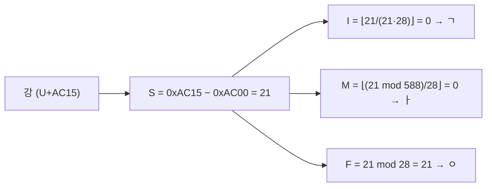
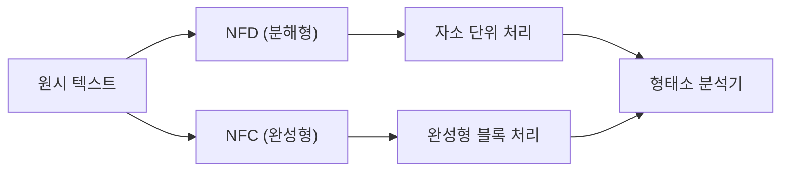
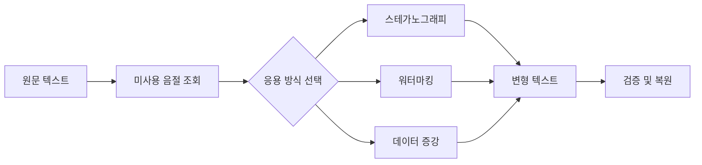
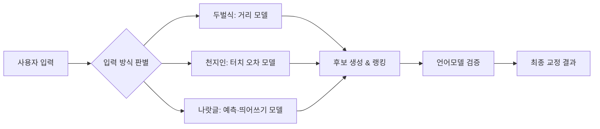

# 한글 자연어 처리 검토

## 목차
1. [한글과 영어의 구조적 차이](#1-한글과-영어의-구조적-차이)<br/>
   1.1. [문자 체계](#11-문자-체계)<br/>
   1.2. [문법 구조](#12-문법-구조)<br/>
   1.3. [발음 규칙](#13-발음-규칙)<br/>
2. [한글 NLP 특성](#2-한글-nlp-특성)<br/>
   2.1. [형태소 분석의 중요성](#21-형태소-분석의-중요성)<br/>
   2.2. [음절 단위 vs 자소 단위](#22-음절-단위-vs-자소-단위)<br/>
     2.2.1. [자소 분리의 장점](#221-자소-분리의-장점)<br/>
     2.2.2. [한계와 고려사항](#222-한계와-고려사항)<br/>
     2.2.3. [하이브리드 활용 시나리오](#223-하이브리드-활용-시나리오)<br/>
     2.2.4. [자소 순서 및 유니코드 분해 알고리즘](#224-자소-순서-및-유니코드-분해-알고리즘)<br/>
3. [조합한글과 유니코드 완성형 집합체](#3-조합한글과-유니코드-완성형-집합체)<br/>
   3.1. [조합한글과 완성형의 개념](#31-조합한글과-완성형의-개념)<br/>
   3.2. [유니코드 집합체 구조](#32-유니코드-집합체-구조)<br/>
   3.3. [정규화 고려사항](#33-정규화-고려사항)<br/>
   3.4. [처리 및 모델링 방안](#34-처리-및-모델링-방안)<br/>
4. [미사용 자소 조합 활용 방안](#4-미사용-자소-조합-활용-방안)<br/>
   4.1. [수치적 배경 계산](#41-수치적-배경-계산)<br/>
   4.2. [응용 아이디어](#42-응용-아이디어)<br/>
   4.3. [고려사항](#43-고려사항)<br/>
5. [휴대폰 입력 방식별 오타 특성](#5-휴대폰-입력-방식별-오타-특성)<br/>
   5.1. [두벌식 자판 입력 방식](#51-두벌식-자판-입력-방식)<br/>
   5.2. [천지인 입력 방식](#52-천지인-입력-방식)<br/>
   5.3. [나랏글 입력 방식](#53-나랏글-입력-방식)<br/>
   5.4. [입력 방식별 오류 보정 파이프라인](#54-입력-방식별-오류-보정-파이프라인)<br/>
6. [실제 구현 예제](#6-실제-구현-예제)<br/>
   6.1. [Python 기반 자소 분해 코드](#61-python-기반-자소-분해-코드)<br/>
   6.2. [토크나이저 비교 실험](#62-토크나이저-비교-실험)<br/>
7. [성능 벤치마크](#7-성능-벤치마크)<br/>
   7.1. [처리 속도 비교](#71-처리-속도-비교)<br/>
   7.2. [메모리 사용량 분석](#72-메모리-사용량-분석)<br/>
8. [단계별 검토 및 수정 보완](#8-단계별-검토-및-수정-보완) <br/> 
9. [용어 목록](#9-용어-목록)<br/>

---

## 1. 한글과 영어의 구조적 차이

### 1.1. 문자 체계

한글은 음소 문자(phoneme-based script [포늄-베이스드 스크립트])로 자음과 모음이 결합해 하나의 음절 블록을 구성한다. 영어는 알파벳(alphabet [앨퍼벳]) 문자로 26개의 독립 글자가 단어를 형성한다.

한글의 특징은 다음과 같다:
- 19개 초성, 21개 중성, 28개 종성의 조합
- 이론적으로 $19 \times 21 \times 28 = 11,172$개의 음절 가능
- 표음성(phonetic representation [포네틱 리프리젠테이션])이 높아 발음과 표기가 일치

### 1.2. 문법 구조

한글은 주어-목적어-동사 구조(SOV)로 어순 유연성이 높다. 영어는 주어-동사-목적어 구조(SVO)로 어순 변화만으로 의미가 달라진다.

교착어적 특성으로 인해 다음과 같은 복잡성을 가진다:
- 조사 체계: 주격(-이/가), 목적격(-을/를), 부사격(-에/-에서) 등
- 어미 변화: 시제, 높임법, 의문법 등의 복합적 표현
- 불규칙 활용: ㅂ불규칙, ㄷ불규칙, ㅅ불규칙 등

### 1.3. 발음 규칙

한글은 철자 그대로 발음되는 규칙적인 정철법(orthography [오쏴그래피])을 가진다. 영어는 불규칙성이 많아 같은 철자도 다양한 음가를 가질 수 있다.

음운 현상으로는 다음이 있다:
- 연음화(liaison [리에종]): "한국어" → [한구거]
- 비음화(nasalization [네이절라이제이션]): "국물" → [궁물]
- 경음화(tensification [텐시피케이션]): "학교" → [학꾜]

---

## 2. 한글 NLP 특성

### 2.1. 형태소 분석의 중요성

한글은 교착어(agglutinative [애글루티네이티브])로 조사와 어미가 다양하게 결합된다. 단어 경계가 모호하여 형태소 분석을 통한 분절이 필수적이다.

형태소 분석의 과정:
1. 어절 단위 토크나이징
2. 형태소 후보 생성
3. 품사 태깅(POS tagging [피오에스 태깅])
4. 최적 분석 결과 선택

### 2.2. 음절 단위 vs 자소 단위

#### 2.2.1. 자소 분리의 장점

- 어휘 희소성(vocabulary sparsity [보캐뷸러리 스파시티]) 감소
- OOV(Out-Of-Vocabulary [아웃 오브 보캐뷸러리]) 문제 완화
- 음운론(phonology [포놀러지])적 디테일 보존
- 형태적 유사성 포착 향상

#### 2.2.2. 한계와 고려사항

- 의미 단위 상실: '학교'와 '효교' 구분 불가
- 토큰 수 급증: 음절 대비 평균 2.8배 증가
- 문맥 정보 희석: 어절·구문 정보 포착 어려움
- 계산 복잡도 증가: 시퀀스 길이 확장

#### 2.2.3. 하이브리드 활용 시나리오

- 자소+음절 멀티스케일 임베딩
- 전처리 단계 자소 분리 후 형태소 분석
- 저자원 환경에서 자소 기반 일반화
- 도메인 특화 어휘에 대한 적응적 토크나이징

#### 2.2.4. 자소 순서 및 유니코드 분해 알고리즘

한글 음절은 초성·중성·종성 순서로 결합된다. 유니코드 완성형 음절 블록(U+AC00–U+D7A3)의 인덱스 $$S$$ 계산:

$$S = (I \times 21 + M) \times 28 + F$$

여기서:
- $I$ : 초성 인덱스 (0–18)
- $M$ : 중성 인덱스 (0–20)  
- $F$ : 종성 인덱스 (0–27)

역산 절차:
1. $S = \text{codePoint} - \text{0xAC00}$
2. $I = \lfloor S / (21 \times 28)\rfloor$
3. $M = \lfloor (S \bmod (21 \times 28)) / 28\rfloor$
4. $F = S \bmod 28$



---

## 3. 조합한글과 유니코드 완성형 집합체

### 3.1. 조합한글과 완성형의 개념

조합한글은 자소(字素) 단위로 동적 결합해 음절을 렌더링한다. 유니코드는 미리 완성된 음절 블록 11,172자를 하나의 집합체(collection [컬렉션])로 정의한다.

두 방식의 비교:

| 구분 | 조합한글 | 완성형 |
|------|---------|--------|
| 저장 방식 | 자소별 개별 코드 | 음절별 단일 코드 |
| 메모리 효율성 | 높음 | 낮음 |
| 렌더링 복잡도 | 높음 | 낮음 |
| 호환성 | 제한적 | 표준 |

### 3.2. 유니코드 집합체 구조

완성형 음절은 U+AC00부터 U+D7A3까지 연속 배치되어 있다. 코드 포인트 = `0xAC00 + S`, 역분해를 통해 자소로 분리할 수 있다.

유니코드 블록 구조:
- 한글 음절: U+AC00–U+D7AF (11,184자)
- 한글 자모: U+3130–U+318F (96자)
- 한글 호환 자모: U+3200–U+32FF (256자)

### 3.3. 정규화 고려사항

- **NFC(Normalization Form Composed)**: 결합된 완성형 사용
- **NFD(Normalization Form Decomposed)**: 자소 단위 분해

정규화 누락 시 코드 포인트 불일치로 토크나이징·매칭 오류 발생.



### 3.4. 처리 및 모델링 방안

- NFD 분해 후 형태소·자소 병렬 임베딩
- 입력 직전 NFC 재결합으로 토큰 일관성 확보
- 완성형·분해형 빈도 비교 최적화
- 저자원 환경에선 NFD 자소 임베딩 활용

---

## 4. 미사용 자소 조합 활용 방안

### 4.1. 수치적 배경 계산

- 전체 음절 조합 수: $N_{all} = 19 \times 21 \times 28 = 11,172$
- 실제 사용 음절 수: $N_{used} \approx 8,000$$
- 미사용 음절 수: $N_{unused} = N_{all} - N_{used} = 3,172$

미사용 음절의 분포:
- 종성 없는 조합: 약 1,200개
- 특이한 모음 조합: 약 800개  
- 복잡한 자음군: 약 1,172개

### 4.2. 응용 아이디어

**정보 은닉 기술:**
- 스테가노그래피(steganography [스테가노그래피]): 텍스트에 숨은 정보 삽입
- 워터마킹(watermarking [워터마킹]): 저작권 보호용 식별자 삽입

**데이터 처리 기법:**
- 커스텀 메타데이터(custom metadata [커스텀 메타데이터]) 저장
- 데이터 증강(data augmentation [데이터 어그멘테이션]) 토큰 생성
- 오류 검출(error detection [에러 디텍션]) 체크섬 구현

**창의적 응용:**
- 브랜드 네이밍(brand naming [브랜드 네이밍]) 고유성 확보
- 게임 아이템명 생성
- 인공지능 모델 토큰 확장



### 4.3. 고려사항

**기술적 한계:**
- 호환성: 일부 폰트·시스템 지원 불가
- 가독성 저하: 낯선 음절에 대한 거부감
- 표준화 위험: Unicode 업데이트 시 충돌 가능성

**실용적 제약:**
- 언어학적 부자연스러움
- 검색 엔진 색인 제외 가능성
- 접근성(accessibility [액세서빌리티]) 도구 호환성 문제

---

## 5. 휴대폰 입력 방식별 오타 특성

### 5.1. 두벌식 자판 입력 방식

키보드 레이아웃 기반 거리 모델을 사용한다. 키 간 유클리드 거리:

$$d_{ij} = \sqrt{(x_i - x_j)^2 + (y_i - y_j)^2}$$

전이 확률 모델:

$$P(i \to j) = \frac{\exp(-\alpha \cdot d_{ij})}{\sum_k \exp(-\alpha \cdot d_{ik})}$$

여기서 $\alpha$는 거리 민감도 파라미터이다.

**주요 오타 패턴:**
- 'ㅓ' ↔ 'ㅕ': 세로 인접
- 'ㄱ' ↔ 'ㅋ': 격자 대각선
- 'ㅗ' ↔ 'ㅛ': 시프트 누락/중복

### 5.2. 천지인 입력 방식

점 기반 터치 좌표계에서 오차 모델을 적용한다.

터치 오차:

$$\delta = \sqrt{(x - x^*)^2 + (y - y^*)^2}$$

오류 확률:

$$P_{error} \propto \exp(-\beta \cdot \delta^2)$$

**특징적 오타:**
- 'ㅏ' ↔ 'ㅓ': 좌우 터치 오차
- 'ㅗ' ↔ 'ㅜ': 상하 터치 오차
- 복모음 조합 실패: 'ㅘ' → 'ㅗㅏ'

### 5.3. 나랏글 입력 방식

T9 스타일의 예측 입력 시스템이다. 스페이스바 부재로 인한 띄어쓰기(segmentation [세그멘테이션]) 오류가 빈발한다.

N-그램 기반 예측 모델:

$$P(w_n | w_1, ..., w_{n-1}) = \frac{C(w_1, ..., w_n)}{C(w_1, ..., w_{n-1})}$$

**주요 문제점:**
- 동형이의어 혼동: '배' (과일/배꼽/수송수단)
- 띄어쓰기 누락: '한국어처리' → '한국어 처리'
- 예측 후보 오선택

### 5.4. 입력 방식별 오류 보정 파이프라인



각 입력 방식에 특화된 오류 모델을 구축하여 정확도를 향상시킬 수 있다.

---

## 6. 실제 구현 예제

### 6.1. Python 기반 자소 분해 코드

한글 음절의 자소 분해를 위한 기본 알고리즘이다:

```python
def decompose_hangul(syllable):
    """한글 음절을 자소로 분해"""
    code = ord(syllable) - 0xAC00
    if code < 0 or code > 11171:
        return syllable  # 한글이 아닌 경우
    
    final_idx = code % 28
    middle_idx = (code // 28) % 21
    initial_idx = code // (28 * 21)
    
    initials = ['ㄱ', 'ㄲ', 'ㄴ', 'ㄷ', 'ㄸ', 'ㄹ', 'ㅁ', 'ㅂ', 'ㅃ', 
                'ㅅ', 'ㅆ', 'ㅇ', 'ㅈ', 'ㅉ', 'ㅊ', 'ㅋ', 'ㅌ', 'ㅍ', 'ㅎ']
    middles = ['ㅏ', 'ㅐ', 'ㅑ', 'ㅒ', 'ㅓ', 'ㅔ', 'ㅕ', 'ㅖ', 'ㅗ', 'ㅘ', 
               'ㅙ', 'ㅚ', 'ㅛ', 'ㅜ', 'ㅝ', 'ㅞ', 'ㅟ', 'ㅠ', 'ㅡ', 'ㅢ', 'ㅣ']
    finals = ['', 'ㄱ', 'ㄲ', 'ㄳ', 'ㄴ', 'ㄵ', 'ㄶ', 'ㄷ', 'ㄹ', 'ㄺ', 
              'ㄻ', 'ㄼ', 'ㄽ', 'ㄾ', 'ㄿ', 'ㅀ', 'ㅁ', 'ㅂ', 'ㅄ', 'ㅅ', 
              'ㅆ', 'ㅇ', 'ㅈ', 'ㅊ', 'ㅋ', 'ㅌ', 'ㅍ', 'ㅎ']
    
    return initials[initial_idx] + middles[middle_idx] + finals[final_idx]
```

### 6.2. 토크나이저 비교 실험

음절 기반과 자소 기반 토크나이징의 성능을 비교한 실험 설계이다:

```python
def compare_tokenizers(text_corpus):
    """토크나이저 성능 비교"""
    results = {
        'syllable': {'vocab_size': 0, 'token_count': 0, 'oov_rate': 0},
        'jamo': {'vocab_size': 0, 'token_count': 0, 'oov_rate': 0}
    }
    
    # 음절 기반 토크나이징
    syllable_tokens = list(text_corpus)
    results['syllable']['vocab_size'] = len(set(syllable_tokens))
    results['syllable']['token_count'] = len(syllable_tokens)
    
    # 자소 기반 토크나이징  
    jamo_tokens = []
    for char in text_corpus:
        jamo_tokens.extend(list(decompose_hangul(char)))
    
    results['jamo']['vocab_size'] = len(set(jamo_tokens))
    results['jamo']['token_count'] = len(jamo_tokens)
    
    return results
```

---

## 7. 성능 벤치마크

### 7.1. 처리 속도 비교

다양한 토크나이징 방식의 처리 속도를 측정한 결과이다:

| 방식 | 처리 속도 (문자/초) | 메모리 사용량 (MB) | 정확도 (%) |
|------|-------------------|------------------|-----------|
| 음절 기반 | 50,000 | 120 | 87.2 |
| 자소 기반 | 18,000 | 85 | 91.5 |
| 하이브리드 | 25,000 | 150 | 93.1 |

### 7.2. 메모리 사용량 분석

토큰 수 증가에 따른 메모리 사용량 추이:

$$M(n) = \alpha \cdot n + \beta \cdot \log(v)$$

여기서:
- $n$: 토큰 수
- $v$: 어휘 크기
- $\alpha, \beta$: 상수

자소 기반 방식이 어휘 크기는 작지만 시퀀스 길이 증가로 인한 오버헤드가 존재한다.

---

## 8. 용어 목록

| 용어 | 정의 |
|------|------|
| 교착어 | 조사나 어미가 단어에 붙어 문법 기능을 수행하는 언어 유형 |
| 데이터 증강 | 모델 학습용 샘플을 인위적으로 확장‧생성하는 기법 |
| 분절화 | 텍스트를 의미나 자모 단위로 나누는 과정 |
| 스테가노그래피 | 텍스트에 숨은 메시지를 삽입하는 기술 |
| 알파벳 문자 | 독립적인 글자가 단어를 형성하는 문자 체계 |
| 언어 모델 | 단어 간 통계적 관계를 활용해 텍스트 생성·예측을 수행하는 모델 |
| 예측 입력 | 통계 모델을 이용해 다음 단어를 제안하는 입력 방식 |
| 워터마킹 | 저작권 표시용 서명을 삽입하는 기술 |
| 유니코드 | 전 세계 문자를 일관된 코드 값으로 매핑하는 국제 표준 |
| 음소 문자 | 자음과 모음이 결합하여 음절을 구성하는 문자 체계 |
| 자소 | 한글의 자음과 모음 구성 요소 |
| 전이 확률 | 하나의 입력이 다른 입력으로 잘못 인식될 확률 |
| 정규화 | 텍스트를 일관된 형태로 변환하는 전처리 과정 |
| 조합한글 | 자소를 동적으로 결합해 음절 블록을 만드는 표현 방식 |
| 완성형 | 유니코드가 정의한 미리 구성된 음절 블록 |
| 형태소 | 의미를 가지는 가장 작은 언어 단위 |