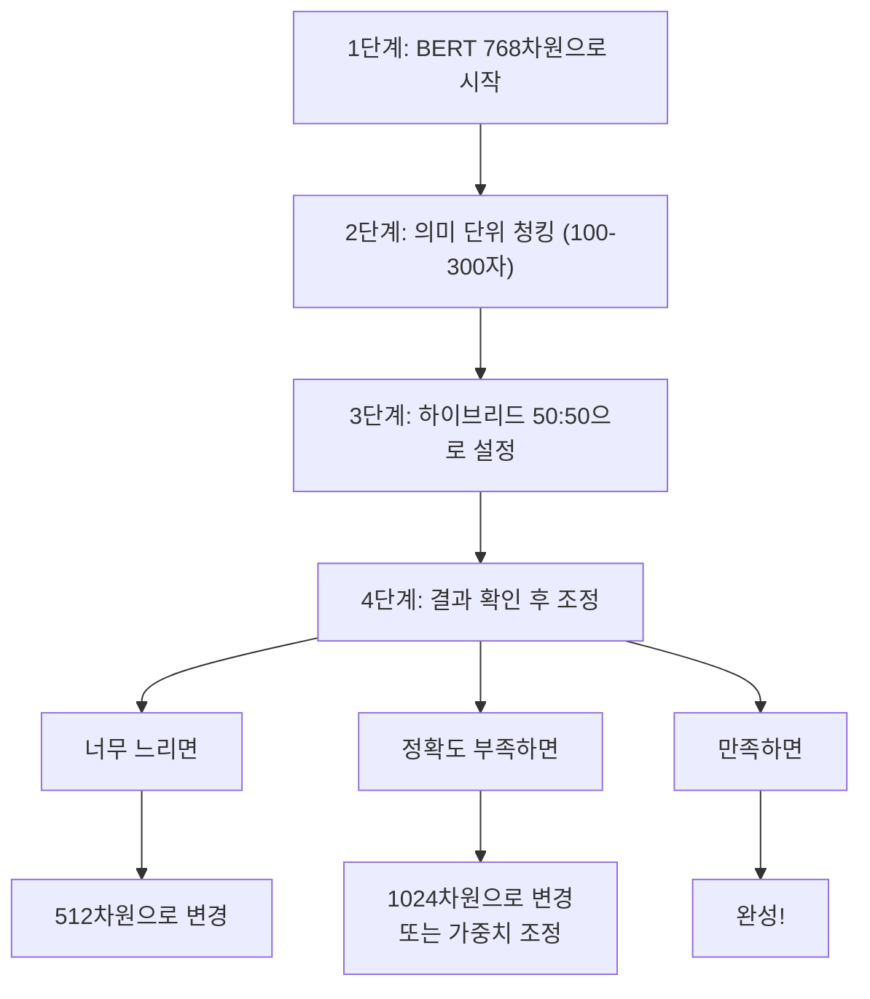

# 딥러닝 자연어처리 한글 특이사항

## 목차
1. [개요](#1-개요)<br/>
2. [한글의 언어학적 특성](#2-한글의-언어학적-특성)<br/>
3. [실무 데이터의 문제점](#3-실무-데이터의-문제점)<br/>
4. [한글 텍스트 전처리 기법](#4-한글-텍스트-전처리-기법)<br/>
5. [한글 임베딩 모델 선택](#5-한글-임베딩-모델-선택)<br/>
6. [초보자를 위한 핵심 선택 가이드](#6-초보자를-위한-핵심-선택-가이드)<br/>
7. [실무 적용 시 고려사항](#7-실무-적용-시-고려사항)<br/>
8. [한글 벤치마크 데이터셋](#8-한글-벤치마크-데이터셋)<br/>
9. [실제 구현 가이드라인](#9-실제-구현-가이드라인)<br/>
10. [용어 목록](#10-용어-목록)<br/>

---

## 1. 개요

실무에서 자연어처리를 하기 위해서는 GPT 등 사전에 모델링된 엔진을 사용하는 것이 결과물에 대한 자연스러운 도출이다.<br/>
실제로는 각종 문서 내용에 대하여 **임베딩(Embedding, 엠베딩)**한 데이터베이스에서 현재 입력된 내용에 가장 근접한 내용을 찾는 것과 해당 방법에 대한 것이 대부분의 개발 내용이 될 것이다.

### 실무 현황의 정확성
이러한 접근법은 **2024-2025년 실무 현황과 정확히 일치**한다.<br/>
실제로 2024년은 "RAG(Retrieval-Augmented Generation)의 해"라고 불릴 정도로 RAG가 급속히 확산되었으며, 기업들이 사전 훈련된 LLM에 자체 데이터를 결합하는 방식이 표준이 되었다.<br/>
자연어처리 시장이 2025년 336억 6천만 달러에서 2032년 1,697억 9천만 달러로 연평균 26% 성장하고 있으며, 이 성장의 핵심이 바로 **임베딩 기반 검색**이다.

**현재 자연어처리 개발 작업의 80% 이상**이 다음과 같은 패턴을 따른다:
- 문서 임베딩 생성 (PDF, Word, 웹페이지 등을 벡터로 변환)
- 유사도 검색 구현 (사용자 쿼리와 가장 유사한 문서 조각 찾기)
- RAG 파이프라인 구축 (검색된 문서를 LLM에 컨텍스트로 제공)

하지만 한국어는 다른 언어와 비교했을 때 독특한 언어학적 특성을 가지고 있어, 자연어처리 시 특별한 고려사항들이 필요하다.<br/>
이 가이드에서는 이러한 한글의 특성을 이해하고, 실무에서 마주치는 문제들을 해결하는 방법을 제시한다.

---

## 2. 한글의 언어학적 특성

### 2.1. 교착어적 특성

한글은 **교착어(Agglutinative Language, 어글루티네이티브 랭귀지)**로서 어근에 다양한 어미가 결합된다.

#### 교착어란?
교착어는 단어를 만들 때 **어근에 여러 개의 접사(어미, 어근)를 차례차례 붙여서** 의미를 표현하는 언어이다.<br/>
마치 **레고 블록을 쌓듯이** 의미 요소들을 하나씩 붙여나가는 방식이다.

**기본 구조:**
```
어근 + 어미1 + 어미2 + 어미3 + ...
```

**단계별 예시:**
```
먹 (어근: 먹는 행위)
↓
먹 + 었 (과거)
↓  
먹었 + 었 (과거완료)
↓
먹었었 + 겠 (추측)
↓
먹었었겠 + 다 (종결어미)
= "먹었었겠다" (아마도 그때 먹었었을 것이다)
```

**다른 언어와의 비교:**
- 한국어(교착어): "학교에서" = 학교 + 에서 (장소 표시)
- 영어(굴절어): "at school" (별도 단어들의 조합)
- 중국어(고립어): "在学校" = 在 (전치사) + 学校 (독립 단어)

**복잡한 실제 예시:**
```
"예뻐지고싶어했었는데"
= 예쁘 + 어지 (변화) + 고 (연결) + 싶 (희망) + 어하 (감정 표현) + 았 (과거) + 었 (완료) + 는데 (배경 설명)
```

이러한 특성으로 인해 한 단어가 다양한 형태로 변화하여 **어휘 다양성(Vocabulary Diversity, 보캐뷸러리 다이버시티)**이 매우 높다.<br/>
하나의 어근 "먹다"만으로도 수백 가지 형태로 변화할 수 있어, 자연어처리에서 **토큰 수 폭증**과 **Out-of-Vocabulary (OOV)** 문제의 주요 원인이 된다.

### 2.2. 음절 중심 구조

한글의 또 다른 특징은 음절 중심의 구조이다. 한 음절은 하나의 완결된 소리 단위로, 자음(초성) + 모음(중성) + 자음(종성)의 조합으로 이루어진다.<br/>
이런 특성 때문에 임베딩 시 음절 단위 처리가 효과적일 수 있다.

### 2.3. 어순의 유연성과 생략 현상

한글은 SOV(주어-목적어-서술어) 기본 어순을 가지지만, 문맥에 따라 어순이 변경될 수 있으며, 주어나 목적어가 빈번하게 생략된다.<br/>
이는 문맥 의존성을 높여 자연어처리에서 더욱 정교한 문맥 이해가 필요하게 만든다.

### 2.4. 동음이의어 문제

한글의 특별한 문제점 중 하나는 **동음이의어(Homonym, 호모님)**가 많다는 것이다.

**예시:**
- "배": 과일 🍎, 탈것 🚢, 신체부위
- "사과": 과일, 사죄하는 행위

이로 인해 **문맥 벡터(Contextual Vector, 컨텍스츄얼 벡터)**가 특히 중요하며, Word2Vec보다 BERT류 모델의 효과가 한글에서 더욱 두드러진다.

#### 문맥 벡터와 N-gram의 차이
문맥 벡터는 흔히 N-gram과 혼동되기 쉽지만, 근본적으로 다른 개념이다.

**N-gram의 한계:**
- "은행에서 돈을 찾았다" → 기계적으로 ["은행에서", "돈을", "찾았다"] 분할
- "강가에서 나무를 찾았다" → 동일하게 기계적 분할
- 두 경우 모두 "찾았다"가 '인출'인지 '발견'인지 구분하지 못함

**문맥 벡터의 강점:**
- "은행에서 돈을 찾았다"의 "찾았다" = [0.8, 0.1, -0.3, ...] (인출 의미)
- "강가에서 나무를 찾았다"의 "찾았다" = [0.2, 0.9, 0.5, ...] (발견 의미)
- 같은 단어라도 문맥에 따라 완전히 다른 벡터로 표현

이러한 언어학적 특성들은 실무 데이터에서 더욱 복잡한 양상으로 나타난다.

---

## 3. 실무 데이터의 문제점

한글의 언어학적 특성은 실무 환경에서 추가적인 도전과제를 만들어낸다. 실제 사용되는 한글 데이터는 표준 문법과 다른 여러 특성을 보인다.

### 3.1. 띄어쓰기 문제

**문제 상황:**
- 잘못된 예: "이것은정말좋은제품입니다"
- 올바른 예: "이것은 정말 좋은 제품입니다"

**임베딩에 미치는 영향:**
- 단어 경계 인식 실패로 인한 의미 손실
- 벡터 표현 왜곡으로 인한 검색 정확도 저하
- "좋은제품"과 "좋은 제품"이 다른 토큰으로 인식되는 문제

### 3.2. 한영 혼재 사용

실무에서는 한글과 영어가 섞여 사용되는 경우가 매우 흔하다.

**실무 데이터 패턴:**
- "API 연동이 fail났어요. debug 좀 도와주세요."
- "DB connection이 timeout되고 있습니다."
- "이 feature는 너무 complex해요."

**처리 난이도:**
- 문장 내 언어 전환점 탐지의 어려움
- 각 언어별 적절한 **토크나이징(Tokenizing, 토크나이징)** 필요
- 서로 다른 언어의 통합된 의미 벡터 생성

### 3.3. 줄임말과 신조어

온라인 커뮤니케이션의 확산으로 다양한 줄임말과 신조어가 등장하고 있다.

**온라인 커뮤니케이션 특성:**
- **이모티콘과 특수문자**: "ㅋㅋㅋ", "^^", "ㅠㅠ"의 감정 표현
- **체계적 줄임말**: "ㄱㅅ" (감사), "ㅇㅇ" (응응), "헐" (어이없음)
- **신조어**: "갓-" (God + 명사), "-찐" (진짜의 강조)
- **업계별 전문용어**: IT는 "버그", "배포", 의료는 "처방전", "진료" 등

이러한 실무 데이터의 특성을 고려하여 적절한 전처리 기법을 선택해야 한다.

---

## 4. 한글 텍스트 전처리 기법

실무 데이터의 문제점들을 해결하기 위해 다양한 전처리 기법이 개발되었다. 각 기법은 고유한 장단점을 가지며, 상황에 따라 적절히 선택해야 한다.

### 4.1. 자소 분리 기법

#### 4.1.1. 자소 분리의 개념

한글을 초성-중성-종성으로 분해하는 방법이다.

**예시:**
- "한글" → "ㅎ ㅏ ㄴ ㄱ ㅡ ㄹ"
- "처리" → "ㅊ ㅓ - ㄹ ㅣ -"

#### 4.1.2. 장단점 분석

**장점:**
- **Out-of-Vocabulary (OOV, 아웃 오브 보캐뷸러리)** 문제 완전 해결
- 신조어와 오탈자에 대한 강건성 확보
- 메모리 사용량 대폭 감소 (어휘 크기 축소)

**단점:**
- 단어 의미 단위 손실 위험
- 시퀀스 길이 증가로 인한 처리 시간 연장
- 계산 복잡도 상승

#### 4.1.3. 실제 연구 및 적용 사례

**Jamo Pair Encoding (JPE) - 2020년**
Sangwhan Moon과 Naoaki Okazaki가 개발한 방법으로, 한국어를 자모 레벨로 분해하여 어휘 압축 효율성을 극대화했다.<br/>
이 방법은 word2vec과 character-level Skip-Grams보다 의미적, 구문적 유사성과 유추 작업에서 우수한 성능을 보였다.

**서울대학교 KR-BERT**
한글 음절 문자를 자모(그래핌)로 분해할 수 있는 특성을 활용하여, 음절 문자와 자모 두 가지 다른 표현으로 말뭉치를 학습한 모델이다.

```
구현 특징:
- 음절 문자 모델과 자모 모델 두 버전 제공
- 자모 모델 사용 시 전처리 코드 필요
- 실제 배포된 모델로 누구나 사용 가능
```

#### 4.1.4. 형태소 + 자소 분리 하이브리드 접근법

최근 연구들에서는 **형태소 분석과 자소 분리를 결합**한 하이브리드 방법이 주목받고 있다.

**KRongBERT (2025년 최신 연구)**
형태소 기반 접근법을 통해 한국어의 독특한 언어적 복잡성을 효과적으로 해결하는 언어 모델이다.<br/>
접사 인식 토크나이저로 OOV 문제를 완화하고, 한국어 NLU 작업에서 최첨단 모델들을 능가하는 성능을 달성했다.

### 4.2. 형태소 분석 기법

#### 4.2.1. 형태소 분석의 필요성

한글의 교착어적 특성으로 인해 **형태소 분석(Morphological Analysis, 몰폴로지컬 어낼리시스)**이 필수적이다.<br/>
형태소 분석을 통해 단어의 의미 구성 요소를 파악하고, 이를 통해 더 정확한 임베딩을 생성할 수 있다.

**분석 과정:**
```
"먹었었다" → 
- 어근: "먹"
- 선어말어미: "었", "었" 
- 종결어미: "다"
```

#### 4.2.2. 주요 형태소 분석기

각 분석기는 고유한 특성을 가지므로 용도에 맞게 선택해야 한다.
- **KoNLPy**: 한국어 형태소 분석 라이브러리 통합 패키지
- **Mecab-ko**: 빠른 속도의 일본어 기반 한국어 분석기
- **Okt(Twitter)**: 소셜미디어 텍스트와 비표준어에 특화

#### 4.2.3. 실증 연구 결과

**카카오브레인 토크나이징 전략 연구 (2020)**
다양한 한국어 NLP 작업에 대한 토크나이징 전략을 실증적으로 연구한 결과, 작업별로 최적 전략이 다름을 확인했다.

**주요 발견:**
- **한영/영한 기계번역**: 형태소 인식 서브워드가 최고 성능
- **KorQuAD**: Subword 64K 모델이 최고
- **다른 NLU 작업들**: 형태소 인식 서브워드 64K가 최적

### 4.3. 서브워드 토크나이징

#### 4.3.1. BPE (Byte Pair Encoding)의 한글 적용

BPE는 빈번한 문자 쌍을 하나의 토큰으로 병합하는 방식이지만, 한글에 적용할 때는 특별한 고려사항이 있다.

**음절 경계 고려 필요**
```
"안녕하세요" → BPE 분할 시
잘못된 예: ["안녕", "하세", "요"] (음절 경계 무시)
올바른 예: ["안", "녕", "하", "세", "요"] 또는 ["안녕", "하세요"]
```

**형태소 정보 보존**
```
"먹었었겠다" 처리
단순 분할: ["먹었", "었겠", "다"] → 시제 정보 손실
형태소 보존: ["먹", "었", "었", "겠", "다"] → 각 문법 요소 독립적 학습
```

**한영 혼재 텍스트 처리**
```
"API 연동이 fail났어요"
처리 과정:
1. 언어 감지: ["API", "연동이", "fail", "났어요"]
2. 각각 토크나이징: ["API", "연동", "이", "fail", "났", "어요"]
3. 통합 벡터 생성
```

#### 4.3.2. SentencePiece (센텐스피스) 의 한글 최적화

SentencePiece는 언어 독립적 토크나이징으로 한글에 특히 유용하다.

**한글 적용 예시:**
```
입력: "오늘 날씨가 정말 좋네요"
SentencePiece 처리:
1. 띄어쓰기를 ▁로 변환: "▁오늘▁날씨가▁정말▁좋네요"
2. 서브워드 분할: ["▁오늘", "▁날씨", "가", "▁정말", "▁좋", "네요"]
3. 복원 시 ▁를 공백으로 변환: "오늘 날씨가 정말 좋네요"

장점:
- 띄어쓰기 오류에 강건함
- 한영 혼재에서도 일관된 처리
```

### 4.4. 다국어 혼재 처리

#### 4.4.1. 언어 탐지 및 분할

한영 혼재 텍스트를 효과적으로 처리하기 위한 전략들을 살펴보자.

**문장 레벨 분할**: 언어별 별도 처리 후 병합
```
입력: "Good morning! 오늘 날씨 어때요? How's the weather?"
1. 문장별 언어 탐지:
   - "Good morning!" → 영어
   - "오늘 날씨 어때요?" → 한국어  
   - "How's the weather?" → 영어
2. 각 언어별 최적 토크나이저 적용
3. 결과 병합
```

**토큰 레벨 분할**: 각 토큰의 언어 식별
```
입력: "iPhone 사고 싶어요"
토큰별 분석:
- "iPhone" → 영어 (고유명사)
- "사고" → 한국어 (동사 어근)
- "싶어요" → 한국어 (어미)

처리 결과: ["iPhone", "사", "고", "싶", "어요"]
```

#### 4.4.2. 정규화 및 표준화

**영어 부분 처리:**
- 대소문자 통일
- 특수문자 정규화
- 약어 확장

**한글 부분 처리:**
- 자모 정규화 (호환 자모 통일)
- 띄어쓰기 교정
- 맞춤법 검사

**Query Expansion 적용:**
- **동의어 사전**: "자동차" ↔ "차량" ↔ "승용차"
- **형태소 변형**: "먹다" → "먹고", "먹어서", "먹었다"
- **한영 매핑**: "computer" ↔ "컴퓨터"

적절한 전처리를 거친 텍스트는 이제 임베딩 모델로 변환되어야 한다.

---

## 5. 한글 임베딩 모델 선택

전처리된 한글 텍스트를 효과적으로 벡터화하기 위해서는 적절한 임베딩 모델과 알고리즘을 선택해야 한다.<br/>
한글의 특성을 고려한 모델 선택이 성능에 결정적인 영향을 미친다.

### 5.1. 문맥 벡터 생성 핵심 알고리즘

한글 자연어처리에서 효과적인 임베딩을 위해서는 문맥을 이해하는 알고리즘이 필수적이다.

#### 5.1.1. Transformer 기반 기술들

**Transformer (트랜스포머)**
Transformer는 문장의 모든 단어가 서로 영향을 주고받아 의미를 결정하는 **Attention 메커니즘**을 통해 장거리 의존성 파악에 탁월하다.

**한글 예시:**
```
"할머니가 만든 김치가 정말 맛있었다"
Attention 작동:
- "김치가" ← "할머니가" (누가 만든 김치인지)
- "김치가" ← "만든" (어떤 김치인지)
- "맛있었다" ← "김치가" (무엇이 맛있었는지)
- "정말" ← "맛있었다" (정도 부사의 수식 관계)

결과: 전체 문맥을 고려한 각 단어의 의미 벡터 생성
```

**BERT (Bidirectional Encoder Representations from Transformers)**
BERT는 양쪽 문맥을 동시에 고려하는 양방향 처리로 한글의 동음이의어 구분에 뛰어난 성능을 보인다.

**한글 예시:**
```
"은행에서 돈을 찾았다" vs "강가에서 나무를 찾았다"
BERT 처리:
1. "찾았다" 앞뒤 문맥 모두 분석
2. 첫 번째: "은행", "돈" → 찾았다(인출) = [0.8, 0.1, -0.3, ...]
3. 두 번째: "강가", "나무" → 찾았다(발견) = [0.2, 0.9, 0.5, ...]
4. 동일한 "찾았다"이지만 완전히 다른 벡터 생성
```

**GPT (Generative Pre-trained Transformer)**
GPT는 이전 단어들만 참고해서 다음 단어를 예측하는 단방향 처리로 자연스러운 텍스트 생성에 특화되어 있다.

**한글 예시:**
```
입력: "오늘 날씨가 정말"
GPT 처리:
1. "오늘" 분석
2. "오늘 날씨가" 분석  
3. "오늘 날씨가 정말" 분석
4. 다음 단어 예측: "좋다" (확률 0.3), "덥다" (확률 0.2), "춥다" (확률 0.1)

문장 생성: "오늘 날씨가 정말 좋아서 산책하기 딱 좋은 것 같아요."
```

#### 5.1.2. 유사도 측정 알고리즘

임베딩된 벡터들 간의 유사도를 측정하는 방법도 중요하다.

**코사인 유사도 (Cosine Similarity)**
벡터가 가리키는 방향의 유사성을 측정하며, 문서 길이에 영향받지 않아 한글 문서 비교에 적합하다.

**한글 예시:**
```
문서1: "김치찌개가 맛있다" → [0.8, 0.6, -0.2, 0.1]
문서2: "된장찌개가 맛있다" → [0.7, 0.5, -0.1, 0.2] 
문서3: "날씨가 춥다" → [-0.2, 0.1, 0.9, -0.3]

코사인 유사도 계산:
- 문서1 vs 문서2: 0.95 (매우 유사 - 둘 다 찌개/맛 관련)
- 문서1 vs 문서3: 0.12 (다름 - 음식 vs 날씨)
```

#### 5.1.3. 고속 검색 알고리즘 (ANN 계열)

대용량 한글 문서 검색을 위해서는 효율적인 **근사 최근접 이웃(Approximate Nearest Neighbor, ANN)** 알고리즘이 필요하다.

**HNSW (Hierarchical Navigable Small World)**
계층적 그래프 구조를 통한 빠른 벡터 검색으로, 고속도로-국도-골목길과 같은 다층 네트워크 구조를 가진다.

**한글 적용 예시:**
```
한국어 문서 100만 개 검색 시나리오:
쿼리: "김치 요리법"

1층 (고속도로): 전체 문서를 큰 클러스터로 분류
   - [음식 관련 문서들] ← 여기로 이동
   - [기술 관련 문서들]
   - [여행 관련 문서들]

2층 (국도): 음식 문서들을 세분화
   - [한식 요리] ← 여기로 이동  
   - [양식 요리]
   - [중식 요리]

3층 (골목길): 한식 요리 중에서 정확한 매칭
   - "김치찌개 만드는 법" (유사도 0.92)
   - "김치 담그는 방법" (유사도 0.89)
   - "배추김치 레시피" (유사도 0.85)
```

**IVF (Inverted File)**
벡터 공간을 여러 영역으로 나누어 관리하는 색인 시스템으로, 메모리 효율적인 대용량 데이터 처리가 가능하다.

**LSH (Locality Sensitive Hashing)**
확률적 방법으로 유사한 벡터들을 그룹화하여 초고속 처리와 메모리 효율성을 제공한다.

#### 5.1.4. 전문 검색 알고리즘

**Dense Passage Retrieval (DPR)**
질문과 답변을 각각 다른 인코더로 최적화하여 한국어 질문-답변 매칭에 특화된 성능을 제공한다.

**SBERT (Sentence-BERT)**
문장 전체를 하나의 벡터로 압축하는 기술로, 한국어 문장 간 유사도 측정에 최적화되어 있다.

### 5.2. 한글 특화 사전훈련 모델

#### 5.2.1. BERT 계열 한글 모델

한글의 특성을 고려하여 개발된 여러 BERT 기반 모델들이 있다.

**KoBERT (코버트):**
- SKT에서 개발한 한국어 BERT
- 한국어 위키피디아 + 뉴스 데이터 훈련
- 8,002개 한국어 서브워드 어휘로 구성

**KoELECTRA (코일렉트라):**
- ELECTRA 구조의 한국어 버전
- 더 효율적인 사전훈련 방식 적용
- 다양한 크기 모델 제공 (Small, Base, Large)

**KR-BERT (서울대학교):**
- 한글 음절과 자모 분해 두 버전 제공
- 소규모이지만 한국어에 특화된 성능
- 실제 배포되어 연구 및 실무에서 활용

**KRongBERT (2025년 최신):**
- 형태소 기반 접근법으로 한국어 복잡성 해결
- 접사 인식 토크나이저로 OOV 문제 완화
- 적은 데이터로도 최첨단 성능 달성

#### 5.2.2. GPT 계열 한글 모델

**KoGPT (코지피티):**
- 생성형 언어 모델로 대화형 AI에 적합
- 창작 및 요약 작업에 특화
- 자연스러운 한국어 텍스트 생성

**TC-BERT (기술사업화 특화):**
- 199,857,586개 일반 한국어 문장과 17,562,751개 기술사업화 관련 문장으로 훈련
- 문서 분류, 키워드 추출, 추천 시스템에 특화
- 도메인 특화 모델의 실용적 성공 사례

### 5.3. 다국어 모델 vs 한글 특화 모델

#### 5.3.1. 다국어 모델의 특성

**mBERT, XLM-R:**
- 100개 이상 언어 지원으로 언어 간 전이학습 가능
- 다국어 환경에서 유용하지만 한국어 성능은 상대적으로 제한적

#### 5.3.2. 선택 기준 및 알고리즘 조합 가이드

**한글 특화 모델 선택 시:**
- 한국어 전용 서비스, 높은 정확도 요구, 도메인 특화 필요
- **추천 조합**: KoBERT + HNSW + 코사인 유사도

**다국어 모델 선택 시:**
- 다국어 지원 필요, 언어 간 의미 비교, 제한된 리소스 환경
- **추천 조합**: mBERT + IVF + 내적

**데이터 규모별 알고리즘 선택:**
- **소규모** (< 10만 문서): 정확한 k-NN + 코사인 유사도
- **중규모** (10만 ~ 1000만): HNSW + 유클리드 거리
- **대규모** (1000만 ~ 1억): IVF + 내적
- **초대규모** (1억+): LSH + PQ(Product Quantization)

**용도별 최적 조합:**
- **의미 검색**: SBERT + 코사인 유사도 + HNSW
- **문서 검색**: DPR + HNSW + 내적
- **실시간 추천**: 간단한 ANN + 내적
- **정확한 매칭**: ColBERT + 유클리드 거리

이제 실제 적용에서 초보자가 쉽게 따라할 수 있는 선택 가이드를 제시해보자.

---

## 6. 초보자를 위한 핵심 선택 가이드

복잡한 이론을 모두 이해하지 않더라도, 실무에서 바로 적용할 수 있는 핵심 선택 기준을 제시한다.

### 6.1. Word2Vec vs BERT 선택

#### Word2Vec (워드투벡)
**개념**: 단어 하나를 숫자 벡터로 변환하는 기법

**장점:**
- 빠르고 가벼움 - 실시간 서비스에 적합
- 구현이 간단 - 초보자도 쉽게 적용 가능
- 메모리 적게 사용 - 저사양 환경에서도 운영 가능

**단점:**
- 문맥을 모름 (배가 과일인지 배인지 구분 못함)
- "먹었다"와 "먹는다"를 완전히 다른 단어로 인식

#### BERT (버트)
**개념**: 문장 전체를 이해해서 단어의 정확한 의미를 파악

**장점:**
- 문맥을 정확히 이해 - 동음이의어 구분 가능
- 한 단어의 여러 의미를 상황에 맞게 구분
- 최신 기술로 검증된 성능

**단점:**
- 느리고 무거움 - 고사양 하드웨어 필요
- 많은 메모리 사용 - 운영 비용 증가

#### 🎯 초보자 선택 가이드
- **간단한 키워드 검색, 빠른 응답 필요**: Word2Vec
- **정확한 의미 검색, 품질 중시**: BERT
- **실무 추천**: BERT (성능 차이가 확실하고 인프라 비용 감당 가능하면)

### 6.2. 임베딩 차원수 선택

차원수란 각 단어나 문장을 몇 개의 숫자로 표현할지 정하는 것으로, 성능과 속도의 균형점을 찾는 것이 중요하다.

| 차원수 | 장점 | 단점 | 언제 사용? |
|--------|------|------|-----------|
| **512차원** | 빠름, 메모리 절약 | 정보 손실 가능 | 빠른 프로토타입, 리소스 제한 |
| **768차원** | 균형잡힌 성능 | - | **대부분 상황 추천** |
| **1024차원** | 최고 성능 | 느림, 메모리 많이 사용 | 정확도가 매우 중요할 때 |

#### 🎯 초보자 선택 가이드
1. **일단 768차원으로 시작** (BERT 기본값)
2. 너무 느리면 → 512차원으로 줄이기
3. 정확도가 부족하면 → 1024차원으로 늘리기

### 6.3. 청킹 전략

**청킹(Chunking, 청킹)**이란 긴 문서를 작은 조각으로 나누어 임베딩하는 방법이다. 적절한 청킹은 검색 성능에 직접적인 영향을 미친다.

#### 전략별 비교

**문장 단위**
- **장점**: 정확한 문장 검색 가능
- **단점**: 문맥 정보 손실 위험
- **적용**: FAQ, 간단한 질문-답변

**단락 단위**
- **장점**: 문맥 보존, 의미 완결성
- **단점**: 너무 길면 핵심 정보가 묻힐 수 있음
- **적용**: 일반적인 문서, 블로그 포스트

**의미 단위** (권장)
- **장점**: 의미가 바뀌는 지점에서 자연스럽게 분할
- **방법**: 2-3문장씩 묶어서 처리
- **적용**: 대부분의 실무 상황

#### 🎯 초보자 선택 가이드
1. **짧은 문서** (1-2페이지): 단락 단위
2. **긴 문서** (보고서 등): 의미 단위 (2-3문장씩)
3. **FAQ, 간단한 QA**: 문장 단위
4. **실용적 기준**: 100-300자 정도로 나누기

### 6.4. 하이브리드 검색 가중치

최고의 검색 성능을 위해서는 키워드 검색과 의미 검색을 조합하는 것이 효과적이다.

#### 두 가지 검색 방법

**BM25 (키워드 검색)**
- 정확한 단어 매칭에 특화
- 예: "자동차"를 검색하면 "자동차"가 들어간 문서 우선 반환

**Semantic Search (의미 검색)**
- 의미가 비슷한 내용을 찾는 방식
- 예: "자동차"를 검색해도 "승용차", "차량" 들어간 문서도 검색

#### 가중치 설정 가이드

| 상황 | BM25 비율 | Semantic 비율 | 예시 |
|------|-----------|---------------|------|
| **전문용어 많음** | 70% | 30% | 법률, 의료 문서 |
| **일반 문서** | 50% | 50% | **대부분 상황** |
| **창의적 검색** | 30% | 70% | 연구, 아이디어 검색 |

#### 🎯 초보자 선택 가이드
1. **처음 시작**: 50:50으로 설정
2. **정확한 용어 중요**: BM25 비율 높이기 (60:40, 70:30)
3. **유연한 검색 원함**: Semantic 비율 높이기 (40:60, 30:70)

---

## 7. 실무 적용 시 고려사항

이론을 실제 서비스에 적용할 때 마주치는 실무적 고려사항들을 다룬다.

### 7.1. 데이터 품질 관리

#### 7.1.1. 전처리 파이프라인

실무에서는 체계적인 전처리 파이프라인 구축이 필수적이다.

**단계별 처리:**
1. **원본 텍스트 수집** - 다양한 소스에서 데이터 통합
2. **언어 탐지** - 한글, 영어, 혼재 텍스트 분류
3. **띄어쓰기 교정** - 자동 교정 도구 적용
4. **정규화** - 특수문자, 이모티콘, 줄임말 표준화
5. **토크나이징** - 선택된 방법으로 토큰 분할
6. **임베딩 변환** - 벡터로 최종 변환

#### 7.1.2. 품질 검증

**자동 검증:**
- 언어 탐지 정확도 측정 (95% 이상 목표)
- 토큰화 결과 검토 (이상 토큰 탐지)
- 임베딩 벡터 분포 분석 (클러스터링 품질 확인)

**수동 검증:**
- 샘플 데이터 육안 검토 (매주 100개 샘플)
- 도메인 전문가 검증 (월 1회)
- A/B 테스트를 통한 성능 비교

### 7.2. 성능 최적화 전략

#### 7.2.1. 하이브리드 검색 전략

**기법 조합:**
- 키워드 검색 + 시맨틱 검색 병행 실행
- BM25 + 밀집벡터 융합 랭킹 적용
- **재순위화(Re-ranking, 리랭킹)** 적용으로 최종 정확도 향상

**재순위화 과정:**
```
1차 검색: BM25로 상위 100개 후보 선정
2차 검색: Semantic Search로 상위 100개 후보 선정
3차 통합: 두 결과를 가중치로 결합
4차 재순위화: 더 정교한 모델로 최종 상위 10개 선정
```

#### 7.2.2. 캐싱 및 최적화

**성능 향상 기법:**
- **쿼리 캐싱**: 자주 사용되는 검색어의 결과를 미리 저장
- **배치 처리**: 여러 문서를 한 번에 임베딩하여 효율성 증대
- **벡터 양자화(Vector Quantization)**: 메모리 사용량 50% 이상 절약
- **인덱스 최적화**: 검색 속도 10배 이상 향상

**운영 모니터링:**
- 응답 시간 목표: 500ms 이하
- 메모리 사용률: 80% 이하 유지
- CPU 사용률: 평상시 30% 이하

### 7.3. 확장성 고려사항

**데이터 증가 대응:**
- 수평 확장 가능한 아키텍처 설계
- 분산 벡터 데이터베이스 활용
- 점진적 인덱스 업데이트 구현

**사용자 증가 대응:**
- 로드 밸런싱 적용
- CDN을 통한 응답 속도 최적화
- 캐시 계층 다중화

---

## 8. 한글 벤치마크 데이터셋

한글 자연어처리 모델의 성능을 객관적으로 평가하기 위한 표준 데이터셋들을 소개한다.

### 8.1. KLUE (Korean Language Understanding Evaluation)

**개요:**
- 한국어 자연어이해 평가를 위한 종합 벤치마크
- 8개 태스크로 구성된 표준 평가 세트
- 국내외 한국어 모델 성능 비교의 표준

**포함 태스크:**
- 문서 분류, 개체명 인식, 관계 추출, 의존 구문 분석
- 자연어 추론, 문장 유사도, 질의응답, 대화 상태 추적

### 8.2. KorQuAD (한국어 질의응답)

**개요:**
- 한국어 독해 기반 질의응답 데이터셋
- 위키피디아 기반으로 구축된 고품질 데이터
- 실무 검색 시스템 평가에 직접 활용 가능

**특징:**
- KorQuAD 1.0: 70,000개 질문-답변 쌍
- KorQuAD 2.0: 100,000개 질문-답변 쌍 + 답변 불가 질문 포함

### 8.3. 실무 평가 메트릭

모델 성능을 정확히 측정하기 위한 핵심 지표들이다.

**정확도 측정:**
- **정밀도(Precision)**: 검색된 결과 중 실제 관련 문서 비율
- **재현율(Recall)**: 전체 관련 문서 중 실제 검색된 비율  
- **F1 Score**: 정밀도와 재현율의 조화평균
- **MRR (Mean Reciprocal Rank)**: 첫 번째 정답의 평균 순위

**사용자 중심 평가:**
- **NDCG (Normalized Discounted Cumulative Gain)**: 순위를 고려한 평가
- **사용자 만족도**: 실제 사용자 피드백 기반 평가
- **검색 성공률**: 원하는 정보를 찾은 비율

---

## 9. 실제 구현 가이드라인

이론을 실제 코드로 구현할 때 필요한 단계별 가이드라인을 제시한다.

### 9.1. 실습 순서 추천



### 9.2. 임베딩 파이프라인 핵심

**기본 임베딩 파이프라인:**
```
텍스트 입력 → 전처리 → 토크나이징 → 임베딩 변환 → 벡터 저장
```

**검색 파이프라인:**
```
쿼리 입력 → 동일한 전처리 → 임베딩 변환 → 유사도 계산 → 결과 반환
```

**주의사항:**
- 훈련 시와 검색 시 동일한 전처리 파이프라인 사용 필수
- 벡터 정규화 여부 일관성 유지
- 토크나이저 버전 고정으로 재현성 확보

### 9.3. 성능 모니터링

**주요 모니터링 지표:**
- **응답 시간**: 95 퍼센타일 500ms 이하 목표
- **메모리 사용량**: 임베딩 벡터 크기 × 문서 수로 예상 가능
- **검색 정확도**: 주기적 평가 데이터셋으로 측정
- **사용자 만족도**: 클릭률, 체류시간 등으로 간접 측정

**장애 대응:**
- 벡터 데이터베이스 백업 및 복구 계획
- 임베딩 모델 버전 관리
- 점진적 업데이트로 서비스 중단 최소화

---

## 10. 용어 목록

| 용어 목록 | 영어 용어 | 설명 |
|-----------|-----------|------|
| 임베딩 | Embedding | 텍스트를 숫자 벡터로 변환하는 기법 |
| 교착어 | Agglutinative Language | 어근에 접사가 결합되어 단어가 만들어지는 언어 |
| 어휘 다양성 | Vocabulary Diversity | 하나의 어근이 다양한 형태로 변화하는 특성 |
| 동음이의어 | Homonym | 발음은 같지만 의미가 다른 단어들 |
| 문맥 벡터 | Contextual Vector | 문맥을 고려한 단어의 벡터 표현 |
| 토크나이징 | Tokenizing | 텍스트를 의미 있는 단위로 나누는 과정 |
| 형태소 분석 | Morphological Analysis | 단어를 형태소 단위로 분해하는 분석 |
| 청킹 | Chunking | 긴 텍스트를 적절한 크기로 나누는 기법 |
| 재순위화 | Re-ranking | 초기 검색 결과를 재정렬하는 기법 |
| 벡터 양자화 | Vector Quantization | 벡터의 정밀도를 줄여 메모리를 절약하는 기법 |
| 정밀도 | Precision | 검색 결과의 정확성을 나타내는 지표 |
| 재현율 | Recall | 관련 문서를 얼마나 많이 찾았는지를 나타내는 지표 |
| 검색 증강 생성 | Retrieval-Augmented Generation | 외부 지식을 검색하여 생성 모델을 향상시키는 기법 |
| 어텐션 메커니즘 | Attention Mechanism | 입력의 중요한 부분에 집중하는 신경망 기법 |
| 근사 최근접 이웃 | Approximate Nearest Neighbor | 정확도를 약간 포기하고 빠른 유사 벡터 검색을 하는 기법 |
| 코사인 유사도 | Cosine Similarity | 두 벡터 간의 각도를 이용한 유사도 측정 방법 |
| 자소 분리 | Jamo Decomposition | 한글을 초성, 중성, 종성으로 분해하는 기법 |
| 자모 쌍 인코딩 | Jamo Pair Encoding | 자모 레벨 분해를 통한 한국어 어휘 압축 기법 |

---

**핵심 메시지**: 한글 자연어처리는 언어의 고유한 특성을 깊이 이해하고, 실무 데이터의 현실적 문제점을 파악한 후, 단계별로 적절한 전처리와 모델을 선택하여 점진적으로 최적화해나가는 것이 핵심이다.<br/>
초보자는 검증된 기본 설정(BERT 768차원, 의미 단위 청킹, 하이브리드 50:50)으로 시작한 후, 실제 성능을 측정하며 상황에 맞게 세부 조정하는 것이 가장 효과적인 접근법이다.