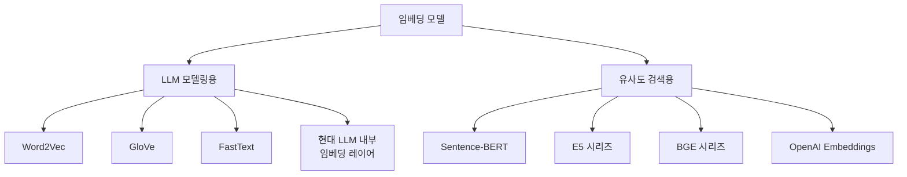
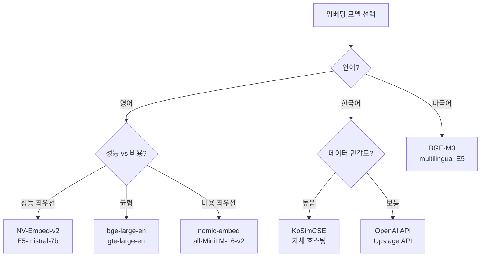

# LLM 임베딩 모델: 종류, 사용처, 언어별 특성

## 목차

1. [서론](#1-서론)<br/>
   1.1. [임베딩이란 무엇인가](#11-임베딩이란-무엇인가)<br/>
   1.2. [임베딩의 두 가지 주요 용도](#12-임베딩의-두-가지-주요-용도)<br/>
   1.3. [문서의 범위](#13-문서의-범위)<br/>

2. [사용처에 따른 임베딩 분류](#2-사용처에-따른-임베딩-분류)<br/>
   2.1. [LLM 모델링용 임베딩](#21-llm-모델링용-임베딩)<br/>
   2.2. [유사도 검색용 임베딩](#22-유사도-검색용-임베딩)<br/>
   2.3. [두 가지 접근의 근본적 차이](#23-두-가지-접근의-근본적-차이)<br/>

3. [LLM 모델링용 임베딩의 발전사](#3-llm-모델링용-임베딩의-발전사)<br/>
   3.1. [1세대: 정적 임베딩 (2013-2016)](#31-1세대-정적-임베딩-2013-2016)<br/>
   3.2. [2세대: 문맥 기반 임베딩 (2017-2019)](#32-2세대-문맥-기반-임베딩-2017-2019)<br/>
   3.3. [현대 LLM의 내부 임베딩 구조](#33-현대-llm의-내부-임베딩-구조)<br/>

4. [유사도 검색용 임베딩 모델](#4-유사도-검색용-임베딩-모델)<br/>
   4.1. [초기 접근법의 한계](#41-초기-접근법의-한계)<br/>
   4.2. [Sentence-BERT의 혁신 (2019)](#42-sentence-bert의-혁신-2019)<br/>
   4.3. [대조 학습 기반 모델들 (2021-2023)](#43-대조-학습-기반-모델들-2021-2023)<br/>
   4.4. [상용 임베딩 모델](#44-상용-임베딩-모델)<br/>
   4.5. [최신 오픈소스 모델 (2024-2025)](#45-최신-오픈소스-모델-2024-2025)<br/>

5. [언어별 임베딩 모델 특성](#5-언어별-임베딩-모델-특성)<br/>
   5.1. [영어 중심 모델](#51-영어-중심-모델)<br/>
   5.2. [한국어 특화 모델](#52-한국어-특화-모델)<br/>
   5.3. [다국어 모델](#53-다국어-모델)<br/>
   5.4. [언어별 성능 비교 및 선택 가이드](#54-언어별-성능-비교-및-선택-가이드)<br/>

6. [아키텍처별 특수 모델](#6-아키텍처별-특수-모델)<br/>
   6.1. [Long Context 임베딩](#61-long-context-임베딩)<br/>
   6.2. [Matryoshka 임베딩 (가변 차원)](#62-matryoshka-임베딩-가변-차원)<br/>
   6.3. [Multi-granularity 임베딩](#63-multi-granularity-임베딩)<br/>

7. [성능 벤치마크 및 비교](#7-성능-벤치마크-및-비교)<br/>
   7.1. [MTEB 벤치마크](#71-mteb-벤치마크)<br/>
   7.2. [주요 모델 성능 비교](#72-주요-모델-성능-비교)<br/>
   7.3. [언어별 성능 차이](#73-언어별-성능-차이)<br/>

8. [실무 선택 가이드](#8-실무-선택-가이드)<br/>
   8.1. [사용 목적에 따른 선택](#81-사용-목적에-따른-선택)<br/>
   8.2. [언어에 따른 선택](#82-언어에-따른-선택)<br/>
   8.3. [성능 vs 비용 트레이드오프](#83-성능-vs-비용-트레이드오프)<br/>
   8.4. [오픈소스 vs 상용 모델](#84-오픈소스-vs-상용-모델)<br/>

9. [결론](#9-결론)<br/>
   9.1. [임베딩 기술의 미래 방향](#91-임베딩-기술의-미래-방향)<br/>
   9.2. [주요 트렌드 요약](#92-주요-트렌드-요약)<br/>

[용어 목록](#용어-목록)<br/>

[참고 문헌](#참고-문헌)<br/>

---

## 1. 서론

### 1.1. 임베딩이란 무엇인가

임베딩(Embedding)은 텍스트를 컴퓨터가 이해하고 처리할 수 있는 수치 벡터로 변환하는 기술이다. 인간의 언어를 기계가 이해할 수 있는 형태로 표현하는 것이 자연어 처리(NLP)의 핵심 과제인데, 임베딩은 이를 가능하게 하는 근간 기술이다.

예를 들어, "강아지"라는 단어를 `[0.2, 0.5, -0.1, 0.8, ...]`와 같은 수백 차원의 벡터로 변환하면, 컴퓨터는 이 벡터를 통해 단어 간의 의미적 유사성을 계산하고 관계를 파악할 수 있다. 의미가 비슷한 단어들은 벡터 공간에서 가까운 위치에 배치되는 특성이 있다.

### 1.2. 임베딩의 두 가지 주요 용도

임베딩 기술은 사용 목적에 따라 크게 두 가지로 구분된다:

1. **LLM 모델링용 임베딩**: LLM(Large Language Model)을 학습시키거나 모델 내부에서 텍스트를 표현하는 용도
2. **유사도 검색용 임베딩**: 문서나 문장의 의미적 유사도를 계산하여 검색, 추천 등에 활용하는 용도

이 두 가지는 완전히 다른 목적과 학습 방법을 가지고 있으며, 실무에서 사용되는 방식도 상이하다.



### 1.3. 문서의 범위

본 문서는 임베딩 모델의 전반적인 발전 과정을 다루되, 특히 유사도 검색용 임베딩 모델에 초점을 맞춘다. 각 모델의 수학적 원리보다는 개념과 특징, 그리고 실무 활용 관점에서의 비교를 중심으로 설명한다. 또한, 영어뿐만 아니라 한국어와 다국어 모델의 특성도 함께 다룬다.

---

## 2. 사용처에 따른 임베딩 분류

### 2.1. LLM 모델링용 임베딩

#### 2.1.1. 정의 및 역할

LLM 모델링용 임베딩은 언어 모델의 **내부 구성 요소**로서, 토큰(단어 또는 서브워드)을 수치 벡터로 변환하는 첫 번째 레이어다. 이 임베딩은 모델이 "생각"하기 위한 내부 표현이며, 다음 토큰 예측이나 텍스트 생성 같은 언어 모델링 작업을 위해 학습된다.

**주요 특징:**
- 토큰별로 별도의 벡터 생성 (가변 길이)
- 모델 내부에서만 사용되며 직접 접근 불가
- 다음 토큰 예측, 빈칸 채우기 등을 목표로 학습

#### 2.1.2. 사용 시점

- **모델 개발 단계**: GPT, BERT, LLaMA와 같은 LLM을 처음부터 학습시킬 때
- **연구 목적**: 모델 내부 동작 분석이나 인터프리터빌리티(interpretability) 연구

일반 개발자가 LLM API(ChatGPT, Claude 등)를 사용할 때는 이 임베딩 레이어와 직접 상호작용하지 않는다.

### 2.2. 유사도 검색용 임베딩

#### 2.2.1. 정의 및 역할

유사도 검색용 임베딩은 문장이나 문서 전체를 **고정된 길이의 단일 벡터**로 변환하여, 의미적으로 유사한 텍스트끼리 벡터 공간에서 가까이 위치하도록 설계된 모델이다. 이 벡터들은 코사인 유사도(cosine similarity) 같은 간단한 수학적 계산으로 직접 비교할 수 있다.

**주요 특징:**
- 문장/문서당 하나의 고정 크기 벡터 출력
- 의미적 유사도 계산에 최적화
- 대조 학습(contrastive learning)으로 훈련

#### 2.2.2. 사용 시점

- **RAG(Retrieval-Augmented Generation) 시스템**: LLM에 관련 문서를 제공하기 위한 검색
- **시맨틱 서치(Semantic Search)**: 의미 기반 검색 엔진
- **추천 시스템**: 유사한 상품이나 콘텐츠 추천
- **중복 탐지**: 표절 검사나 유사 문서 찾기

### 2.3. 두 가지 접근의 근본적 차이

| 특성 | LLM 모델링용 | 유사도 검색용 |
|------|-------------|--------------|
| **출력 형태** | 토큰별 벡터 (가변 길이) | 문장당 단일 벡터 (고정 길이) |
| **벡터 크기** | 가변 (문장 길이에 따라 다름) | 고정 (모든 문장이 같은 크기) |
| **학습 목표** | 다음 토큰 예측, 언어 이해 | 의미적 유사도 계산 |
| **직접 사용** | 불가 (모델 내부용) | 가능 (API/라이브러리로 접근) |
| **주요 활용** | LLM 내부 연산 | RAG, 검색, 추천 시스템 |
| **비교 가능성** | 어려움 (길이가 다름) | 용이 (코사인 유사도) |

**핵심 차이점:**

LLM 모델링용 임베딩은 "언어 모델이 작동하기 위한 내부 표현"이며, 유사도 검색용 임베딩은 "의미를 비교하기 위해 특별히 설계된 표현"이다. 전자는 모델 학습 시에만 관여하고, 후자는 완성된 모델을 실무에서 활용할 때 사용한다.

---

## 3. LLM 모델링용 임베딩의 발전사

### 3.1. 1세대: 정적 임베딩 (2013-2016)

#### 3.1.1. Word2Vec (2013)

**개발**: Google (Tomas Mikolov 등)

**핵심 개념**: 
Word2Vec은 신경망을 이용해 단어를 벡터로 표현하는 최초의 효과적인 방법 중 하나다. "비슷한 문맥에 나타나는 단어는 비슷한 의미를 가진다"는 분포 가설(distributional hypothesis)을 기반으로 한다.

**두 가지 아키텍처**:
- **CBOW(Continuous Bag of Words)**: 주변 단어로 중심 단어 예측
- **Skip-gram**: 중심 단어로 주변 단어 예측

**장점**:
- 학습 속도가 빠름
- 단어 간 의미적 관계 포착 (예: "왕 - 남자 + 여자 = 여왕")
- 계산 효율적

**한계**:
- 단어마다 하나의 고정된 벡터만 가짐 (동음이의어 구분 불가)
- 문맥을 고려하지 못함

#### 3.1.2. GloVe (2014)

**개발**: Stanford University

**핵심 개념**:
GloVe(Global Vectors for Word Representation)는 Word2Vec과 달리 말뭉치(corpus) 전체의 통계 정보를 활용한다. 단어 간 공출현(co-occurrence) 행렬을 기반으로 임베딩을 학습한다.

**특징**:
- 전역 통계 정보 활용
- 예측 기반과 카운트 기반 방법의 장점 결합
- 단어 유사도와 유추(analogy) 작업에서 우수한 성능

**한계**:
- Word2Vec과 마찬가지로 문맥 독립적
- 미등록 단어(Out-Of-Vocabulary, OOV) 처리 어려움

#### 3.1.3. FastText (2016)

**개발**: Facebook AI Research (현 Meta)

**핵심 개념**:
FastText는 Word2Vec을 확장하여 서브워드(subword) 정보를 활용한다. 단어를 문자 n-gram으로 분해하여 표현하므로, 형태소 정보를 활용할 수 있고 미등록 단어도 처리 가능하다.

**혁신**:
- 서브워드 기반 임베딩
- 형태가 유사한 단어들의 관계 포착
- OOV 문제 완화

**장점**:
- 희귀 단어와 신조어에 강함
- 형태학적으로 풍부한 언어(한국어, 독일어 등)에 효과적
- 철자 오류에 어느 정도 강인함

**한계**:
- 여전히 문맥을 고려하지 못함
- 동음이의어 구분 불가

### 3.2. 2세대: 문맥 기반 임베딩 (2017-2019)

#### 3.2.1. ELMo (2018)

**개발**: AllenNLP (Allen Institute for AI)

**핵심 개념**:
ELMo(Embeddings from Language Models)는 최초의 문맥 의존적(contextualized) 임베딩이다. 양방향 LSTM(Bidirectional LSTM)을 사용하여 문장 내 단어의 문맥을 고려한 동적 임베딩을 생성한다.

**혁신**:
- 같은 단어라도 문맥에 따라 다른 벡터 생성
- 양방향 언어 모델 활용
- 전이 학습(transfer learning) 가능

**의의**:
ELMo는 정적 임베딩에서 동적 임베딩으로의 패러다임 전환을 이끌었으며, 이후 BERT 등 트랜스포머 기반 모델의 발전에 영감을 주었다.

#### 3.2.2. BERT/GPT의 임베딩 레이어 (2018~)

**개발**: BERT(Google), GPT(OpenAI)

**핵심 개념**:
트랜스포머(Transformer) 아키텍처를 사용하는 현대 LLM들은 모두 내부에 학습 가능한 임베딩 레이어를 포함한다. 이 임베딩 레이어는 토큰을 초기 벡터로 변환하며, 이후 여러 트랜스포머 레이어를 거치면서 문맥 정보가 통합된다.

**구조**:
- **토큰 임베딩**: 각 토큰(단어 조각)을 벡터로 변환
- **위치 임베딩**: 토큰의 순서 정보 추가
- **세그먼트 임베딩**: 여러 문장 구분 (BERT)

**특징**:
- End-to-End 학습: 임베딩도 모델 전체와 함께 학습
- 대규모 데이터로 사전 학습
- 파인 튜닝을 통한 다양한 작업 수행

### 3.3. 현대 LLM의 내부 임베딩 구조

#### 3.3.1. Transformer 아키텍처

현대의 모든 주요 LLM(GPT-4, Claude, LLaMA, Gemini 등)은 트랜스포머 아키텍처를 기반으로 한다. 임베딩 레이어는 이 아키텍처의 첫 번째 단계다.

**임베딩 프로세스**:
1. 토크나이저가 텍스트를 토큰으로 분해
2. 임베딩 레이어가 각 토큰을 벡터로 변환
3. 위치 인코딩 추가
4. 트랜스포머 블록들이 순차적으로 처리
5. 최종 출력 레이어에서 다음 토큰 예측

#### 3.3.2. 토큰 임베딩 + 위치 임베딩

**토큰 임베딩**: 
각 토큰 ID를 고정 차원의 벡터로 변환하는 룩업 테이블(lookup table)

**위치 임베딩**:
트랜스포머는 순서 정보가 없으므로, 토큰의 위치 정보를 별도로 추가해야 한다. 위치 임베딩은 다음 두 가지 방식이 있다:
- **절대 위치 인코딩**: 사인/코사인 함수 사용 (원래 Transformer)
- **상대 위치 인코딩**: 토큰 간 상대적 거리 활용 (GPT-3, LLaMA)

---

## 4. 유사도 검색용 임베딩 모델

### 4.1. 초기 접근법의 한계

Word2Vec이나 GloVe 같은 단어 수준 임베딩이 등장했을 때, 문장 임베딩을 만드는 가장 간단한 방법은 문장 내 모든 단어 벡터의 **평균**을 구하는 것이었다.

**문제점**:
- 단어 순서 정보 손실
- 문법 구조 무시
- 의미적 뉘앙스 포착 불가
- 유사도 계산 성능이 매우 낮음

예를 들어, "개가 고양이를 쫓는다"와 "고양이가 개를 쫓는다"는 완전히 다른 의미지만, 단어 벡터 평균은 거의 동일하게 나온다.

### 4.2. Sentence-BERT의 혁신 (2019)

**개발**: Ubiquitous Knowledge Processing Lab (UKP-TUDA)

#### 4.2.1. 아키텍처 특징

Sentence-BERT(SBERT)는 BERT를 문장 임베딩에 특화시킨 혁신적인 모델이다. 기존 BERT는 문장 쌍을 입력으로 받아 유사도를 계산했지만, 이는 매우 느렸다(n개 문장을 비교하려면 n² 번의 연산 필요).

**SBERT의 해결책**:
- **Siamese Network**: 동일한 BERT 모델을 사용하여 두 문장을 독립적으로 인코딩
- **Pooling Layer**: BERT의 토큰별 출력을 하나의 문장 벡터로 집약
  - Mean Pooling: 모든 토큰 벡터의 평균
  - CLS Token: [CLS] 토큰의 출력 사용
  - Max Pooling: 각 차원의 최댓값

#### 4.2.2. 대조 학습 방법론

SBERT는 다음과 같은 방식으로 학습된다:

**학습 데이터**:
- Positive Pair: 의미가 유사한 문장 쌍 (예: 원문과 의역)
- Negative Pair: 의미가 다른 문장 쌍

**학습 목표**:
- Positive Pair의 벡터는 가깝게
- Negative Pair의 벡터는 멀게

**손실 함수**:
- Contrastive Loss
- Triplet Loss
- Multiple Negatives Ranking Loss

**혁명적 개선**:
- 속도: 문장 비교 시간이 수천 배 단축
- 성능: 의미적 유사도 측정에서 기존 방법 대비 큰 향상

### 4.3. 대조 학습 기반 모델들 (2021-2023)

#### 4.3.1. SimCSE (2021)

**개발**: Princeton University

**핵심 아이디어**:
SimCSE(Simple Contrastive Learning of Sentence Embeddings)는 데이터 증강(data augmentation) 없이도 효과적인 대조 학습이 가능함을 보였다.

**방법**:
- **Unsupervised**: 같은 문장을 두 번 인코딩할 때 dropout의 무작위성을 활용하여 positive pair 생성
- **Supervised**: NLI(Natural Language Inference) 데이터셋의 entailment 관계 활용

**장점**:
- 간단하면서도 효과적
- 추가 데이터 수집 불필요
- 다양한 백본(backbone) 모델에 적용 가능

#### 4.3.2. E5 시리즈 (2022)

**개발**: Microsoft

**E5 의미**: Text Embeddings by Weakly-Supervised Contrastive Pre-training

**핵심 혁신**:
- **약지도 학습**: 대규모 약지도 데이터(weakly-supervised data)로 사전 학습
- **다단계 학습**: 사전 학습 + 파인 튜닝
- **Instruction Tuning**: 질의와 문서에 접두사(prefix) 추가로 성능 향상

**모델 종류**:
- E5-small, E5-base, E5-large (영어)
- multilingual-E5 (다국어)
- E5-mistral-7b (대형 모델, Mistral-7B 기반)

**특징**:
- MTEB 벤치마크에서 최상위권 성능
- 다양한 크기의 모델 제공
- 오픈소스

#### 4.3.3. GTE (2023)

**개발**: Alibaba (알리바바)

**GTE 의미**: General Text Embeddings

**특징**:
- 범용 텍스트 임베딩에 최적화
- Qwen 언어 모델 기반
- 검색, 분류, 클러스터링 등 다양한 작업에서 우수한 성능

**모델 라인업**:
- gte-small, gte-base, gte-large
- gte-Qwen2-1.5B-instruct (인스트럭션 튜닝)

#### 4.3.4. BGE 시리즈 (2023)

**개발**: BAAI (Beijing Academy of Artificial Intelligence, 중국 과학원)

**BGE 의미**: BAAI General Embedding

**핵심 특징**:
- 오픈소스 커뮤니티에서 가장 인기 있는 모델 중 하나
- RetroMAE 사전 학습 방법 활용
- 대규모 중국어 및 영어 데이터로 학습

**모델 종류**:
- **영어**: bge-small-en, bge-base-en, bge-large-en-v1.5
- **중국어**: bge-small-zh, bge-base-zh, bge-large-zh-v1.5
- **다국어**: bge-m3 (Multi-Lingual, Multi-Functionality, Multi-Granularity)

**장점**:
- MTEB 리더보드 상위권
- 다양한 언어와 작업 지원
- 활발한 커뮤니티와 문서화

### 4.4. 상용 임베딩 모델

#### 4.4.1. OpenAI Embeddings

**모델**:
- text-embedding-ada-002 (2022)
- text-embedding-3-small (2024)
- text-embedding-3-large (2024)

**특징**:
- API를 통한 간편한 사용
- 높은 성능과 안정성
- 1536차원 (ada-002), 최대 3072차원 (3-large)
- 다국어 지원
- 차원 축소 가능 (text-embedding-3 시리즈)

**장점**:
- 별도 인프라 불필요
- 지속적인 업데이트
- 우수한 문서화

**단점**:
- 사용량에 따른 비용 발생
- 데이터가 OpenAI 서버로 전송
- 커스터마이징 제한적

#### 4.4.2. Cohere Embed

**개발**: Cohere

**모델**:
- embed-english-v3.0
- embed-multilingual-v3.0
- embed-english-light-v3.0

**특징**:
- 1024차원
- 100+ 언어 지원 (multilingual)
- 압축 수준 선택 가능
- 검색과 분류에 특화된 별도 모드

**혁신**:
- Embed v3는 검색용과 분류용을 구분하여 최적화
- 입력 타입 지정으로 성능 향상 (search_document, search_query, classification 등)

#### 4.4.3. Voyage AI

**개발**: Voyage AI

**모델**:
- voyage-large-2
- voyage-code-2 (코드 특화)
- voyage-law-2 (법률 특화)
- voyage-finance-2 (금융 특화)

**특징**:
- 도메인 특화 모델 제공
- 1024~1536차원
- MTEB 벤치마크 최상위권
- 커스텀 모델 학습 지원

**장점**:
- 도메인별 최적화된 성능
- 기업용 솔루션 제공

### 4.5. 최신 오픈소스 모델 (2024-2025)

#### 4.5.1. Nomic Embed (2024)

**개발**: Nomic AI

**모델**: nomic-embed-text-v1.5

**핵심 특징**:
- 137M 파라미터 (매우 경량)
- 8192 토큰 컨텍스트 길이
- 768차원
- 완전 재현 가능 (오픈 데이터 + 오픈 소스 코드)

**혁신**:
- Matryoshka 임베딩 지원
- 작은 모델 크기에도 불구하고 우수한 성능
- MTEB Arena에서 큰 모델들과 대등한 성능

**의의**:
- 효율성과 성능의 균형
- 재현 가능성 강조
- 로컬 환경에서도 실행 가능

#### 4.5.2. Snowflake Arctic Embed (2024)

**개발**: Snowflake

**모델**:
- snowflake-arctic-embed-xs (22M)
- snowflake-arctic-embed-s (33M)
- snowflake-arctic-embed-m (110M)
- snowflake-arctic-embed-l (335M)

**특징**:
- 다양한 크기의 모델 제공
- 검색 작업에 특화
- MTEB 검색 태스크에서 강력한 성능

**장점**:
- 리소스에 따라 적절한 크기 선택 가능
- 오픈소스

#### 4.5.3. NV-Embed-v2 (2024)

**개발**: NVIDIA

**핵심 성과**: MTEB 벤치마크 1위 (69.32점, 2024년 기준)

**아키텍처**:
- Mistral-7B 기반
- Latent Attention Layer 추가
- 2단계 학습 프로세스

**특징**:
- 4096차원
- 최고 수준의 정확도
- 기업용 검색 워크로드에 최적화

**혁신**:
- 대조 학습 + Hard Negative Mining
- In-batch Negative 활용
- 다양한 태스크에서 균형잡힌 성능

**한계**:
- 모델 크기가 큼 (7B 파라미터)
- 높은 계산 리소스 필요

#### 4.5.4. Jina Embeddings v3 (2024)

**개발**: Jina AI

**모델**: jina-embeddings-v3

**핵심 특징**:
- 8192 토큰 컨텍스트 (긴 문서 처리)
- Task-specific LoRA 어댑터
- 1024차원
- 5억 7천만 파라미터

**혁신**:
- 태스크별 어댑터로 다양한 용도 최적화
- Matryoshka 임베딩 지원
- 매우 긴 문서 처리 가능

**사용 사례**:
- 긴 문서 검색
- 법률 문서 분석
- 학술 논문 검색

---

## 5. 언어별 임베딩 모델 특성

### 5.1. 영어 중심 모델

#### 5.1.1. 주요 모델 목록

영어 임베딩 모델은 가장 많은 연구와 개발이 이루어진 분야다.

**최상위 성능 모델**:
- NV-Embed-v2 (NVIDIA)
- gte-Qwen2-7B-instruct (Alibaba)
- stella_en_1.5B_v5
- E5-mistral-7b-instruct (Microsoft)

**범용 모델**:
- bge-large-en-v1.5 (BAAI)
- gte-large-en-v1.5 (Alibaba)
- all-mpnet-base-v2 (Sentence-Transformers)

**경량 모델**:
- all-MiniLM-L6-v2 (Sentence-Transformers)
- snowflake-arctic-embed-s (Snowflake)
- nomic-embed-text-v1.5 (Nomic)

#### 5.1.2. 성능 벤치마크 (MTEB)

MTEB(Massive Text Embedding Benchmark)는 56개의 다양한 태스크로 임베딩 모델을 평가한다.

**주요 태스크 카테고리**:
- Retrieval (검색)
- Reranking (재순위화)
- Classification (분류)
- Clustering (군집화)
- Pair Classification (쌍 분류)
- STS (Semantic Textual Similarity, 의미적 텍스트 유사도)
- Summarization (요약)

### 5.2. 한국어 특화 모델

한국어는 교착어(agglutinative language)로서 형태소가 복잡하고 어순이 자유로워 영어 모델을 그대로 사용하기 어렵다. 한국어 특화 임베딩 모델은 이러한 언어적 특성을 반영하여 개발되었다.

#### 5.2.1. KoSentenceBERT

**개발**: BM-K (한국 개발자)

**기반 모델**: SKT KoBERT

**특징**:
- 한국어 최초의 Sentence-BERT 구현
- KorNLI, KorSTS 데이터셋으로 학습
- Mean Pooling 전략 사용

**성능** (KorSTS 벤치마크):
- Cosine-Pearson: ~78-80
- Cosine-Spearman: ~78-80

**한계**:
- 상대적으로 오래된 모델
- 최신 모델 대비 성능 향상 여지 있음

#### 5.2.2. KoSimCSE

**개발**: BM-K

**기반 모델**: 
- KoSimCSE-BERT (KLUE-BERT 기반)
- KoSimCSE-RoBERTa (KLUE-RoBERTa 기반)

**핵심 방법론**:
- SimCSE를 한국어에 적용
- Unsupervised와 Supervised 학습 모두 지원
- Dropout을 이용한 positive pair 생성

**성능** (KorSTS 벤치마크):
- KoSimCSE-BERT: AVG ~83.37
- KoSimCSE-RoBERTa: AVG ~83.65
- KoSimCSE-RoBERTa-multitask: AVG ~84+ (최고 성능)

**장점**:
- 한국어 임베딩 모델 중 우수한 성능
- 다양한 한국어 NLP 태스크에 활용 가능
- 오픈소스로 쉽게 사용 가능

#### 5.2.3. KoE5

**기반**: Microsoft E5 모델의 한국어 버전 (비공식)

**특징**:
- E5의 학습 방법론을 한국어에 적용
- Instruction-aware 임베딩
- 질의(query)와 문서(document)를 구분하는 접두사 사용

**상태**:
한국어 전용 E5는 공식적으로 출시되지 않았으나, multilingual-E5 모델이 한국어를 지원한다.

#### 5.2.4. 한국어 특화 BGE 변형

**Upstage Embedding**:
- 업스테이지에서 개발한 한국어 특화 모델
- 한국어 RAG 작업에서 우수한 성능
- 상용 API로 제공

**성능**:
한국어 벤치마크에서 오픈소스 모델 대비 높은 Recall과 Precision을 보임.

### 5.3. 다국어 모델

다국어 모델은 하나의 모델로 여러 언어를 처리할 수 있어 효율적이지만, 단일 언어 특화 모델보다 성능이 다소 낮을 수 있다.

#### 5.3.1. LaBSE (2020)

**개발**: Google

**LaBSE 의미**: Language-agnostic BERT Sentence Embedding

**특징**:
- 109개 언어 지원
- 768차원
- Translation ranking과 bitext mining에 특화
- Cross-lingual retrieval (언어 간 검색) 지원

**학습 방법**:
- Dual-encoder 아키텍처
- Translation pairs로 학습
- Additive margin softmax

**장점**:
- 매우 광범위한 언어 지원
- 언어 간 의미적 정렬(alignment)이 잘 됨

**한계**:
- 개별 언어 성능은 특화 모델보다 낮음
- 모델 크기가 큼

#### 5.3.2. multilingual-E5 (2023)

**개발**: Microsoft

**모델**:
- multilingual-e5-small (118M)
- multilingual-e5-base (278M)
- multilingual-e5-large (560M)
- multilingual-e5-large-instruct (560M)

**특징**:
- 100+ 언어 지원
- XLM-RoBERTa 기반
- Instruction tuning 지원 (instruct 버전)
- 다양한 크기 제공

**성능**:
- MTEB 다국어 벤치마크에서 강력한 성능
- 영어 외 언어에서도 안정적

**사용법**:
```python
from sentence_transformers import SentenceTransformer

model = SentenceTransformer('intfloat/multilingual-e5-large')

# 접두사 추가 권장
queries = ['query: AI에 대해 알려줘']
docs = ['passage: 인공지능은...']

embeddings = model.encode(queries + docs)
```

#### 5.3.3. BGE-M3 (2024)

**개발**: BAAI

**M3 의미**: Multi-Lingual, Multi-Functionality, Multi-Granularity

**혁신적 특징**:
1. **Multi-Lingual**: 100+ 언어 지원
2. **Multi-Functionality**: 
   - Dense retrieval
   - Sparse retrieval (lexical matching)
   - Multi-vector retrieval
3. **Multi-Granularity**: 문장, 문단, 문서 레벨 모두 처리

**아키텍처**:
- XLM-RoBERTa 기반
- 8192 토큰 컨텍스트 길이
- 1024차원

**성능**:
- MIRACL (다국어 검색 벤치마크)에서 최상위
- 영어와 비영어 언어 모두에서 균형잡힌 성능

**특별한 점**:
BGE-M3는 하나의 모델로 dense, sparse, multi-vector 임베딩을 모두 생성할 수 있는 최초의 모델이다.

#### 5.3.4. Cohere Embed Multilingual

**모델**: embed-multilingual-v3.0

**특징**:
- 100+ 언어
- 1024차원
- 상용 API
- 압축 옵션 제공

**장점**:
- 간편한 API 사용
- 안정적인 성능
- 지속적인 업데이트

### 5.4. 언어별 성능 비교 및 선택 가이드

#### 5.4.1. 영어

**추천 모델**:
- **최고 성능**: NV-Embed-v2, E5-mistral-7b
- **균형**: bge-large-en-v1.5, gte-large-en-v1.5
- **효율성**: nomic-embed-text-v1.5, all-MiniLM-L6-v2

#### 5.4.2. 한국어

**추천 모델**:
- **오픈소스**: KoSimCSE-RoBERTa-multitask
- **상용**: Upstage Embedding, OpenAI text-embedding-3
- **다국어 대안**: multilingual-e5-large, BGE-M3

**선택 기준**:
- 순수 한국어 작업: KoSimCSE
- 한영 혼용 또는 다국어: multilingual-E5, BGE-M3
- 성능 최우선: 상용 API (Upstage, OpenAI)

#### 5.4.3. 다국어

**추천 모델**:
- **범용**: BGE-M3 (최고 권장)
- **경량**: multilingual-e5-small
- **Cross-lingual**: LaBSE
- **상용**: Cohere Embed Multilingual

**고려사항**:
- 언어 간 검색이 필요한가?
- 지원 언어 범위
- 개별 언어 성능 vs 다국어 커버리지

---

## 6. 아키텍처별 특수 모델

### 6.1. Long Context 임베딩

전통적인 임베딩 모델은 512~1024 토큰의 제한이 있었으나, 최신 모델들은 훨씬 긴 컨텍스트를 처리한다.

#### 6.1.1. Jina Embeddings (8K 토큰)

**모델**: jina-embeddings-v2-base-en, jina-embeddings-v3

**특징**:
- 8192 토큰 컨텍스트
- ALiBi (Attention with Linear Biases) 위치 인코딩
- 긴 문서 전체를 한 번에 임베딩

**활용**:
- 학술 논문
- 법률 문서
- 기술 문서
- 긴 블로그 포스트

#### 6.1.2. Nomic Embed (8K 토큰)

**모델**: nomic-embed-text-v1.5

**특징**:
- 8192 토큰
- 경량 모델임에도 긴 컨텍스트 지원
- RoPE (Rotary Position Embedding) 확장

### 6.2. Matryoshka 임베딩 (가변 차원)

**개념**:
Matryoshka(마트료시카, 러시아 인형) 임베딩은 하나의 모델이 다양한 차원의 임베딩을 생성할 수 있는 기술이다.

**작동 원리**:
- 1024차원 벡터의 앞부분 128차원만 사용해도 의미 있는 임베딩
- 차원을 줄일수록 정확도는 약간 감소하지만 속도와 저장 공간 크게 개선

**지원 모델**:
- Nomic Embed v1.5
- Jina Embeddings v3
- BGE Base Financial Matryoshka

**장점**:
- 유연성: 상황에 따라 차원 조정
- 효율성: 작은 차원으로 대부분의 성능 유지
- 비용 절감: 저장 공간 및 검색 속도 개선

**사용 예**:
```python
# 1024차원 임베딩 생성 후 128차원만 사용
embedding_1024 = model.encode(text)
embedding_128 = embedding_1024[:128]  # 앞부분만 사용
```

### 6.3. Multi-granularity 임베딩

**대표 모델**: BGE-M3

**Multi-granularity 의미**:
하나의 모델이 다양한 단위(단어, 문장, 문단, 문서)의 임베딩을 효과적으로 생성할 수 있는 능력

**3가지 검색 방법 동시 지원**:
1. **Dense Retrieval**: 전통적인 벡터 유사도
2. **Sparse Retrieval**: BM25와 유사한 어휘 기반 매칭
3. **Multi-Vector Retrieval**: ColBERT 스타일의 토큰별 상호작용

**장점**:
- 다양한 길이의 텍스트에 강인함
- Hybrid retrieval 가능 (dense + sparse 결합)
- 더 정확한 검색 결과

---

## 7. 성능 벤치마크 및 비교

### 7.1. MTEB 벤치마크

MTEB(Massive Text Embedding Benchmark)는 임베딩 모델의 표준 평가 프레임워크다.

**평가 태스크**:
- **Retrieval** (15개 데이터셋): 정보 검색
- **Reranking** (4개): 검색 결과 재순위화
- **Classification** (12개): 텍스트 분류
- **Clustering** (11개): 문서 군집화
- **Pair Classification** (3개): 문장 쌍 관계 분류
- **STS** (10개): 의미적 유사도 측정
- **Summarization** (1개): 요약 평가

**평가 지표**:
- NDCG@10 (Normalized Discounted Cumulative Gain)
- Accuracy
- F1 Score
- Spearman/Pearson Correlation

### 7.2. 주요 모델 성능 비교

#### 7.2.1. 영어 모델 MTEB 점수 (2024-2025)

| 모델명 | 파라미터 | 차원 | MTEB 점수 | 특징 |
|--------|---------|------|-----------|------|
| NV-Embed-v2 | 7B | 4096 | 69.32 | MTEB 1위 |
| gte-Qwen2-7B-instruct | 7B | 3584 | 68.5 | Alibaba |
| stella_en_1.5B_v5 | 1.5B | 1024 | 68.2 | GTE 기반 |
| E5-mistral-7b-instruct | 7B | 4096 | 66.1 | Microsoft |
| bge-large-en-v1.5 | 335M | 1024 | 64.0 | BAAI |
| gte-large-en-v1.5 | 434M | 1024 | 63.8 | Alibaba |
| nomic-embed-text-v1.5 | 137M | 768 | 62.4 | 경량 고성능 |
| all-mpnet-base-v2 | 110M | 768 | 57.8 | 범용 |
| all-MiniLM-L6-v2 | 22M | 384 | 56.3 | 초경량 |

#### 7.2.2. 한국어 모델 성능 (KorSTS 기준)

| 모델명 | AVG | Cosine-Pearson | Cosine-Spearman | 비고 |
|--------|-----|----------------|-----------------|------|
| KoSimCSE-RoBERTa-multitask | ~84 | ~84 | ~84 | 최고 성능 |
| KoSimCSE-RoBERTa | 83.65 | 83.60 | 83.77 | |
| KoSimCSE-BERT | 83.37 | 83.22 | 83.58 | |
| KoSRoBERTa | 81.64 | 81.20 | 82.20 | |
| KoSentenceBART | 77.14 | 79.71 | 78.74 | |
| KoSentenceT5 | 77.83 | 80.87 | 79.74 | |

**주의**: 한국어 모델은 MTEB 공식 리더보드에는 포함되지 않으며, KorSTS나 KLUE 벤치마크로 평가된다.

#### 7.2.3. 다국어 모델 비교

| 모델명 | 파라미터 | 언어 수 | MIRACL 점수 | 특징 |
|--------|---------|---------|-------------|------|
| BGE-M3 | 568M | 100+ | ~70 | Multi-functionality |
| multilingual-e5-large-instruct | 560M | 100+ | ~65 | Microsoft |
| E5-mistral-7b (multilingual) | 7B | 다국어 | ~66 | 대형 모델 |
| LaBSE | 471M | 109 | ~60 | Google |
| Cohere Embed Multilingual v3 | N/A | 100+ | ~64 | 상용 |

**MIRACL**: Multilingual Information Retrieval Across a Continuum of Languages (18개 언어)

### 7.3. 언어별 성능 차이

#### 7.3.1. 언어별 난이도

임베딩 모델의 성능은 언어의 특성과 학습 데이터 양에 따라 크게 달라진다.

**상대적 성능** (영어 = 100 기준):
- **영어**: 100 (가장 많은 데이터)
- **서유럽 언어** (프랑스어, 독일어, 스페인어): 90-95
- **중국어**: 85-90 (대규모 중국어 모델 발전)
- **한국어**: 75-85
- **저자원 언어** (스와힐리어, 태국어 등): 60-70

#### 7.3.2. 다국어 모델 vs 단일 언어 모델

**트레이드오프**:
- 다국어 모델: 편의성 ↑, 개별 언어 성능 ↓
- 단일 언어 모델: 개별 언어 성능 ↑, 관리 복잡도 ↑

**성능 차이 예시** (한국어):
- KoSimCSE (한국어 특화): 83.7
- multilingual-E5 (다국어): ~78-80
- 차이: 약 4-6% 정도 성능 저하

---

## 8. 실무 선택 가이드

### 8.1. 사용 목적에 따른 선택

#### 8.1.1. RAG 시스템

**요구사항**:
- 높은 검색 정확도
- 도메인 적합성
- 긴 문서 처리 (선택적)

**추천**:
- **범용 RAG**: bge-large-en-v1.5, gte-large-en-v1.5
- **긴 문서**: Jina Embeddings v3, Nomic Embed v1.5
- **다국어**: BGE-M3
- **한국어**: KoSimCSE, Upstage Embedding

#### 8.1.2. 시맨틱 서치

**요구사항**:
- 빠른 검색 속도
- 대규모 문서 처리
- 메모리 효율성

**추천**:
- **대규모**: Matryoshka 임베딩 (차원 축소 가능)
- **정확도 우선**: NV-Embed-v2, E5-mistral-7b
- **속도 우선**: nomic-embed-text-v1.5, all-MiniLM-L6-v2

#### 8.1.3. 추천 시스템

**요구사항**:
- 실시간 유사도 계산
- 사용자 선호도 반영

**추천**:
- **콘텐츠 기반**: bge-large-en-v1.5
- **경량화 필요**: all-MiniLM-L6-v2, snowflake-arctic-embed-s
- **도메인 특화**: Voyage AI (domain-specific models)

### 8.2. 언어에 따른 선택

#### 8.2.1. 단일 언어

**영어만**:
- NV-Embed-v2 (최고 성능)
- bge-large-en-v1.5 (균형)
- nomic-embed-text-v1.5 (효율성)

**한국어만**:
- KoSimCSE-RoBERTa-multitask (오픈소스)
- Upstage Embedding (상용)
- multilingual-E5 (대안)

#### 8.2.2. 다국어 지원

**여러 언어 동시 지원**:
- BGE-M3 (최고 권장, 100+ 언어)
- multilingual-e5-large-instruct
- Cohere Embed Multilingual

**Cross-lingual 검색** (언어 간 검색):
- LaBSE
- BGE-M3

### 8.3. 성능 vs 비용 트레이드오프

#### 8.3.1. 성능 우선

**시나리오**: 정확도가 최우선, 비용/속도는 부차적

**선택**:
- NV-Embed-v2 (7B)
- E5-mistral-7b-instruct
- OpenAI text-embedding-3-large (상용)

**비용**:
- 높은 GPU 비용 (자체 호스팅)
- 또는 API 사용료 (상용)

#### 8.3.2. 비용 우선

**시나리오**: 제한된 예산, 합리적 성능 필요

**선택**:
- nomic-embed-text-v1.5 (137M, 우수한 성능)
- all-MiniLM-L6-v2 (22M, 매우 경량)
- snowflake-arctic-embed-s (33M)

**장점**:
- CPU에서도 실행 가능
- 저장 공간 절약
- 빠른 추론 속도

#### 8.3.3. 균형 잡힌 접근

**시나리오**: 성능과 비용의 균형

**선택**:
- bge-large-en-v1.5 (335M)
- gte-large-en-v1.5 (434M)
- multilingual-e5-base (278M, 다국어)

**특징**:
- 적당한 모델 크기
- MTEB 상위권 성능
- 합리적인 인프라 비용

### 8.4. 오픈소스 vs 상용 모델

#### 8.4.1. 오픈소스 모델

**장점**:
- 데이터 프라이버시 (자체 서버에서 실행)
- 비용 예측 가능 (인프라 비용만)
- 커스터마이징 가능
- 벤더 종속 없음

**단점**:
- 인프라 관리 필요
- 모델 업데이트 직접 관리
- 초기 설정 복잡도

**추천 상황**:
- 민감한 데이터 처리
- 대규모 트래픽 (API 비용이 더 비쌀 때)
- 모델 파인튜닝 필요

**주요 모델**:
- BGE 시리즈 (BAAI)
- E5 시리즈 (Microsoft)
- Nomic Embed (Nomic AI)
- Sentence-Transformers 패밀리

#### 8.4.2. 상용 모델 (API)

**장점**:
- 즉시 사용 가능
- 인프라 관리 불필요
- 지속적인 개선
- 안정적인 서비스

**단점**:
- 사용량에 따른 비용
- 데이터가 외부 서버로 전송
- 커스터마이징 제한적
- 벤더 종속 위험

**추천 상황**:
- 빠른 프로토타이핑
- 소규모~중규모 트래픽
- 인프라 리소스 부족
- 최신 모델 접근 필요

**주요 서비스**:
- OpenAI Embeddings
- Cohere Embed
- Voyage AI
- Upstage Embedding (한국어)

#### 8.4.3. 비용 비교 예시

**시나리오**: 월 1억 토큰 처리

**상용 API**:
- OpenAI text-embedding-3-small: $130/월
- Cohere Embed v3: ~$100-150/월

**오픈소스 (자체 호스팅)**:
- GPU 인스턴스 (AWS g5.xlarge): ~$350/월
- 또는 CPU 인스턴스 (경량 모델): ~$100-200/월

**Break-even Point**: 
- 월 5천만 토큰 이하: API가 유리
- 월 2억 토큰 이상: 자체 호스팅이 유리
- 중간 영역: 트래픽 패턴에 따라 다름

---

## 9. 결론

### 9.1. 임베딩 기술의 미래 방향

#### 9.1.1. 효율성 개선

**트렌드**:
- Matryoshka 임베딩으로 가변 차원 지원
- 양자화(quantization)를 통한 모델 경량화
- Sparse embedding과 dense embedding의 하이브리드
- 증류(distillation)를 통한 소형 고성능 모델

**전망**:
향후 임베딩 모델은 더 작은 크기로 더 높은 성능을 달성할 것이다. Nomic Embed v1.5가 보여준 것처럼, 137M 파라미터로도 7B 모델과 경쟁할 수 있다.

#### 9.1.2. 멀티모달 확장

**현재 발전**:
- 텍스트 + 이미지 임베딩 (CLIP, Nomic Embed Vision)
- 텍스트 + 오디오
- 통합 멀티모달 표현

**미래**:
하나의 벡터 공간에서 텍스트, 이미지, 오디오, 비디오를 모두 표현하는 유니버설 임베딩이 등장할 것이다.

#### 9.1.3. 도메인 특화

**트렌드**:
- 의료, 법률, 금융 등 도메인별 전문 모델
- Few-shot learning으로 빠른 도메인 적응
- LoRA 어댑터를 통한 효율적인 파인튜닝

**예시**:
- Voyage Finance (금융)
- Voyage Law (법률)
- PubMedBERT (의료)

#### 9.1.4. 더 긴 컨텍스트

**현재**: 8K 토큰 (Jina v3, Nomic Embed v1.5)

**미래**: 32K, 64K, 심지어 무제한 컨텍스트를 처리하는 임베딩 모델이 나올 것이다.

**의의**: 책 전체, 코드베이스 전체를 하나의 벡터로 표현 가능

#### 9.1.5. 개인화된 임베딩

**방향**:
- 사용자별 선호도를 반영한 맞춤형 임베딩
- 지속적 학습(continual learning)으로 적응
- 프라이버시 보존하면서 개인화

### 9.2. 주요 트렌드 요약

#### 9.2.1. 기술적 트렌드

1. **대조 학습의 진화**: SimCSE → E5 → BGE-M3로 이어지는 학습 방법론 발전
2. **멀티태스킹**: 하나의 모델이 다양한 기능 수행 (BGE-M3의 dense/sparse/multi-vector)
3. **긴 컨텍스트**: 512 → 8192 토큰으로 확장
4. **경량화**: 성능 유지하면서 모델 크기 축소
5. **다국어 지원**: 100+ 언어를 하나의 모델로

#### 9.2.2. 실무적 시사점

**선택 가이드**:



**핵심 결정 요소**:
1. **언어**: 단일 vs 다국어
2. **성능 요구사항**: 최고 성능 vs 충분한 성능
3. **인프라**: 자체 호스팅 vs API
4. **비용**: 예산 제약
5. **데이터 민감도**: 프라이버시 요구사항
6. **문서 길이**: 일반 vs 긴 문서

#### 9.2.3. 산업별 권장사항

**스타트업**:
- OpenAI/Cohere API로 빠른 시작
- 트래픽 증가 시 오픈소스로 전환 고려

**중견기업**:
- 균형잡힌 오픈소스 모델 (BGE, E5)
- 자체 인프라 구축
- 필요시 파인튜닝

**대기업**:
- 도메인 특화 모델 개발
- 멀티모달 임베딩 투자
- 프라이버시 보호를 위한 자체 호스팅

---

## 용어 목록

| 용어 | 영문 | 설명 |
|------|------|------|
| 임베딩 | Embedding | 텍스트를 수치 벡터로 변환한 표현 |
| 대조 학습 | Contrastive Learning | 유사한 샘플은 가깝게, 다른 샘플은 멀게 학습하는 방법 |
| 풀링 | Pooling | 여러 벡터를 하나로 집약하는 연산 |
| 코사인 유사도 | Cosine Similarity | 두 벡터 간 각도로 유사도를 측정하는 방법 |
| 시맨틱 서치 | Semantic Search | 의미 기반 검색 |
| 벡터 데이터베이스 | Vector Database | 고차원 벡터의 저장 및 검색에 특화된 데이터베이스 |
| 리트리벌 | Retrieval | 관련 정보를 검색하는 과정 |
| 크로스링구얼 | Cross-lingual | 언어 간 처리 또는 검색 |
| 파인 튜닝 | Fine-tuning | 사전 학습된 모델을 특정 작업에 맞게 추가 학습 |
| 트랜스포머 | Transformer | 어텐션 메커니즘 기반의 신경망 아키텍처 |
| 토큰 | Token | 텍스트의 최소 처리 단위 |
| 토크나이저 | Tokenizer | 텍스트를 토큰으로 분해하는 도구 |
| 백본 | Backbone | 모델의 기반이 되는 핵심 아키텍처 |
| 벤치마크 | Benchmark | 모델 성능을 평가하기 위한 표준 테스트 |
| 인퍼런스 | Inference | 학습된 모델로 예측을 수행하는 과정 |
| 레이턴시 | Latency | 처리 지연 시간 |
| 스루풋 | Throughput | 단위 시간당 처리량 |
| 양자화 | Quantization | 모델 가중치의 정밀도를 낮춰 경량화 |
| 증류 | Distillation | 큰 모델의 지식을 작은 모델로 전이 |
| 어텐션 | Attention | 입력의 중요한 부분에 집중하는 메커니즘 |
| 서브워드 | Subword | 단어보다 작은 단위 (형태소, 문자 n-gram) |
| 하이브리드 검색 | Hybrid Retrieval | Dense와 sparse 방법을 결합한 검색 |
| 인배치 네거티브 | In-batch Negative | 같은 배치 내 다른 샘플을 negative로 활용 |
| 하드 네거티브 | Hard Negative | 구분하기 어려운 negative 샘플 |
| 페어 클래시피케이션 | Pair Classification | 문장 쌍의 관계를 분류 |
| 클러스터링 | Clustering | 유사한 데이터를 그룹화 |
| 리랭킹 | Reranking | 검색 결과의 순위를 재조정 |
| 멀티모달 | Multimodal | 여러 종류의 데이터를 함께 처리 |
| 마트료시카 임베딩 | Matryoshka Embedding | 가변 차원을 지원하는 임베딩 |
| 로라 | LoRA | Low-Rank Adaptation, 효율적인 파인튜닝 기법 |
| 엔디시지 | NDCG | Normalized Discounted Cumulative Gain, 검색 평가 지표 |

---

## 참고 문헌

### 논문

1. Mikolov, T., et al. (2013). "Efficient Estimation of Word Representations in Vector Space." arXiv:1301.3781

2. Pennington, J., Socher, R., & Manning, C. D. (2014). "GloVe: Global Vectors for Word Representation." EMNLP 2014

3. Bojanowski, P., et al. (2016). "Enriching Word Vectors with Subword Information." arXiv:1607.04606

4. Peters, M. E., et al. (2018). "Deep contextualized word representations." NAACL 2018

5. Devlin, J., et al. (2018). "BERT: Pre-training of Deep Bidirectional Transformers for Language Understanding." arXiv:1810.04805

6. Reimers, N., & Gurevych, I. (2019). "Sentence-BERT: Sentence Embeddings using Siamese BERT-Networks." EMNLP 2019

7. Gao, T., Yao, X., & Chen, D. (2021). "SimCSE: Simple Contrastive Learning of Sentence Embeddings." arXiv:2104.08821

8. Wang, L., et al. (2022). "Text Embeddings by Weakly-Supervised Contrastive Pre-training." arXiv:2212.03533

9. Chen, J., et al. (2024). "BGE M3-Embedding: Multi-Lingual, Multi-Functionality, Multi-Granularity Text Embeddings Through Self-Knowledge Distillation." arXiv:2402.03216

10. Günther, M., et al. (2024). "Jina Embeddings 2: 8192-Token General-Purpose Text Embeddings for Long Documents." arXiv:2310.19923

11. Lee, J., et al. (2024). "NV-Embed: Improved Techniques for Training LLMs as Generalist Embedding Models." NVIDIA Technical Report

12. Nussbaum, Z., et al. (2024). "Nomic Embed: Training a Reproducible Long Context Text Embedder." arXiv:2402.01613

### 한국어 관련

13. Ham, J., et al. (2020). "KorNLI and KorSTS: New Benchmark Datasets for Korean Natural Language Understanding." arXiv:2004.03289

14. Park, S., et al. (2021). "KLUE: Korean Language Understanding Evaluation." arXiv:2105.09680

15. BM-K. (2021). "KoSentenceBERT: Korean Sentence Embedding using Siamese BERT-Networks." GitHub Repository

16. BM-K. (2021). "KoSimCSE: Simple Contrastive Learning of Korean Sentence Embeddings." GitHub Repository

### 벤치마크

17. Muennighoff, N., et al. (2022). "MTEB: Massive Text Embedding Benchmark." arXiv:2210.07316

18. Thakur, N., et al. (2021). "BEIR: A Heterogeneous Benchmark for Zero-shot Evaluation of Information Retrieval Models." NeurIPS 2021

19. Zhang, X., et al. (2022). "MIRACL: A Multilingual Retrieval Dataset Covering 18 Diverse Languages." arXiv:2210.09984

### 온라인 리소스

20. MTEB Leaderboard: https://huggingface.co/spaces/mteb/leaderboard

21. Sentence-Transformers Documentation: https://www.sbert.net/

22. Hugging Face Model Hub: https://huggingface.co/models

23. OpenAI Embeddings Guide: https://platform.openai.com/docs/guides/embeddings

24. Cohere Embed Documentation: https://docs.cohere.com/docs/embeddings

25. NVIDIA NeMo Retriever: https://developer.nvidia.com/nemo

26. Nomic AI Blog: https://www.nomic.ai/blog

27. BAAI GitHub: https://github.com/FlagOpen/FlagEmbedding

---

**문서 버전**: 1.0  
**최종 업데이트**: 2025년 10월  

---

## 부록: 간단한 사용 예시

### A. Sentence-Transformers 사용

```python
from sentence_transformers import SentenceTransformer, util

# 모델 로드
model = SentenceTransformer('BAAI/bge-large-en-v1.5')

# 문장 임베딩
sentences = [
    "인공지능은 미래의 기술이다",
    "AI는 앞으로 더 발전할 것이다",
    "오늘 날씨가 좋다"
]

embeddings = model.encode(sentences)

# 유사도 계산
similarity = util.cos_sim(embeddings[0], embeddings[1])
print(f"문장 1-2 유사도: {similarity.item():.4f}")
```

### B. OpenAI API 사용

```python
from openai import OpenAI

client = OpenAI()

response = client.embeddings.create(
    model="text-embedding-3-small",
    input="인공지능에 대해 알려주세요"
)

embedding = response.data[0].embedding
print(f"임베딩 차원: {len(embedding)}")
```

### C. 한국어 KoSimCSE 사용

```python
from transformers import AutoModel, AutoTokenizer
import torch

model = AutoModel.from_pretrained('BM-K/KoSimCSE-roberta')
tokenizer = AutoTokenizer.from_pretrained('BM-K/KoSimCSE-roberta')

sentences = ['강아지가 귀엽다', '개가 사랑스럽다']
inputs = tokenizer(sentences, padding=True, return_tensors='pt')

with torch.no_grad():
    embeddings = model(**inputs)[0][:, 0, :]  # CLS token

# 코사인 유사도
cos_sim = torch.nn.functional.cosine_similarity(
    embeddings[0].unsqueeze(0), 
    embeddings[1].unsqueeze(0)
)
print(f"유사도: {cos_sim.item():.4f}")
```
