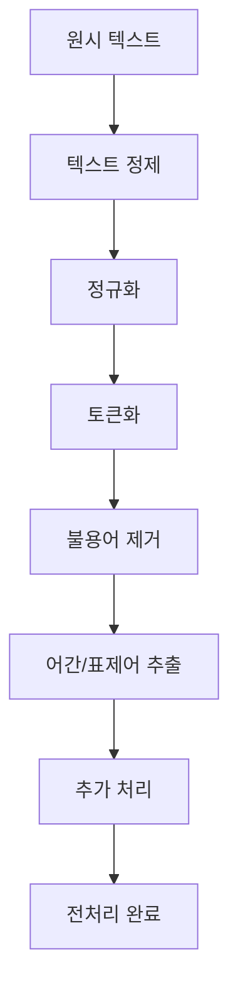
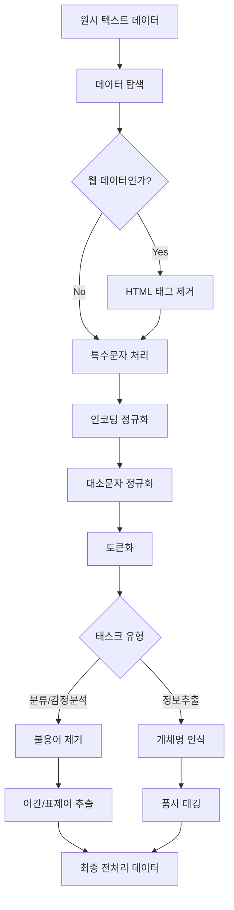

# 자연어처리 전처리

## 목차
1. [개요](#1-개요)<br/>
2. [전처리 작업 순서](#2-전처리-작업-순서)<br/>
   - 2.1. [텍스트 정제](#21-텍스트-정제-text-cleaning)<br/>
   - 2.2. [정규화](#22-정규화-normalization)<br/>
   - 2.3. [토큰화](#23-토큰화-tokenization)<br/>
   - 2.4. [불용어 제거](#24-불용어-제거-stop-words-removal)<br/>
   - 2.5. [어간 추출/표제어 추출](#25-어간-추출표제어-추출)<br/>
   - 2.6. [추가 처리](#26-추가-처리-선택적)<br/>
3. [각 단계별 장단점 분석](#3-각-단계별-장단점-분석)<br/>
   - 3.1. [텍스트 정제의 장단점](#31-텍스트-정제의-장단점)<br/>
   - 3.2. [정규화의 장단점](#32-정규화의-장단점)<br/>
   - 3.3. [토큰화의 장단점](#33-토큰화의-장단점)<br/>
   - 3.4. [불용어 제거의 장단점](#34-불용어-제거의-장단점)<br/>
   - 3.5. [어간/표제어 추출의 장단점](#35-어간표제어-추출의-장단점)<br/>
   - 3.6. [추가 처리의 장단점](#36-추가-처리의-장단점)<br/>
4. [전처리 워크플로우](#4-전처리-워크플로우)<br/>
5. [실무 고려사항](#5-실무-고려사항)<br/>
6. [용어 목록](#6-용어-목록)<br/>

---

## 1. 개요

자연어처리(Natural Language Processing, NLP)에서 전처리는 원시 텍스트 데이터를 기계학습 모델이 처리할 수 있는 형태로 변환하는 핵심 단계입니다. 적절한 전처리는 모델의 성능을 크게 좌우하며, 각 단계는 고유한 목적과 트레이드오프(trade-off)를 가지고 있습니다.

## 2. 전처리 작업 순서



### 2.1. 텍스트 정제 (Text Cleaning)

**목적**: 원시 데이터에서 불필요한 노이즈를 제거하여 데이터 품질을 향상시킵니다.

**주요 작업**:
- HTML 태그 제거: `<p>`, `<div>`, `&nbsp;` 등
- 특수문자 처리: 불필요한 기호, 이모지(emojis) 처리
- 인코딩(encoding) 문제 해결: UTF-8 등 올바른 인코딩으로 변환
- URL, 이메일 주소 처리

**예시**:
```
입력: "<p>안녕하세요! 😊 https://example.com</p>"
출력: "안녕하세요"
```

### 2.2. 정규화 (Normalization)

**목적**: 텍스트의 형태를 표준화하여 일관성을 확보합니다.

**주요 작업**:
- 대소문자 통일 (일반적으로 소문자 변환)
- 숫자 처리 (숫자를 특수 토큰으로 변환하거나 제거)
- 공백 정리 (연속 공백을 단일 공백으로 변환)
- 유니코드(Unicode) 정규화

**예시**:
```
입력: "Apple   LOVES    123   apples!!!"
출력: "apple loves NUM apples"
```

### 2.3. 토큰화 (Tokenization)

**목적**: 텍스트를 의미 있는 단위(토큰)로 분할합니다.

**단계**:
1. **문장 분할 (Sentence Segmentation)**: 문단을 문장 단위로 분리
2. **단어 토큰화 (Word Tokenization)**: 문장을 단어/형태소 단위로 분리

**토큰화 방법**:
- **공백 기반**: 띄어쓰기를 기준으로 분할
- **구두점 기반**: 구두점을 고려한 분할
- **정규표현식 기반**: 복잡한 패턴 매칭
- **서브워드(Subword) 토큰화**: BPE, SentencePiece 등

**예시**:
```
입력: "자연어처리는 재미있다."
출력: ["자연어처리는", "재미있다", "."]
```

### 2.4. 불용어 제거 (Stop Words Removal)

**목적**: 빈번하게 나타나지만 의미가 적은 단어들을 제거합니다.

**일반적인 불용어**:
- 조사: "은", "는", "이", "가", "을", "를"
- 관사: "the", "a", "an"
- 전치사: "in", "on", "at", "of"
- 대명사: "I", "you", "he", "she"

**예시**:
```
입력: ["나는", "자연어처리를", "공부하고", "있다"]
출력: ["자연어처리를", "공부하고"]
```

### 2.5. 어간 추출/표제어 추출

#### 2.5.1. 어간 추출 (Stemming)
**목적**: 단어의 어간(stem)을 추출하여 어휘 크기를 줄입니다.

**알고리즘**:
- Porter Stemmer
- Lancaster Stemmer
- Snowball Stemmer

**예시**:
```
입력: ["running", "runs", "ran"]
출력: ["run", "run", "ran"]
```

#### 2.5.2. 표제어 추출 (Lemmatization)
**목적**: 단어의 사전적 원형을 찾아 정확한 표준형으로 변환합니다.

**특징**:
- 품사(Part-of-Speech) 정보 활용
- 사전 기반 처리
- 더 정확하지만 계산 비용 높음

**예시**:
```
입력: ["better", "running", "mice"]
출력: ["good", "run", "mouse"]
```

### 2.6. 추가 처리 (선택적)

#### 2.6.1. 품사 태깅 (POS Tagging)
단어의 품사 정보를 부착합니다.

**예시**:
```
입력: "I love natural language processing"
출력: [("I", "PRP"), ("love", "VBP"), ("natural", "JJ"), ("language", "NN"), ("processing", "NN")]
```

#### 2.6.2. 개체명 인식 (Named Entity Recognition, NER)
인명, 지명, 기관명 등을 식별합니다.

**예시**:
```
입력: "김철수는 서울대학교에서 공부한다"
출력: [("김철수", "PERSON"), ("서울대학교", "ORG")]
```

#### 2.6.3. 동의어 처리 (Synonym Handling)
의미가 유사한 단어들을 통합합니다.

---

## 3. 각 단계별 장단점 분석

### 3.1. 텍스트 정제의 장단점

| 장점 | 단점 |
|------|------|
| **데이터 품질 향상**: 노이즈 제거로 깔끔한 데이터 확보 | **정보 손실 위험**: 중요한 특수문자나 기호 제거 가능 |
| **처리 속도 개선**: 불필요한 문자 제거로 연산량 감소 | **과도한 정제**: 감정 분석에서 이모지 제거 시 감정 정보 손실 |
| **일관성 확보**: 다양한 소스의 데이터를 표준화된 형태로 통합 | **도메인 특화 정보 제거**: 의료/법률 분야의 특수 기호 손실 |

### 3.2. 정규화의 장단점

| 장점 | 단점 |
|------|------|
| **어휘 크기 감소**: "Apple"과 "apple"을 하나로 통합하여 차원 축소 | **고유명사 정보 손실**: "apple"(과일)과 "Apple"(회사) 구분 불가 |
| **일관성 향상**: 동일한 의미의 단어들을 표준화된 형태로 처리 | **문맥 정보 손실**: 대소문자가 의미를 구분하는 경우 |
| **모델 성능 향상**: 데이터 스파시티(sparsity) 문제 완화 | **언어별 특성 무시**: 독일어의 명사 대문자 표기법 등 무시 |

### 3.3. 토큰화의 장단점

| 장점 | 단점 |
|------|------|
| **구조화된 처리**: 텍스트를 기계가 처리할 수 있는 단위로 분해 | **OOV 문제**: 훈련 시 보지 못한 단어 처리 어려움 |
| **병렬 처리 가능**: 각 토큰을 독립적으로 처리 가능 | **복합어 분리**: "자연어처리"가 "자연어"+"처리"로 분리되어 의미 변화 |
| **어휘 사전 구축**: 모델이 인식할 수 있는 어휘 목록 생성 | **언어별 복잡성**: 한국어, 중국어 등 띄어쓰기 기준이 모호한 언어 |

### 3.4. 불용어 제거의 장단점

| 장점 | 단점 |
|------|------|
| **차원 축소**: 의미 없는 고빈도 단어 제거로 연산 효율성 향상 | **문맥 정보 손실**: "not good"에서 "not" 제거 시 의미 완전 반전 |
| **노이즈 감소**: 모든 문서에 공통으로 나타나는 단어들 제거 | **도메인별 차이**: 일반적인 불용어가 특정 도메인에서는 중요할 수 있음 |
| **중요 단어 강조**: 실제 의미를 담은 단어들의 상대적 중요도 증가 | **언어별 불용어 사전**: 각 언어마다 별도의 불용어 목록 필요 |

### 3.5. 어간/표제어 추출의 장단점

#### 어간 추출 (Stemming)

| 장점 | 단점 |
|------|------|
| **빠른 처리**: 규칙 기반으로 빠른 속도 | **부정확한 결과**: "better" → "bett" (부정확한 어간) |
| **어휘 크기 감소**: "running", "runs", "ran" → "run" | **의미 손실**: 과도한 축약으로 원래 의미 파악 어려움 |
| **단순한 구현**: 복잡한 언어학적 지식 불필요 | **언어별 한계**: 불규칙 변화 처리 어려움 |

#### 표제어 추출 (Lemmatization)

| 장점 | 단점 |
|------|------|
| **정확한 원형**: 사전 기반으로 올바른 원형 반환 | **처리 속도**: 사전 검색으로 인한 속도 저하 |
| **의미 보존**: "better" → "good" (올바른 원형) | **사전 의존성**: 완벽한 사전 구축의 어려움 |
| **품사 고려**: 동일 단어라도 품사에 따른 다른 처리 | **계산 복잡도**: 형태소 분석 등 복잡한 언어학적 처리 필요 |

### 3.6. 추가 처리의 장단점

#### 품사 태깅 (POS Tagging)
- **장점**: 단어의 문법적 역할 파악, 중의성(ambiguity) 해소
- **단점**: 처리 시간 증가, 태깅 오류 가능성

#### 개체명 인식 (NER)
- **장점**: 중요한 개체 정보 추출, 익명화(anonymization) 처리 가능
- **단점**: 도메인별 개체명 사전 구축 필요, 새로운 개체명 인식 한계

#### 동의어 처리
- **장점**: 의미적으로 유사한 단어들 통합
- **단점**: 문맥에 따른 미묘한 의미 차이 손실

---

## 4. 전처리 워크플로우



---

## 5. 실무 고려사항

### 5.1. 태스크별 전처리 전략

**문서 분류**: 불용어 제거 + 어간 추출
**감정 분석**: 이모지 보존 + 부정어 처리 주의
**기계 번역**: 최소한의 전처리 (정보 보존 중요)
**정보 추출**: 개체명 인식 + 품사 태깅

### 5.2. 현대 딥러닝 모델과 전처리

**BERT/GPT 계열 모델**: 
- 서브워드 토큰화 활용
- 전통적 전처리 일부 생략 가능
- 문맥 정보 보존에 중점

**수식 표현**:

전처리 후 어휘 크기 감소율:

$$\text{Reduction Rate} = 1 - \frac{|V_{\text{processed}}|}{|V_{\text{original}}|}$$

여기서 $V$는 어휘 집합(vocabulary set)을 의미합니다.

### 5.3. 성능 평가 지표

전처리 효과를 측정하기 위한 지표들:

$$\text{Compression Ratio} = \frac{\text{Original Token Count}}{\text{Processed Token Count}}$$

$$\text{Information Retention} = \frac{\text{Preserved Semantic Units}}{\text{Total Semantic Units}}$$

---

## 6. 용어 목록

| 용어 | 영문 | 정의 |
|------|------|------|
| 전처리 | Preprocessing | 원시 데이터를 모델에 입력하기 전 변환하는 과정 |
| 토큰화 | Tokenization | 텍스트를 의미 단위로 분할하는 과정 |
| 정규화 | Normalization | 텍스트를 표준화된 형태로 변환하는 과정 |
| 불용어 | Stop Words | 빈번하지만 의미가 적은 단어들 |
| 어간 추출 | Stemming | 단어의 어간을 추출하는 과정 |
| 표제어 추출 | Lemmatization | 단어의 사전적 원형을 찾는 과정 |
| 품사 태깅 | POS Tagging | 단어의 품사 정보를 부착하는 과정 |
| 개체명 인식 | Named Entity Recognition | 고유명사 등 개체를 식별하는 과정 |
| 서브워드 토큰화 | Subword Tokenization | 단어를 더 작은 의미 단위로 분할 |
| 어휘 사전 | Vocabulary | 모델이 인식할 수 있는 단어들의 집합 |
| 스파시티 | Sparsity | 데이터가 희소한 정도 |
| 중의성 | Ambiguity | 하나의 단어나 문장이 여러 의미를 가지는 현상 |
| 인코딩 | Encoding | 텍스트를 컴퓨터가 처리할 수 있는 형태로 변환 |
| 트레이드오프 | Trade-off | 한 가지를 얻기 위해 다른 것을 포기하는 관계 |
| 익명화 | Anonymization | 개인정보를 제거하거나 가명화하는 과정 |