# 텍스트 데이터와 임베딩(Embedding)

## 목차
1. [텍스트 데이터의 이해](#1-텍스트-데이터의-이해)<br/>
   1. [텍스트 데이터의 특성과 도전과제](#11-텍스트-데이터의-특성과-도전과제)<br/>
   2. [전처리 과정](#12-전처리-과정)<br/>
   3. [전통적 텍스트 표현 방법](#13-전통적-텍스트-표현-방법)<br/>
2. [임베딩의 개념과 필요성](#2-임베딩의-개념과-필요성)<br/>
   1. [희소 표현의 한계](#21-희소-표현의-한계)<br/>
   2. [밀집 표현의 장점](#22-밀집-표현의-장점)<br/>
3. [신경망 기반 임베딩의 진화](#3-신경망-기반-임베딩의-진화)<br/>
   1. [초기 신경망 방식](#31-초기-신경망-방식)<br/>
   2. [순환 신경망 기반](#32-순환-신경망-기반)<br/>
   3. [어텐션 메커니즘](#33-어텐션-메커니즘)<br/>
   4. [트랜스포머 아키텍처](#34-트랜스포머-아키텍처)<br/>
4. [단어 수준 임베딩](#4-단어-수준-임베딩)<br/>
   1. [Word2Vec](#41-word2vec)<br/>
   2. [GloVe](#42-glove)<br/>
   3. [FastText](#43-fasttext)<br/>
5. [컨텍스트 기반 임베딩](#5-컨텍스트-기반-임베딩)<br/>
   1. [ELMo](#51-elmo)<br/>
   2. [BERT와 변형 모델들](#52-bert와-변형-모델들)<br/>
   3. [GPT 계열 모델](#53-gpt-계열-모델)<br/>
6. [문장/문서 수준 임베딩](#6-문장문서-수준-임베딩)<br/>
   1. [Doc2Vec](#61-doc2vec)<br/>
   2. [Sentence Transformers](#62-sentence-transformers)<br/>
7. [실무 활용과 평가](#7-실무-활용과-평가)<br/>
   1. [임베딩 품질 평가 방법](#71-임베딩-품질-평가-방법)<br/>
   2. [다운스트림 태스크 적용](#72-다운스트림-태스크-적용)<br/>
8. [용어 목록](#8-용어-목록)<br/>

---

## 1. 텍스트 데이터의 이해

### 1.1. 텍스트 데이터의 특성과 도전과제

텍스트 데이터는 자연어로 구성된 비정형 데이터로, 수치형 데이터와 달리 컴퓨터가 직접 처리하기 어려운 특성을 가집니다. 주요 도전과제는 다음과 같습니다.

**의미적 모호성(Semantic Ambiguity)**
동일한 단어라도 문맥에 따라 다른 의미를 가질 수 있습니다. "은행"이라는 단어는 금융기관을 의미할 수도 있고, 강가를 의미할 수도 있습니다.

**희소성(Sparsity) 문제**
자연어는 매우 큰 어휘 공간을 가지며, 대부분의 단어가 특정 문서에서 나타나지 않아 희소한 벡터 표현을 만듭니다.

**가변적 길이**
문장과 문서의 길이가 일정하지 않아 고정된 크기의 입력을 요구하는 머신러닝 모델에 직접 적용하기 어렵습니다.

### 1.2. 전처리 과정

텍스트 데이터를 임베딩으로 변환하기 전에 다음과 같은 전처리 과정을 거칩니다.

**토큰화(Tokenization)**
연속된 텍스트를 의미 있는 단위로 분할하는 과정입니다. 영어의 경우 공백 기준으로 분할할 수 있지만, 한국어는 형태소 분석이 필요합니다.

**정규화(Normalization)**
대소문자 통일, 특수문자 제거, 어간 추출(Stemming), 표제어 추출(Lemmatization) 등을 통해 텍스트를 일관된 형태로 변환합니다.

**불용어 제거**
"은", "는", "이", "가"와 같이 의미적으로 중요하지 않은 단어들을 제거하여 노이즈를 줄입니다.

### 1.3. 전통적 텍스트 표현 방법

임베딩 기법이 등장하기 전에 사용되었던 전통적인 텍스트 표현 방법들을 살펴보겠습니다.

#### 1.3.1. 백 오브 워즈(Bag of Words, BoW)

백 오브 워즈는 텍스트를 단어들의 집합으로 표현하는 가장 기본적인 방법입니다. 단어의 순서는 무시하고 출현 빈도만 고려합니다.

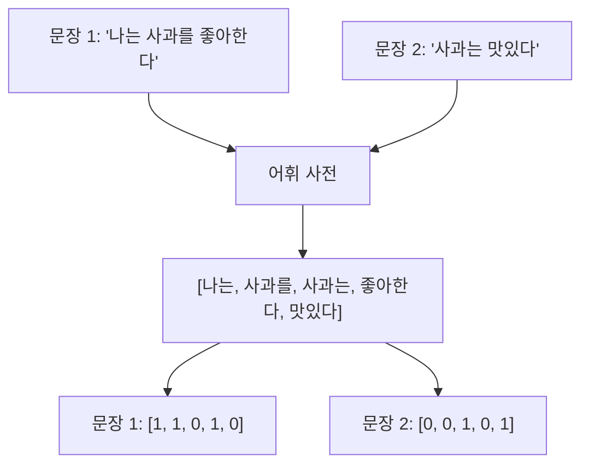

**장점**: 구현이 간단하고 해석이 용이합니다.

**한계**: 단어 순서 정보 손실, 의미적 관계 무시, 희소성 문제가 발생합니다.

#### 1.3.2. TF-IDF (Term Frequency-Inverse Document Frequency)

TF-IDF는 단순한 빈도 기반 접근법의 한계를 보완하여 "중요하지만 흔하지 않은 단어"를 찾는 방법입니다.

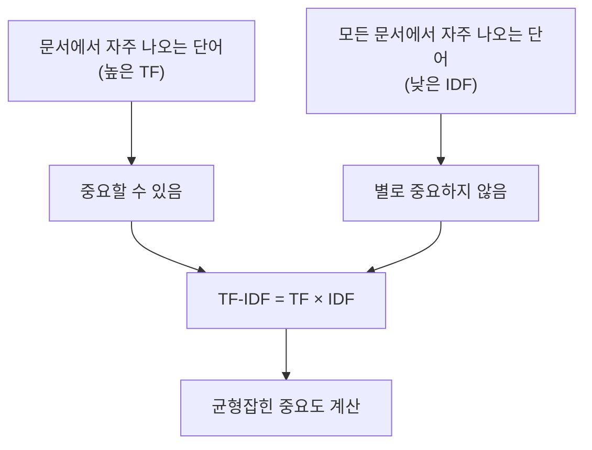

**TF (Term Frequency)**: 특정 문서에서 단어의 출현 빈도
$\text{TF}(t,d) = \frac{\text{단어 t의 문서 d 내 출현 횟수}}{\text{문서 d의 총 단어 수}}$

**IDF (Inverse Document Frequency)**: 단어의 희귀성 측정
$\text{IDF}(t) = \log\frac{\text{전체 문서 수}}{\text{단어 t가 포함된 문서 수}}$

**최종 TF-IDF 값**:
$\text{TF-IDF}(t,d) = \text{TF}(t,d) \times \text{IDF}(t)$

#### 1.3.3. N-gram

N-gram은 연속된 N개의 단어를 하나의 단위로 취급하여 단어 순서 정보를 부분적으로 보존하는 방법입니다.

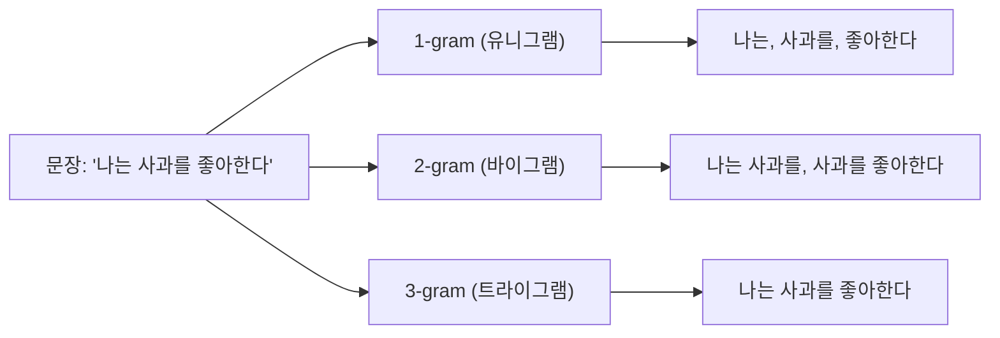

**N 크기에 따른 특성**:

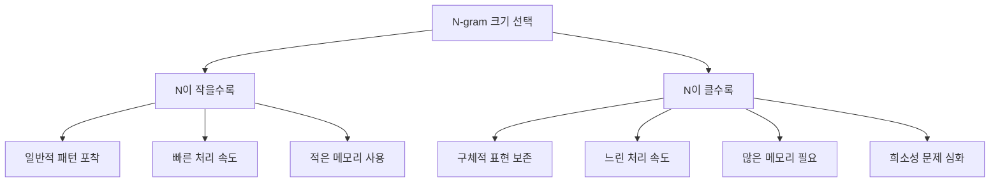

**실용 예시**: 감정 분석에서
- 1-gram: "좋다", "나쁘다" → 기본 감정
- 2-gram: "정말 좋다", "완전 실망" → 강도 포함 감정
- 3-gram: "정말 정말 좋다" → 더욱 구체적 표현

---

## 2. 임베딩의 개념과 필요성

### 2.1. 희소 표현(Sparse Representation)의 한계

전통적인 텍스트 표현 방법들(BoW, TF-IDF, N-gram)은 모두 희소 표현의 근본적인 문제를 가집니다.

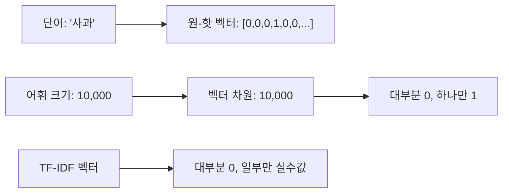

**차원의 저주**
어휘 크기가 커질수록 벡터의 차원이 기하급수적으로 증가하여 계산 복잡도가 높아집니다.

**의미적 유사성 부재**
"자동차"와 "차량"은 의미적으로 유사하지만, 원-핫 벡터로는 이들 간의 유사성을 표현할 수 없습니다.

### 2.2. 밀집 표현(Dense Representation)의 장점

임베딩은 고차원의 희소 벡터를 저차원의 밀집 벡터로 변환합니다.

**차원 축소**
수만 개의 어휘를 수백 차원의 벡터로 표현하여 메모리 효율성과 계산 속도를 개선합니다.

**의미적 유사성 보존**
코사인 유사도(Cosine Similarity)나 유클리드 거리를 통해 단어 간의 의미적 관계를 수치적으로 측정할 수 있습니다.

$$\text{similarity}(w_1, w_2) = \frac{\mathbf{v}_{w_1} \cdot \mathbf{v}_{w_2}}{|\mathbf{v}_{w_1}| |\mathbf{v}_{w_2}|}$$

**벡터 연산**
"왕 - 남자 + 여자 = 여왕"과 같은 의미적 관계를 벡터 연산으로 표현할 수 있습니다.

---

## 3. 신경망 기반 임베딩의 진화

### 3.1. 초기 신경망 방식

신경망을 이용한 임베딩은 전통적인 통계 기반 방법의 한계를 극복하기 위해 등장했습니다.

#### 신경망 언어 모델의 기본 개념

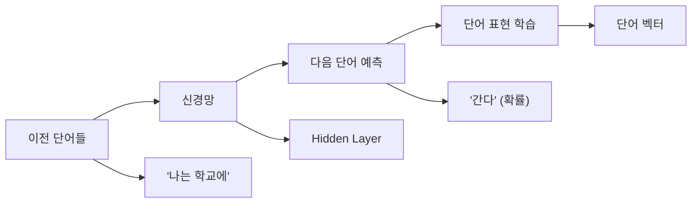

**핵심 아이디어**: 단어의 의미는 그 단어가 나타나는 문맥으로부터 학습할 수 있다는 **분포 가설(Distributional Hypothesis)**에 기반합니다.

#### 피드포워드 신경망 언어 모델 (FFNNLM)

벤지오(Bengio) 등이 2003년에 제안한 최초의 신경망 언어 모델입니다.

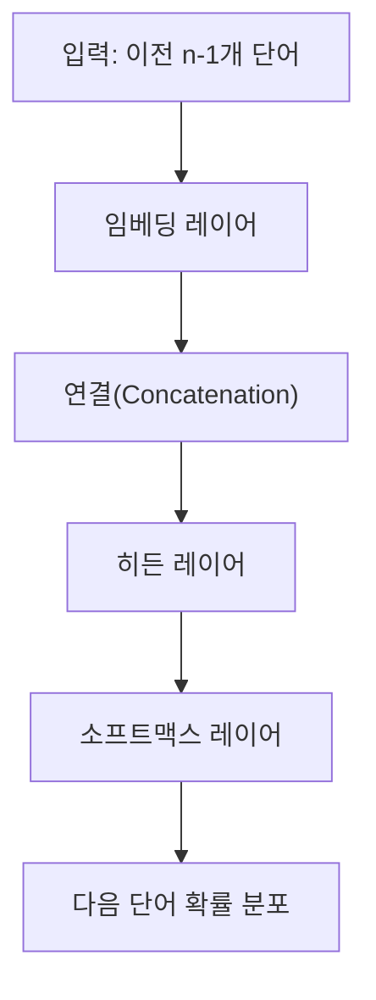

**장점**: 단어 간 의미적 유사성을 벡터 공간에서 표현
**한계**: 고정된 크기의 컨텍스트 윈도우, 높은 계산 복잡도

### 3.2. 순환 신경망 기반

#### RNN(Recurrent Neural Network)의 도입

순환 신경망은 가변 길이의 시퀀스를 처리할 수 있는 획기적인 아키텍처입니다.

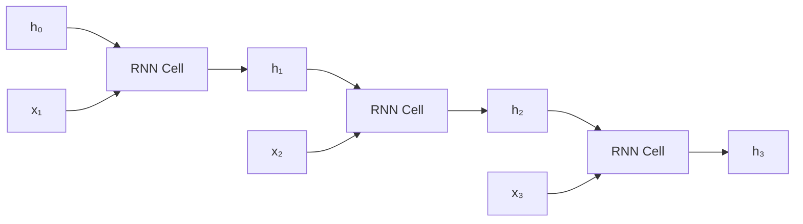

**RNN 수식**:
$h_t = \tanh(W_h h_{t-1} + W_x x_t + b)$
$y_t = \text{softmax}(W_y h_t + b_y)$

#### LSTM(Long Short-Term Memory)

바닐라(Vanilla) RNN의 기울기 소실(Gradient Vanishing) 문제를 해결한 개선된 아키텍처입니다.

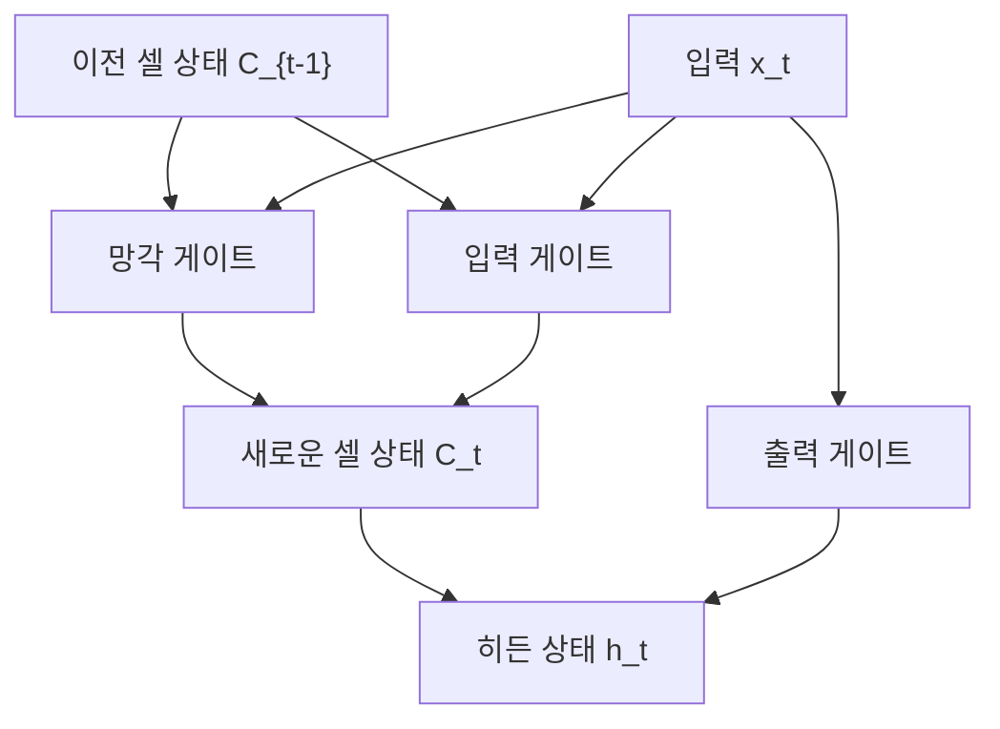

**LSTM 핵심 수식**:

**망각 게이트(Forget Gate)**: 이전 정보 중 잊을 것 결정
$f_t = \sigma(W_f \cdot [h_{t-1}, x_t] + b_f)$

**입력 게이트(Input Gate)**: 새로운 정보 중 저장할 것 결정
$i_t = \sigma(W_i \cdot [h_{t-1}, x_t] + b_i)$
$\tilde{C}_t = \tanh(W_C \cdot [h_{t-1}, x_t] + b_C)$

**셀 상태 업데이트**:
$C_t = f_t \odot C_{t-1} + i_t \odot \tilde{C}_t$

**출력 게이트(Output Gate)**:
$o_t = \sigma(W_o \cdot [h_{t-1}, x_t] + b_o)$
$h_t = o_t \odot \tanh(C_t)$

#### 양방향 LSTM (BiLSTM)

문장의 앞뒤 컨텍스트를 모두 고려하는 구조입니다.

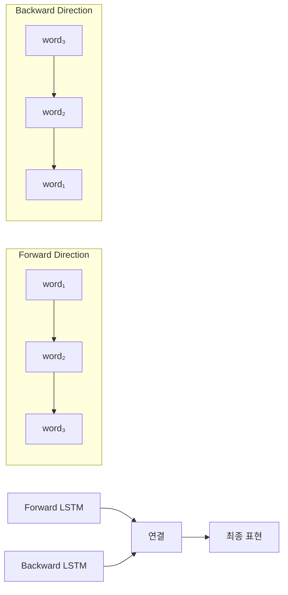

### 3.3. 어텐션 메커니즘

#### 어텐션의 핵심 아이디어

어텐션은 "중요한 부분에 집중한다"는 인간의 인지 과정을 모방한 메커니즘입니다.

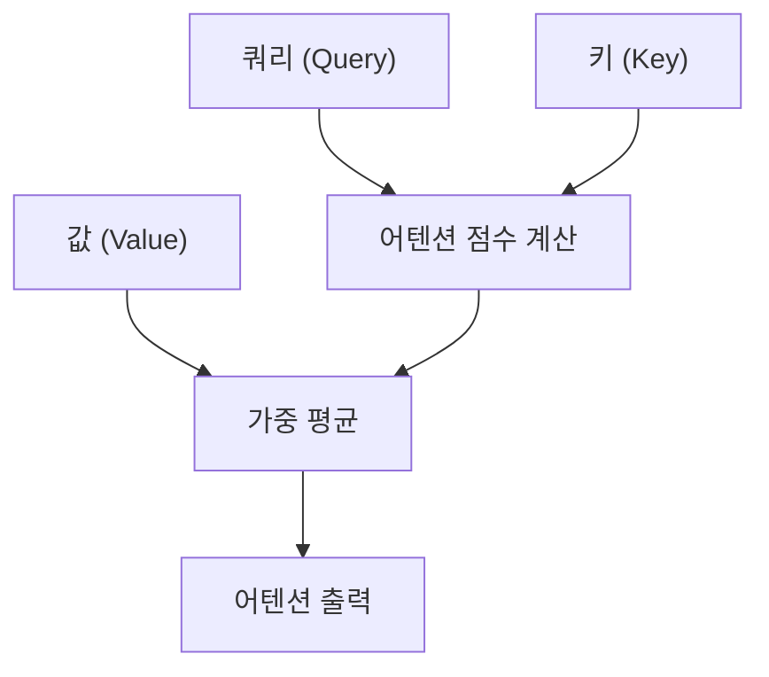

**직관적 설명**: 
- **쿼리(Q)**: "무엇을 찾고 있는가?"
- **키(K)**: "각 위치에 어떤 정보가 있는가?"  
- **값(V)**: "실제 정보 내용"

#### 어텐션 메커니즘 수식

**기본 어텐션 수식**:
$\text{Attention}(Q, K, V) = \text{softmax}\left(\frac{QK^T}{\sqrt{d_k}}\right)V$

**단계별 계산**:

1. **어텐션 점수 계산**:
   $e_{ij} = \frac{q_i \cdot k_j}{\sqrt{d_k}}$

2. **어텐션 가중치 계산**:
   $\alpha_{ij} = \frac{\exp(e_{ij})}{\sum_{k=1}^{n} \exp(e_{ik})}$

3. **가중 평균**:
   $c_i = \sum_{j=1}^{n} \alpha_{ij} v_j$

**스케일링 팩터 $\sqrt{d_k}$의 역할**: 차원이 클 때 내적 값이 너무 커져서 소프트맥스가 포화되는 것을 방지합니다.

#### 멀티헤드 어텐션(Multi-Head Attention)

여러 개의 어텐션을 병렬로 수행하여 다양한 관점에서 정보를 포착합니다.

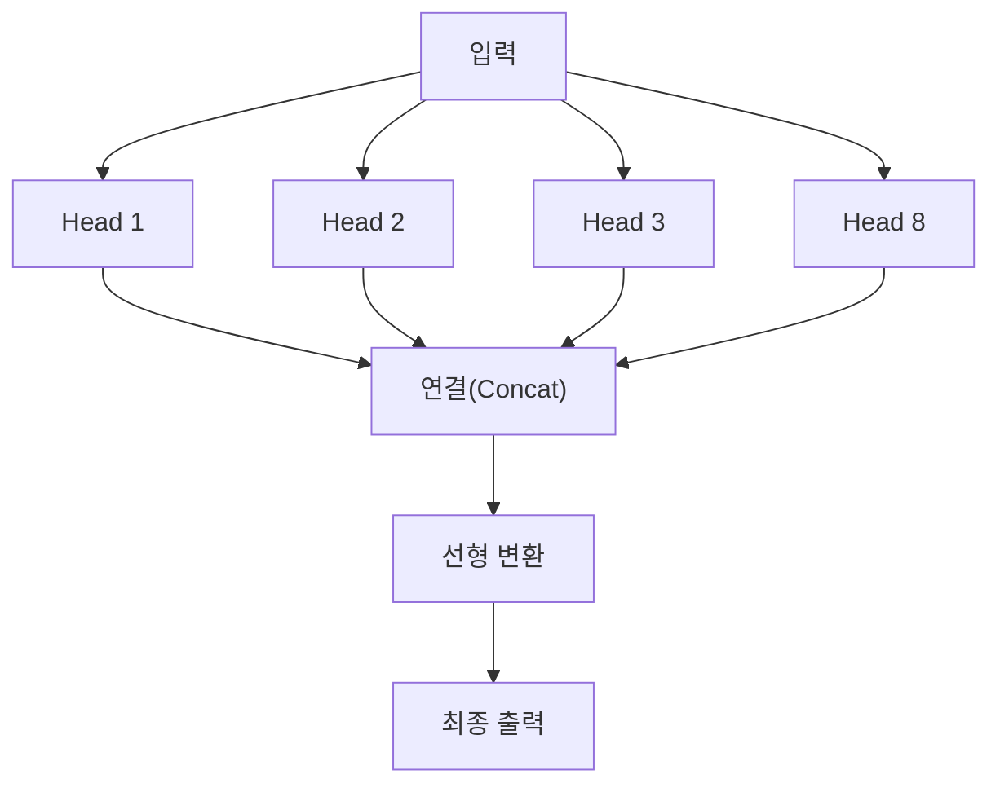

**멀티헤드 어텐션 수식**:
$\text{MultiHead}(Q, K, V) = \text{Concat}(\text{head}_1, ..., \text{head}_h)W^O$

여기서 각 헤드는:
$\text{head}_i = \text{Attention}(QW_i^Q, KW_i^K, VW_i^V)$

**각 헤드가 학습하는 것들**:
- 구문적 관계 (주어-동사, 수식어-피수식어)
- 의미적 관계 (동의어, 반의어)
- 장거리 의존성 (대명사와 선행사)

### 3.4. 트랜스포머 아키텍처

#### 트랜스포머의 혁신

2017년 바스와니(Vaswani) 등이 제안한 "Attention Is All You Need" 논문에서 소개된 아키텍처입니다.

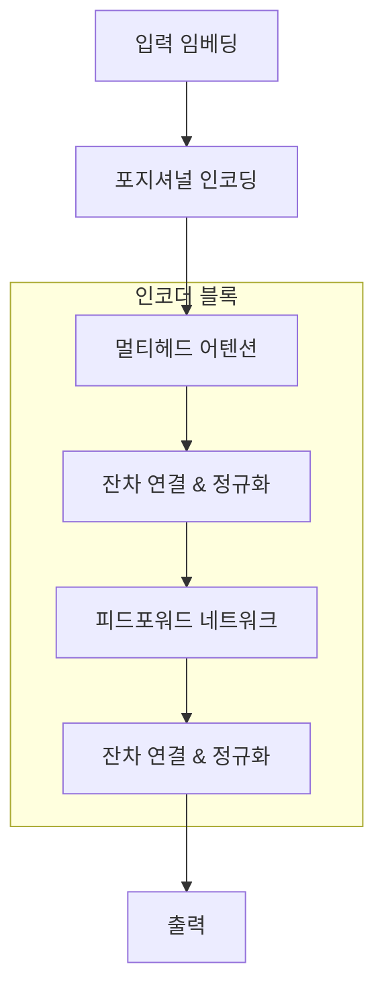

#### 핵심 구성 요소

**1. 포지셔널 인코딩(Positional Encoding)**
순환 구조가 없어 위치 정보를 명시적으로 추가해야 합니다.

$PE_{(pos, 2i)} = \sin\left(\frac{pos}{10000^{2i/d_{model}}}\right)$
$PE_{(pos, 2i+1)} = \cos\left(\frac{pos}{10000^{2i/d_{model}}}\right)$

**2. 잔차 연결(Residual Connection)**
기울기 소실 문제를 완화합니다.
$\text{LayerNorm}(x + \text{Sublayer}(x))$

**3. 피드포워드 네트워크**
각 위치에서 독립적으로 적용되는 완전연결층입니다.
$\text{FFN}(x) = \max(0, xW_1 + b_1)W_2 + b_2$

#### 트랜스포머의 장점

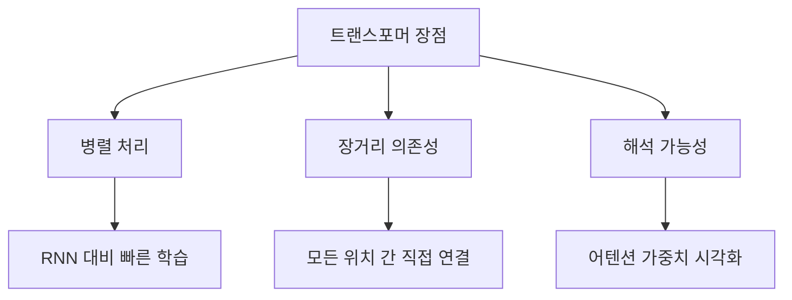

---

## 4. 단어 수준 임베딩

### 4.1. Word2Vec

Word2Vec은 미콜로프(Mikolov) 등이 2013년에 제안한 단어 임베딩 기법으로, 두 가지 아키텍처를 제공합니다.

**Skip-gram 모델**
중심 단어를 입력으로 받아 주변 단어들을 예측하는 방식입니다.

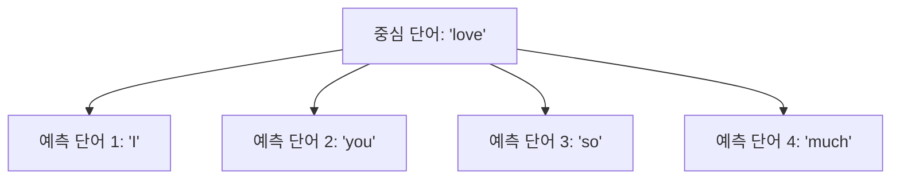

목적 함수는 다음과 같습니다:

$$J = \frac{1}{T} \sum_{t=1}^{T} \sum_{-c \leq j \leq c, j \neq 0} \log p(w_{t+j} | w_t)$$

**CBOW(Continuous Bag of Words) 모델**
주변 단어들을 입력으로 받아 중심 단어를 예측합니다. Skip-gram에 비해 빠르지만 희귀한 단어에 대한 성능은 낮습니다.

**네거티브 샘플링(Negative Sampling)**
모든 단어에 대해 소프트맥스를 계산하는 대신, 일부 네거티브 샘플만을 사용하여 계산 효율성을 높입니다.

### 4.2. GloVe (Global Vectors)

GloVe는 스탠포드 대학에서 개발한 방법으로, 전역 통계 정보를 활용합니다.

**공출현 행렬(Co-occurrence Matrix)**
단어 간의 동시 출현 빈도를 기록한 행렬을 구성합니다.

$$X_{ij} = \text{단어 i와 j가 함께 나타난 횟수}$$

**목적 함수**
단어 벡터들의 내적이 로그 확률 비율과 일치하도록 학습합니다:

$$J = \sum_{i,j=1}^{V} f(X_{ij})(w_i^T \tilde{w}_j + b_i + \tilde{b}_j - \log X_{ij})^2$$

여기서 $f(X_{ij})$는 가중 함수로, 너무 자주 또는 드물게 나타나는 단어 쌍의 영향을 조절합니다.

### 4.3. FastText

페이스북에서 개발한 FastText는 단어를 문자 n-그램(Character n-gram)의 조합으로 표현합니다.

**서브워드 정보 활용**
"playing"을 `<pl`, `pla`, `lay`, `ayi`, `yin`, `ing`, `ng>`와 같은 문자 n-그램으로 분해합니다.

**OOV 문제 해결**
훈련 시 보지 못한 단어(Out-of-Vocabulary)도 구성 요소인 n-그램들을 통해 임베딩을 생성할 수 있습니다.

**형태학적 유사성**
"run", "running", "ran"과 같은 형태학적으로 관련된 단어들 간의 유사성을 더 잘 포착합니다.

---

## 5. 컨텍스트 기반 임베딩

### 5.1. ELMo (Embeddings from Language Models)

앨런 AI 연구소에서 개발한 ELMo는 문맥에 따라 달라지는 동적 임베딩의 시초입니다.

#### ELMo 아키텍처

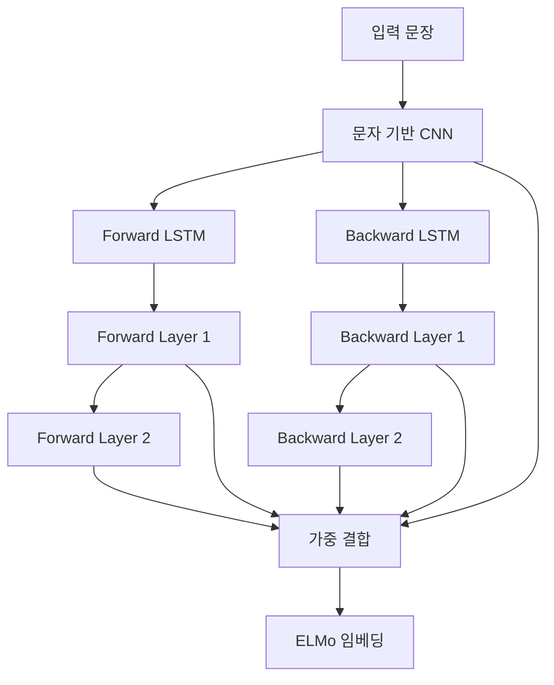

**양방향 언어 모델**
좌-우 방향과 우-좌 방향의 LSTM을 독립적으로 학습한 후 결합합니다.

**순방향 언어 모델**:
$p(t_1, t_2, ..., t_N) = \prod_{k=1}^{N} p(t_k | t_1, t_2, ..., t_{k-1})$

**역방향 언어 모델**:
$p(t_1, t_2, ..., t_N) = \prod_{k=1}^{N} p(t_k | t_{k+1}, t_{k+2}, ..., t_N)$

**ELMo 목적 함수**:
$\mathcal{L} = \sum_{k=1}^{N} (\log p(t_k | t_1, ..., t_{k-1}; \Theta_x, \overrightarrow{\Theta}_{LSTM}, \Theta_s) + \log p(t_k | t_{k+1}, ..., t_N; \Theta_x, \overleftarrow{\Theta}_{LSTM}, \Theta_s))$

#### 태스크별 가중 결합

각 레이어의 출력을 작업별로 가중 결합하여 최종 임베딩을 생성합니다:

$\text{ELMo}_k^{\text{task}} = \gamma^{\text{task}} \sum_{j=0}^{L} s_j^{\text{task}} \mathbf{h}_{k,j}$

여기서:
- $\gamma^{\text{task}}$: 전체 ELMo 벡터의 크기 조절
- $s_j^{\text{task}}$: 각 레이어의 중요도 가중치
- $\mathbf{h}_{k,j}$: j번째 레이어의 k번째 토큰 표현

### 5.2. BERT와 변형 모델들

#### BERT (Bidirectional Encoder Representations from Transformers)

BERT는 트랜스포머의 인코더 구조만을 사용하여 양방향 컨텍스트를 동시에 고려하는 혁신적인 모델입니다.

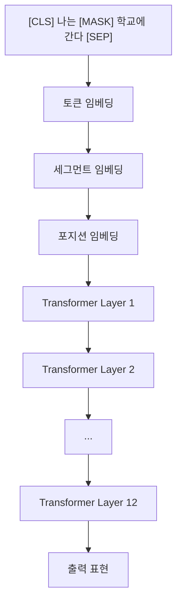

#### BERT의 사전 훈련 과제

**1. 마스크드 언어 모델(Masked Language Model, MLM)**
입력 문장의 15%를 무작위로 마스킹하고 원래 단어를 예측합니다.

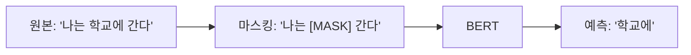

**마스킹 전략**:
- 80%: [MASK] 토큰으로 교체
- 10%: 무작위 토큰으로 교체  
- 10%: 원본 토큰 유지

**2. 다음 문장 예측(Next Sentence Prediction, NSP)**
두 문장이 원래 연속된 문장인지 판단하는 이진 분류 작업입니다.

$P(\text{IsNext}|A, B) = \text{softmax}(W \cdot \text{[CLS]})$

#### BERT의 핵심 혁신

**양방향 컨텍스트**: 기존의 left-to-right나 right-to-left와 달리 모든 방향의 컨텍스트를 동시에 고려

**토큰별 표현**: 각 토큰이 문장 전체의 맥락을 반영한 표현을 가짐

**전이 학습**: 대용량 코퍼스에서 사전 훈련 후 특정 태스크에 파인튜닝(Fine-tuning)

#### BERT 변형 모델들

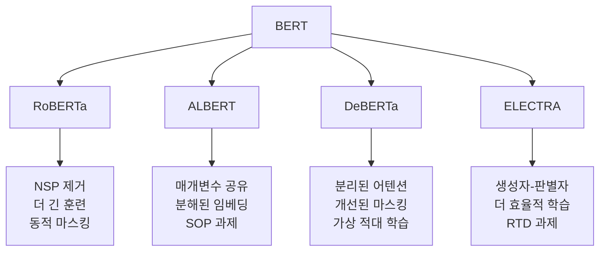

**RoBERTa (Robustly Optimized BERT Approach)**:
- NSP 과제 제거
- 더 큰 배치 크기와 긴 훈련
- 동적 마스킹 사용

**ALBERT (A Lite BERT)**:
- 매개변수 공유로 모델 크기 감소
- 분해된 임베딩 매개변수화
- SOP(Sentence Order Prediction) 과제 도입

**DeBERTa (Decoding-enhanced BERT with Disentangled Attention)**:
- 분리된 어텐션 메커니즘
- 개선된 마스크 디코더
- 가상 적대 학습(Virtual Adversarial Training)

### 5.3. GPT 계열 모델

#### GPT (Generative Pre-trained Transformer)

OpenAI에서 개발한 GPT는 트랜스포머의 디코더 구조를 사용한 자회귀(autoregressive) 언어 모델입니다.

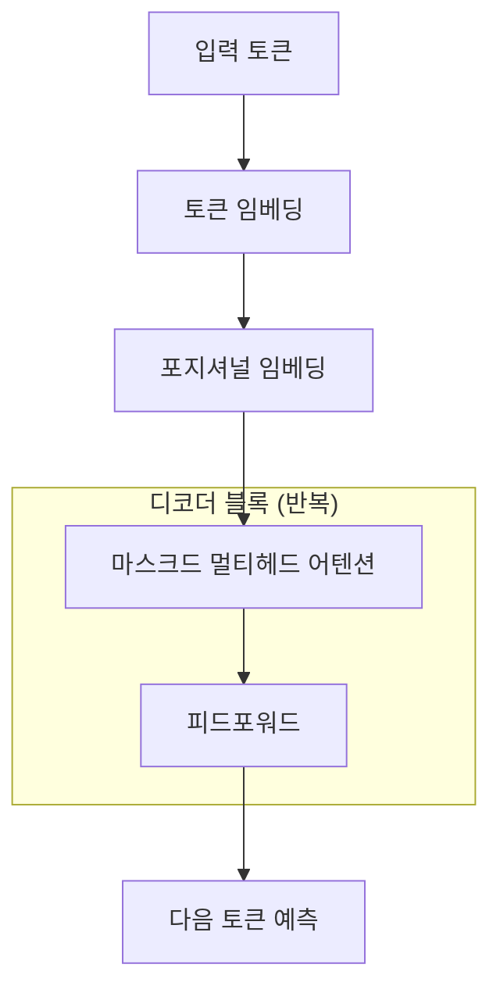

#### GPT의 핵심 특징

**인과적 언어 모델링(Causal Language Modeling)**:
$P(x_1, x_2, ..., x_n) = \prod_{i=1}^{n} P(x_i | x_1, x_2, ..., x_{i-1})$

**마스크드 어텐션**: 미래 토큰을 보지 못하도록 어텐션을 마스킹

```mermaid
graph LR
    A["나는"] --> B["학교에"]
    B --> C["간다"]
    A -.-> C
    
    A --> A1["✓ 볼 수 있음"]
    B --> B1["✓ 볼 수 있음"]  
    C --> C1["✗ 볼 수 없음 (마스킹)"]
```

#### GPT 모델의 진화

```mermaid
graph LR
    A["GPT-1<br/>(117M)"] --> B["GPT-2<br/>(1.5B)"]
    B --> C["GPT-3<br/>(175B)"]
    C --> D["GPT-4<br/>(추정 1T+)"]
    
    A --> A1["12층<br/>사전훈련+파인튜닝"]
    B --> B1["48층<br/>제로샷 학습"]
    C --> C1["96층<br/>퓨샷 학습"]
    D --> D1["멀티모달<br/>인컨텍스트 학습"]
```

**스케일링 법칙**: 모델 크기와 데이터 양이 증가할수록 성능이 예측 가능하게 향상

**창발적 능력(Emergent Abilities)**: 특정 크기를 넘어서면 새로운 능력이 나타남

---

## 6. 문장/문서 수준 임베딩

### 6.1. Doc2Vec

Doc2Vec은 Word2Vec을 확장하여 문서 전체에 대한 벡터 표현을 학습하는 방법입니다.

**PV-DM(Paragraph Vector - Distributed Memory)**
문서 벡터와 단어 벡터를 함께 사용하여 다음 단어를 예측합니다.

```mermaid
graph LR
    A["문서 벡터"] --> D["예측"]
    B["단어 1"] --> D
    C["단어 2"] --> D
    D --> E["다음 단어"]
```

**PV-DBOW(Paragraph Vector - Distributed Bag of Words)**
문서 벡터만을 사용하여 문서 내의 단어들을 예측합니다.

### 6.2. Sentence Transformers

BERT 기반의 문장 임베딩 모델로, 의미적으로 유사한 문장들이 벡터 공간에서 가깝게 위치하도록 학습됩니다.

**샴 네트워크(Siamese Network) 구조**
동일한 BERT 모델을 사용하여 두 문장을 인코딩한 후, 코사인 유사도를 계산합니다.

**학습 목표**
의미적으로 유사한 문장 쌍은 가까이, 다른 문장 쌍은 멀리 배치되도록 대조 학습(Contrastive Learning)을 수행합니다.

---

## 5. 컨텍스트 기반 임베딩

### 5.1. ELMo (Embeddings from Language Models)

앨런 AI 연구소에서 개발한 ELMo는 양방향 LSTM을 사용하여 컨텍스트를 고려한 동적 임베딩을 생성합니다.

**양방향 언어 모델**
좌-우 방향과 우-좌 방향의 LSTM을 독립적으로 학습한 후 결합합니다.

$$\overrightarrow{h}_{k,t} = \text{LSTM}(\overrightarrow{h}_{k,t-1}, E_t)$$
$$\overleftarrow{h}_{k,t} = \text{LSTM}(\overleftarrow{h}_{k,t+1}, E_t)$$

**가중 결합**
각 레이어의 출력을 작업별로 가중 결합하여 최종 임베딩을 생성합니다:

$$\text{ELMo}_k^{\text{task}} = \gamma^{\text{task}} \sum_{j=0}^{L} s_j^{\text{task}} h_{k,j}$$

### 5.2. BERT와 Transformer 기반 임베딩

BERT(Bidirectional Encoder Representations from Transformers)는 트랜스포머의 인코더 구조를 사용하여 양방향 컨텍스트를 동시에 고려합니다.

**마스크드 언어 모델(Masked Language Model, MLM)**
입력 문장의 15%를 [MASK] 토큰으로 치환하고 원래 단어를 예측합니다.

```mermaid
graph LR
    A["I [MASK] to school"] --> B["Self-Attention"]
    B --> C["Feed Forward"]
    C --> D["예측: 'go'"]
```

**다음 문장 예측(Next Sentence Prediction, NSP)**
두 문장이 연속인지 판단하는 이진 분류 작업을 수행합니다.

**셀프 어텐션(Self-Attention) 메커니즘**
각 토큰이 문장 내 모든 토큰과의 관계를 동시에 고려합니다:

$$\text{Attention}(Q, K, V) = \text{softmax}\left(\frac{QK^T}{\sqrt{d_k}}\right)V$$

**멀티헤드 어텐션(Multi-Head Attention)**
여러 개의 어텐션 헤드를 병렬로 사용하여 다양한 관점에서 정보를 포착합니다.

---

## 7. 실무 활용과 평가

### 7.1. 임베딩 품질 평가 방법

**내재적 평가(Intrinsic Evaluation)**

단어 유사도 평가: WordSim-353, SimLex-999 등의 데이터셋을 사용하여 인간의 유사도 판단과 모델의 예측을 비교합니다.

단어 유추(Word Analogy): "왕 - 남자 + 여자 = 여왕"과 같은 의미적 관계를 벡터 연산으로 해결할 수 있는지 평가합니다.

**외재적 평가(Extrinsic Evaluation)**

실제 NLP 작업(감정 분석, 개체명 인식, 기계 번역 등)에서의 성능을 측정합니다.

### 7.2. 다운스트림 태스크 적용

**텍스트 분류**
문서의 임베딩을 피처로 사용하여 카테고리를 예측합니다.

**정보 검색**
쿼리와 문서의 임베딩 간 유사도를 계산하여 관련 문서를 검색합니다.

**기계 번역**
소스 언어와 타겟 언어의 임베딩 공간을 정렬하여 번역 품질을 향상시킵니다.

**추천 시스템**
사용자와 아이템의 텍스트 정보를 임베딩으로 변환하여 개인화된 추천을 제공합니다.

**질의응답**
질문과 답변 후보들의 임베딩을 비교하여 가장 적절한 답변을 선택합니다.

---

## 8. 용어 목록

| 용어 | 설명 |
|------|------|
| 임베딩(Embedding) | 고차원의 범주형 데이터를 저차원의 밀집 벡터로 변환하는 기법 |
| 토큰화(Tokenization) | 텍스트를 의미 있는 단위로 분할하는 과정 |
| 희소 표현(Sparse Representation) | 대부분의 원소가 0인 고차원 벡터 표현 |
| 밀집 표현(Dense Representation) | 모든 원소가 의미 있는 값을 갖는 저차원 벡터 표현 |
| 코사인 유사도(Cosine Similarity) | 두 벡터 간의 각도를 이용한 유사도 측정 방법 |
| Skip-gram | 중심 단어로 주변 단어를 예측하는 Word2Vec 모델 |
| CBOW | 주변 단어들로 중심 단어를 예측하는 Word2Vec 모델 |
| 네거티브 샘플링(Negative Sampling) | 계산 효율성을 위해 일부 네거티브 샘플만 사용하는 기법 |
| 공출현 행렬(Co-occurrence Matrix) | 단어 간 동시 출현 빈도를 기록한 행렬 |
| 서브워드(Subword) | 단어보다 작은 단위의 텍스트 조각 |
| OOV(Out-of-Vocabulary) | 훈련 시 보지 못한 단어 |
| 샴 네트워크(Siamese Network) | 동일한 구조의 두 네트워크로 구성된 아키텍처 |
| 대조 학습(Contrastive Learning) | 유사한 데이터는 가깝게, 다른 데이터는 멀게 학습하는 방법 |
| 마스크드 언어 모델(MLM) | 일부 단어를 마스킹하고 예측하는 BERT의 사전 훈련 방법 |
| 셀프 어텐션(Self-Attention) | 시퀀스 내 모든 위치 간의 관계를 동시에 계산하는 메커니즘 |
| 멀티헤드 어텐션(Multi-Head Attention) | 여러 어텐션 헤드를 병렬로 사용하는 기법 |
| 내재적 평가(Intrinsic Evaluation) | 임베딩 자체의 품질을 직접 측정하는 평가 방법 |
| 외재적 평가(Extrinsic Evaluation) | 실제 작업에서의 성능을 통해 임베딩을 평가하는 방법 |
| 다운스트림 태스크(Downstream Task) | 사전 훈련된 모델을 활용하는 실제 응용 작업 |
| 분포 가설(Distributional Hypothesis) | 단어의 의미는 그 단어가 나타나는 문맥으로 결정된다는 가설 |
| 피드포워드 신경망(Feedforward Neural Network) | 입력에서 출력으로 한 방향으로만 정보가 흐르는 신경망 |
| 기울기 소실(Gradient Vanishing) | 역전파 시 기울기가 점점 작아져서 학습이 어려워지는 현상 |
| 순환 신경망(RNN) | 이전 시점의 히든 상태를 현재 시점에서 활용하는 신경망 |
| 장단기 메모리(LSTM) | RNN의 기울기 소실 문제를 해결한 개선된 아키텍처 |
| 망각 게이트(Forget Gate) | LSTM에서 이전 정보 중 잊을 것을 결정하는 게이트 |
| 입력 게이트(Input Gate) | LSTM에서 새로운 정보 중 저장할 것을 결정하는 게이트 |
| 출력 게이트(Output Gate) | LSTM에서 출력할 정보를 결정하는 게이트 |
| 양방향 LSTM(BiLSTM) | 순방향과 역방향 LSTM을 결합한 구조 |
| 어텐션 메커니즘(Attention Mechanism) | 중요한 정보에 가중치를 부여하는 메커니즘 |
| 쿼리(Query) | 어텐션에서 찾고자 하는 정보를 나타내는 벡터 |
| 키(Key) | 어텐션에서 각 위치의 정보 식별자 역할을 하는 벡터 |
| 값(Value) | 어텐션에서 실제 정보 내용을 담는 벡터 |
| 멀티헤드 어텐션(Multi-Head Attention) | 여러 어텐션 헤드를 병렬로 사용하는 기법 |
| 트랜스포머(Transformer) | 어텐션만으로 구성된 신경망 아키텍처 |
| 포지셔널 인코딩(Positional Encoding) | 시퀀스의 위치 정보를 나타내는 인코딩 |
| 잔차 연결(Residual Connection) | 입력을 출력에 직접 더해주는 연결 방식 |
| 레이어 정규화(Layer Normalization) | 각 레이어의 출력을 정규화하는 기법 |
| 마스크드 언어 모델(MLM) | 일부 단어를 마스킹하고 예측하는 학습 방법 |
| 다음 문장 예측(NSP) | 두 문장이 연속인지 판단하는 학습 과제 |
| 파인튜닝(Fine-tuning) | 사전 훈련된 모델을 특정 태스크에 맞게 조정하는 과정 |
| 자회귀 모델(Autoregressive Model) | 이전 출력을 다음 입력으로 사용하는 모델 |
| 인과적 언어 모델(Causal Language Model) | 이전 토큰만으로 다음 토큰을 예측하는 모델 |
| 제로샷 학습(Zero-shot Learning) | 특정 태스크에 대한 훈련 없이 수행하는 학습 |
| 퓨샷 학습(Few-shot Learning) | 적은 예시만으로 새로운 태스크를 학습하는 방법 |
| 인컨텍스트 학습(In-context Learning) | 프롬프트 내 예시를 통해 태스크를 수행하는 학습 |
| 창발적 능력(Emergent Abilities) | 모델 크기가 커지면서 나타나는 새로운 능력들 |
| 스케일링 법칙(Scaling Laws) | 모델 크기와 성능 간의 예측 가능한 관계 || 백 오브 워즈(Bag of Words) | 텍스트를 단어 출현 빈도로 표현하는 방법 |
| TF-IDF | 단어 빈도와 역문서 빈도를 결합한 가중치 기법 |
| N-gram | 연속된 N개 단어를 하나의 단위로 취급하는 방법 |
| 유니그램(Unigram) | 단일 단어 단위 (1-gram) |
| 바이그램(Bigram) | 연속된 2개 단어 단위 (2-gram) |
| 트라이그램(Trigram) | 연속된 3개 단어 단위 (3-gram) |# 텍스트 데이터와 임베딩(Embedding)