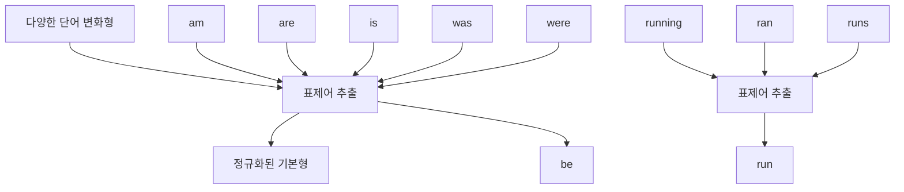
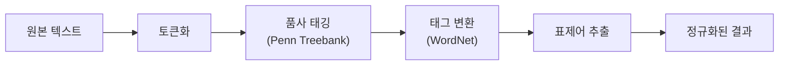
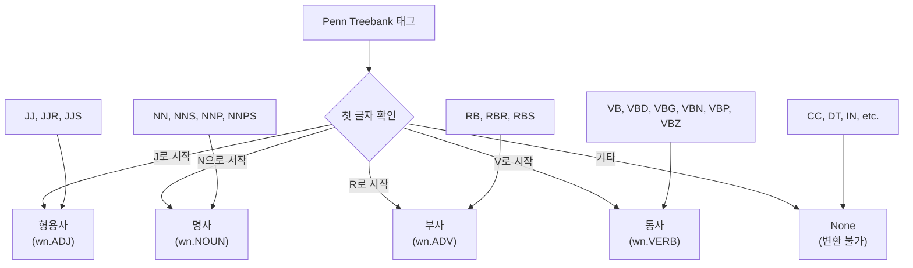
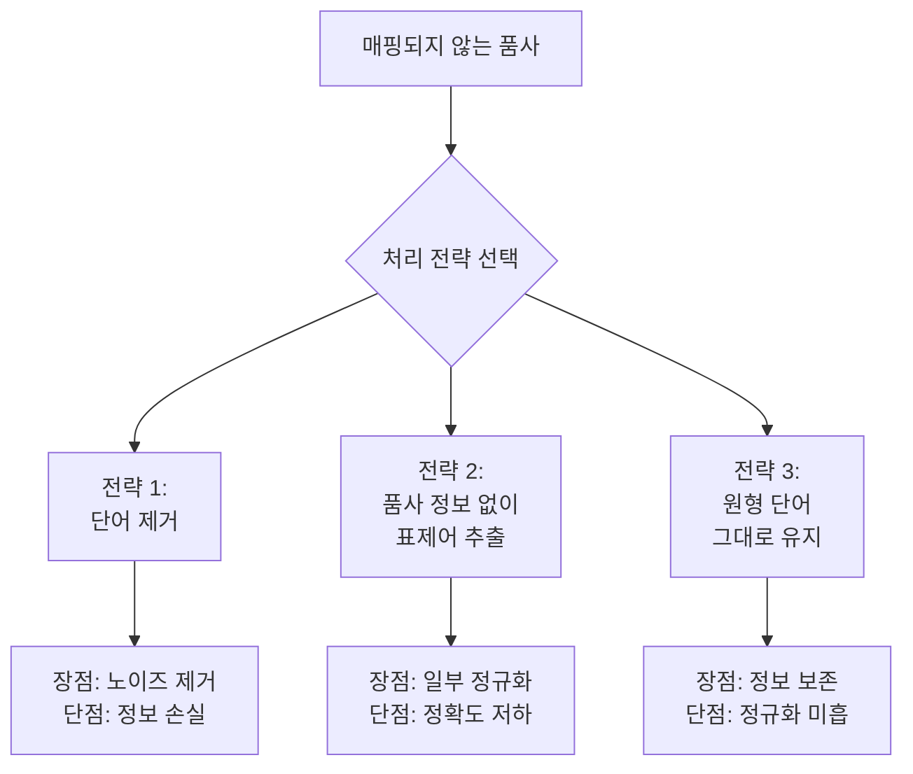

# 표제어 추출 (Lemmatization)

## 목차
1. [표제어 추출 개념](#1-표제어-추출-개념)<br/>
2. [처리 과정 개요](#2-처리-과정-개요)<br/>
3. [품사 태깅 시스템](#3-품사-태깅-시스템)<br/>
   - 3.1. [Penn Treebank POS Tag](#31-penn-treebank-pos-tag)<br/>
   - 3.2. [WordNet POS Tag](#32-wordnet-pos-tag)<br/>
   - 3.3. [태그 변환 과정](#33-태그-변환-과정)<br/>
4. [실제 구현](#4-실제-구현)<br/>
   - 4.1. [기본 구현](#41-기본-구현)<br/>
   - 4.2. [함수화](#42-함수화)<br/>
5. [처리 전략](#5-처리-전략)<br/>
6. [용어 목록](#6-용어-목록)<br/>

## 1. 표제어 추출 개념

표제어(Lemma, 레마)란 단어의 사전적 어원을 의미합니다. 서로 다른 변화형 단어들을 하나의 기본형으로 통합하여 단어를 정규화(노멀라이제이션)하는 과정입니다.

**예시:**
- am, are, is → be
- running, ran, runs → run  
- happiest, happier → happy



## 2. 처리 과정 개요

표제어 추출은 다음과 같은 단계를 거쳐 수행됩니다:



## 3. 품사 태깅 시스템

### 3.1. Penn Treebank POS Tag

NLTK의 `pos_tag()` 함수가 사용하는 상세한 품사 태깅 시스템입니다.

| 품사 태그 | 의미 | 품사 태그 | 의미 |
|----------|------|----------|------|
| **명사 계열** | | **동사 계열** | |
| NN | 단수/질량 명사 | VB | 기본형 동사 |
| NNS | 복수 명사 | VBD | 과거형 동사 |
| NNP | 고유명사(단수) | VBG | 현재분사/동명사 |
| NNPS | 고유명사(복수) | VBN | 과거분사 |
| **형용사 계열** | | VBP | 현재형(3인칭 단수 제외) |
| JJ | 형용사 | VBZ | 현재형(3인칭 단수) |
| JJR | 비교급 형용사 | **기타** | |
| JJS | 최상급 형용사 | RB | 부사 |
| **대명사 계열** | | RBR | 비교급 부사 |
| PRP | 인칭대명사 | RBS | 최상급 부사 |
| PRP$ | 소유대명사 | DT | 한정사 |

### 3.2. WordNet POS Tag

WordNet 어휘 데이터베이스에서 사용하는 단순화된 4가지 품사 체계입니다:

| WordNet 태그 | 의미 | 상수 |
|-------------|------|------|
| n | 명사 | `wn.NOUN` |
| a | 형용사 | `wn.ADJ` |
| r | 부사 | `wn.ADV` |
| v | 동사 | `wn.VERB` |

### 3.3. 태그 변환 과정

Penn Treebank 태그를 WordNet 태그로 변환하는 규칙:



## 4. 실제 구현

### 4.1. 기본 구현

```python
from nltk.tokenize import word_tokenize
from nltk.tag import pos_tag
from nltk.stem import WordNetLemmatizer
from nltk.corpus import wordnet as wn
import nltk

# 필요한 데이터 다운로드
nltk.download('wordnet')
nltk.download('omw-1.4')

# 예시 텍스트
text = 'You are the happiest person.'

# 1. 토큰화
tokenized_words = word_tokenize(text)

# 2. 품사 태깅
tagged_words = pos_tag(tokenized_words)

# 3. Penn Treebank → WordNet 태그 변환 함수
def penn_to_wn(tag):
    if tag.startswith('J'):
        return wn.ADJ
    elif tag.startswith('N'):
        return wn.NOUN
    elif tag.startswith('R'):
        return wn.ADV
    elif tag.startswith('V'):
        return wn.VERB
    else:
        return None

# 4. 표제어 추출
lemmatizer = WordNetLemmatizer()
lemmatized_words = []

for word, tag in tagged_words:
    wn_tag = penn_to_wn(tag)
    
    if wn_tag in (wn.NOUN, wn.ADJ, wn.ADV, wn.VERB):
        lemmatized_words.append(lemmatizer.lemmatize(word, wn_tag))
    else:
        lemmatized_words.append(word)

print('원본:', tokenized_words)
print('결과:', lemmatized_words)
```

**실행 결과:**
```
원본: ['You', 'are', 'the', 'happiest', 'person', '.']
결과: ['You', 'be', 'the', 'happy', 'person', '.']
```

### 4.2. 함수화

재사용 가능한 형태로 모듈화한 버전:

```python
import nltk
from nltk.stem import WordNetLemmatizer
from nltk.corpus import wordnet as wn

# 데이터 다운로드
nltk.download('wordnet')
nltk.download('omw-1.4')

def penn_to_wn(tag):
    """Penn Treebank 태그를 WordNet 태그로 변환"""
    if tag.startswith('J'):
        return wn.ADJ
    elif tag.startswith('N'):
        return wn.NOUN
    elif tag.startswith('R'):
        return wn.ADV
    elif tag.startswith('V'):
        return wn.VERB
    else:
        return None

def words_lemmatizer(pos_tagged_words):
    """
    품사 태깅된 단어 리스트에서 표제어 추출
    
    Args:
        pos_tagged_words: [(단어, 품사태그)] 형태의 리스트
        
    Returns:
        list: 표제어 추출된 단어 리스트
    """
    lemmatizer = WordNetLemmatizer()
    lemmatized_words = []
    
    for word, tag in pos_tagged_words:
        wn_tag = penn_to_wn(tag)
        
        if wn_tag in (wn.NOUN, wn.ADJ, wn.ADV, wn.VERB):
            lemmatized_words.append(lemmatizer.lemmatize(word, wn_tag))
        else:
            lemmatized_words.append(word)
    
    return lemmatized_words
```

## 5. 처리 전략

WordNet POS Tag에 매핑되지 않는 품사의 처리 방법:



**권장 사항:** 코퍼스(코포라)의 특성과 분석 목적에 따라 적절한 전략을 선택해야 합니다.

## 6. 용어 목록

| 용어 | 영문 | 정의 |
|------|------|------|
| 표제어 | Lemma | 단어의 사전적 기본형 또는 어원 |
| 표제어 추출 | Lemmatization | 변화형 단어를 기본형으로 변환하는 과정 |
| 정규화 | Normalization | 다양한 형태의 데이터를 일관된 형태로 변환 |
| 토큰화 | Tokenization | 텍스트를 의미 있는 단위로 분할하는 과정 |
| 품사 태깅 | POS Tagging | 단어에 품사 정보를 부착하는 과정 |
| 코퍼스 | Corpus | 언어학 연구를 위한 대규모 텍스트 집합 |
| 어휘 데이터베이스 | Lexical Database | 단어와 그 관계를 체계적으로 정리한 데이터베이스 |
| 품사 | Part of Speech | 단어의 문법적 기능에 따른 분류 |
| 레마타이저 | Lemmatizer | 표제어 추출을 수행하는 도구 |
| 전처리 | Preprocessing | 데이터 분석 전 데이터를 정제하고 변환하는 과정 |