# 한국어 문법 구조 분석 - 딥러닝을 위한 기초

## 목차
1. [한국어의 언어학적 특성](#1-한국어의-언어학적-특성) 
   1.1. [교착어적 특성](#11-교착어적-특성) 
   1.2. [어순의 유연성](#12-어순의-유연성) 
2. [한국어 문법 구조](#2-한국어-문법-구조) 
   2.1. [형태소 분석](#21-형태소-분석) 
   2.2. [품사 체계](#22-품사-체계) 
   2.3. [구문 구조](#23-구문-구조) 
3. [문법 관계 그래프](#3-문법-관계-그래프) 
   3.1. [의존 관계 구조](#31-의존-관계-구조) 
   3.2. [구성 성분 구조](#32-구성-성분-구조) 
4. [딥러닝 관점에서의 한국어 특성](#4-딥러닝-관점에서의-한국어-특성) 
   4.1. [토큰화의 복잡성](#41-토큰화의-복잡성) 
   4.2. [의미 관계 모델링](#42-의미-관계-모델링) 
5. [용어 목록](#5-용어-목록) 

---

## 1. 한국어의 언어학적 특성

### 1.1. 교착어적 특성

한국어는 **교착어(agglutinative language, 아글루터네이티브 랭귀지)**로서, 하나의 어근에 여러 접사가 결합되어 문법적 의미를 표현합니다.

- 예제1
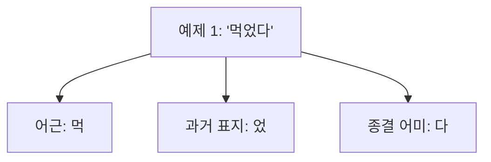

- 예제2

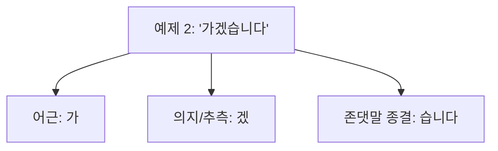

- 예제3

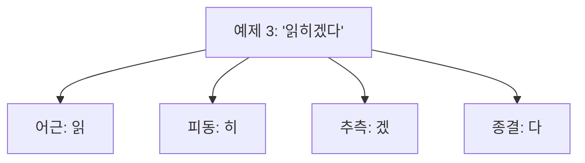

**복합 예제 분석:**
- "학생들에게서도" = 학생(명사) + 들(복수) + 에게서(출발점) + 도(보조사)
- "예뻐지겠다" = 예쁘(형용사 어간) + 어(연결) + 지(변화) + 겠(추측) + 다(종결)

---
---

### 1.2. 어순의 유연성

한국어는 기본 어순이 **SOV(S:주어 - O:목적어 - V:서술어)**이지만, 맥락에 따라 성분의 위치가 자유롭게 변할 수 있습니다.
 

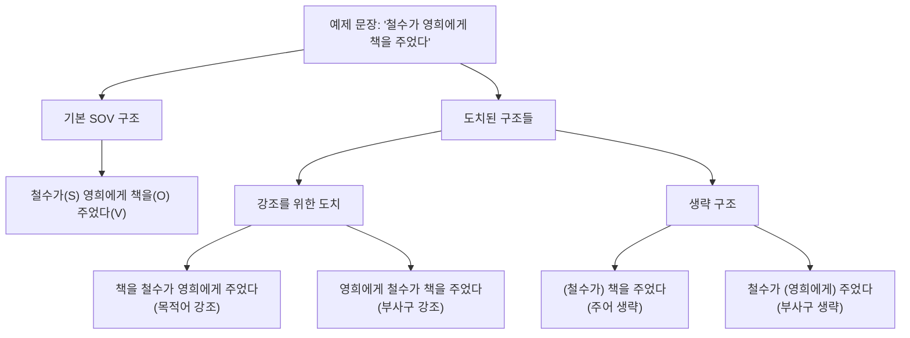

---
---

## 2. 한국어 문법 구조

### 2.1. 형태소 분석

**형태소(morpheme, 모피임)**는 의미를 가지는 최소 단위입니다. 한국어에서는 형태소 분석이 NLP의 핵심 전처리 과정입니다.

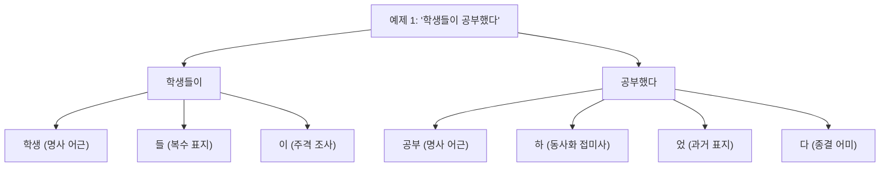

---

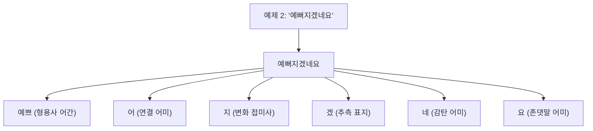

---
---

### 2.2. 품사 체계

한국어의 품사 체계는 **굴절성(inflection, 인플렉션)**과 **파생성(derivation, 데리베이션)**을 고려하여 분류됩니다.

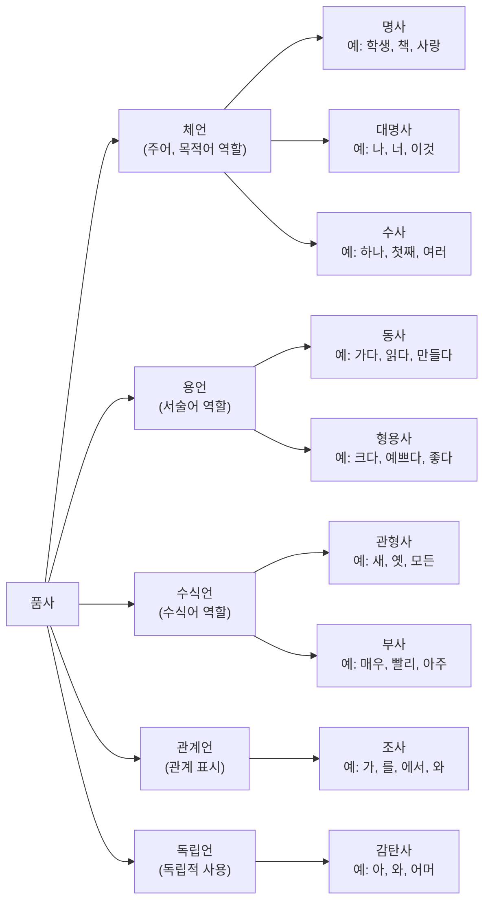

---
---

### 2.3. 구문 구조

한국어의 **구문 구조(syntactic structure, 신택틱 스트럭처)**는 계층적 구성을 이룹니다.

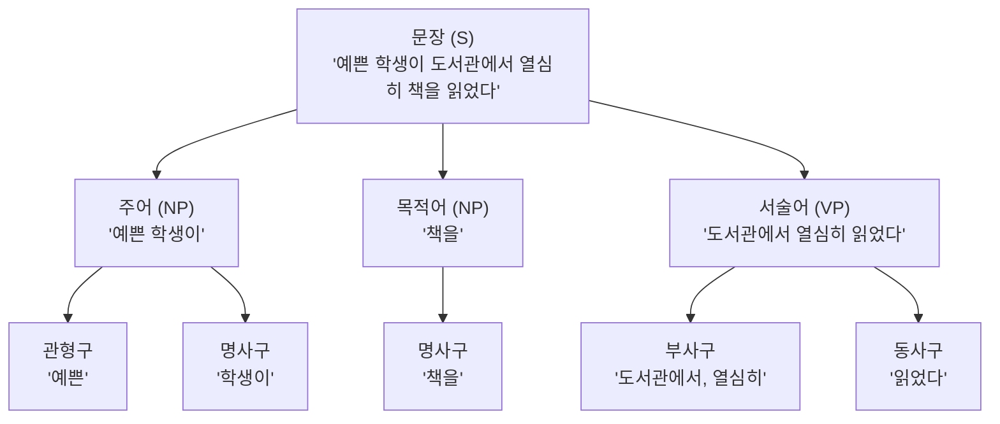

---
---

## 3. 문법 관계 그래프

### 3.1. 의존 관계 구조

**의존 문법(dependency grammar, 디펜던시 그래머)**에서 한국어의 어절 간 관계를 분석합니다.

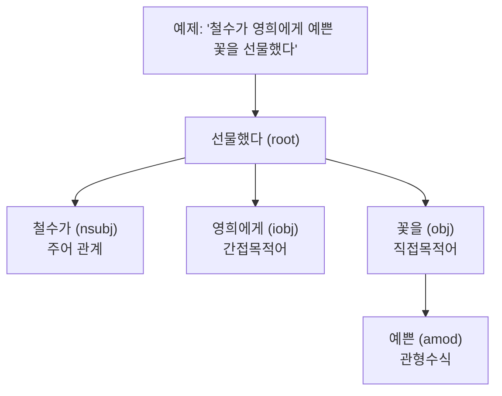

---

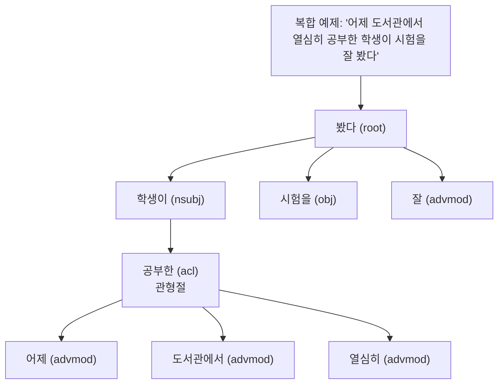

**의존 관계 레이블 설명:**
- `nsubj`: 명사적 주어 (nominal subject)
- `obj`: 직접목적어 (direct object)  
- `iobj`: 간접목적어 (indirect object)
- `amod`: 형용사 수식어 (adjectival modifier)
- `advmod`: 부사적 수식어 (adverbial modifier)
- `acl`: 관형절 (adnominal clause)

---
---

### 3.2. 구성 성분 구조

**구성소 문법(constituent grammar, 컨스티튜언트 그래머)**에서의 계층 구조:

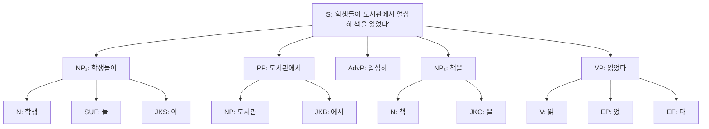

---

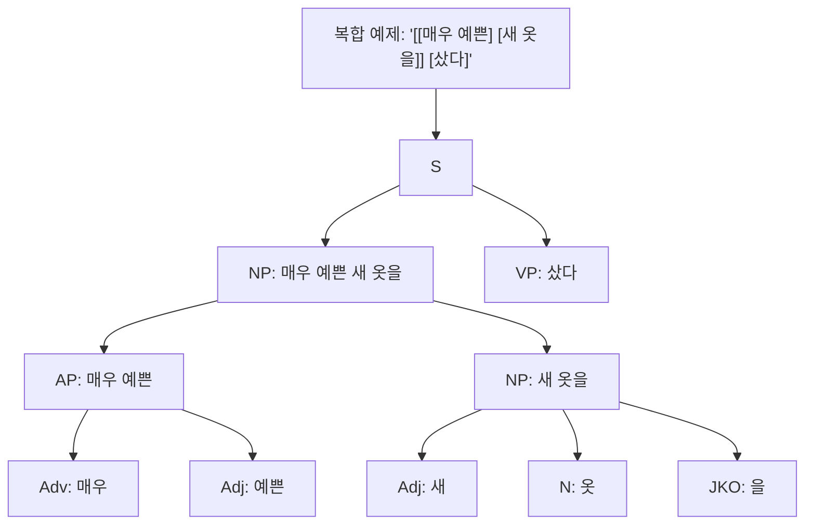

**구성소 태그 설명:**
- `S`: 문장 (Sentence)
- `NP`: 명사구 (Noun Phrase)  
- `VP`: 동사구 (Verb Phrase)
- `AP`: 형용사구 (Adjective Phrase)
- `AdvP`: 부사구 (Adverbial Phrase)
- `PP`: 전치사구 (Postpositional Phrase)
- `JKS/JKO/JKB`: 조사 (주격/목적격/부사격)

---
---

## 4. 딥러닝 관점에서의 한국어 특성

### 4.1. 토큰화의 복잡성

한국어는 **어절 단위 토큰화(word-level tokenization, 워드 레벨 토크나이제이션)**와 **형태소 단위 토큰화(morpheme-level tokenization, 모피임 레벨 토크나이제이션)** 사이의 선택이 중요합니다.

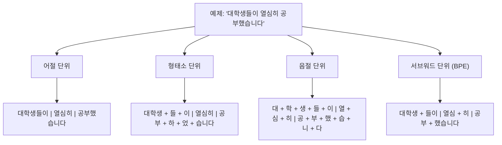

---

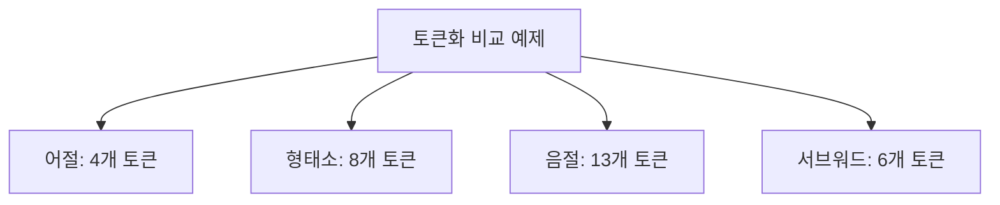

---
---

### 4.2. 의미 관계 모델링

**의미역 라벨링(semantic role labeling, 시맨틱 롤 라벨링)**에서 한국어의 특수성:

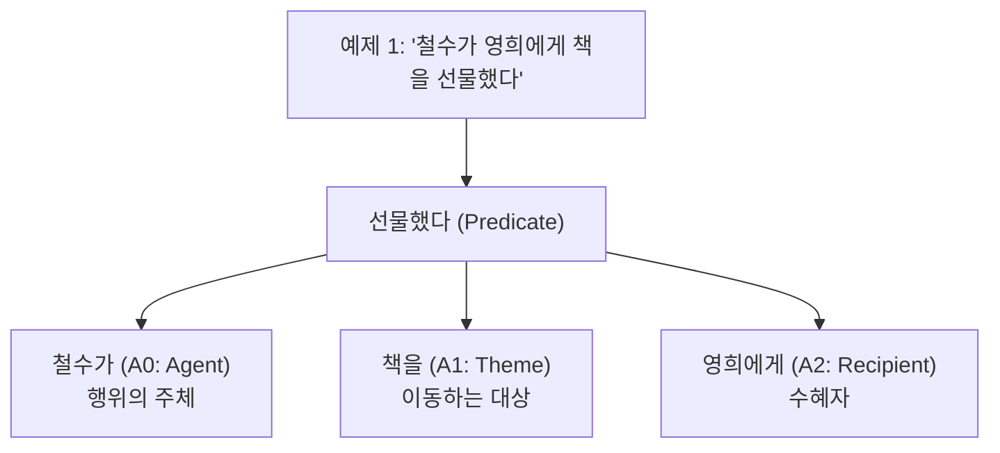

---

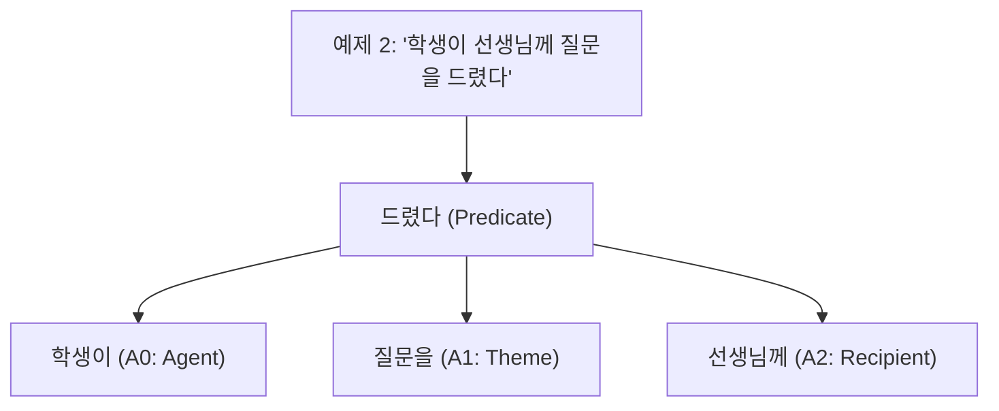

---

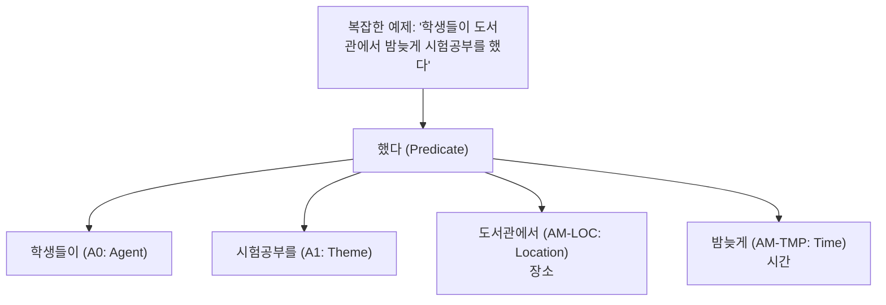

**의미역 유형:**
- **핵심 논항 (Core Arguments)**:
  - A0: 행위자/원인 (Agent/Causer)
  - A1: 대상/주제 (Theme/Patient)  
  - A2: 수혜자/목표 (Recipient/Goal)
  
- **부가 논항 (Adjunct Arguments)**:
  - AM-LOC: 장소 (Location)
  - AM-TMP: 시간 (Temporal)
  - AM-MNR: 방식 (Manner)
  - AM-PRP: 목적 (Purpose)

**임베딩 전략:**
1. **서브워드 임베딩(subword embedding, 서브워드 임베딩)**: BPE, SentencePiece 활용
2. **문맥 임베딩(contextual embedding, 컨텍스츄얼 임베딩)**: BERT, GPT 등의 트랜스포머 모델
3. **형태소 인식 임베딩(morphology-aware embedding, 모폴로지 어웨어 임베딩)**: 형태소 정보를 활용한 임베딩

---
---

## 5. 용어 목록

| 용어 | 영문 | 설명 |
|------|------|------|
| 교착어 | Agglutinative Language | 어근에 접사가 결합하여 문법 관계를 표현하는 언어 |
| 형태소 | Morpheme | 의미를 가지는 언어의 최소 단위 |
| 굴절 | Inflection | 문법적 기능에 따른 어형 변화 |
| 파생 | Derivation | 새로운 단어를 만드는 어형 변화 |
| 의존문법 | Dependency Grammar | 단어 간의 지배관계로 문장구조를 설명하는 문법이론 |
| 구성소문법 | Constituent Grammar | 문장의 계층적 구조를 분석하는 문법이론 |
| 의미역 | Semantic Role | 서술어와 논항 사이의 의미적 관계 |
| 토큰화 | Tokenization | 텍스트를 처리 가능한 단위로 분할하는 과정 |
| 서브워드 | Subword | 단어보다 작은 단위의 텍스트 조각 |
| 문맥임베딩 | Contextual Embedding | 문맥을 고려한 단어 벡터 표현 |