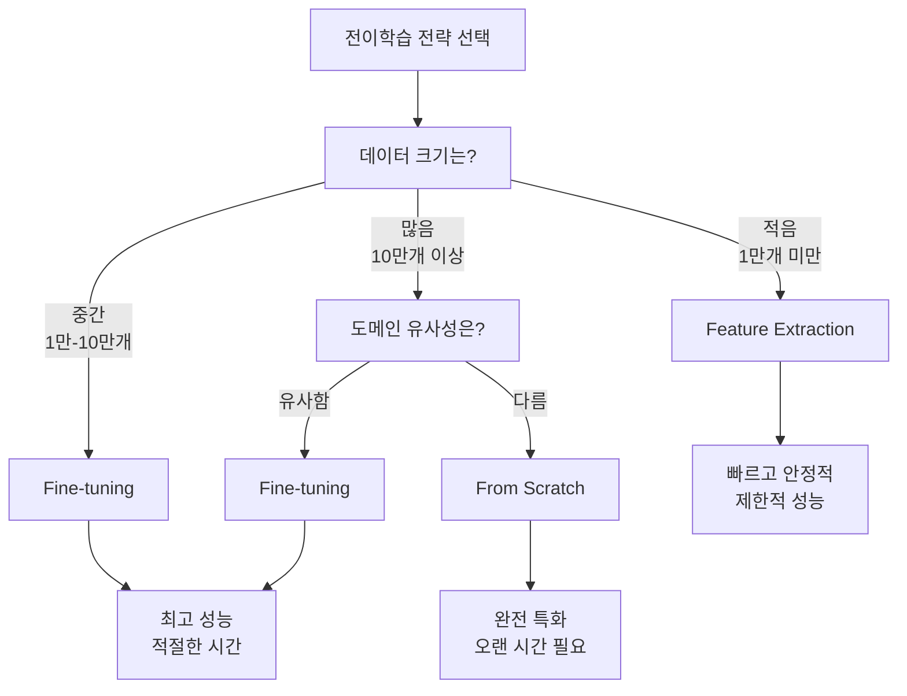

# 전이학습(Transfer Learning)

## 1. 전이학습이란?

전이학습(Transfer Learning)은 기존에 학습된 모델의 지식을 새로운 작업에 활용하는 딥러닝 기법입니다. 이미 대용량 데이터셋으로 훈련된 모델의 가중치를 활용하여, 적은 데이터로도 높은 성능을 달성할 수 있습니다.

### 전이학습의 핵심 아이디어

**사전 훈련된 모델(Pre-trained Model)**:
- ImageNet 같은 대용량 데이터셋(100만 개 이상의 이미지)으로 이미 훈련된 모델 활용
- 일반적인 시각적 특징들(에지, 텍스처, 패턴, 모양 등)을 이미 학습한 상태

**특징 재사용(Feature Reuse)**:
- 하위 레이어들은 범용적인 특징을 학습하므로 다른 도메인에서도 재사용 가능
- 상위 레이어일수록 도메인 특화적 특징을 학습

**효율성(Efficiency)**:
- 처음부터 훈련하는 것보다 시간과 컴퓨팅 자원을 크게 절약
- 적은 데이터로도 좋은 성능 달성 가능

### 왜 전이학습이 효과적인가?

**계층적 특징 학습**:
```
하위 레이어: 에지, 선분 → 중간 레이어: 텍스처, 패턴 → 상위 레이어: 객체의 부분, 형태
```

**도메인 독립적 특징**:
- 에지나 텍스처 같은 기본적인 시각적 요소는 모든 이미지에서 공통적으로 나타남
- 이러한 저수준 특징들은 다양한 도메인에서 재사용 가능

**데이터 부족 문제 해결**:
- 새로운 도메인에서 처음부터 학습하려면 수십만 개의 데이터가 필요
- 전이학습을 사용하면 수천 개의 데이터로도 충분한 성능 달성

## 2. 전이학습 플로우

```
[사전 훈련된 모델] → [특징 추출기] → [새로운 분류기] → [파인튜닝] → [완성된 모델]
```

### 단계별 설명

#### 단계 1: 사전 훈련된 모델 로드
```python
# 예: ResNet18 사전 훈련된 모델 로드
model = torchvision.models.resnet18(pretrained=True)
```

#### 단계 2: 분류기 교체
```python
# 마지막 fully connected layer를 새로운 클래스 수에 맞게 교체
model.fc = nn.Linear(model.fc.in_features, num_classes)
```

#### 단계 3: 레이어 동결 (선택적)
```python
# 특징 추출기 부분을 동결하여 가중치 업데이트 방지
for param in model.parameters():
    param.requires_grad = False
model.fc.requires_grad = True  # 분류기만 학습
```

#### 단계 4: 훈련 및 파인튜닝
```python
# 낮은 학습률로 전체 모델 파인튜닝
optimizer = optim.Adam(model.parameters(), lr=0.001)
```

## 3. 전이학습의 세 가지 전략

전이학습에는 주요한 세 가지 접근 방법이 있으며, 각각 데이터 크기와 도메인 유사성에 따라 선택합니다.

### 3.1 Feature Extraction (특징 추출)

**개념**: 사전 훈련된 모델을 **고정된 특징 추출기**로 사용하는 방법입니다.


**작동 방식**:
- 사전 훈련된 모델의 **컨볼루션 레이어들은 완전히 동결** (가중치 업데이트 안함)
- **마지막 분류기 레이어만 새로 학습**
- 기존 모델이 학습한 일반적인 특징들(에지, 텍스처, 패턴)을 그대로 활용

**언제 사용하나요?**
- 데이터가 **적을 때** (수천 개 정도)
- 새로운 데이터가 **원본 데이터셋과 유사할 때**
- **계산 자원이 제한적일 때**

**장점**:
- 학습 속도가 빠름 (업데이트할 파라미터가 적음)
- 메모리 효율적
- 과적합 위험이 낮음
- 안정적인 성능

**단점**:
- 성능 향상에 한계가 있음
- 도메인이 다르면 효과가 제한적

**구현 예제**:
```python
import torch
import torch.nn as nn
import torchvision.models as models

# 1. 사전 훈련된 모델 로드
model = models.resnet18(pretrained=True)

# 2. 특징 추출기 부분 동결
for param in model.parameters():
    param.requires_grad = False

# 3. 분류기만 교체 (이 부분만 학습됨)
model.fc = nn.Linear(model.fc.in_features, num_classes)

# 4. 분류기 파라미터만 학습 가능하도록 설정
for param in model.fc.parameters():
    param.requires_grad = True

# 5. 옵티마이저는 학습 가능한 파라미터만 포함
optimizer = torch.optim.Adam(model.fc.parameters(), lr=0.001)
```

### 3.2 Fine-tuning (파인튜닝, 미세조정)

**개념**: 사전 훈련된 모델의 **전체 가중치를 조금씩 조정**하여 새로운 데이터에 맞게 최적화하는 방법입니다.


**작동 방식**:
- **전체 네트워크의 가중치를 업데이트**
- **낮은 학습률**을 사용하여 기존 지식을 보존
- 분류기는 상대적으로 높은 학습률 적용
- 점진적으로 새로운 도메인에 적응

**언제 사용하나요?**
- **충분한 데이터가 있을 때** (수만 개 이상)
- 새로운 데이터가 **원본과 어느 정도 다를 때**
- **최고 성능을 원할 때**

**장점**:
- 일반적으로 **가장 높은 성능** 달성
- 사전 훈련된 지식과 새로운 도메인 적응의 균형
- 안정적인 수렴

**단점**:
- Feature Extraction보다 학습 시간이 오래 걸림
- 과적합 위험성이 상대적으로 높음
- 더 많은 메모리와 계산 자원 필요

**구현 예제**:
```python
import torch
import torch.nn as nn
import torchvision.models as models

# 1. 사전 훈련된 모델 로드
model = models.resnet18(pretrained=True)

# 2. 분류기 교체
model.fc = nn.Linear(model.fc.in_features, num_classes)

# 3. 전체 모델이 학습 가능하도록 설정 (기본값)
for param in model.parameters():
    param.requires_grad = True

# 4. 차별화된 학습률 적용
optimizer = torch.optim.Adam([
    # 특징 추출기는 낮은 학습률
    {'params': model.features.parameters() if hasattr(model, 'features') 
              else [p for n, p in model.named_parameters() if 'fc' not in n], 
     'lr': 1e-4},
    # 분류기는 높은 학습률  
    {'params': model.fc.parameters(), 'lr': 1e-3}
])
```

### 3.3 From Scratch (처음부터 학습)

**개념**: 사전 훈련된 가중치를 사용하지 않고 **완전히 처음부터 학습**하는 방법입니다.


**작동 방식**:
- **모든 가중치를 랜덤하게 초기화**
- 주어진 데이터만으로 전체 네트워크 학습
- 사전 훈련된 지식을 전혀 활용하지 않음
- 상대적으로 높은 학습률 사용

**언제 사용하나요?**
- **매우 많은 데이터가 있을 때** (수십만 개 이상)
- 새로운 도메인이 **기존 데이터와 완전히 다를 때**
- **특수한 아키텍처가 필요할 때**
- 계산 자원과 시간이 충분할 때

**장점**:
- 완전한 자유도 (도메인에 최적화 가능)
- 사전 훈련 편향(bias) 없음
- 새로운 도메인에 완전히 특화 가능

**단점**:
- **매우 긴 학습 시간**
- **많은 데이터 필요**
- 불안정한 초기 학습
- 높은 과적합 위험

**구현 예제**:
```python
import torch
import torch.nn as nn
import torchvision.models as models

# 1. 사전 훈련 없이 모델 생성
model = models.resnet18(pretrained=False)  # pretrained=False

# 2. 분류기를 새로운 클래스 수에 맞게 설정
model.fc = nn.Linear(model.fc.in_features, num_classes)

# 3. 전체 모델 학습 (기본 설정)
for param in model.parameters():
    param.requires_grad = True

# 4. 상대적으로 높은 학습률 사용
optimizer = torch.optim.Adam(model.parameters(), lr=1e-3)

# 5. 가중치 초기화 (선택사항)
def init_weights(m):
    if isinstance(m, nn.Linear):
        torch.nn.init.xavier_uniform_(m.weight)
        m.bias.data.fill_(0.01)
    elif isinstance(m, nn.Conv2d):
        torch.nn.init.kaiming_normal_(m.weight, mode='fan_out')

model.apply(init_weights)
```

### 3.4 전략 선택 가이드



### 3.5 실제 성능 비교 (CIFAR-10 예제 기준)

| 전략 | 테스트 정확도 | 학습 시간 | 메모리 사용량 | 권장 상황 |
|------|-------------|----------|-------------|----------|
| **Feature Extraction** | 83.78% | 15.8분 | 낮음 | 빠른 프로토타입, 소규모 데이터 |
| **Fine-tuning** | **89.88%** | 16.5분 | 중간 | 최고 성능 필요, 균형 잡힌 접근 |
| **From Scratch** | 74.61% | 16.7분 | 높음 | 특수 도메인, 충분한 데이터 |

### 3.6 하이브리드 접근법

실무에서는 종종 **단계적 접근법**을 사용합니다:

```python
# 1단계: Feature Extraction으로 빠른 학습
for param in model.features.parameters():
    param.requires_grad = False
# 분류기만 학습...

# 2단계: Fine-tuning으로 성능 개선  
for param in model.features.parameters():
    param.requires_grad = True
# 전체 모델을 낮은 학습률로 미세조정...
```

이러한 단계적 접근은 **안정성과 성능을 모두 확보**할 수 있는 효과적인 방법입니다.

## 4. 실제 구현 예제

### MNIST를 이용한 간단한 전이학습 예제

```python
import torch
import torch.nn as nn
import torch.optim as optim
import torchvision
import torchvision.transforms as transforms
from torch.utils.data import DataLoader
from torchvision import datasets

# 1. 데이터 준비
transform = transforms.Compose([
    transforms.Resize((224, 224)),  # ResNet 입력 크기로 조정
    transforms.Grayscale(num_output_channels=3),  # RGB로 변환
    transforms.ToTensor(),
    transforms.Normalize(mean=[0.485, 0.456, 0.406], 
                        std=[0.229, 0.224, 0.225])  # ImageNet 정규화
])

# MNIST 데이터셋 로드
train_dataset = datasets.MNIST(root='./data', train=True, 
                              download=True, transform=transform)
test_dataset = datasets.MNIST(root='./data', train=False, 
                             download=True, transform=transform)

train_loader = DataLoader(train_dataset, batch_size=32, shuffle=True)
test_loader = DataLoader(test_dataset, batch_size=32, shuffle=False)

# 2. 사전 훈련된 모델 로드 및 수정
model = torchvision.models.resnet18(pretrained=True)

# 마지막 레이어를 MNIST 클래스 수(10)에 맞게 수정
num_features = model.fc.in_features
model.fc = nn.Linear(num_features, 10)

# 3. 손실함수와 옵티마이저 설정
criterion = nn.CrossEntropyLoss()
optimizer = optim.Adam(model.parameters(), lr=0.001)

# 4. 훈련 함수
def train_model(model, train_loader, criterion, optimizer, epochs=5):
    # 모델이 위치한 디바이스로 데이터를 옮기기 위해 디바이스 결정
    device = next(model.parameters()).device
    model.train()
    for epoch in range(epochs):
        running_loss = 0.0
        correct = 0
        total = 0
        
        for batch_idx, (data, target) in enumerate(train_loader):
            data, target = data.to(device), target.to(device)
            optimizer.zero_grad()
            output = model(data)
            loss = criterion(output, target)
            loss.backward()
            optimizer.step()
            
            running_loss += loss.item()
            _, predicted = torch.max(output.data, 1)
            total += target.size(0)
            correct += (predicted == target).sum().item()
            
            if batch_idx % 100 == 0:
                print(f'Epoch {epoch+1}/{epochs}, Batch {batch_idx}, '
                      f'Loss: {loss.item():.4f}, '
                      f'Acc: {100.*correct/total:.2f}%')
        
        epoch_loss = running_loss / len(train_loader)
        epoch_acc = 100. * correct / total
        print(f'Epoch {epoch+1} - Loss: {epoch_loss:.4f}, Acc: {epoch_acc:.2f}%')

# 5. 평가 함수
def evaluate_model(model, test_loader):
    # 평가도 모델이 있는 디바이스에서 수행
    device = next(model.parameters()).device
    model.eval()
    correct = 0
    total = 0
    
    with torch.no_grad():
        for data, target in test_loader:
            data, target = data.to(device), target.to(device)
            output = model(data)
            _, predicted = torch.max(output, 1)
            total += target.size(0)
            correct += (predicted == target).sum().item()
    
    accuracy = 100. * correct / total
    print(f'Test Accuracy: {accuracy:.2f}%')
    return accuracy

# 6. 모델 훈련
print("=== 전이학습 시작 ===")
train_model(model, train_loader, criterion, optimizer, epochs=3)

# 7. 모델 평가
print("\n=== 모델 평가 ===")
test_accuracy = evaluate_model(model, test_loader)

# 8. 모델 저장
torch.save(model.state_dict(), 'mnist_transfer_model.pth')
print("모델이 저장되었습니다: mnist_transfer_model.pth")
```

### load_state_dict를 사용한 모델 로딩

```python
# 저장된 모델 로딩 예제
def load_trained_model(model_path, num_classes=10):
    # 모델 구조 재생성
    model = torchvision.models.resnet18(pretrained=False)
    model.fc = nn.Linear(model.fc.in_features, num_classes)
    
    # 저장된 가중치 로드
    # map_location을 사용해 CPU/GPU 호환 로딩
    state = torch.load(model_path, map_location=torch.device('cpu'))
    model.load_state_dict(state)
    model.eval()  # 평가 모드로 설정
    
    return model

# 사용 예시
loaded_model = load_trained_model('mnist_transfer_model.pth')
print("모델이 성공적으로 로드되었습니다!")

# 로드된 모델로 예측
def predict_sample(model, test_loader):
    model.eval()
    data_iter = iter(test_loader)
    images, labels = next(data_iter)
    
    # 모델과 동일한 디바이스로 입력 이동
    device = next(model.parameters()).device
    images = images.to(device)

    with torch.no_grad():
        outputs = model(images[:5])  # 첫 5개 샘플만 예측
        _, predicted = torch.max(outputs, 1)
    
    print("실제 레이블:", labels[:5].numpy())
    print("예측 결과:", predicted.cpu().numpy())

predict_sample(loaded_model, test_loader)
```

## 5. 전이학습의 장단점

### 장점
- **빠른 수렴**: 사전 훈련된 가중치로 시작하여 빠르게 학습
- **적은 데이터**: 소규모 데이터셋으로도 좋은 성능 달성
- **계산 효율성**: 처음부터 훈련하는 것보다 시간과 자원 절약
- **높은 성능**: 일반적으로 scratch보다 더 좋은 결과

### 단점
- **도메인 차이**: 원본 데이터와 너무 다르면 효과 제한
- **메모리 사용**: 큰 사전 훈련된 모델은 많은 메모리 필요
- **제약성**: 사전 훈련된 모델의 구조에 의존

## 6. 실무 팁

### 학습률 설정
```python
# 특징 추출기는 낮은 학습률, 분류기는 높은 학습률
optimizer = optim.Adam([
    {'params': model.features.parameters(), 'lr': 1e-4},
    {'params': model.classifier.parameters(), 'lr': 1e-3}
])
```

### 점진적 언프리징
```python
# 처음에는 분류기만 훈련
for param in model.features.parameters():
    param.requires_grad = False

# 나중에 전체 모델 파인튜닝
for param in model.parameters():
    param.requires_grad = True
```

## 7. 결론

전이학습은 현대 딥러닝에서 필수적인 기법입니다. 특히 컴퓨터 비전 분야에서 ImageNet으로 사전 훈련된 모델들은 다양한 작업에서 탁월한 성능을 보여줍니다. 

### 전략별 핵심 정리

**Feature Extraction (특징 추출)**:
- 빠르고 안정적인 첫 번째 선택
- 소규모 데이터나 계산 자원이 제한적일 때 최적
- "기존 지식을 그대로 활용하되, 새로운 분류만 학습"

**Fine-tuning (파인튜닝)**:
- 대부분의 경우 최고 성능을 달성하는 균형잡힌 접근법
- 중간 규모 이상의 데이터가 있을 때 권장
- "기존 지식을 보존하면서 새로운 도메인에 적응"

**From Scratch (처음부터 학습)**:
- 매우 특수한 도메인이나 충분한 데이터가 있을 때만 고려
- 완전한 자유도를 가지지만 높은 위험성
- "모든 것을 새로 배우지만 많은 시간과 데이터 필요"

### 실무 권장사항

1. **시작은 Feature Extraction**: 빠른 베이스라인 확보
2. **성능 개선은 Fine-tuning**: 대부분의 경우 최적 선택
3. **특수 상황만 From Scratch**: 신중한 판단 필요

적절한 전략 선택과 하이퍼파라미터 튜닝을 통해 효과적으로 활용할 수 있습니다.

### 다음 단계
- 다양한 사전 훈련된 모델 실험 (VGG, ResNet, EfficientNet 등)
- 데이터 증강(Data Augmentation) 기법 적용
- 앙상블 학습과 전이학습 결합
- 도메인 적응(Domain Adaptation) 기법 탐구