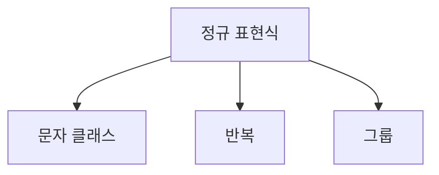

## 🎤 Python 정규 표현식 완전 정복

---

### 📍 1. 개요

- Python의 `re` 모듈은 텍스트 처리에 필수적인 도구
- 딥러닝 전처리에서 자주 사용됨
- 주요 기능: 검색, 추출, 치환

---

### 🔧 2. 주요 함수

| 함수 | 설명 | 예시 |
|------|------|------|
| `re.match()` | 문자열 시작에서 패턴 검사 | `re.match(r"\d+", "123abc")` |
| `re.search()` | 전체 문자열에서 첫 일치 검색 | `re.search(r"\d+", "abc123")` |
| `re.findall()` | 모든 일치 항목 리스트 반환 | `re.findall(r"\d+", "abc123def456")` |
| `re.sub()` | 패턴을 다른 문자열로 치환 | `re.sub(r"\d+", "#", "abc123")` |
| `re.compile()` | 패턴 객체로 컴파일 | `pattern.findall("abc123")` |

---

### 🔤 3. 패턴 요소

#### 문자 클래스

- `\d`: 숫자
- `\w`: 알파벳, 숫자, 밑줄
- `\s`: 공백 문자

#### 앵커

- `^`: 시작
- `$`: 끝
- `\b`: 단어 경계

#### 반복

- `*`: 0회 이상
- `+`: 1회 이상
- `{n,m}`: n~m회 반복

#### 그룹과 선택

- `(abc)`: 그룹화
- `a|b`: a 또는 b
- `(?P<name>...)`: 이름 있는 그룹

---

### 🔍 4. 고급 패턴: Lookahead / Lookbehind

| 패턴 | 의미 |
|------|------|
| `(?=...)` | 긍정 전방탐색 |
| `(?!...)` | 부정 전방탐색 |
| `(?<=...)` | 긍정 후방탐색 |
| `(?<!...)` | 부정 후방탐색 |

예시:
```python
re.findall(r"\w+(?=\.)", "file.txt image.png")
```

---

### 🧪 5. 실전 예제

- 이메일 추출:
  ```python
  re.findall(r"[a-zA-Z0-9._%+-]+@[a-zA-Z0-9.-]+\.[a-zA-Z]{2,}", text)
  ```
- 한글 포함 여부:
  ```python
  re.search(r"[가-힣]", text)
  ```

---

### 📐 6. 시각화 예시 (Mermaid)



---

### 📚 7. 용어 정리

| 용어 | 설명 |
|------|------|
| 앵커 | 문자열 위치 지정 |
| 전방탐색 | 앞 조건 검사 |
| 후방탐색 | 뒤 조건 검사 |
| 캡처 그룹 | 괄호로 묶은 추출 대상 |
| 컴파일 | 패턴 객체화로 성능 향상 |

---

