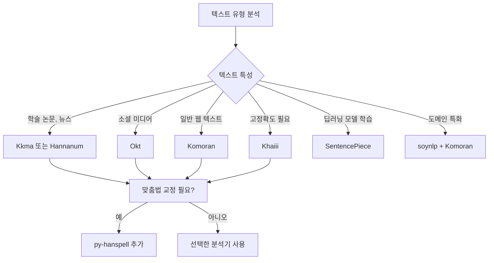

# 한국어 자연어처리 전처리 모듈 가이드

## 1. 개요

### 1.1. 한국어 NLP의 특수성

한국어는 교착어(agglutinative language)로서 어간에 다양한 어미와 조사가 결합되는 특징을 가집니다. 
이러한 특성으로 인해 영어와 달리 단순한 공백 기반 토크나이제이션(tokenization)으로는 의미 있는 단위를 추출하기 어렵습니다. 
따라서 형태소 분석(morphological analysis)이 한국어 자연어처리의 핵심 전처리 단계가 됩니다.

### 1.2. 전처리 파이프라인

한국어 텍스트 전처리는 일반적으로 다음과 같은 단계를 거칩니다.

## 2. 형태소 분석기 (Morphological Analyzers)

### 2.1. 규칙 기반 형태소 분석기

#### 2.1.1. Kkma (꼬꼬마)

서울대학교에서 개발한 규칙 기반 형태소 분석기로, 정교한 문법 규칙을 바탕으로 작동합니다.

**주요 특징:**
- 세밀한 형태소 분석과 품사 태깅
- 문장 분리 기능 제공
- 의존 구문 분석 지원
- 상세한 품사 태그 체계 (약 70개 이상)

**장점:**
- 높은 분석 정확도
- 복잡한 문장 구조 분석 가능
- 학술적 텍스트 분석에 적합

**단점:**
- 느린 처리 속도
- 높은 메모리 사용량
- 신조어나 구어체 처리 약함

#### 2.1.2. Hannanum (한나눔)

KAIST에서 개발한 전통적인 형태소 분석기로, 규칙 기반 접근 방식을 사용합니다.

**주요 특징:**
- 안정적인 형태소 분석
- 품사 태깅 및 구문 분석 지원
- Java 기반 구현

**장점:**
- 안정적이고 검증된 성능
- 표준어 분석에 강함
- 문어체 텍스트 처리에 적합

**단점:**
- Kkma보다는 빠르지만 여전히 느린 편
- 신조어 및 비표준어 처리 제한적
- 사용자 사전 추가가 복잡함

### 2.2. 통계 기반 형태소 분석기

#### 2.2.1. Komoran (코모란)

Shineware에서 개발한 통계 기반 형태소 분석기로, 규칙과 통계를 결합한 하이브리드 접근 방식을 사용합니다.

**주요 특징:**
- 비교적 빠른 처리 속도
- 사용자 사전 추가 용이
- Java 기반이지만 Python 래퍼 제공

**장점:**
- 속도와 정확도의 균형이 좋음
- 사용자 사전 커스터마이징이 쉬움
- 실용적인 성능

**단점:**
- 품사 태그 체계가 다소 단순
- 복잡한 구문 분석은 제한적
- 일부 예외적인 케이스 처리 약함

#### 2.2.2. Okt (Open Korean Text)

트위터(현 X)에서 개발한 오픈소스 한국어 처리기로, 구어체와 소셜 미디어 텍스트에 최적화되어 있습니다.

**주요 특징:**
- 소셜 미디어 텍스트 특화
- 정규화(normalization) 기능 내장
- 이모티콘 및 특수 문자 처리

**장점:**
- 매우 빠른 처리 속도
- 신조어 및 인터넷 용어 처리 우수
- 구어체 및 비표준어 처리 강함
- 간단한 API

**단점:**
- 문어체 텍스트 정확도 낮음
- 세밀한 분석 불가
- 학술적 텍스트에는 부적합

### 2.3. 딥러닝 기반 형태소 분석기

#### 2.3.1. Khaiii (카카오 한국어 형태소 분석기)

카카오에서 개발한 CNN 기반 딥러닝 형태소 분석기입니다.

**주요 특징:**
- Convolutional Neural Network 사용
- 문맥 정보를 활용한 분석
- C++로 구현되어 Python 바인딩 제공

**장점:**
- 높은 정확도
- 미등록어 및 신조어 처리 우수
- 문맥을 고려한 중의성 해소

**단점:**
- 초기 모델 로딩 시간 소요
- GPU 없이는 다른 분석기 대비 느릴 수 있음
- 설치가 다소 복잡함 (빌드 필요)

## 3. 통계적 접근 방식

### 3.1. soynlp

비지도 학습 기반의 한국어 자연어처리 라이브러리로, 형태소 분석기라기보다는 데이터 기반 토크나이저입니다.

**주요 특징:**
- 코퍼스 통계 기반 단어 추출
- 응집도(cohesion)와 분기 엔트로피(branching entropy) 활용
- 사전 없이 데이터에서 직접 학습

**핵심 알고리즘:**

응집도 점수는 다음과 같이 계산됩니다:

$$
\text{Cohesion}(w) = \sqrt[n]{\prod_{i=1}^{n} P(c_i | c_1, ..., c_{i-1})}
$$

여기서 $w$는 단어, $c_i$는 $i$번째 문자, $n$은 단어 길이입니다.

**장점:**
- 도메인 특화 용어 추출 가능
- 사전 구축 없이 사용 가능
- 신조어 및 전문 용어 발견에 효과적

**단점:**
- 충분한 크기의 코퍼스 필요
- 품사 태깅 미지원
- 정확한 형태소 분석은 불가능

## 4. 서브워드 토크나이제이션 (Subword Tokenization)

### 4.1. Google SentencePiece

구글에서 개발한 언어 독립적 서브워드 토크나이저로, BPE(Byte Pair Encoding)와 유니그램 언어 모델(Unigram Language Model)을 지원합니다.

**주요 특징:**
- 언어에 구애받지 않는 토크나이제이션
- 전처리 없이 원본 텍스트 직접 처리
- BPE 및 Unigram LM 알고리즘 지원

**BPE 알고리즘 원리:**

$$
\text{score}(x, y) = \frac{\text{freq}(xy)}{\text{freq}(x) \times \text{freq}(y)}
$$

가장 높은 점수를 가진 문자쌍을 반복적으로 병합합니다.

**장점:**
- OOV(Out-Of-Vocabulary) 문제 해결
- 다국어 모델 학습에 적합
- 트랜스포머 모델과 호환성 우수
- BERT, GPT 등 사전학습 모델에서 사용

**단점:**
- 의미 단위 분리가 불명확할 수 있음
- 한국어 형태소 정보 손실
- 충분한 학습 데이터 필요

## 5. 보조 도구

### 5.1. py-hanspell

네이버 맞춤법 검사기를 활용한 한국어 맞춤법 교정 라이브러리입니다.

**주요 특징:**
- 네이버 및 다음 맞춤법 검사 API 활용
- 띄어쓰기 교정 포함
- 간단한 인터페이스

**장점:**
- 높은 맞춤법 교정 정확도
- 사용이 매우 간단함
- 전처리 초기 단계에 유용

**단점:**
- 외부 API 의존으로 인터넷 연결 필요
- API 속도 제한 존재
- 대량 텍스트 처리에 부적합

## 6. 비교 및 선택 가이드

### 6.1. 기능별 비교표

| 모듈 | 분석 방식 | 처리 속도 | 정확도 | 품사 태깅 | 사용자 사전 | 최적 사용 사례 |
|------|----------|-----------|--------|-----------|------------|--------------|
| **Kkma** | 규칙 기반 | ★☆☆ | ★★★ | 지원 (70+) | 어려움 | 학술 텍스트, 정밀 분석 |
| **Hannanum** | 규칙 기반 | ★★☆ | ★★★ | 지원 (60+) | 어려움 | 표준어, 문어체 |
| **Komoran** | 통계 기반 | ★★★ | ★★☆ | 지원 (45+) | 쉬움 | 범용 텍스트, 실용적 |
| **Okt** | 통계 기반 | ★★★ | ★★☆ | 지원 (25+) | 보통 | 소셜 미디어, 구어체 |
| **Khaiii** | 딥러닝 | ★★☆ | ★★★ | 지원 (40+) | 보통 | 고정확도 요구, 신조어 |
| **soynlp** | 데이터 기반 | ★★★ | ★☆☆ | 미지원 | 불필요 | 도메인 특화, 단어 추출 |
| **SentencePiece** | 서브워드 | ★★★ | - | 미지원 | 불필요 | 딥러닝 모델, 다국어 |
| **py-hanspell** | API 기반 | ★☆☆ | ★★★ | 미지원 | 불필요 | 맞춤법 교정 전처리 |

### 6.2. 사용 사례별 추천

**상황별 선택 가이드:**

1. **속도가 최우선인 경우**: Okt 또는 Komoran
2. **정확도가 최우선인 경우**: Kkma 또는 Khaiii
3. **신조어 처리가 중요한 경우**: Okt 또는 Khaiii
4. **사용자 사전 활용이 필요한 경우**: Komoran
5. **트랜스포머 모델 학습**: SentencePiece
6. **전문 용어가 많은 도메인**: soynlp로 단어 추출 후 Komoran에 사전 추가

### 6.3. 하이브리드 접근 방식

실무에서는 여러 모듈을 조합하여 사용하는 것이 효과적입니다.

**추천 파이프라인:**

- **일반 텍스트**: py-hanspell → Komoran
- **소셜 미디어**: Okt (정규화 포함)
- **학술/법률 텍스트**: py-hanspell → Kkma
- **전문 도메인**: soynlp (단어 추출) → Komoran (사용자 사전)
- **딥러닝 모델**: 코퍼스에 맞춰 SentencePiece 학습

## 7. 용어 목록

| 용어 | 설명 |
|------|------|
| **교착어** | 어간에 접사가 결합하여 문법적 기능을 나타내는 언어 유형 |
| **형태소** | 의미를 가진 최소 단위 |
| **품사 태깅** | 각 형태소에 품사 정보를 부착하는 작업 |
| **토크나이제이션** | 텍스트를 토큰 단위로 분할하는 과정 |
| **응집도** | 문자열이 하나의 단어로 뭉쳐 있는 정도 |
| **분기 엔트로피** | 특정 문자열 다음에 나타나는 문자의 다양성 |
| **서브워드** | 단어보다 작은 단위로, 문자와 단어 사이의 중간 수준 |
| **BPE** | 빈도 기반으로 문자쌍을 반복적으로 병합하는 알고리즘 |
| **유니그램 언어 모델** | 각 서브워드가 독립적으로 나타난다고 가정하는 확률 모델 |
| **OOV** | 어휘집에 없는 미등록 단어 |
| **중의성 해소** | 문맥에 따라 여러 의미 중 올바른 의미를 선택하는 과정 |
| **코퍼스** | 자연어 분석을 위한 대규모 텍스트 집합 |
| **의존 구문 분석** | 문장 내 단어 간의 의존 관계를 분석하는 기법 |
| **정규화** | 다양한 표현을 표준 형태로 변환하는 작업 |