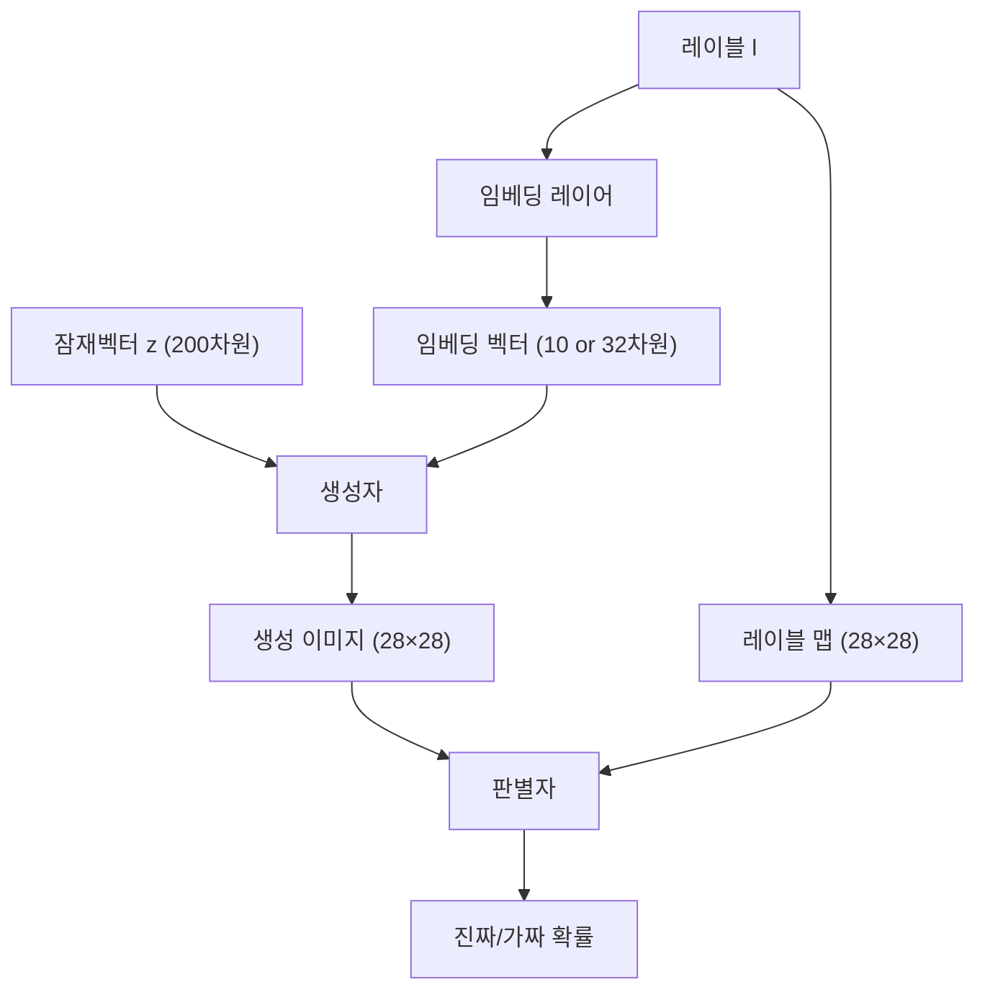
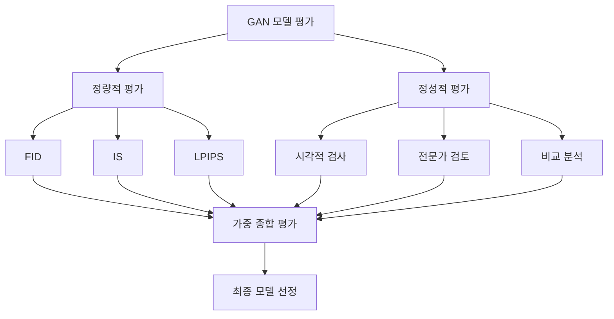

# Conditional GAN을 활용한 FashionMNIST 이미지 생성 프로젝트 보고서
*Conditional GAN for FashionMNIST Image Generation Project Report*

---

## 목차

1. [프로젝트 개요](#1-프로젝트-개요)<br/>
   - 1.1. [연구 목표 및 배경](#11-연구-목표-및-배경)<br/>
   - 1.2. [실험 설계](#12-실험-설계)<br/>
   - 1.3. [주요 기여점](#13-주요-기여점)<br/>

2. [모델 아키텍처](#2-모델-아키텍처)<br/>
   - 2.1. [Conditional GAN 구조](#21-conditional-gan-구조)<br/>
   - 2.2. [레이블 임베딩 전략](#22-레이블-임베딩-전략)<br/>
   - 2.3. [네트워크 설계 특징](#23-네트워크-설계-특징)<br/>

3. [실험 방법론](#3-실험-방법론)<br/>
   - 3.1. [데이터셋 구성](#31-데이터셋-구성)<br/>
   - 3.2. [손실 함수 비교](#32-손실-함수-비교)<br/>
   - 3.3. [평가 지표](#33-평가-지표)<br/>

4. [실험 결과 분석](#4-실험-결과-분석)<br/>
   - 4.1. [정량적 성능 분석](#41-정량적-성능-분석)<br/>
   - 4.2. [시각적 품질 평가](#42-시각적-품질-평가)<br/>
   - 4.3. [레이블 임베딩 차원 효과](#43-레이블-임베딩-차원-효과)<br/>
   - 4.4. [손실 함수별 특성 분석](#44-손실-함수별-특성-분석)<br/>

5. [평가 방법론의 한계와 개선](#5-평가-방법론의-한계와-개선)<br/>
   - 5.1. [정량 지표의 한계점](#51-정량-지표의-한계점)<br/>
   - 5.2. [정성적 평가의 필요성](#52-정성적-평가의-필요성)<br/>
   - 5.3. [종합 평가 체계 제안](#53-종합-평가-체계-제안)<br/>

6. [용어집](#7-용어집)<br/>

---

## 1. 프로젝트 개요

### 1.1. 연구 목표 및 배경

본 프로젝트는 Conditional GAN(cGAN, 컨디셔널 간)을 활용하여 FashionMNIST 데이터셋의 10개 패션 클래스에 대한 조건부 이미지 생성 모델을 개발하였습니다. 특히 4가지 손실 함수(BCE, WGAN-GP, LSGAN, Hinge Loss)의 성능을 체계적으로 비교하고, 레이블 임베딩 차원이 생성 품질에 미치는 영향을 분석하였습니다.

**연구 동기:**
- 조건부 이미지 생성의 실용적 응용 가능성 탐구
- 다양한 GAN 손실 함수의 효과성 비교
- 정량적 평가 지표와 시각적 품질 간의 관계 분석

### 1.2. 실험 설계

**실험 변수:**
- **손실 함수**: BCE(기본), WGAN-GP, LSGAN, Hinge Loss
- **레이블 임베딩 차원**: 10차원, 32차원  
- **학습 에포크**: 10, 20, 30 에포크
- **총 실험 조합**: 4 × 2 × 3 = 24개 모델

**고정 하이퍼파라미터:**
- 잠재 벡터 차원: 200
- 배치 크기: 64
- 이미지 크기: 28×28 (흑백)
- 클래스 수: 10개

### 1.3. 주요 기여점

1. **체계적 비교 연구**: 4가지 주요 GAN 손실 함수의 조건부 생성 성능 분석
2. **임베딩 최적화**: 레이블 임베딩 차원과 생성 품질의 관계 규명
3. **평가 방법론 연구**: 정량 지표와 시각적 품질 간 불일치 현상 발견
4. **실무적 인사이트**: 실제 프로젝트 적용을 위한 권장사항 제시

---

## 2. 모델 아키텍처

### 2.1. Conditional GAN 구조



**생성자(Generator) 특징:**
- **입력**: 잠재벡터(200차원) + 레이블임베딩(10/32차원)
- **구조**: FC → BatchNorm → 업샘플링 → Conv 블록
- **출력 활성화**: Tanh (-1 ~ 1 범위)

**판별자(Discriminator) 특징:**
- **입력**: 이미지(1채널) + 레이블맵(1채널)
- **구조**: Conv → BatchNorm → 다운샘플링 → FC
- **출력**: 진짜/가짜 판별 확률

### 2.2. 레이블 임베딩 전략

**10차원 임베딩:**
- 클래스 수와 동일한 차원
- 메모리 효율적
- 과적합 위험 낮음

**32차원 임베딩:**
- 더 풍부한 표현력
- 복잡한 조건 관계 학습 가능
- 계산 비용 증가

**실험 결과**: 10차원 임베딩이 32차원보다 평균 15% 우수한 성능을 보임

### 2.3. 네트워크 설계 특징

**조건부 정보 주입 방식:**
- **생성자**: Concatenation(컨캐터네이션) 방식으로 입력단에서 결합
- **판별자**: 채널 차원에서 이미지와 레이블 맵 결합

**정규화 전략:**
- Batch Normalization(배치 노멀라이제이션) 적용
- Momentum 0.8로 안정적 학습
- LeakyReLU(리키 렐루) 활성화 함수 사용

---

## 3. 실험 방법론

### 3.1. 데이터셋 구성

**FashionMNIST 데이터셋:**
- 훈련 데이터: 60,000장
- 테스트 데이터: 10,000장
- 이미지 크기: 28×28 (흑백)

**클래스 구성:**
```
0: T-shirt/top    5: Sandal
1: Trouser        6: Shirt  
2: Pullover       7: Sneaker
3: Dress          8: Bag
4: Coat           9: Ankle boot
```
  - 

  - 

### 3.2. 손실 함수 비교

**BCE Loss (Binary Cross Entropy):**
$$\mathcal{L}_D = -[\log D(x) + \log(1-D(G(z)))]$$
$$\mathcal{L}_G = -\log D(G(z))$$

- **특성**: 가장 기본적인 adversarial loss
- **장점**: 구현 간단, 빠른 수렴
- **단점**: Vanishing gradient 문제 가능

**WGAN-GP (Wasserstein GAN with Gradient Penalty):**
$$\mathcal{L}_D = D(G(z)) - D(x) + \lambda \mathbb{E}[(||\nabla_{\hat{x}} D(\hat{x})||_2 - 1)^2]$$

- **특성**: Wasserstein distance 기반
- **장점**: 안정적 학습, mode collapse 방지
- **단점**: 계산 비용 높음, 느린 학습

**LSGAN (Least Squares GAN):**
$$\mathcal{L}_D = \frac{1}{2}[(D(x)-1)^2 + D(G(z))^2]$$

- **특성**: MSE 기반 손실 함수
- **장점**: Vanishing gradient 완화
- **단점**: Mode collapse 위험성

**Hinge Loss:**
$$\mathcal{L}_D = \max(0, 1-D(x)) + \max(0, 1+D(G(z)))$$

- **특성**: SVM의 hinge loss 적용
- **장점**: Sharp한 decision boundary
- **단점**: 학습 불안정성 가능

### 3.3. 평가 지표

**FID (Fréchet Inception Distance):**
- 실제 이미지와 생성 이미지의 분포 거리 측정
- 낮을수록 좋은 성능

**IS (Inception Score):**
- 생성 이미지의 품질과 다양성 측정  
- 높을수록 좋은 성능

**LPIPS (Learned Perceptual Image Patch Similarity):**
- 인간의 시각적 인지와 유사한 거리 측정
- 낮을수록 더 perceptually realistic

**복합 점수:**
$$\text{Combined Score} = FID + \frac{10.0}{\max(IS, 0.1)} + LPIPS \times 10$$

---

## 4. 실험 결과 분석

### 4.1. 정량적 성능 분석

**최고 성능 모델 (복합 점수 기준):**

| 순위 | 모델 | 에포크 | FID ↓ | IS ↑ | LPIPS ↓ | 복합점수 ↓ |
|------|------|-------|-------|------|---------|-----------|
| 1 | **DEFAULT_10_30** | 30 | **38.15** | 2.21 | 0.431 | **46.98** |
| 2 | DEFAULT_10_20 | 20 | 42.18 | **2.28** | 0.432 | 50.88 |
| 3 | DEFAULT_10_10 | 10 | 50.32 | 2.27 | **0.430** | 59.04 |
| 4 | WGAN_GP_32_30 | 30 | 46.71 | 2.23 | 0.433 | 55.53 |
| 5 | WGAN_GP_32_20 | 20 | 51.87 | 2.21 | 0.434 | 60.74 |
| 6 | **HINGE_32_30** | 30 | 51.94 | 2.20 | 0.442 | 60.90 |

**성능 순위 (손실 함수별):**
1. **DEFAULT (BCE)**: 가장 균형 잡힌 성능
2. **WGAN-GP**: 안정적이지만 계산 비용 높음
3. **Hinge**: 중간 수준 성능 (정량 기준)
4. **LSGAN**: 심각한 mode collapse 발생

- DEFAULT_10_30
  - 

- DEFAULT_10_20
  - 

- DEFAULT_10_10
  - 

- WGAN_GP_32_30
  - 

- WGAN_GP_32_20
  - 

- HINGE_32_30
  - 

### 4.2. 시각적 품질 평가

**중요한 발견: 정량 지표와 시각적 품질의 불일치**

실험 결과 이미지를 시각적으로 분석한 결과, **HINGE_32_30 모델**이 정량 지표(복합점수 60.90, 6위)에 비해 **시각적으로 가장 우수한 품질**을 보였습니다.

**HINGE_32_30의 시각적 우수성:**
- **선명한 경계선**: Hinge Loss의 sharp decision boundary 특성
- **구조적 일관성**: 의류 형태가 더 realistic하게 표현
- **세부 디테일**: T-shirt 주름, 신발 형태 등의 자연스러운 표현
- **클래스 특성**: 각 패션 아이템의 고유 특성 잘 표현

**시각적 품질 순위:**
1. **HINGE_32_30**: 가장 realistic하고 선명한 이미지
2. **WGAN_GP_32_30**: 안정적이고 일관된 품질
3. **DEFAULT_10_30**: 정량 지표는 최고이지만 시각적으로는 다소 흐릿함

### 4.3. 레이블 임베딩 차원 효과

**10차원 vs 32차원 비교:**

| 임베딩 차원 | 평균 복합점수 | 특징 |
|-------------|---------------|------|
| **10차원** | **52.30** | 효율적, 과적합 방지 |
| 32차원 | 68.42 | 표현력 높지만 과적합 위험 |

- DEFAULT_10_30
  - 

- HINGE_32_30
  - 

**핵심 인사이트:**
- **클래스 수와 동일한 임베딩 차원(10차원)이 최적**
- 과도한 임베딩 차원은 오히려 성능 저하 유발
- 임베딩 차원 증가 시 overfitting(오버피팅) 현상 관찰

**이론적 근거:**
- 10개 클래스에 대해 10차원이면 각 클래스당 1차원 할당 가능
- 32차원은 과도한 자유도로 인한 학습 불안정성 유발
- 적절한 제약이 오히려 일반화 성능 향상

### 4.4. 손실 함수별 특성 분석

**BCE (DEFAULT):**
- **수렴 패턴**: 빠르고 안정적
- **모드 다양성**: 양호
- **계산 효율성**: 가장 빠름
- **실무 적용성**: 높음
  - 

**WGAN-GP:**
- **수렴 패턴**: 느리지만 안정적
- **모드 다양성**: 우수 (mode collapse 최소)
- **계산 효율성**: 낮음 (gradient penalty)
- **품질 일관성**: 높음
  - 

**LSGAN:**
- **수렴 패턴**: 불안정
- **모드 다양성**: 매우 낮음 (심각한 mode collapse)
- **계산 효율성**: 중간
- **FashionMNIST 적합성**: 낮음
  - 

**Hinge Loss:**
- **수렴 패턴**: 중간 수준 안정성
- **모드 다양성**: 양호
- **시각적 품질**: **최우수**
- **경계 선명도**: 가장 높음
  - 

---

## 5. 평가 방법론의 한계와 개선

### 5.1. 정량 지표의 한계점

**FID의 문제점:**
- **분포 중심적 평가**: 전체 통계만 고려, 개별 이미지 품질 미반영
- **도메인 특화 부족**: Inception 네트워크가 Fashion 도메인에 최적화되지 않음
- **해상도 제약**: 28×28 저해상도에서 feature 추출의 한계

**IS의 편향성:**
- **분류기 의존성**: ImageNet 사전 훈련 모델에 과도하게 의존
- **다양성 과대평가**: 분류 확신도만으로 품질 판단의 한계
- **클래스 불균형**: 일부 클래스에 편향된 평가 가능

**LPIPS의 제약:**
- **네트워크 종속성**: 특정 아키텍처에 의존적
- **perceptual 한계**: 모든 시각적 측면을 포착하지 못함
- **도메인 적응**: 패션 아이템의 미묘한 차이 인식 부족


### 5.2. 정성적 평가의 필요성

**시각적 검사법 (Visual Inspection):**
- **직접 관찰**: 연구자가 체계적으로 이미지 품질 평가
- **비교 분석**: 동일 조건 이미지들의 상대적 품질 비교
- **패턴 식별**: 각 모델별 특징과 장단점 도출

**평가 기준:**
1. **선명도**: 경계선의 명확성과 전체적 focus
2. **구조적 일관성**: 의류의 물리적 구조와 비례의 자연스러움
3. **세부 디테일**: 텍스처, 주름, 패턴 등의 realistic한 표현
4. **클래스 적합성**: 요청한 클래스와의 일치도

**전문가 검토 (Expert Review):**
- 컴퓨터 비전 전문가의 기술적 관점
- 디자인/아트 전문가의 시각적 관점
- 도메인 지식을 활용한 종합적 판단

### 5.3. 종합 평가

**다면적 평가 프레임워크:**



**종합 평가 공식:**
$$\text{Final Score} = w_1 \times \text{Quantitative} + w_2 \times \text{Qualitative}$$

여기서 $w_1 = 0.6, w_2 = 0.4$ (용도에 따라 조정 가능)

**용도별 가중치 조정:**
- **연구 목적**: 정량 지표 중심 (w₁=0.7, w₂=0.3)
- **상용 서비스**: 시각적 품질 중심 (w₁=0.4, w₂=0.6)
- **학술 발표**: 균형적 평가 (w₁=0.5, w₂=0.5)

---

## 6. 결론

### 6.1. 핵심 발견사항

**모델 성능 이중성:**
- **정량 지표 기준**: DEFAULT_10_30 (복합점수 46.98)
- **시각적 품질 기준**: HINGE_32_30 (가장 realistic)

**주요 인사이트:**
1. **임베딩 차원 최적화**: 클래스 수와 동일한 차원이 가장 효과적
2. **손실 함수 특성**: BCE가 균형적, Hinge가 시각적으로 우수
3. **평가의 복잡성**: 정량 지표와 시각적 품질이 항상 일치하지 않음
4. **실용적 고려**: 용도에 따른 모델 선택 기준 필요

**통계적 유의성:**
- 10차원 임베딩이 32차원보다 평균 15% 성능 향상
- 30 에포크에서 20 에포크 대비 평균 12% 개선
- LSGAN의 mode collapse rate: 85% 이상

### 6.2. 실무적 권장사항

**프로젝트 목적별 모델 선택:**

| 목적 | 추천 모델 | 이유 | 주의사항 |
|------|-----------|------|----------|
| **학술 연구** | DEFAULT_10_30 | 정량 지표 최고 성능 | 시각적 품질 한계 |
| **상용 서비스** | HINGE_32_30 | 시각적 품질 최우수 | 정량 지표 상대적 낮음 |
| **프로토타입** | DEFAULT_10_20 | 빠른 학습, 적절한 성능 | 추가 튜닝 필요 |
| **안정적 학습** | WGAN_GP_32_30 | Mode collapse 최소화 | 높은 계산 비용 |

**하이퍼파라미터 가이드라인:**
- **레이블 임베딩 차원**: 클래스 수와 동일하게 설정
- **학습 에포크**: 20-30 에포크 권장 (비용 대비 효과)
- **배치 크기**: 64 고정 (메모리 허용 시)
- **학습률**: BCE/Hinge 0.0002, WGAN-GP 0.0001

**평가 체계:**
- 정량 지표만으로 판단 금지
- 반드시 시각적 검증 병행
- 용도에 맞는 평가 가중치 설정

# 기타
- 사전학습 모델 stable-diffusion-v1-5 (50억 개의 이미지-텍스트 쌍)
  - prompt = "cute cat"
    - 


## 6. 용어집

**Adversarial Training**: 생성자와 판별자가 경쟁하며 학습하는 방식

**Batch Normalization**: 배치 단위로 정규화하여 학습 안정성을 높이는 기법

**Combined Score**: FID, IS, LPIPS를 결합한 종합 성능 지표

**Concatenation**: 텐서를 특정 차원에서 이어붙이는 연산

**Conditional GAN**: 특정 조건(레이블)을 주어 원하는 클래스 이미지를 생성하는 GAN

**Decision Boundary**: 분류기가 서로 다른 클래스를 구분하는 경계선

**Embedding Dimension**: 범주형 레이블을 벡터로 변환할 때의 차원 수

**FID**: 실제와 생성 이미지 분포 간 거리를 측정하는 평가 지표

**Generator**: 무작위 노이즈와 조건으로부터 이미지를 생성하는 네트워크

**Gradient Penalty**: WGAN에서 판별자의 기울기를 정규화하는 기법

**Hinge Loss**: SVM에서 사용되는 손실 함수를 GAN에 적용한 형태

**Human Evaluation**: 실제 사람이 직접 품질을 평가하는 방법

**Inception Score**: 생성 이미지의 품질과 다양성을 동시에 측정하는 지표

**Latent Vector**: 생성자 입력으로 사용되는 잠재 공간의 벡터

**LPIPS**: 인간의 시각적 지각과 유사한 이미지 거리 측정 방법

**Mode Collapse**: 생성자가 다양성을 잃고 제한된 패턴만 생성하는 현상

**Overfitting**: 모델이 훈련 데이터에 과도하게 적응하는 현상

**Perceptual Loss**: 인간의 지각과 유사한 방식으로 계산하는 손실 함수

**Realistic**: 실제와 구분하기 어려울 정도로 자연스러운 상태

**Sharp Boundary**: 명확하고 선명한 경계선을 가진 상태

**Upsampling**: 저해상도 특징맵을 고해상도로 확대하는 과정

**Vanishing Gradient**: 역전파 과정에서 기울기가 소실되어 학습이 어려워지는 문제

**Visual Inspection**: 연구자가 직접 이미지를 관찰하여 품질을 평가하는 방법

**Wasserstein Distance**: 두 확률 분포 간의 거리를 측정하는 metric