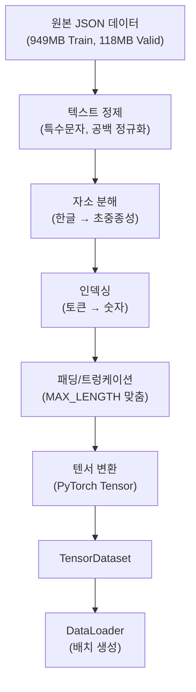

# 기계 번역 프로젝트: 데이터 전처리 및 임베딩 전략

## 목차

1. [프로젝트 개요](#1-프로젝트-개요)<br/>
2. [데이터 분석](#2-데이터-분석)<br/>
3. [토큰화 전략](#3-토큰화-전략)<br/>
4. [특수 토큰 정의](#4-특수-토큰-정의)<br/>
5. [어휘 사전 구축](#5-어휘-사전-구축)<br/>
6. [문장 길이 분석 및 MAX_LENGTH 설정](#6-문장-길이-분석-및-max_length-설정)<br/>
7. [임베딩 전략](#7-임베딩-전략)<br/>
8. [데이터 로더 구현 방향](#8-데이터-로더-구현-방향)<br/>
9. [구현 로드맵](#9-구현-로드맵)<br/>
10. [용어 목록](#10-용어-목록)<br/>

---

## 1. 프로젝트 개요

### 1.1. 미션 목표

한국어 문장을 영어로 번역하는 Seq2Seq 모델 구축을 위한 데이터 전처리 및 어휘 사전 구축. 기본 Seq2Seq 모델과 Attention 메커니즘이 적용된 모델의 성능을 비교 분석.

### 1.2. 데이터 규모

- **훈련 데이터**: 949MB (약 100만+ 문장 쌍 예상)
- **검증 데이터**: 118MB
- **데이터 특성**: 일상생활 및 구어체 중심, 다양한 도메인(해외영업, 여행, 음식 등)

### 1.3. 개발 환경

- **플랫폼**: Google Colab Pro
- **GPU**: NVIDIA L4 (VRAM 약 22.5GB)
- **프레임워크**: PyTorch

### 1.4. 모델 구조 고려사항

본 문서는 데이터 전처리 단계에 집중하며, 향후 구현할 두 가지 모델 아키텍처를 고려하여 설계됨:

**Seq2Seq 기본 모델**
- Encoder-Decoder 구조
- GRU 기반 순환 신경망(Recurrent Neural Network)
- Teacher Forcing 기법 적용

**Attention 모델**
- Bahdanau 또는 Luong Attention
- Encoder의 모든 히든 스테이트(Hidden State) 활용
- 동적 정렬(Dynamic Alignment) 학습

---

## 2. 데이터 분석

### 2.1. 데이터 구조

```json
{
  "ko": "원하시는 색상을 회신해 주시면 바로 제작 들어가겠습니다.",
  "mt": "If you reply to the color you want, we will start making it right away.",
  "word_count_ko": 7,
  "word_count_en": 15,
  "word_ratio": 2.143,
  "domain": "해외영업",
  "subdomain": "도소매유통",
  "style": "구어체"
}
```

### 2.2. 주요 특성

**문장 길이 편차**
- 매우 짧은 문장: ">속옷을?" (1단어)
- 긴 문장: 10단어 이상
- 다양한 길이 분포로 인한 패딩 전략 중요

**한영 단어 수 비율(Word Ratio)**
- 범위: 1.0 ~ 4.0
- 영어가 평균적으로 더 긴 경향
- 번역 시 시퀀스 길이 차이 고려 필요

**구어체 특성**
- 특수 기호: '>' (대화 맥락 표시)
- 익명화: 'AAA' (인명 처리)
- 문법적으로 불완전한 문장 포함
- 구어적 표현 다수

### 2.3. 전처리 전 분석 항목

**필수 분석 사항**

1. **문장 수 통계**
   - 전체 문장 쌍 개수
   - 훈련/검증 데이터 비율 확인
   - 도메인별 문장 수 분포

2. **길이 분포 분석**
   - 문자 단위 길이 분포
   - Percentile 분석 (50th, 75th, 90th, 95th, 99th)
   - 한국어/영어 각각 분석

3. **데이터 품질 검사**
   - 중복 문장 비율
   - 빈 문장 또는 누락 필드
   - 특수 문자 패턴 및 빈도

4. **도메인 분석**
   - 도메인별 분포 (일상생활, 해외영업 등)
   - 스타일별 분포 (구어체, 문어체 등)
   - 불균형 정도 확인

---

## 3. 토큰화 전략

### 3.1. 토큰화 방식 비교

#### 3.1.1. 형태소 분리 (Morpheme-level)

**개념**: 의미 있는 최소 문법 단위로 분리

```
예시: "먹었습니다" → ["먹", "었", "습니다"]
```

**장점**
- 문법적 의미 단위 보존
- 어휘 사전 크기 감소 (단어 대비)
- 언어학적으로 타당한 분석
- 문법 정보 명시적

**단점**
- 외부 라이브러리 의존 (Mecab, Okt, Komoran 등)
- 한국어만 특별 처리 필요 (한영 비대칭)
- 신조어, 오타 처리 취약
- Colab 환경 설치 복잡
- 형태소 분석기 성능에 의존

**도구**
- Mecab-ko: 가장 빠름, 설치 복잡
- Okt (Open Korean Text): 구어체 강함, 느림
- Komoran: 균형잡힌 성능

---

#### 3.1.2. 음절 분리 (Syllable-level)

**개념**: 한글 음절 단위로 분리

```
예시: "먹었습니다" → ["먹", "었", "습", "니", "다"]
```

**장점**
- 구현 간단 (단순 문자열 분할)
- 외부 라이브러리 불필요
- 한국어 특성 반영 (음절 = 의미 단위)
- 적절한 세분화 수준

**단점**
- 어휘 사전 크기 여전히 큼 (약 10,000~20,000개)
- OOV(Out-of-Vocabulary) 문제 존재
- 빈도 기반 필터링 필요
- 신조어 처리 제한적

---

#### 3.1.3. 자소 분리 (Jamo-level) ⭐ **권장**

**개념**: 한글을 초성(初聲), 중성(中聲), 종성(終聲)으로 분해

```
예시: "먹었습니다"
→ ["ㅁ", "ㅓ", "ㄱ", "ㅇ", "ㅓ", "ㅆ", "ㅅ", "ㅡ", "ㅂ", "ㄴ", "ㅣ", "ㄷ", "ㅏ"]

영어: "hello" → ["h", "e", "l", "l", "o"]
```

**장점**
- **어휘 사전 극소화**: 약 100~150개 고정
- **완벽한 OOV 해결**: 모든 한글 표현 가능
- **신조어, 오타 처리 강건**: 자소 조합으로 모두 표현
- **언어 독립적**: 한영 동일한 방식 (Character-level)
- **직접 구현 간단**: 외부 의존성 최소화
- **대칭성**: 한국어-영어 토큰 단위 일치
- **완벽한 복원 가능**: 디토크나이징(Detokenizing) 손실 없음

**단점**
- **시퀀스 길이 증가**: 음절 대비 2~3배
- **학습 시간 증가**: 긴 시퀀스 처리 부담
- **의미 단위 손실**: 개별 자소는 의미 없음
- **MAX_LENGTH 증가**: 200~300 필요

**Colab L4 환경 고려**
- 22.5GB VRAM으로 긴 시퀀스 처리 충분
- 949MB 대용량 데이터로 패턴 학습 가능
- 배치 크기 조정으로 최적화 가능

---

### 3.2. 최종 선택: 자소 분리

**선택 근거**

1. **교육 목적 충족**: 직접 구현으로 학습 효과 극대화
2. **구현 간단성**: 외부 의존성 최소화, 유지보수 용이
3. **완벽한 일반화**: OOV 문제 원천적 해결
4. **한영 대칭성**: 동일한 Character-level 처리
5. **충분한 리소스**: Colab L4 GPU 활용 가능
6. **데이터 규모**: 949MB로 문자 패턴 학습 충분

**자소 분해 원리**

한글 유니코드 구조 (완성형):
- 기준 코드: 0xAC00 ('가')
- 한글 코드 = (초성 × 588) + (중성 × 28) + 종성 + 0xAC00

분해 공식:
```
초성 인덱스 = (코드 - 0xAC00) ÷ 588
중성 인덱스 = ((코드 - 0xAC00) % 588) ÷ 28
종성 인덱스 = (코드 - 0xAC00) % 28
```

자소 집합:
- **초성 19개**: ㄱ, ㄲ, ㄴ, ㄷ, ㄸ, ㄹ, ㅁ, ㅂ, ㅃ, ㅅ, ㅆ, ㅇ, ㅈ, ㅉ, ㅊ, ㅋ, ㅌ, ㅍ, ㅎ
- **중성 21개**: ㅏ, ㅐ, ㅑ, ㅒ, ㅓ, ㅔ, ㅕ, ㅖ, ㅗ, ㅘ, ㅙ, ㅚ, ㅛ, ㅜ, ㅝ, ㅞ, ㅟ, ㅠ, ㅡ, ㅢ, ㅣ
- **종성 28개**: (없음), ㄱ, ㄲ, ㄳ, ㄴ, ㄵ, ㄶ, ㄷ, ㄹ, ㄺ, ㄻ, ㄼ, ㄽ, ㄾ, ㄿ, ㅀ, ㅁ, ㅂ, ㅄ, ㅅ, ㅆ, ㅇ, ㅈ, ㅊ, ㅋ, ㅌ, ㅍ, ㅎ

---

## 4. 특수 토큰 정의

### 4.1. 특수 토큰 종류

#### 4.1.1. `<PAD>` (Padding Token)

**목적**: 배치 처리를 위한 시퀀스 길이 통일

**필요성**: ✅ 필수 (모든 토큰화 방식)

**역할**
- 가변 길이 시퀀스를 고정 길이 텐서로 변환
- GPU 병렬 처리 가능하게 함
- 손실 계산 시 마스킹(Masking)으로 제외

**사용 예시**
```
문장1 (길이 10): [ㅎ, ㅏ, ㄴ, ㄱ, ㅜ, ㄱ, ㅇ, ㅓ, <PAD>, <PAD>]
문장2 (길이 8):  [ㅇ, ㅕ, ㅇ, ㅇ, ㅓ, <PAD>, <PAD>, <PAD>]
```

**인덱스 할당**: 0 (일반적 관례, 마스킹 연산 편의)

---

#### 4.1.2. `<UNK>` (Unknown Token)

**목적**: 어휘 사전에 없는 토큰 처리

**자소 분리 시 필요성**: ⚠️ 거의 불필요

**이유**
- 모든 한글은 68개 자소 조합으로 표현 가능
- 모든 영어는 26개 알파벳 조합으로 표현 가능
- 숫자 10개로 모든 숫자 표현 가능
- 극소수 특수문자(이모지, 특수 기호)용으로만 필요

**처리 대상**
```
일반 텍스트: 자소/문자로 표현 → <UNK> 불필요
이모지: 😀, ♥, ★ → <UNK> 사용
미정의 특수문자 → <UNK> 사용
```

**인덱스 할당**: 1

---

#### 4.1.3. `<SOS>` (Start of Sequence)

**목적**: Decoder 입력 시작 신호

**필요성**: ✅ 필수

**역할**
- Decoder의 첫 번째 입력 토큰
- 번역 생성 시작점 표시
- Teacher Forcing 메커니즘 구현에 필수

**사용 위치**: Target(영어) 문장 앞

**Teacher Forcing 예시**
```
Decoder Input:  [<SOS>, I, ,  , a, m, ,  , a, ,  , s, t, u, d, e, n, t]
Decoder Output: [I, ,  , a, m, ,  , a, ,  , s, t, u, d, e, n, t, <EOS>]
```

**인덱스 할당**: 2

---

#### 4.1.4. `<EOS>` (End of Sequence)

**목적**: 번역 종료 신호

**필요성**: ✅ 필수

**역할**
- 문장 끝 표시
- Decoder 생성 중단 신호
- 가변 길이 출력 생성 가능하게 함
- 손실 계산의 마지막 타겟

**사용 위치**: Target(영어) 문장 뒤

**추론(Inference) 시 동작**
```
생성 과정:
[<SOS>] → I
[<SOS>, I] → (공백)
[<SOS>, I, (공백)] → a
...
[<SOS>, I, (공백), a, m, ...] → <EOS>  ← 생성 중단
```

**인덱스 할당**: 3

---

### 4.2. Source vs Target 특수 토큰 전략

#### 4.2.1. Source (한국어) 입력

**권장 구성**
```
[자소들..., <EOS>]
```

**이유**
- Encoder는 전체 시퀀스를 한 번에 처리
- `<SOS>`는 불필요 (순차 생성 아님)
- `<EOS>`는 문장 종료 표시로 유용 (선택적)

**예시**
```
입력: "안녕"
자소 분해: [ㅇ, ㅏ, ㄴ, ㄴ, ㅕ, ㅇ]
최종: [ㅇ, ㅏ, ㄴ, ㄴ, ㅕ, ㅇ, <EOS>, <PAD>, ...]
```

---

#### 4.2.2. Target (영어) 출력

**필수 구성**
```
Decoder Input:  [<SOS>, 문자들...]
Decoder Output: [문자들..., <EOS>]
```

**이유**
- Decoder는 순차적으로 한 문자씩 생성
- `<SOS>`: 첫 번째 생성을 위한 입력
- `<EOS>`: 생성 종료 판단

**예시**
```
원문: "hello"

Decoder Input:  [<SOS>, h, e, l, l, o, <PAD>, ...]
Decoder Output: [h, e, l, l, o, <EOS>, <PAD>, ...]
```

---

### 4.3. 특수 토큰 요약

| 토큰 | 인덱스 | 자소 분리 | 음절/형태소 | 사용 위치 | 필요성 |
|------|--------|----------|-----------|----------|--------|
| `<PAD>` | 0 | ✅ 필수 | ✅ 필수 | Source/Target 패딩 | 배치 처리 |
| `<UNK>` | 1 | ⚠️ 거의 불필요 | ✅ 필수 | 미등록 토큰 | OOV 처리 |
| `<SOS>` | 2 | ✅ 필수 | ✅ 필수 | Target 앞 | Decoder 시작 |
| `<EOS>` | 3 | ✅ 필수 | ✅ 필수 | Source/Target 뒤 | 종료 신호 |

---

## 5. 어휘 사전 구축

### 5.1. 자소 기반 어휘 사전

#### 5.1.1. 어휘 구성

**한국어 자소**
- 초성: 19개 (ㄱ~ㅎ)
- 중성: 21개 (ㅏ~ㅣ)
- 종성: 28개 (없음 포함)
- 소계: 68개

**영어 문자**
- 알파벳: 26개 (소문자 a~z)
- 대문자 처리: 소문자로 정규화
- 소계: 26개

**숫자**
- 0~9: 10개

**특수 문자** (필요한 것만 선택)
- 공백 (space)
- 마침표 (.)
- 쉼표 (,)
- 느낌표 (!)
- 물음표 (?)
- 하이픈 (-)
- 아포스트로피 (')
- 예상: 10~20개

**특수 토큰**
- `<PAD>`, `<UNK>`, `<SOS>`, `<EOS>`: 4개

**총 어휘 크기**: 약 128~158개 (고정)

---

#### 5.1.2. 어휘 사전 특성

**정적(Static) 어휘**
- 미리 정의된 유한 집합
- 데이터 분석 후에도 어휘 변경 없음
- 빈도 기반 필터링 불필요 (모든 자소 포함)

**인덱스 할당 순서**
```
0: <PAD>         # 패딩
1: <UNK>         # 미등록 토큰
2: <SOS>         # 시작
3: <EOS>         # 종료
4~22: 초성       # ㄱ, ㄲ, ㄴ, ..., ㅎ
23~43: 중성      # ㅏ, ㅐ, ㅑ, ..., ㅣ
44~71: 종성      # (없음), ㄱ, ㄲ, ..., ㅎ
72~97: 영어      # a, b, c, ..., z
98~107: 숫자     # 0, 1, 2, ..., 9
108~: 특수문자   # 공백, 마침표, 쉼표 등
```

**장점**
- 관리 용이 (작은 어휘 크기)
- 임베딩 레이어 파라미터 최소화
- 메모리 효율적
- 모든 한글/영어 표현 가능

---

### 5.2. 빈도 분석 (통계 목적)

#### 5.2.1. 자소 빈도 분석

**목적**: 가이드라인 충족 및 데이터 특성 파악

**분석 항목**
- 각 자소의 출현 빈도 계산
- 가장 많이 사용되는 초성/중성/종성 파악
- 한글 자소 vs 영어 문자 출현 비율
- 특수 문자 사용 빈도

**활용 방안**
- 보고서 및 문서화에 통계 포함
- 데이터 특성 이해 및 시각화
- 임베딩 초기화 참고 (선택적)
- 실제 필터링은 하지 않음 (모든 자소 유지)

**예상 결과**
```
초성 빈도 (예시):
ㅇ: 15.2%  (가장 많이 사용)
ㄱ: 10.8%
ㅅ: 9.1%
...

중성 빈도 (예시):
ㅏ: 12.5%
ㅓ: 11.3%
ㅡ: 10.2%
...
```

---

#### 5.2.2. 음절 및 단어 빈도 분석 (선택)

**목적**: 비교 분석 및 데이터 특성 깊이 이해

**분석 항목**
- 상위 1,000개 음절 빈도
- 상위 10,000개 단어 빈도
- 커버리지 분석 (예: 상위 N개가 전체의 X% 커버)

**시각화**
- 빈도 분포 히스토그램
- 로그 스케일 빈도 그래프
- 워드 클라우드
- Zipf's Law 검증

**커버리지 분석 예시**
```
상위 100개 음절 → 전체의 60% 커버
상위 1,000개 음절 → 전체의 90% 커버
상위 5,000개 음절 → 전체의 98% 커버
```

---

### 5.3. 어휘 사전 구현 방향

**클래스 구조 개요**
```
JamoVocabulary 클래스:

주요 속성:
- token2idx: 딕셔너리 (토큰 → 인덱스)
- idx2token: 딕셔너리 (인덱스 → 토큰)
- PAD_IDX, UNK_IDX, SOS_IDX, EOS_IDX: 특수 토큰 인덱스

주요 메서드:
- __init__(): 어휘 초기화
- decompose_korean(text): 한글 → 자소 분해
- compose_korean(jamos): 자소 → 한글 복원
- encode(tokens): 토큰 리스트 → 인덱스 리스트
- decode(indices): 인덱스 리스트 → 토큰 리스트
- __len__(): 어휘 크기 반환
```

**구현 시 고려사항**
- Unicode 정규화 (NFC vs NFD)
- 영어 대소문자 통일
- 특수 문자 처리 일관성
- 에러 핸들링 (미등록 문자)

---

## 6. 문장 길이 분석 및 MAX_LENGTH 설정

### 6.1. 길이 분석 단계

#### 6.1.1. 문자 단위 길이 (토큰화 전)

**분석 목적**: 원본 데이터 특성 파악

**측정 항목**
- 한국어 문자 수 분포 (음절 단위)
- 영어 문자 수 분포 (알파벳 + 공백)
- 평균, 중앙값, 표준편차
- Percentile: 25th, 50th, 75th, 90th, 95th, 99th

**시각화**
- 히스토그램
- 박스 플롯(Box Plot)
- 누적 분포 함수(CDF)

---

#### 6.1.2. 토큰 단위 길이 (자소 분해 후)

**분석 목적**: 실제 모델 입력 길이 파악

**예상 변화**
```
한글 1음절 → 2~3 자소
"안" → [ㅇ, ㅏ, ㄴ] (3자소)
"각" → [ㄱ, ㅏ, ㄱ] (3자소)
"가" → [ㄱ, ㅏ] (2자소, 종성 없음)

예시:
"안녕하세요" (5음절)
→ [ㅇ,ㅏ,ㄴ, ㄴ,ㅕ,ㅇ, ㅎ,ㅏ, ㅅ,ㅔ, ㅇ,ㅛ]
→ 12자소
```

**길이 배율**
- 한글: 음절 대비 평균 2~2.5배 증가
- 영어: 문자 수와 동일 (Character-level)

**중요성**
- MAX_LENGTH 설정의 직접적 기준
- 메모리 사용량 추정
- 배치 크기 결정에 영향

---

### 6.2. MAX_LENGTH 설정 전략

#### 6.2.1. Percentile 기반 결정

**95 Percentile 기준** ⭐ **권장**
- 전체 데이터의 95%를 커버
- 5%의 긴 문장은 잘림(Truncation)
- 메모리 효율과 정보 보존의 균형

**장점**
- 대부분의 문장 완전히 표현
- 패딩 낭비 최소화
- 합리적인 메모리 사용

**단점**
- 5% 문장에서 정보 손실

---

**99 Percentile 기준** (선택)
- 전체 데이터의 99%를 커버
- 1%만 잘림
- 더 많은 정보 보존

**장점**
- 정보 손실 최소화
- 긴 문장 보존

**단점**
- MAX_LENGTH 크게 증가
- 메모리 사용량 증가
- 패딩 낭비 많음

---

#### 6.2.2. 한영 별도 vs 통합 설정

**Option 1: 별도 설정**
```
MAX_LENGTH_KO = 150  (한국어 자소 기준)
MAX_LENGTH_EN = 180  (영어 문자 기준)
```

**장점**
- 각 언어 특성에 최적화
- 메모리 효율 향상

**단점**
- 구현 복잡도 증가
- 코드 관리 어려움

---

**Option 2: 통합 설정** ⭐ **권장**
```
MAX_LENGTH = 200  (한영 공통)
```

**장점**
- 구현 간단, 코드 일관성
- 관리 용이
- Source-Target 쌍 처리 단순화

**단점**
- 한국어에서 약간의 패딩 낭비 가능
- 최적화 여지는 작음

---

#### 6.2.3. 예상 MAX_LENGTH

**자소 분리 기준 예상**
- 통계 분석 후 최종 결정
- 예상 범위: 150~300
- 권장 시작값: 200

**조정 기준**
```
MAX_LENGTH = 95 Percentile 값 + 여유분(10~20)

예시:
95 Percentile = 180
→ MAX_LENGTH = 200 (여유분 20 추가)
```

**고려사항**
- GPU 메모리 사용량 모니터링
- 배치 크기와의 트레이드오프
- 학습 시간 영향
- `<EOS>` 토큰 공간 확보

---

### 6.3. 패딩 및 트렁케이션 전략

#### 6.3.1. 패딩 위치

**Post-padding** ⭐ **권장**
```
[토큰1, 토큰2, ..., <EOS>, <PAD>, <PAD>, <PAD>]
```

**장점**
- 직관적이고 자연스러움
- 대부분의 라이브러리 기본값
- RNN/GRU 처리에 효율적

---

**Pre-padding**
```
[<PAD>, <PAD>, <PAD>, 토큰1, 토큰2, ..., <EOS>]
```

**장점**
- 일부 모델에서 성능 향상 가능
- 마지막 히든 스테이트가 실제 문장 정보 포함

**단점**
- 구현 복잡도 증가
- 덜 일반적

---

#### 6.3.2. 트렁케이션 방법

**Tail Truncation** ⭐ **권장**
```
원본: [토큰1, 토큰2, ..., 토큰250, <EOS>]  (길이 251)
MAX_LENGTH: 200

결과: [토큰1, 토큰2, ..., 토큰199, <EOS>]  (뒤 잘림)
```

**장점**
- 문장 시작부 정보 보존
- 구현 간단

**단점**
- 문장 끝 정보 손실
- 5%의 긴 문장에만 해당

---

**Head Truncation** (비권장)
```
결과: [토큰52, 토큰53, ..., 토큰250, <EOS>]  (앞 잘림)
```

**문제점**
- 문장 시작부 맥락 손실
- 번역 품질 저하 가능

---

#### 6.3.3. `<EOS>` 토큰 처리

**중요 원칙**: 트렁케이션 후에도 `<EOS>` 반드시 포함

```
잘못된 예:
[토큰1, ..., 토큰200]  (<EOS> 누락)

올바른 예:
[토큰1, ..., 토큰199, <EOS>]  (마지막에 <EOS> 배치)
```

**이유**
- Decoder가 종료 신호 필요
- 손실 계산에 `<EOS>` 포함
- 무한 생성 방지

---

## 7. 임베딩 전략

### 7.1. 임베딩 차원 선택

#### 7.1.1. 어휘 크기와 임베딩 차원 관계

**일반 가이드라인**
```
어휘 크기 < 1,000:      embedding_dim = 64~128
어휘 크기 1K~10K:       embedding_dim = 128~256
어휘 크기 10K~30K:      embedding_dim = 256~512
어휘 크기 > 30K:        embedding_dim = 512~1024
```

**자소 분리 (어휘 약 120~150개)**
```
권장: embedding_dim = 128~256

추천값: 256
- 작은 어휘 사전에 적합
- 충분한 표현력
- 과적합 위험 낮음
- Colab L4 메모리 여유 충분
```

---

#### 7.1.2. 파라미터 수 계산

**임베딩 레이어 파라미터**
```
파라미터 수 = vocab_size × embedding_dim

예시 1 (vocab_size=120, embedding_dim=128):
- 한국어 임베딩: 120 × 128 = 15,360
- 영어 임베딩: 120 × 128 = 15,360
- 총 파라미터: 약 30K

예시 2 (vocab_size=150, embedding_dim=256):
- 한국어 임베딩: 150 × 256 = 38,400
- 영어 임베딩: 150 × 256 = 38,400
- 총 파라미터: 약 77K
```

**메모리 영향**
- L4 GPU (22.5GB): 매우 작은 비중
- 전체 모델 대비 1% 미만
- 메모리 제약 없음

---

#### 7.1.3. 히든 사이즈(Hidden Size)와의 관계

**일반적 설정**
```
embedding_dim ≤ hidden_size

권장 조합:
- embedding_dim: 256
- hidden_size: 512 또는 1024

이유:
- 임베딩은 입력 표현
- 히든 레이어는 고차원 추상화
- 히든이 더 크면 표현력 증가
```

---

### 7.2. 임베딩 초기화 방법

#### 7.2.1. 랜덤 초기화 (Random Initialization) ⭐ **권장**

**방법**
- Xavier/Glorot 초기화
- He 초기화
- Uniform 분포 또는 Normal 분포

**장점**
- 구현 매우 간단
- 도메인 특화 학습 가능 (구어체)
- 충분한 데이터(949MB)로 처음부터 학습 가능
- 태스크 최적화

**단점**
- 초기 에폭에서 학습 느릴 수 있음
- 수렴까지 시간 필요 (충분한 데이터로 극복)

**권장 이유**
- 자소 단위 사전 학습 임베딩 거의 없음
- 구어체 데이터 특성 반영 필요
- 949MB 대용량으로 충분히 학습 가능

---

#### 7.2.2. 사전 학습 임베딩 활용 (비권장)

**한국어 사전 학습 임베딩**
- FastText 한국어 모델
- Word2Vec 한국어 모델
- GloVe (한국어 모델 희소)

**근본적 문제점**
- **자소 단위 사전 학습 모델 거의 없음**
- 기존 모델은 단어/음절 단위
- 토큰화 방식 불일치
- 도메인 불일치 (뉴스/위키 vs 구어체)

**대안 (형태소 방식 전환 시에만)**
```
형태소 분리로 변경 시:
- FastText 한국어 로드
- 어휘 사전과 매핑
- Fine-tuning 필수
- 구현 복잡도 대폭 증가
```

---

### 7.3. 임베딩 학습 전략

#### 7.3.1. 학습 방법

**Trainable Embedding** ⭐ **권장**
```
모델과 함께 학습:
- Backpropagation으로 자동 업데이트
- 손실 함수 기반 최적화
- 태스크 특화 표현 학습
```

**장점**
- 번역 태스크에 최적화된 임베딩
- 자소 간 의미적 관계 학습
- 추가 구현 불필요

---

**Frozen Embedding** (비권장)
```
임베딩 고정, 학습 안 함:
- 사전 학습 임베딩 사용 시
- 임베딩 레이어 가중치 동결
```

**단점**
- 태스크 최적화 불가
- 자소 단위에서는 사용 불가

---

#### 7.3.2. 학습률 조정 (선택)

**Differential Learning Rate**
```
레이어별 다른 학습률:
- 임베딩 레이어: lr = 0.0001
- Encoder/Decoder: lr = 0.001
- 비율: 1:10
```

**효과**
- 임베딩 천천히 학습 → 안정성
- 다른 레이어 빠르게 학습 → 효율성

**필요성**
- 처음부터 학습 시 선택적
- 일반적으로 동일 학습률로도 충분

---

#### 7.3.3. 임베딩 정규화 (Regularization)

**Dropout 적용**
```
임베딩 레이어 출력에 Dropout:
- dropout_rate = 0.1~0.3
- 과적합 방지
- 일반화 능력 향상
```

**Embedding Norm Constraint** (선택)
```
임베딩 벡터 크기 제한:
- L2 norm < threshold
- 극단적 값 방지
```

---

### 7.4. Seq2Seq 및 Attention 고려사항

#### 7.4.1. 공유 임베딩 vs 분리 임베딩

**분리 임베딩** ⭐ **권장**
```
Source Embedding (한국어):
- 한국어 자소 → 벡터

Target Embedding (영어):
- 영어 문자 → 벡터

독립적 학습
```

**장점**
- 각 언어 특성 반영
- 일반적인 Seq2Seq 구조
- 구현 명확

---

**공유 임베딩** (실험적)
```
하나의 임베딩 레이어:
- 한영 모두 동일 어휘 사전
- 동일 임베딩 공간

장점:
- 파라미터 절약
- 언어 간 관계 학습 가능?

단점:
- 한영 문자 의미 다름
- 효과 불확실
```

---

#### 7.4.2. Attention 메커니즘 고려

**임베딩 차원과 Attention**
```
Attention은 Encoder 히든 스테이트 사용:
- 임베딩 차원 직접 영향 없음
- 히든 사이즈가 더 중요

권장:
- embedding_dim: 256
- hidden_size: 512
- Attention이 512 차원에서 작동
```

**성능 영향**
- 임베딩 품질 → Encoder 표현력
- Encoder 표현력 → Attention 효과
- 간접적 영향 존재

---

## 8. 데이터 로더 구현 방향

### 8.1. 데이터 전처리 파이프라인



---

### 8.2. 텐서 변환 구조

#### 8.2.1. Source-Target 쌍 생성

**데이터 구조**
```
하나의 샘플:
- src_tokens: 한국어 자소 인덱스 리스트
- tgt_input: Decoder 입력 (영어 인덱스, <SOS> 시작)
- tgt_output: Decoder 출력 (영어 인덱스, <EOS> 끝)

형태:
src_tokens:  [idx1, idx2, ..., idxN, <EOS>, <PAD>, ...]
tgt_input:   [<SOS>, idx1, idx2, ..., idxM, <PAD>, ...]
tgt_output:  [idx1, idx2, ..., idxM, <EOS>, <PAD>, ...]
```

**배치 형태**
```
src_batch:    [batch_size, MAX_LENGTH]
tgt_in_batch: [batch_size, MAX_LENGTH]
tgt_out_batch:[batch_size, MAX_LENGTH]

예시 (batch_size=2, MAX_LENGTH=10):
src_batch = [
  [4, 23, 44, 5, 25, 50, 3, 0, 0, 0],
  [6, 27, 48, 7, 29, 3, 0, 0, 0, 0]
]
```

---

#### 8.2.2. Teacher Forcing 구조

**개념**: 학습 시 정답(Ground Truth)을 Decoder 입력으로 사용

**동작 원리**
```
시간 t에서:
- Decoder Input: 정답의 t-1번째 토큰
- Decoder Output: 예측값
- Target: 정답의 t번째 토큰
- Loss 계산: Output vs Target
```

**예시**
```
원문 영어: "hello"
문자 분리: [h, e, l, l, o]
인덱스: [72, 101, 108, 108, 111]

Decoder Input:  [<SOS>, h,  e,  l,  l,  o, <PAD>, ...]
                [2,    72, 101,108,108,111, 0,     ...]

Decoder Output: [h,  e,  l,  l,  o, <EOS>, <PAD>, ...]
                [72, 101,108,108,111, 3,    0,     ...]

시프트: Input이 Output보다 한 스텝 앞섬
```

---

### 8.3. DataLoader 설정

#### 8.3.1. 배치 크기 결정

**권장 배치 크기**
```
Seq2Seq 기본 모델:
- 배치 크기: 128~256
- 메모리 사용량: 중간

Attention 모델:
- 배치 크기: 64~128
- 메모리 사용량: 높음 (Attention 가중치)
```

**조정 기준**
- GPU 메모리 모니터링
- OOM 발생 시 배치 크기 감소
- 학습 안정성 고려
- 너무 작으면: 학습 불안정, 시간 증가
- 너무 크면: OOM 위험, 일반화 저하

**실험적 접근**
```
시작: batch_size = 128
→ OOM 발생 시: 64로 감소
→ 여유 있으면: 256으로 증가
```

---

#### 8.3.2. DataLoader 파라미터

**훈련 데이터**
```python
train_loader = DataLoader(
    dataset=train_dataset,
    batch_size=128,
    shuffle=True,           # 에폭마다 섞기
    num_workers=2,          # 병렬 데이터 로딩
    pin_memory=True,        # GPU 전송 속도 향상
    drop_last=False         # 마지막 배치 유지
)
```

**검증 데이터**
```python
valid_loader = DataLoader(
    dataset=valid_dataset,
    batch_size=128,
    shuffle=False,          # 순서 유지
    num_workers=2,
    pin_memory=True,
    drop_last=False
)
```

**파라미터 설명**
- `shuffle`: 훈련은 True, 검증은 False
- `num_workers`: CPU 코어 활용 (2~4 권장)
- `pin_memory`: GPU 사용 시 True
- `drop_last`: 일반적으로 False (데이터 손실 방지)

---

### 8.4. 메모리 효율화 전략

#### 8.4.1. 청크 단위 처리

**문제점**
- 949MB 전체를 메모리에 올리면 부담
- 전처리 시간 오래 걸림

**해결 방법**
```
청크 단위 로딩:
1. JSON 파일을 일부씩 읽기
2. 전처리 수행
3. 텐서로 변환 후 저장
4. 다음 청크 반복

장점:
- 메모리 사용량 제어
- 안정적 처리
```

---

#### 8.4.2. 전처리 캐싱

**개념**: 전처리 결과를 디스크에 저장

**장점**
- 반복 학습 시 전처리 생략
- 시간 대폭 절약
- 실험 반복 용이

**구현 방향**
```
1차: 원본 JSON → 전처리 → 저장 (.pt 파일)
2차 이후: 저장된 파일 로드 → 바로 학습

저장 형식:
- train_processed.pt
- valid_processed.pt
```

---

#### 8.4.3. 메모리 매핑 (선택)

**개념**: 대용량 데이터를 디스크에 두고 필요할 때만 로드

**도구**
- `np.memmap` (NumPy)
- PyTorch memory-mapped tensors

**장점**
- RAM 사용량 최소화
- 매우 큰 데이터셋 처리 가능

**단점**
- 디스크 I/O 속도에 의존
- 구현 복잡도 증가

---

### 8.5. Collate Function (선택)

#### 8.5.1. Dynamic Batching

**개념**: 배치 내 최대 길이에 맞춰 동적 패딩

**장점**
- 메모리 효율 향상
- 짧은 문장이 많은 배치에서 패딩 감소

**단점**
- 구현 복잡
- 배치마다 길이 다름 (디버깅 어려움)

**구현 방향**
```
Custom collate_fn:
1. 배치 내 문장들의 실제 길이 파악
2. 최대 길이 계산
3. 해당 길이로 패딩
4. 텐서 반환
```

---

#### 8.5.2. Fixed Batching (권장)

**개념**: 모든 배치를 MAX_LENGTH로 고정

**장점**
- 구현 간단
- 디버깅 용이
- 일관된 텐서 크기

**단점**
- 짧은 문장에서 패딩 낭비

**권장 이유**
- 초기 구현 단순화
- 안정적 학습
- Colab L4 메모리 충분

---

## 9. 구현 로드맵

### 9.1. Phase 1: 데이터 탐색 및 분석

**목표**: 데이터 특성 완전히 이해

**작업 항목**
- [ ] JSON 파일 로딩 및 구조 확인
- [ ] 전체 문장 수 계산 (훈련/검증)
- [ ] 도메인 및 스타일 분포 파악
- [ ] 문자 단위 길이 분포 분석
- [ ] word_ratio 분포 확인
- [ ] 특수 문자 패턴 조사 (>, AAA 등)
- [ ] 중복 문장 비율 확인
- [ ] NER 정보 활용 가능성 검토

**산출물**
- 데이터 분석 리포트
- 길이 분포 그래프 (히스토그램, 박스 플롯)
- 도메인별 통계 테이블
- 특수 케이스 목록

**예상 소요 시간**: 2~4시간

---

### 9.2. Phase 2: 전처리 규칙 수립

**목표**: 일관된 전처리 방법 정의

**작업 항목**
- [ ] 텍스트 정제 규칙 정의
  - 특수 문자 '>' 처리 방법 결정
  - 익명화 'AAA' 처리 방법 결정
  - 공백 정규화 규칙
  - 영어 대소문자 통일
- [ ] 필터링 기준 설정
  - 최소/최대 문장 길이 기준
  - word_ratio 극단값 제거 기준
  - 중복 문장 제거 여부
- [ ] Unicode 정규화 방법 결정 (NFC vs NFD)
- [ ] 전처리 함수 설계

**산출물**
- 전처리 규칙 문서
- 필터링 기준 명세
- 전처리 함수 인터페이스 설계

**예상 소요 시간**: 1~2시간

---

### 9.3. Phase 3: 토큰화 및 어휘 사전 구축

**목표**: 자소 분해 및 어휘 사전 완성

**작업 항목**
- [ ] 자소 분해 함수 구현
  - 초성/중성/종성 리스트 정의
  - 분해 로직 구현
  - 에러 핸들링
- [ ] 자소 복원 함수 구현
  - 자소 → 음절 변환
  - 디토크나이징 테스트
- [ ] JamoVocabulary 클래스 구현
  - 어휘 초기화
  - token2idx, idx2token 구축
  - encode/decode 메서드
- [ ] 특수 토큰 정의 및 인덱스 할당
- [ ] 자소/음절/단어 빈도 분석 (통계용)

**산출물**
- 토큰화 함수 (decompose, compose)
- JamoVocabulary 클래스
- 어휘 사전 객체 (pickle 저장)
- 빈도 분석 결과 (CSV, 그래프)

**예상 소요 시간**: 3~5시간

---

### 9.4. Phase 4: MAX_LENGTH 결정

**목표**: 최적 시퀀스 길이 결정

**작업 항목**
- [ ] 샘플 데이터로 자소 분해 수행
- [ ] 자소 분해 후 길이 분포 분석
- [ ] Percentile 계산
  - 50th (중앙값)
  - 75th
  - 90th
  - 95th ⭐ 주요 기준
  - 99th
- [ ] MAX_LENGTH 값 결정
- [ ] 잘림(truncation) 영향 분석
  - 손실되는 문장 비율
  - 손실되는 정보량 추정

**산출물**
- 길이 분석 리포트
- MAX_LENGTH 최종 값 (예: 200)
- 길이 분포 시각화 (CDF, 히스토그램)
- 트렁케이션 영향 분석 보고서

**예상 소요 시간**: 2~3시간

---

### 9.5. Phase 5: 텐서 변환 및 DataLoader

**목표**: 학습 가능한 데이터 형태로 변환

**작업 항목**
- [ ] 인덱싱 함수 구현
  - 토큰 → 인덱스 변환
  - 특수 토큰 처리 (<SOS>, <EOS>)
- [ ] 패딩/트렁케이션 함수 구현
  - Post-padding 적용
  - Tail truncation 적용
  - <EOS> 토큰 보존
- [ ] Teacher Forcing 데이터 구조 생성
  - Source: 한국어
  - Target Input: <SOS> + 영어
  - Target Output: 영어 + <EOS>
- [ ] TensorDataset 생성
- [ ] DataLoader 설정 및 테스트
- [ ] 배치 샘플 확인 및 검증

**산출물**
- 데이터 전처리 파이프라인 (전체)
- 훈련/검증 DataLoader
- 샘플 배치 출력 예시
- 전처리 캐싱 파일 (.pt)

**예상 소요 시간**: 4~6시간

---

### 9.6. Phase 6: 최종 검증 및 문서화

**목표**: 전처리 완료 및 문서 정리

**작업 항목**
- [ ] 전체 파이프라인 테스트
- [ ] 엣지 케이스 처리 확인
- [ ] 메모리 사용량 프로파일링
- [ ] 처리 시간 측정
- [ ] 최종 데이터 통계 생성
- [ ] 문서 업데이트

**산출물**
- 최종 검증 리포트
- 성능 벤치마크
- 완성된 문서
- GitHub 업로드 준비

**예상 소요 시간**: 2~3시간

---

### 9.7. 전체 일정 요약

| Phase | 작업 내용 | 소요 시간 | 누적 시간 |
|-------|---------|---------|----------|
| Phase 1 | 데이터 탐색 및 분석 | 2~4시간 | 2~4시간 |
| Phase 2 | 전처리 규칙 수립 | 1~2시간 | 3~6시간 |
| Phase 3 | 토큰화 및 어휘 사전 | 3~5시간 | 6~11시간 |
| Phase 4 | MAX_LENGTH 결정 | 2~3시간 | 8~14시간 |
| Phase 5 | 텐서 변환 및 DataLoader | 4~6시간 | 12~20시간 |
| Phase 6 | 최종 검증 및 문서화 | 2~3시간 | 14~23시간 |

**전체 예상 소요 시간**: 14~23시간 (약 2~3일)

---

## 10. 용어 목록

| 용어 | 영문 | 설명 |
|------|------|------|
| 시퀀스 투 시퀀스 | Sequence-to-Sequence (Seq2Seq) | 입력 시퀀스를 출력 시퀀스로 변환하는 모델 구조 |
| 인코더 | Encoder | 입력 시퀀스를 고정 길이 벡터로 압축하는 신경망 |
| 디코더 | Decoder | 압축된 벡터를 출력 시퀀스로 변환하는 신경망 |
| 어텐션 | Attention | 입력의 관련 부분에 선택적으로 집중하는 메커니즘 |
| 티처 포싱 | Teacher Forcing | 학습 시 정답을 디코더 입력으로 사용하는 기법 |
| 자소 | Jamo | 한글의 최소 단위 (초성, 중성, 종성) |
| 초성 | Initial Consonant (Choseong) | 한글 음절의 첫 자음 |
| 중성 | Medial Vowel (Jungseong) | 한글 음절의 모음 |
| 종성 | Final Consonant (Jongseong) | 한글 음절의 받침 |
| 형태소 | Morpheme | 의미를 가진 최소 문법 단위 |
| 음절 | Syllable | 발음의 기본 단위 |
| 토큰화 | Tokenization | 텍스트를 토큰 단위로 분리하는 과정 |
| 토큰 | Token | 텍스트 처리의 기본 단위 |
| 어휘 사전 | Vocabulary | 모델이 인식하는 토큰들의 집합 |
| 임베딩 | Embedding | 토큰을 고정 길이 벡터로 변환하는 표현 |
| 임베딩 차원 | Embedding Dimension | 임베딩 벡터의 크기 |
| 히든 스테이트 | Hidden State | 순환 신경망의 내부 상태 벡터 |
| 히든 사이즈 | Hidden Size | 히든 스테이트의 차원 |
| 컨텍스트 벡터 | Context Vector | 인코더가 생성한 입력 문장의 압축 표현 |
| 패딩 | Padding | 시퀀스 길이를 맞추기 위해 추가하는 빈 토큰 |
| 트렁케이션 | Truncation | 긴 시퀀스를 잘라내는 것 |
| 배치 | Batch | 동시에 처리되는 샘플들의 묶음 |
| 배치 크기 | Batch Size | 한 배치에 포함된 샘플 수 |
| 에폭 | Epoch | 전체 훈련 데이터를 한 번 학습하는 단위 |
| 아웃 오브 보캐뷸러리 | Out-of-Vocabulary (OOV) | 어휘 사전에 없는 토큰 |
| 퍼센타일 | Percentile | 백분위수, 데이터 분포의 위치 |
| 정규화 | Normalization | 데이터를 표준 형태로 변환 |
| 순환 신경망 | Recurrent Neural Network (RNN) | 시퀀스 데이터 처리용 신경망 |
| 게이티드 리커런트 유닛 | Gated Recurrent Unit (GRU) | RNN의 개선된 변형 |
| 롱 숏텀 메모리 | Long Short-Term Memory (LSTM) | RNN의 또 다른 변형 |
| 역전파 | Backpropagation | 오차를 역방향으로 전파하여 가중치 업데이트 |
| 손실 함수 | Loss Function | 모델 예측과 정답의 차이를 측정하는 함수 |
| 옵티마이저 | Optimizer | 손실을 최소화하기 위해 가중치를 업데이트하는 알gorithm |
| 학습률 | Learning Rate | 가중치 업데이트의 크기를 조절하는 하이퍼파라미터 |
| 하이퍼파라미터 | Hyperparameter | 모델 학습 전에 설정하는 파라미터 |
| 과적합 | Overfitting | 훈련 데이터에만 과도하게 맞춰져 일반화 실패 |
| 일반화 | Generalization | 학습하지 않은 데이터에 대한 성능 |
| 드롭아웃 | Dropout | 과적합 방지를 위한 정규화 기법 |
| 정규화 기법 | Regularization | 과적합을 방지하는 다양한 기법 |
| 블루 스코어 | BLEU Score | 기계 번역 품질 평가 지표 |
| 추론 | Inference | 학습된 모델로 예측을 수행하는 과정 |
| 그래디언트 | Gradient | 손실 함수의 기울기 |
| 그래디언트 소실 | Gradient Vanishing | 역전파 시 그래디언트가 사라지는 문제 |
| 그래디언트 폭발 | Gradient Explosion | 역전파 시 그래디언트가 급증하는 문제 |
| 마스킹 | Masking | 특정 요소를 무시하도록 표시 |
| 어텐션 가중치 | Attention Weight | 어텐션 메커니즘에서 각 위치의 중요도 |
| 얼라인먼트 | Alignment | 입력과 출력 간의 대응 관계 |
| 바다나우 어텐션 | Bahdanau Attention | Additive Attention이라고도 불리는 어텐션 방식 |
| 루옹 어텐션 | Luong Attention | Multiplicative Attention이라고도 불리는 어텐션 방식 |
| 소프트맥스 | Softmax | 확률 분포로 변환하는 활성화 함수 |
| 크로스 엔트로피 | Cross Entropy | 분류 문제에서 사용하는 손실 함수 |
| 텐서 | Tensor | 다차원 배열, PyTorch의 기본 데이터 구조 |
| 텐서 데이터셋 | TensorDataset | PyTorch의 데이터셋 클래스 |
| 데이터 로더 | DataLoader | 배치 단위로 데이터를 로드하는 PyTorch 클래스 |
| 콜레이트 함수 | Collate Function | 배치 생성 시 샘플들을 결합하는 함수 |
| 셔플 | Shuffle | 데이터 순서를 무작위로 섞기 |
| 구어체 | Colloquial Style | 일상 대화에서 사용하는 언어 체계 |
| 문어체 | Literary Style | 격식을 갖춘 글에서 사용하는 언어 체계 |
| 도메인 | Domain | 특정 분야 또는 주제 영역 |
| 코퍼스 | Corpus | 언어 연구를 위한 텍스트 집합 |
| 파라미터 | Parameter | 모델이 학습하는 가중치 |
| 가중치 | Weight | 신경망의 연결 강도 |
| 편향 | Bias | 신경망의 오프셋 값 |
| 활성화 함수 | Activation Function | 비선형성을 도입하는 함수 |
| 포워드 패스 | Forward Pass | 입력에서 출력으로 계산이 진행되는 과정 |
| 백워드 패스 | Backward Pass | 출력에서 입력으로 그래디언트가 전파되는 과정 |
| 체크포인트 | Checkpoint | 학습 중간 상태를 저장한 것 |
| 얼리 스토핑 | Early Stopping | 검증 성능이 개선되지 않으면 학습 중단 |
| 학습 곡선 | Learning Curve | 에폭에 따른 손실 또는 성능 변화 그래프 |
| 밸리데이션 | Validation | 모델 성능을 평가하기 위한 검증 과정 |
| 테스트 | Test | 최종 모델 성능을 평가하는 단계 |
| 벤치마크 | Benchmark | 성능 비교를 위한 기준 |
| 베이스라인 | Baseline | 비교의 기준이 되는 기본 모델 |
| 전이 학습 | Transfer Learning | 사전 학습된 모델을 활용하는 기법 |
| 파인튜닝 | Fine-tuning | 사전 학습 모델을 특정 태스크에 맞게 재학습 |
| 제로샷 러닝 | Zero-shot Learning | 학습하지 않은 태스크 수행 |
| 퓨샷 러닝 | Few-shot Learning | 소량의 예시로 학습 |
| 데이터 증강 | Data Augmentation | 데이터를 인위적으로 늘리는 기법 |
| 역번역 | Back-translation | 번역 결과를 다시 원문으로 번역 |
| 빔 서치 | Beam Search | 여러 후보를 유지하며 최적 시퀀스 탐색 |
| 그리디 디코딩 | Greedy Decoding | 매 스텝 최고 확률 토큰만 선택 |
| 샘플링 | Sampling | 확률 분포에서 무작위로 선택 |
| 온도 | Temperature | 샘플링 시 확률 분포의 날카로움 조절 |
| 탑케이 샘플링 | Top-k Sampling | 상위 k개 중에서만 샘플링 |
| 뉴클리어스 샘플링 | Nucleus Sampling (Top-p) | 누적 확률 p까지의 토큰에서 샘플링 |
| 유니코드 | Unicode | 전 세계 문자를 표현하는 표준 |
| 엔에프씨 | NFC (Normalization Form C) | 유니코드 정규화 방식 (조합형) |
| 엔에프디 | NFD (Normalization Form D) | 유니코드 정규화 방식 (분해형) |
| 지프의 법칙 | Zipf's Law | 단어 빈도가 순위에 반비례하는 법칙 |
| 커버리지 | Coverage | 어휘 사전이 실제 데이터를 커버하는 비율 |
| 해펙스 레고메나 | Hapax Legomena | 한 번만 등장하는 단어 |
| 신조어 | Neologism | 새로 만들어진 단어 |
| 오탈자 | Typo | 철자 오류 |
| 전처리 | Preprocessing | 데이터를 모델에 입력하기 전 처리 |
| 후처리 | Postprocessing | 모델 출력을 최종 형태로 변환 |
| 디토크나이징 | Detokenizing | 토큰을 원래 텍스트로 복원 |
| 청크 | Chunk | 데이터를 처리 가능한 크기로 나눈 조각 |
| 캐싱 | Caching | 계산 결과를 저장하여 재사용 |
| 메모리 매핑 | Memory Mapping | 파일을 메모리처럼 접근하는 기법 |
| 브이램 | VRAM (Video RAM) | GPU 메모리 |
| 아웃 오브 메모리 | Out of Memory (OOM) | 메모리 부족 에러 |
| 프로파일링 | Profiling | 성능 분석 및 병목 지점 파악 |
| 엣지 케이스 | Edge Case | 예외적이거나 극단적인 상황 |
| 산니티 체크 | Sanity Check | 기본적인 동작 확인 |
| 디버깅 | Debugging | 오류를 찾아 수정하는 과정 |

---

## 부록: 추가 고려사항

### A. 특수 문자 처리 전략

**대화 표시 기호 '>'**
```
옵션 1: 유지
- 대화 맥락 정보 보존
- 특수 토큰으로 어휘에 추가

옵션 2: 제거
- 일반화 향상
- 전처리에서 삭제

권장: 유지 (구어체 특성 반영)
```

**익명화된 인명 'AAA'**
```
옵션 1: 특수 토큰으로 변환
- <PERSON> 토큰 사용
- NER 정보 활용

옵션 2: 그대로 유지
- 일반 텍스트로 처리
- 자소 분해하면 [ㅇ, ㅔ, ㅇ, ㅣ, ㅇ, ㅔ, ㅇ, ㅣ] 등

권장: 그대로 유지 (간단함)
```

---

### B. 데이터 균형 전략

**도메인 불균형 문제**
```
현상:
- 특정 도메인 과대표현 가능
- 예: 해외영업 70%, 일상생활 30%

해결 방법:
1. 가중 샘플링 (Weighted Sampling)
   - 적은 도메인을 더 자주 샘플링
2. 오버샘플링 (Oversampling)
   - 적은 도메인 데이터 복제
3. 언더샘플링 (Undersampling)
   - 많은 도메인 데이터 줄이기

권장: 초기에는 그대로 사용, 성능 문제 시 조정
```

---

### C. 검증 전략

**교차 검증 (Cross-validation)**
```
K-Fold 방식:
- 데이터를 K개로 분할
- K번 학습 (매번 다른 부분을 검증 세트로)

장점:
- 안정적인 성능 추정
- 데이터 활용 극대화

단점:
- 학습 시간 K배 증가
- 대용량 데이터에서 비효율

권장: 단일 Train/Valid 분할 사용 (데이터 충분)
```

---

### D. 실험 추적

**실험 관리 도구**
```
TensorBoard:
- 학습 곡선 시각화
- 하이퍼파라미터 비교

Weights & Biases:
- 클라우드 기반 실험 추적
- 협업 기능

MLflow:
- 모델 버전 관리
- 재현성 보장

권장: TensorBoard (Colab 통합 용이)
```

---

### E. 재현성 확보

**랜덤 시드 고정**
```python
import random
import numpy as np
import torch

# 시드 고정 예시 (실제 코드는 구현 단계에서)
seed = 42
random.seed(seed)
np.random.seed(seed)
torch.manual_seed(seed)
torch.cuda.manual_seed_all(seed)
```

**장점**
- 실험 재현 가능
- 디버깅 용이
- 공정한 비교

---

### F. 성능 최적화 팁

**혼합 정밀도 학습 (Mixed Precision)**
```
Float16 사용:
- 메모리 사용량 절반
- 학습 속도 향상
- L4 GPU에서 지원

주의:
- 수치 불안정 가능
- Loss Scaling 필요
```

**그래디언트 어큐뮬레이션**
```
작은 배치를 여러 번 누적:
- 실질적으로 큰 배치 효과
- OOM 회피
- 학습 안정성 향상

예시:
- 실제 배치: 32
- 누적: 4번
- 효과적 배치: 128
```

---

### G. 문서화 권장사항

**코드 문서화**
```
Docstring 작성:
- 함수 목적
- 입력/출력 설명
- 예시

주석:
- 복잡한 로직 설명
- 하이퍼파라미터 선택 이유
```

**README 작성**
```
포함 내용:
- 프로젝트 개요
- 환경 설정 방법
- 실행 방법
- 결과 요약
- 참고 자료
```

---

## 마무리

본 문서는 한국어-영어 기계 번역 프로젝트의 데이터 전처리 및 임베딩 전략을 다룹니다. 자소 단위 토큰화를 중심으로 어휘 사전 구축, MAX_LENGTH 설정, 임베딩 전략, 데이터 로더 구현 방향을 제시했습니다.

**핵심 결정사항 요약**
1. **토큰화 방식**: 자소 분리 (Character-level)
2. **어휘 크기**: 약 120~150개 (고정)
3. **MAX_LENGTH**: 200 (통계 분석 후 조정)
4. **임베딩 차원**: 256
5. **배치 크기**: 128 (Seq2Seq), 64 (Attention)
6. **특수 토큰**: `<PAD>`, `<UNK>`, `<SOS>`, `<EOS>`

**다음 단계**
- Phase 1부터 순차적으로 구현
- 각 단계마다 검증 및 문서화
- 완료 후 Seq2Seq 모델 구현 준비

이 문서를 기반으로 구현 시 추가 질문이나 수정 사항이 있다면 언제든지 참고하고 업데이트할 수 있습니다.

---

**문서 버전**: 1.0  
**작성일**: 2025-10-10  
**프로젝트**: 기계 번역 Seq2Seq with Attention  
**작성자**: AI Engineering Student