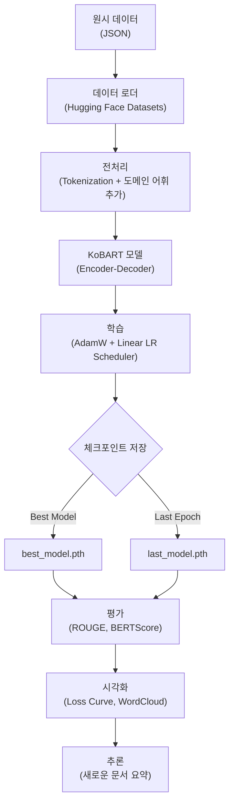
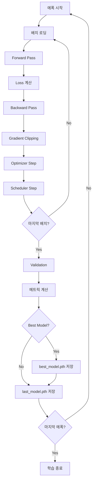

# KoBART 문서 요약 모델 개발 가이드

## 1. 프로젝트 개요

한국어 뉴스 기사 데이터셋을 활용한 추상적 요약 시스템 구축 프로젝트입니다. SKT에서 공개한 KoBART 모델을 파인튜닝하여 긴 문서를 핵심 내용 중심의 짧은 요약문으로 변환합니다.

**핵심 스펙**
- 베이스 모델: `skt/kobart-base-v1`
- 입력 시퀀스: 기본값 유지
- 출력 시퀀스: 기본값 유지
- 데이터셋: 한국어 뉴스 기사 (Train 219,585개 / Val 30,122개 / Test 24,394개)

## 2. 시스템 아키텍처



## 3. 데이터 파이프라인

### 3.1. 데이터셋 구조

```python
{
    'id': int,                    # 문서 고유 ID
    'document': str,              # 원문 (평균 1,000~1,500자)
    'summary': str,               # 정답 요약문 (평균 90~150자)
    'metadata': {
        'category': str,          # 카테고리 (IT/과학, 정치 등)
        'media_name': str,        # 언론사
        'publish_date': datetime, # 발행일
        'char_count': int,        # 원문 길이
        'summary_count': int      # 요약문 길이
    }
}
```

### 3.2. 도메인 특화 어휘 추가

신조어나 특수 용어는 토크나이저 어휘집에 추가해야 합니다.

```python
DOMAIN_TERMS = ['M&A', 'R&D', 'KT&G', 'C++', '㎍/㎥', '㎡', '℃', '%P', 'b/d']

# 어휘 추가 로직
words_to_add = []
for word in DOMAIN_TERMS:
    token_id = tokenizer.convert_tokens_to_ids(word)
    if token_id == tokenizer.unk_token_id:
        words_to_add.append(word)

tokenizer.add_tokens(words_to_add)
model.resize_token_embeddings(len(tokenizer))
```

### 3.3. 전처리 파이프라인

```python
def preprocess_function(examples):
    """
    배치 단위로 토큰화를 수행하는 함수
    """
    # 인풋 토큰화 (원문)
    model_inputs = tokenizer(
        examples['document'],
        max_length=2048,
        truncation=True,
        padding='max_length'
    )
    
    # 레이블 토큰화 (요약문)
    labels = tokenizer(
        examples['summary'],
        max_length=256,
        truncation=True,
        padding='max_length'
    )
    
    model_inputs['labels'] = labels['input_ids']
    return model_inputs
```

## 4. 모델 구성

### 4.1. KoBART 아키텍처

KoBART는 BART(Bidirectional and Auto-Regressive Transformers) 기반의 한국어 시퀀스-투-시퀀스 모델입니다.

**핵심 구조**
- 인코더: 6-layer Transformer (양방향 어텐션)
- 디코더: 6-layer Transformer (단방향 어텐션 + 크로스 어텐션)
- 히든 차원: 768
- 어텐션 헤드: 16개
- 파라미터 수: 약 124M

### 4.2. 학습 설정

```python
# 기본 하이퍼파라미터 (skt/kobart-base-v1 권장값)
CONFIG = {
    'model_name': 'skt/kobart-base-v1',
#    'max_input_length': 2048, # 기본값 유지
#    'max_target_length': 256, # 기본값 유지
    'batch_size': 8,           # GPU 메모리에 따라 조정
    'learning_rate': 5e-5,     # AdamW 기본값
    'num_epochs': 10,
    'warmup_steps': 500,
    'weight_decay': 0.01,
    'gradient_clip': 1.0
}
```

### 4.3. 손실 함수

시퀀스-투-시퀀스 태스크에서는 크로스 엔트로피 손실을 사용합니다.

$$
\mathcal{L} = -\frac{1}{N}\sum_{i=1}^{N}\sum_{t=1}^{T}\log P(y_t^{(i)} | y_{<t}^{(i)}, x^{(i)})
$$

여기서:
- $N$: 배치 크기
- $T$: 타겟 시퀀스 길이
- $y_t^{(i)}$: $i$번째 샘플의 $t$번째 타겟 토큰
- $x^{(i)}$: $i$번째 소스 시퀀스

## 5. 학습 프로세스

### 5.1. 학습 루프



### 5.2. 체크포인트 저장 전략

**저장 시점**
1. **Best Model**: Validation Loss가 이전 최저값보다 낮을 때
2. **Last Model**: 매 에폭 종료 시점 (이어학습용)

**체크포인트 구성**
```python
checkpoint = {
    'epoch': epoch,
    'model_name': 'skt/kobart-base-v1',
    'model_state_dict': model.state_dict(),
    'optimizer_state_dict': optimizer.state_dict(),
    'scheduler_state_dict': scheduler.state_dict(),
    'loss': loss,
    'config': CONFIG,
    'history': {
        'train_loss': [...],
        'val_loss': [...],
        'rouge_scores': [...]
    },
    'best_loss': best_loss,
    'best_metrics': {
        'rouge1': 0.45,
        'rouge2': 0.32,
        'rougeL': 0.41
    },
    'wandb_run_id': 'abc123def'  # WandB 연동 시
}
```

### 5.3. 이어학습 로직

```python
def load_checkpoint(checkpoint_path):
    """
    중단된 지점부터 학습을 재개하는 함수
    """
    checkpoint = torch.load(checkpoint_path)
    
    # 모델 구조 검증
    assert checkpoint['model_name'] == CONFIG['model_name']
    
    # 가중치 복원
    model.load_state_dict(checkpoint['model_state_dict'])
    optimizer.load_state_dict(checkpoint['optimizer_state_dict'])
    scheduler.load_state_dict(checkpoint['scheduler_state_dict'])
    
    # 학습 이력 복원
    start_epoch = checkpoint['epoch'] + 1
    history = checkpoint['history']
    best_loss = checkpoint['best_loss']
    
    return start_epoch, history, best_loss
```

## 6. 평가 및 시각화

### 6.1. 평가 메트릭

**ROUGE (Recall-Oriented Understudy for Gisting Evaluation)**

ROUGE는 생성된 요약과 정답 요약 간의 n-gram 중첩도를 측정합니다.

- **ROUGE-1**: 유니그램 중첩
- **ROUGE-2**: 바이그램 중첩 (유창성 평가)
- **ROUGE-L**: 최장 공통 부분수열 (구조 유사도)

$$
\text{ROUGE-N} = \frac{\sum_{S \in \text{RefSum}} \sum_{\text{gram}_n \in S} \text{Count}_{\text{match}}(\text{gram}_n)}{\sum_{S \in \text{RefSum}} \sum_{\text{gram}_n \in S} \text{Count}(\text{gram}_n)}
$$

**BERTScore**

의미적 유사도를 측정하기 위해 사전학습된 BERT 임베딩을 활용합니다.

$$
\text{BERTScore} = \frac{1}{|x|}\sum_{x_i \in x}\max_{y_j \in y}\text{cosine}(\mathbf{e}_{x_i}, \mathbf{e}_{y_j})
$$

**길이 통계**
- 압축률(Compression Ratio): $\frac{\text{len(summary)}}{\text{len(document)}}$
- 평균 요약 길이
- 길이 분포 히스토그램

### 6.2. 시각화 항목

**1. 학습 곡선 (Loss & ROUGE)**
```python
# 에폭별 Train/Val Loss, ROUGE-L 추이
plt.subplot(1, 2, 1)
plt.plot(history['train_loss'], label='Train Loss')
plt.plot(history['val_loss'], label='Val Loss')

plt.subplot(1, 2, 2)
plt.plot(history['rouge_l'], label='ROUGE-L')
```

**2. 워드클라우드 비교**
```python
from wordcloud import WordCloud

# 검증 세트에서 임의 샘플 선택
sample = validation_set[random.randint(0, len(validation_set))]

# 3개 워드클라우드 생성
fig, axes = plt.subplots(1, 3, figsize=(18, 6))

# 원문 워드클라우드
wc1 = WordCloud(font_path='NanumGothic.ttf').generate(sample['document'])
axes[0].imshow(wc1)
axes[0].set_title('원문')

# 생성 요약 워드클라우드
generated = model.generate(sample['document'])
wc2 = WordCloud(font_path='NanumGothic.ttf').generate(generated)
axes[1].imshow(wc2)
axes[1].set_title('생성 요약')

# 정답 요약 워드클라우드
wc3 = WordCloud(font_path='NanumGothic.ttf').generate(sample['summary'])
axes[2].imshow(wc3)
axes[2].set_title('정답 요약')
```

**3. 길이 분포 분석**
```python
# 원문 vs 요약문 길이 히스토그램
plt.hist(document_lengths, bins=50, alpha=0.5, label='Document')
plt.hist(summary_lengths, bins=50, alpha=0.5, label='Summary')
```

**4. 카테고리별 성능 비교**
```python
# IT/과학, 정치, 경제 등 카테고리별 ROUGE 점수
category_scores = {
    'IT,과학': {'rouge1': 0.48, 'rouge2': 0.35, 'rougeL': 0.44},
    '정치': {'rouge1': 0.42, 'rouge2': 0.29, 'rougeL': 0.38},
    '경제': {'rouge1': 0.45, 'rouge2': 0.32, 'rougeL': 0.41}
}
```

**5. 에러 케이스 분석**
- ROUGE 하위 10% 샘플 추출
- 원문/생성/정답 요약 비교표 생성
- 공통 실패 패턴 파악 (숫자 오류, 고유명사 누락 등)

### 6.3. 이미지 저장 전략 (YOLO 스타일)

```python
# 학습 중 매 에폭마다 시각화 이미지 저장
save_dir = f'runs/train/exp{experiment_id}'
os.makedirs(save_dir, exist_ok=True)

# 파일명 규칙
# - results.png: Loss/ROUGE 곡선
# - confusion_category.png: 카테고리별 성능
# - wordcloud_epoch{N}.png: 에폭별 워드클라우드
# - val_batch{N}_pred.png: 검증 샘플 예측 결과

plt.savefig(f'{save_dir}/results.png', dpi=150, bbox_inches='tight')
```

## 7. 체크포인트 관리

### 7.1. 저장 디렉토리 구조

```
checkpoints/
├── best_model.pth          # 최고 성능 모델
├── last_model.pth          # 마지막 에폭 모델
├── epoch_001.pth           # 에폭별 스냅샷 (선택)
├── epoch_005.pth
└── config.yaml             # 학습 설정 백업
```

### 7.2. 복원 시 검증 항목

```python
# 체크포인트 로드 시 필수 검증
critical_keys = [
    'embed_dim',      # 임베딩 차원
    'hidden_dim',     # 히든 차원
    'num_layers',     # 레이어 수
    'src_vocab_size', # 소스 어휘 크기
    'tgt_vocab_size'  # 타겟 어휘 크기
]

for key in critical_keys:
    assert checkpoint['config'][key] == current_config[key], \
        f"Config mismatch: {key}"
```

## 8. 실행 가이드

### 8.1. 환경 설정

```bash
# 가상환경 생성
conda create -n kobart python=3.9
conda activate kobart

# 필수 패키지 설치
pip install torch transformers datasets
pip install rouge-score bert-score
pip install wordcloud matplotlib seaborn
pip install wandb  # 선택: 실험 추적
```

### 8.2. 학습 실행

```bash
# 새로운 학습 시작
python train.py --config config/default.yaml

# 체크포인트에서 이어학습
python train.py --resume checkpoints/last_model.pth

# 하이퍼파라미터 오버라이드
python train.py --batch_size 16 --learning_rate 3e-5
```

### 8.3. 평가 및 추론

```bash
# 테스트 세트 평가
python evaluate.py --checkpoint checkpoints/best_model.pth

# 단일 문서 요약
python inference.py --input sample.txt --output summary.txt
```

## 9. 주요 이슈 및 해결 방안

### 9.1. 메모리 부족 (OOM)

**원인**: 긴 시퀀스 길이와 큰 배치 크기

**해결책**:
- Gradient Accumulation 사용
- Mixed Precision Training (FP16)
- 배치 크기 감소 또는 시퀀스 길이 축소

```python
# Gradient Accumulation 예시
accumulation_steps = 4
for i, batch in enumerate(dataloader):
    loss = model(**batch).loss / accumulation_steps
    loss.backward()
    
    if (i + 1) % accumulation_steps == 0:
        optimizer.step()
        optimizer.zero_grad()
```

### 9.2. 반복적 표현 생성

**원인**: 디코딩 과정에서 동일 패턴 반복

**해결책**:
- Repetition Penalty 적용
- No Repeat N-gram 설정

```python
output = model.generate(
    input_ids,
    max_length=256,
    repetition_penalty=1.2,    # 반복 패널티
    no_repeat_ngram_size=3     # 3-gram 반복 방지
)
```

### 9.3. 숫자/날짜 오류

**원인**: 토큰화 과정에서 숫자가 분리됨

**해결책**:
- 전처리 단계에서 숫자 정규화
- 포스트프로세싱으로 숫자 복원

```python
# 숫자 정규화 예시
text = re.sub(r'(\d{1,3})(,\d{3})+', lambda m: m.group(0).replace(',', ''), text)
```

## 10. 성능 벤치마크 (예상)

| 메트릭 | 점수 |
|--------|------|
| ROUGE-1 (F1) | 0.45 ~ 0.50 |
| ROUGE-2 (F1) | 0.30 ~ 0.35 |
| ROUGE-L (F1) | 0.40 ~ 0.45 |
| BERTScore (F1) | 0.85 ~ 0.88 |
| 평균 압축률 | 10% ~ 15% |

---

## 용어 목록

| 용어 | 설명 |
|------|------|
| Abstractive Summarization | 원문을 이해하고 새로운 문장으로 재구성하는 추상적 요약 방식 |
| AdamW | Weight Decay가 개선된 Adam 옵티마이저 |
| Attention Mechanism | 입력 시퀀스의 특정 부분에 집중하는 신경망 구조 |
| BART | Bidirectional and Auto-Regressive Transformers의 약자 |
| BERTScore | BERT 임베딩 기반 의미적 유사도 평가 메트릭 |
| Checkpoint | 학습 중 모델 상태를 저장한 파일 |
| Cross Entropy Loss | 분류 문제에서 사용되는 손실 함수 |
| Encoder-Decoder | 입력을 인코딩하고 출력을 디코딩하는 시퀀스-투-시퀀스 구조 |
| Fine-tuning | 사전학습된 모델을 특정 태스크에 맞게 추가 학습하는 과정 |
| Gradient Accumulation | 작은 배치를 여러 번 누적하여 큰 배치 효과를 내는 기법 |
| Gradient Clipping | 기울기 폭발을 방지하기 위해 기울기 크기를 제한하는 기법 |
| KoBART | 한국어 BART 모델 (SKT에서 공개) |
| Learning Rate Scheduler | 학습 과정에서 학습률을 동적으로 조정하는 스케줄러 |
| N-gram | 연속된 N개의 단어 또는 토큰 시퀀스 |
| Repetition Penalty | 반복 생성을 억제하기 위한 패널티 파라미터 |
| ROUGE | 요약 평가를 위한 n-gram 기반 메트릭 |
| Sequence-to-Sequence | 입력 시퀀스를 출력 시퀀스로 변환하는 모델 구조 |
| Tokenization | 텍스트를 토큰 단위로 분할하는 과정 |
| Transformer | Self-Attention 기반의 신경망 아키텍처 |
| Validation | 과적합 방지를 위한 검증 세트 평가 과정 |
| Warmup Steps | 학습 초기에 학습률을 점진적으로 증가시키는 단계 |
| Weight Decay | 가중치 크기를 규제하여 과적합을 방지하는 기법 |
| WordCloud | 단어 빈도를 시각적으로 표현한 그래프 |