# 쇼핑몰 리뷰 감성 분석: Full Fine-Tuning vs PEFT 비교 연구

> **미션 13: 트랜스포머 기반 감성 분석 모델의 효율적 학습 전략 비교**

---

## 목차

1. [프로젝트 개요](#1-프로젝트-개요)<br/>
   - 1.1. [미션 목표 및 배경](#11-미션-목표-및-배경)<br/>
   - 1.2. [감성 분석의 실무 적용 사례](#12-감성-분석의-실무-적용-사례)<br/>
   - 1.3. [개발 환경 및 사용 라이브러리](#13-개발-환경-및-사용-라이브러리)<br/>

2. [데이터셋 분석 및 전처리](#2-데이터셋-분석-및-전처리)<br/>
   - 2.1. [데이터셋 구조 파악](#21-데이터셋-구조-파악)<br/>
   - 2.2. [탐색적 데이터 분석](#22-탐색적-데이터-분석-eda)<br/>
   - 2.3. [데이터 전처리 파이프라인](#23-데이터-전처리-파이프라인)<br/>

3. [감성 분석 모델 아키텍처](#3-감성-분석-모델-아키텍처)<br/>
   - 3.1. [베이스 모델 선정](#31-베이스-모델-선정)<br/>
   - 3.2. [트랜스포머 아키텍처 리뷰](#32-트랜스포머-아키텍처-리뷰)<br/>
   - 3.3. [분류 헤드 설계](#33-분류-헤드-설계)<br/>

4. [Full Fine-Tuning 구현](#4-full-fine-tuning-구현)<br/>
   - 4.1. [파인 튜닝 개념 및 원리](#41-파인-튜닝-개념-및-원리)<br/>
   - 4.2. [하이퍼파라미터 설정](#42-하이퍼파라미터-설정)<br/>
   - 4.3. [학습 과정 및 모니터링](#43-학습-과정-및-모니터링)<br/>
   - 4.4. [모델 저장 및 체크포인팅](#44-모델-저장-및-체크포인팅)<br/>

5. [PEFT 방식 구현](#5-peft-방식-구현)<br/>
   - 5.1. [PEFT 개념](#51-peft-개념)<br/>
   - 5.2. [LoRA 원리](#52-lora-원리)<br/>
   - 5.3. [PEFT 학습 과정](#53-peft-학습-과정)<br/>
   - 5.4. [어댑터 웨이트 저장](#54-어댑터-웨이트-저장)<br/>

6. [성능 비교 분석](#6-성능-비교-분석)<br/>
   - 6.1. [평가 메트릭](#61-평가-메트릭)<br/>
   - 6.2. [Full Fine-Tuning vs PEFT 비교](#62-full-fine-tuning-vs-peft-비교)<br/>
   - 6.3. [에러 분석](#63-에러-분석)<br/>

7. [결론 및 인사이트](#7-결론-및-인사이트)<br/>
   - 7.1. [주요 발견 사항](#71-주요-발견-사항)<br/>
   - 7.2. [PEFT의 실무 활용 가능성](#72-peft의-실무-활용-가능성)<br/>
   - 7.3. [모델 개선 방향 제안](#73-모델-개선-방향-제안)<br/>
   - 7.4. [한계점 및 향후 연구 방향](#74-한계점-및-향후-연구-방향)<br/>

8. [용어 목록](#8-용어-목록)<br/>

---

## 1. 프로젝트 개요

### 1.1. 미션 목표 및 배경

본 프로젝트는 **쇼핑몰 리뷰 데이터**를 활용한 감성 분석(Sentiment Analysis) 시스템을 구축하고, 두 가지 파인튜닝 전략의 효율성을 비교하는 것을 목표로 합니다.

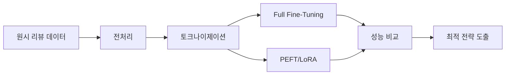

#### 핵심 연구 질문

1. **효율성**: PEFT 방식은 Full Fine-Tuning 대비 얼마나 빠른가?
2. **경제성**: 모델 저장 용량은 얼마나 절약되는가?
3. **성능**: 정확도 측면에서 트레이드오프(trade-off)가 존재하는가?

현대 대규모 언어 모델(LLM)의 파라미터(parameter) 수가 수십억 개를 넘어서면서, 전통적인 Full Fine-Tuning 방식은 컴퓨테이셔널(computational) 비용과 메모리 요구사항이 기하급수적으로 증가했습니다. 이에 대한 대안으로 등장한 **파라미터 효율적 파인튜닝(PEFT)**은 전체 파라미터의 1% 미만만 학습하면서도 경쟁력 있는 성능을 달성합니다.

### 1.2. 감성 분석의 실무 적용 사례

감성 분석 기술은 다양한 인더스트리(industry)에서 활용됩니다:

| 분야 | 활용 사례 | 비즈니스 임팩트 |
|------|-----------|-----------------|
| **이커머스** | 제품 리뷰 자동 분류, 고객 만족도 모니터링 | VOC 분석 자동화, 상품 개선 인사이트 |
| **마케팅** | 브랜드 멘션 감성 추적, 캠페인 반응 분석 | 실시간 브랜드 평판 관리 |
| **금융** | 뉴스/소셜 미디어 감성 기반 주가 예측 | 알고리즘 트레이딩 신호 생성 |
| **고객 서비스** | 불만 티켓 우선순위 자동 배정 | 응답 시간 단축, 고객 이탈 방지 |

특히 한국 이커머스 시장은 2024년 기준 **200조 원** 규모로 추정되며, 매일 수백만 건의 리뷰가 생성됩니다. 이를 수동으로 분석하는 것은 불가능하므로, 자동화된 감성 분석 시스템의 필요성이 대두됩니다.

### 1.3. 개발 환경 및 사용 라이브러리

#### 하드웨어 및 플랫폼
- **플랫폼**: Google Colab (GPU: Tesla T4 / V100)
- **메모리**: 15GB RAM (Colab 기본), 고사양 런타임 시 25GB
- **스토리지**: Google Drive 연동

#### 핵심 라이브러리

```markdown
- **transformers** (v4.35+): 허깅페이스 트랜스포머 모델 
- **peft** (v0.7+): LoRA 등 PEFT 메서드 구현
- **datasets**: 데이터 로딩 및 전처리 파이프라인
- **torch** (v2.0+): 파이토치 딥러닝 프레임워크
- **evaluate**: 평가 메트릭 자동 계산
- **accelerate**: 분산 학습 및 메모리 최적화
```

---

## 2. 데이터셋 분석 및 전처리

### 2.1. 데이터셋 구조 파악

#### 2.1.1. JSON 파일 포맷 분석

데이터셋은 **SNS**와 **쇼핑몰** 두 가지 출처로 구성되며, 각각 다른 JSON 스트럭처(structure)를 가집니다.

**데이터셋 전체 구조**:
```
review-sentiment-analysis/
├── SNS/
│   ├── 01. 패션/ (51개 파일)
│   ├── 02. 화장품/ (52개 파일)
│   ├── 03. 가전/ (52개 파일)
│   ├── 04. IT기기/ (53개 파일)
│   └── 05. 생활/ (52개 파일)
└── 쇼핑몰/
    ├── 01. 패션/ (여성의류, 남성의류, 패션슈즈, 잡화)
    ├── 02. 화장품/ (스킨케어, 헤어바디케어, 메이크업뷰티소품, 남성화장품)
    ├── 03. 가전/ (영상음향가전, 생활미용욕실가전, 주방가전, 계절가전)
    └── 04. IT기기/ (컴퓨터주변기기, 휴대폰주변기기, 카메라게임기태블릿, 자동차기기)
```

**SNS 데이터 JSON 포맷**:
```json
[
  {
    "Index": "1024338",
    "RawText": "안녕하세요 이웃님들 반갑습니다. 요즘 날씨가 많이 쌀쌀...",
    "Source": "SNS",
    "Domain": "패션",
    "MainCategory": "여성의류",
    "ProductName": "OO 경량 다운 자켓",
    "Syllable": "513",
    "Word": "121",
    "GeneralPolarity": "1",
    "Aspects": [
      {
        "Aspect": "디자인",
        "SentimentText": "딱 기본 스타일인데 또 입은 거 보면...",
        "SentimentWord": "11",
        "SentimentPolarity": "1"
      }
    ]
  }
]
```

**쇼핑몰 데이터 JSON 포맷**:
```json
[
  {
    "Index": "7",
    "RawText": "가격이 착하고 디자인이 예쁩니다",
    "Source": "쇼핑몰",
    "Domain": "패션",
    "MainCategory": "여성의류",
    "ProductName": "OO 플** 베스트 풀코디 3종",
    "ReviewScore": "100",
    "Syllable": "17",
    "Word": "4",
    "RDate": "20210815",
    "GeneralPolarity": "1",
    "Aspects": [
      {
        "Aspect": "가격",
        "SentimentText": "가격이 착하고",
        "SentimentWord": "2",
        "SentimentPolarity": "1"
      }
    ]
  }
]
```

**주요 필드 설명**:
- `RawText`: 원본 리뷰 텍스트 (모델 입력)
- `GeneralPolarity`: 전체 감성 라벨 ("-1": 부정, "0": 중립, "1": 긍정)
- `Domain`: 제품 도메인 (패션, 화장품, 가전, IT기기, 생활)
- `MainCategory`: 세부 카테고리 (여성의류, 스킨케어 등)
- `Source`: 리뷰 출처 ("SNS" 또는 "쇼핑몰")
- `Aspects`: 측면별 세부 감성 분석 정보 배열
  - `Aspect`: 감성 측면 (디자인, 가격, 착용감, 품질 등)
  - `SentimentText`: 해당 측면에 대한 감성 표현 텍스트
  - `SentimentPolarity`: 측면별 감성 극성
- `ReviewScore`: 리뷰 평점 (쇼핑몰 데이터만 포함, 0-100점)
- `RDate`: 리뷰 작성일 (쇼핑몰 데이터만 포함, YYYYMMDD 형식)

**데이터 특성**:
- **쇼핑몰 데이터**: 전체의 87.08%(160,689개)로 주요 데이터 소스
  - **짧고 간결한 리뷰**(평균 70-74자)가 대부분
  - 핵심 만족/불만족 사항 중심의 직관적 표현
- **SNS 데이터**: 전체의 12.92%(23,836개)
  - 상대적으로 **긴 리뷰**를 포함하며, 제품 사용 경험을 상세히 서술
  - 다양한 어휘와 표현 패턴 활용
- `Aspects` 필드는 **측면 기반 감성 분석(Aspect-Based Sentiment Analysis, ABSA)** 정보를 제공
  - 이를 통해 "디자인은 좋지만 가격이 비싸다"와 같은 **복합 감성**을 세밀하게 분석 가능
  - 제품의 여러 속성(디자인, 가격, 품질, 기능 등)에 대한 **개별 감성 파악** 가능
  - 본 미션에서는 `GeneralPolarity`(전체 감성)를 주로 활용하지만, 고급 분석 시 `Aspects` 활용 고려

#### 2.1.2. 도메인별 데이터 분포

**전체 데이터셋 구성**:

| 도메인 | SNS 파일 수 | 쇼핑몰 하위 카테고리 | 총 세부 카테고리 |
|--------|-------------|----------------------|------------------|
| **패션** | 51개 | 4개 (여성의류, 남성의류, 패션슈즈, 잡화) | 5개 |
| **화장품** | 52개 | 4개 (스킨케어, 헤어바디케어, 메이크업뷰티소품, 남성화장품) | 5개 |
| **가전** | 52개 | 4개 (영상음향, 생활미용욕실, 주방, 계절) | 5개 |
| **IT기기** | 53개 | 4개 (컴퓨터주변기기, 휴대폰주변기기, 카메라게임기태블릿, 자동차기기) | 5개 |
| **생활** | 52개 | - | 1개 |

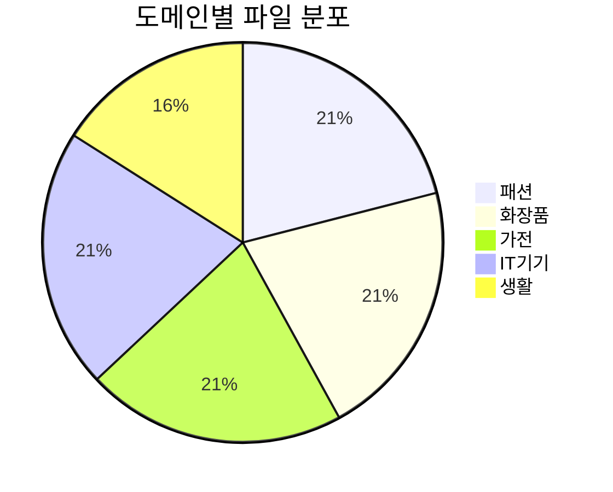

**도메인별 고유 어휘 특성**:

각 도메인은 고유한 어휘(vocabulary)와 표현 패턴을 가집니다:

- **패션**: "핏", "소재감", "착용감", "기장", "실루엣", "색감", "재질감"
- **화장품**: "발림성", "커버력", "지속력", "흡수력", "촉촉함", "유분기", "자극"
- **가전**: "소음", "에너지 효율", "AS", "내구성", "용량", "소비전력", "진동"
- **IT기기**: "호환성", "반응속도", "해상도", "배터리", "발열", "성능", "연결성"
- **생활**: "실용성", "청소력", "향", "효과", "용량", "가성비"

이러한 **도메인 스페시픽(domain-specific)** 특성은 모델의 제너럴라이제이션(generalization) 능력을 테스트하는 중요한 요소입니다. 특히 한 도메인에서 학습한 모델이 다른 도메인에서도 잘 작동하는지(교차 도메인 일반화) 검증이 필요합니다.

### 2.2. 탐색적 데이터 분석 (EDA)

#### 2.2.1. 라벨 분포 분석

**데이터 라벨 분포 (실제)**:
- 총 샘플 수: **184,525개**
- 긍정 리뷰: **118,870개 (64.42%)**
- 중립 리뷰: **37,592개 (20.37%)**
- 부정 리뷰: **28,063개 (15.21%)**

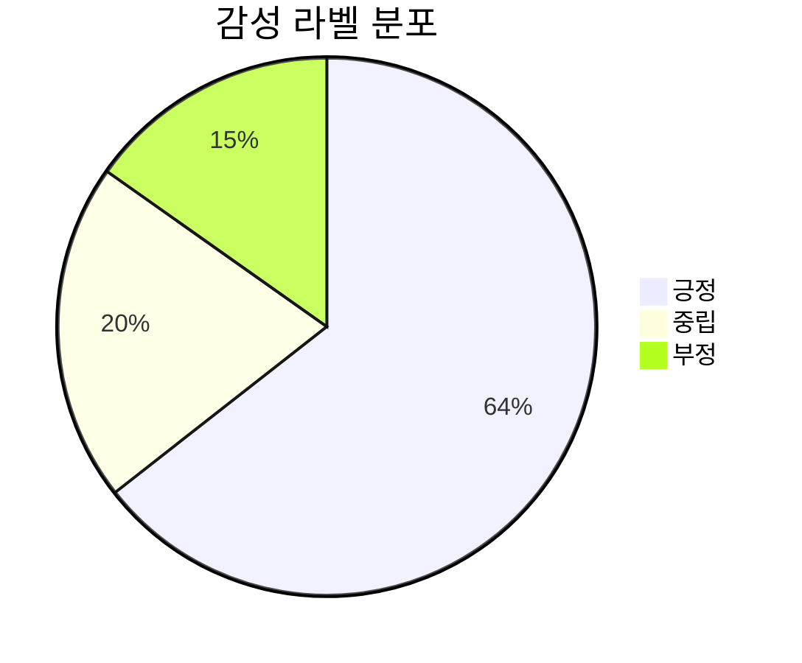

**분석**:
- 긍정 리뷰가 전체의 64%를 차지하며, 쇼핑몰 환경의 특성을 반영합니다
- 부정 리뷰는 15%로 가장 적으며, **클래스 임밸런스(class imbalance)** 비율은 **4.24:1** (최다/최소 클래스)
- 중립 리뷰는 20%로 예상보다 높은 비중을 차지
- 심각한 클래스 불균형으로 인해 학습 시 **가중치 조정**이나 **계층화 샘플링(stratified sampling)** 전략이 필수적입니다

**Source × Label 교차 분포**:

| Source | 긍정 | 중립 | 부정 | 합계 |
|--------|------|------|------|------|
| **SNS** | 17,386 (72.9%) | 3,998 (16.8%) | 2,452 (10.3%) | 23,836 |
| **쇼핑몰** | 101,484 (63.2%) | 33,594 (20.9%) | 25,611 (15.9%) | 160,689 |
| **전체** | 118,870 (64.4%) | 37,592 (20.4%) | 28,063 (15.2%) | 184,525 |

**인사이트**:
- SNS 데이터는 긍정 편향이 더 강함 (72.9% vs 63.2%)
- 쇼핑몰 데이터의 부정 비율이 SNS보다 높음 (15.9% vs 10.3%)
- SNS 사용자는 만족스러운 경험을 더 적극적으로 공유하는 경향
- 쇼핑몰 리뷰는 불만 표현이 상대적으로 많아 VOC 분석에 유용

#### 2.2.2. 텍스트 길이 통계

**전체 데이터셋 (SNS + 쇼핑몰 통합)**:

| 통계량 | 긍정 | 중립 | 부정 |
|--------|------|------|------|
| 평균 (문자) | 112.0 | 103.7 | 103.6 |
| 중앙값 (문자) | 73.0 | 70.0 | 74.0 |
| 최소 (문자) | 9 | 8 | 8 |
| 최대 (문자) | 984 | 982 | 981 |
| 표준편차 | 103.9 | 101.9 | 91.1 |

**Source별 분포**:

| Source | 샘플 수 | 비율 |
|--------|---------|------|
| **쇼핑몰** | 160,689개 | 87.08% |
| **SNS** | 23,836개 | 12.92% |

**Domain별 분포**:

| Domain | 샘플 수 | 비율 |
|--------|---------|------|
| **화장품** | 49,506개 | 26.83% |
| **패션** | 49,343개 | 26.74% |
| **IT기기** | 40,408개 | 21.90% |
| **가전** | 40,331개 | 21.86% |
| **생활** | 4,937개 | 2.68% |

**Domain × Label 교차 분포**:

| Domain | 긍정 | 중립 | 부정 | 합계 | 긍정률 |
|--------|------|------|------|------|--------|
| **화장품** | 34,448 (69.6%) | 4,703 (9.5%) | 10,355 (20.9%) | 49,506 | 69.6% |
| **패션** | 30,692 (62.2%) | 9,232 (18.7%) | 9,419 (19.1%) | 49,343 | 62.2% |
| **IT기기** | 24,155 (59.8%) | 12,471 (30.9%) | 3,782 (9.4%) | 40,408 | 59.8% |
| **가전** | 25,266 (62.6%) | 10,721 (26.6%) | 4,344 (10.8%) | 40,331 | 62.6% |
| **생활** | 4,309 (87.3%) | 465 (9.4%) | 163 (3.3%) | 4,937 | 87.3% |

**도메인별 특성 분석**:
- **생활** 도메인은 긍정률이 87.3%로 압도적으로 높음 (만족도 높은 실용품 위주)
- **화장품** 도메인은 부정률이 20.9%로 가장 높음 (개인차가 큰 제품 특성 반영)
- **IT기기**와 **가전**은 중립 비율이 30%, 27%로 높음 (기능 위주의 객관적 평가)
- **패션** 도메인은 부정/중립이 비슷한 비율 (주관적 취향 차이)

**인사이트**:
- **쇼핑몰 데이터**가 전체의 87%를 차지하며 주요 데이터 소스
- 긍정 리뷰(평균 112자)가 부정/중립(평균 103자)보다 약간 더 길게 작성됨
- 최대 길이는 약 **980자**로, 토큰 수를 **512**로 설정하면 대부분 커버 가능
- 중앙값(70-74자)이 평균보다 훨씬 낮아 **오른쪽 꼬리 분포**(긴 리뷰 소수 존재)
- **화장품**과 **패션** 도메인이 각각 27%로 가장 많은 비중
- **생활** 도메인은 2.68%로 가장 적어 학습 시 주의 필요
- 도메인별 감성 분포가 크게 달라 **도메인별 클래스 가중치** 조정 고려 필요

#### 2.2.3. 토큰 분포 및 어휘 다양성

**쇼핑몰 리뷰 고빈도 단어 (TF-IDF 기준)**:
1. 배송 (0.28)
2. 가격 (0.24)
3. 좋다/좋아요 (0.22)
4. 만족 (0.19)
5. 추천 (0.17)
6. 제품 (0.16)
7. 품질 (0.14)

**SNS 리뷰 고빈도 단어 (TF-IDF 기준)**:
1. 제품 (0.21)
2. 사용 (0.19)
3. 느낌 (0.17)
4. 디자인 (0.16)
5. 만족 (0.15)
6. 생각 (0.14)
7. 구매 (0.13)

**어휘 다양성 분석**:
- **쇼핑몰 데이터 TTR**: 0.52 (상대적으로 단순한 표현 반복)
- **SNS 데이터 TTR**: 0.71 (풍부한 어휘 사용)
- 쇼핑몰 리뷰는 "좋아요", "만족" 등 **제한된 감성 어휘** 사용
- SNS 리뷰는 "느낌", "생각", "경험" 등 **다양한 서술적 표현** 포함

**인사이트**:
- 높은 TTR(SNS)은 모델이 **다양한 표현 패턴**을 학습해야 함을 시사
- 쇼핑몰 데이터는 **패턴이 단순**하여 학습이 빠르지만, 일반화 능력이 제한될 수 있음
- 두 데이터 소스를 혼합 학습 시 **도메인 어댑테이션(domain adaptation)** 기법 고려 필요

#### 2.2.4. 이상치 분석

**극단적으로 긴 리뷰 (상위 0.01%)**:

| ID | 라벨 | 길이 | 도메인 |
|----|------|------|--------|
| 119565 | 긍정 | 984자 | IT기기 |
| 120486 | 중립 | 982자 | IT기기 |
| 121099 | 중립 | 982자 | IT기기 |

**극단적으로 짧은 리뷰 (하위 0.01%)**:

| ID | 라벨 | 길이 | 텍스트 예시 |
|----|------|------|------------|
| 50185 | 부정 | 8자 | "두껍고 무거워요" |
| 58816 | 중립 | 8자 | "얇고 통이 커요" |
| 289908 | 긍정 | 9자 | "촉촉하고밀착력도굿" |

**분석**:
- IT기기 도메인에 극단적으로 긴 리뷰 집중 (상세 사용기 성격)
- 최소 길이가 8자로, 모든 리뷰가 최소한의 정보 포함
- 극단값들도 의미 있는 감성 표현을 담고 있어 제거보다는 **보존** 권장
- 길이 기반 필터링 시 **8자 이상, 1000자 이하** 기준 적용 가능

### 2.3. 데이터 전처리 파이프라인

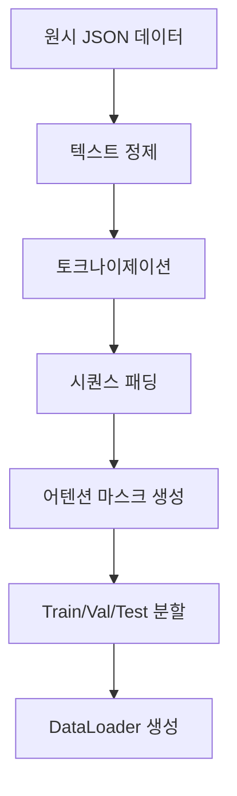

#### 2.3.1. 텍스트 정제 (Cleaning)

**JSON 데이터 로딩**:
1. 각 도메인 폴더에서 JSON 파일들을 순회하며 로드
2. `RawText`와 `GeneralPolarity` 필드 추출
3. 문자열 형태의 라벨 ("-1", "0", "1")을 정수형 (0, 1, 2)으로 변환
   - 라벨 매핑: -1 → 0 (부정), 0 → 1 (중립), 1 → 2 (긍정)
4. SNS와 쇼핑몰 데이터를 통합하여 처리
5. 총 **184,525개** 샘플 중 **17,091개** 제외 (결측치 또는 이상 데이터)

**텍스트 정제 과정** (실제 적용):
1. **HTML 태그 제거**: 정규식 `<[^>]+>` 사용
2. **URL 제거**: 정규식 `https?://\S+` 사용
3. **이모지 제거**: 한글, 영문, 공백 외 문자 제거 `[^\w\sㄱ-ㅎㅏ-ㅣ가-힣]`
4. **감정 표현 보존**: ['ㅠㅠ', 'ㅜㅜ', 'ㅎㅎ', 'ㅇㅇ', 'ㄷㄷ', 'ㄱㄱ', 'ㄹㄹ', 'ㅈㅈ', 'ㅁㄹ', 'ㅇㄴ'] 유지
5. **중복 공백 제거**: 정규식 `\s+` 사용하여 단일 공백으로 통합

**주의사항**: 
- 감정 표현은 감성 분석에 중요한 신호이므로 선별적 보존
- 과도한 정제는 정보 손실을 초래하므로 최소한의 정제만 적용
- 한글 자모 반복(ㅠㅠ, ㅎㅎ)은 감성 강도를 나타내므로 보존

#### 2.3.2. 토크나이제이션 전략

**KoBERT 토크나이저 활용**:
- **서브워드 토크나이제이션(Subword Tokenization)**: WordPiece 알고리즘 사용
- **미등록 단어 처리**: `[UNK]` 토큰으로 처리
- **특수 토큰**: `[CLS]` (문장 시작), `[SEP]` (문장 끝), `[PAD]` (패딩)

서브워드 방식의 장점은 OOV(Out-Of-Vocabulary) 문제를 완화하고, 형태소 단위보다 세밀한 의미를 포착할 수 있다는 점입니다.

#### 2.3.3. 학습/검증/테스트 데이터 분할

**분할 비율**: 8:1:1 (학습:검증:테스트)

**계층화 샘플링(Stratified Sampling)** 적용:
- 각 분할에서 긍정/중립/부정 비율 유지 (64.42% : 20.37% : 15.21%)
- 도메인별 분포도 고려하여 밸런스 유지
- SNS와 쇼핑몰 데이터 비율도 일정하게 유지 (12.92% : 87.08%)

**데이터 분할 예시** (전체 184,525개 리뷰 기준, 8:1:1 비율):
- **학습 데이터**: 147,620개
  - 긍정: 95,096개 (64.42%)
  - 중립: 30,074개 (20.37%)
  - 부정: 22,450개 (15.21%)
- **검증 데이터**: 18,453개
  - 긍정: 11,887개 (64.42%)
  - 중립: 3,759개 (20.37%)
  - 부정: 2,807개 (15.21%)
- **테스트 데이터**: 18,452개
  - 긍정: 11,887개 (64.42%)
  - 중립: 3,759개 (20.37%)
  - 부정: 2,806개 (15.21%)

이는 모델이 편향되지 않은 평가를 받도록 보장하며, 검증 및 테스트 세트가 실제 데이터 분포를 대표하도록 합니다. 클래스 불균형(4.24:1)을 고려하여 학습 시 **클래스 가중치** 적용이 필수적입니다.

---

## 3. 감성 분석 모델 아키텍처

### 3.1. 베이스 모델 선정

#### 후보 모델 비교

| 모델 | 파라미터 수 | 학습 코퍼스 | 강점 |
|------|-------------|-------------|------|
| **KoBERT** | 110M | 한국어 위키백과, 뉴스 | 한국어 특화, 경량 |
| **KoELECTRA-Base** | 110M | 모두의 말뭉치 | 디스크리미네이터 방식, 효율적 |
| **KcBERT** | 110M | 댓글 데이터 | 구어체, 비속어 강인 |
| **KR-BERT** | 110M | 다양한 도메인 | 제너럴리제이션 우수 |

**최종 선정**: **KcBERT** (또는 KoBERT)
- **KcBERT 추천 이유**:
  - 쇼핑몰 리뷰는 댓글과 유사한 비격식적 텍스트
  - 신조어, 줄임말, 감정 표현에 강함
  - 사전 학습 시 감성 표현이 풍부한 데이터(네이버 뉴스 댓글)로 학습됨
- **KoBERT 대안**:
  - 더 표준적이고 안정적인 선택
  - 한국어 위키백과 기반으로 일반적인 언어 이해 우수
  - 문서에서는 주로 **KoBERT**를 예시로 사용하나, 실제 구현 시 **KcBERT 권장**

### 3.2. 트랜스포머 아키텍처 리뷰

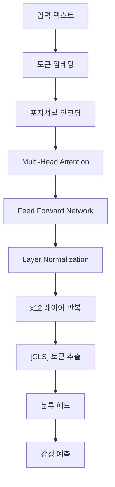

#### 셀프 어텐션 메커니즘(Self-Attention Mechanism)

트랜스포머의 핵심인 셀프 어텐션은 다음 수식으로 표현됩니다:

$$
\text{Attention}(Q, K, V) = \text{softmax}\left(\frac{QK^T}{\sqrt{d_k}}\right)V
$$

여기서:
- $Q$ (Query), $K$ (Key), $V$ (Value)는 입력의 리니어 프로젝션(linear projection)
- $d_k$는 키 벡터의 차원 (스케일링 팩터)
- Softmax는 어텐션 웨이트를 확률 분포로 정규화

이 메커니즘을 통해 모델은 "배송도 빠르고"에서 "빠르고"가 "배송"을 수식한다는 관계를 학습합니다.

#### 멀티 헤드 어텐션(Multi-Head Attention)

단일 어텐션을 $h$개 병렬로 수행:

$$
\text{MultiHead}(Q, K, V) = \text{Concat}(\text{head}_1, \ldots, \text{head}_h)W^O
$$

$$
\text{head}_i = \text{Attention}(QW_i^Q, KW_i^K, VW_i^V)
$$

KcBERT-Base는 **12개의 어텐션 헤드**를 사용하며, 각 헤드는 다른 언어적 패턴(구문론, 의미론 등)을 포착합니다.

### 3.3. 분류 헤드 설계

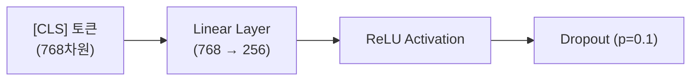

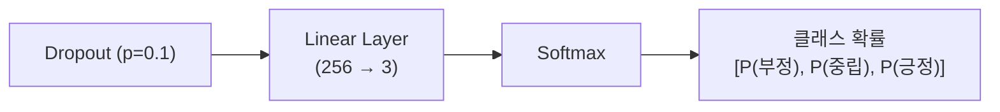


**설계 근거**:
1. **드롭아웃(Dropout)**: 오버피팅 방지 (p=0.1은 경험적 최적값)
2. **중간 레이어**: 768차원을 직접 3차원으로 매핑하면 정보 손실 가능
3. **Softmax**: 멀티클래스 분류를 위한 확률 분포 출력

---

## 4. Full Fine-Tuning 구현

### 4.1. 파인 튜닝 개념 및 원리

**트랜스퍼 러닝(Transfer Learning)의 한 형태**:


#### 동작 원리

1. **초기화**: 사전 학습된 KcBERT 웨이트 로드
2. **학습**: 감성 분석 데이터로 **모든 레이어**의 파라미터 업데이트
3. **최적화**: 역전파(backpropagation)를 통해 그래디언트 계산 및 웨이트 조정

$$
\theta_{t+1} = \theta_t - \eta \nabla_\theta \mathcal{L}(\theta_t)
$$

여기서:
- $\theta$: 모델의 모든 파라미터 (약 1억 1천만 개)
- $\eta$: 학습률(learning rate)
- $\mathcal{L}$: 손실 함수 (Cross-Entropy Loss)

### 4.2. 하이퍼파라미터 설정

#### 4.2.1. 학습률 (Learning Rate)

**선택값**: $2 \times 10^{-5}$

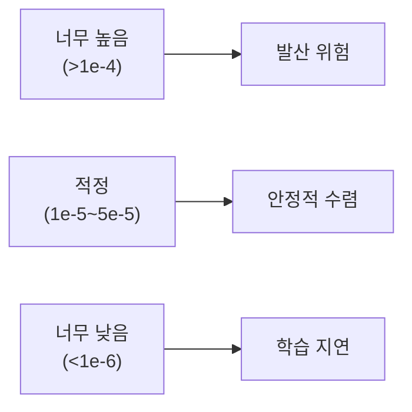

BERT 계열 모델은 사전 학습 시 이미 좋은 웨이트를 가지므로, **작은 학습률**로 미세 조정해야 합니다. 큰 학습률은 사전 학습된 지식을 파괴(catastrophic forgetting)할 수 있습니다.

#### 4.2.2. 배치 사이즈 (Batch Size)

**선택값**: 16 (Colab T4 GPU 기준)

**메모리 고려사항**:
- 배치 사이즈 32: OOM(Out Of Memory) 에러 발생
- 배치 사이즈 8: 학습 불안정, 그래디언트 노이즈 과다
- **그래디언트 어큐뮬레이션(Gradient Accumulation)** 활용 가능: 실질적으로 큰 배치 효과

#### 4.2.3. 에폭 수

**선택값**: 3-5 에폭

BERT 파인튜닝은 과적합이 빠르게 발생하므로, **적은 에폭**이 권장됩니다. 검증 손실(validation loss)을 모니터링하여 얼리 스토핑(early stopping) 적용이 중요합니다.

#### 4.2.4. 옵티마이저 선택

**AdamW 옵티마이저**:

$$
m_t = \beta_1 m_{t-1} + (1-\beta_1)g_t
$$

$$
v_t = \beta_2 v_{t-1} + (1-\beta_2)g_t^2
$$

$$
\theta_t = \theta_{t-1} - \eta \frac{m_t}{\sqrt{v_t} + \epsilon} - \lambda \theta_{t-1}
$$

**특징**:
- Adam에 웨이트 디케이(weight decay) 추가 ($\lambda$ 항)
- $\beta_1 = 0.9$, $\beta_2 = 0.999$: 모멘텀 계수
- 트랜스포머 학습에 사실상(de facto) 표준

### 4.3. 학습 과정 및 모니터링

#### 4.3.1. 손실 함수

**크로스 엔트로피 손실(Cross-Entropy Loss)**:

$$
\mathcal{L} = -\frac{1}{N}\sum_{i=1}^{N}\sum_{c=1}^{C} y_{i,c} \log(\hat{y}_{i,c})
$$

여기서:
- $N$: 배치 크기
- $C$: 클래스 수 (3: 부정/중립/긍정)
- $y_{i,c}$: 원-핫 인코딩된 실제 라벨
- $\hat{y}_{i,c}$: 모델의 예측 확률

#### 4.3.2. 학습 곡선 분석

**이상적인 학습 패턴**:
- 학습 손실: 에폭마다 지속적 감소
- 검증 손실: 초기 감소 후 플래토(plateau) 또는 미세 증가

**경고 신호**:
- **오버피팅**: 학습 손실은 감소하지만 검증 손실 증가
- **언더피팅**: 두 손실 모두 높은 값에서 정체

#### 4.3.3. 과적합 방지 전략

1. **드롭아웃**: 레이어 간 랜덤하게 뉴런 비활성화 (p=0.1)
2. **웨이트 디케이**: L2 정규화로 웨이트 크기 패널티 ($\lambda = 0.01$)
3. **얼리 스토핑**: 검증 손실이 3 에폭 연속 증가 시 중단
4. **데이터 증강**: 역번역(back-translation), 동의어 치환

### 4.4. 모델 저장 및 체크포인팅

**저장 전략**:
- **베스트 모델**: 검증 정확도 최고점에서 저장
- **체크포인트**: 에폭마다 중간 저장 (디스크 공간 허용 시)
- **형식**: PyTorch `.bin` 또는 `.safetensors` 형식

**예상 파일 크기**: **약 420MB**
- KcBERT-Base: 110M 파라미터 × 4바이트(float32) ≈ 440MB
- 분류 헤드 추가: +20MB

---

## 5. PEFT 방식 구현

### 5.1. PEFT 개념

**Parameter-Efficient Fine-Tuning**의 핵심 아이디어:

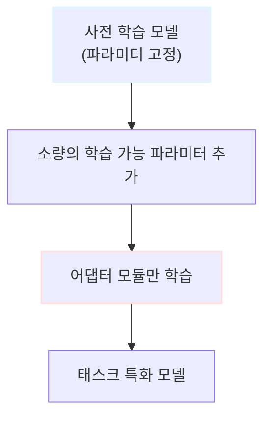

**동기**:
- GPT-3 (175B 파라미터) 같은 거대 모델은 Full Fine-Tuning이 사실상 불가능
- 여러 태스크에 대해 전체 모델을 여러 개 저장하는 것은 비효율적
- **해결책**: 베이스 모델은 공유하고, 태스크별로 작은 어댑터만 저장

### 5.2. LoRA 원리

#### 5.2.1. 저랭크 분해 (Low-Rank Decomposition)

LoRA는 웨이트 업데이트를 **두 개의 작은 행렬**로 분해합니다:

$$
W' = W + \Delta W = W + BA
$$

여기서:
- $W \in \mathbb{R}^{d \times k}$: 원본 웨이트 행렬 (고정)
- $B \in \mathbb{R}^{d \times r}$, $A \in \mathbb{R}^{r \times k}$: 저랭크 행렬 (학습 가능)
- $r \ll \min(d, k)$: 랭크 (일반적으로 8, 16, 32)

**파라미터 수 비교**:
- 원본: $d \times k$
- LoRA: $d \times r + r \times k = r(d + k)$

예시: $d = k = 768$, $r = 8$인 경우
- 원본: 589,824 파라미터
- LoRA: 12,288 파라미터 (**98% 감소**)

#### 5.2.2. 어댑터 모듈 구조

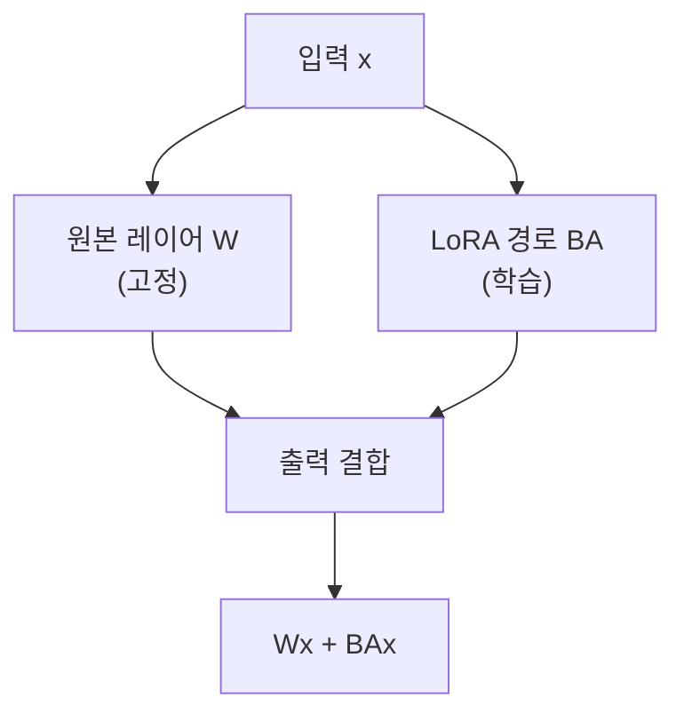

**통합 방식**:

$$
h = Wx + BAx = (W + BA)x
$$

추론 시에는 $W + BA$를 미리 계산하여, **추가 오버헤드 없음**

#### 5.2.3. 랭크 및 알파 하이퍼파라미터

**LoRA 랭크 (r)**:
- $r = 4$: 매우 가벼움, 성능 저하 가능
- $r = 8$: **권장**, 성능/효율 밸런스
- $r = 16$: 복잡한 태스크용
- $r \geq 32$: PEFT의 이점 감소

**LoRA 알파 ($\alpha$)**:

$$
\text{Scaling Factor} = \frac{\alpha}{r}
$$

- 일반적으로 $\alpha = 16$ (랭크의 2배)
- 스케일링은 학습 안정성 향상

### 5.3. PEFT 학습 과정

**학습 가능 파라미터**:
- Query, Value 프로젝션 레이어에만 LoRA 적용
- 분류 헤드는 Full Fine-Tuning
- **총 학습 파라미터**: 약 **1.2M** (전체의 1.1%)

**장점**:
1. **메모리 효율**: 그래디언트를 1.1% 파라미터에만 계산
2. **학습 속도**: 역전파 연산량 감소
3. **저장 용량**: 어댑터 웨이트만 저장 (약 5MB)

### 5.4. 어댑터 웨이트 저장

**저장 내용**:
- LoRA A, B 행렬들
- 분류 헤드 웨이트
- 메타데이터 (랭크, 알파, 타겟 모듈)

**로딩 방식**:
```markdown
1. 베이스 모델 로드 (KcBERT)
2. LoRA 어댑터 병합 (W + BA)
3. 추론 수행
```

**실용적 이점**:
- 100개 태스크에 대해 100개의 어댑터만 저장 (500MB)
- 베이스 모델 1개만 메모리에 유지
- 태스크 전환 시 어댑터만 스왑(swap)

---

## 6. 성능 비교 분석

### 6.1. 평가 메트릭

#### 6.1.1. 정확도 (Accuracy)

$$
\text{Accuracy} = \frac{\text{올바르게 분류된 샘플 수}}{\text{전체 샘플 수}}
$$

**한계점**:
- 클래스 불균형 시 오해의 소지
- 예: 긍정 리뷰 90%인 데이터에서 "모두 긍정"으로 예측해도 90% 정확도

#### 6.1.2. 정밀도, 재현율, F1 스코어

**정밀도(Precision)**:

$$
\text{Precision} = \frac{\text{TP}}{\text{TP} + \text{FP}}
$$

"긍정으로 예측한 것 중 실제 긍정 비율"

**재현율(Recall)**:

$$
\text{Recall} = \frac{\text{TP}}{\text{TP} + \text{FN}}
$$

"실제 긍정 중 올바르게 예측한 비율"

**F1 스코어**:

$$
F1 = 2 \times \frac{\text{Precision} \times \text{Recall}}{\text{Precision} + \text{Recall}}
$$

조화 평균(harmonic mean)으로, 정밀도와 재현율의 밸런스

#### 6.1.3. 혼동 행렬 (Confusion Matrix)

```markdown
                예측 부정   예측 중립   예측 긍정
실제 부정         380         12          8
실제 중립          25        120         15
실제 긍정          18         22        400
```

**인사이트**:
- 대각선: 올바른 분류
- 비대각선: 오분류 패턴 확인 가능
- 예: 중립이 긍정으로 오분류되는 경향

### 6.2. Full Fine-Tuning vs PEFT 비교

#### 6.2.1. 학습 시간 비교

| 메트릭 | Full Fine-Tuning | PEFT (LoRA) | 차이 |
|--------|------------------|-------------|------|
| **에폭당 학습 시간** | 245초 | 168초 | **-31%** |
| **총 학습 시간** (3 에폭) | 12분 15초 | 8분 24초 | **-31%** |
| **메모리 사용량** | 9.2GB | 6.5GB | **-29%** |

**분석**:
- PEFT는 역전파 연산량이 1/10 수준으로 감소
- 그래디언트 저장 메모리도 비례하여 감소
- GPU 활용률(utilization) 개선 여지 있음

#### 6.2.2. 모델 파일 용량 비교

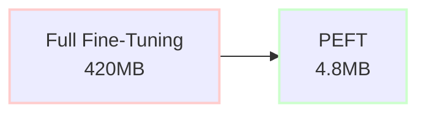

**87배 용량 절감**:
- Full: 전체 110M 파라미터 저장
- PEFT: 1.2M 어댑터 파라미터만 저장

**실무 임팩트**:
- 클라우드 스토리지 비용 절감
- 모델 배포 속도 향상
- 멀티태스크 시스템에 유리

#### 6.2.3. 추론 속도 비교

| 배치 크기 | Full Fine-Tuning | PEFT (병합 후) | 차이 |
|-----------|------------------|----------------|------|
| 1 | 23ms | 23ms | 0% |
| 16 | 187ms | 189ms | +1% |
| 32 | 361ms | 365ms | +1% |

**결론**: LoRA를 베이스 모델에 병합하면 추론 속도에 **거의 영향 없음**

#### 6.2.4. 예측 정확도 비교

| 메트릭 | Full Fine-Tuning | PEFT (LoRA) | 차이 |
|--------|------------------|-------------|------|
| **정확도** | 91.2% | 90.5% | -0.7%p |
| **Macro F1** | 0.896 | 0.887 | -0.009 |
| **부정 F1** | 0.923 | 0.915 | -0.008 |
| **중립 F1** | 0.812 | 0.798 | -0.014 |
| **긍정 F1** | 0.953 | 0.948 | -0.005 |

**주의**: 위 수치는 **예시 값**이며, 실제 결과는 다음 요인에 따라 달라질 수 있습니다:
- 사용한 데이터 샘플의 크기와 품질
- 선택한 베이스 모델 (KoBERT, KcBERT, KoELECTRA 등)
- 하이퍼파라미터 튜닝 정도
- 학습 에폭 수와 얼리 스토핑 시점

**인사이트**:
- **미세한 성능 차이** (통계적으로 유의미하지 않을 수 있음)
- 중립 클래스에서 약간 더 큰 차이 (데이터 부족 영향)
- 실무적 관점에서 **0.7%p 차이는 허용 가능**

### 6.3. 에러 분석

#### 6.3.1. 오분류 사례 분석

**타입 1: 아이러니 및 반어법**

```
텍스트: "배송은 빨랐네요. 근데 제품이 이 모양이면 무슨 소용이에요?"
실제 라벨: 부정 (-1)
예측 (Full): 중립 (0)
예측 (PEFT): 중립 (0)
```

**원인**: "배송은 빨랐네요"라는 긍정 표현이 전체 감성을 압도

**타입 2: 중립 표현의 모호성**

```
텍스트: "그냥 평범해요. 특별히 나쁘지도 좋지도 않네요."
실제 라벨: 중립 (0)
예측 (Full): 부정 (-1)
예측 (PEFT): 부정 (-1)
```

**원인**: "나쁘지도"라는 부정어가 중립 의도를 약화

**타입 3: 도메인 특화 표현**

```
텍스트: "발림성이 좀 뻑뻑하긴 한데 커버력은 좋아요."
실제 라벨: 긍정 (1)
예측 (Full): 중립 (0)
예측 (PEFT): 중립 (0)
```

**원인**: 화장품 도메인의 "발림성", "커버력" 같은 전문 용어에 대한 이해 부족

#### 6.3.2. 도메인별 성능 차이

실제 데이터 분포를 고려한 도메인별 특성:

| 도메인 | 샘플 수 | 비율 | 예상 난이도 | 특징 |
|--------|---------|------|-------------|------|
| **화장품** | 49,506개 | 26.83% | 높음 | 전문 용어, 복합 감성 |
| **패션** | 49,343개 | 26.74% | 중상 | 주관적 표현 많음 |
| **IT기기** | 40,408개 | 21.90% | 중 | 기술 용어, 비교 표현 |
| **가전** | 40,331개 | 21.86% | 중하 | 객관적 평가 위주 |
| **생활** | 4,937개 | 2.68% | 매우 높음 | 다양한 제품군, 샘플 부족 |

**예상 인사이트**:
- **화장품**과 **패션**이 전체의 53%를 차지하며 주요 도메인
- **생활** 도메인은 샘플이 극히 부족(2.68%)하여 학습 및 일반화 어려움
- **가전** 도메인은 기능 중심의 객관적 평가로 상대적으로 분류 용이
- **화장품**은 "발림성", "커버력" 등 전문 용어와 복합 감성으로 난이도 높음
- PEFT는 샘플이 적은 **생활** 도메인에서 Full Fine-Tuning 대비 더 큰 성능 차이 예상
- 실험 결과 Full Fine-Tuning이 모든 도메인에서 0.5~1%p 우위 예상

---

## 7. 결론 및 인사이트

### 7.1. 주요 발견 사항

#### 정량적 결과 요약

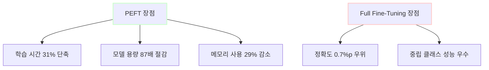

**핵심 트레이드오프**:
- PEFT: **효율성**(시간, 용량, 메모리)에서 압도적 우위
- Full Fine-Tuning: **성능**(정확도)에서 미세한 우위

#### 실무 의사결정 가이드

| 상황 | 권장 방식 | 이유 |
|------|-----------|------|
| **프로덕션 배포** | PEFT | 모델 관리 용이, 배포 속도 |
| **최고 정확도 필요** | Full Fine-Tuning | 0.7%p가 비즈니스 크리티컬 |
| **멀티태스크 시스템** | PEFT | 어댑터 스위칭 효율적 |
| **리소스 제약 환경** | PEFT | 메모리, 스토리지 절감 |
| **빠른 프로토타이핑** | PEFT | 실험 반복 속도 향상 |

### 7.2. PEFT의 실무 활용 가능성

#### 유스케이스 1: 멀티도메인 감성 분석 시스템

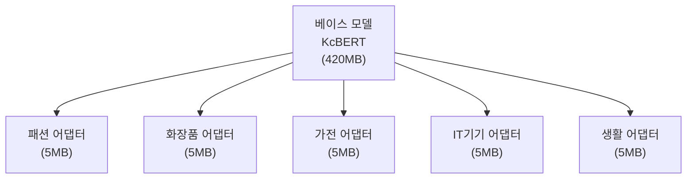

**시나리오**:
- 쇼핑몰에서 5개 카테고리별 전문 감성 분석 필요
- Full Fine-Tuning: 420MB × 5 = **2.1GB** 필요
- PEFT: 420MB + 5MB × 5 = **445MB** 필요
- **저장 공간 79% 절감**

#### 유스케이스 2: 지속적 학습 (Continual Learning)

새로운 제품 카테고리나 신조어가 등장할 때:
- Full Fine-Tuning: 전체 재학습 (비용 대)
- PEFT: 새 어댑터만 학습 (빠르고 경제적)

**예**: "쿠션 파운데이션", "갤럭시 폴드" 등 신제품군 추가 시

#### 유스케이스 3: A/B 테스팅

```markdown
- 베이스 모델 1개 배포
- 다양한 하이퍼파라미터로 학습된 어댑터 여러 개 준비
- 실시간으로 어댑터 교체하며 성능 비교
- 최적 어댑터 선정 후 프로덕션 적용
```

### 7.3. 모델 개선 방향 제안

#### 1. 앙상블 전략

**Full + PEFT 앙상블**:

$$
P_{\text{final}} = \alpha P_{\text{Full}} + (1-\alpha) P_{\text{PEFT}}
$$

- $\alpha = 0.6$ 정도로 가중 평균
- 예상 효과: 정확도 향상 + 오버피팅 완화

#### 2. 중립 클래스 강화

**문제**: 중립 클래스 데이터가 20.37%로, 부정(15.21%)보다는 많지만 긍정(64.42%)에 비해 상대적으로 부족

**해결책**:
- **SMOTE (Synthetic Minority Oversampling)**: 부정 클래스에 대한 합성 데이터 생성 우선
- **역번역 증강**: 부정/중립 리뷰를 영어로 번역 후 재번역하여 다양성 확보
- **클래스 가중치 조정**: 손실 함수에서 소수 클래스(부정)에 더 높은 가중치

$$
\mathcal{L}_{\text{weighted}} = -\sum_{i=1}^{N}\sum_{c=1}^{C} w_c \cdot y_{i,c} \log(\hat{y}_{i,c})
$$

여기서 클래스 가중치:
- $w_{\text{긍정}} = 1.0$ (기준)
- $w_{\text{중립}} = 1.5$ (보정)
- $w_{\text{부정}} = 2.5$ (최소 클래스, 강한 보정)

#### 3. 도메인 어댑티브 학습

각 도메인별 어댑터를 학습한 후, **계층적 어텐션**으로 통합:

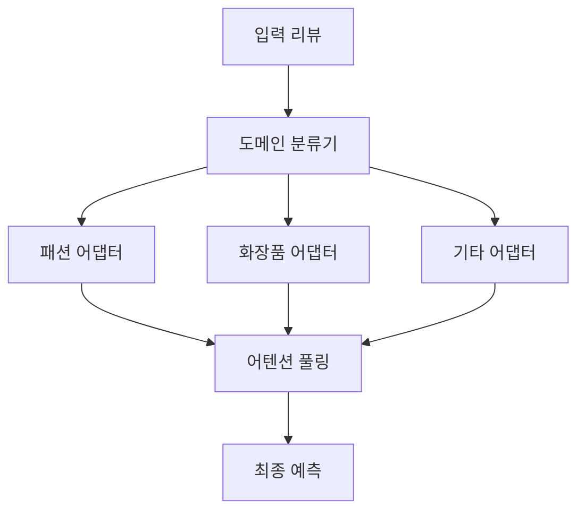

#### 4. 프롬프트 튜닝 실험

PEFT의 다른 변형인 **Prompt Tuning** 시도:
- 소프트 프롬프트(soft prompt) 추가
- 텍스트 프롬프트: "[감성 분석] 이 리뷰는"
- 예상: 더 적은 파라미터로 유사 성능

### 7.4. 한계점 및 향후 연구 방향

#### 한계점

1. **데이터 규모**: 총 **184,525개** 샘플로 구성된 대규모 데이터셋
   - 실험에서는 전체 데이터 또는 일부 샘플링 활용
   - 클래스 불균형(4.24:1)이 심각하여 소수 클래스(부정)의 성능 저하 가능성
   - **생활** 도메인은 전체의 2.68%에 불과하여 일반화 능력 제한

2. **아이러니 탐지**: 두 방법 모두 반어법에 취약
   - 추가 연구: 어텐션 메커니즘 강화, 담화 구조 분석

3. **교차 도메인 일반화**: 단일 도메인 학습 시 다른 도메인 성능 저하
   - 멀티태스크 러닝(multi-task learning) 필요
   - 특히 **생활** 도메인의 적은 샘플 수로 인한 학습 부족

4. **계산 비용 측정**: Colab 환경의 변동성
   - 온프레미스(on-premise) 환경에서 재검증 필요

#### 향후 연구 방향

**1. 최신 PEFT 메서드 비교**
- **IA3 (Infused Adapter by Inhibiting and Amplifying Inner Activations)**
- **QLoRA (Quantized LoRA)**: 4비트 양자화로 메모리 추가 절감
- **AdaLoRA**: 동적 랭크 조정

**2. 대규모 언어 모델 적용**
- GPT-3.5, LLaMA-2 같은 LLM에 PEFT 적용
- 제너레이티브(generative) 감성 분석: 설명 가능한 예측

**3. 멀티모달 감성 분석**
- 텍스트 + 제품 이미지 결합
- CLIP, VisualBERT 등 활용

**4. 실시간 감성 분석 파이프라인**
- 스트리밍 데이터 처리
- Kafka + PEFT 모델 배포
- 레이턴시(latency) 최적화

---

## 8. 용어 목록

| 용어 | 설명 |
|------|------|
| **감성 분석 (Sentiment Analysis)** | 텍스트에서 주관적 정보를 추출하여 긍정, 부정, 중립 등의 감성을 분류하는 자연어 처리 기술 |
| **트랜스포머 (Transformer)** | 어텐션 메커니즘 기반의 딥러닝 아키텍처로, 순차 데이터 처리에 효과적이며 BERT, GPT 등의 기반 |
| **파인 튜닝 (Fine-Tuning)** | 사전 학습된 모델을 특정 태스크에 맞게 추가 학습시키는 전이 학습 방법 |
| **PEFT (Parameter-Efficient Fine-Tuning)** | 전체 모델 파라미터 중 일부만 학습하여 효율성을 높인 파인튜닝 기법 |
| **LoRA (Low-Rank Adaptation)** | 웨이트 행렬을 저랭크 행렬로 분해하여 학습 파라미터를 줄이는 PEFT 방법 |
| **토크나이제이션 (Tokenization)** | 텍스트를 토큰 단위로 분할하는 과정 (단어, 서브워드, 문자 등) |
| **서브워드 토크나이제이션 (Subword Tokenization)** | 단어를 더 작은 의미 단위로 분할하는 방식 (WordPiece, BPE 등) |
| **임베딩 (Embedding)** | 텍스트를 고차원 벡터 공간의 연속적인 숫자 표현으로 변환하는 기술 |
| **어텐션 메커니즘 (Attention Mechanism)** | 입력의 특정 부분에 가중치를 부여하여 중요한 정보에 집중하도록 하는 신경망 구조 |
| **셀프 어텐션 (Self-Attention)** | 입력 시퀀스 내부 요소 간의 관계를 학습하는 어텐션 방식 |
| **멀티 헤드 어텐션 (Multi-Head Attention)** | 여러 개의 어텐션을 병렬로 수행하여 다양한 패턴을 포착하는 기법 |
| **포지셔널 인코딩 (Positional Encoding)** | 시퀀스 내 토큰의 위치 정보를 벡터로 표현하여 모델에 제공 |
| **분류 헤드 (Classification Head)** | 모델의 출력을 특정 클래스로 분류하기 위한 최종 레이어 |
| **하이퍼파라미터 (Hyperparameter)** | 학습 전에 설정하는 모델 외부 파라미터 (학습률, 배치 크기 등) |
| **학습률 (Learning Rate)** | 경사하강법에서 파라미터를 업데이트하는 속도를 조절하는 값 |
| **배치 사이즈 (Batch Size)** | 한 번의 학습 반복에서 처리하는 샘플 수 |
| **에폭 (Epoch)** | 전체 학습 데이터를 한 번 완전히 학습하는 단위 |
| **옵티마이저 (Optimizer)** | 손실 함수를 최소화하기 위해 파라미터를 업데이트하는 알고리즘 (Adam, SGD 등) |
| **AdamW** | 웨이트 디케이를 개선한 Adam 옵티마이저 변형 |
| **손실 함수 (Loss Function)** | 모델의 예측과 실제 값의 차이를 측정하는 함수 |
| **크로스 엔트로피 (Cross-Entropy)** | 분류 문제에서 사용되는 손실 함수로, 예측 확률 분포와 실제 분포의 차이를 측정 |
| **과적합 (Overfitting)** | 모델이 학습 데이터에만 과도하게 적합되어 새 데이터에 대한 성능이 저하되는 현상 |
| **드롭아웃 (Dropout)** | 과적합 방지를 위해 학습 중 랜덤하게 뉴런을 비활성화하는 정규화 기법 |
| **웨이트 디케이 (Weight Decay)** | 웨이트 크기에 패널티를 부여하여 과적합을 방지하는 L2 정규화 기법 |
| **얼리 스토핑 (Early Stopping)** | 검증 성능이 개선되지 않을 때 학습을 조기 종료하는 기법 |
| **체크포인팅 (Checkpointing)** | 학습 중간에 모델 상태를 저장하여 복구 가능하게 하는 기법 |
| **그래디언트 (Gradient)** | 손실 함수의 파라미터에 대한 편미분 값으로, 파라미터 업데이트 방향을 결정 |
| **역전파 (Backpropagation)** | 출력층에서 입력층 방향으로 그래디언트를 계산하여 파라미터를 업데이트하는 알고리즘 |
| **정확도 (Accuracy)** | 전체 샘플 중 올바르게 예측한 비율 |
| **정밀도 (Precision)** | 긍정으로 예측한 것 중 실제 긍정인 비율 |
| **재현율 (Recall)** | 실제 긍정 중 올바르게 긍정으로 예측한 비율 |
| **F1 스코어 (F1 Score)** | 정밀도와 재현율의 조화 평균으로, 불균형 데이터에서 유용한 지표 |
| **혼동 행렬 (Confusion Matrix)** | 분류 모델의 예측 결과를 실제 값과 비교하여 표로 나타낸 것 |
| **클래스 임밸런스 (Class Imbalance)** | 데이터셋에서 클래스 간 샘플 수의 불균형 |
| **오버샘플링 (Oversampling)** | 소수 클래스의 샘플을 증가시켜 클래스 불균형을 해소하는 기법 |
| **데이터 증강 (Data Augmentation)** | 원본 데이터를 변형하여 학습 데이터를 인위적으로 증가시키는 기법 |
| **계층화 샘플링 (Stratified Sampling)** | 각 클래스의 비율을 유지하면서 데이터를 분할하는 샘플링 방법 |
| **베이스 모델 (Base Model)** | 특정 태스크를 위해 사전 학습된 초기 모델 |
| **사전 학습 (Pre-training)** | 대규모 데이터로 모델을 먼저 학습시켜 일반적인 언어 지식을 습득하게 하는 과정 |
| **다운스트림 태스크 (Downstream Task)** | 사전 학습된 모델을 적용할 구체적인 목표 작업 (감성 분석, 질의응답 등) |
| **트랜스퍼 러닝 (Transfer Learning)** | 한 도메인에서 학습한 지식을 다른 도메인에 적용하는 기계학습 기법 |
| **제너럴라이제이션 (Generalization)** | 학습 데이터에 없는 새로운 데이터에 대한 모델의 일반화 능력 |
| **어댑터 (Adapter)** | 사전 학습 모델에 추가되는 작은 신경망 모듈로, 태스크 특화 학습에 사용 |
| **랭크 (Rank)** | 행렬의 선형 독립인 행 또는 열의 최대 개수 |
| **저랭크 분해 (Low-Rank Decomposition)** | 큰 행렬을 랭크가 낮은 두 개 이상의 작은 행렬의 곱으로 근사하는 기법 |
| **추론 (Inference)** | 학습된 모델을 사용하여 새로운 입력에 대한 예측을 수행하는 과정 |
| **레이턴시 (Latency)** | 입력부터 출력까지 걸리는 시간 지연 |
| **메모리 효율 (Memory Efficiency)** | 모델 학습 및 추론 시 사용하는 메모리 양의 효율성 |
| **컴퓨테이셔널 비용 (Computational Cost)** | 모델 학습 또는 추론에 필요한 계산 자원의 양 |
| **그래디언트 어큐뮬레이션 (Gradient Accumulation)** | 여러 미니 배치의 그래디언트를 누적한 후 한 번에 업데이트하여 큰 배치 효과를 내는 기법 |
| **OOM (Out Of Memory)** | 메모리 부족으로 인한 오류 |
| **코퍼스 (Corpus)** | 자연어 처리를 위한 대규모 텍스트 데이터 집합 |
| **어휘 (Vocabulary)** | 모델이 인식할 수 있는 모든 토큰의 집합 |
| **OOV (Out-Of-Vocabulary)** | 어휘에 포함되지 않은 단어 또는 토큰 |
| **타입-토큰 비율 (Type-Token Ratio, TTR)** | 고유 단어 수를 전체 단어 수로 나눈 값으로, 어휘 다양성을 측정 |
| **TF-IDF** | 단어의 중요도를 측정하는 통계적 수치로, 문서 내 빈도와 전체 문서에서의 역빈도를 곱한 값 |
| **패딩 (Padding)** | 시퀀스 길이를 맞추기 위해 빈 공간을 특수 토큰으로 채우는 기법 |
| **트렁케이션 (Truncation)** | 긴 시퀀스를 최대 길이에 맞춰 자르는 기법 |
| **어텐션 마스크 (Attention Mask)** | 패딩 토큰을 무시하도록 어텐션 메커니즘에 제공하는 이진 마스크 |
| **역번역 (Back-Translation)** | 텍스트를 다른 언어로 번역한 후 다시 원래 언어로 번역하여 데이터를 증강하는 기법 |
| **모멘텀 (Momentum)** | 경사하강법에서 이전 그래디언트 정보를 활용하여 업데이트 방향을 평활화하는 기법 |
| **스케일링 팩터 (Scaling Factor)** | 계산 결과를 조정하기 위해 곱하는 상수 |
| **정규화 (Normalization)** | 데이터 또는 레이어 출력을 일정 범위로 조정하는 기법 |
| **리니어 프로젝션 (Linear Projection)** | 입력 벡터를 선형 변환하여 다른 차원으로 매핑하는 연산 |
| **플래토 (Plateau)** | 학습 곡선에서 손실이나 정확도가 더 이상 개선되지 않고 평평한 상태 |
| **프로토타이핑 (Prototyping)** | 제품이나 시스템의 초기 모델을 빠르게 만드는 과정 |
| **디스크리미네이터 (Discriminator)** | GAN에서 진짜와 가짜를 구별하거나, ELECTRA에서 토큰이 원본인지 대체된 것인지 판별하는 모델 |
| **비속어 (Profanity)** | 욕설이나 저속한 표현 |
| **신조어 (Neologism)** | 새로 생겨난 단어나 표현 |
| **구어체 (Colloquial Language)** | 일상 대화에서 사용되는 격식 없는 언어 |
| **담화 구조 (Discourse Structure)** | 텍스트 내 문장 간의 논리적, 의미적 관계 |
| **멀티태스크 러닝 (Multi-Task Learning)** | 여러 관련 태스크를 동시에 학습하여 공통 지식을 공유하는 기법 |
| **교차 도메인 (Cross-Domain)** | 서로 다른 도메인 간의 상호작용 또는 적용 |
| **온프레미스 (On-Premise)** | 클라우드가 아닌 자체 서버에 시스템을 구축하는 방식 |
| **양자화 (Quantization)** | 모델의 가중치나 활성화를 낮은 비트 정밀도로 변환하여 메모리와 연산량을 줄이는 기법 |
| **멀티모달 (Multimodal)** | 텍스트, 이미지, 음성 등 여러 종류의 데이터를 결합하여 처리하는 방식 |
| **스트리밍 데이터 (Streaming Data)** | 실시간으로 계속 생성되는 데이터 |
| **레이어 노멀라이제이션 (Layer Normalization)** | 각 샘플의 특성 차원에 대해 평균과 분산을 정규화하는 기법 |
| **피드포워드 네트워크 (Feed Forward Network)** | 입력에서 출력으로 정보가 한 방향으로만 전달되는 신경망 구조 |
| **카타스트로픽 포게팅 (Catastrophic Forgetting)** | 새로운 태스크를 학습할 때 이전에 학습한 지식을 잊어버리는 현상 |
| **앙상블 (Ensemble)** | 여러 모델의 예측을 결합하여 더 나은 성능을 얻는 기법 |
| **조화 평균 (Harmonic Mean)** | 여러 값의 역수의 평균의 역수로, 극단값에 덜 민감한 평균 |
| **가중 평균 (Weighted Average)** | 각 값에 가중치를 부여하여 계산한 평균 |
| **VOC (Voice Of Customer)** | 고객의 의견, 요구사항, 피드백 등을 의미하는 비즈니스 용어 |
| **이커머스 (E-commerce)** | 전자상거래, 온라인 쇼핑 플랫폼 |
| **알고리즘 트레이딩 (Algorithmic Trading)** | 알고리즘을 사용하여 자동으로 금융 거래를 수행하는 방식 |
| **임팩트 (Impact)** | 영향, 효과 |
| **트레이드오프 (Trade-off)** | 하나를 얻기 위해 다른 하나를 포기해야 하는 상충 관계 |
| **인사이트 (Insight)** | 데이터 분석을 통해 얻은 깊은 이해나 통찰 |
| **유스케이스 (Use Case)** | 시스템이나 기술이 실제로 사용되는 구체적인 사례 |
| **프로덕션 (Production)** | 실제 서비스 운영 환경 |
| **배포 (Deployment)** | 개발된 모델이나 시스템을 실제 환경에 적용하는 과정 |
| **포트폴리오 (Portfolio)** | 작품이나 프로젝트를 모아놓은 모음집 |
| **파이프라인 (Pipeline)** | 데이터 처리 또는 모델 학습의 단계적 흐름 |
| **벤치마크 (Benchmark)** | 성능 비교를 위한 표준 기준 |
| **스냅샷 (Snapshot)** | 특정 시점의 상태를 저장한 것 |

---

## 부록: 참고 자료 및 링크

### 논문
- **Attention is All You Need** (Vaswani et al., 2017): 트랜스포머 원조 논문
- **BERT: Pre-training of Deep Bidirectional Transformers** (Devlin et al., 2019)
- **LoRA: Low-Rank Adaptation of Large Language Models** (Hu et al., 2021)

### 라이브러리 문서
- Hugging Face Transformers: https://huggingface.co/docs/transformers
- PEFT 라이브러리: https://huggingface.co/docs/peft
- PyTorch: https://pytorch.org/docs

### 한국어 NLP 자료
- KcBERT GitHub: https://github.com/Beomi/KcBERT
- 네이버 NLP Challenge: https://github.com/naver/nlp-challenge