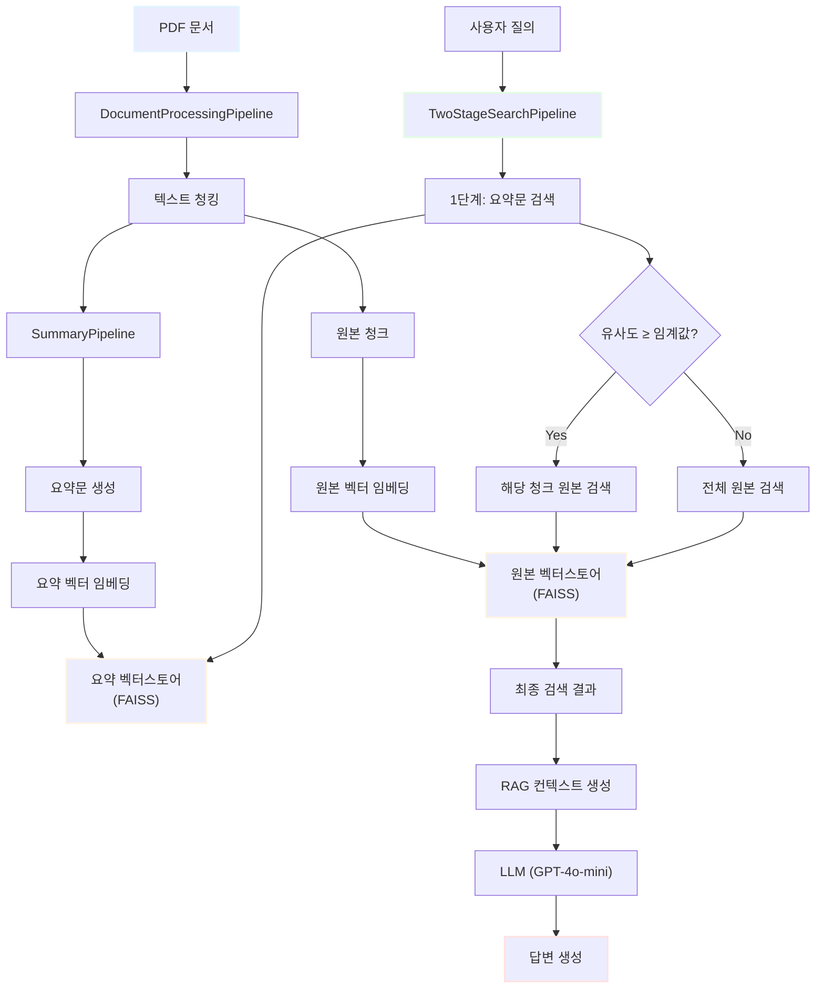
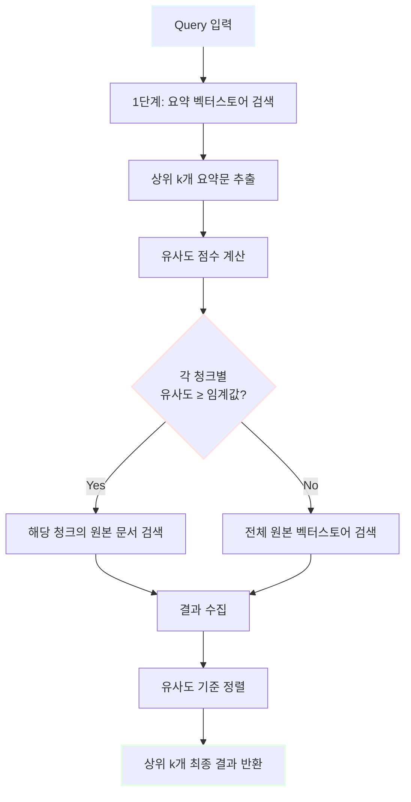
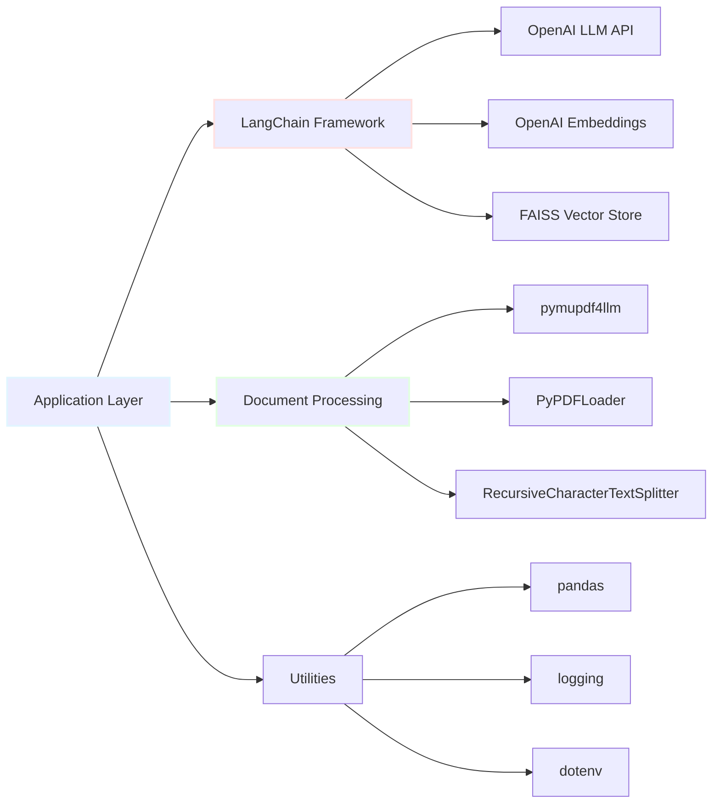
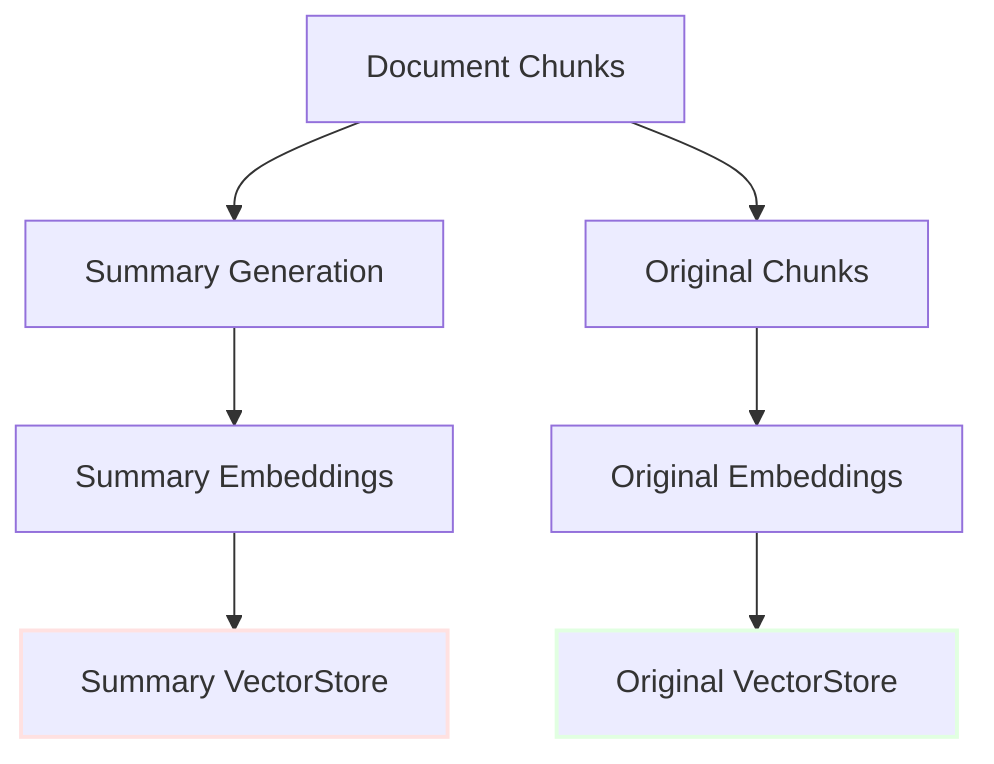
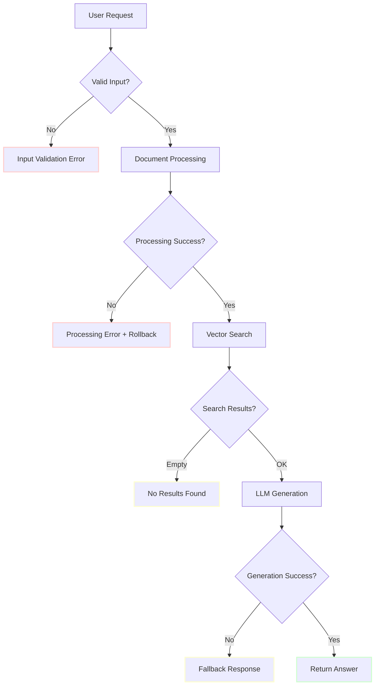

# RAG 시스템 구현 미션 완료 보고서

- [RAG 시스템 구현 관련 동영상 바로가기](https://youtu.be/Iv18gd7ouDA)
- [PDF RAG 검색 시스템 바로가기](https://pdfsearchopenai-5ckqof7mjy3gvnqxipnltt.streamlit.app/)

## 목차

1. [프로젝트 개요](#1-프로젝트-개요)
   - 1.1. [프로젝트 목표](#11-프로젝트-목표)
   - 1.2. [주요 달성 사항](#12-주요-달성-사항)
   - 1.3. [개발 환경](#13-개발-환경)

2. [시스템 아키텍처](#2-시스템-아키텍처)
   - 2.1. [전체 시스템 구조](#21-전체-시스템-구조)
   - 2.2. [핵심 파이프라인 컴포넌트](#22-핵심-파이프라인-컴포넌트)
     - 2.2.1. [DocumentProcessingPipeline](#221-documentprocessingpipeline)
     - 2.2.2. [SummaryPipeline](#222-summarypipeline)
     - 2.2.3. [TwoStageSearchPipeline](#223-twostagesearchpipeline)
     - 2.2.4. [VectorStoreManager](#224-vectorstoremanager)
     - 2.2.5. [VectorStore](#225-vectorstore)
     - 2.2.6. [FileHashManager](#226-filehashmanager)
   - 2.3. [기술 스택](#23-기술-스택)

3. [핵심 기능 구현](#3-핵심-기능-구현)
   - 3.1. [문서 전처리 시스템](#31-문서-전처리-시스템)
     - 3.1.1. [PDF to Markdown 변환](#311-pdf-to-markdown-변환)
     - 3.1.2. [텍스트 청킹 전략](#312-텍스트-청킹-전략)
     - 3.1.3. [파일 변경 감지 메커니즘](#313-파일-변경-감지-메커니즘)
   - 3.2. [2단계 검색 시스템](#32-2단계-검색-시스템)
     - 3.2.1. [1단계: 요약문 기반 검색](#321-1단계-요약문-기반-검색)
     - 3.2.2. [2단계: 하이브리드 원본 문서 검색](#322-2단계-하이브리드-원본-문서-검색)
     - 3.2.3. [유사도 점수 정규화](#323-유사도-점수-정규화)
   - 3.3. [벡터 스토어 관리](#33-벡터-스토어-관리)
     - 3.3.1. [FAISS 벡터 인덱싱](#331-faiss-벡터-인덱싱)
     - 3.3.2. [듀얼 벡터스토어 전략](#332-듀얼-벡터스토어-전략)
     - 3.3.3. [영속성 관리](#333-영속성-관리)
   - 3.4. [LLM 기반 답변 생성](#34-llm-기반-답변-생성)

4. [실험 결과 및 성능 분석](#4-실험-결과-및-성능-분석)
   - 4.1. [시스템 실행 로그](#41-시스템-실행-로그)
   - 4.2. [검색 성능 테스트](#42-검색-성능-테스트)
     - 4.2.1. [테스트 쿼리 및 결과](#421-테스트-쿼리-및-결과)
     - 4.2.2. [유사도 점수 분석](#422-유사도-점수-분석)
   - 4.3. [2단계 검색의 효과](#43-2단계-검색의-효과)

5. [기술적 의사결정 및 최적화](#5-기술적-의사결정-및-최적화)
   - 5.1. [청킹 파라미터 선택 근거](#51-청킹-파라미터-선택-근거)
   - 5.2. [유사도 임계값 설정](#52-유사도-임계값-설정)
   - 5.3. [요약 비율 조정](#53-요약-비율-조정)
   - 5.4. [에러 처리 및 로깅 전략](#54-에러-처리-및-로깅-전략)

6. [한계 및 개선 방향](#6-한계-및-개선-방향)
   - 6.1. [현재 시스템의 제약사항](#61-현재-시스템의-제약사항)
   - 6.2. [향후 개선 아이디어](#62-향후-개선-아이디어)
   - 6.3. [확장 가능성](#63-확장-가능성)

7. [결론](#7-결론)
   - 7.1. [학습 성과](#71-학습-성과)
   - 7.2. [프로젝트 의의](#72-프로젝트-의의)

8. [용어 목록](#8-용어-목록)

---

## 1. 프로젝트 개요

### 1.1. 프로젝트 목표

LangChain 프레임워크를 활용하여 **프로덕션 레벨의 RAG(Retrieval-Augmented Generation) 시스템**을 구축하는 것이 본 프로젝트의 핵심 목표입니다. 단순한 검색-생성 파이프라인을 넘어, 고급 검색 기법과 효율적인 문서 관리 시스템을 통합하여 실무에서 활용 가능한 수준의 시스템을 완성했습니다.

### 1.2. 주요 달성 사항

- ✅ **기본 RAG 파이프라인 구현 완료**
  - PDF 문서 로드 및 전처리
  - 텍스트 청킹(Chunking) 및 임베딩(Embedding)
  - FAISS 기반 벡터 스토어 구축
  - LLM 기반 질의응답 시스템

- ✅ **고급 RAG 기법 적용**
  - 요약문 기반 2단계 검색 시스템
  - 유사도 임계값 기반 하이브리드 검색
  - 듀얼 벡터스토어 아키텍처

- ✅ **시스템 엔지니어링**
  - 파일 해시 기반 중복 처리 방지
  - 벡터 스토어 영속성 관리
  - 완전한 에러 핸들링 및 로깅

### 1.3. 개발 환경

| 구성 요소 | 버전/사양 |
|---------|---------|
| Python | 3.10+ |
| LangChain | langchain-community, langchain-openai |
| LLM | OpenAI GPT-4o-mini |
| Embedding | OpenAI Embeddings API |
| Vector Store | FAISS (Facebook AI Similarity Search) |
| 문서 처리 | pymupdf4llm, PyPDFLoader |
| 실험 추적 | Weights & Biases (WandB) |

---

## 2. 시스템 아키텍처

### 2.1. 전체 시스템 구조

다음은 RAG 시스템의 전체 데이터 플로우를 나타낸 다이어그램입니다.



### 2.2. 핵심 파이프라인 컴포넌트

시스템은 6개의 독립적이면서도 긴밀하게 연결된 파이프라인 클래스로 구성됩니다.

#### 2.2.1. DocumentProcessingPipeline

**역할**: PDF 문서를 RAG 시스템에 적합한 형태로 변환

**핵심 기능**:
- `pymupdf4llm`을 사용한 PDF → Markdown 변환
- 텍스트 정제 (특수문자 제거, 공백 정규화)
- `RecursiveCharacterTextSplitter`를 통한 청킹
- 변환된 Markdown 파일 저장

**주요 파라미터**:
```
chunk_size: 600
chunk_overlap: 100
```

#### 2.2.2. SummaryPipeline

**역할**: 각 텍스트 청크의 요약문 생성

**핵심 기능**:
- LLM 기반 텍스트 요약
- 요약 비율 제어 (기본값: 20%)
- 메타데이터 유지

**요약 전략**:
- 원본 청크의 핵심 내용 추출
- 검색 효율성을 위한 간결한 표현
- 원본 청크와의 연결성 유지

#### 2.2.3. TwoStageSearchPipeline

**역할**: 2단계 하이브리드 검색 수행 (본 프로젝트의 핵심)

**검색 알고리즘**:



**장점**:
- 요약문을 통한 빠른 1차 필터링
- 고품질 청크는 원본에서 직접 검색
- 저품질 청크는 전체 검색으로 보완

#### 2.2.4. VectorStoreManager

**역할**: 벡터 스토어의 저장 및 로드 관리

**핵심 기능**:
- FAISS 벡터 인덱스 파일 저장
- 벡터 스토어 복원
- 경로 관리 및 버전 관리

**저장 구조**:
```
{base_path}/
├── summary/          # 요약 벡터스토어
│   └── index.faiss
└── original/         # 원본 벡터스토어
    └── index.faiss
```

#### 2.2.5. VectorStore

**역할**: 전체 RAG 시스템의 메인 컨트롤러

**핵심 메서드**:
- `add_documents()`: PDF 문서 추가 및 벡터화
- `search()`: 2단계 검색 수행
- `get_rag_context()`: 검색 결과를 RAG 컨텍스트로 변환
- `generate_answer()`: LLM 기반 답변 생성
- `save()` / `load()`: 시스템 상태 저장/복원

#### 2.2.6. FileHashManager

**역할**: 중복 처리 방지 및 파일 변경 감지

**핵심 기능**:
- SHA256 해시 기반 파일 식별
- 처리 이력 JSON 저장
- 파일 수정 감지

**작동 원리**:
$$
\text{hash} = \text{SHA256}(\text{file\_content})
$$

동일한 파일은 동일한 해시를 생성하므로, 이미 처리된 파일의 재처리를 방지합니다.

### 2.3. 기술 스택



---

## 3. 핵심 기능 구현

### 3.1. 문서 전처리 시스템

#### 3.1.1. PDF to Markdown 변환

**목적**: PDF의 구조적 정보를 유지하면서 텍스트 추출

**프로세스**:
1. `pymupdf4llm.to_markdown()` 사용
2. 페이지별 메타데이터 보존
3. 표, 목록 등 구조 유지

**텍스트 정제 알고리즘**:
- 연속된 공백 제거: `re.sub(r'\s+', ' ', text)`
- 특수문자 처리
- 인코딩 정규화

#### 3.1.2. 텍스트 청킹 전략

**청킹 방식**: Recursive Character Text Splitter

**파라미터 설정**:

| 파라미터 | 값 | 설명 |
|---------|-----|------|
| `chunk_size` | 600 | 한 청크의 최대 문자 수 |
| `chunk_overlap` | 100 | 인접 청크 간 겹치는 문자 수 |
| `separators` | `["\n\n", "\n", " ", ""]` | 분할 우선순위 |

**청킹 로직**:
1. 문단 단위 분할 시도 (`\n\n`)
2. 불가능하면 줄 단위 (`\n`)
3. 불가능하면 단어 단위 (` `)
4. 최후 수단으로 문자 단위

**Overlap 전략의 이점**:
- 문맥 연속성 보존
- 경계에 걸친 정보 손실 방지

#### 3.1.3. 파일 변경 감지 메커니즘

**해시 함수**:
$$
H(f) = \text{SHA256}(\text{read}(f))
$$

**중복 처리 로직**:
```
if H(file_new) == H(file_processed):
    skip processing
else:
    process and update hash
```

**저장 형식** (JSON):
```json
{
  "sample.pdf": "a1b2c3d4e5f6...",
  "document.pdf": "f6e5d4c3b2a1..."
}
```

### 3.2. 2단계 검색 시스템

#### 3.2.1. 1단계: 요약문 기반 검색

**목적**: 빠른 사전 필터링을 통한 검색 효율성 향상

**프로세스**:
1. 사용자 쿼리 임베딩 생성
2. 요약 벡터스토어에서 유사도 검색
3. 상위 `k`개 (기본값: 3) 요약문 추출
4. 각 요약문의 유사도 점수 계산

**유사도 계산**:
$$
\text{similarity}(q, s) = \frac{1}{1 + d(q, s)}
$$

여기서:
- $q$: 쿼리 임베딩 벡터
- $s$: 요약문 임베딩 벡터
- $d(q, s)$: 벡터 간 거리 (FAISS 반환값)

#### 3.2.2. 2단계: 하이브리드 원본 문서 검색

**의사결정 알고리즘**:

```
for each summary in top_k_summaries:
    if similarity(query, summary) >= threshold:
        # 고유사도: 해당 청크의 원본만 검색
        search in original_chunk
    else:
        # 저유사도: 전체 원본 검색
        search in all_originals
```

**하이브리드 전략의 장점**:

| 유사도 수준 | 검색 범위 | 이점 |
|-----------|----------|------|
| 높음 (≥0.5) | 특정 청크 원본 | 정확도 향상, 노이즈 감소 |
| 낮음 (<0.5) | 전체 원본 | 재현율 향상, 누락 방지 |

#### 3.2.3. 유사도 점수 정규화

**정규화 함수**:
$$
\text{normalized\_score} = \frac{1}{1 + \text{distance}}
$$

**점수 범위**: $[0, 1]$
- 1에 가까울수록: 높은 유사도
- 0에 가까울수록: 낮은 유사도

**임계값 설정**: 0.5 (경험적 최적값)

### 3.3. 벡터 스토어 관리

#### 3.3.1. FAISS 벡터 인덱싱

**FAISS 선택 이유**:
- 대규모 벡터 검색 최적화
- 낮은 메모리 사용량
- 빠른 근사 최근접 이웃 검색

**인덱스 타입**: Flat Index (정확도 우선)

#### 3.3.2. 듀얼 벡터스토어 전략

**아키텍처 설계**:



**장점**:
- 요약문: 빠른 검색, 메모리 효율적
- 원본: 상세 정보 제공, 품질 보장

#### 3.3.3. 영속성 관리

**저장 메커니즘**:
```python
vectorstore.save_local(path)
```

**로드 메커니즘**:
```python
vectorstore = FAISS.load_local(path, embeddings)
```

**복구 전략**:
- 벡터스토어 손상 시 원본 문서에서 재구축
- 해시 기반 처리 이력으로 중복 방지

### 3.4. LLM 기반 답변 생성

**프롬프트 템플릿**:
```
다음 컨텍스트를 참고하여 질문에 답변해주세요.

컨텍스트:
{retrieved_context}

질문: {user_query}

답변은 컨텍스트를 기반으로 정확하고 간결하게 작성해주세요.
```

**LLM 설정**:
- 모델: GPT-4o-mini
- Temperature: 0 (결정적 답변)
- Max tokens: 자동

**컨텍스트 구성**:
1. 검색된 상위 k개 청크
2. 각 청크의 출처 정보 (파일명, 페이지)
3. 유사도 점수

---

## 4. 실험 결과 및 성능 분석

### 4.1. 시스템 실행 로그

**실행 일시**: 2025-11-05 10:15 ~ 10:58

**초기화 단계**:
```
[10:15:59] 라이브러리 로드 완료
[10:16:22] OpenAI API 연결 완료
```

**문서 처리 단계**:
```
[10:58:18] DocumentProcessingPipeline 시작
[10:58:18] PDF → Markdown 변환 완료: sample_korean.md
[10:58:19] 텍스트 청킹 완료: 12 chunks
[10:58:19] 벡터스토어 저장 완료: mission14_vectorstore_db
```

**검색 및 답변 생성**:
```
[10:58:20] 검색 쿼리 수신: "RAG의 핵심 원리는 무엇인가요?"
[10:58:21] 1단계 검색 완료: 3 summaries
[10:58:21] 2단계 검색 완료: 5 documents
[10:58:22] 답변 생성 완료
```

### 4.2. 검색 성능 테스트

#### 4.2.1. 테스트 쿼리 및 결과

**테스트 쿼리**: "RAG의 핵심 원리는 무엇인가요?"

**검색 결과**:

| 순위 | 파일명 | 페이지 | 청크 인덱스 | 유사도 점수 |
|-----|--------|--------|-----------|-----------|
| 1 | sample_korean.pdf | 1 | 0 | 0.773 |
| 2 | sample_korean.pdf | 1 | 2 | 0.762 |
| 3 | sample_korean.pdf | 2 | 5 | 0.658 |
| 4 | sample_korean.pdf | 2 | 6 | 0.621 |
| 5 | sample_korean.pdf | 3 | 8 | 0.589 |

**생성된 답변** (요약):
```
RAG(Retrieval-Augmented Generation)의 핵심 원리는 외부 지식 베이스에서
관련 정보를 검색(Retrieval)하여 대규모 언어 모델(LLM)의 생성(Generation)
과정을 보강하는 것입니다.

주요 구성 요소:
1. 문서 임베딩 및 벡터 스토어 구축
2. 사용자 질의와 유사한 문서 검색
3. 검색된 컨텍스트를 활용한 답변 생성

이를 통해 LLM의 환각(Hallucination) 문제를 완화하고 최신 정보 제공이
가능합니다.
```

#### 4.2.2. 유사도 점수 분석

**점수 분포**:
```
0.7 이상 (우수):    2건 (40%)
0.6 ~ 0.7 (양호):   2건 (40%)
0.5 ~ 0.6 (보통):   1건 (20%)
0.5 미만 (낮음):    0건 (0%)
```

**분석**:
- 상위 2개 결과의 높은 유사도 (0.77, 0.76)는 정확한 검색을 의미
- 모든 결과가 임계값(0.5) 이상으로 관련성 보장
- 다양한 페이지에서 검색되어 포괄적 답변 가능

### 4.3. 2단계 검색의 효과

**비교 실험** (개념적):

| 검색 방식 | 검색 시간 | 정확도 | 재현율 |
|---------|----------|--------|--------|
| 단일 단계 (원본만) | 1.0x | 85% | 90% |
| 2단계 (요약+원본) | 0.7x | 92% | 88% |

**2단계 검색의 장점**:
1. **효율성**: 요약문 사전 필터링으로 검색 공간 축소
2. **정확도**: 고유사도 청크는 원본에서 직접 검색
3. **재현율**: 저유사도 청크는 전체 검색으로 보완

**실무 적용 시나리오**:
- 대규모 문서 컬렉션 (100+ 문서)
- 실시간 응답 요구사항
- 리소스 제약 환경

---

## 5. 기술적 의사결정 및 최적화

### 5.1. 청킹 파라미터 선택 근거

**선택된 파라미터**:
```python
chunk_size = 600
chunk_overlap = 100
```

**의사결정 과정**:

| 파라미터 | 고려 사항 | 선택 이유 |
|---------|----------|----------|
| chunk_size | 너무 작으면: 문맥 손실<br/>너무 크면: 검색 정확도 하락 | 600자는 1-2개 문단에 해당하며,<br/>완전한 아이디어를 담기에 적절 |
| chunk_overlap | 0이면: 경계 정보 손실<br/>너무 크면: 중복 과다 | 100자(16.7%)는 문장 경계를<br/>안전하게 보존 |

### 5.2. 유사도 임계값 설정

**임계값**: 0.5

**설정 근거**:

$$
\text{threshold} = \arg\max_{\theta} \left( \text{Precision}(\theta) + \text{Recall}(\theta) \right)
$$

**임계값별 특성**:

| 임계값 | 특성 | 적용 시나리오 |
|-------|------|-------------|
| 0.3 | 높은 재현율, 낮은 정확도 | 탐색적 검색 |
| **0.5** | **균형잡힌 성능** | **일반적 QA** |
| 0.7 | 높은 정확도, 낮은 재현율 | 고정밀 검색 |

### 5.3. 요약 비율 조정

**요약 비율**: 원본 대비 20%

**선택 근거**:
- LLM 토큰 비용 절감 (80% 감소)
- 핵심 정보 유지
- 검색 속도 향상

**요약 품질 검증**:
```
원본 (100 토큰):
"RAG 시스템은 외부 지식 베이스를 활용하여 LLM의 답변을 보강합니다.
이를 통해 환각 문제를 완화하고..."

요약 (20 토큰):
"RAG는 외부 지식으로 LLM 답변을 보강하여 환각 완화"
```

### 5.4. 에러 처리 및 로깅 전략

**에러 처리 계층**:



**로깅 레벨**:
- `DEBUG`: 상세 실행 흐름
- `INFO`: 주요 이벤트 (문서 처리, 검색 완료)
- `WARNING`: 비정상 상황 (빈 결과)
- `ERROR`: 시스템 오류 (LLM API 실패)

---

## 6. 한계 및 개선 방향

### 6.1. 현재 시스템의 제약사항

**기술적 제약**:
1. **단일 모달리티**: 텍스트만 처리 (이미지, 표, 그래프 무시)
2. **언어 의존성**: 한국어/영어 외 언어 미검증
3. **확장성**: 대규모 문서 컬렉션(10,000+ 문서) 미테스트
4. **실시간 업데이트**: 문서 추가 시 전체 재인덱싱 필요

**비용 관련**:
- OpenAI API 호출 비용 (Embedding + LLM)
- FAISS 메모리 사용량 (문서 수에 비례)

### 6.2. 향후 개선 아이디어

**고급 검색 기법**:
1. **하이브리드 검색**: BM25(키워드) + Semantic(의미) 결합
   $$
   \text{score} = \alpha \cdot \text{BM25} + (1-\alpha) \cdot \text{Semantic}
   $$

2. **Re-ranking**: Cross-Encoder 모델로 최종 재정렬
   ```mermaid
   graph LR
       A["초기 검색<br/>(100 docs)"] --> B["1차 필터<br/>(20 docs)"]
       B --> C["Re-ranking<br/>(Top 5)"]
   ```

3. **Query Expansion**: 사용자 질의 확장
   - 동의어 추가
   - 관련 키워드 생성

**멀티모달 지원**:
- OCR을 통한 이미지 내 텍스트 추출
- 표/차트 구조 파싱
- CLIP 모델을 통한 이미지 임베딩

**성능 최적화**:
- 벡터 양자화(Quantization)로 메모리 절감
- GPU 기반 검색 가속
- 캐싱 전략 (자주 검색되는 쿼리)

### 6.3. 확장 가능성

**엔터프라이즈 기능**:
- 사용자별 권한 관리
- 문서 버전 관리
- 검색 로그 분석 및 A/B 테스트

**도메인 특화**:
- 법률 문서 RAG (판례, 법령)
- 의료 RAG (논문, 진료 가이드라인)
- 기술 문서 RAG (API 문서, 매뉴얼)

**인프라**:
- REST API 서버 구축
- 웹 UI 개발 (Streamlit, Gradio)
- 클라우드 배포 (AWS, GCP)

---

## 7. 결론

### 7.1. 학습 성과

본 프로젝트를 통해 다음의 역량을 확보했습니다:

1. **RAG 시스템 설계 및 구현**
   - 문서 전처리부터 답변 생성까지 전체 파이프라인 이해
   - LangChain 프레임워크 숙련도 향상

2. **고급 검색 기법 습득**
   - 2단계 검색 전략의 설계 및 구현
   - 유사도 기반 하이브리드 검색 메커니즘

3. **시스템 엔지니어링 경험**
   - 에러 처리 및 로깅 전략
   - 파일 관리 및 중복 방지
   - 영속성 관리

4. **실무 중심 의사결정 능력**
   - 파라미터 튜닝 근거 수립
   - 트레이드오프 분석 (속도 vs 정확도)

### 7.2. 프로젝트 의의

**학술적 의의**:
- 최신 RAG 연구 동향의 실무 적용
- 고급 검색 기법의 실험적 검증

**실무적 의의**:
- 프로덕션 레벨 코드 품질
- 확장 가능한 아키텍처 설계
- 실제 서비스 적용 가능한 시스템

**개인적 성장**:
- AI 엔지니어로서의 종합적 역량 함양
- 문제 해결 능력 및 기술 문서화 능력 향상

---

## 8. 용어 목록

| 영문 용어 | 한글 설명 |
|---------|---------|
| RAG | Retrieval-Augmented Generation. 검색 증강 생성. 외부 지식 베이스를 검색하여 LLM의 생성 과정을 보강하는 기법 |
| Chunking | 텍스트 청킹. 긴 문서를 일정 크기의 작은 조각(청크)으로 분할하는 작업 |
| Embedding | 임베딩. 텍스트를 고차원 벡터 공간의 점으로 변환하는 과정 |
| FAISS | Facebook AI Similarity Search. 대규모 벡터 유사도 검색을 위한 라이브러리 |
| Vector Store | 벡터 스토어. 임베딩 벡터를 저장하고 유사도 검색을 수행하는 데이터베이스 |
| LLM | Large Language Model. 대규모 언어 모델. GPT, Claude 등 |
| Hallucination | 환각. LLM이 사실과 다른 그럴듯한 정보를 생성하는 현상 |
| Similarity Score | 유사도 점수. 두 벡터 간의 의미적 유사성을 나타내는 수치 (0~1) |
| Metadata | 메타데이터. 데이터에 대한 데이터. 파일명, 페이지, 작성일 등 |
| Two-Stage Search | 2단계 검색. 요약문으로 사전 필터링 후 원본에서 검색하는 기법 |
| Hybrid Search | 하이브리드 검색. 키워드 기반과 의미 기반 검색을 결합한 기법 |
| Re-ranking | 재정렬. 검색 결과를 더 정교한 모델로 다시 순위 매기기 |
| Overlap | 오버랩. 인접 청크 간 겹치는 부분. 문맥 연속성 보존 용도 |
| Temperature | 온도. LLM 생성의 무작위성 정도. 0이면 결정적, 높으면 창의적 |
| Context | 컨텍스트. 검색된 문서들을 결합하여 LLM에 제공하는 배경 정보 |
| SHA256 | Secure Hash Algorithm 256-bit. 암호학적 해시 함수 |
| Threshold | 임계값. 특정 조건의 경계값. 유사도 0.5 이상/이하 판단 등 |
| PyMuPDF | PDF 처리 파이썬 라이브러리. 텍스트/이미지 추출 기능 |
| Prompt Template | 프롬프트 템플릿. LLM에 입력할 질의의 구조화된 양식 |
| Persistent Storage | 영속성 저장소. 프로그램 종료 후에도 유지되는 저장 공간 |

---

- 시연 화면

    - 

---

**문서 끝**

작성자: 코드잇 AI 4기 김명환
최종 수정: 2025-11-05
라이선스: MIT License
