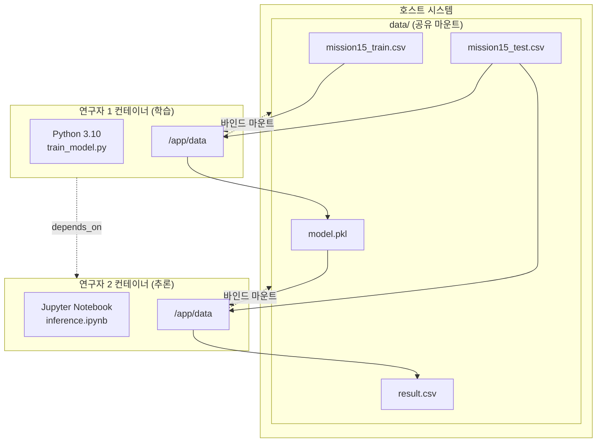

# Mission 15 - Docker 기반 머신러닝 협업 워크플로우

## 1. 프로젝트 개요 및 아키텍처

Docker를 활용한 머신러닝 모델 학습·추론 협업 워크플로우 구현. 연구자 1(학습)과 연구자 2(추론)가 Bind Mount로 `model.pkl`을 공유하며, **방어적 설계**, **환경 일관성**, **재현성**을 핵심 원칙으로 설계.

### 1.1. 시스템 아키텍처



### 1.2. 방어적 설계 핵심

**이중 방어 메커니즘**
- **1차**: `docker-compose.yml`의 `depends_on`으로 시작 순서 제어
- **2차**: `startup.sh`에서 10초 타임아웃으로 `model.pkl` 존재 확인
- **설계 의도**: `depends_on`은 컨테이너 시작만 제어하므로, startup.sh에서 파일 존재를 명시적 확인하여 학습 완료 전 추론 실행 오류 방지

**Atomic Write 패턴**: 임시 파일 생성 후 `os.replace()`로 원자적 이동, 파일 쓰기 중 접근 방지

**환경 감지 분기**: 환경변수(`RUNNING_IN_DOCKER`)로 로컬/컨테이너 경로 자동 전환

---

## 2. 데이터 전처리 및 모델링 결과

### 2.1. 전처리 파이프라인

**ColumnTransformer 기반 통합 전처리**
- **OneHotEncoder**: `drop='first'`로 다중공선성 방지, `handle_unknown='ignore'`로 미지 범주 처리
- **변수 구성**: Extracurricular Activities(범주형) → One-Hot, 나머지(수치형) → Passthrough
- **Pipeline 통합**: 전처리 + LinearRegression 연결

### 2.2. 모델 성능

| 지표 | 값 | 해석 |
|------|-----|------|
| **RMSE** | 2.0103 | Performance Index(10-100) 대비 약 2.2% 오차 |
| **R²** | 0.9893 | 데이터 변동성의 98.93% 설명 |

**특징 중요도** (선형 회귀 계수 기준)
- Study Hours Per Day: 강한 양의 상관
- Previous Scores: 중간 양의 상관
- Sleep Hours: 약한 음의 상관
- Extracurricular Activities(Yes): 미미한 영향

### 2.3. 재현성 확보 전략

1. **패키지 버전 고정**: numpy==1.24.4, pandas==1.5.3, scikit-learn==1.2.2
2. **random_state 고정**: `train_test_split(random_state=42)`
3. **Python 버전 통일**: 3.10 (두 컨테이너 동일)
4. **Bind Mount**: `./data:/app/data`로 호스트에서 직접 파일 확인 가능

---

## 3. 실행 및 배포

### 3.1. Docker Hub URL

**이미지 저장소**
- 학습 이미지: `c0z0c/mission15-train:latest`
- 추론 이미지: `c0z0c/mission15-inference:latest`

**사용 방법**
```bash
# 이미지 다운로드
docker pull c0z0c/mission15-train:latest
docker pull c0z0c/mission15-inference:latest

# 실행
docker-compose up

# Jupyter 접속: http://localhost:8888
```

### 3.2. 실행 결과 요약

1. **학습 컨테이너**: `train_model.py` 실행 → `model.pkl` 생성
2. **추론 컨테이너**: startup.sh에서 model.pkl 대기(최대 10초) → Jupyter 시작
3. **추론 노트북**: inference.ipynb 실행 → `result.csv` 생성
4. **출력 파일**: `./data/` 폴더에서 확인 가능

---

## 4. 결론

본 프로젝트는 Docker 기반 머신러닝 협업 환경에서 **방어적 설계**(이중 방어 메커니즘)를 통해 안정적 워크플로우를 구현했습니다. startup.sh의 10초 타임아웃 로직은 `depends_on`의 한계를 보완하여 모델 파일 생성 전 추론 실행을 효과적으로 방지했으며, 패키지 버전 통일과 Bind Mount 방식으로 **재현성**과 **환경 일관성**을 확보했습니다. RMSE 2.0103의 우수한 모델 성능을 달성하여 실무 적용 가능성을 입증했습니다.