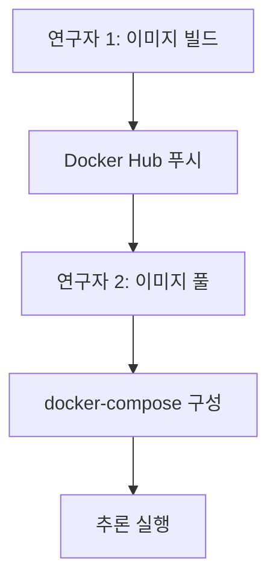
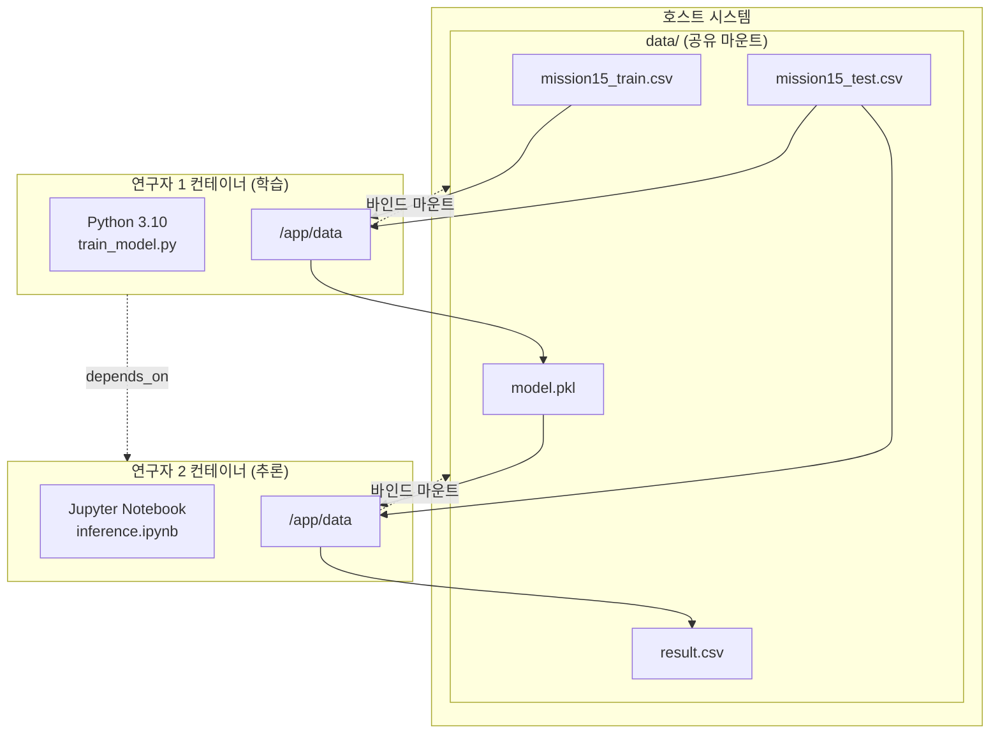

# 스프린트 미션 15 - Docker 기반 협업 워크플로우

## 미션 개요
두 명의 연구자가 Docker를 활용하여 머신러닝 모델 학습과 추론을 협업하는 시나리오입니다.

### 연구자 역할
- **연구자 1**: 데이터 전처리, EDA, 모델링, 모델 파일 추출
- **연구자 2**: 추출된 모델을 활용한 추론 및 결과 생성

## 프로젝트 구조
```
mission15/
├── docker-compose.yml          # 두 연구자의 컨테이너 오케스트레이션
├── data/                       # 공유 데이터 디렉토리 (볼륨 마운트)
│   ├── mission15_train.csv     # 학습 데이터
│   ├── mission15_test.csv      # 테스트 데이터
│   ├── model.pkl               # 학습된 모델 (연구자 1 → 2)
│   └── result.csv              # 추론 결과 (연구자 2 생성)
├── mission15_train/            # 연구자 1: 모델 학습
│   ├── Dockerfile
│   ├── requirements.txt
│   ├── startup.sh
│   ├── train_model.py
│   ├── notebook/
│   │   └── train_model.ipynb
│   └── README.md
└── mission15_inference/        # 연구자 2: 모델 추론
    ├── Dockerfile
    ├── startup.sh
    ├── notebook/
    │   └── inference.ipynb
    └── README.md
```

## 사용 데이터셋
캐글의 학생 성적 데이터(스프린트 미션 전용 후처리)

### 데이터 변수
| 변수명 | 설명 |
|--------|------|
| Hours Studied | 학생의 총 공부 시간 |
| Previous Scores | 이전 시험 점수 |
| Extracurricular Activities | 과외 활동 참여 여부 (Yes/No) |
| Sleep Hours | 평균 수면 시간 |
| Sample Question Papers Practiced | 연습한 모의고사 수 |
| Performance Index | **목표 변수** - 학생의 성취도 지표 (10-100) |

### 데이터 다운로드
1. [train.csv](링크) - 학습용 데이터
2. [test.csv](링크) - 추론용 데이터

다운로드 후 `data/` 디렉토리에 다음과 같이 저장:
- `data/mission15_train.csv`
- `data/mission15_test.csv`

## 빠른 시작

### 1. 환경 준비
```bash
# 프로젝트 클론
git clone <repository-url>
cd mission15

# 데이터 디렉토리 생성
mkdir -p data

# 데이터 파일 배치
# data/mission15_train.csv
# data/mission15_test.csv
```

### 2. Docker Compose로 전체 워크플로우 실행
```bash
# 모든 서비스 시작 (학습 + 추론 환경)
docker-compose up

# 또는 백그라운드 실행
docker-compose up -d
```

### 3. Jupyter Notebook 접속
```bash
# Jupyter 토큰 확인 (필요한 경우)
docker logs mission15_inference

# 브라우저에서 접속
http://localhost:8888
```

### 4. 추론 실행
1. Jupyter Notebook에서 `inference.ipynb` 열기
2. 셀 실행하여 추론 수행
3. `data/result.csv` 결과 확인

### 5. 정리
```bash
# 컨테이너 중지 및 삭제
docker-compose down

# 볼륨까지 삭제 (주의: 데이터 손실)
docker-compose down -v
```

## 단계별 실행 (세부 제어)

### 연구자 1만 실행 (모델 학습)
```bash
docker-compose up mission15_train
```

### 연구자 2만 실행 (추론)
```bash
# 연구자 1이 생성한 model.pkl이 필요함
docker-compose up mission15_inference
```

## 협업 워크플로우

### 시나리오 1: 전체 워크플로우 (로컬 개발)


1. `data/` 디렉토리에 학습/테스트 데이터 배치
2. `docker-compose up` 실행
3. 연구자 1 컨테이너가 모델 학습 및 `model.pkl` 저장
4. 연구자 2 컨테이너(Jupyter)가 자동 시작
5. Jupyter에서 추론 노트북 실행
6. `result.csv` 결과 확인

### 시나리오 2: Docker Hub를 통한 협업


#### 연구자 1
```bash
# 1. 이미지 태그 및 푸시
docker tag mission15_train-image c0z0c/mission15-train:latest
docker push c0z0c/mission15-train:latest

docker tag mission15_inference-jupyter c0z0c/mission15-inference:latest
docker push c0z0c/mission15-inference:latest
```

#### 연구자 2
```bash
# 1. 이미지 가져오기
docker pull c0z0c/mission15-train:latest
docker pull c0z0c/mission15-inference:latest

# 2. docker-compose.yml 수정 (선택사항)
# services:
#   mission15_train:
#     image: c0z0c/mission15-train:latest
#   mission15_inference:
#     image: c0z0c/mission15-inference:latest

# 3. 실행
docker-compose up
```

## 핵심 설계 포인트

### 1. 환경 일관성 보장
- **Python 버전**: 3.10 (두 연구자 동일)
- **패키지 버전**: `requirements.txt`로 고정
- **베이스 이미지**:
  - 연구자 1: `python:3.10-slim`
  - 연구자 2: `jupyter/scipy-notebook:latest`

### 2. 파일 공유 전략
```yaml
# docker-compose.yml
volumes:
  - ./data:/app/data  # 연구자 1
  - ./data:/app/data  # 연구자 2
```

**공유되는 파일**:
- `mission15_train.csv` (입력)
- `mission15_test.csv` (입력)
- `model.pkl` (연구자 1 → 2)
- `result.csv` (연구자 2 출력)

### 3. 컨테이너 의존성
```yaml
services:
  mission15_inference:
    depends_on:
      - mission15_train
```
- 연구자 2는 연구자 1이 먼저 실행되도록 보장
- `model.pkl` 파일 존재 확인 로직 포함

## 모델 성능 평가
- **평가 지표**: RMSE (Root Mean Squared Error)
- **모델**: scikit-learn 기반 회귀 모델

## Docker Hub 이미지

### 이미지 정보
- 연구자 1 (학습): `c0z0c/mission15-train:latest`
- 연구자 2 (추론): `c0z0c/mission15-inference:latest`

### 이미지 사용법

#### 개별 컨테이너 실행 (docker run)
```bash
# Pull
docker pull c0z0c/mission15-train:latest
docker pull c0z0c/mission15-inference:latest

# Run (학습)
docker run --rm -v ${PWD}/data:/app/data c0z0c/mission15-train:latest

# Run (추론 - Jupyter)
docker run --rm -p 8888:8888 -v ${PWD}/data:/app/data c0z0c/mission15-inference:latest
```

#### Docker Compose 실행
```bash
# 1. docker-compose.yml 생성 (루트 디렉토리)
# (아래 내용 참조)

# 2. 전체 워크플로우 실행
docker-compose up

# 3. 백그라운드 실행
docker-compose up -d

# 4. 로그 확인
docker-compose logs -f mission15_inference

# 5. 정리
docker-compose down
```

**docker-compose.yml 예시**:
```yaml
version: '3.8'

services:
  mission15_train:
    image: c0z0c/mission15-train:latest
    container_name: mission15_train
    volumes:
      - ./data:/app/data

  mission15_inference:
    image: c0z0c/mission15-inference:latest
    container_name: mission15_inference
    depends_on:
      - mission15_train
    ports:
      - "8888:8888"
    volumes:
      - ./data:/app/data
```

## 문제 해결

### 1. 데이터 파일을 찾을 수 없음
```
ERROR - 오류: 훈련 데이터 파일 '/app/data/mission15_train.csv'을 찾을 수 없습니다.
```
**해결**:
- `data/` 디렉토리에 파일이 있는지 확인
- 볼륨 마운트 경로 확인
- 파일명 대소문자 확인

### 2. 모델 파일을 찾을 수 없음
```
FileNotFoundError: [Errno 2] No such file or directory: '/app/data/model.pkl'
```
**해결**:
- 연구자 1 컨테이너가 정상적으로 완료되었는지 확인
- `docker logs mission15_train` 로그 확인
- `data/model.pkl` 파일 존재 여부 확인

### 3. Jupyter Notebook 접속 불가
**해결**:
- 포트 8888이 이미 사용 중인지 확인
- 방화벽 설정 확인
- `docker ps`로 컨테이너 실행 상태 확인

### 4. 권한 문제 (Permission Denied)
**Windows**:
- Docker Desktop 설정에서 드라이브 공유 활성화

**Linux**:
```bash
# 현재 사용자의 UID/GID 확인
id -u
id -g

# docker-compose.yml에서 user 설정
user: "1000:1000"
```

## 상세 문서
- [mission15_train/README.md](mission15_train/README.md) - 연구자 1 상세 가이드
- [mission15_inference/README.md](mission15_inference/README.md) - 연구자 2 상세 가이드

## 코드 아키텍처

### 전체 흐름도


### 컨테이너 통신
- 직접 네트워크 통신 없음
- 공유 볼륨(`data/`)을 통한 파일 기반 통신
- `depends_on`으로 시작 순서 제어

## 제출물 체크리스트
- [x] `data/` 디렉토리에 학습/테스트 데이터 준비
- [x] 연구자 1 컨테이너 실행 및 `model.pkl` 생성 확인
- [x] 연구자 2 컨테이너 실행 및 Jupyter 접속 확인
- [x] `inference.ipynb`에서 추론 실행
- [x] `result.csv` 생성 확인
- [x] Docker Hub에 이미지 업로드
- [x] 코드 아키텍처 도식 작성
- [x] 보고서 PDF 작성 (2페이지 이내)

## 참고 사항
- 모든 컨테이너는 동일한 Python 버전(3.10) 사용
- `joblib`을 사용하여 모델 직렬화
- RMSE 지표로 모델 성능 평가
- 볼륨 마운트로 데이터 영속성 보장

