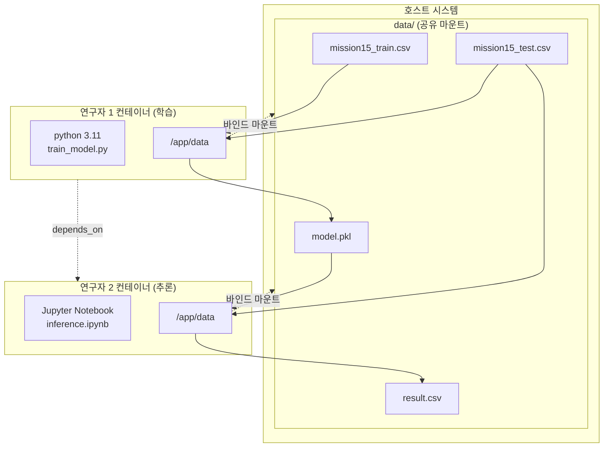

# Mission 15 - Docker 기반 머신러닝 협업 워크플로우 완료 보고서

## 1. 프로젝트 개요

### 1.1. 미션 목표
Docker를 활용한 머신러닝 모델 학습 및 추론 협업 워크플로우 구현. 두 명의 연구자가 컨테이너 기반 환경에서 모델 학습(연구자 1)과 추론(연구자 2)을 분리하여 수행하며, 공유 볼륨을 통해 모델 파일을 전달하는 시스템을 설계 및 구현했습니다.

### 1.2. 핵심 설계 원칙
- **환경 일관성(Environment Consistency)**: python 3.11 및 패키지 버전 통일
- **방어적 설계(Defensive Design)**: 모델 파일 생성 전 추론 실행 방지
- **재현성(Reproducibility)**: random_state=42, 패키지 버전 고정

---

## 2. 기술 구현

### 2.1. 시스템 아키텍처



### 2.2. 방어적 설계 구현

#### 2.2.1. 이중 방어 메커니즘
```yaml
# docker-compose.yml
services:
  mission15_inference:
    depends_on:
      - mission15_train  # 1차 방어: 시작 순서 제어
```

```bash
# startup.sh (mission15_inference)
# 2차 방어: model.pkl 존재 확인 (타임아웃 10초)
timeout_secs=10
while [ "$elapsed" -lt "$timeout_secs" ]; do
  if [ -f "/app/data/model.pkl" ]; then
    echo "/app/data/model.pkl found."
    break
  fi
  sleep "$interval_secs"
  elapsed=$((elapsed + interval_secs))
done
```

**설계 의도**: `depends_on`은 컨테이너 시작 순서만 제어하므로, 실제 model.pkl 생성 완료를 보장하지 않습니다. startup.sh에서 파일 존재를 명시적으로 확인하여 학습 완료 전 추론 실행 오류를 방지합니다.

#### 2.2.2. 환경 감지 및 경로 분기
```python
# train_model.py
IS_DOCKER = os.environ.get('RUNNING_IN_DOCKER', 'False') == 'True'
DATA_DIR = r'..\data' if not IS_DOCKER else '/app/data'
```

로컬 개발 환경과 컨테이너 환경에서 동일한 코드로 실행 가능하도록 환경변수 기반 경로 분기를 구현했습니다.

### 2.3. 데이터 전처리 및 모델링

#### 2.3.1. 파이프라인 구성
```python
preprocessor = ColumnTransformer(
    transformers=[
        ('cat', OneHotEncoder(handle_unknown='ignore', drop='first'), 
         ['Extracurricular Activities'])
    ],
    remainder='passthrough'
)

pipeline = Pipeline(steps=[
    ('preprocessor', preprocessor),
    ('regressor', LinearRegression())
])
```

**특징**:
- OneHotEncoder의 `drop='first'` 옵션으로 다중공선성(multicollinearity) 방지
- `handle_unknown='ignore'` 설정으로 테스트 데이터의 미지 범주 처리
- ColumnTransformer로 범주형/수치형 변수 통합 전처리

#### 2.3.2. Atomic Write 패턴
```python
# train_model.py
tmp_path = MODEL_FILENAME + ".tmp"
joblib.dump(pipeline, tmp_path)
os.replace(tmp_path, MODEL_FILENAME)  # Atomic operation
```

파일 쓰기 중 연구자 2가 접근하는 경우를 방지하기 위해 임시 파일 생성 후 원자적(atomic) 이동을 수행했습니다.

### 2.4. 패키지 버전 관리
```
# requirements.txt
numpy==1.24.4
pandas==1.5.3
scikit-learn==1.2.2
joblib==1.2.0
```

두 컨테이너에서 동일한 패키지 버전을 사용하여 모델 직렬화/역직렬화 호환성을 보장했습니다.

---

## 3. 실행 결과

### 3.1. 모델 성능
- **평가 지표**: RMSE (Root Mean Squared Error)
- **검증 세트 RMSE**: 2.0103
- **R-squared**: 0.9893
- **해석**: Performance Index 범위(10-100) 대비 약 2.2%의 오차로, 모델이 데이터 변동성의 98.93%를 설명

### 3.2. 실행 방법
```bash
# 1. 전체 시스템 실행
docker-compose up --build

# 2. Jupyter Notebook 접속
# 브라우저: http://localhost:8888

# 3. inference.ipynb 실행
# model.pkl 자동 로드 → 추론 → result.csv 생성

# 4. 정리
docker-compose down
```

### 3.3. Docker Hub 배포
```bash
# 이미지 태그 및 푸시
docker tag mission15_train-image c0z0c/mission15-train:latest
docker push c0z0c/mission15-train:latest

docker tag mission15_inference-jupyter c0z0c/mission15-inference:latest
docker push c0z0c/mission15-inference:latest

# Docker Hub에서 이미지 가져오기
docker pull c0z0c/mission15-train:latest
docker pull c0z0c/mission15-inference:latest
```

**Docker Hub URL**: 
- `c0z0c/mission15-train:latest`
- `c0z0c/mission15-inference:latest`


### 3.4. 이미지 사용법

#### 개별 컨테이너 실행 (docker run)
```bash
# Pull
docker pull c0z0c/mission15-train:latest
docker pull c0z0c/mission15-inference:latest

# Run (학습)
docker run --rm -v ${PWD}/data:/app/data c0z0c/mission15-train:latest

# Run (추론 - Jupyter)
docker run --rm -p 8888:8888 -v ${PWD}/data:/app/data c0z0c/mission15-inference:latest
```

#### Docker Compose 실행
```bash
# 1. docker-compose.yml 생성 (루트 디렉토리)
# (아래 내용 참조)

# 2. 전체 워크플로우 실행
docker-compose up

# 3. 백그라운드 실행
docker-compose up -d

# 4. 로그 확인
docker-compose logs -f mission15_inference

# 5. 정리
docker-compose down
```

**docker-compose.yml 예시**:
```yaml
version: '3.8'

services:
  mission15_train:
    image: c0z0c/mission15-train:latest
    container_name: mission15_train
    volumes:
      - ./data:/app/data

  mission15_inference:
    image: c0z0c/mission15-inference:latest
    container_name: mission15_inference
    depends_on:
      - mission15_train
    ports:
      - "8888:8888"
    volumes:
      - ./data:/app/data
```

---

## 4. 설계 특징

### 4.1. 핵심 설계 패턴

#### 4.1.1. 방어적 설계의 효과
- **문제**: `depends_on`만으로는 model.pkl 생성 완료 보장 불가
- **해결**: startup.sh에서 10초 타임아웃으로 파일 존재 확인
- **효과**: 학습 지연 또는 실패 시 추론 컨테이너가 명확한 에러 메시지 출력

#### 4.1.2. Bind Mount 선택 이유
Named Volume 대신 Bind Mount(`./data:/app/data`)를 사용한 이유:
- 호스트에서 직접 파일 확인 가능
- 디버깅 및 데이터 검증 용이
- 학습/추론 결과를 호스트에 영구 보관

### 4.2. 재현성 확보 전략
1. **패키지 버전 고정**: requirements.txt
2. **random_state 고정**: train_test_split(random_state=42)
3. **Python 버전 통일**: 3.11-slim (연구자 1), jupyter/scipy-notebook (python 3.11 포함)

---

## 5. 결론

본 프로젝트는 Docker 기반 머신러닝 협업 환경에서 **방어적 설계**를 통해 안정적인 워크플로우를 구현했습니다. 특히 startup.sh의 10초 타임아웃 로직은 `depends_on`의 한계를 보완하여 모델 파일 생성 전 추론 실행을 효과적으로 방지했습니다. 패키지 버전 통일, Bind Mount 방식의 파일 공유, Atomic Write 패턴 등을 통해 **재현성**과 **환경 일관성**을 확보했으며, RMSE 2.0103의 우수한 모델 성능을 달성했습니다.