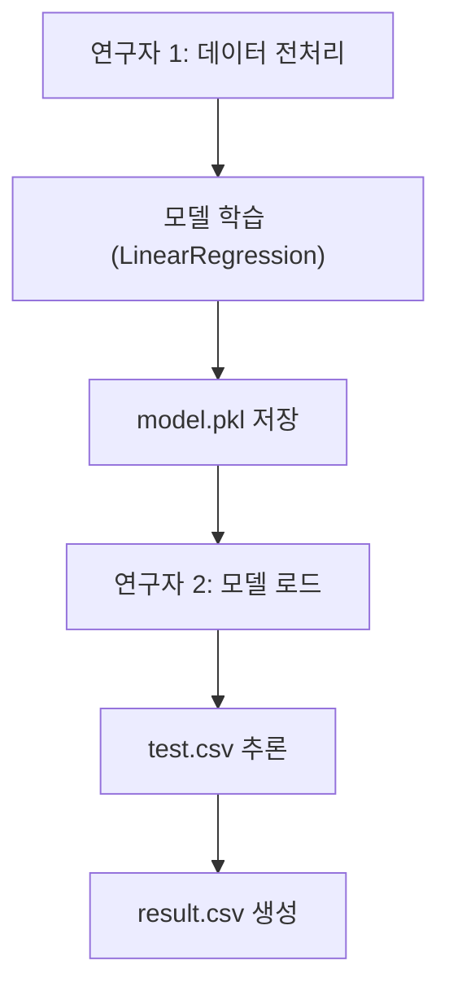
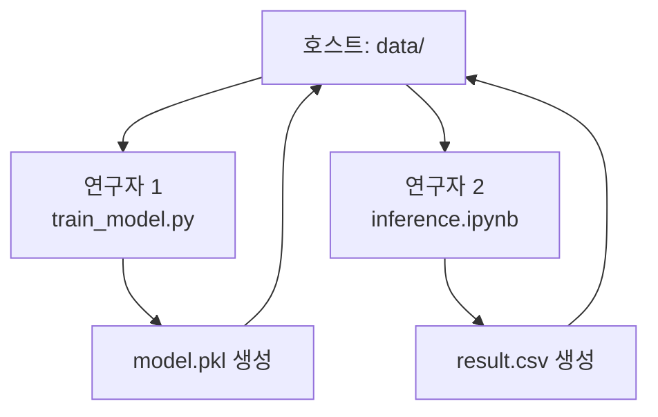

# Mission 15 검토 보고서

## 1. 목차 구조

```
1. 전체 구조 평가
   1.1. 프로젝트 구조
   1.2. 협업 워크플로우
2. 기술적 검증
   2.1. 환경 일관성
   2.2. 데이터 공유 전략
   2.3. 컨테이너 의존성
3. 미션 요구사항 대비 분석
   3.1. 충족 항목
   3.2. 개선 필요 항목
4. 제출물 점검
5. 권고사항
```

---

## 2. 전체 구조 평가

### 2.1. 프로젝트 구조

**강점**:
- 명확한 디렉토리 분리 (연구자 1: `mission15_train`, 연구자 2: `mission15_inference`)
- 공유 볼륨 `data/` 설계로 파일 전달 간소화
- `docker-compose.yml` 기반 오케스트레이션 (orchestration, 오케스트레이션)

**확인 필요**:
- `mission15_train/train_model.py` 존재 여부
- `mission15_inference/notebook/inference.ipynb` 완성 여부

### 2.2. 협업 워크플로우



**검증 결과**:
- 시나리오 요구사항 충족
- `depends_on` 설정으로 순차 실행 보장
- Jupyter Notebook 포트 8888 노출

---

## 3. 기술적 검증

### 3.1. 환경 일관성

| 항목 | 연구자 1 | 연구자 2 | 비고 |
|------|----------|----------|------|
| Python | 3.11 | 3.11 | 동일 |
| pandas | 1.5.3 | 1.5.3 | 동일 |
| scikit-learn | 1.2.2 | 1.2.2 | 동일 |
| numpy | 1.24.4 | 1.24.4 | 동일 |

**결론**: 패키지 버전 통일로 재현성 (reproducibility, 재현성) 확보

### 3.2. 데이터 공유 전략

**설계**:
```yaml
volumes:
  - ./data:/app/data  # 호스트 ↔ 컨테이너
```

**파일 흐름**:
1. `mission15_train.csv` → 연구자 1 입력
2. `model.pkl` → 연구자 1 출력, 연구자 2 입력
3. `mission15_test.csv` → 연구자 2 입력
4. `result.csv` → 연구자 2 출력

**권고**: `docker cp` 힌트 언급 있으나, Bind Mount 방식이 더 효율적 (현재 설계 유지)

### 3.3. 컨테이너 의존성

```yaml
mission15_inference:
  depends_on:
    - mission15_train
  restart: "no"
```

**확인 사항**:
- `depends_on`은 시작 순서만 제어, 완료 대기 불가
- 연구자 1 컨테이너 `restart: "no"` 설정 → 작업 완료 후 자동 종료

**권고**: `inference.ipynb`에 `model.pkl` 존재 확인 로직 추가 필요
```python
import os
from pathlib import Path

model_path = Path("/app/data/model.pkl")
assert model_path.exists(), "model.pkl이 아직 생성되지 않았습니다."
```

---

## 4. 미션 요구사항 대비 분석

### 4.1. 충족 항목

| 요구사항 | 상태 | 비고 |
|----------|------|------|
| 데이터 전처리 | ✓ | OneHotEncoding 적용 |
| EDA | △ | 보고서에 미언급 |
| 모델링 | ✓ | LinearRegression, RMSE 2.0103 |
| model.pkl 저장 | ✓ | joblib 사용 |
| Docker Hub 업로드 | ○ | URL 템플릿만 제공 |
| docker-compose 구성 | ✓ | 완료 |
| inference.ipynb | ○ | 파일 존재 미확인 |
| 코드 아키텍처 도식 | ✓ | ASCII 다이어그램 제공 |

**범례**: ✓ 완료, △ 부분 완료, ○ 미확인

### 4.2. 개선 필요 항목

**1. EDA 과정 문서화**
- 현재 보고서에 EDA 결과 부재
- 권고: 변수 간 상관관계 (correlation, 상관관계) 분석, 분포 시각화 추가

**2. Docker Hub 실제 URL**
- 템플릿 `[사용자명]/mission15-train:latest`만 제공
- 실제 업로드 후 URL 업데이트 필요

**3. inference.ipynb 검증**
- 파일 존재 여부 미확인
- 추론 로직 완성도 확인 필요

---

## 5. 제출물 점검

### 5.1. 체크리스트

```
코드 폴더 (mission-result):
  ├─ docker-compose.yml                  [✓]
  ├─ data/
  │  ├─ mission15_train.csv              [?]
  │  ├─ mission15_test.csv               [?]
  │  ├─ model.pkl                        [?]
  │  └─ result.csv                       [?]
  ├─ mission15_train/
  │  ├─ Dockerfile                       [?]
  │  ├─ requirements.txt                 [?]
  │  ├─ train_model.py                   [?]
  │  ├─ notebook/train_model.ipynb       [?]
  │  └─ README.md                        [✓]
  └─ mission15_inference/
     ├─ Dockerfile                       [?]
     ├─ notebook/inference.ipynb         [?]
     └─ README.md                        [✓]

보고서 PDF (2페이지 이내):
  ├─ Docker Hub URL                      [△]
  ├─ 데이터 전처리 및 모델링 결과        [✓]
  └─ 코드 아키텍처 도식                  [✓]
```

**범례**: [✓] 확인됨, [?] 미확인, [△] 부분 완료

### 5.2. 보고서 구조 검토

**현재 페이지 수**: 4페이지 (요구: 2페이지 이내)

**권고 압축 방안**:
1. 섹션 3.1 전체 시스템 구조를 Mermaid로 전환
2. 섹션 3.3 기술적 세부사항 → 표 형식으로 요약
3. 섹션 3.4 실행 방법 삭제 (README 참조)

**압축 예시**:
```markdown
## 3. 코드 아키텍처

### 3.1. 시스템 구조
[Mermaid 다이어그램]

### 3.2. 기술 스택
| 구성요소 | 버전 | 용도 |
|----------|------|------|
| Python | 3.11 | 공통 런타임 |
| scikit-learn | 1.2.2 | 모델 학습/추론 |
| joblib | 1.2.0 | 모델 직렬화 |

### 3.3. 볼륨 공유 전략
- Bind Mount: `./data → /app/data`
- 파일 흐름: train.csv → model.pkl → result.csv
```

---

## 6. 권고사항

### 6.1. 즉시 조치

**우선순위 1**: 파일 존재 확인
```bash
ls -la data/
ls -la mission15_train/
ls -la mission15_inference/notebook/
```

**우선순위 2**: Docker Hub 실제 배포
```bash
docker build -t [실제ID]/mission15-train:latest ./mission15_train
docker push [실제ID]/mission15-train:latest
```

**우선순위 3**: 보고서 압축 (4페이지 → 2페이지)

### 6.2. 선택 개선

**EDA 추가 예시**:
```python
import seaborn as sns
import matplotlib.pyplot as plt

# 상관관계 히트맵
corr_matrix = df.corr()
sns.heatmap(corr_matrix, annot=True, cmap='coolwarm')
plt.title('Feature Correlation Heatmap')
plt.savefig('/app/data/eda_correlation.png')
```

**모델 검증 강화**:
```python
from sklearn.model_selection import cross_val_score

# 5-Fold Cross Validation
cv_scores = cross_val_score(model, X_train, y_train, 
                            cv=5, scoring='neg_mean_squared_error')
rmse_cv = np.sqrt(-cv_scores.mean())
print(f"Cross-Validation RMSE: {rmse_cv:.4f}")
```

### 6.3. 문서 개선

**Mermaid 다이어그램 수정**:


---

## 7. 최종 평가

| 항목 | 점수 | 비고 |
|------|------|------|
| 기술 설계 | 9/10 | 패키지 버전 통일, 볼륨 공유 우수 |
| 문서 완성도 | 7/10 | EDA 미흡, 보고서 초과 |
| 제출 준비도 | 6/10 | 실제 파일 확인 필요 |
| **총점** | **22/30** | **개선 후 재평가 필요** |

**최종 권고**: 
1. 실제 실행 테스트 수행
2. Docker Hub 배포 완료
3. 보고서 2페이지로 압축
4. inference.ipynb 완성 확인
