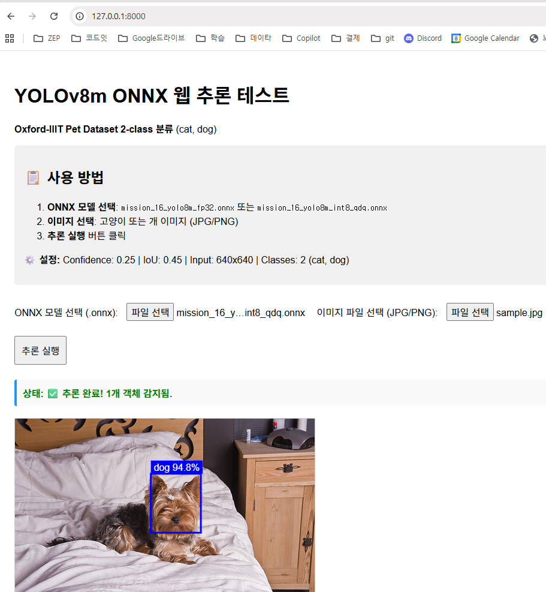

# 심화 : YOLOv8m ONNX 웹 추론 데모

## 1. 개요

Oxford-IIIT Pet Dataset (cat/dog 2-class)로 학습된 YOLOv8m 모델을 웹 브라우저에서 직접 실행하는 추론 시스템입니다.

### 1.1. 주요 기능

- **브라우저 내 추론**: ONNX Runtime Web (WASM 백엔드) 사용
- **모델 지원**: FP32, INT8-QDQ 양자화 모델
- **완전한 파이프라인**: 전처리 → 추론 → 후처리 → 시각화
- **YOLOv8 최적화**: Letterbox resize, NMS, IoU 계산

### 1.2. 기술 스택

- **모델**: YOLOv8m (Ultralytics)
- **추론 엔진**: ONNX Runtime Web 1.x
- **입력 크기**: 640×640 (RGB)
- **출력 형식**: `(1, 6, 8400)` → `[batch, features, anchors]`
  - Feature 0-3: BBox (`cx, cy, w, h`)
  - Feature 4-5: 클래스 확률 (`cat, dog`)

## 2. 실행 방법

### 2.1. 로컬 서버 시작

```powershell
# 프로젝트 루트에서 실행
cd 심화
python -m http.server 8000
```

브라우저에서 접속: `http://localhost:8000`

### 2.2. 사용 절차

1. **ONNX 모델 선택**: `model/mission_16_yolo8m_fp32.onnx` 또는 `mission_16_yolo8m_int8_qdq.onnx`
2. **이미지 선택**: 고양이/개 이미지 (JPG, PNG)
3. **추론 실행** 버튼 클릭
4. 결과 확인: BBox, 신뢰도, 클래스 레이블

## 3. 구현 세부사항

### 3.1. 전처리 (Preprocessing)

- **Letterbox Resize**: 비율 유지하며 640×640 리사이즈, 패딩 추가
- **정규화**: 픽셀 값 `0-255 → 0-1.0`
- **텐서 변환**: `HWC → NCHW` (1×3×640×640)

### 3.2. 후처리 (Postprocessing)

#### 3.2.1. YOLOv8 출력 파싱

```plaintext
Input: (1, 6, 8400) 텐서
- 8400개 앵커 포인트
- 각 앵커당 6개 값: [cx, cy, w, h, prob_cat, prob_dog]
```

#### 3.2.2. NMS (Non-Maximum Suppression)

- **신뢰도 임계값**: 0.25
- **IoU 임계값**: 0.45
- **알고리즘**: 신뢰도 기반 정렬 → IoU 계산 → 중복 제거

### 3.3. 좌표 역변환

```javascript
// 모델 출력 → 원본 이미지 좌표
scale = min(640/원본너비, 640/원본높이)
padX = (640 - 원본너비*scale) / 2
padY = (640 - 원본높이*scale) / 2

x_original = (x_model - padX) / scale
y_original = (y_model - padY) / scale
```

## 4. 파일 구조

```
심화/
├── index.html          # 메인 추론 UI
└── README.md           # 본 문서

model/
├── mission_16_yolo8m_fp32.onnx      # FP32 모델
├── mission_16_yolo8m_int8_qdq.onnx  # INT8 양자화 모델
└── mission_16_yolo8m_fp16.onnx      # FP16 모델
```

## 5. 설정 파라미터

| 파라미터 | 값 | 설명 |
|---------|-----|------|
| `INPUT_SIZE` | 640 | 모델 입력 크기 (정사각형) |
| `CONFIDENCE_THRESHOLD` | 0.25 | 최소 신뢰도 |
| `IOU_THRESHOLD` | 0.45 | NMS IoU 임계값 |
| `CLASS_LABELS` | `['cat', 'dog']` | 클래스 레이블 |
| `executionProviders` | `['wasm']` | ONNX Runtime 백엔드 |

## 6. 브라우저 호환성

- **Chrome/Edge**: 권장 (WASM 최적화)
- **Firefox**: 지원
- **Safari**: 지원 (WASM 성능 낮음)

## 7. 트러블슈팅

### 7.1. 모델 로딩 실패

- ONNX 파일 경로 확인
- 파일 크기 확인 (100MB 이하 권장)
- 브라우저 콘솔 오류 확인

### 7.2. 추론 결과 없음

- 이미지에 고양이/개 포함 여부 확인
- 신뢰도 임계값 낮추기 (0.25 → 0.1)
- 브라우저 콘솔에서 `detections` 배열 확인

### 7.3. 성능 저하

- FP32 대신 INT8 모델 사용
- 이미지 해상도 낮추기
- Chrome 브라우저 사용



<video width="640" height="480" controls>
  <source src="model/mission_16_yolo8m_test.mp4" type="video/mp4">
</video>


## 8. 라이센스

- **YOLOv8**: AGPL-3.0 (Ultralytics)
- **ONNX Runtime Web**: MIT License
- **Oxford-IIIT Pet Dataset**: Non-commercial research

