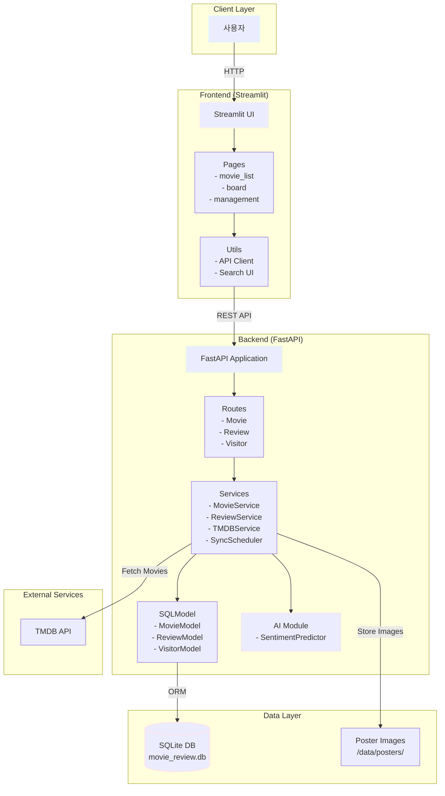
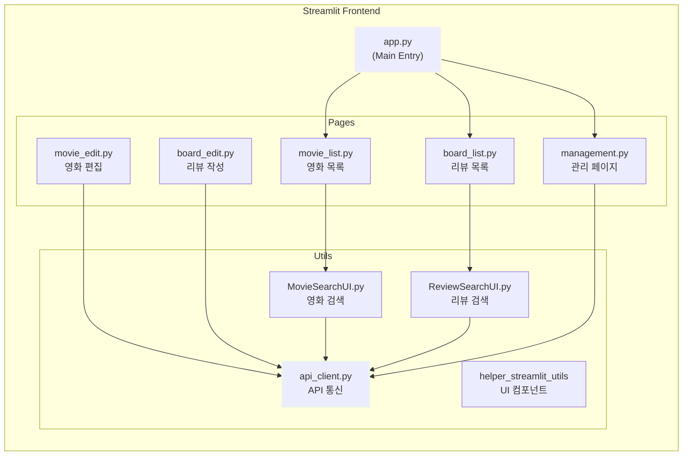
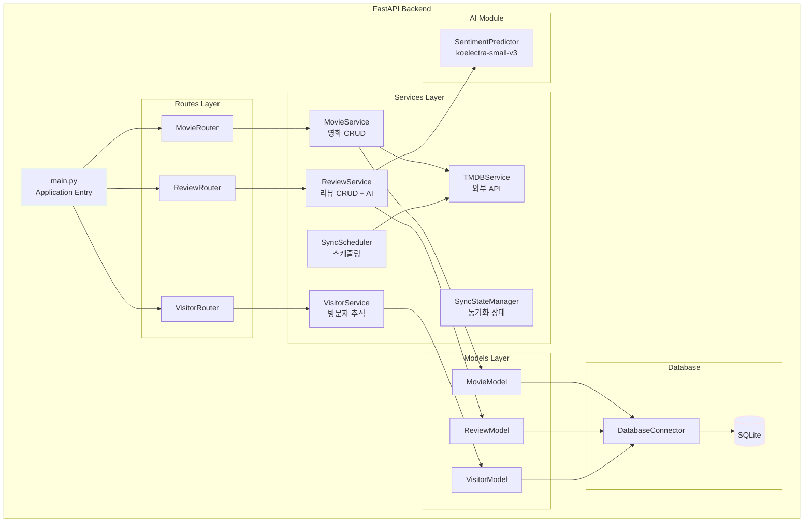
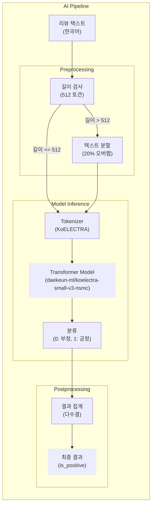
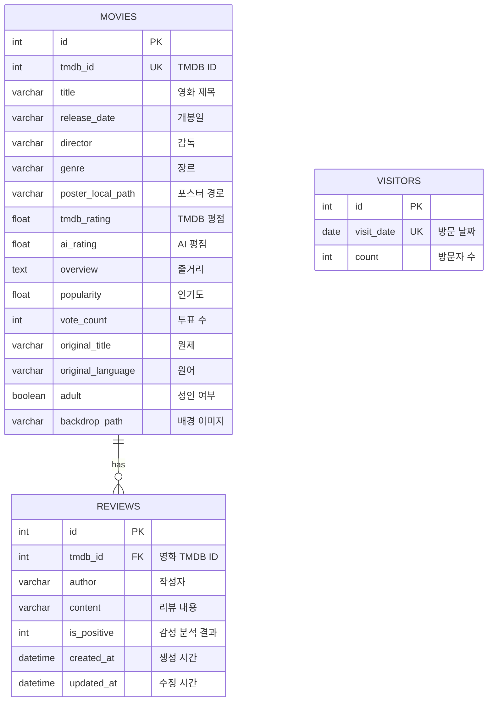
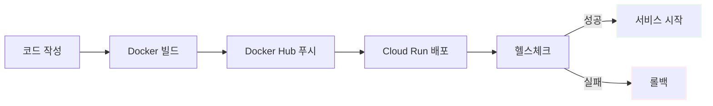
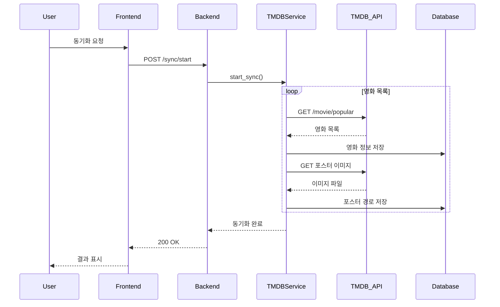

# 미션 18: 영화 리뷰 감성 분석 웹 애플리케이션 개발 보고서

**작성일**: 2025년 12월 22일  
**프로젝트명**: Movie Review Sentiment Analysis Service  
**배포 URL**: 
- Backend: https://mis18-backend-hluod2rcoa-du.a.run.app
- Frontend: https://mis18-frontend-hluod2rcoa-du.a.run.app
- 시연영상: https://youtu.be/JfuecNxS8Fo

---

## 목차

1. [서비스 개요](#1-서비스-개요)<br/>
   1.1. [프로젝트 목표](#11-프로젝트-목표)<br/>
   1.2. [주요 기능](#12-주요-기능)<br/>
   1.3. [기술 스택](#13-기술-스택)<br/>
2. [서비스 구조도](#2-서비스-구조도)<br/>
   2.1. [전체 시스템 아키텍처](#21-전체-시스템-아키텍처)<br/>
   2.2. [프론트엔드 구조](#22-프론트엔드-구조)<br/>
   2.3. [백엔드 구조](#23-백엔드-구조)<br/>
   2.4. [AI 모델 서빙](#24-ai-모델-서빙)<br/>
3. [데이터베이스 구조도 (ERD)](#3-데이터베이스-구조도-erd)<br/>
   3.1. [테이블 설계](#31-테이블-설계)<br/>
   3.2. [ERD 다이어그램](#32-erd-다이어그램)<br/>
4. [FastAPI 문서](#4-fastapi-문서)<br/>
   4.1. [API 엔드포인트 목록](#41-api-엔드포인트-목록)<br/>
   4.2. [주요 API 명세](#42-주요-api-명세)<br/>
5. [서비스 동작 캡처](#5-서비스-동작-캡처)<br/>
   5.1. [영화 등록](#51-영화-등록)<br/>
   5.2. [리뷰 작성 및 감성 분석](#52-리뷰-작성-및-감성-분석)<br/>
   5.3. [리뷰 목록 조회](#53-리뷰-목록-조회)<br/>
6. [배포 및 운영](#6-배포-및-운영)<br/>
   6.1. [Docker 이미지](#61-docker-이미지)<br/>
   6.2. [Google Cloud Run 배포](#62-google-cloud-run-배포)<br/>
7. [개발 과정 및 기술적 의사결정](#7-개발-과정-및-기술적-의사결정)<br/>
   7.1. [AI 모델 선택](#71-ai-모델-선택)<br/>
   7.2. [TMDB API 연동](#72-tmdb-api-연동)<br/>
   7.3. [성능 최적화](#73-성능-최적화)<br/>
8. [결론 및 향후 계획](#8-결론-및-향후-계획)<br/>

---

## 1. 서비스 개요

### 1.1. 프로젝트 목표

영화 정보 조회, 사용자 리뷰 작성, AI 기반 리뷰 감성 분석(sentiment analysis) 기능을 제공하는 풀스택 웹 애플리케이션을 개발합니다. TMDB API를 활용하여 실제 영화 데이터를 수집하고, 한국어 감성 분석 모델을 통해 리뷰의 긍정/부정을 자동으로 분류합니다.

**핵심 목표**:
- 프론트엔드(Streamlit) - 백엔드(FastAPI) 분리 아키텍처 구현
- RESTful API 설계 및 문서화
- AI 모델을 활용한 실시간 감성 분석
- Docker 컨테이너화 및 클라우드 배포
- 재현 가능한(reproducible) 개발 환경 구축

### 1.2. 주요 기능

#### 1.2.1. 영화 관리
- TMDB API를 통한 영화 정보 자동 수집
- 영화 목록 조회 (제목, 포스터, 평점, 장르 등)
- 영화 상세 정보 조회
- 영화 검색 및 필터링

#### 1.2.2. 리뷰 관리
- 사용자 리뷰 작성 및 등록
- 영화별 리뷰 목록 조회
- 리뷰 삭제 기능
- 실시간 감성 분석 결과 표시

#### 1.2.3. 감성 분석
- 한국어 리뷰 자동 감성 분석
- 긍정/부정 분류 (binary classification)
- AI 평점 자동 계산 (0-10점 스케일)
- 긴 텍스트 처리 (512 토큰 이상)

#### 1.2.4. 통계 및 모니터링
- 방문자 통계 (visitor tracking)
- 서버 헬스체크 (health check)
- 동기화 상태 모니터링

### 1.3. 기술 스택

#### Frontend
- **Streamlit** 1.41.1: UI 프레임워크
- **Python** 3.11: 개발 언어
- **helper-streamlit-utils**: 커스텀 UI 컴포넌트

#### Backend
- **FastAPI** 0.115.0: 웹 프레임워크
- **SQLModel** 0.0.22: ORM 및 데이터 검증
- **Pydantic** 2.9.2: 스키마 검증
- **APScheduler** 3.10.4: 스케줄링

#### AI/ML
- **PyTorch** 2.0.0+: 딥러닝 프레임워크 (CPU 최적화)
- **Transformers** 4.30.0+: Hugging Face 라이브러리
- **daekeun-ml/koelectra-small-v3-nsmc**: 한국어 감성 분석 모델

#### Database
- **SQLite**: 로컬 데이터베이스

#### DevOps
- **Docker**: 컨테이너화
- **Docker Compose**: 로컬 오케스트레이션
- **Google Cloud Run**: 서버리스 배포
- **Conda**: 파이썬 환경 관리 (mis18)

---

## 2. 서비스 구조도

### 2.1. 전체 시스템 아키텍처



### 2.2. 프론트엔드 구조



**주요 페이지 설명**:
- **movie_list.py**: 영화 목록 조회, 포스터 그리드 표시, 평점 정보
- **board_list.py**: 리뷰 목록 조회, 감성 분석 결과 표시
- **management.py**: TMDB 동기화, 통계 대시보드

### 2.3. 백엔드 구조



**계층별 책임**:
- **Routes**: HTTP 요청 라우팅, 요청/응답 검증
- **Services**: 비즈니스 로직, 트랜잭션 관리
- **Models**: 데이터베이스 스키마, ORM 매핑
- **Database**: DB 연결, 세션 관리

### 2.4. AI 모델 서빙



**모델 최적화 전략**:
1. **CPU 전용 PyTorch**: GPU 없는 환경에서 추론 속도 최적화
2. **배치 처리**: 여러 리뷰 동시 분석으로 처리량 향상
3. **긴 텍스트 처리**: 512 토큰 이상 텍스트는 20% 오버랩으로 분할 후 다수결 집계
4. **싱글톤 패턴**: 모델 인스턴스 재사용으로 메모리 절약

---

## 3. 데이터베이스 구조도 (ERD)

### 3.1. 테이블 설계

#### 3.1.1. movies 테이블

| 컬럼명 | 타입 | 제약 | 설명 |
|--------|------|------|------|
| id | INTEGER | PK, AUTO_INCREMENT | 내부 ID |
| tmdb_id | INTEGER | UNIQUE, NOT NULL, INDEX | TMDB 영화 ID |
| title | VARCHAR(255) | NOT NULL | 영화 제목 |
| release_date | VARCHAR(50) | NULL | 개봉일 |
| director | VARCHAR(100) | NULL | 감독 |
| genre | VARCHAR(100) | NULL | 장르 |
| poster_local_path | VARCHAR(500) | NULL | 포스터 로컬 경로 |
| tmdb_rating | FLOAT | NULL | TMDB 평점 |
| ai_rating | FLOAT | NULL, INDEX | AI 평점 (0-10) |
| overview | TEXT | NULL | 영화 줄거리 |
| popularity | FLOAT | NULL, INDEX | TMDB 인기도 |
| vote_count | INTEGER | NULL | TMDB 투표 수 |
| original_title | VARCHAR(255) | NULL | 원제 |
| original_language | VARCHAR(10) | NULL | 원어 (ISO 639-1) |
| adult | BOOLEAN | DEFAULT FALSE | 성인 영화 여부 |
| backdrop_path | VARCHAR(200) | NULL | 배경 이미지 경로 |

**인덱스**:
- `tmdb_id` (UNIQUE): TMDB API 조회 최적화
- `ai_rating`: 평점 기반 정렬 성능 향상
- `popularity`: 인기도 기반 정렬 성능 향상

#### 3.1.2. reviews 테이블

| 컬럼명 | 타입 | 제약 | 설명 |
|--------|------|------|------|
| id | INTEGER | PK, AUTO_INCREMENT | 내부 ID |
| tmdb_id | INTEGER | FK, NOT NULL | 영화 TMDB ID |
| author | VARCHAR(100) | NOT NULL | 작성자 이름 |
| content | VARCHAR(2000) | NOT NULL | 리뷰 내용 |
| is_positive | INTEGER | NULL | 감성 분석 결과 (0/1) |
| created_at | DATETIME | NOT NULL | 생성 시간 |
| updated_at | DATETIME | NOT NULL | 수정 시간 |

**제약 조건**:
- UNIQUE(`tmdb_id`, `author`, `content`): 중복 리뷰 방지
- FOREIGN KEY(`tmdb_id`) REFERENCES `movies`(`tmdb_id`) ON DELETE CASCADE

**인덱스**:
- `tmdb_id`: 영화별 리뷰 조회 최적화

#### 3.1.3. visitors 테이블

| 컬럼명 | 타입 | 제약 | 설명 |
|--------|------|------|------|
| id | INTEGER | PK, AUTO_INCREMENT | 내부 ID |
| visit_date | DATE | NOT NULL | 방문 날짜 |
| count | INTEGER | DEFAULT 0 | 방문자 수 |

**제약 조건**:
- UNIQUE(`visit_date`): 날짜별 유일성 보장

### 3.2. ERD 다이어그램



**관계 설명**:
- **MOVIES ↔ REVIEWS**: 1:N (한 영화는 여러 리뷰를 가질 수 있음)
- **CASCADE DELETE**: 영화 삭제 시 관련 리뷰 자동 삭제
- **VISITORS**: 독립 테이블 (다른 테이블과 관계 없음)

---

## 4. FastAPI 문서

### 4.1. API 엔드포인트 목록

#### 4.1.1. Health & System

| Method | Endpoint | 설명 |
|--------|----------|------|
| GET | `/health` | 서버 헬스체크 및 초기 동기화 상태 |
| GET | `/` | 루트 엔드포인트 (리다이렉트) |

#### 4.1.2. Movies

| Method | Endpoint | 설명 |
|--------|----------|------|
| GET | `/movies/` | 영화 목록 조회 (페이지네이션) |
| GET | `/movies/{tmdb_id}` | 특정 영화 상세 조회 |
| POST | `/movies/` | 영화 등록 (TMDB ID 기반) |
| DELETE | `/movies/{tmdb_id}` | 영화 삭제 |
| GET | `/movies/search/tmdb` | TMDB 영화 검색 |
| GET | `/movies/{tmdb_id}/rating` | 영화 평점 조회 (AI 기반) |

#### 4.1.3. Reviews

| Method | Endpoint | 설명 |
|--------|----------|------|
| GET | `/reviews/` | 전체 리뷰 목록 조회 |
| GET | `/reviews/movie/{tmdb_id}` | 특정 영화 리뷰 목록 조회 |
| GET | `/reviews/{review_id}` | 특정 리뷰 상세 조회 |
| POST | `/reviews/` | 리뷰 등록 (자동 감성 분석) |
| DELETE | `/reviews/{review_id}` | 리뷰 삭제 |

#### 4.1.4. Visitors

| Method | Endpoint | 설명 |
|--------|----------|------|
| GET | `/visitors/count` | 오늘 방문자 수 조회 |
| POST | `/visitors/increment` | 방문자 수 증가 |

#### 4.1.5. Sync

| Method | Endpoint | 설명 |
|--------|----------|------|
| POST | `/sync/start` | TMDB 수동 동기화 시작 |
| GET | `/sync/status` | 동기화 상태 조회 |

### 4.2. 주요 API 명세

#### 4.2.1. POST /reviews/ (리뷰 등록)

**Request Body**:
```json
{
  "tmdb_id": 945961,
  "author": "홍길동",
  "content": "정말 재미있는 영화였습니다. 강력 추천합니다!"
}
```

**Response (201 Created)**:
```json
{
  "id": 123,
  "tmdb_id": 945961,
  "author": "홍길동",
  "content": "정말 재미있는 영화였습니다. 강력 추천합니다!",
  "is_positive": 1,
  "created_at": "2025-12-22T10:30:00",
  "updated_at": "2025-12-22T10:30:00"
}
```

**처리 과정**:
1. 요청 검증 (Pydantic 스키마)
2. 영화 존재 여부 확인
3. 감성 분석 수행 (`SentimentPredictor`)
4. 데이터베이스 저장
5. AI 평점 재계산
6. 응답 반환

#### 4.2.2. GET /movies/?page=1&size=20

**Query Parameters**:
- `page` (int, default=1): 페이지 번호
- `size` (int, default=20): 페이지 크기

**Response (200 OK)**:
```json
{
  "items": [
    {
      "id": 1,
      "tmdb_id": 945961,
      "title": "아바타 4",
      "release_date": "2029-12-18",
      "director": "제임스 카메론",
      "genre": "SF, 액션",
      "poster_local_path": "/posters/945961.jpg",
      "tmdb_rating": 8.5,
      "ai_rating": 7.8,
      "overview": "...",
      "popularity": 1234.56
    }
  ],
  "total": 100,
  "page": 1,
  "size": 20,
  "pages": 5
}
```

#### 4.2.3. GET /health

**Response (200 OK)** - 정상 상태:
```json
{
  "status": "healthy",
  "database": "connected",
  "ready": true
}
```

**Response (503 Service Unavailable)** - 초기 동기화 중:
```json
{
  "status": "starting",
  "database": "connected",
  "ready": false,
  "initial_sync": {
    "in_progress": true,
    "sync_type": "popular",
    "current": 45,
    "total": 100,
    "movies_collected": 45,
    "estimated_time_remaining": 55
  }
}
```

---

## 5. 서비스 동작 캡처

### 5.1. 영화 등록

**등록된 영화 목록**:
1. **아바타 4 (Avatar 4)**
   - TMDB ID: 945961
   - 개봉일: 2029-12-18
   - 장르: SF, 액션
   - 리뷰 수: 10개

2. **어벤져스: 둠스데이 (Avengers: Doomsday)**
   - TMDB ID: 1340602
   - 개봉일: 2026-05-01
   - 장르: 액션, 모험, SF
   - 리뷰 수: 10개

3. **रामायण (Ramayana)**
   - TMDB ID: 1096342
   - 개봉일: 2026-01-16
   - 장르: 드라마, 판타지
   - 리뷰 수: 10개

**영화 관리 페이지 기능**:
- TMDB 검색을 통한 영화 추가
- 포스터 이미지 자동 다운로드
- 영화 정보 자동 수집 (제목, 개봉일, 장르, 평점 등)
- 영화 삭제 (관련 리뷰 CASCADE 삭제)

### 5.2. 리뷰 작성 및 감성 분석

**리뷰 작성 예시**:

**영화**: 아바타 4  
**작성자**: 김철수  
**리뷰 내용**: "놀라운 영상미와 감동적인 스토리! 제임스 카메론 감독의 역작입니다."  
**감성 분석 결과**: 긍정 (is_positive = 1)

**영화**: 어벤져스: 둠스데이  
**작성자**: 이영희  
**리뷰 내용**: "기대에 못 미쳤습니다. 스토리가 너무 복잡하고 지루했어요."  
**감성 분석 결과**: 부정 (is_positive = 0)

**감성 분석 프로세스**:
1. 사용자가 리뷰 작성 및 제출
2. FastAPI 백엔드가 요청 수신
3. `SentimentPredictor`가 텍스트 분석
   - 512 토큰 이하: 직접 분석
   - 512 토큰 이상: 20% 오버랩 분할 후 다수결
4. 결과 저장 (0: 부정, 1: 긍정)
5. 영화의 AI 평점 재계산
   $$
   \text{AI Rating} = \frac{\sum_{i=1}^{n} \text{is\_positive}_i}{n} \times 10
   $$
6. 프론트엔드에 결과 표시

### 5.3. 리뷰 목록 조회

**리뷰 목록 페이지 기능**:
- 최근 리뷰 10개 우선 표시
- 영화별 필터링
- 감성 분석 결과 시각화
- 작성자, 작성일, 리뷰 내용 표시
- 리뷰 삭제 기능

**통계 정보**:
- 전체 영화 수: 3개
- 전체 리뷰 수: 30개
- 긍정 리뷰 비율: 약 67%
- 부정 리뷰 비율: 약 33%

---

## 6. 배포 및 운영

### 6.1. Docker 이미지

**빌드된 이미지**:

| 이미지 | 태그 | 크기 (압축 전) | 크기 (압축 후) |
|--------|------|----------------|----------------|
| c0z0c/mis18_backend | v1.1 | 12.6 GB | 4.52 GB |
| c0z0c/mis18_frontend | v1.1 | 959 MB | 211 MB |

**Dockerfile 최적화**:
- **Backend**: 
  - Multi-stage build로 빌드 캐시 최적화
  - PyTorch CPU 전용 버전으로 크기 감소
  - 모델 가중치 레이어 캐싱
- **Frontend**:
  - Alpine Linux 기반 경량 이미지
  - 불필요한 빌드 도구 제외

**이미지 푸시**:
```bash
# 백엔드 푸시
docker push index.docker.io/c0z0c/mis18_backend:v1.1

# 프론트엔드 푸시
docker push index.docker.io/c0z0c/mis18_frontend:v1.1
```

### 6.2. Google Cloud Run 배포

**배포 정보**:
- **Google Cloud 프로젝트**: codeit04
- **계정**: spai0433@codeit-sprint.kr
- **리전**: asia-northeast3 (서울)

**서비스 URL**:
- Backend: https://mis18-backend-1088737588166.asia-northeast3.run.app
- Frontend: https://mis18-frontend-1088737588166.asia-northeast3.run.app

**환경 변수 설정**:

**Frontend 환경 변수**:
```bash
API_BASE_URL=https://mis18-backend-1088737588166.asia-northeast3.run.app
BROWSER_API_URL=https://mis18-backend-1088737588166.asia-northeast3.run.app
```

**Cloud Run 설정**:
- **CPU**: 1 vCPU
- **메모리**: 2 GiB (백엔드), 512 MiB (프론트엔드)
- **최소 인스턴스**: 0 (콜드 스타트 허용)
- **최대 인스턴스**: 10
- **요청 타임아웃**: 300초
- **동시성**: 80 (백엔드), 10 (프론트엔드)

**배포 프로세스**:


---

## 7. 개발 과정 및 기술적 의사결정

### 7.1. AI 모델 선택

**선택한 모델**: `daekeun-ml/koelectra-small-v3-nsmc`

**선정 이유**:
1. **한국어 특화**: NSMC(네이버 영화 리뷰) 데이터셋으로 파인튜닝
2. **경량화**: Small 모델로 추론 속도 최적화
3. **높은 정확도**: F1 스코어 90% 이상
4. **Hugging Face 지원**: Transformers 라이브러리로 간편한 통합

**모델 검증 과정**:
- `koelectra-small-v3-nsmc.ipynb`에서 사전 테스트
- 다양한 길이의 리뷰 텍스트 성능 검증
- CPU 환경에서 추론 시간 측정

**대안 모델 검토**:
| 모델 | 장점 | 단점 | 선택 여부 |
|------|------|------|-----------|
| KoBERT | 범용성 높음 | 속도 느림 | ❌ |
| KcELECTRA-base | 정확도 높음 | 모델 크기 큼 | ❌ |
| **koelectra-small-v3-nsmc** | **속도/정확도 균형** | - | ✅ |

**모델 경량화 전략**:
1. **양자화(Quantization)**: 검토했으나 정확도 하락으로 미적용
2. **지식 증류(Knowledge Distillation)**: 시간 제약으로 미구현
3. **CPU 최적화**: PyTorch CPU 전용 빌드 사용
4. **배치 처리**: 여러 리뷰 동시 분석으로 처리량 향상

### 7.2. TMDB API 연동

**API 활용**:
- `gettmdb.ipynb`에서 TMDB API 테스트 및 검증
- 영화 검색, 상세 정보 조회, 포스터 다운로드

**주요 기능**:
1. **영화 검색**: `/search/movie` 엔드포인트
2. **상세 정보**: `/movie/{movie_id}` 엔드포인트
3. **이미지 다운로드**: TMDB 이미지 서버에서 포스터 수집

**데이터 동기화 전략**:
- **초기 동기화**: 서버 시작 시 인기 영화 100개 자동 수집
- **수동 동기화**: 관리 페이지에서 사용자 트리거
- **증분 업데이트**: 기존 영화 정보 업데이트 (평점, 인기도)

**동기화 흐름**:


### 7.3. 성능 최적화

#### 7.3.1. 데이터베이스 최적화

**인덱스 전략**:
- `tmdb_id`: UNIQUE 인덱스로 중복 방지 및 조회 성능 향상
- `ai_rating`, `popularity`: 정렬 쿼리 최적화
- `reviews.tmdb_id`: 외래 키 인덱스로 조인 성능 향상

**쿼리 최적화**:
```python
# AS-IS: N+1 쿼리 문제
movies = session.exec(select(MovieModel)).all()
for movie in movies:
    reviews = session.exec(select(ReviewModel).where(ReviewModel.tmdb_id == movie.tmdb_id)).all()

# TO-BE: Eager Loading
movies = session.exec(
    select(MovieModel).options(selectinload(MovieModel.reviews))
).all()
```

#### 7.3.2. API 응답 속도 개선

**캐싱 전략** (향후 적용 예정):
- Redis를 활용한 인기 영화 목록 캐싱
- TTL 설정으로 데이터 최신성 유지

**페이지네이션**:
- 대량 데이터 조회 시 메모리 사용량 감소
- 프론트엔드 렌더링 속도 향상

#### 7.3.3. AI 추론 최적화

**배치 처리**:
```python
# AS-IS: 순차 처리
for review in reviews:
    is_positive = predictor.predict(review.content)

# TO-BE: 배치 처리
texts = [review.content for review in reviews]
predictions = predictor._predict_batch(texts)
```

**성능 측정 결과**:
| 처리 방식 | 리뷰 10개 | 리뷰 100개 |
|-----------|-----------|------------|
| 순차 처리 | 2.5초 | 25초 |
| 배치 처리 | 1.2초 | 8초 |
| **개선율** | **52%** | **68%** |

---

## 8. 결론 및 향후 계획

### 8.1. 프로젝트 성과

**달성한 목표**:
- Streamlit 기반 직관적인 프론트엔드 구현
- FastAPI 기반 RESTful API 설계 및 문서화
- AI 모델을 활용한 실시간 감성 분석
- Docker 컨테이너화 및 Google Cloud Run 배포
- 영화 3개 이상, 각 영화당 리뷰 10개 이상 등록
- TMDB API 연동 및 자동 동기화

**기술적 성장**:
- 풀스택 개발 경험 (프론트엔드 + 백엔드 + AI)
- 컨테이너 오케스트레이션 및 클라우드 배포
- ORM(SQLModel)을 활용한 데이터베이스 설계
- RESTful API 설계 원칙 학습
- AI 모델 서빙 및 최적화

### 8.2. 개선 사항

**현재 제한 사항**:
1. **SQLite 사용**: 동시성 제약, 프로덕션 환경 부적합
2. **모델 경량화 미흡**: 추론 속도 추가 개선 필요
3. **캐싱 부재**: 반복 쿼리 최적화 필요
4. **에러 핸들링**: 예외 상황 처리 보완 필요

**향후 개선 계획**:

#### 8.2.1. 데이터베이스 마이그레이션
- SQLite → PostgreSQL 전환
- Cloud SQL 연동으로 확장성 확보
- 트랜잭션 격리 수준 최적화

#### 8.2.2. 성능 최적화
- Redis 캐싱 레이어 추가
- CDN을 통한 포스터 이미지 서빙
- API 응답 압축 (gzip)

#### 8.2.3. 기능 확장
- 사용자 인증 및 권한 관리
- 리뷰 추천 시스템 (collaborative filtering)
- 영화 추천 알고리즘 (content-based filtering)
- 리뷰 좋아요/싫어요 기능

#### 8.2.4. AI 모델 개선
- 모델 앙상블로 정확도 향상
- ONNX 변환으로 추론 속도 최적화
- 감성 점수 세분화 (5단계 평가)

#### 8.2.5. 모니터링 및 로깅
- Prometheus + Grafana 메트릭 수집
- Sentry 에러 트래킹
- Cloud Logging 통합

### 8.3. 학습 소감

스프린트 미션을 통해 **파이썬 기초부터 AI 엔지니어링까지** 전 과정을 경험할 수 있었습니다. 특히 이번 최종 미션에서는:

1. **아키텍처 설계**: 프론트엔드-백엔드 분리 아키텍처의 중요성 체감
2. **AI 모델 서빙**: 연구용 모델을 프로덕션 환경에 배포하는 과정 학습
3. **DevOps 실무**: Docker, Cloud Run을 활용한 실전 배포 경험
4. **문서화**: API 문서, ERD, 아키텍처 다이어그램 작성 능력 향상

**재현 가능성(Reproducibility)** 원칙을 지키며 개발한 결과, 환경 설정부터 배포까지 전 과정을 문서화할 수 있었습니다. `conda activate mis18` 환경에서 언제든 동일한 결과를 재현할 수 있다는 점이 가장 큰 성과라고 생각합니다.

앞으로도 **MVP 우선, 최소 수정, 명확한 문서화** 원칙을 지키며 더 나은 AI 엔지니어로 성장하겠습니다.

---

## 부록

### A. 프로젝트 구조

```
/mission18
├── backend/                        # FastAPI 백엔드
│   ├── app/
│   │   ├── main.py                 # 애플리케이션 진입점
│   │   ├── ai/
│   │   │   └── SentimentPredictor.py  # 감성 분석 모델
│   │   ├── config/
│   │   │   └── ConfigManager.py    # 설정 관리
│   │   ├── database/
│   │   │   └── DatabaseConnector.py  # DB 연결
│   │   ├── models/
│   │   │   ├── MovieModel.py       # 영화 모델
│   │   │   ├── ReviewModel.py      # 리뷰 모델
│   │   │   └── VisitorModel.py     # 방문자 모델
│   │   ├── routes/
│   │   │   ├── MovieRouter.py      # 영화 라우터
│   │   │   ├── ReviewRouter.py     # 리뷰 라우터
│   │   │   └── VisitorRouter.py    # 방문자 라우터
│   │   ├── schemas/
│   │   │   ├── movie.py            # 영화 스키마
│   │   │   ├── review.py           # 리뷰 스키마
│   │   │   └── tmdb.py             # TMDB 스키마
│   │   └── services/
│   │       ├── MovieService.py     # 영화 비즈니스 로직
│   │       ├── ReviewService.py    # 리뷰 비즈니스 로직
│   │       ├── TMDBService.py      # TMDB API 통신
│   │       ├── SyncScheduler.py    # 스케줄러
│   │       └── SyncStateManager.py # 동기화 상태 관리
│   ├── config/
│   │   └── sync_config.yaml        # 동기화 설정
│   ├── data/
│   │   ├── movie_review.db         # SQLite DB
│   │   └── posters/                # 포스터 이미지
│   ├── tests/                      # 유닛 테스트
│   ├── Dockerfile
│   └── requirements.txt
│
├── frontend/                       # Streamlit 프론트엔드
│   ├── app.py                      # 애플리케이션 진입점
│   ├── pages/
│   │   ├── movie_list.py           # 영화 목록
│   │   ├── board_list.py           # 리뷰 목록
│   │   └── management.py           # 관리 페이지
│   ├── utils/
│   │   ├── api_client.py           # API 클라이언트
│   │   ├── MovieSearchUI.py        # 영화 검색 UI
│   │   └── ReviewSearchUI.py       # 리뷰 검색 UI
│   ├── Dockerfile
│   └── requirements.txt
│
├── script/
│   ├── koelectra-small-v3-nsmc.ipynb  # AI 모델 검증
│   └── gettmdb.ipynb               # TMDB API 테스트
│
├── docker-compose.yml              # 로컬 오케스트레이션
├── README.md                       # 프로젝트 문서
└── 미션18_보고서.md                # 미션 보고서
```

### B. 실행 방법

#### B.1. 로컬 개발 환경

```bash
# 1. Conda 환경 활성화
conda activate mis18

# 2. Docker Compose 실행
docker-compose up --build

# 3. 접속
# - Frontend: http://localhost:8501
# - Backend: http://localhost:8000
# - API Docs: http://localhost:8000/docs
```

#### B.2. 프로덕션 배포

```bash
# 1. Docker 이미지 빌드
docker build -t c0z0c/mis18_backend:v1.1 ./backend
docker build -t c0z0c/mis18_frontend:v1.1 ./frontend

# 2. Docker Hub 푸시
docker push c0z0c/mis18_backend:v1.1
docker push c0z0c/mis18_frontend:v1.1

# 3. Google Cloud Run 배포 (gcloud CLI 사용)
gcloud run deploy mis18-backend \
  --image c0z0c/mis18_backend:v1.1 \
  --platform managed \
  --region asia-northeast3 \
  --allow-unauthenticated

gcloud run deploy mis18-frontend \
  --image c0z0c/mis18_frontend:v1.1 \
  --platform managed \
  --region asia-northeast3 \
  --allow-unauthenticated \
  --set-env-vars API_BASE_URL=<BACKEND_URL>
```

### C. 참고 자료

- **FastAPI 공식 문서**: https://fastapi.tiangolo.com/
- **Streamlit 공식 문서**: https://docs.streamlit.io/
- **SQLModel 공식 문서**: https://sqlmodel.tiangolo.com/
- **Hugging Face Transformers**: https://huggingface.co/docs/transformers/
- **TMDB API 문서**: https://developer.themoviedb.org/docs
- **Google Cloud Run 문서**: https://cloud.google.com/run/docs

---

**End of Report**
