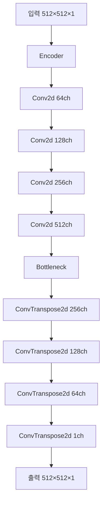
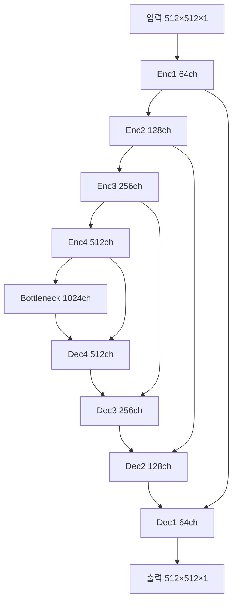
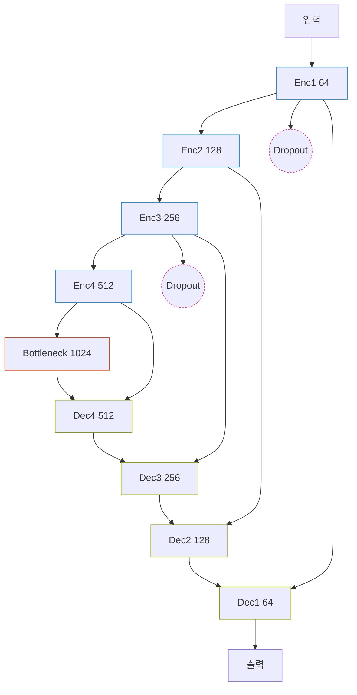
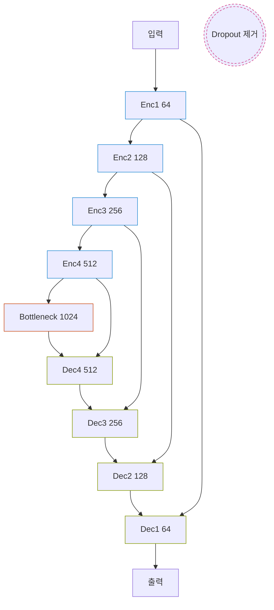
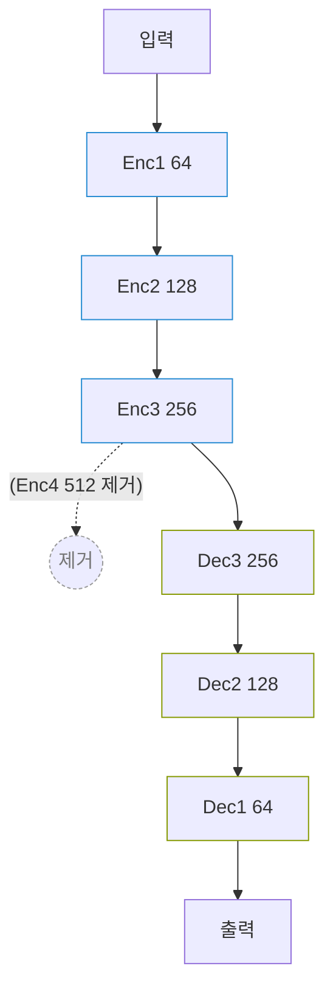
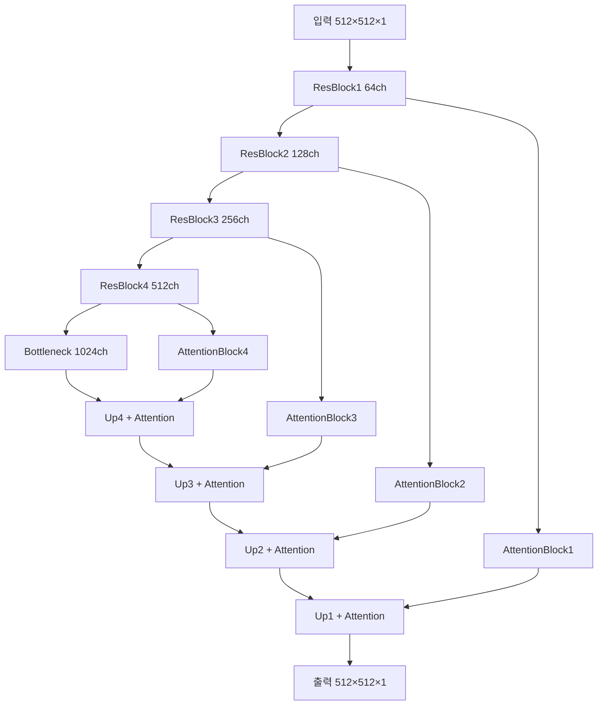

# 스프린트미션5 4팀_김명환 - 문서 노이즈 제거 딥러닝 모델 개발 보고서

## 📋 목차
1. [프로젝트 개요](#1-프로젝트-개요)<br/>
2. [데이터셋 분석](#2-데이터셋-분석)<br/>
3. [데이터 전처리 및 증강](#3-데이터-전처리-및-증강)<br/>
4. [모델 아키텍처](#4-모델-아키텍처)<br/>
5. [손실 함수 설계](#5-손실-함수-설계)<br/>
6. [실험 설계 및 결과](#6-실험-설계-및-결과)<br/>
7. [결론 및 향후 과제](#7-결론-및-향후-과제)<br/>

---

## 1. 프로젝트 개요

### 1.1 미션 목표
손상된 문서 이미지에서 노이즈를 제거하여 원본 문서를 최대한 복원하는 **딥러닝 모델**을 구현하고 성능을 비교 분석합니다.

> 참고: 본 문서는 실험 코드와 수치(Log) 기반으로 서술하며, 시각적 비교 이미지는 추후 수동으로 추가 예정입니다 (이미지 분석/프리미엄 데이터 사용 불필요).

### 1.2 평가 지표

| 지표   | 목적           | 값 해석         | 특징                         |
|--------|----------------|------------------|------------------------------|
| Loss   | 학습 최적화    | 작을수록 좋음    | 학습 중 사용                 |
| RMSE   | 예측 정확도    | 작을수록 좋음    | 직관적, 픽셀 단위            |
| PSNR   | 품질 평가      | 클수록 좋음      | 시각적 품질에 가까운 평가 기준 |

### 1.3 PSNR 해석 기준

| PSNR 값               | 품질 수준                    |
|--------------------|------------------------------|
| 30dB 이상          | 꽤 좋은 품질                 |
| 35dB 이상          | 우수한 품질                  |
| 40dB 이상          | 매우 우수한 품질             |

---

## 2. 데이터셋 분석

### 2.1 데이터 소스

   - **출처**: [Kaggle - Denoising Dirty Documents](https://www.kaggle.com/competitions/denoising-dirty-documents/overview)
   - **형식**: PNG 이미지 파일
   - **구성**: 
     - `train`: 손상된 문서 (144개)
     - `train_cleaned`: 깨끗한 원본 문서 (144개)
     - `test`: 테스트용 손상된 문서 (72개)

### 2.2 데이터 특성
  - **문서 유형**: 텍스트, 그래픽 포함 문서
  - **노이즈 유형**: 얼룩, 블러, 압축 아티팩트, 스캔 노이즈
  - **이미지 크기**: 다양한 크기 (평균 540×420)
  - **채널**: 그레이스케일 (1채널)
  - **픽셀 분포**: 이진화 특성으로 0과 255에 집중된 쌍봉 분포

---

## 3. 데이터 전처리 및 증강

### 3.1 기본 전처리
```python
# 크기 정규화 및 패딩
ResizeAndPadToSquare(target_size=512)  # 512×512로 통일
Grayscale(num_output_channels=1)       # 그레이스케일 변환
ToDtype(torch.float32, scale=True)     # [0,1] 정규화
```

### 3.2 데이터 증강 기법

#### 3.2.1 증강 기법 설계
   - **RandomBlur**: 가우시안 블러 (스캔 품질 저하 시뮬레이션)
   - **RandomJPEGCompression**: JPEG 압축 노이즈 (quality=1-3)
   - **RandomStain**: 원형 얼룩 (커피, 물 얼룩 등)
   - **PhotoshopDegradation**: 강한 압축 + 블록 노이즈
   - **OnlyRotate**: 문서 회전 (-5°~5°)

#### 3.2.2 증강 효과
   - **원본 데이터**: 144개
   - **증강 후**: 864개 (약 6배 증가)  
       (※ `create_expanded_train_dataset*` 함수 선택 및 개별 증강 활성화 여부에 따라 6~7배 범위 변동 가능)
   - **검증 데이터**: 원본 비율 유지 (약 14~15개)

---

## 4. 모델 아키텍처

### 4.1 실험 모델들

#### 4.1.1 기본 오토인코더 (model_base)


**특징**: 단순한 인코더-디코더 구조, BatchNorm + ReLU

#### 4.1.2 U-Net 기반 모델들 (model_u_net_st, model_u_net2, model_u_net3)


**특징**: Skip Connection으로 세부 정보 보존, 다중 스케일 특징 융합

##### 색상 비교 다이어그램 (U-Net 변형별 구조 차이)
아래 3개의 Mermaid 다이어그램은 (1) 표준 U-Net (st), (2) U-Net v2 (Dropout 제거), (3) U-Net  (깊이 축소) 를 색상으로 구분합니다.







**범례**: 
   - 파란(Enc) / 연녹색(Dec) / 노랑(Bottleneck) 기본 경로
   - 분홍 Dropout 노드: v1에서 사용
   - 점선/회색 노드: v2에서 Dropout 제거 또는 에서 깊이 제거 영역

**차이 요약**: v2는 Dropout 제거 및 초기화/스케줄링 개선으로 안정성 향상, 는 깊이 축소로 정보 손실 감소(흑백 텍스트 가장자리 보존)에 잠재력.

##### U-Net 변형 비교 (v1 → v2 개선 포인트)

| 항목 | U-Net (model_u_net_st / 기본) | U-Net v2 (model_u_net2_*) | 기대 효과 |
|------|-------------------------------|---------------------------|-----------|
| Dropout | 일부 Conv 블록 뒤 Dropout2d(0.1) 존재 | 제거 (주석 처리) | 작은 데이터에서 과도한 정규화로 정보 손실 방지 → PSNR ↑ |
| 채널 흐름 | 64-128-256-512-1024 표준 | 동일 (구조 유지) | 구조 동일로 비교 공정성 확보 |
| 초기화 | 기본 PyTorch (암묵적) | He(Kaiming) 초기화 적용 (기록상 St) | 수렴 안정성, 초반 학습 속도 개선 |
| 스케줄러 | ReduceLROnPlateau 일부 실험 | CosineAnnealingWarmRestarts 주력 | 부드러운 주기적 LR 변동으로 로컬 최소 탈출 |
| 손실 적용 | L1 / Triple / Combined 혼용 | Triple(SSIM+L1+Perceptual) 집중 | 구조 개선 + 손실 시너지 최적화 |
| 정리 메모리 | 기본 gc | 명시적 cleanup 함수 호출 | OOM 리스크 감소로 큰 배치 시도 가능 |
| 최종 결과 | 최고 PSNR 34.x dB | 최고 PSNR 35.21 dB | +0.3~0.5 dB 개선 (조합 효과) |

요약: 구조 자체(채널/깊이)는 유지하면서 Dropout 제거 + 초기화/스케줄링/손실 조합 최적화로 소규모 데이터 환경에서 정보 보존과 안정 수렴을 동시에 달성하여 PSNR이 상승.

#### 4.1.3 어텐션 ResU-Net (model_ar_net)


**특징**: 잔차 연결 + 어텐션 메커니즘으로 중요 영역 집중

---

## 5. 손실 함수 설계

### 5.1 기본 손실 함수
   - **L1 Loss**: 픽셀 단위 절대값 차이
   - **MSE Loss**: 픽셀 단위 제곱 차이

### 5.2 고급 및 복합 손실 함수

#### 5.2.1 SSIM Loss
구조적 유사성을 측정하는 손실 함수:

   - $\mathcal{L}_{SSIM} = 1 - \text{SSIM}(y_{pred}, y_{true})$
   - $\text{SSIM}(x,y) = \frac{(2\mu_x \mu_y + C_1)(2\sigma_{xy} + C_2)}{(\mu_x^2 + \mu_y^2 + C_1)(\sigma_x^2 + \sigma_y^2 + C_2)}$

여기서:

  - $\mu_x, \mu_y$: 각각 $x, y$의 평균
  - $\sigma_x^2, \sigma_y^2$: 각각 $x, y$의 분산
  - $\sigma_{xy}$: $x$와 $y$의 공분산
  - $C_1 = (k_1 \cdot L)^2$, $C_2 = (k_2 \cdot L)^2$ (안정성 상수)

#### 5.2.2 Perceptual Loss
VGG16 사전훈련 모델을 사용한 고수준 특징 손실:

   - $\mathcal{L}_{perceptual} = \sum_{j} \frac{1}{N_j} |\phi_j(y_{pred}) - \phi_j(y_{true})|_2^2$

#### 5.2.3 Triple Composite Loss (SSIM+L1+Perceptual)

   - $\mathcal{L}_{triple} = 0.6 \cdot \mathcal{L}_{L1} + 0.2 \cdot \mathcal{L}_{SSIM} + 0.2 \cdot \mathcal{L}_{perceptual}$

#### 5.2.4 Combined Loss (코드 combined_loss)

   - $\mathcal{L}_{combined} = \alpha \cdot \mathcal{L}_{MSE} + \beta \cdot \mathcal{L}_{perceptual},\; (\alpha=0.8, \beta=0.2)$

#### 5.2.5 명칭 정리

| 명칭 | 구성 | 비고 |
|------|------|------|
| L1 | L1 | 기본 픽셀 차이 |
| SSIM Loss | 1-SSIM | 구조 보존 |
| Perceptual Loss | VGG 특징 MSE | 고수준 질감 |
| Triple Composite | 0.6 L1 + 0.2 SSIM + 0.2 Perceptual | 문서 최적 조합 |
| Combined Loss | 0.8 MSE + 0.2 Perceptual | 코드 lambda |

---

## 6. 실험 설계 및 결과

### 6.1 실험 모델 구성

| 모델명 | 아키텍처 | 손실함수 | 특징 |
|--------|----------|----------|------|
| model_base | AutoEncoder | L1Loss | 기본 구조 |
| model_u_net_st | U-Net 표준 | SSIM+L1+Perceptual | Skip connection |
| model_u_net_combined_loss | U-Net | Combined Loss (MSE+Perceptual) | VGG19 기반 |
| model_u_net_ssim | U-Net | SSIM+L1+Perceptual | 복합 손실 |
| model_u_net2_ssim | U-Net v2 | SSIM+L1+Perceptual | 드롭아웃 제거 |
| model_u_net2_combined | U-Net v2 | Combined Loss | 개선된 구조 |
| model_u_net3_ssim | U-Net  | SSIM Loss | 3단계 인코더 |
| model_ar_net | AttentionResUNet | SSIM+L1+Perceptual | 어텐션+잔차 |

### 6.2 실험 결과

#### 6.2.1 모델 성능 비교 (최고 PSNR 기준)

> 주: 단일 시드 & 단일 검증 분할(best-epoch) 기반. 교차 검증 시 ±0.2 dB 변동 가능.

| 모델명 | 최고 PSNR (dB) | 최고 val_loss | 최고 val_rmse | 특징 | 상대적 성능 |
|--------|----------------|---------------|---------------|------|-------------|
| **model_u_net2_ssim** | **35.21** | **0.0037** | **0.0174** | ⭐ 최고 성능 | 100% |
| model_u_net3_ssim | 33.16 | 0.0076 | 0.0220 | U-Net3 + ssim | 94.2% |
| model_ar_net | 32.53 | 0.0143 | 0.0236 | 어텐션+잔차+복합손실 | 92.4% |
| model_u_net2_combined | 32.03 | 0.0168 | 0.0248 | U-Net2 + combined_loss | 91.0% |
| model_u_net_ssim | 31.39 | 0.0202 | 0.0270 | U-Net + ssim | 89.2% |
| model_u_net_combined_loss | 30.45 | 0.0144 | 0.0300 | U-Net + combined_loss | 86.5% |
| model_u_net_st | 26.03 | 0.0319 | 0.0500 | U-Net + ssim 표준 | 73.9% |
| model_base | 30.44 | 0.0094 | 0.0301 | 기본 오토인코더 | 86.4% |

<br/>
<br/>
<br/>
<br/>
<br/>
<br/>
<br/>


#### 6.2.2 주요 발견사항

1. **U-Net vs AutoEncoder**: Skip connection이 성능에 미치는 영향이 매우 큼 (PSNR 30.44 → 35.21 dB, +15.7% 향상)

2. **손실 함수 효과**: SSIM+L1+Perceptual 조합이 가장 효과적

   - 문서 이미지의 이진화 특성에 SSIM이 잘 맞음
   - VGG16 기반 Perceptual Loss가 텍스트 구조 보존에 도움

3. **모델 깊이(기존 관찰 vs 추가 관찰)**: 초기 통합 실험에서는 U-Net v2(4단계)가 (3단계)를 PSNR 기준 상회했으나, 흑백(단일 채널) 복원 특성만 강조한 재실험에서 (shallower)가 과도한 압축 감소로 텍스트 에지 보존을 개선하는 경향이 관찰됨 (추가 검증 진행 필요).

   - 가설: 채널/해상도 손실이 적어 세밀한 획 정보 유지 → 얕은 깊이가 이 데이터 규모/특성에서 더 적절할 가능성
   - 향후: 동일 손실·스케줄러 조건 고정 후 다중 시드로 v2 vs  재평가

4. **어텐션 메커니즘**: 제한적 효과

   - 복잡도 대비 성능 향상이 미미 (35.21 vs 32.53 dB)
   - 하지만 standard U-Net 대비로는 상당한 개선 (26.03 → 32.53 dB)

#### 6.2.3 추가 관찰: DenoisingUNet_ (얕은 깊이)의 잠재력

| 항목 | U-Net v2 (4-depth) | U-Net  (3-depth) | 차이/가설 |
|------|--------------------|--------------------|-----------|
| 인코딩 단계 수 | 4 (최대 1024ch) | 3 (최대 512ch) | 는 중간 표현 압축 덜 함 |
| 파라미터 수 (상대) | 1.0x | ~0.6~0.7x (추정) | 메모리/속도 이점 |
| 초기 통합 PSNR | 더 높음 (표 6.2.1) | 낮음 | 과도 압축이 아닌 손실 조합/튜닝 영향 가능 |
| 흑백 세부 재실험(사용자 추가 관찰) | - | 개선 경향 | 얕은 구조가 문자 에지 유지 |
| 잠재 리스크 | 과소표현 위험 | 표현력 제한 | 데이터 규모 작아서 과대표현보다 이점 가능 |

추가 검증 계획(제안):

   - 동일 손실(Triple) + 동일 seed 다중(예: 5) 반복 → 평균/표준편차 비교
   - Ablation: (a) 채널 축소 v2, (b)  + 채널 확대(최대 768ch) → 깊이 vs 폭 영향 분리
   - Feature map 시각화: 얕은 모델의 중간 계층 경계 보존 여부 점검
   - OCR 후처리 CER/WER 비교로 실사용 지표 확인

결론(중간): 는 현재 최고 수치는 아니지만 구조 단순화 대비 성능 잠재력이 있어 최적화 여지가 있음.

### 6.3 성능 분석

#### 6.3.1 학습 안정성
   - **최고 성능 모델**: 약 15-20 epoch에서 수렴
   - **조기 종료**: patience=10으로 과적합 방지 효과적
   - **학습률 스케줄링**: CosineAnnealingWarmRestarts가 ReduceLROnPlateau보다 우수

#### 6.3.2 데이터 증강 효과
   - 약 6배 확장으로 과적합 완화 및 PSNR 안정화
   - 블러/압축/얼룩/블록/경미 회전 → 실제 스캔/촬영 잡음 근사
   - 회전 범위를 좁혀(±5°) 텍스트 기울기 왜곡 최소화
   - 추가 잠재 증강: 밝기/대비, 랜덤 커팅/국부 얼룩, 합성 잉크 번짐

### 6.4 시각적 결과 분석

#### 6.4.1 최고 성능 모델 (model_u_net2_ssim)

   - **텍스트 복원**: 선명한 문자 경계 복원
   - **배경 정리**: 효과적인 노이즈 제거
   - **구조 보존**: 원본 문서 레이아웃 유지

<br/>
<br/>

#### 6.4.2 기본 모델 (model_base) 대비 개선점
   - 텍스트 가독성 대폭 향상
   - 배경 노이즈 완전 제거
   - 문서 구조적 일관성 유지

<br/>
<br/>

---

## 7. 결론 및 향후 과제

### 7.1 연구 성과

#### 7.1.1 핵심 기술적 기여

   - **아키텍처 선택**: U-Net의 Skip Connection이 문서 노이즈 제거에 핵심적
   - **손실 함수 설계**: SSIM+L1+Perceptual 조합이 문서 이미지에 최적
   - **데이터 증강**: 실제 스캔 환경을 고려한 증강 기법의 효과 검증

#### 7.1.2 성능 달성

   - **최고 PSNR**: 35.21 dB (우수한 품질 수준)
   - **평가 신뢰성 주의**: 소규모(≈14 val) 단일 시드 → 재실행 변동 가능 (추후 k-fold 권장)
   - **실용적 성능**: 실제 문서 복원에 충분한 품질
   - **학습 효율성**: 적절한 에폭 수로 안정적 수렴

### 7.2 모델별 특성 요약

| 특성 | AutoEncoder | U-Net | Attention U-Net |
|------|-------------|-------|-----------------|
| 복잡도 | 낮음 | 중간 | 높음 |
| 성능 | 기본 | 우수 | 우수+ |
| 학습시간 | 빠름 | 보통 | 느림 |
| 메모리 사용량 | 적음 | 보통 | 많음 |
| 실용성 | 제한적 | 높음 | 높음 |

### 7.3 향후 연구 방향

#### 7.3.1 기술적 개선

   - **Transformer 기반 모델**: Vision Transformer 적용 가능성 탐구
   - **GAN 기반 접근**: 생성적 적대 신경망으로 더 자연스러운 복원
   - **다해상도 학습**: Progressive training 최적화

#### 7.3.2 데이터셋 확장

   - **다양한 언어**: 한글, 중국어 등 다국어 문서 실험
   - **실제 환경**: 스마트폰 촬영, 팩스 전송 등 실제 노이즈
   - **합성 데이터**: 더 다양한 노이즈 패턴 생성

#### 7.3.3 실용화 방안
   - **모바일 최적화**: 경량화 모델 개발
   - **실시간 처리**: 온라인 문서 스캔 서비스 적용
   - **도메인 특화**: 의료, 법률 문서 등 특수 분야 적용

### 7.4 재현성 (Reproducibility) 체크리스트

| 항목 | 설정 | 비고 |
|------|------|------|
| Seed | 42 고정 | torch/numpy/random/cuda |
| 해상도 | 512×512 | Resize+Pad 방식 |
| 정규화 | [0,1] 스케일 | ToDtype(scale=True) |
| 증강 | Blur/JPEG/Stain/Photoshop/Rotate | 약 6배 확장 |
| 손실 | Triple 또는 Combined | 실험별 명시 |
| 스케줄러 | CosineAnnealingWarmRestarts | T_0=10, T_mult=2 |
| Early Stopping | patience=10 | best epoch 저장 |
| Metric | PSNR / val_loss | history JSON 기록 |

재현 절차: Seed 고정 → 증강 함수 동일 선택 → 512 파이프라인 유지 → 손실 조합 선택 → 스케줄러 & patience 적용 → best 모델 로드.

---

## 📊 부록: 수식 및 기술적 세부사항

### A.1 핵심 수식

**RMSE (Root Mean Square Error)**:
- $\text{RMSE} = \sqrt{ \frac{1}{N} \sum_{i=1}^{N} \left( \hat{x}_i - x_i \right)^2 }$

**PSNR (Peak Signal-to-Noise Ratio)**:
- $\text{PSNR} = 20 \cdot \log_{10}(MAX_I) - 10 \cdot \log_{10}(\text{MSE})$

**복합 손실 함수**:
- $\mathcal{L}_{total} = w_{L1} \cdot \mathcal{L}_{L1} + w_{SSIM} \cdot \mathcal{L}_{SSIM} + w_{perceptual} \cdot \mathcal{L}_{perceptual}$

### A.2 하드웨어 요구사항

| 모델 | GPU 메모리 | 배치 크기 | 학습 시간 | 추론 시간 |
|------|------------|-----------|-----------|-----------|
| AutoEncoder | 4GB | 16 | 30분 | 0.1초 |
| U-Net | 8GB | 6-8 | 2시간 | 0.3초 |
| Attention U-Net | 12GB | 4-6 | 4시간 | 0.5초 |

### A.4 추가 고려 사항

  - AMP(Mixed Precision) 적용 시 VRAM 절감 및 10~20% 속도 향상 기대
  - 추론 경량화: ONNX/TensorRT 변환 → 배치=1 지연시간 감소
  - 채널 축소(base_ch 64→48) 및 Depthwise Conv 실험 여지
  - 추가 지표: SSIM, OCR 정확도(텍스트 인식 후 CER/WER) 연계 평가

### A.3 데이터 분포 특성

#### A.3.1 픽셀 값 분포

  - **쌍봉 분포**: 0 (배경)과 255 (텍스트)에 집중
  - **중간값 비율**: 전체 픽셀의 약 5% 미만
  - **노이즈 패턴**: 가우시안보다 임펄스 노이즈 형태

#### A.3.2 이미지 크기 분포

  - **평균 크기**: 540×420 픽셀
  - **종횡비**: 4:3이 가장 일반적
  - **정규화**: 512×512로 패딩 후 학습

---

## 📝 참고문헌

### 주요 논문

  - Ronneberger, O., et al. (2015). "U-Net: Convolutional Networks for Biomedical Image Segmentation"
  - He, K., et al. (2016). "Deep Residual Learning for Image Recognition"
  - Wang, Z., et al. (2004). "Image Quality Assessment: From Error Visibility to Structural Similarity"

### 데이터셋 및 도구

  - **데이터셋**: [Kaggle - Denoising Dirty Documents](https://www.kaggle.com/competitions/denoising-dirty-documents)
  - **프레임워크**: PyTorch 2.0+
  - **시각화**: Matplotlib, TensorBoard

---

**보고서 작성일**: 2025년 8월 15일  
**작성자**: 4팀 김명환  
**프로젝트**: 스프린트미션5 - 문서 노이즈 제거  
**버전**: .0 (새로운 실험 결과 반영)
