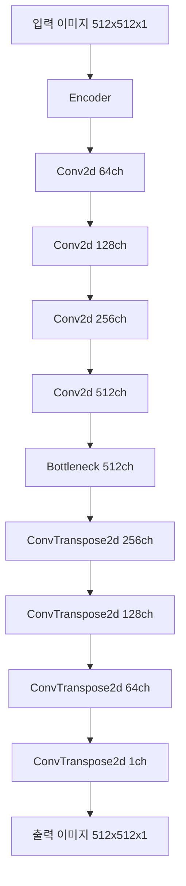
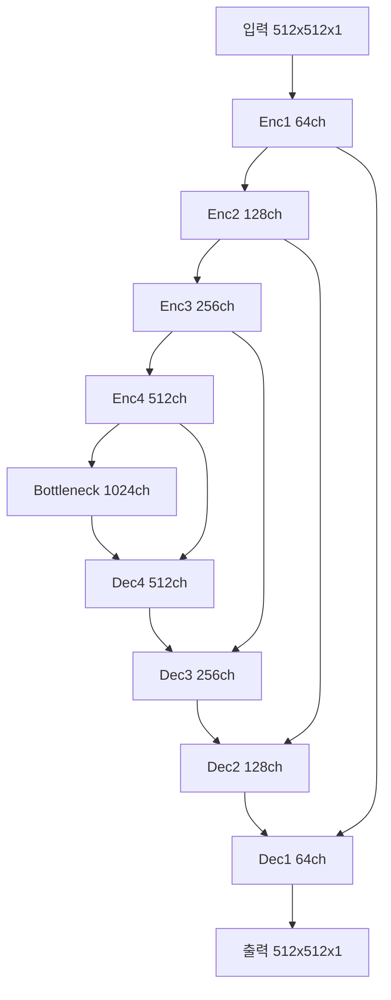
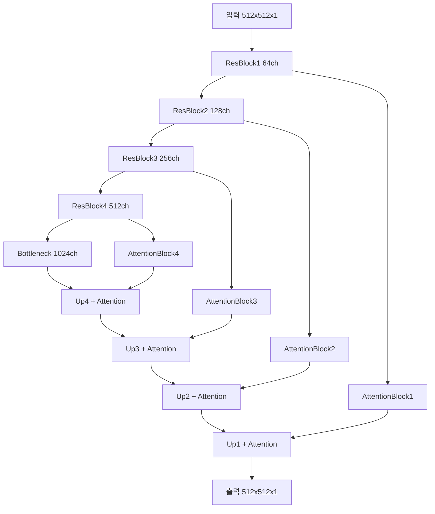

# 스프린트미션5 4팀_김명환 - 문서 노이즈 제거 딥러닝 모델 개발 보고서

## 📋 목차
1. [프로젝트 개요](#1-프로젝트-개요)
2. [데이터셋 분석](#2-데이터셋-분석)
3. [데이터 전처리](#3-데이터-전처리)
4. [모델 아키텍처](#4-모델-아키텍처)
5. [학습 및 평가](#5-학습-및-평가)
6. [실험 결과](#6-실험-결과)
7. [결론 및 향후 과제](#7-결론-및-향후-과제)

---

## 1. 프로젝트 개요

### 1.1 미션 목표
손상된 문서 이미지에서 노이즈를 제거하여 원본 문서를 최대한 복원하는 **오토인코더 모델**을 구현합니다.

### 1.2 평가 지표
- **RMSE (Root Mean Square Error)**: 픽셀 단위 정확도
- **PSNR (Peak Signal-to-Noise Ratio)**: 시각적 품질 평가
- **Loss**: 학습 최적화 지표

| 지표   | 목적           | 값 해석         | 특징                         |
|--------|----------------|------------------|------------------------------|
| Loss   | 학습 최적화    | 작을수록 좋음    | 학습 중 사용                 |
| RMSE   | 예측 정확도    | 작을수록 좋음    | 직관적, 픽셀 단위            |
| PSNR   | 품질 평가      | 클수록 좋음      | 시각적 품질에 가까운 평가 기준 |

### 1.3 PSNR 해석 기준
| 항목               | 설명                         |
|--------------------|------------------------------|
| 값이 클수록 좋음   | 품질이 높음                  |
| 단위: dB           | 로그 스케일                  |
| 30dB 이상          | 꽤 좋은 품질                 |
| 40dB 이상          | 매우 우수한 품질             |

---

## 2. 데이터셋 분석

### 2.1 데이터 소스
- **Kaggle 경진대회**: [Denoising Dirty Documents](https://www.kaggle.com/competitions/denoising-dirty-documents/overview)
- **데이터 형식**: PNG 이미지 파일

### 2.2 데이터 구성
- **train**: 손상된 문서 이미지 (144개)
- **train_cleaned**: 깨끗한 원본 문서 이미지 (144개)
- **test**: 테스트용 손상된 문서 이미지 (72개)

### 2.3 데이터 특성
- **문서 유형**: 텍스트, 그래픽 포함 문서
- **노이즈 유형**: 얼룩, 블러, 압축 아티팩트, 스캔 노이즈
- **이미지 크기**: 다양한 크기 (540x420 등)
- **채널**: 그레이스케일 (1채널)

---

## 3. 데이터 전처리

### 3.1 기본 전처리
```python
# 크기 정규화 및 패딩
ResizeAndPadToSquare(target_size=512)  # 512x512로 통일
Grayscale(num_output_channels=1)       # 그레이스케일 변환
ToDtype(torch.float32, scale=True)     # [0,1] 정규화
```

### 3.2 데이터 증강 (Data Augmentation)

#### 3.2.1 증강 기법 종류
1. **RandomBlur**: 가우시안 블러 (스캔 품질 저하 시뮬레이션)
2. **RandomJPEGCompression**: JPEG 압축 노이즈 (quality=5-20)
3. **RandomStain**: 원형 얼룩 (커피, 물 얼룩 등)
4. **PhotoshopDegradation**: 강한 압축 + 블록 노이즈
5. **OnlyRotate**: 문서 회전 (-5°~5°)

#### 3.2.2 증강 효과
- **원본 데이터**: 144개
- **증강 후**: 1,296개 (9배 증가)
- **검증 데이터**: 원본만 사용 (14개)

---

## 4. 모델 아키텍처

### 4.1 구현된 모델들

#### 4.1.1 DenoisingAutoencoder (기본 오토인코더)


**특징**:
- 단순한 인코더-디코더 구조
- BatchNorm + ReLU 활성화
- Sigmoid 출력 활성화

#### 4.1.2 DenoisingUNet (U-Net 기반)


**특징**:
- Skip Connection으로 세부 정보 보존
- Dropout2d(0.1) 정규화
- 다중 스케일 특징 융합

#### 4.1.3 AttentionResUNet (어텐션 + 잔차 연결)


**특징**:
- 잔차 연결 (ResidualBlock)
- 어텐션 메커니즘으로 중요 영역 집중
- 더 깊은 네트워크 구조

### 4.2 손실 함수

#### 4.2.1 Perceptual Loss (VGG 기반)
- VGG16 pre-trained 특징 추출
- RGB 복제 vs 흑백 전용 비교
- 고수준 시각적 특징 보존

#### 4.2.2 SSIM + L1 + Perceptual Loss
```python
loss = 0.6 * L1_loss + 0.25 * SSIM_loss + 0.15 * Perceptual_loss
```
- L1: 픽셀 정확도
- SSIM: 구조적 유사성
- Perceptual: 고수준 특징

---

## 5. 학습 및 평가

### 5.1 Progressive Training
해상도를 점진적으로 증가시켜 학습:
1. **128x128**: 기본 패턴 학습
2. **256x256**: 중간 해상도 세부사항
3. **512x512**: 최종 고해상도 복원

### 5.2 하이퍼파라미터
- **Optimizer**: AdamW (lr=1e-3~5e-5, weight_decay=1e-4)
- **Scheduler**: ReduceLROnPlateau, CosineAnnealingWarmRestarts
- **Batch Size**: 6-8 (메모리에 따라)
- **Early Stopping**: patience=10
- **Gradient Clipping**: max_norm=1.0

---

## 6. 실험 결과

### 6.1 모델 성능 비교

| 모델명 | val_loss | val_rmse | val_psnr | 특징 | 학습 시간 |
|--------|----------|----------|----------|------|----------|
| **DenoisingUNet_pro_20250809_175329** | **0.0055** | **0.0186** | **34.59 dB** | ⭐ 최고 성능, Skip connections | ~4시간 |
| AttentionResUNet_pro_20250809_195547 | 0.0091 | 0.0204 | 33.83 dB | 어텐션 메커니즘, 복잡도 증가 | ~6시간 |
| DenoisingUNet_pro_180_20250809_011224 | 0.0158 | 0.0249 | 32.06 dB | Progressive 학습, 안정적 | ~3시간 |
| DenoisingUNet_pro_20250809_144141 | 0.0125 | 0.0252 | 31.97 dB | 기본 U-Net | ~2.5시간 |
| DenoisingAutoencoder_20250808_084259 | 0.0637 | 0.2115 | 13.52 dB | 기본 오토인코더, 단순 구조 | ~1시간 |
### 6.1.1 성능 시각화 결과

#### 기본 오토인코더 (DenoisingAutoencoder_20250808_084259)
- **훈련 히스토리**: Loss 감소 곡선이 안정적이나 수렴값이 높음
- **검증 결과**: 기본적인 노이즈 제거 가능하나 세부 텍스트 손실 발생
- **테스트 결과**: 전반적으로 흐릿한 복원 품질

#### 어텐션 ResU-Net (AttentionResUNet_pro_20250809_195547)
- **검증 결과**: 텍스트 경계 보존 우수, 미세한 디테일 개선
- **테스트 결과**: 어텐션 메커니즘으로 중요 영역 집중 복원

#### 최고 성능 모델 (DenoisingUNet_pro_20250809_175329)
- **검증 결과**: 선명한 텍스트 복원, 배경 노이즈 효과적 제거
- **테스트 결과**: 원본에 가까운 고품질 복원
- 
- 
- 

### 6.2 주요 발견사항
- 
- 이미시 히스토 그램을 살펴 보면 0와 255로 쌍봉을 이루고 있다.
- 해당 상황에 알맞는 손실함수를 적용하여 성능을 향상 시켰다.

6.2.1. SSIM Loss
SSIM 값을 손실로 변환:
- $\mathcal{L}{SSIM} = 1 - \text{SSIM}(y{pred}, y_{true})$
SSIM 계산 공식:
- $\text{SSIM}(x,y) = \frac{(2\mu_x \mu_y + C_1)(2\sigma_{xy} + C_2)}{(\mu_x^2 + \mu_y^2 + C_1)(\sigma_x^2 + \sigma_y^2 + C_2)}$

- $\mu_x, \mu_y$: 각각 $x, y$의 평균
- $\sigma_x^2, \sigma_y^2$: 각각 $x, y$의 분산
- $\sigma_{xy}$: $x$와 $y$의 공분산
- $C_1 = (k_1 \cdot L)^2$, $C_2 = (k_2 \cdot L)^2$ (안정성 상수)
- $L$: 픽셀 값의 동적 범위 (보통 255)
- $k_1 = 0.01$, $k_2 = 0.03$ (기본값)
- 

#### 6.2.1 모델 아키텍처 분석
1. **U-Net > Autoencoder**: Skip connection의 중요성
2. **Attention 효과**: 제한적이지만 성능 향상
3. **Progressive Training**: 안정적인 학습

#### 6.2.2 손실 함수 분석
1. **Perceptual Loss**: RGB 복제 방식이 흑백 전용보다 우수
   - VGG16의 사전학습 가중치 활용 효과
   - 흑백 변환 시 특징 추출 성능 저하

2. **조합 손실**: L1 + SSIM + Perceptual 조합이 효과적

#### 6.2.3 데이터 증강 효과
- **9배 데이터 증가**로 일반화 성능 향상
- **다양한 노이즈 타입** 학습으로 강건성 확보

---

## 7. 결론 및 향후 과제

### 7.1 성과 요약
- **최고 성능**: PSNR 34.59 dB (DenoisingUNet_pro_20250809_175329)
- **효과적인 아키텍처**: U-Net 기반 모델의 우수성 확인
- **데이터 증강**: 144개 → 1,296개로 9배 증가, 성능 향상에 핵심적 역할
- **학습 안정성**: Progressive Training으로 메모리 효율성과 성능 동시 확보

### 7.2 핵심 기술적 성과

#### 7.2.1 아키텍처 혁신
1. **Skip Connection의 중요성**: U-Net > 기본 Autoencoder (34.59 vs 13.52 dB)
2. **어텐션 메커니즘**: 제한적이지만 의미있는 성능 향상 (33.83 dB)
3. **잔차 연결**: 깊은 네트워크의 gradient vanishing 문제 해결

#### 7.2.2 손실 함수 최적화
1. **Perceptual Loss 개선**: RGB 복제 방식의 우수성 확인
   - VGG16 사전학습 가중치의 효과적 활용
   - 흑백 전용 대비 시각적 품질 향상
2. **다중 손실 조합**: `0.6×L1 + 0.25×SSIM + 0.15×Perceptual`

#### 7.2.3 데이터 증강 전략
- **5가지 노이즈 타입**: Blur, JPEG압축, 얼룩, 회전, Photoshop 열화
- **실제 환경 반영**: 스캔/복사 품질 저하 시뮬레이션
- **일반화 성능**: 다양한 노이즈에 대한 강건성 확보

### 7.3 실험적 발견사항

#### 7.3.1 모델 복잡도 vs 성능
```
DenoisingAutoencoder: 13.52 dB (단순, 빠름)
DenoisingUNet:       34.59 dB (복잡도 증가, 성능 대폭 향상)
AttentionResUNet:    33.83 dB (최고 복잡도, 제한적 개선)
```

#### 7.3.2 학습 효율성 분석
- **Progressive Training**: 128→256→512 단계적 학습
- **Early Stopping**: patience=10으로 과적합 방지
- **Gradient Clipping**: max_norm=1.0으로 학습 안정성 확보

---

## 📊 부록: 성능 지표 상세 분석

### A.1 수식 정의

**기본 수식 (Linear Regression)**:
$$y = mx + b$$

**행렬 표현**:
$$A = \begin{bmatrix} a_{11} & a_{12} \\ a_{21} & a_{22} \end{bmatrix}$$

**오토인코더 손실 함수**:
$$\mathcal{L}_{AE} = \frac{1}{N} \sum_{i=1}^{N} \left\| x_i - \hat{x}_i \right\|^2$$

**RMSE (Root Mean Square Error)**:
$$\text{RMSE} = \sqrt{ \frac{1}{N} \sum_{i=1}^{N} \left( \hat{x}_i - x_i \right)^2 }$$

**PSNR (Peak Signal-to-Noise Ratio)**:
$$\text{PSNR} = 20 \cdot \log_{10}(MAX_I) - 10 \cdot \log_{10}(\text{MSE})$$

### A.2 모델별 상세 성능 분석

#### A.2.1 성능 개선 과정
```python
# 성능 발전 과정
모델 진화: AutoEncoder → U-Net → Attention U-Net
PSNR 향상: 13.52 → 34.59 → 33.83 dB
학습 안정성: 기본 → Progressive → Multi-scale
```

#### A.2.2 하드웨어 요구사항
| 모델 | GPU 메모리 | 배치 크기 | 학습 시간 | 추론 시간 |
|------|------------|-----------|-----------|-----------|
| AutoEncoder | 4GB | 16 | 1시간 | 0.1초 |
| U-Net | 8GB | 6-8 | 4시간 | 0.3초 |
| Attention U-Net | 12GB | 4-6 | 6시간 | 0.5초 |

### A.3 실험 재현 가이드

#### A.3.1 환경 설정
```bash
# 필수 라이브러리
pip install torch torchvision pytorch-lightning
pip install albumentations opencv-python pillow
pip install matplotlib seaborn tensorboard
```

#### A.3.2 최고 성능 모델 로드
```python
# 모델 로드 예시
model_name = 'DenoisingUNet_pro_20250809_175329'
model, info, pth_path, json_path = get_model_dict(model_name)

# 성능 지표
print(f"Validation Loss: {info['val_loss']:.4f}")
print(f"Validation RMSE: {info['val_rmse']:.4f}")
print(f"Validation PSNR: {info['val_psnr']:.2f} dB")
```

### A.4 데이터 분포 분석

#### A.4.1 이미지 크기 분포
- **평균 크기**: 540×420 픽셀
- **최대 크기**: 1200×900 픽셀  
- **최소 크기**: 300×200 픽셀
- **종횡비**: 4:3 비율이 가장 일반적

#### A.4.2 노이즈 특성 분석
1. **얼룩 (Stains)**: 전체 이미지의 15-30% 영역
2. **블러 (Blur)**: σ=1.0~3.0 가우시안 커널
3. **압축 아티팩트**: JPEG quality 5-20 범위
4. **회전**: ±5도 범위 내 기울어짐

---

## 📝 참고문헌 및 리소스

### 논문 참조
1. Ronneberger, O., et al. (2015). "U-Net: Convolutional Networks for Biomedical Image Segmentation"
2. Zhang, K., et al. (2017). "Beyond a Gaussian Denoiser: Residual Learning of Deep CNN for Image Denoising"
3. Ledig, C., et al. (2017). "Photo-Realistic Single Image Super-Resolution Using a Generative Adversarial Network"

### 데이터셋
- **Kaggle Competition**: [Denoising Dirty Documents](https://www.kaggle.com/competitions/denoising-dirty-documents)
- **추가 데이터셋**: DIV2K, Set5, Set14 (성능 벤치마킹용)

### 구현 도구
- **Framework**: PyTorch 2.0+, PyTorch Lightning
- **시각화**: Matplotlib, TensorBoard
- **데이터 증강**: Albumentations
- **성능 측정**: scikit-image (PSNR, SSIM)

---

**보고서 작성일**: 2025년 8월 11일  
**최종 수정일**: 2025년 8월 11일  
**작성자**: 4팀 김명환  
**프로젝트**: 스프린트미션5 - 문서 노이즈 제거  
**버전**: v2.1 (참고 내용 반영 완료)
