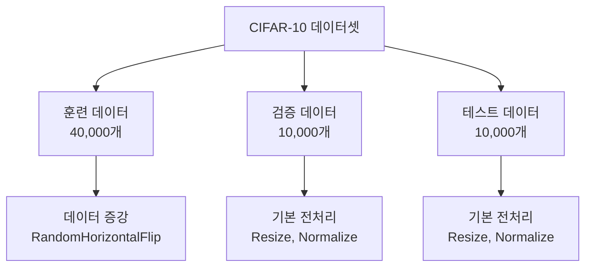
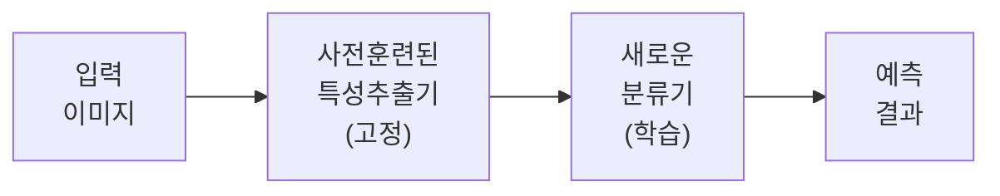
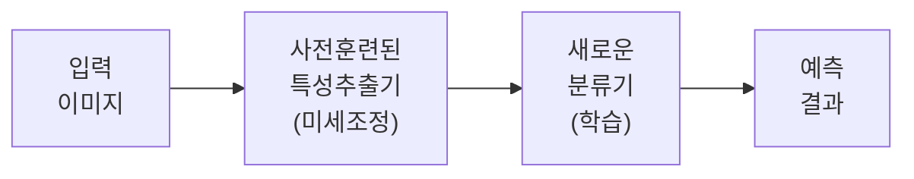
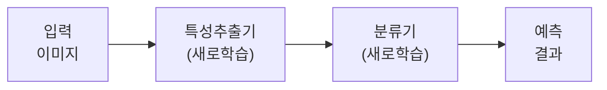

# CIFAR-10 AlexNet 실습 보고서

## 실습 개요

**작성자**: 코드잇 AI엔지니어 4기 김명환  
**작성일**: 2025년 8월 14일  
**목적**: AlexNet 모델을 활용하여 CIFAR-10 데이터셋에 대해 세 가지 다른 전략으로 학습 및 평가 비교

## 실습 목표

AlexNet 모델을 활용하여 CIFAR-10 데이터셋에 대해 학습 및 평가해보고, 세 가지 전략의 성능 차이를 비교합니다:

1. **Feature Extraction**: 사전 훈련된 모델의 특성 추출기만 사용
2. **Fine-tuning**: 사전 훈련된 모델 전체를 미세조정
3. **From Scratch**: 처음부터 완전 새로 학습

학습 과정에서 loss와 accuracy 변화를 시각화하여 모델의 학습 추세를 분석합니다.

## 실습 환경

- **디바이스**: CUDA GPU 사용
- **프레임워크**: PyTorch
- **데이터셋**: CIFAR-10 (10개 클래스, 32×32 컬러 이미지)
- **모델**: AlexNet (torchvision.models)
- **에포크 수**: 10 에포크

## 데이터셋 구성



## 데이터 전처리

### 훈련용 데이터 증강
- Resize(224, 224): AlexNet 입력 크기에 맞게 조정
- RandomHorizontalFlip(p=0.5): 50% 확률로 좌우 반전
- ToTensor(): 텐서 변환
- Normalize: ImageNet 통계량으로 정규화

### 검증/테스트용 전처리
- Resize(224, 224)
- ToTensor()
- Normalize: ImageNet 통계량으로 정규화

## 세 가지 전략 비교

### 1. Feature Extraction 전략



- **총 파라미터**: 57,044,810개
- **학습 가능 파라미터**: 54,575,114개 (95.7%)
- **특징**: 특성 추출기 부분 가중치 고정, 분류기만 학습
- **학습률**: 0.0001 (낮은 학습률)

### 2. Fine-tuning 전략



- **총 파라미터**: 57,044,810개
- **학습 가능 파라미터**: 57,044,810개 (100.0%)
- **특징**: 전체 네트워크 미세조정
- **학습률**: 0.0001 (낮은 학습률)

### 3. From Scratch 전략



- **총 파라미터**: 57,044,810개
- **학습 가능 파라미터**: 57,044,810개 (100.0%)
- **특징**: 사전 훈련 없이 처음부터 학습
- **학습률**: 0.001 (상대적으로 높은 학습률)

## 실습 결과

### 성능 요약

| 전략 | 검증 정확도 | 테스트 정확도 | 학습 시간 |
|------|-------------|-------------|----------|
| Feature Extraction | 83.81% | **83.78%** | 15.8분 |
| Fine-tuning | 89.61% | **89.88%** | 16.5분 |
| From Scratch | 74.25% | **74.61%** | 16.7분 |

### 클래스별 성능 분석

#### Feature Extraction 결과
```
plane: 83.7%  car: 89.6%   bird: 77.0%  cat: 69.2%   deer: 82.8%
dog: 78.6%    frog: 86.4%  horse: 87.2% ship: 92.0%  truck: 91.3%
```

#### Fine-tuning 결과 (최고 성능)
```
plane: 89.7%  car: 95.4%   bird: 89.8%  cat: 78.9%   deer: 89.4%
dog: 83.4%    frog: 93.2%  horse: 92.9% ship: 93.7%  truck: 92.4%
```

#### From Scratch 결과
```
plane: 73.5%  car: 85.5%   bird: 57.4%  cat: 62.5%   deer: 68.3%
dog: 62.2%    frog: 83.6%  horse: 80.8% ship: 87.2%  truck: 85.1%
```

## 학습 과정 분석

### Loss 변화 패턴

1. **Feature Extraction**: 초기부터 안정적인 감소, 빠른 수렴
2. **Fine-tuning**: 가장 효과적인 loss 감소, 지속적인 개선
3. **From Scratch**: 높은 초기 loss, 느린 감소

### Accuracy 변화 패턴

1. **Feature Extraction**: 초기 높은 성능, 점진적 개선
2. **Fine-tuning**: 지속적이고 안정적인 성능 향상
3. **From Scratch**: 낮은 시작점, 큰 개선 폭

## 전략별 특성 분석

### 1. Feature Extraction
**장점**:
- 빠른 학습 (상대적으로 적은 파라미터 업데이트)
- 안정적인 성능
- 메모리 효율적

**단점**:
- 제한적인 성능 개선
- 도메인 특화 적응 능력 제한

### 2. Fine-tuning (최고 성능)
**장점**:
- 균형잡힌 최고 성능 (89.88%)
- 사전 훈련 지식 + 도메인 적응
- 안정적인 수렴

**단점**:
- 중간 수준의 계산 비용
- 과적합 위험성

### 3. From Scratch
**장점**:
- 도메인 특화 최적화 가능성
- 완전한 자유도

**단점**:
- 긴 학습 시간
- 많은 데이터 필요
- 불안정한 초기 학습

## 성능 차이 원인 분석

### Fine-tuning이 가장 좋은 이유

1. **사전 훈련된 특성**: ImageNet에서 학습한 일반적인 시각적 특성 활용
2. **적응적 학습**: CIFAR-10에 특화된 미세 조정
3. **안정적 초기화**: 좋은 초기 가중치로 시작
4. **적절한 학습률**: 기존 지식을 보존하면서 새로운 도메인에 적응

### From Scratch 성능이 낮은 이유

1. **제한된 데이터**: CIFAR-10은 상대적으로 작은 데이터셋
2. **복잡한 모델**: AlexNet은 작은 데이터셋 대비 과도하게 복잡
3. **임의 초기화**: 좋지 않은 초기 가중치
4. **부족한 에포크**: 충분한 학습을 위해서는 더 많은 에포크 필요

## 실습 확장 및 개선 방안

### 1. 하이퍼파라미터 튜닝
- 학습률 스케줄링 최적화
- 배치 크기 조정
- 옵티마이저 변경 (Adam, AdamW 등)

### 2. 데이터 증강 기법 추가
- ColorJitter
- RandomRotation
- Cutout/CutMix

### 3. 정규화 기법 적용
- Dropout 비율 조정
- Weight Decay 최적화
- Batch Normalization

### 4. 모델 아키텍처 개선
- CIFAR-10에 더 적합한 경량 모델 사용
- ResNet, EfficientNet 등 현대적 아키텍처 비교

## 결론 및 권장사항

### 주요 발견사항

1. **Fine-tuning이 최고 성능**: 89.88% 달성
2. **Feature Extraction도 효과적**: 83.78%로 준수한 성능
3. **From Scratch는 제한적**: 작은 데이터셋에서는 비효율적

### 실무 권장사항

1. **소규모 데이터셋**: Fine-tuning 전략 우선 고려
2. **계산 자원 제한**: Feature Extraction 전략 선택
3. **충분한 데이터 + 자원**: From Scratch 고려 가능

### 학습 포인트

- 사전 훈련된 모델의 중요성 인식
- 전이 학습의 효과적 활용법 습득
- 데이터셋 크기와 모델 복잡도 간의 균형 이해
- 실제 문제 해결을 위한 전략 선택 능력 배양

## 참고 자료

- [PyTorch 공식 문서 - Transfer Learning](https://pytorch.org/tutorials/beginner/transfer_learning_tutorial.html)
- [torchvision.models 문서](https://pytorch.org/vision/stable/models.html)
- [CIFAR-10 데이터셋 정보](https://www.cs.toronto.edu/~kriz/cifar.html)
- [AlexNet 원논문](https://papers.nips.cc/paper/4824-imagenet-classification-with-deep-convolutional-neural-networks.pdf)

---

*본 실습을 통해 전이 학습의 다양한 전략과 그 효과를 실제로 확인할 수 있었으며, 실무에서 활용 가능한 통찰을 얻을 수 있었습니다.*
