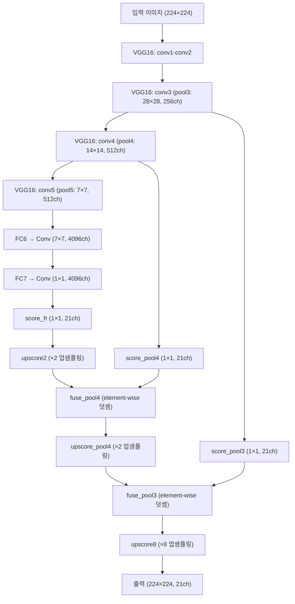

# FCN8s 기반 VOC2012 시맨틱 세그멘테이션

## 실습 개요

**작성자**: 코드잇 AI엔지니어 4기 김명환  
**작성일**: 2025년 8월 28일  
**목적**: FCN8s 기반 VOC2012 시맨틱 세그멘테이션

---

## 목차
1. [서론](#1-서론)<br/>
2. [FCN8s 핵심 개념](#2-fcn8s-핵심-개념)<br/>
3. [아키텍처 심층 분석](#3-아키텍처-심층-분석)<br/>
4. [VOC2012 데이터셋 특성](#4-voc2012-데이터셋-특성)<br/>
5. [오리지널 vs 간소화 구현 비교](#5-오리지널-vs-간소화-구현-비교)<br/>
6. [FCN 계열 모델 성능 비교](#6-fcn-계열-모델-성능-비교)<br/>
7. [학습 과정 및 최적화](#7-학습-과정-및-최적화)<br/>
8. [실습 구현 가이드](#8-실습-구현-가이드)<br/>
9. [용어 목록](#9-용어-목록)<br/>

---

## 1. 서론

**FCN8s**(Fully Convolutional Network 8s, 전방향 합성곱 신경망)는 2015년 발표된 혁신적인 시맨틱 세그멘테이션(semantic segmentation) 모델입니다. 본 문서에서는 **VOC2012**(Visual Object Classes 2012) 데이터셋을 활용한 FCN8s의 핵심 원리와 구현 방법을 상세히 다룹니다.

### 1.1. 시맨틱 세그멘테이션의 중요성

시맨틱 세그멘테이션은 단순한 객체 분류를 넘어서 **픽셀 단위의 의미론적 이해**를 요구하는 컴퓨터 비전의 핵심 과제입니다. 자율주행, 의료 영상 분석, 증강현실 등 다양한 분야에서 활용됩니다.

---

## 2. FCN8s 핵심 개념

### 2.1. 시맨틱 세그멘테이션의 본질

FCN8s는 **"픽셀 좌표 (x,y)에 있는 이 픽셀이 어떤 클래스인가?"**라는 질문에 답하는 모델입니다. 이미지의 모든 픽셀을 21개 클래스(VOC2012 기준) 중 하나로 분류하는 **픽셀 단위 분류(pixel-wise classification)** 작업을 수행합니다.

### 2.2. FCN의 혁신적 아이디어

전통적인 CNN과 달리 FCN은 다음과 같은 특징을 가집니다:

- **완전 컨볼루션 구조**: 모든 층이 컨볼루션으로 구성되어 공간 정보 보존
- **가변 입력 크기**: 224×224에 제한되지 않는 임의 해상도 처리
- **공간적 출력**: 분류 스코어가 아닌 세그멘테이션 맵 생성

### 2.3. 수학적 표현

입력 이미지 $I \in \mathbb{R}^{H \times W \times 3}$에 대해 FCN8s는 다음과 같은 출력을 생성합니다:

$$S = \text{FCN8s}(I) \in \mathbb{R}^{H \times W \times C}$$

여기서 $C$는 클래스 수(VOC2012에서는 21), $S_{i,j,k}$는 픽셀 $(i,j)$가 클래스 $k$에 속할 확률을 나타냅니다.

---

## 3. 아키텍처 심층 분석

### 3.1. VGG16 백본의 활용

FCN8s는 ImageNet에서 사전훈련된 **VGG16**을 피처 추출기(feature extractor)로 사용합니다:

- **전이 학습(Transfer Learning)**: 객체 인식 지식을 세그멘테이션에 재활용
- **계층적 특징 추출**: 저수준(에지, 텍스처) → 고수준(의미적 특징)

### 3.2. 스킵 커넥션의 핵심 원리

FCN8s의 가장 중요한 혁신은 **다중 해상도 정보 융합**입니다:



### 3.3. 해상도 및 채널 변화 테이블

| 단계 | 레이어 | 해상도 | 채널 수 | 설명 |
|------|--------|--------|---------|-------|
| 입력 | 원본 이미지 | 224×224 | 3 | RGB 이미지 |
| pool3 | conv3_3 후 | 28×28 | 256 | 1/8 해상도 |
| pool4 | conv4_3 후 | 14×14 | 512 | 1/16 해상도 |
| pool5 | conv5_3 후 | 7×7 | 512 | 1/32 해상도 |
| FC6 | 컨볼루션 변환 | 7×7 | 4096 | 7×7 커널 |
| FC7 | 1×1 컨볼루션 | 7×7 | 4096 | 고차원 특징 |
| 출력 | 최종 업샘플링 | 224×224 | 21 | 클래스 스코어 맵 |

### 3.4. 스킵 커넥션의 필요성

**왜 스킵 커넥션이 필요한가?**

- **pool5만 사용 시**: 의미적으로 풍부하지만 공간적으로 거침 (1/32 해상도)
- **pool4 추가**: 중간 수준의 구조적 정보 제공 (1/16 해상도)
- **pool3 추가**: 세밀한 경계(boundary) 정보 보완 (1/8 해상도)

이를 통해 **전역적 맥락(global context)**과 **지역적 디테일(local detail)**을 모두 포착할 수 있습니다.

### 3.5. 업샘플링 전략

FCN8s는 **점진적 업샘플링(progressive upsampling)**을 사용합니다:

1. **1단계**: pool5 (1/32) → ×2 업샘플링 → pool4 (1/16)와 결합
2. **2단계**: 결합 결과 → ×2 업샘플링 → pool3 (1/8)와 결합
3. **3단계**: 최종 결과 → ×8 업샘플링 → 원본 해상도 (1/1)

업샘플링 수식:
$$\text{output\_size} = (\text{input\_size} - 1) \times \text{stride} - 2 \times \text{padding} + \text{kernel\_size}$$

---

## 4. VOC2012 데이터셋 특성

### 4.1. 데이터셋 구조

- **클래스 수**: 21개 (배경 + 20개 객체 클래스)
- **훈련 이미지**: 1,464장
- **검증 이미지**: 1,449장
- **테스트 이미지**: 1,456장

### 4.2. 클래스 목록

**사람**: person
**동물**: bird, cat, cow, dog, horse, sheep
**교통수단**: aeroplane, bicycle, boat, bus, car, motorbike, train
**실내 물체**: bottle, chair, dining table, potted plant, sofa, tv/monitor

### 4.3. 애너테이션 품질

VOC2012는 **매우 정밀한 수작업 라벨링**으로 유명합니다:

- 객체 경계선이 픽셀 단위로 정확
- 가려진 부분(occlusion) 세심한 처리
- 애매한 경계는 **무시 라벨(ignore label, 255)** 사용

### 4.4. 데이터 전처리

```python
# 기본 전처리 파이프라인
transform = transforms.Compose([
    transforms.PILToTensor(),
    transforms.ConvertImageDtype(torch.float),
    transforms.Resize((224, 224))
])

target_transform = transforms.Compose([
    transforms.Resize((224, 224), 
                     interpolation=transforms.InterpolationMode.NEAREST)
])
```

**주의사항**: 마스크는 반드시 **NEAREST** 보간법을 사용해야 클래스 라벨이 손상되지 않습니다.

---

## 5. 오리지널 vs 간소화 구현 비교

### 5.1. 아키텍처 구조적 차이

#### **완전연결층 처리**
- **오리지널**: VGG16의 FC6, FC7을 각각 7×7, 1×1 컨볼루션으로 변환
  - FC6: 512 → 4096 channels (7×7 kernel)
  - FC7: 4096 → 4096 channels (1×1 kernel)
- **간소화 구현**: FC 레이어를 완전히 제거하고 pool5 출력(512 channels) 직접 사용

#### **채널 수 차이**
- **오리지널**: score_fr에서 4096 channels 사용
- **간소화 구현**: score_fr에서 512 channels 사용

### 5.2. 성능 및 표현력 차이

#### **특징 추출 능력**
- **오리지널**: FC6, FC7의 4096차원 **고차원 특징**으로 풍부한 시맨틱 정보 학습
- **간소화 구현**: 512차원 저차원 특징으로 제한된 표현력

#### **수용 영역(Receptive Field)**
- **오리지널**: FC6의 7×7 커널로 더 넓은 컨텍스트 정보 활용
- **간소화 구현**: 1×1 커널로 제한된 공간적 정보만 활용

### 5.3. 세부 구현 차이

#### **가중치 초기화**
- **오리지널**:
  - FC 레이어의 사전훈련된 가중치를 컨볼루션으로 변환
  - Transposed convolution을 **바이리니어 보간(bilinear interpolation)**으로 초기화
  - Score 레이어를 0으로 초기화
- **간소화 구현**: 기본 PyTorch 초기화 사용

#### **스케일링 처리**
- **오리지널**: pool4 출력에 0.01 스케일링 적용 (`0.01 * pool4`)
- **간소화 구현**: 스케일링 없음

#### **패딩 전략**
- **오리지널**: 
  - 작은 입력 이미지 지원을 위한 100픽셀 패딩
  - 서로 다른 레이어 피처 맵 크기 매칭을 위한 크롭핑
- **간소화 구현**: 기본 패딩만 사용

### 5.4. 메모리 및 계산 효율성

#### **파라미터 수**
- **오리지널**: FC6, FC7로 인한 대량 파라미터 (약 100M+ 추가)
- **간소화 구현**: 더 적은 파라미터로 경량화된 모델

#### **메모리 사용량**
- **오리지널**: 4096 채널 처리로 높은 메모리 요구량
- **간소화 구현**: 512 채널로 메모리 효율적

### 5.5. 예상 성능 차이

#### **세그멘테이션 품질**
- **오리지널**: 더 정확한 객체 경계 분할, 세밀한 디테일 표현
- **간소화 구현**: 상대적으로 거친 분할 결과 예상

#### **클래스 분류 정확도**
- **오리지널**: 고차원 특징으로 더 정확한 클래스 구분
- **간소화 구현**: 제한된 특징으로 상대적으로 낮은 정확도

---

## 6. FCN 계열 모델 성능 비교

### 6.1. FCN32s vs FCN16s vs FCN8s

| 특징 | FCN32s | FCN16s | FCN8s |
|------|--------|--------|-------|
| **스킵 커넥션** | 없음 | pool4만 | pool3, pool4 |
| **최종 업샘플링** | 32배 | 16배 | 8배 |
| **경계 정확도** | 낮음 | 중간 | 높음 |
| **계산 복잡도** | 낮음 | 중간 | 높음 |
| **mIoU 성능** | ~62% | ~65% | ~67% |
| **추론 속도** | 빠름 | 중간 | 느림 |

### 6.2. 성능 차이 상세 분석

#### **FCN32s의 한계**
- **과도한 다운샘플링**: 1/32 해상도까지 축소 후 복원
- **정보 손실**: 세밀한 공간 정보 영구 소실
- **거친 경계**: 블록 형태의 부정확한 세그멘테이션
- **체크보드 아티팩트**: 업샘플링 과정에서 발생하는 격자무늬

#### **FCN16s의 개선**
- **pool4 스킵**: 1/16 해상도 정보 활용으로 중간 디테일 개선
- **형태 인식**: 객체의 전반적 형태가 더 명확해짐
- **여전한 한계**: 미세한 경계는 여전히 부정확

#### **FCN8s의 완성**
- **pool3 추가**: 1/8 해상도의 세밀한 정보로 경계 정밀도 향상
- **최적 균형**: 의미적 정확도와 공간적 정밀도의 조화
- **실용적 성능**: 속도와 품질의 적절한 트레이드오프

### 6.3. 실제 테스트 샘플 비교 분석

#### **도로 세그멘테이션 시나리오**
- **FCN32s**: 도로 영역을 대략적으로만 식별, 경계가 계단식으로 거칠고 부정확
- **FCN16s**: 도로 형태가 더 자연스럽지만 여전히 거친 경계선
- **FCN8s**: 도로 가장자리가 매우 정교하고 자연스러워 실제 차선과 거의 일치

#### **사람 세그멘테이션 시나리오**
- **FCN32s**: 사람 전체 영역은 찾지만 팔다리 구분 어렵고 실루엣이 각짐
- **FCN16s**: 몸통과 팔다리 구분 가능하지만 손가락, 머리카락 등 세부는 뭉개짐
- **FCN8s**: 손가락, 머리카락, 옷 주름까지 세밀하게 분할하여 사람의 자세까지 정확히 파악

#### **복잡한 다중 객체 시나리오**
- **FCN32s**: 여러 객체가 하나로 뭉개지거나 작은 객체 누락
- **FCN16s**: 대부분 객체 식별하지만 겹치는 부분에서 경계 모호
- **FCN8s**: 겹치는 객체들도 정확히 분리하고 작은 객체까지 놓치지 않음

---

## 7. 학습 과정 및 최적화

### 7.1. 손실 함수

FCN8s는 **픽셀별 교차 엔트로피 손실(pixel-wise cross-entropy loss)**을 사용합니다:

$$\mathcal{L} = -\frac{1}{N} \sum_{i=1}^{N} \sum_{j=1}^{C} y_{i,j} \log(\hat{y}_{i,j})$$

여기서:
- $N$: 유효한 픽셀 수 (무시 라벨 제외)
- $C$: 클래스 수 (21)
- $y_{i,j}$: 픽셀 $i$의 클래스 $j$에 대한 원-핫 라벨
- $\hat{y}_{i,j}$: 예측된 확률

### 7.2. 최적화 전략

#### **학습률 스케줄링**
- **초기 학습률**: 1e-4 ~ 1e-3
- **스케줄러**: StepLR 또는 ReduceLROnPlateau 사용
- **에포크**: 100-200 에포크 훈련

#### **배치 크기 고려사항**
- **메모리 제약**: GPU 메모리에 따라 2-8 배치 크기 사용
- **배치 정규화**: 작은 배치 크기에서는 GroupNorm 고려

### 7.3. 데이터 증강 전략

```python
# 고급 데이터 증강 파이프라인
augmentation = transforms.Compose([
    transforms.RandomHorizontalFlip(p=0.5),
    transforms.ColorJitter(brightness=0.1, contrast=0.1, saturation=0.1),
    transforms.RandomRotation(degrees=10),
    transforms.RandomResizedCrop(size=(224, 224), scale=(0.8, 1.0))
])
```

### 7.4. 평가 지표

#### **mIoU (mean Intersection over Union)**
$$\text{IoU}_c = \frac{\text{TP}_c}{\text{TP}_c + \text{FP}_c + \text{FN}_c}$$

$$\text{mIoU} = \frac{1}{C} \sum_{c=1}^{C} \text{IoU}_c$$

#### **Pixel Accuracy**
$$\text{PA} = \frac{\sum_{c=1}^{C} \text{TP}_c}{\sum_{c=1}^{C} (\text{TP}_c + \text{FP}_c)}$$

---

## 8. 실습 구현 가이드

### 8.1. 환경 설정

```bash
# 필수 라이브러리 설치
pip install torch torchvision
pip install kagglehub
pip install matplotlib pillow
pip install tqdm numpy
```

### 8.2. 데이터셋 다운로드

```python
import kagglehub
import torchvision

# VOC2012 데이터셋 다운로드
path = kagglehub.dataset_download("likhon148/visual-object-classes-voc-12")

# 데이터셋 인스턴스 생성
voc_dataset = torchvision.datasets.VOCSegmentation(
    root=path,
    year='2012',
    image_set='train',
    download=False
)
```

### 8.3. 시각화 함수 구현

```python
import matplotlib.pyplot as plt
import numpy as np

def draw_mask(images, masks, outputs=None, plot_size=4):
    """
    이미지, 실제 마스크, 예측 결과를 시각화하는 함수
    """
    batch_size = min(len(images), plot_size)
    
    if outputs is not None:
        fig, axes = plt.subplots(batch_size, 3, figsize=(15, 5*batch_size))
        titles = ['Original Image', 'Ground Truth', 'Prediction']
    else:
        fig, axes = plt.subplots(batch_size, 2, figsize=(10, 5*batch_size))
        titles = ['Original Image', 'Ground Truth']
    
    for i in range(batch_size):
        # 원본 이미지
        img = images[i].permute(1, 2, 0)
        axes[i, 0].imshow(img)
        axes[i, 0].set_title(titles[0])
        axes[i, 0].axis('off')
        
        # 실제 마스크
        mask = masks[i].squeeze() if len(masks[i].shape) > 2 else masks[i]
        axes[i, 1].imshow(mask, cmap='tab20')
        axes[i, 1].set_title(titles[1])
        axes[i, 1].axis('off')
        
        # 예측 결과 (있는 경우)
        if outputs is not None:
            pred = torch.argmax(outputs[i], dim=0)
            axes[i, 2].imshow(pred, cmap='tab20')
            axes[i, 2].set_title(titles[2])
            axes[i, 2].axis('off')
    
    plt.tight_layout()
    plt.show()
```

### 8.4. 성능 평가 함수

```python
def calculate_miou(pred_mask, true_mask, num_classes=21):
    """
    mIoU (mean Intersection over Union) 계산 함수
    """
    miou = 0
    for cls in range(num_classes):
        pred_cls = (pred_mask == cls)
        true_cls = (true_mask == cls)
        
        intersection = (pred_cls & true_cls).sum()
        union = (pred_cls | true_cls).sum()
        
        if union > 0:
            iou = intersection.float() / union.float()
            miou += iou
    
    return miou / num_classes
```

### 8.5. 학습 루프 예시

```python
def train_fcn8s(model, train_loader, val_loader, num_epochs=100):
    """
    FCN8s 모델 훈련 함수
    """
    criterion = nn.CrossEntropyLoss(ignore_index=255)
    optimizer = optim.Adam(model.parameters(), lr=1e-4)
    scheduler = optim.lr_scheduler.StepLR(optimizer, step_size=30, gamma=0.1)
    
    best_miou = 0.0
    
    for epoch in range(num_epochs):
        # 훈련 단계
        model.train()
        train_loss = 0.0
        
        for batch_idx, (images, targets) in enumerate(tqdm(train_loader)):
            images, targets = images.cuda(), targets.cuda()
            
            optimizer.zero_grad()
            outputs = model(images)
            loss = criterion(outputs, targets)
            loss.backward()
            optimizer.step()
            
            train_loss += loss.item()
        
        # 검증 단계
        model.eval()
        val_miou = 0.0
        
        with torch.no_grad():
            for images, targets in val_loader:
                images, targets = images.cuda(), targets.cuda()
                outputs = model(images)
                pred_masks = torch.argmax(outputs, dim=1)
                
                for i in range(images.size(0)):
                    miou = calculate_miou(pred_masks[i], targets[i])
                    val_miou += miou
        
        val_miou /= len(val_loader.dataset)
        scheduler.step()
        
        print(f'Epoch {epoch+1}/{num_epochs}:')
        print(f'Train Loss: {train_loss/len(train_loader):.4f}')
        print(f'Val mIoU: {val_miou:.4f}')
        
        # 최고 성능 모델 저장
        if val_miou > best_miou:
            best_miou = val_miou
            torch.save(model.state_dict(), 'best_fcn8s.pth')
```

---

## 9. 용어 목록

### 9.1. 딥러닝 기본 용어

- **FCN8s**: Fully Convolutional Network 8s, 전방향 합성곱 신경망 8s
- **Semantic Segmentation**: 시맨틱 세그멘테이션, 의미론적 분할
- **Pixel-wise Classification**: 픽셀 단위 분류
- **Skip Connection**: 스킵 커넥션, 잔차 연결
- **Feature Map**: 피처 맵, 특징 맵
- **Receptive Field**: 수용 영역, 수용 필드
- **Transfer Learning**: 전이 학습, 전달 학습

### 9.2. 네트워크 구조 용어

- **VGG16**: Visual Geometry Group 16, 16층 시각 기하 그룹 네트워크
- **Backbone**: 백본, 주 특징 추출 네트워크
- **Encoder**: 인코더(엔코더), 특징 추출부
- **Decoder**: 디코더(디코더), 특징 복원부
- **Upsampling**: 업샘플링, 해상도 증가
- **Downsampling**: 다운샘플링, 해상도 감소
- **Transposed Convolution**: 전치 컨볼루션, 역합성곱

### 9.3. 데이터 관련 용어

- **VOC2012**: Visual Object Classes 2012, 시각 객체 클래스 2012 데이터셋
- **Annotation**: 애너테이션(어노테이션), 주석, 라벨링
- **Ground Truth**: 그라운드 트루스, 정답 라벨
- **Ignore Label**: 이그노어 라벨, 무시 라벨
- **Data Augmentation**: 데이터 증강, 데이터 확장
- **Preprocessing**: 전처리, 사전 처리

### 9.4. 평가 지표 용어

- **mIoU**: mean Intersection over Union, 평균 교집합 합집합 비율
- **IoU**: Intersection over Union, 교집합 합집합 비율
- **Pixel Accuracy**: 픽셀 정확도
- **Dice Score**: 다이스 점수, 소렌센-다이스 계수
- **Confusion Matrix**: 혼동 행렬, 오차 행렬

### 9.5. 최적화 관련 용어

- **Cross-Entropy Loss**: 교차 엔트로피 손실, 크로스 엔트로피 로스
- **Adam Optimizer**: 아담 옵티마이저(옵티마이저), 적응적 모멘트 추정 최적화기
- **Learning Rate**: 학습률, 러닝 레이트
- **Batch Size**: 배치 크기
- **Epoch**: 에포크(에폭), 전체 데이터셋 1회 학습 단위
- **Gradient Descent**: 경사 하강법, 그래디언트 디센트

### 9.6. 컴퓨터 비전 전문 용어

- **Bilinear Interpolation**: 바이리니어 보간법, 쌍선형 보간법
- **Nearest Neighbor**: 최근접 이웃, 니어리스트 네이버
- **Padding**: 패딩, 가장자리 채움
- **Stride**: 스트라이드(스트라이드), 보폭
- **Kernel**: 커널, 필터
- **Pooling**: 풀링, 집약화
- **Activation Function**: 활성화 함수, 액티베이션 함수

### 9.7. 구현 및 실습 용어

- **DataLoader**: 데이터로더(데이터로더), 데이터 적재기
- **Preprocessing Pipeline**: 전처리 파이프라인
- **Model Checkpoint**: 모델 체크포인트, 저장점
- **Inference**: 인퍼런스(추론), 추론 과정
- **Fine-tuning**: 파인튜닝(미세 조정), 세부 조정
- **Hyperparameter**: 하이퍼파라미터(하이퍼파라미터), 초매개변수

---

## 10. 부록: 심화 학습 자료

### 10.1. 추천 논문

1. **원본 논문**: "Fully Convolutional Networks for Semantic Segmentation" (Long et al., 2015)
2. **U-Net**: "U-Net: Convolutional Networks for Biomedical Image Segmentation" (Ronneberger et al., 2015)
3. **DeepLab**: "Semantic Image Segmentation with Deep Convolutional Nets and Fully Connected CRFs" (Chen et al., 2015)
4. **SegNet**: "SegNet: A Deep Convolutional Encoder-Decoder Architecture for Image Segmentation" (Badrinarayanan et al., 2017)

### 10.2. 실습 확장 아이디어

#### **성능 개선 방법**
- **다양한 백본 실험**: ResNet, DenseNet, EfficientNet 적용
- **손실 함수 개선**: Focal Loss, Dice Loss 실험
- **앙상블 기법**: 여러 모델 결과 결합
- **테스트 타임 증강**: 추론 시 데이터 증강 적용

#### **응용 프로젝트**
- **의료 영상**: X-ray, MRI 이미지 병변 분할
- **자율주행**: 도로, 차선, 표지판 실시간 분할
- **농업**: 작물과 잡초 구분을 위한 드론 이미지 분석
- **패션**: 의류 아이템 자동 분할 및 색상 변경

### 10.3. 디버깅 가이드

#### **일반적인 문제와 해결책**

**문제 1**: 학습 초기 손실이 감소하지 않음
- **원인**: 학습률이 너무 높거나 낮음
- **해결**: 1e-5 ~ 1e-3 범위에서 실험

**문제 2**: 검증 정확도가 향상되지 않음
- **원인**: 과적합 또는 부적절한 데이터 증강
- **해결**: 드롭아웃 추가, 정규화 강화

**문제 3**: GPU 메모리 부족
- **원인**: 배치 크기나 이미지 해상도가 너무 큼
- **해결**: 배치 크기 감소, Gradient Accumulation 사용

**문제 4**: 클래스 불균형으로 인한 편향
- **원인**: 배경 클래스가 대부분을 차지
- **해결**: Weighted Loss 또는 Focal Loss 사용

### 10.4. 최신 동향 및 발전 방향

#### **Transformer 기반 세그멘테이션**
- **SETR**: "Rethinking Semantic Segmentation from a Sequence-to-Sequence Perspective with Transformers"
- **SegFormer**: "SegFormer: Simple and Efficient Design for Semantic Segmentation with Transformers"

#### **실시간 세그멘테이션**
- **BiSeNet**: "Bilateral Segmentation Network for Real-time Semantic Segmentation"
- **ICNet**: "ICNet for Real-Time Semantic Segmentation on High-Resolution Images"

#### **약지도 학습(Weakly Supervised Learning)**
- **이미지 레벨 라벨**만으로 픽셀 단위 세그멘테이션 수행
- **CAM**(Class Activation Map) 기반 방법들

---

## 11. 마무리

### 11.1. 학습 요약

FCN8s는 시맨틱 세그멘테이션 분야의 **혁신적인 출발점**으로, 다음과 같은 핵심 개념들을 제시했습니다:

1. **완전 컨볼루션 구조**로 공간 정보 보존
2. **스킵 커넥션**을 통한 다중 해상도 정보 융합
3. **점진적 업샘플링**으로 세밀한 경계 복원
4. **전이 학습**을 통한 효율적 특징 추출

### 11.2. 실무 적용 시 고려사항

#### **모델 선택 기준**
- **정확도 우선**: 오리지널 FCN8s 구현
- **속도 우선**: 간소화된 FCN8s 또는 경량화 모델
- **메모리 제약**: FCN32s 또는 MobileNet 기반 변형

#### **데이터셋 준비 요령**
- **고품질 라벨링**: 정확한 픽셀 단위 어노테이션 필수
- **클래스 균형**: 각 클래스가 적절히 포함되도록 데이터 구성
- **다양성 확보**: 다양한 조건(조명, 각도, 크기)의 이미지 수집

### 11.3. 다음 단계 학습 방향

1. **U-Net 아키텍처**: 의료 영상 분야에서 널리 사용
2. **DeepLab 시리즈**: Atrous Convolution과 CRF 활용
3. **Mask R-CNN**: 인스턴스 세그멘테이션으로의 확장
4. **최신 Transformer 모델**: 어텐션 메커니즘 기반 접근법

---


