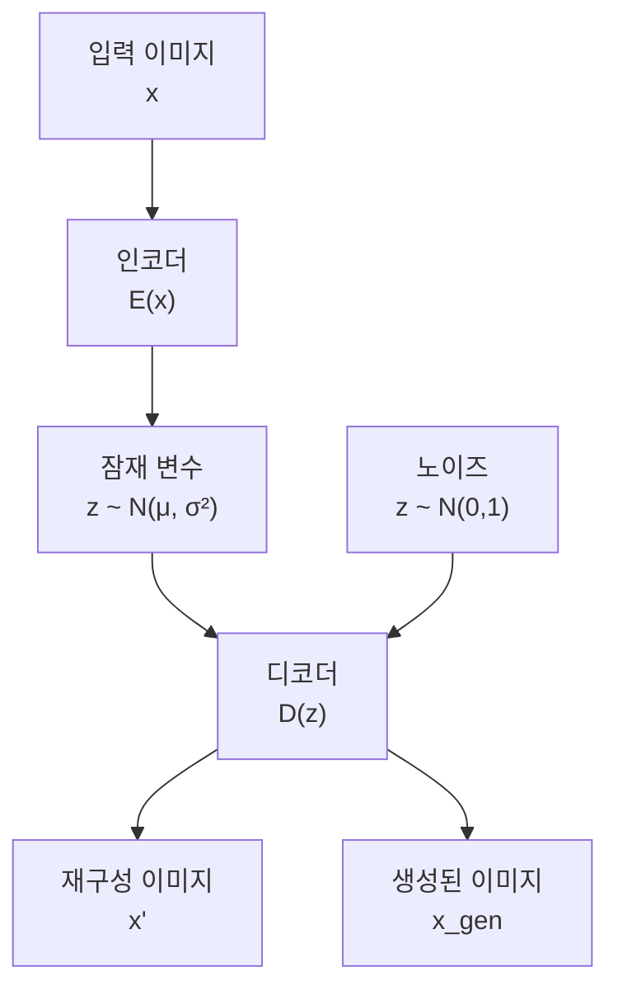
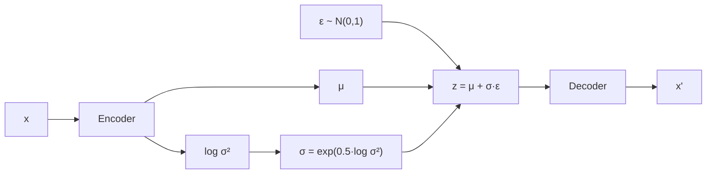

# 이미지 생성을 위한 VAE (Variational Autoencoder)

## 목차

1. [VAE 개요](#1-vae-개요)<br/>
   1.1. [VAE란 무엇인가?](#11-vae란-무엇인가)<br/>
   1.2. [기존 오토인코더와의 차이점](#12-기존-오토인코더와의-차이점)<br/>

2. [VAE의 수학적 기초](#2-vae의-수학적-기초)<br/>
   2.1. [확률론적 관점](#21-확률론적-관점)<br/>
   2.2. [변분 하한 (ELBO)](#22-변분-하한-elbo)<br/>
   2.3. [재매개변수 기법](#23-재매개변수-기법-reparameterization-trick)<br/>

3. [VAE 아키텍처](#3-vae-아키텍처)<br/>
   3.1. [인코더 (Encoder)](#31-인코더-encoder)<br/>
   3.2. [잠재 공간 (Latent Space)](#32-잠재-공간-latent-space)<br/>
   3.3. [디코더 (Decoder)](#33-디코더-decoder)<br/>

4. [VAE 손실 함수](#4-vae-손실-함수)<br/>
   4.1. [재구성 손실](#41-재구성-손실-reconstruction-loss)<br/>
   4.2. [KL 발산](#42-kl-발산-kullback-leibler-divergence)<br/>
   4.3. [베타-VAE](#43-베타-vae-β-vae)<br/>

5. [구현 예제](#5-구현-예제)<br/>
   5.1. [PyTorch 구현](#51-pytorch-구현)<br/>
   5.2. [학습 과정](#52-학습-과정)<br/>
   5.3. [결과 시각화](#53-결과-시각화)<br/>

6. [VAE의 응용](#6-vae의-응용)<br/>
   6.1. [이미지 생성](#61-이미지-생성)<br/>
   6.2. [이미지 보간](#62-이미지-보간-interpolation)<br/>
   6.3. [잠재 공간 조작](#63-잠재-공간-조작)<br/>

7. [VAE의 한계와 개선 방향](#7-vae의-한계와-개선-방향)<br/>

8. [용어 목록](#8-용어-목록)<br/>

---

## 1. VAE 개요

### 1.1. VAE란 무엇인가?

VAE(Variational Autoencoder, 베리에이셔널 오토인코더)는 **생성형 모델(Generative Model)**의 일종으로, 데이터의 확률 분포를 학습하여 새로운 데이터를 생성할 수 있는 딥러닝 모델입니다. 2013년 킹마(Kingma)와 웰링(Welling)에 의해 제안되었습니다.



VAE의 핵심 아이디어는 고차원의 복잡한 데이터(예: 이미지)를 저차원의 **잠재 공간(Latent Space)**으로 압축한 후, 이 잠재 공간에서 샘플링을 통해 새로운 데이터를 생성하는 것입니다.

### 1.2. 기존 오토인코더와의 차이점

전통적인 **오토인코더(Autoencoder)**는 단순히 입력을 재구성하는 것이 목표였다면, VAE는 다음과 같은 특징을 가집니다:

- **확률론적 접근**: 잠재 변수를 확률 분포로 모델링
- **생성 능력**: 학습된 잠재 공간에서 새로운 데이터 생성 가능
- **연속성**: 잠재 공간에서의 연속적인 변화가 의미 있는 변화로 나타남

## 2. VAE의 수학적 기초

### 2.1. 확률론적 관점

VAE는 다음과 같은 확률적 생성 모델을 가정합니다:

$$p_{\theta}(x) = \int p_{\theta}(x|z) p(z) dz$$

여기서:
- $x$: 관측된 데이터 (예: 이미지)
- $z$: 잠재 변수 (Latent Variable)
- $p(z)$: 잠재 변수의 사전 분포 (보통 $N(0, I)$)
- $p_{\theta}(x|z)$: 디코더가 모델링하는 조건부 분포

### 2.2. 변분 하한 (ELBO)

VAE는 로그 우도(Log-likelihood)를 직접 최적화하는 대신, **Evidence Lower BOund (ELBO, 엘보)**를 최적화합니다:

$$\mathcal{L}_{VAE} = \mathbb{E}_{q_{\phi}(z|x)}[\log p_{\theta}(x|z)] - D_{KL}(q_{\phi}(z|x) || p(z))$$

이는 다음 두 항의 합으로 구성됩니다:

1. **재구성 손실 (Reconstruction Loss)**: $\mathbb{E}_{q_{\phi}(z|x)}[\log p_{\theta}(x|z)]$
2. **KL 발산 (KL Divergence)**: $D_{KL}(q_{\phi}(z|x) || p(z))$

### 2.3. 재매개변수 기법 (Reparameterization Trick)

역전파를 가능하게 하기 위해 **재매개변수 기법(리패러미터라이제이션 트릭)**을 사용합니다:

$$z = \mu + \sigma \odot \epsilon$$

여기서:
- $\mu, \sigma$: 인코더가 출력하는 평균과 표준편차
- $\epsilon \sim N(0, I)$: 표준 정규 분포에서 샘플링한 노이즈
- $\odot$: 요소별 곱셈 (Element-wise multiplication)



## 3. VAE 아키텍처

### 3.1. 인코더 (Encoder)

인코더 $q_{\phi}(z|x)$는 입력 데이터 $x$를 받아 잠재 변수 $z$의 분포 매개변수를 출력합니다:

- **평균 벡터**: $\mu = f_{\mu}(x)$
- **분산 벡터**: $\sigma^2 = f_{\sigma}(x)$

일반적으로 가우시안 분포 $N(\mu, \sigma^2)$를 가정합니다.

### 3.2. 잠재 공간 (Latent Space)

잠재 공간은 고차원 데이터의 **압축된 표현(Compressed Representation)**입니다. 이 공간에서:

- 각 점은 하나의 데이터 샘플을 나타냄
- 가까운 점들은 유사한 특성을 가짐
- 연속적인 변화가 의미 있는 변화로 이어짐

### 3.3. 디코더 (Decoder)

디코더 $p_{\theta}(x|z)$는 잠재 변수 $z$로부터 원본 데이터와 유사한 데이터를 재구성합니다:

$$x' = g_{\theta}(z)$$

## 4. VAE 손실 함수

### 4.1. 재구성 손실 (Reconstruction Loss)

재구성 손실은 원본과 재구성된 데이터 간의 차이를 측정합니다:

**이진 이미지의 경우**:
$$\mathcal{L}_{recon} = -\sum_{i=1}^{D} x_i \log x'_i + (1-x_i) \log (1-x'_i)$$

**연속값 이미지의 경우**:
$$\mathcal{L}_{recon} = \frac{1}{2} ||x - x'||^2$$

### 4.2. KL 발산 (Kullback-Leibler Divergence)

KL 발산은 학습된 분포 $q_{\phi}(z|x)$와 사전 분포 $p(z) = N(0, I)$ 간의 차이를 측정합니다:

$$D_{KL}(q_{\phi}(z|x) || p(z)) = \frac{1}{2} \sum_{j=1}^{J} (1 + \log \sigma_j^2 - \mu_j^2 - \sigma_j^2)$$

이 항은 **정규화(Regularization)** 역할을 하여:
- 잠재 공간이 너무 복잡해지는 것을 방지
- 잠재 변수들이 표준 정규 분포를 따르도록 유도

### 4.3. 베타-VAE (β-VAE)

베타-VAE는 KL 발산에 가중치 $\beta$를 적용한 변형입니다:

$$\mathcal{L}_{\beta-VAE} = \mathcal{L}_{recon} + \beta \cdot D_{KL}(q_{\phi}(z|x) || p(z))$$

- $\beta > 1$: **해리(Disentanglement)** 향상, 재구성 품질 저하
- $\beta < 1$: 재구성 품질 향상, 해리 능력 저하

## 5. 구현 예제

### 5.1. PyTorch 구현

다음은 MNIST 데이터셋을 위한 간단한 VAE 구현입니다:

```python
import torch
import torch.nn as nn
import torch.nn.functional as F

class VAE(nn.Module):
    def __init__(self, latent_dim=20):
        super(VAE, self).__init__()
        
        # 인코더
        self.fc1 = nn.Linear(28*28, 400)
        self.fc_mu = nn.Linear(400, latent_dim)
        self.fc_logvar = nn.Linear(400, latent_dim)
        
        # 디코더
        self.fc3 = nn.Linear(latent_dim, 400)
        self.fc4 = nn.Linear(400, 28*28)
    
    def encode(self, x):
        h = F.relu(self.fc1(x))
        return self.fc_mu(h), self.fc_logvar(h)
    
    def reparameterize(self, mu, logvar):
        std = torch.exp(0.5 * logvar)
        eps = torch.randn_like(std)
        return mu + eps * std
    
    def decode(self, z):
        h = F.relu(self.fc3(z))
        return torch.sigmoid(self.fc4(h))
    
    def forward(self, x):
        mu, logvar = self.encode(x.view(-1, 28*28))
        z = self.reparameterize(mu, logvar)
        recon_x = self.decode(z)
        return recon_x, mu, logvar
```

### 5.2. 학습 과정

VAE의 손실 함수 구현:

```python
def vae_loss(recon_x, x, mu, logvar, beta=1.0):
    # 재구성 손실 (이진 교차 엔트로피)
    BCE = F.binary_cross_entropy(recon_x, x.view(-1, 28*28), 
                                reduction='sum')
    
    # KL 발산
    KLD = -0.5 * torch.sum(1 + logvar - mu.pow(2) - logvar.exp())
    
    return BCE + beta * KLD
```

학습 루프:

```python
model = VAE(latent_dim=20)
optimizer = torch.optim.Adam(model.parameters(), lr=1e-3)

for epoch in range(num_epochs):
    for batch_idx, (data, _) in enumerate(train_loader):
        optimizer.zero_grad()
        
        recon_batch, mu, logvar = model(data)
        loss = vae_loss(recon_batch, data, mu, logvar)
        
        loss.backward()
        optimizer.step()
```

### 5.3. 결과 시각화

**잠재 공간 시각화** (2차원인 경우):

```python
# 테스트 데이터의 잠재 표현 시각화
model.eval()
with torch.no_grad():
    for data, labels in test_loader:
        mu, logvar = model.encode(data.view(-1, 28*28))
        z = model.reparameterize(mu, logvar)
        
        plt.scatter(z[:, 0], z[:, 1], c=labels, cmap='tab10')
        plt.colorbar()
        plt.title('Latent Space Visualization')
        plt.show()
        break
```

## 6. VAE의 응용

### 6.1. 이미지 생성

잠재 공간에서 무작위 샘플링을 통한 새로운 이미지 생성:

```python
# 표준 정규 분포에서 샘플링
z_sample = torch.randn(64, latent_dim)
generated_images = model.decode(z_sample)
```

### 6.2. 이미지 보간 (Interpolation)

두 이미지 사이의 부드러운 전환:

```python
# 두 잠재 벡터 사이의 선형 보간
z1, z2 = encode_images(img1, img2)
alpha_values = torch.linspace(0, 1, 10)

interpolated_images = []
for alpha in alpha_values:
    z_interp = (1 - alpha) * z1 + alpha * z2
    img_interp = model.decode(z_interp)
    interpolated_images.append(img_interp)
```

### 6.3. 잠재 공간 조작

특정 속성을 제어하기 위한 잠재 벡터 조작:

```python
# 특정 방향으로 잠재 벡터 이동
direction_vector = compute_attribute_direction()
modified_z = original_z + 0.5 * direction_vector
modified_image = model.decode(modified_z)
```

## 7. VAE의 한계와 개선 방향

VAE는 강력한 생성 모델이지만 다음과 같은 한계점들이 있습니다:

**한계점들**:
- **흐릿한 생성 결과**: 재구성 손실로 인한 평균화 효과
- **사후 붕괴(Posterior Collapse)**: KL 항이 0에 가까워지는 현상
- **표현력의 제한**: 가우시안 가정의 한계

**개선 방향들**:
- **WAE (Wasserstein AutoEncoder)**: 다른 거리 메트릭 사용
- **β-VAE**: 해리된 표현 학습을 위한 베타 가중치 조정
- **VQ-VAE (Vector Quantized VAE)**: 이산적 잠재 공간 사용
- **Conditional VAE**: 조건부 생성을 위한 라벨 정보 활용

## 8. 용어 목록

| 용어 | 설명 |
|------|------|
| Autoencoder | 입력 데이터를 압축했다가 복원하는 신경망 구조 |
| Beta-VAE | KL 발산에 가중치를 적용한 VAE 변형 |
| Decoder | 잠재 변수를 원본 데이터로 복원하는 네트워크 |
| Disentanglement | 잠재 변수의 각 차원이 독립적인 의미를 가지는 특성 |
| ELBO | Evidence Lower BOund, 변분 하한 |
| Encoder | 입력 데이터를 잠재 변수로 변환하는 네트워크 |
| Generative Model | 새로운 데이터를 생성할 수 있는 모델 |
| Interpolation | 두 데이터 포인트 사이의 중간값들을 생성하는 기법 |
| KL Divergence | 쿨백-라이블러 발산, 두 확률 분포 간의 차이를 측정 |
| Latent Space | 고차원 데이터의 저차원 압축 표현 공간 |
| Latent Variable | 관측되지 않는 숨겨진 변수 |
| Posterior Collapse | 사후 분포가 사전 분포와 동일해지는 현상 |
| Reconstruction Loss | 원본과 재구성된 데이터 간의 차이를 나타내는 손실 |
| Reparameterization Trick | 확률적 노드를 미분 가능하게 만드는 기법 |
| Variational Inference | 복잡한 사후 분포를 근사하는 베이지안 추론 기법 |