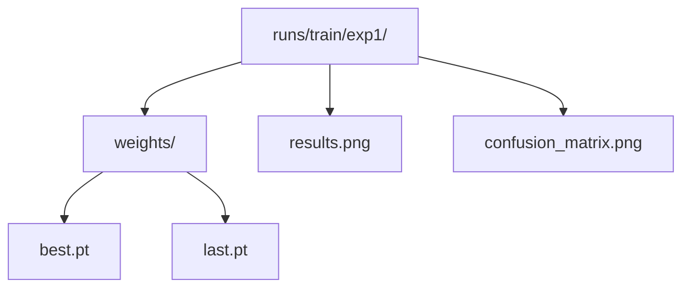

# PyTorch YOLO 실무 가이드

## 목차
1. [YOLO 시작하기](#1-yolo-시작하기)<br/>
2. [모델 선택](#2-모델-선택)<br/>
3. [데이터 준비](#3-데이터-준비)<br/>
4. [훈련하기](#4-훈련하기)<br/>
5. [추론하기](#5-추론하기)<br/>
6. [콜백과 모니터링](#6-콜백과-모니터링)<br/>
7. [상황별 활용법](#7-상황별-활용법)<br/>
8. [부록 A: 빠른 시작](#8-부록-a-빠른-시작)<br/>
9. [부록 B: 자주 쓰는 설정](#9-부록-b-자주-쓰는-설정)<br/>
10. [부록 C: 의료용 특화](#10-부록-c-의료용-특화)<br/>
11. [용어 목록](#11-용어-목록)<br/>

---

## 1. YOLO 시작하기

### 1.1. YOLO란?

YOLO(You Only Look Once)는 실시간 객체 탐지 알고리즘입니다. 이미지를 한 번만 보고 모든 객체를 찾아내는 것이 특징입니다.

**왜 YOLO인가?**
- 빠름: 실시간 처리 가능 (30+ FPS)
- 간단함: 코드 3줄로 시작 가능
- 정확함: 최신 버전은 높은 정확도 제공

### 1.2. 설치

```bash
pip install ultralytics
```

### 1.3. 3줄로 시작하기

```python
from ultralytics import YOLO

model = YOLO('yolov8n.pt')
results = model('image.jpg')
results[0].show()
```


---

## 2. 모델 선택

### 2.1. 모델 크기별 특성

```python
# 속도 우선
model = YOLO('yolov8n.pt')    # 가장 빠름

# 균형
model = YOLO('yolov8s.pt')    # 적당한 속도와 정확도

# 정확도 우선  
model = YOLO('yolov8m.pt')    # 높은 정확도
model = YOLO('yolov8l.pt')    # 더 높은 정확도
model = YOLO('yolov8x.pt')    # 최고 정확도
```

### 2.2. 용도별 모델

| 용도 | 모델 | 특징 |
|------|------|------|
| 실시간 웹캠 | yolov8n.pt | 빠른 속도 |
| 모바일 앱 | yolov8n.pt | 가벼움 |
| 보안 카메라 | yolov8s.pt | 속도와 정확도 균형 |
| 의료 진단 | yolov8l.pt | 높은 정확도 |
| 자율주행 | yolov8x.pt | 최고 성능 |

### 2.3. 특수 목적 모델

```python
# 분할 (세그멘테이션 Segmentation)
model = YOLO('yolov8n-seg.pt')

# 분류
model = YOLO('yolov8n-cls.pt')

# 포즈 추정
model = YOLO('yolov8n-pose.pt')
```

---

## 3. 데이터 준비

### 3.1. 폴더 구조

```
dataset/
├── images/
│   ├── train/
│   └── val/
├── labels/
│   ├── train/
│   └── val/
└── data.yaml
```

### 3.2. data.yaml 파일

```yaml
path: ./dataset
train: images/train
val: images/val

nc: 3
names: ['person', 'car', 'bike']
```

### 3.3. 라벨 형식

각 이미지마다 같은 이름의 .txt 파일:
```
0 0.5 0.5 0.8 0.9
1 0.3 0.2 0.1 0.15
```
형식: `클래스_ID 중심x 중심y 너비 높이` (모두 0~1로 정규화)

---

## 4. 훈련하기

### 4.1. 기본 훈련

```python
model = YOLO('yolov8n.pt')
results = model.train(data='data.yaml', epochs=100)
```

### 4.2. 주요 옵션

```python
# 자주 사용하는 설정
results = model.train(
    data='data.yaml',
    epochs=100,
    batch=16,
    imgsz=640,
    device=0,       # GPU 번호
    workers=8,      # 데이터 로더 워커 수
    project='runs', # 결과 저장 폴더
    name='exp1'     # 실험 이름
)
```

### 4.3. 훈련 재개

```python
# 중단된 훈련 이어가기
model = YOLO('runs/train/exp1/weights/last.pt')
results = model.train(resume=True)
```

### 4.4. 훈련 결과 폴더



---

## 5. 추론하기

### 5.1. 다양한 입력

```python
model = YOLO('best.pt')

# 파일
results = model('image.jpg')

# 폴더
results = model('images/')

# 웹캠
results = model(0)

# PIL 이미지
from PIL import Image
img = Image.open('image.jpg')
results = model(img)

# NumPy 배열
import cv2
img = cv2.imread('image.jpg')
results = model(img)
```

### 5.2. 결과 처리

```python
results = model('image.jpg')

# 결과 출력
for result in results:
    boxes = result.boxes
    for box in boxes:
        print(f"클래스: {model.names[int(box.cls)]}")
        print(f"신뢰도: {box.conf:.2f}")
        print(f"좌표: {box.xyxy}")

# 결과 저장
results[0].save('result.jpg')

# 결과 표시
results[0].show()
```

### 5.3. 실시간 처리

```python
import cv2

model = YOLO('yolov8n.pt')
cap = cv2.VideoCapture(0)

while True:
    ret, frame = cap.read()
    if ret:
        results = model(frame)
        annotated_frame = results[0].plot()
        cv2.imshow('YOLO', annotated_frame)
        
        if cv2.waitKey(1) & 0xFF == ord('q'):
            break

cap.release()
cv2.destroyAllWindows()
```

---

## 6. 콜백과 모니터링

### 6.1. 기본 콜백

```python
def my_callback(trainer):
    print(f"에포크 {trainer.epoch} 완료")
    print(f"손실: {trainer.loss}")

model.add_callback("on_train_epoch_end", my_callback)
```

### 6.2. 유용한 콜백들

```python
# GPU 메모리 정리
def cleanup_callback(trainer):
    if torch.cuda.is_available():
        torch.cuda.empty_cache()

# 체크포인트 저장
def checkpoint_callback(trainer):
    if trainer.epoch % 50 == 0:
        trainer.save_model(f"checkpoint_{trainer.epoch}.pt")

# 학습률 모니터링
def lr_callback(trainer):
    lr = trainer.optimizer.param_groups[0]['lr']
    print(f"학습률: {lr:.6f}")

# 콜백 등록
model.add_callback("on_train_epoch_end", cleanup_callback)
model.add_callback("on_train_epoch_end", checkpoint_callback)
model.add_callback("on_train_epoch_end", lr_callback)
```

### 6.3. 조기 종료 콜백

```python
class EarlyStop:
    def __init__(self, patience=30):
        self.patience = patience
        self.best_loss = float('inf')
        self.counter = 0
    
    def __call__(self, trainer):
        if trainer.loss < self.best_loss:
            self.best_loss = trainer.loss
            self.counter = 0
        else:
            self.counter += 1
            
        if self.counter >= self.patience:
            print("조기 종료!")
            trainer.stop_training = True

early_stop = EarlyStop(patience=20)
model.add_callback("on_train_epoch_end", early_stop)
```

---

## 7. 상황별 활용법

### 7.1. 실시간 카메라 (성능 최적화)

```python
model = YOLO('yolov8n.pt')

# 성능 최적화 설정
results = model(
    frame,
    conf=0.5,      # 신뢰도 임계값
    iou=0.5,       # IoU 임계값  
    max_det=100,   # 최대 탐지 수
    device=0,      # GPU 사용
    half=True      # FP16 사용
)
```

### 7.2. 이미지 분류

```python
# 분류 모델 사용
model = YOLO('yolov8n-cls.pt')

results = model.train(
    data='classification_dataset',
    epochs=100,
    imgsz=224,    # 분류는 224x224 권장
    batch=64      # 분류는 큰 배치 가능
)
```

### 7.3. 특정 클래스만 탐지

```python
# 사람만 탐지 (COCO 클래스 0번)
results = model('image.jpg', classes=[0])

# 차량 관련만 탐지 (자동차, 버스, 트럭)
results = model('image.jpg', classes=[2, 5, 7])
```

### 7.4. 배치 처리

```python
import glob

# 폴더 내 모든 이미지 처리
image_paths = glob.glob('images/*.jpg')
results = model(image_paths)

for i, result in enumerate(results):
    result.save(f'result_{i}.jpg')
```

---

## 8. 부록 A: 빠른 시작

### 8.1. 30초 시작

```python
from ultralytics import YOLO

# 1. 모델 로드
model = YOLO('yolov8n.pt')

# 2. 훈련 (데이터가 준비되어 있다면)
model.train(data='data.yaml', epochs=50)

# 3. 추론
model('test.jpg')[0].show()
```

### 8.2. 원라이너

```python
# 훈련부터 추론까지 한 줄
YOLO('yolov8n.pt').train(data='data.yaml', epochs=50)('test.jpg')[0].show()
```

---

## 9. 부록 B: 자주 쓰는 설정

### 9.1. 빠른 실험용

```python
model.train(
    data='data.yaml',
    epochs=50,
    batch=16,
    imgsz=416,     # 작은 이미지
    cache=True,    # 이미지 캐싱
    device=0
)
```

### 9.2. 고품질 훈련용

```python
model.train(
    data='data.yaml',
    epochs=300,
    batch=8,       # 작은 배치
    imgsz=1024,    # 큰 이미지
    patience=100,  # 긴 인내심
    lr0=0.001      # 낮은 학습률
)
```

### 9.3. 메모리 절약용

```python
model.train(
    data='data.yaml',
    epochs=100,
    batch=4,       # 매우 작은 배치
    imgsz=320,     # 작은 이미지
    workers=2,     # 적은 워커
    amp=True       # 혼합 정밀도
)
```

---

## 10. 부록 C: 의료용 특화

### 10.1. 알약 탐지 전처리

```python
from PIL import Image, ImageEnhance

def enhance_pill_image(image_path):
    """알약 이미지 품질 향상"""
    img = Image.open(image_path)
    
    # 선명도 향상
    enhancer = ImageEnhance.Sharpness(img)
    img = enhancer.enhance(1.5)
    
    # 대비 향상
    enhancer = ImageEnhance.Contrast(img)
    img = enhancer.enhance(1.2)
    
    return img
```

### 10.2. 알약 특화 훈련

```python
# 알약 탐지 최적화 설정
model.train(
    data='pill_data.yaml',
    epochs=200,
    imgsz=1024,       # 고해상도
    
    # 색상 변화 최소화 (알약 색상 중요)
    hsv_h=0.01,
    hsv_s=0.3,
    hsv_v=0.2,
    
    # 회전 증강 (알약은 모든 각도 가능)
    degrees=360,
    
    # 모자이크/믹스업 비활성화 (의료용)
    mosaic=0.0,
    mixup=0.0
)
```

### 10.3. 식별 결과 처리

```python
def identify_pills(image_path):
    """알약 식별 및 정보 반환"""
    results = model(image_path, conf=0.8)  # 높은 신뢰도
    
    pill_info = []
    for result in results:
        boxes = result.boxes
        if boxes is not None:
            for box in boxes:
                pill_data = {
                    'name': model.names[int(box.cls)],
                    'confidence': float(box.conf),
                    'location': box.xyxy.tolist()
                }
                pill_info.append(pill_data)
    
    return pill_info
```

---

## 11. 용어 목록

| 용어 | 설명 |
|------|------|
| **Augmentation** | 데이터를 인위적으로 변형하여 훈련 데이터를 늘리는 기법 |
| **Batch Size** | 한 번에 처리하는 데이터 샘플 수 |
| **Bounding Box** | 객체를 둘러싸는 직사각형 영역 |
| **Callback** | 특정 시점에 자동으로 실행되는 함수 |
| **Confidence** | 모델이 예측에 대해 갖는 신뢰도 (0~1) |
| **Epoch** | 전체 훈련 데이터를 한 번 학습하는 단위 |
| **FP16** | 16비트 부동소수점, 메모리 절약과 속도 향상 |
| **IoU** | Intersection over Union, 박스 겹침 정도 측정 |
| **Learning Rate** | 모델 가중치 업데이트 크기를 조절하는 값 |
| **mAP** | mean Average Precision, 객체 탐지 성능 지표 |
| **NMS** | Non-Maximum Suppression, 중복 탐지 제거 기법 |
| **Precision** | 정밀도, 예측한 양성 중 실제 양성 비율 |
| **Recall** | 재현율, 실제 양성 중 탐지한 양성 비율 |
| **Resume** | 중단된 훈련을 이어서 계속하는 기능 |
| **Segmentation** | 객체의 정확한 경계를 픽셀 단위로 구분 |
| **Transfer Learning** | 사전 훈련된 모델을 새 작업에 활용하는 기법 |
| **Validation** | 훈련 중 모델 성능을 확인하는 평가 과정 |
| **YOLO** | You Only Look Once, 실시간 객체 탐지 알고리즘 |