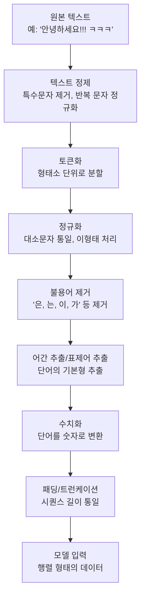

# 텍스트 데이터 전처리 (Text Data Preprocessing)

자연어 처리(NLP, Natural Language Processing)에서 텍스트 데이터를 딥러닝 모델에 적용하기 전에 수행하는 전처리 과정에 대해 설명드리겠습니다.<br/>
특히 한국어의 특성을 고려한 접근 방법을 중심으로 다루겠습니다.

---

## 목차

1. [텍스트 전처리의 필요성](#1-텍스트-전처리의-필요성)<br/>
2. [한국어 텍스트 전처리 파이프라인](#2-한국어-텍스트-전처리-파이프라인)<br/>
3. [세부 전처리 단계](#3-세부-전처리-단계)<br/>
   - [3.1. 텍스트 정제](#31-텍스트-정제-text-cleaning)<br/>
   - [3.2. 토큰화](#32-토큰화-tokenization)<br/>
   - [3.3. 정규화](#33-정규화-normalization)<br/>
   - [3.4. 불용어 제거](#34-불용어-제거-stopword-removal)<br/>
   - [3.5. 어간 추출과 표제어 추출](#35-어간-추출과-표제어-추출)<br/>
   - [3.6. 수치화](#36-수치화-numericalization)<br/>
   - [3.7. 패딩과 트런케이션](#37-패딩과-트런케이션-padding--truncation)<br/>
4. [한국어 특화 전처리 고려사항](#4-한국어-특화-전처리-고려사항)<br/>
5. [주요 라이브러리 소개](#5-주요-라이브러리-소개)<br/>
6. [전처리 시 주의사항](#6-전처리-시-주의사항)<br/>
7. [최신 트렌드](#7-최신-트렌드)<br/>
8. [용어 목록](#용어-목록)<br/>

---

## 1. 텍스트 전처리의 필요성

딥러닝 모델은 수치 데이터만 처리할 수 있기 때문에, 텍스트를 모델이 이해할 수 있는 형태로 변환해야 합니다. 또한 노이즈(noise)를 제거하고 일관성을 확보하여 모델의 학습 효율과 성능을 향상시킵니다.

텍스트 전처리는 다음과 같은 이유로 중요합니다.<br/>
첫째, 원시 텍스트에는 특수문자, HTML 태그, 이모티콘(emoticon) 등 모델 학습에 불필요한 요소들이 포함되어 있습니다.<br/>
둘째, 동일한 의미를 가진 단어들이 다양한 형태로 표현될 수 있어 이를 통일해야 합니다.<br/>
셋째, 모델의 입력 형식에 맞게 데이터를 변환해야 합니다.

---

## 2. 한국어 텍스트 전처리 파이프라인



---

## 3. 세부 전처리 단계

### 3.1. 텍스트 정제 (Text Cleaning)

원본 텍스트에서 불필요한 요소를 제거하는 단계입니다. 이 과정을 통해 모델이 학습해야 할 패턴(pattern)에 집중할 수 있도록 돕습니다.

#### 3.1.1. 특수문자 및 기호 제거

HTML 태그, 이모티콘, 특수 기호 등을 제거합니다. 특히 웹에서 수집한 데이터는 HTML 태그가 포함되어 있는 경우가 많습니다.

**예시:**
```
입력: "안녕하세요!!! ㅋㅋㅋ 오늘 날씨 좋네요~~ <div>HTML태그</div>"
출력: "안녕하세요 ㅋㅋ 오늘 날씨 좋네요 HTML태그"
```

**Python 정규표현식(Regular Expression) 사용:**

정규표현식은 특정 패턴을 가진 문자열을 찾거나 치환하는 도구입니다. `re` 모듈은 파이썬 표준 라이브러리로 별도 설치가 필요 없습니다.

```python
import re

text = "안녕하세요!!! <div>태그</div>"
text = re.sub(r'<[^>]+>', '', text)  # HTML 태그 제거
# re.sub(패턴, 치환할문자, 대상문자열)
```

#### 3.1.2. 반복 문자 정규화

한국어에서 자주 나타나는 반복 표현을 정규화합니다. "ㅋㅋㅋㅋㅋ", "안녕하세요오오오" 같은 표현들이 모두 다른 단어로 인식되는 것을 방지합니다.

**예시:**
```
입력: "ㅋㅋㅋㅋㅋ 진짜아아아 재미있어요오오"
출력: "ㅋㅋ 진짜아 재미있어요오"
```

정규표현식 패턴 `(.)\1{2,}`은 동일한 문자가 3번 이상 반복되는 경우를 찾아 2번만 반복하도록 변경합니다.

#### 3.1.3. 공백 정규화

연속된 공백을 하나로 통일하고 문장 앞뒤의 불필요한 공백을 제거합니다.

**예시:**
```
입력: "  자연어    처리는   재미있어요  "
출력: "자연어 처리는 재미있어요"
```

---

### 3.2. 토큰화 (Tokenization)

텍스트를 의미 있는 단위로 분할하는 과정입니다. 한국어는 교착어(agglutinative language)로서 형태소(morpheme) 단위 분석이 중요합니다. 영어는 공백 기준으로 단어를 쉽게 분리할 수 있지만, 한국어는 조사(은, 는, 이, 가)가 단어에 붙어 있어 형태소 분석기가 필요합니다.

#### 3.2.1. 형태소 분석기 선택

**KoNLPy (Korean Natural Language Processing in Python)**

KoNLPy는 한국어 형태소 분석을 위한 파이썬 패키지입니다. 여러 형태소 분석 엔진을 통합하여 제공합니다.

**설치 방법:**
```bash
pip install konlpy
# Java가 설치되어 있어야 합니다
```

**주요 분석기 비교:**

| 분석기 | 특징 | 속도 | 정확도 |
|--------|------|------|--------|
| Okt (Twitter) | 트위터 한국어 처리에 최적화, 신조어 처리 우수 | 빠름 | 중간 |
| Komoran | 공공 데이터에 많이 사용 | 중간 | 높음 |
| Mecab | 가장 빠른 속도 | 매우 빠름 | 높음 |
| Hannanum | 가장 오래된 분석기 | 느림 | 높음 |
| Kkma | 문장 분리 기능 제공 | 매우 느림 | 매우 높음 |

**Okt 사용 예시:**

```python
from konlpy.tag import Okt

okt = Okt()
text = "자연어처리는 정말 재미있어요"

# 형태소 단위로 분리
tokens = okt.morphs(text)
# 결과: ['자연어', '처리', '는', '정말', '재미있어요']

# 명사만 추출
nouns = okt.nouns(text)
# 결과: ['자연어', '처리']
```

#### 3.2.2. 품사 태깅 (POS Tagging)

각 토큰의 품사(Part-of-Speech) 정보를 활용하여 필요한 품사만 선택할 수 있습니다. 품사는 단어의 문법적 역할을 나타냅니다.

**주요 품사 태그:**
- Noun: 명사
- Verb: 동사
- Adjective: 형용사
- Adverb: 부사
- Josa: 조사

**예시:**
```python
from konlpy.tag import Okt

okt = Okt()
text = "자연어처리는 정말 재미있어요"

pos_tags = okt.pos(text)
# 결과: [('자연어', 'Noun'), ('처리', 'Noun'), ('는', 'Josa'), 
#        ('정말', 'Adverb'), ('재미있어요', 'Adjective')]

# 명사와 동사만 추출
nouns_verbs = [word for word, pos in pos_tags if pos in ['Noun', 'Verb']]
# 결과: ['자연어', '처리']
```

#### 3.2.3. 서브워드 토큰화

**SentencePiece (센텐스피스) 라이브러리**

SentencePiece는 구글에서 개발한 언어 독립적인 토큰화(tokenization) 도구입니다. 단어 단위가 아닌 서브워드(subword) 단위로 분할하여 OOV(Out-of-Vocabulary, 어휘 집합에 없는 단어) 문제를 완화합니다.

**특징:**
- 공백이 없는 언어(한국어, 일본어, 중국어)에도 효과적
- BPE(Byte Pair Encoding), Unigram 알고리즘 지원
- 신조어나 복합어 처리에 강점

**설치 방법:**
```bash
pip install sentencepiece
```

**간단한 사용법:**
```python
import sentencepiece as spm

# 1. 모델 학습 (코퍼스 필요)
spm.SentencePieceTrainer.train(
    '--input=corpus.txt --model_prefix=m --vocab_size=8000'
)

# 2. 학습된 모델로 토큰화
sp = spm.SentencePieceProcessor()
sp.load('m.model')

tokens = sp.encode_as_pieces("자연어처리")
# 결과: ['▁자연', '어', '처리']
# ▁는 공백을 의미하는 특수 기호
```

**서브워드 토큰화의 장점:**
```
기존 단어 단위: "자연어처리" -> ["자연어처리"] (어휘에 없으면 <UNK>)
서브워드 단위: "자연어처리" -> ["자연", "어", "처리"] (항상 표현 가능)
```

---

### 3.3. 정규화 (Normalization)

동일한 의미를 가진 다양한 표현을 하나로 통일하는 과정입니다.

#### 3.3.1. 대소문자 통일

영어가 혼재된 경우 대소문자를 통일합니다. 일반적으로 소문자로 변환하지만, 고유명사를 구분해야 하는 경우 원본을 유지하기도 합니다.

**예시:**
```
입력: "NLP는 Natural Language Processing의 약자입니다"
출력: "nlp는 natural language processing의 약자입니다"
```

#### 3.3.2. 이형태 통일

같은 의미를 가진 다양한 표현을 하나로 통일합니다. 특히 한국어에서는 축약어와 인터넷 용어가 많습니다.

**축약어 변환 예시:**
```
ㅇㅇ → 응응
ㄴㄴ → 노노
ㅋㅋ → 크크
ㅎㅎ → 하하
ㄱㅅ → 감사
ㅇㅈ → 인정
```

#### 3.3.3. 맞춤법 교정

**Py-Hanspell 라이브러리**

네이버 맞춤법 검사기를 활용한 파이썬 라이브러리입니다.

**설치 방법:**
```bash
pip install py-hanspell
```

**사용 예시:**
```python
from hanspell import spell_checker

result = spell_checker.check("안녕 하세요")
print(result.checked)
# 결과: "안녕하세요"
```

**주의사항:** 외부 API를 사용하므로 대량의 텍스트 처리 시 속도가 느릴 수 있습니다.

---

### 3.4. 불용어 제거 (Stopword Removal)

의미가 적거나 너무 빈번하게 등장하여 모델 성능에 도움이 되지 않는 단어를 제거합니다. 불용어는 조사(은, 는, 이, 가), 접속사(그리고, 그러나), 대명사(이것, 저것) 등이 포함됩니다.

**불용어 제거의 효과:**
- 어휘 집합(vocabulary) 크기 감소
- 학습 시간 단축
- 의미 있는 단어에 집중

**예시:**
```
입력: "자연어처리는 인공지능의 핵심 분야입니다"
불용어 제거: "자연어처리 인공지능 핵심 분야"
```

**한국어 불용어 리스트 예시:**
```python
stopwords = [
    '은', '는', '이', '가', '을', '를', '에', '의', '와', '과',
    '도', '으로', '로', '에서', '께서', '만', '부터', '까지',
    '하다', '있다', '되다', '이다'
]
```

**실제 적용:**
```python
from konlpy.tag import Okt

okt = Okt()
stopwords = ['은', '는', '이', '가', '을', '를']

text = "자연어처리는 인공지능의 핵심 분야입니다"
tokens = okt.morphs(text)
filtered_tokens = [token for token in tokens if token not in stopwords]
# 결과: ['자연어', '처리', '인공지능', '핵심', '분야', '입니다']
```

**주의사항:** 태스크(task)에 따라 불용어를 제거하지 않는 것이 더 나을 수 있습니다. 예를 들어, 감성 분석에서 "안", "못"과 같은 부정어는 중요한 의미를 가집니다.

---

### 3.5. 어간 추출과 표제어 추출

#### 3.5.1. 어간 추출 (Stemming)

단어의 어간(stem)을 추출합니다. 어간은 단어에서 어미를 제거한 핵심 부분입니다. 한국어는 교착어 특성상 어미 변화가 복잡하여 형태소 분석이 필수적입니다.

**예시:**
```
아름답다 → 아름답
아름다운 → 아름답
아름답게 → 아름답
```

**KoNLPy를 통한 어간 추출:**
```python
from konlpy.tag import Okt

okt = Okt()
text = "아름다운 꽃이 아름답게 피었어요"

# stem=True 옵션으로 어간 추출
morphs = okt.morphs(text, stem=True)
# 결과: ['아름답', '꽃', '이', '아름답', '피다']
```

#### 3.5.2. 표제어 추출 (Lemmatization)

단어를 사전적 기본형으로 변환합니다. 어간 추출보다 정확하지만 처리 시간이 더 걸립니다.

**예시:**
```
가다, 갔다, 가요, 갑니다 → 가다
먹다, 먹었다, 먹어요, 먹습니다 → 먹다
```

한국어의 경우 형태소 분석기가 표제어 추출 기능을 어느 정도 수행합니다.

---

### 3.6. 수치화 (Numericalization)

텍스트를 숫자로 변환하는 과정입니다. 딥러닝 모델은 텍스트를 직접 이해할 수 없으므로 숫자로 인코딩(encoding)해야 합니다.

#### 3.6.1. 정수 인코딩 (Integer Encoding)

각 단어에 고유한 정수 인덱스(index)를 부여합니다.

**Keras Tokenizer 사용**

Keras는 딥러닝 라이브러리로, 텍스트 전처리를 위한 `Tokenizer` 클래스를 제공합니다.

**설치 방법:**
```bash
pip install tensorflow  # Keras는 TensorFlow에 포함되어 있습니다
```

**사용 예시:**
```python
from tensorflow.keras.preprocessing.text import Tokenizer

texts = ["자연어 처리는 재미있어요", "딥러닝을 공부하고 있어요"]

# 토크나이저 생성 및 학습
tokenizer = Tokenizer()
tokenizer.fit_on_texts(texts)

# 텍스트를 정수 시퀀스로 변환
sequences = tokenizer.texts_to_sequences(texts)
# 결과: [[1, 2, 3], [4, 5, 6]]

# 단어-인덱스 사전 확인
word_index = tokenizer.word_index
# 결과: {'자연어': 1, '처리는': 2, '재미있어요': 3, ...}
```

**주요 파라미터(parameter):**
- `num_words`: 사용할 최대 단어 개수 (빈도수 기준 상위 N개)
- `oov_token`: 어휘에 없는 단어를 나타내는 토큰

#### 3.6.2. 원-핫 인코딩 (One-Hot Encoding)

각 단어를 이진 벡터(binary vector)로 표현합니다. 벡터의 길이는 어휘 집합 크기와 같으며, 해당 단어의 인덱스만 1이고 나머지는 0입니다.

**예시:**
```
어휘 집합 크기 = 10,000
"자연어" (인덱스 = 1) → [0, 1, 0, 0, ..., 0]
"처리" (인덱스 = 2) → [0, 0, 1, 0, ..., 0]
```

**수식 표현:**

어휘 집합 크기가 $V$일 때, 인덱스 $i$인 단어의 원-핫 벡터는:

$$
\mathbf{v}_i = [0, 0, ..., 0, \underbrace{1}_{\text{i번째}}, 0, ..., 0] \in \mathbb{R}^V
$$

**단점:** 어휘 집합이 커질수록 벡터 크기가 커지고, 단어 간 유사도를 표현할 수 없습니다.

#### 3.6.3. 워드 임베딩 (Word Embedding)

단어를 밀집 벡터(dense vector) 공간에 매핑합니다. 의미가 유사한 단어들은 벡터 공간에서 가까운 위치에 배치됩니다.

**Word2Vec**

Word2Vec은 구글에서 개발한 단어 임베딩 기법입니다. CBOW(Continuous Bag of Words)와 Skip-gram 두 가지 알고리즘을 제공합니다.

**Gensim 라이브러리 사용**

Gensim은 토픽 모델링(topic modeling)과 단어 임베딩을 위한 라이브러리입니다.

**설치 방법:**
```bash
pip install gensim
```

**사용 예시:**
```python
from gensim.models import Word2Vec

# 문장들을 토큰 리스트로 준비
sentences = [
    ['자연어', '처리'],
    ['딥러닝', '학습'],
    ['자연어', '딥러닝']
]

# Word2Vec 모델 학습
model = Word2Vec(
    sentences,
    vector_size=100,  # 벡터 차원
    window=5,         # 문맥 윈도우 크기
    min_count=1,      # 최소 등장 횟수
    workers=4         # 병렬 처리 스레드 수
)

# 단어 벡터 추출
vector = model.wv['자연어']
# 결과: 100차원 벡터 [0.123, -0.456, ...]

# 유사 단어 찾기
similar = model.wv.most_similar('자연어', topn=3)
```

**사전 학습된 임베딩 활용:**

- **FastText**: 서브워드 정보를 활용하여 OOV 문제 완화
- **KoBERT**: 한국어 특화 BERT 모델
- **KoGPT**: 한국어 생성형 모델

---

### 3.7. 패딩과 트런케이션 (Padding & Truncation)

딥러닝 모델은 배치(batch) 단위로 데이터를 처리하므로, 모든 시퀀스(sequence)의 길이가 동일해야 합니다.

**패딩(Padding):** 짧은 시퀀스에 0을 추가하여 길이를 맞춤  
**트런케이션(Truncation):** 긴 시퀀스를 잘라서 길이를 맞춤

#### 3.7.1. 패딩 예시

```
원본 시퀀스:
시퀀스 1: [1, 2, 3]
시퀀스 2: [4, 5]
시퀀스 3: [6, 7, 8, 9, 10]

최대 길이 5로 패딩 후 (짧은 문장에 0 추가):
시퀀스 1: [1, 2, 3, 0, 0]
시퀀스 2: [4, 5, 0, 0, 0]
시퀀스 3: [6, 7, 8, 9, 10]
```

#### 3.7.2. 트런케이션 예시

```
원본 시퀀스:
시퀀스 3: [6, 7, 8, 9, 10, 11, 12]

최대 길이 5로 트런케이션 후 (긴 문장 자름):
시퀀스 3: [6, 7, 8, 9, 10]  (뒤의 11, 12는 제거됨)
```

**Keras pad_sequences 사용**

```python
from tensorflow.keras.preprocessing.sequence import pad_sequences

sequences = [[1, 2, 3], [4, 5], [6, 7, 8, 9, 10]]

# 패딩 적용
padded = pad_sequences(
    sequences,
    maxlen=5,           # 최대 길이
    padding='post',     # 'pre' (앞에 패딩) 또는 'post' (뒤에 패딩)
    truncating='post',  # 'pre' (앞에서 자름) 또는 'post' (뒤에서 자름)
    value=0             # 패딩에 사용할 값
)

print(padded)
# 결과:
# [[1, 2, 3, 0, 0],
#  [4, 5, 0, 0, 0],
#  [6, 7, 8, 9, 10]]
```

**파라미터 설명:**
- `maxlen`: 시퀀스의 최대 길이
- `padding`: 'pre'는 앞쪽에 0을 추가, 'post'는 뒤쪽에 0을 추가
- `truncating`: 'pre'는 앞부분을 자름, 'post'는 뒷부분을 자름
- `value`: 패딩에 사용할 값 (기본값은 0)

#### 3.7.3. 최대 길이 결정 방법

데이터셋의 시퀀스 길이 분포를 분석하여 최대 길이를 결정합니다.

```python
import numpy as np

# 시퀀스 길이 분포 확인
sequence_lengths = [len(seq) for seq in sequences]

print(f"평균 길이: {np.mean(sequence_lengths)}")
print(f"중간값: {np.median(sequence_lengths)}")
print(f"95 백분위수: {np.percentile(sequence_lengths, 95)}")

# 95%의 데이터를 커버하는 길이를 최대 길이로 설정
max_len = int(np.percentile(sequence_lengths, 95))
```

---

## 4. 한국어 특화 전처리 고려사항

### 4.1. 한영 혼용 텍스트 처리

한국어와 영어가 혼재된 텍스트를 처리합니다. 한국에서는 "NLP 자연어처리", "AI 인공지능"처럼 한글과 영어를 함께 사용하는 경우가 매우 흔합니다.

**처리 방법:**
1. 한글과 영어를 함께 토큰화
2. 영어는 소문자로 정규화
3. 필요시 영어는 별도로 처리 후 병합

**예시:**
```
입력: "NLP는 자연어처리입니다"
처리 후: ["nlp", "는", "자연어", "처리", "입니다"]
```

### 4.2. 신조어 및 인터넷 용어 처리

신조어는 기존 형태소 분석기의 사전에 등록되어 있지 않아 제대로 분석되지 않을 수 있습니다.

**대표적인 신조어 예시:**
- 갓생 (신을 뜻하는 God + 생활의 합성어)
- 가심비 (가격 대비 심리적 만족도)
- 워라밸 (Work-Life Balance)
- 플렉스 (Flex, 과시하다)
- 꾸안꾸 (꾸민 듯 안 꾸민 듯)

**처리 방법:**
1. 사용자 정의 사전 구축
2. 서브워드 토큰화 활용
3. 사전 학습된 최신 모델 사용

**사용자 사전 추가 예시 (Mecab):**
```
# user_dic.csv 파일 생성
갓생,NNG,*,F,갓생,*,*,*
가심비,NNG,*,F,가심비,*,*,*
워라밸,NNG,*,F,워라밸,*,*,*
```

### 4.3. 축약어 및 은어 정규화

인터넷이나 SNS에서 자주 사용되는 축약어와 은어를 표준 표현으로 변환합니다.

**대표적인 축약어 및 은어:**
```
ㅇㅈ → 인정
ㄱㅅ → 감사
ㅊㅋ → 축하
ㅇㅋ → 오케이
ㄴㄴ → 노노
ㅇㅇ → 응응
헐 → 놀람
강추 → 강력추천
```

**정규화 딕셔너리(dictionary) 활용:**
```python
slang_dict = {
    'ㅇㅈ': '인정',
    'ㄱㅅ': '감사',
    'ㅊㅋ': '축하',
    'ㅇㅋ': '오케이',
    'ㄴㄴ': '노노',
    'ㅇㅇ': '응응',
    '헐': '놀람',
    '강추': '강력추천',
    '별로': '별로',
    '개꿀': '매우좋음'
}

def normalize_slang(text, slang_dict):
    for slang, normal in slang_dict.items():
        text = text.replace(slang, normal)
    return text

text = "이거 ㄱㅅ합니다 ㅇㅈ해요"
normalized = normalize_slang(text, slang_dict)
# 결과: "이거 감사합니다 인정해요"
```

**주의사항:** 문맥(context)에 따라 의미가 달라질 수 있으므로, 단순 치환보다는 문맥을 고려한 변환이 필요합니다.

### 4.4. 이모티콘과 이모지 처리

이모티콘과 이모지는 감성 정보를 담고 있어 감성 분석에서는 유용하지만, 일반적인 텍스트 분류에서는 노이즈가 될 수 있습니다.

**텍스트 이모티콘:**
```
:), :D, :(, T_T, ^^, ㅠㅠ, ㅎㅎ, ㅋㅋ
```

**이모지 (Emoji):**
```
😊, 👍, 😢, 🎉, ❤️
```

**Emoji 라이브러리 사용**

Emoji는 이모지를 처리하기 위한 파이썬 라이브러리입니다.

**설치 방법:**
```bash
pip install emoji
```

**사용 예시:**
```python
import emoji

text = "오늘 기분 좋아요 😊👍"

# 이모지 제거
text_no_emoji = emoji.replace_emoji(text, replace='')
# 결과: "오늘 기분 좋아요 "

# 이모지를 텍스트로 변환
text_with_description = emoji.demojize(text, language='ko')
# 결과: "오늘 기분 좋아요 :미소_짓는_눈의_미소_짓는_얼굴::엄지_척:"

# 감성 분석용으로 긍정/부정으로 변환
emoji_sentiment = {
    '😊': '긍정',
    '👍': '긍정',
    '😢': '부정',
    '😡': '부정'
}

for em, sentiment in emoji_sentiment.items():
    text = text.replace(em, f' {sentiment} ')
# 결과: "오늘 기분 좋아요  긍정  긍정 "
```

---

## 5. 주요 라이브러리 소개

### 5.1. KoNLPy

**개요:** 한국어 형태소 분석을 위한 파이썬 패키지로, 여러 형태소 분석 엔진을 통합하여 제공합니다.

**설치:**
```bash
pip install konlpy
# Java JDK 설치 필요 (Java 8 이상 권장)
```

**주요 기능:**
- 형태소 분석 (morphs)
- 명사 추출 (nouns)
- 품사 태깅 (pos)
- 문장 분리 (sentences, Kkma만 지원)

**사용 예시:**
```python
from konlpy.tag import Okt

okt = Okt()
text = "한국어 자연어 처리는 재미있습니다"

# 형태소 분석
print(okt.morphs(text))
# ['한국어', '자연어', '처리', '는', '재미있습니다']

# 명사 추출
print(okt.nouns(text))
# ['한국어', '자연어', '처리']

# 품사 태깅
print(okt.pos(text))
# [('한국어', 'Noun'), ('자연어', 'Noun'), ('처리', 'Noun'), 
#  ('는', 'Josa'), ('재미있습니다', 'Adjective')]
```

### 5.2. Gensim

**개요:** 토픽 모델링과 단어 임베딩을 위한 라이브러리입니다. Word2Vec, FastText, Doc2Vec 등을 제공합니다.

**설치:**
```bash
pip install gensim
```

**주요 기능:**
- Word2Vec: 단어 임베딩 학습
- FastText: 서브워드 기반 임베딩
- Doc2Vec: 문서 임베딩
- LDA: 토픽 모델링

**Word2Vec 기본 사용법:**
```python
from gensim.models import Word2Vec

sentences = [
    ['자연어', '처리'],
    ['딥러닝', '학습'],
    ['기계', '학습']
]

# 모델 학습
model = Word2Vec(
    sentences,
    vector_size=100,  # 임베딩 차원
    window=5,         # 문맥 윈도우
    min_count=1,      # 최소 빈도
    sg=0              # 0=CBOW, 1=Skip-gram
)

# 단어 벡터 추출
vector = model.wv['자연어']

# 유사 단어 찾기
similar_words = model.wv.most_similar('자연어', topn=5)
```

### 5.3. Transformers (Hugging Face)

**개요:** 사전 학습된 트랜스포머(Transformer) 모델을 쉽게 사용할 수 있는 라이브러리입니다. BERT, GPT, RoBERTa 등 다양한 모델을 제공합니다.

**설치:**
```bash
pip install transformers
```

**주요 기능:**
- 사전 학습된 모델 로드
- 토크나이저 제공
- 파인튜닝(fine-tuning) 지원
- 다국어 지원

**한국어 BERT 사용 예시:**
```python
from transformers import BertTokenizer, BertModel

# KoBERT 토크나이저 로드
tokenizer = BertTokenizer.from_pretrained('bert-base-multilingual-cased')

text = "자연어처리는 재미있어요"

# 토큰화
tokens = tokenizer.tokenize(text)
# 결과: ['자', '##연', '##어', '##처', '##리', '##는', '재', '##미', '##있', '##어', '##요']

# 정수 인코딩
encoded = tokenizer.encode(text, add_special_tokens=True)
# 결과: [101, 9821, 23592, 8945, ..., 102]
# 101: [CLS] 토큰, 102: [SEP] 토큰

# 디코딩
decoded = tokenizer.decode(encoded)
# 결과: "[CLS] 자연어처리는 재미있어요 [SEP]"
```

### 5.4. SentencePiece

**개요:** 언어에 독립적인 서브워드 토크나이저입니다. BPE와 Unigram 알고리즘을 지원합니다.

**설치:**
```bash
pip install sentencepiece
```

**특징:**
- 사전 토큰화 불필요
- 다국어 지원
- 빠른 속도
- 모델 파일로 저장 가능

**기본 사용법:**
```python
import sentencepiece as spm

# 1. 모델 학습
spm.SentencePieceTrainer.train(
    input='corpus.txt',          # 학습 데이터
    model_prefix='m',            # 저장될 모델 이름
    vocab_size=8000,             # 어휘 크기
    character_coverage=0.9995,   # 문자 커버리지
    model_type='bpe'             # 'bpe' 또는 'unigram'
)

# 2. 모델 로드
sp = spm.SentencePieceProcessor()
sp.load('m.model')

# 3. 토큰화
text = "자연어처리는 재미있습니다"
tokens = sp.encode_as_pieces(text)
# 결과: ['▁자연', '어', '처리', '는', '▁재미있', '습니다']

# 4. 정수 인코딩
ids = sp.encode_as_ids(text)
# 결과: [234, 567, 890, ...]

# 5. 디코딩
decoded = sp.decode_pieces(tokens)
# 결과: "자연어처리는 재미있습니다"
```

### 5.5. TensorFlow / Keras

**개요:** 딥러닝 프레임워크로, 텍스트 전처리를 위한 유틸리티(utility)를 제공합니다.

**설치:**
```bash
pip install tensorflow
```

**주요 텍스트 전처리 도구:**
- `Tokenizer`: 텍스트 토큰화 및 정수 인코딩
- `pad_sequences`: 시퀀스 패딩
- `TextVectorization`: 텍스트 벡터화 레이어

**TextVectorization 사용 예시:**

TextVectorization은 TensorFlow 2.x에서 제공하는 전처리 레이어로, 모델의 일부로 포함시킬 수 있습니다.

```python
import tensorflow as tf

# 텍스트 벡터화 레이어 생성
vectorize_layer = tf.keras.layers.TextVectorization(
    max_tokens=10000,        # 최대 어휘 크기
    output_mode='int',       # 'int', 'binary', 'count', 'tf-idf'
    output_sequence_length=100  # 시퀀스 길이
)

# 데이터로 어휘 학습
texts = ["자연어 처리", "딥러닝 학습"]
vectorize_layer.adapt(texts)

# 텍스트 벡터화
vectorized = vectorize_layer(["자연어 처리"])
# 결과: [[2, 3, 0, 0, ..., 0]]
```

---

## 6. 전처리 시 주의사항

### 6.1. 정보 손실 최소화

과도한 전처리는 중요한 정보를 손실시킬 수 있습니다. 예를 들어, 감성 분석에서 이모티콘을 제거하면 감성 정보가 사라집니다. 도메인과 태스크에 맞는 적절한 수준의 전처리가 필요합니다.

**예시:**
```
감성 분석 태스크:
"이 영화 정말 최고!!! 😊" → 이모티콘과 느낌표를 유지하는 것이 좋음

문서 분류 태스크:
"이 문서는 AI 관련 내용입니다." → 특수문자 제거 가능
```

### 6.2. 일관성 유지

학습 데이터, 검증 데이터, 테스트 데이터, 그리고 실제 서비스 데이터에 동일한 전처리를 적용해야 합니다. 전처리 파이프라인을 함수나 클래스로 구현하여 재사용하는 것이 좋습니다.

**잘못된 예:**
```python
# 학습 데이터: 소문자 변환 O
train_text = train_text.lower()

# 테스트 데이터: 소문자 변환 X (일관성 없음)
test_predictions = model.predict(test_text)
```

**올바른 예:**
```python
def preprocess(text):
    text = text.lower()
    text = remove_special_chars(text)
    return text

# 모든 데이터에 동일하게 적용
train_text = preprocess(train_text)
test_text = preprocess(test_text)
```

### 6.3. 성능 측정

전처리 기법의 조합에 따라 모델 성능이 달라질 수 있으므로, 실험을 통해 최적의 조합을 찾아야 합니다.

**실험해야 할 요소:**
- 불용어 제거 여부
- 어간 추출 적용 여부
- 최대 시퀀스 길이
- 어휘 집합 크기
- 토큰화 방법 (형태소 vs 서브워드)

**실험 예시:**
```python
# 실험 1: 불용어 제거 O, 어간 추출 O
config1 = {'remove_stopwords': True, 'stemming': True}
accuracy1 = train_and_evaluate(config1)

# 실험 2: 불용어 제거 X, 어간 추출 O
config2 = {'remove_stopwords': False, 'stemming': True}
accuracy2 = train_and_evaluate(config2)

# 결과 비교
print(f"Config 1 정확도: {accuracy1}")
print(f"Config 2 정확도: {accuracy2}")
```

### 6.4. 도메인 특성 고려

각 도메인마다 텍스트의 특성이 다르므로, 도메인에 맞는 전처리가 필요합니다.

**도메인별 특성:**

| 도메인 | 특성 | 전처리 고려사항 |
|--------|------|----------------|
| 뉴스 기사 | 표준어 사용, 문법 정확 | 기본 전처리만으로 충분 |
| SNS | 신조어, 이모티콘, 축약어 많음 | 정규화 강화, 사용자 사전 필요 |
| 의료 텍스트 | 전문 용어, 약어 많음 | 도메인 특화 사전 필수 |
| 법률 문서 | 형식적, 긴 문장 | 문장 분리, 문맥 보존 중요 |
| 채팅 로그 | 비문법적, 맞춤법 오류 | 맞춤법 교정, 문맥 이해 중요 |

### 6.5. 계산 비용 고려

일부 전처리 작업은 많은 시간이 소요됩니다. 대량의 데이터를 처리할 때는 계산 비용을 고려해야 합니다.

**처리 속도 비교 (상대적):**
- 정규표현식: 빠름
- 형태소 분석 (Okt): 중간
- 형태소 분석 (Mecab): 빠름
- 형태소 분석 (Kkma): 느림
- 맞춤법 교정 (외부 API): 매우 느림

**병렬 처리 예시:**
```python
from multiprocessing import Pool

def preprocess_text(text):
    # 전처리 로직
    return processed_text

# 병렬 처리
with Pool(processes=4) as pool:
    processed_texts = pool.map(preprocess_text, texts)
```

---

## 7. 최신 트렌드

### 7.1. 서브워드 토큰화의 보편화

최신 자연어 처리 모델들은 대부분 서브워드 토큰화를 사용합니다. 이는 OOV 문제를 해결하고, 다국어 처리를 용이하게 합니다.

**주요 서브워드 알고리즘:**
- **BPE (Byte Pair Encoding)**: GPT 시리즈에서 사용
- **WordPiece**: BERT에서 사용
- **Unigram**: SentencePiece의 기본 알고리즘

**장점:**
- 어휘 집합 크기 조절 가능
- 희귀 단어 처리 가능
- 다국어 처리 효율적

### 7.2. 사전 학습 모델의 활용

BERT, GPT와 같은 사전 학습 모델은 자체적인 토크나이저를 포함하고 있어 별도의 복잡한 전처리가 필요하지 않습니다.

**사전 학습 모델의 장점:**
- 대규모 코퍼스로 사전 학습됨
- 문맥 정보를 이해함
- 전이 학습(transfer learning) 가능
- 적은 데이터로도 좋은 성능

**한국어 사전 학습 모델:**
- **KoBERT**: SKT에서 공개한 한국어 BERT
- **KoELECTRA**: 효율적인 사전 학습 모델
- **KoGPT**: 한국어 생성 모델
- **KcBERT**: 댓글 데이터로 학습한 BERT

**사용 예시:**
```python
from transformers import AutoTokenizer, AutoModel

# 사전 학습된 모델과 토크나이저 로드
model_name = "klue/bert-base"
tokenizer = AutoTokenizer.from_pretrained(model_name)
model = AutoModel.from_pretrained(model_name)

# 텍스트 인코딩
text = "자연어처리는 재미있어요"
inputs = tokenizer(
    text,
    padding=True,
    truncation=True,
    max_length=512,
    return_tensors='pt'
)

# 모델 추론
outputs = model(**inputs)
```

### 7.3. 엔드투엔드 학습

최근에는 전처리를 최소화하고 모델이 직접 원시 텍스트에서 학습하는 엔드투엔드(end-to-end) 방식이 증가하고 있습니다.

**엔드투엔드 학습의 특징:**
- 전처리 단계 최소화
- 모델이 자동으로 특징(feature) 추출
- 파이프라인 단순화
- 오류 전파(error propagation) 감소

**예시:**
```python
import tensorflow as tf

# 텍스트 벡터화를 모델의 일부로 포함
model = tf.keras.Sequential([
    tf.keras.layers.TextVectorization(max_tokens=10000),
    tf.keras.layers.Embedding(10000, 128),
    tf.keras.layers.LSTM(64),
    tf.keras.layers.Dense(1, activation='sigmoid')
])

# 원시 텍스트로 직접 학습
model.fit(raw_texts, labels, epochs=10)
```

### 7.4. 멀티모달(Multimodal) 전처리

텍스트뿐만 아니라 이미지, 오디오 등 다양한 모달리티(modality)를 함께 처리하는 연구가 활발합니다.

**예시:**
- CLIP: 이미지와 텍스트를 동일한 임베딩 공간에 매핑
- DALL-E: 텍스트로부터 이미지 생성
- Whisper: 오디오를 텍스트로 변환

---

## 용어 목록

| 용어 | 영문 | 설명 |
|------|------|------|
| 자연어 처리 | Natural Language Processing | 인간의 언어를 컴퓨터가 이해하고 처리하도록 하는 인공지능 분야 |
| 전처리 | Preprocessing | 원시 데이터를 모델에 적합한 형태로 변환하는 과정 |
| 토큰화 | Tokenization | 텍스트를 의미 있는 작은 단위로 분할하는 과정 |
| 형태소 | Morpheme | 의미를 가진 최소 언어 단위 |
| 교착어 | Agglutinative Language | 어근에 접사가 결합하여 문법적 기능을 나타내는 언어 |
| 불용어 | Stopword | 의미가 적어 분석에서 제외되는 단어 |
| 어간 | Stem | 단어에서 어미를 제거한 핵심 부분 |
| 표제어 | Lemma | 단어의 사전적 기본형 |
| 임베딩 | Embedding | 단어나 문장을 고정된 크기의 벡터로 표현하는 기법 |
| 벡터 | Vector | 수치의 배열로 데이터를 표현하는 방식 |
| 패딩 | Padding | 시퀀스 길이를 맞추기 위해 특정 값을 추가하는 작업 |
| 트런케이션 | Truncation | 시퀀스 길이를 맞추기 위해 초과 부분을 자르는 작업 |
| 서브워드 | Subword | 단어보다 작은 단위로 분할한 토큰 |
| 인코딩 | Encoding | 데이터를 특정 형식으로 변환하는 과정 |
| 코퍼스 | Corpus | 자연어 연구를 위해 수집한 대량의 텍스트 데이터 |
| 어휘 집합 | Vocabulary | 모델이 인식하는 모든 단어의 집합 |
| 품사 | Part-of-Speech | 단어의 문법적 역할 |
| 정규화 | Normalization | 데이터를 일관된 형태로 변환하는 과정 |
| 데이터 증강 | Data Augmentation | 기존 데이터를 변형하여 학습 데이터를 늘리는 기법 |
| 역번역 | Back Translation | 원문을 다른 언어로 번역한 후 다시 원래 언어로 번역하는 기법 |
| 트랜스포머 | Transformer | 어텐션 메커니즘을 활용한 신경망 아키텍처 |
| 마스킹 | Masking | 특정 토큰을 가리거나 무시하는 기법 |
| 시퀀스 | Sequence | 순서가 있는 데이터의 나열 |
| 노이즈 | Noise | 데이터에 포함된 불필요하거나 오류가 있는 정보 |
| 배치 | Batch | 모델 학습 시 한 번에 처리하는 데이터의 묶음 |
| 이모티콘 | Emoticon | 문자로 표현한 감정 기호 |
| 이모지 | Emoji | 유니코드 기반의 그림 문자 |
| 정규표현식 | Regular Expression | 특정 패턴을 가진 문자열을 찾거나 치환하는 도구 |
| 파라미터 | Parameter | 함수나 모델의 설정값 |
| 인덱스 | Index | 데이터의 위치를 나타내는 번호 |
| 딕셔너리 | Dictionary | 키와 값의 쌍으로 이루어진 자료구조 |
| 파이프라인 | Pipeline | 여러 처리 단계를 순차적으로 연결한 처리 흐름 |
| 패턴 | Pattern | 데이터에서 반복적으로 나타나는 규칙 |
| 문맥 | Context | 단어나 문장이 사용된 주변 환경 |
| 도메인 | Domain | 특정 분야나 영역 |
| 태스크 | Task | 모델이 수행해야 할 구체적인 작업 |
| 모달리티 | Modality | 정보 전달의 방식이나 형태 |
| 전이 학습 | Transfer Learning | 한 태스크에서 학습한 지식을 다른 태스크에 활용하는 기법 |
| 파인튜닝 | Fine-tuning | 사전 학습된 모델을 특정 태스크에 맞게 재학습하는 과정 |
| 유틸리티 | Utility | 특정 기능을 수행하는 보조 도구나 함수 |
| 오류 전파 | Error Propagation | 이전 단계의 오류가 다음 단계에 영향을 미치는 현상 |

---
