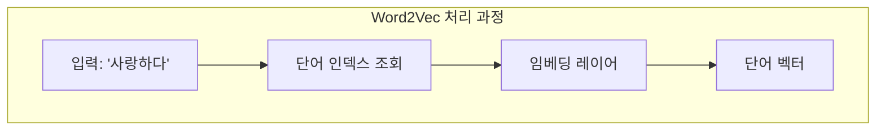
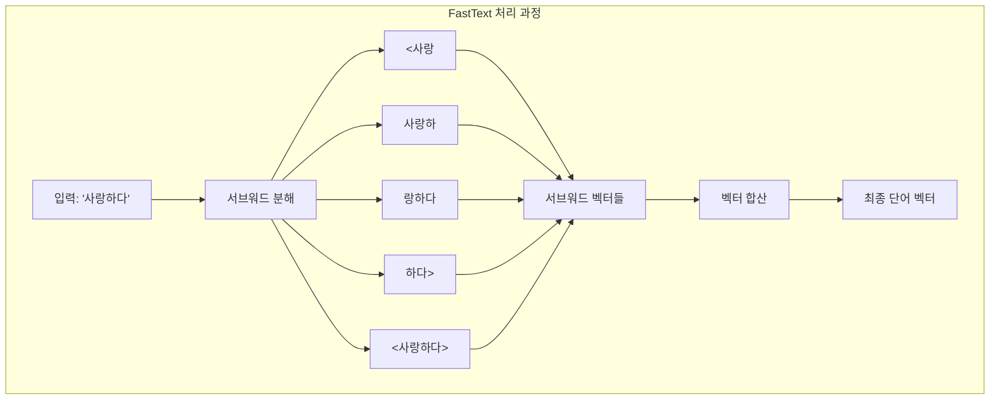

# FastText vs Word2Vec 비교 분석

## 목차
1. [개요](#1-개요) 
   - 1.1. [Word2Vec의 기본 개념](#11-word2vec의-기본-개념) 
   - 1.2. [FastText의 등장 배경](#12-fasttext의-등장-배경) 
2. [핵심 차이점](#2-핵심-차이점) 
   - 2.1. [단어 표현 방식](#21-단어-표현-방식) 
   - 2.2. [아키텍처 비교](#22-아키텍처-비교) 
3. [FastText의 주요 장점](#3-fasttext의-주요-장점) 
   - 3.1. [미등록 어휘 문제 해결](#31-미등록-어휘-문제-해결) 
   - 3.2. [형태론적 정보 활용](#32-형태론적-정보-활용) 
   - 3.3. [희귀 단어 표현력 향상](#33-희귀-단어-표현력-향상) 
4. [수식적 비교](#4-수식적-비교) 
   - 4.1. [Word2Vec 목적함수](#41-word2vec-목적함수) 
   - 4.2. [FastText 목적함수](#42-fasttext-목적함수) 
5. [실용적 예시](#5-실용적-예시) 
   - 5.1. [신조어 처리](#51-신조어-처리) 
   - 5.2. [오타 강건성](#52-오타-강건성) 
   - 5.3. [합성어 이해](#53-합성어-이해) 
6. [용어 목록](#6-용어-목록) 

---

## 1. 개요

### 1.1. Word2Vec의 기본 개념

Word2Vec은 단어를 밀집 벡터(dense vector)로 변환하는 신경망 기반 임베딩(embedding) 기법입니다. 
각 단어를 하나의 원자적 단위로 취급하며, 분산 표현(distributed representation)을 통해 의미적 유사성을 벡터 공간에 인코딩(encoding)합니다.

**예시**: "왕"과 "여왕"은 의미적으로 유사하므로 벡터 공간에서 가까운 위치에 배치됩니다.

### 1.2. FastText의 등장 배경

FastText는 Facebook AI Research에서 개발한 Word2Vec의 확장 버전입니다. 
형태소가 풍부한 언어와 저자원(low-resource) 환경에서 Word2Vec의 한계를 극복하기 위해 서브워드 정보를 활용하는 방식을 도입했습니다.

## 2. 핵심 차이점

### 2.1. 단어 표현 방식

**Word2Vec**은 단어를 쪼갤 수 없는 하나의 토큰(token)으로 처리합니다. "사랑하다"라는 단어가 있으면 이것을 단일 벡터로 표현하며, 내부 구조는 고려하지 않습니다.

**FastText**는 서브워드 접근법을 사용합니다. "사랑하다"를 여러 문자 n-gram으로 분해합니다:
- 3-gram: `<사랑`, `사랑하`, `랑하다`, `하다>`
- 단어 자체: `<사랑하다>`

최종 단어 벡터는 이러한 서브워드 벡터들의 합산(summation)으로 계산됩니다.

### 2.2. 아키텍처 비교

**Word2Vec**는 직접적인 룩업 테이블(lookup table) 방식으로 단어 벡터를 가져옵니다. 훈련 데이터에 없는 단어는 처리할 수 없습니다.

**FastText**는 서브워드를 먼저 추출하고, 각 서브워드의 벡터를 합산하여 최종 벡터를 생성합니다. 이는 미등록 단어도 서브워드 조합으로 표현 가능하게 합니다.

## 3. FastText의 주요 장점

### 3.1. 미등록 어휘 문제 해결

Word2Vec은 훈련 중 보지 못한 단어에 대해 벡터를 생성할 수 없습니다. 이를 OOV(Out-Of-Vocabulary) 문제라고 합니다.

**Word2Vec의 한계**:
- 훈련: "사랑하다" → 벡터 생성 가능
- 테스트: "사랑스럽다" → 벡터 없음, 에러 발생

**FastText의 해결책**:
- 훈련: "사랑하다" → `<사랑`, `사랑하`, `랑하다` 등의 서브워드 학습
- 테스트: "사랑스럽다" → `<사랑`, `사랑스`, `랑스럽` 등으로 분해하여 의미 추론

공통 서브워드인 `<사랑`을 통해 두 단어의 의미적 연결을 파악할 수 있습니다.

### 3.2. 형태론적 정보 활용

한국어는 교착어로서 어미, 조사, 접사의 변화가 풍부합니다. FastText는 이러한 형태소(morpheme) 변화 패턴을 자동으로 학습합니다.

**용언 활용 예시**:
- "가다" → "가고", "가서", "가면", "갔다", "가니"
- 공통 어간: "가"
- FastText는 "가"라는 서브워드를 통해 모든 활용형의 의미적 유사성을 포착

**형용사 활용 예시**:
- "예쁘다" → "예쁜", "예뻐서", "예뻤다"
- "아름답다" → "아름다운", "아름다워", "아름다웠다"
- FastText는 "예쁘/예뻤"과 "아름답/아름다웠"의 패턴 유사성을 학습

### 3.3. 희귀 단어 표현력 향상

저빈도 단어도 고빈도 단어와 서브워드를 공유하면 더 나은 벡터 표현을 얻습니다. 이는 파라미터(parameter) 공유 효과로 인한 일반화(generalization) 능력 향상입니다.

**예시**:
- "사랑" (고빈도): 10,000회 등장
- "사랑꾼" (저빈도): 5회 등장
- "사랑방" (저빈도): 3회 등장

Word2Vec에서 "사랑꾼"과 "사랑방"은 각각 독립적으로 학습되어 불안정한 벡터를 가집니다. FastText는 "사랑"이라는 공통 서브워드를 통해 이들에게 안정적인 벡터를 제공합니다.

## 4. 수식적 비교

### 4.1. Word2Vec 목적함수

Word2Vec의 Skip-gram 모델은 다음 목적함수를 최대화합니다:

$$\max \sum_{t=1}^{T} \sum_{-c \leq j \leq c, j \neq 0} \log p(w_{t+j} | w_t)$$

여기서:
- $T$: 전체 단어 개수
- $c$: 컨텍스트 윈도우(context window) 크기
- $w_t$: 중심 단어
- $w_{t+j}$: 주변 단어
- $p(w_{t+j} | w_t)$: 중심 단어가 주어졌을 때 주변 단어의 확률

이 모델은 중심 단어 $w_t$를 단일 벡터로 표현합니다.

### 4.2. FastText 목적함수

FastText는 서브워드를 도입하여 목적함수를 수정합니다:

$$\max \sum_{t=1}^{T} \sum_{-c \leq j \leq c, j \neq 0} \log p(w_{t+j} | \mathcal{G}(w_t))$$

여기서:
- $\mathcal{G}(w_t)$: 단어 $w_t$의 서브워드 집합
- $\mathcal{G}(w_t) = \{g_1, g_2, ..., g_k, w_t\}$

단어 벡터는 서브워드 벡터들의 합으로 표현됩니다:

$$\mathbf{v}_{w_t} = \sum_{g \in \mathcal{G}(w_t)} \mathbf{v}_g$$

여기서 $\mathbf{v}_g$는 각 서브워드 $g$의 벡터입니다. 이 방식은 단어를 원자적 단위가 아닌 **구성 요소의 조합**으로 취급합니다.

## 5. 실용적 예시

### 5.1. 신조어 처리

현대 언어는 끊임없이 새로운 단어를 생성합니다. 특히 인터넷 문화에서 합성어와 신조어가 빈번하게 등장합니다.

**예시: "먹스타그램"** (먹방 + 인스타그램)
- Word2Vec: 훈련 데이터에 없으면 벡터 생성 불가 → 에러
- FastText: "먹", "스타", "그램" 등의 서브워드로 분해
  - "먹" → "먹다", "먹방"과 연관
  - "그램" → "인스타그램", "텔레그램"과 연관
  - 결과: 음식 사진 공유의 의미를 부분적으로 추론 가능

**예시: "갓생"** (신과 같은 삶)
- Word2Vec: 벡터 없음
- FastText: "갓", "생" 서브워드 활용
  - "생" → "생활", "인생"과 연결
  - 일상적 삶의 의미를 포착

### 5.2. 오타 강건성

실제 텍스트 데이터는 오타와 띄어쓰기 오류를 포함합니다. FastText는 이러한 노이즈(noise)에 더 강건합니다.

**예시: 오타가 포함된 문장**
- 올바른 표현: "사랑해"
- 오타: "사랑헤"

Word2Vec은 "사랑해"와 "사랑헤"를 완전히 다른 단어로 취급합니다. "사랑헤"가 훈련 데이터에 없다면 처리할 수 없습니다.

FastText는 두 단어의 서브워드 대부분이 동일하므로(`<사랑`, `사랑하` vs `사랑헤`) 유사한 벡터를 생성합니다. 이는 편집 거리(edit distance)가 작은 단어들에 대한 강건성을 제공합니다.

### 5.3. 합성어 이해

한국어는 합성어가 많으며, 합성어의 의미는 구성 요소의 의미와 연관됩니다.

**예시: "손목시계"**
- 구성: "손" + "목" + "시계"
- FastText의 처리:
  - `<손`, `손목`, `목시`, `시계>` 등으로 분해
  - "손", "시계"라는 구성 요소의 의미 정보 보존
  - "손목"이라는 신체 부위와 "시계"라는 기기의 관계 학습

**예시: "책가방"**
- 구성: "책" + "가방"
- FastText는 `책`, `가방`이라는 서브워드를 통해:
  - "책"과 관련된 문맥 (교과서, 공책 등)
  - "가방"과 관련된 문맥 (배낭, 핸드백 등)
  - 두 의미가 결합된 개념 표현

이러한 합성어 처리 능력은 교착어의 특성을 효과적으로 활용합니다.

## 6. 용어 목록

| 용어 | 설명 |
|------|------|
| Word2Vec | 단어를 밀집 벡터로 변환하는 신경망 기반 임베딩 기법 |
| FastText | 서브워드 정보를 활용하는 Word2Vec의 확장 버전 |
| 임베딩 (Embedding) | 이산적인 단어를 연속적인 벡터 공간으로 매핑하는 기법 |
| 서브워드 (Subword) | 단어를 구성하는 더 작은 단위, 문자 n-gram |
| n-gram | 연속된 n개의 문자 또는 단어 시퀀스 |
| OOV (Out-Of-Vocabulary) | 훈련 데이터에 없는 미등록 단어 |
| 교착어 (Agglutinative Language) | 어간에 접사를 붙여 문법적 기능을 표현하는 언어 |
| 형태소 (Morpheme) | 의미를 가진 최소 단위 |
| 분산 표현 (Distributed Representation) | 의미를 다차원 벡터의 여러 요소에 분산하여 표현하는 방식 |
| 밀집 벡터 (Dense Vector) | 대부분의 요소가 0이 아닌 값을 가지는 벡터 |
| 컨텍스트 윈도우 (Context Window) | 중심 단어 주변의 일정 범위 단어들 |
| Skip-gram | 중심 단어로 주변 단어를 예측하는 Word2Vec 모델 |
| 목적함수 (Objective Function) | 최적화하고자 하는 함수, 손실 함수의 반대 개념 |
| 룩업 테이블 (Lookup Table) | 키를 통해 값을 직접 찾는 자료구조 |
| 인코딩 (Encoding) | 정보를 특정 형식으로 변환하는 과정 |
| 파라미터 (Parameter) | 모델이 학습을 통해 최적화하는 가중치 |
| 일반화 (Generalization) | 훈련 데이터에서 보지 못한 데이터에 대한 성능 |
| 강건성 (Robustness) | 노이즈나 오류에 대한 내성 |
| 편집 거리 (Edit Distance) | 한 문자열을 다른 문자열로 변환하는 데 필요한 최소 편집 연산 수 |
| 저자원 (Low-resource) | 훈련 데이터가 부족한 환경 |
| 토큰 (Token) | 텍스트를 구성하는 기본 단위 |