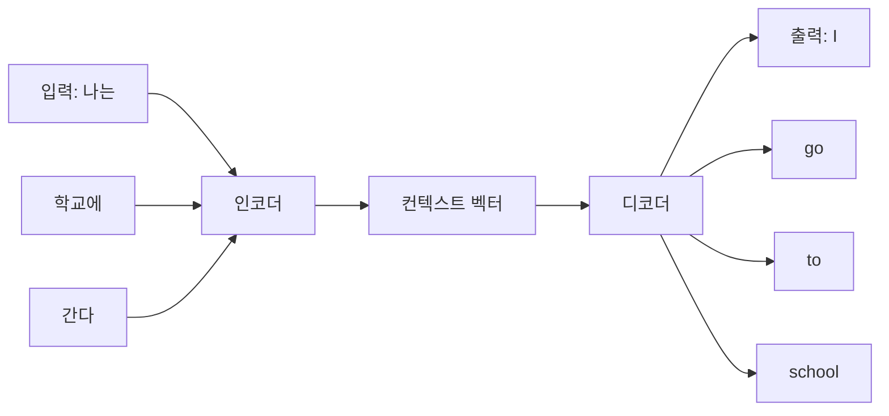
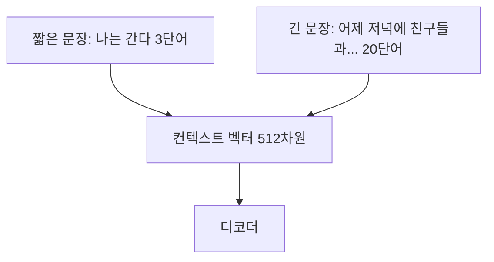
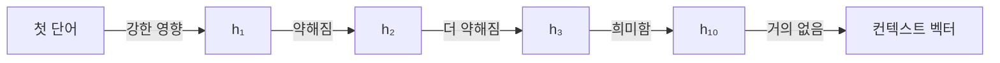
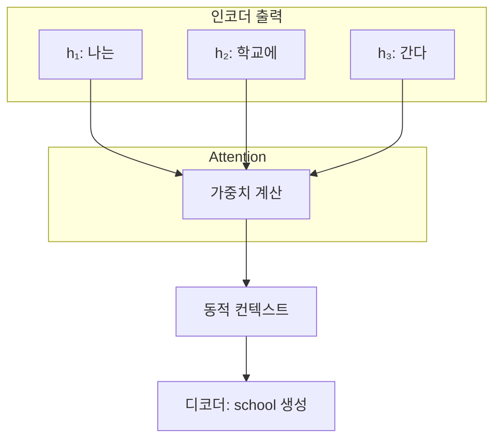
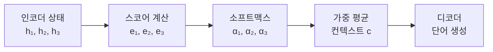
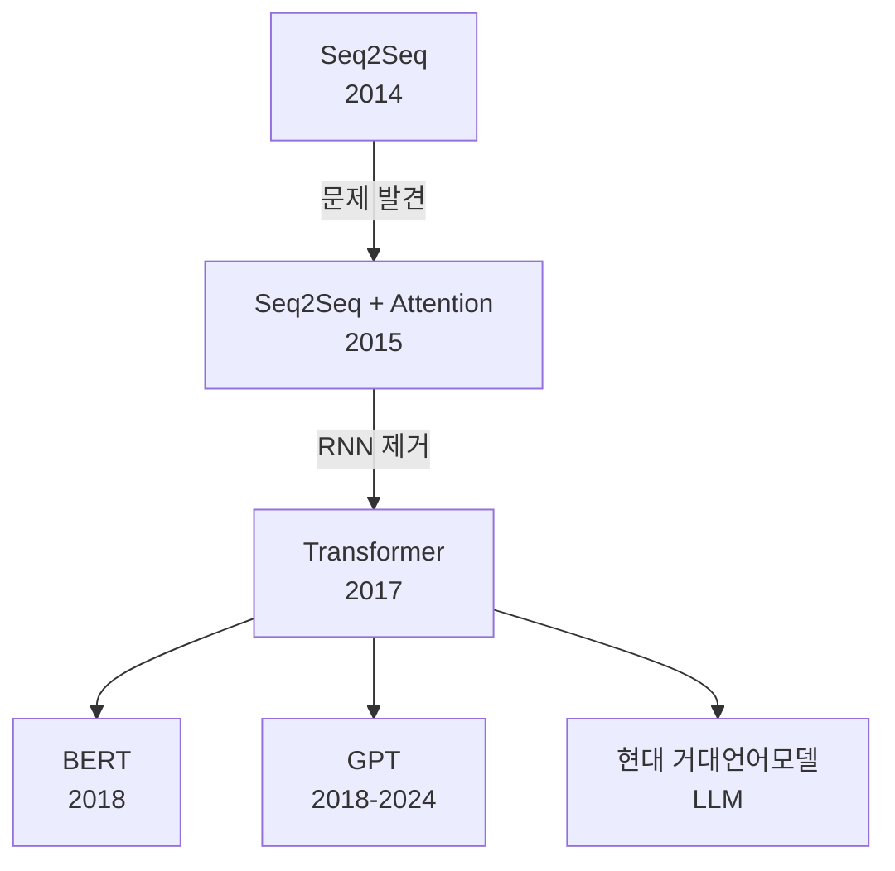

# Seq2Seq와 Attention

## 목차
1. [Seq2Seq 모델의 등장](#1-seq2seq-모델의-등장)<br/>
   - 1.1. [시퀀스 변환의 혁명](#11-시퀀스-변환의-혁명)<br/>
   - 1.2. [인코더-디코더 아키텍처](#12-인코더-디코더-아키텍처)<br/>
   - 1.3. [작동 원리](#13-작동-원리)<br/>
2. [문제의 발견](#2-문제의-발견)<br/>
   - 2.1. [정보 병목 현상](#21-정보-병목-현상)<br/>
   - 2.2. [장거리 의존성 문제](#22-장거리-의존성-문제)<br/>
   - 2.3. [고정된 시선](#23-고정된-시선)<br/>
3. [Attention 메커니즘: 해결책의 등장](#3-attention-메커니즘-해결책의-등장)<br/>
   - 3.1. [핵심 아이디어](#31-핵심-아이디어)<br/>
   - 3.2. [동적 집중 메커니즘](#32-동적-집중-메커니즘)<br/>
   - 3.3. [작동 방식](#33-작동-방식)<br/>
4. [새로운 가능성](#4-새로운-가능성)<br/>
   - 4.1. [성능 개선](#41-성능-개선)<br/>
   - 4.2. [해석 가능성](#42-해석-가능성)<br/>
   - 4.3. [Transformer로의 진화](#43-transformer로의-진화)<br/>
5. [용어 목록](#5-용어-목록)<br/>

---

## 1. Seq2Seq 모델의 등장

### 1.1. 시퀀스 변환의 혁명

2014년, 신경망 기계번역의 혁명이 시작되었습니다.<br/>
**시퀀스 투 시퀀스(Sequence-to-Sequence, Seq2Seq)** 모델은 하나의 시퀀스를 입력받아 완전히 다른 길이의 시퀀스를 출력할 수 있는 획기적인 아키텍처였습니다.

**적용 분야**:
- 기계 번역: "나는 학교에 간다" → "I go to school"
- 텍스트 요약: 긴 문서 → 짧은 요약문
- 대화 시스템: 질문 → 답변
- 이미지 캡셔닝(캡셔닝): 이미지 → 설명 문장

### 1.2. 인코더-디코더 아키텍처

Seq2Seq는 두 개의 순환 신경망(RNN)으로 구성됩니다.



**인코더(Encoder)**:
- 입력 시퀀스를 순차적으로 읽음
- 각 단어의 정보를 은닉 상태(hidden state)에 누적
- 마지막 은닉 상태 = **컨텍스트 벡터(context vector)**

**컨텍스트 벡터**:
- 입력 문장 전체의 정보를 압축한 고정 길이 벡터
- 인코더와 디코더를 연결하는 유일한 다리

**디코더(Decoder)**:
- 컨텍스트 벡터를 받아 출력 시퀀스 생성
- 한 번에 한 단어씩 순차적으로 생성

### 1.3. 작동 원리

**한글-영어 번역 예시**:

**단계 1: 인코딩**
```
"나는" 입력 → h₁ 생성
"학교에" 입력 + h₁ → h₂ 생성  
"간다" 입력 + h₂ → h₃ 생성 (= 컨텍스트 벡터 c)
```

**단계 2: 디코딩**
```
c + <START> → "I" 생성
c + "I" → "go" 생성
c + "go" → "to" 생성
c + "to" → "school" 생성
c + "school" → <END> 생성
```

**수식 표현**:

인코더: 
$$h_t = f(x_t, h_{t-1})$$

디코더:
$$s_t = g(y_{t-1}, s_{t-1}, c)$$

$$P(y_t) = \text{softmax}(W_s \cdot s_t)$$

여기서 $c$는 고정된 컨텍스트 벡터, $h_t$는 인코더 은닉 상태, $s_t$는 디코더 은닉 상태입니다.

---

## 2. 문제의 발견

Seq2Seq는 혁신적이었지만, 실제 사용하면서 심각한 한계가 드러났습니다.

### 2.1. 정보 병목 현상

**근본적 문제**: 모든 정보를 하나의 벡터로 압축



**문제점**:
- 3단어든 50단어든 **같은 크기의 벡터**에 압축
- 긴 문장일수록 정보 손실 심각
- 중요한 세부사항이 사라짐

**실제 예시**:
```
입력: "어제 저녁 7시에 강남역 2번 출구 앞 스타벅스에서 
      친구 세 명과 만나서 새로 나온 신메뉴 프라푸치노를 
      마시며 다음 주 제주도 여행 계획을 세웠다."

번역 결과 (Seq2Seq):
"I met friends at Starbucks and talked."
→ 시간, 장소, 인원, 음료, 여행 정보 모두 손실!
```

### 2.2. 장거리 의존성 문제

**문장이 길어지면 앞부분 정보가 희석됩니다.**



**실험적 증거**:
- 문장 길이 10단어: 번역 정확도 90%
- 문장 길이 30단어: 번역 정확도 60%
- 문장 길이 50단어: 번역 정확도 30%

이는 **그래디언트 소실(vanishing gradient)** 문제와도 연결됩니다.

### 2.3. 고정된 시선

**디코더가 매 순간 같은 정보만 봅니다.**

```
번역 중:
"I" 생성할 때 → 컨텍스트 벡터 c 참조
"go" 생성할 때 → 컨텍스트 벡터 c 참조 (동일!)
"school" 생성할 때 → 컨텍스트 벡터 c 참조 (또 동일!)
```

**문제점**:
- "I"를 번역할 때는 "나는"에 집중해야 함
- "school"을 번역할 때는 "학교에"에 집중해야 함
- 하지만 **항상 같은 정보**만 보고 있음

**인간 번역가는 어떻게 할까?**
```
한글 문장을 보면서:
"I" 쓸 때 → "나는" 쳐다봄 👀
"go" 쓸 때 → "간다" 쳐다봄 👀
"to school" 쓸 때 → "학교에" 쳐다봄 👀
```

Seq2Seq는 이런 **선택적 집중**이 불가능했습니다.

---

## 3. Attention 메커니즘: 해결책의 등장

### 3.1. 핵심 아이디어

2015년, Bahdanau 등이 제안한 **어텐션(Attention)** 메커니즘은 간단하지만 강력한 아이디어였습니다.

> **"디코더가 출력할 때마다 입력 문장의 어디를 봐야 할지 스스로 결정하게 하자!"**



### 3.2. 동적 집중 메커니즘

**핵심 변화**:
- ❌ 고정된 컨텍스트 벡터 하나
- ✅ **매 시점마다 다른 컨텍스트 벡터** 생성

**작동 과정**:

1. **모든 인코더 은닉 상태 저장**
```
"나는 학교에 간다" 
→ [h₁, h₂, h₃] 모두 보관
```

2. **각 디코딩 시점마다 집중할 곳 결정**
```
"I" 생성 시:
  - h₁("나는")에 0.8 가중치
  - h₂("학교에")에 0.1 가중치  
  - h₃("간다")에 0.1 가중치
  → "나는"에 집중! 👀

"school" 생성 시:
  - h₁("나는")에 0.1 가중치
  - h₂("학교에")에 0.8 가중치
  - h₃("간다")에 0.1 가중치  
  → "학교에"에 집중! 👀
```

3. **가중 평균으로 컨텍스트 계산**
```
c_t = 0.8 × h₁ + 0.1 × h₂ + 0.1 × h₃
```

### 3.3. 작동 방식

**Attention 계산 3단계**:

**단계 1: 스코어 계산**

각 인코더 상태와 현재 디코더 상태 간의 연관성을 계산합니다.

$$e_{ij} = \text{score}(s_{i-1}, h_j)$$

여기서 $s_{i-1}$은 이전 디코더 상태, $h_j$는 j번째 인코더 상태입니다.

**단계 2: 가중치 정규화(소프트맥스)**

스코어를 확률 분포로 변환합니다.

$$\alpha_{ij} = \frac{\exp(e_{ij})}{\sum_{k=1}^{T} \exp(e_{ik})}$$

**단계 3: 컨텍스트 벡터 생성**

가중 평균을 계산합니다.

$$c_i = \sum_{j=1}^{T} \alpha_{ij} h_j$$

**전체 프로세스**:



**한글 예시: "나는 어제 도서관에 갔다" → "I went to the library yesterday"**

| 출력 단어 | 나는 | 어제 | 도서관에 | 갔다 |
|----------|------|------|----------|------|
| I        | **0.7** | 0.1  | 0.1      | 0.1  |
| went     | 0.1  | 0.1  | 0.1      | **0.7** |
| to       | 0.1  | 0.1  | **0.6**  | 0.2  |
| the      | 0.1  | 0.1  | **0.7**  | 0.1  |
| library  | 0.1  | 0.1  | **0.8**  | 0.0  |
| yesterday| 0.1  | **0.8** | 0.1   | 0.0  |

표의 각 행은 출력 단어를 생성할 때 입력 단어에 부여한 **어텐션 가중치**를 나타냅니다.

---

## 4. 새로운 가능성

### 4.1. 성능 개선

**정량적 개선**:

| 문장 길이 | Seq2Seq | Seq2Seq + Attention | 개선폭 |
|-----------|---------|---------------------|--------|
| 10단어    | 90%     | 92%                 | +2%    |
| 30단어    | 60%     | 85%                 | +25%   |
| 50단어    | 30%     | 75%                 | +45%   |

**긴 문장일수록 Attention의 효과가 극적입니다!**

**정성적 개선**:
- 번역이 더 자연스러워짐
- 세부 정보 보존
- 문맥 이해도 향상

### 4.2. 해석 가능성

Attention 가중치를 시각화하면 **모델이 무엇을 보고 번역하는지** 알 수 있습니다.

```
입력: "The agreement on the European Economic Area was signed in August 1992."
출력: "유럽 경제 지역에 관한 협정은 1992년 8월에 체결되었다."

Attention 시각화:
"1992년" 생성 시 → "1992" 단어에 높은 가중치
"8월" 생성 시 → "August" 단어에 높은 가중치
"협정" 생성 시 → "agreement" 단어에 높은 가중치
```

**블랙박스가 아닌 해석 가능한 모델**이 된 것입니다.

### 4.3. Transformer로의 진화

Attention의 성공은 더 큰 혁명으로 이어졌습니다.

**2017년: "Attention is All You Need"**

> "RNN도 필요 없다. Attention만으로 모든 것을 할 수 있다!"



**Transformer의 특징**:
- RNN 완전히 제거
- 오직 **셀프 어텐션(Self-Attention)** 메커니즘만 사용
- 병렬 처리 가능 → 학습 속도 대폭 향상
- 구글 번역, ChatGPT 등 현대 모든 모델의 기반

**영향력**:
- BERT: 양방향 Transformer 인코더
- GPT: 단방향 Transformer 디코더  
- T5, BART, XLNet 등: Transformer 변형
- Vision Transformer: 이미지에도 적용
- AlphaFold: 단백질 구조 예측

**Attention은 단순한 개선이 아니라 패러다임 전환이었습니다.**

---

## 5. 용어 목록

| 용어 | 영문 | 설명 |
|------|------|------|
| 가중 평균 | Weighted Average | 각 값에 가중치를 곱한 후 합산하는 평균 계산 방식 |
| 가중치 | Weight | 특정 값의 중요도를 나타내는 수치 |
| 고정 길이 벡터 | Fixed-length Vector | 크기가 정해진 벡터, 입력 길이와 무관하게 동일한 차원 |
| 그래디언트 소실 | Vanishing Gradient | 역전파 시 그래디언트가 점점 작아져 학습이 어려워지는 현상 |
| 디코더 | Decoder | 인코딩된 정보를 받아 출력 시퀀스를 생성하는 모듈 |
| 셀프 어텐션 | Self-Attention | 입력 시퀀스 내부의 단어들 간 관계를 모델링하는 어텐션 |
| 소프트맥스 | Softmax | 값들을 0과 1 사이의 확률 분포로 변환하는 함수 |
| 순환 신경망 | Recurrent Neural Network, RNN | 시퀀스 데이터를 순차적으로 처리하는 신경망 |
| 시퀀스 | Sequence | 순서가 있는 데이터의 나열 |
| 시퀀스 투 시퀀스 | Sequence-to-Sequence, Seq2Seq | 입력 시퀀스를 출력 시퀀스로 변환하는 모델 구조 |
| 어텐션 | Attention | 입력의 특정 부분에 선택적으로 집중하는 메커니즘 |
| 어텐션 가중치 | Attention Weight | 각 입력 위치의 중요도를 나타내는 확률값 |
| 어텐션 스코어 | Attention Score | 쿼리와 키 사이의 연관성을 나타내는 점수 |
| 은닉 상태 | Hidden State | RNN이 시퀀스를 처리하며 생성하는 중간 표현 벡터 |
| 인코더 | Encoder | 입력 시퀀스를 압축된 표현으로 변환하는 모듈 |
| 인코더-디코더 | Encoder-Decoder | 인코더와 디코더로 구성된 아키텍처 |
| 장거리 의존성 | Long-range Dependency | 멀리 떨어진 단어들 간의 관계 |
| 정보 병목 | Information Bottleneck | 많은 정보가 좁은 통로를 지나며 손실되는 현상 |
| 컨텍스트 벡터 | Context Vector | 입력 문장 전체를 압축한 고정 길이 벡터 |
| 캡셔닝 | Captioning | 이미지에 대한 텍스트 설명을 자동 생성하는 작업 |
| 토큰 | Token | 텍스트를 구성하는 최소 단위 (단어, 서브워드 등) |
| 트랜스포머 | Transformer | Attention 메커니즘만으로 구성된 신경망 아키텍처 |

---

**문서 작성**: 자연어처리 학습을 위한 교육 자료  
**대상**: AI 엔지니어 학생  
**주제**: Seq2Seq의 한계와 Attention 메커니즘의 등장