# Transformer vs Seq2Seq: 차이

---

## 목차

1. [서론](#1-서론)<br/>
   - 1.1. [자연어 처리의 도전 과제](#11-자연어-처리의-도전-과제)<br/>
   - 1.2. [번역 문제로 보는 Seq2Seq의 등장](#12-번역-문제로-보는-seq2seq의-등장)<br/>
   - 1.3. [Transformer가 필요했던 이유](#13-transformer가-필요했던-이유)<br/>
2. [Seq2Seq 모델의 작동 원리](#2-seq2seq-모델의-작동-원리)<br/>
   - 2.1. [기본 개념: 인코더-디코더 구조](#21-기본-개념-인코더-디코더-구조)<br/>
   - 2.2. [순차 처리의 의미](#22-순차-처리의-의미)<br/>
   - 2.3. [Hidden State를 통한 정보 압축](#23-hidden-state를-통한-정보-압축)<br/>
   - 2.4. [Context Vector의 병목 현상](#24-context-vector의-병목-현상)<br/>
   - 2.5. [Seq2Seq의 한계](#25-seq2seq의-한계)<br/>
3. [Transformer 모델의 작동 원리](#3-transformer-모델의-작동-원리)<br/>
   - 3.1. [기본 개념: Attention 중심 구조](#31-기본-개념-attention-중심-구조)<br/>
   - 3.2. [병렬 처리의 의미](#32-병렬-처리의-의미)<br/>
   - 3.3. [Self-Attention 메커니즘](#33-self-attention-메커니즘)<br/>
   - 3.4. [Positional Encoding이 필요한 이유](#34-positional-encoding이-필요한-이유)<br/>
   - 3.5. [Multi-Head Attention의 역할](#35-multi-head-attention의-역할)<br/>
4. [근본적 차이점 비교](#4-근본적-차이점-비교)<br/>
   - 4.1. [정보 처리 방식](#41-정보-처리-방식)<br/>
   - 4.2. [정보 전달 경로](#42-정보-전달-경로)<br/>
   - 4.3. [계산 복잡도](#43-계산-복잡도)<br/>
   - 4.4. [장거리 의존성 처리](#44-장거리-의존성-처리)<br/>
5. [실제 학습 과정의 차이](#5-실제-학습-과정의-차이)<br/>
   - 5.1. [학습 속도 및 효율성](#51-학습-속도-및-효율성)<br/>
   - 5.2. [메모리 요구사항](#52-메모리-요구사항)<br/>
   - 5.3. [그래디언트 흐름의 차이](#53-그래디언트-흐름의-차이)<br/>
6. [왜 Transformer가 대세가 되었는가](#6-왜-transformer가-대세가-되었는가)<br/>
   - 6.1. [성능 향상](#61-성능-향상)<br/>
   - 6.2. [확장성](#62-확장성)<br/>
   - 6.3. [전이 학습의 가능성](#63-전이-학습의-가능성)<br/>
   - 6.4. [현대 LLM의 기반](#64-현대-llm의-기반)<br/>
7. [결론](#7-결론)<br/>
   - 7.1. [두 모델의 역사적 의의](#71-두-모델의-역사적-의의)<br/>
   - 7.2. [적용 분야별 선택 기준](#72-적용-분야별-선택-기준)<br/>
   - 7.3. [앞으로의 방향](#73-앞으로의-방향)<br/>
8. [용어 목록](#8-용어-목록)<br/>

---

## 1. 서론

### 1.1. 자연어 처리의 도전 과제

자연어는 인간이 일상적으로 사용하는 언어로, 컴퓨터가 이해하고 처리하기 매우 어려운 특성을 가지고 있습니다.<br/>
특히 다음과 같은 도전 과제들이 존재합니다.

**문맥 의존성(Context Dependency, 컨텍스트 디펜던시)**  
같은 단어라도 문맥에 따라 의미가 달라집니다.

- "그는 **은행**에 갔다" (금융기관)
- "강가 **은행**에 앉아있다" (강둑)

**장거리 의존성(Long-range Dependency, 롱레인지 디펜던시)**  
문장에서 멀리 떨어진 단어들 사이에도 의미적 연결이 있습니다.

- "철수는 영희에게 **자신이** 어제 산 책을 선물했다"
  - "자신이"는 "철수"를 가리킴

**어순의 다양성(Word Order Variation, 워드 오더 베리에이션)**  
언어마다 어순이 다르며, 이를 처리하는 것이 번역의 핵심입니다.

- 한국어(SOV): "나는 사과를 먹는다"
- 영어(SVO): "I eat an apple"

### 1.2. 번역 문제로 보는 Seq2Seq의 등장

2014년, 구글과 몬트리올 대학 연구진은 Seq2Seq(Sequence-to-Sequence, 시퀀스-투-시퀀스) 모델을 제안했습니다.<br/>
이는 기계 번역 문제를 해결하기 위한 혁신적인 접근법이었습니다.

**번역의 본질**  
번역은 하나의 시퀀스(Sequence, 연속된 단어들)를 다른 시퀀스로 변환하는 작업입니다.

```
입력 시퀀스: "나는 학교에 간다"
출력 시퀀스: "I go to school"
```

Seq2Seq 모델은 이러한 변환을 두 단계로 나누어 처리합니다.

1. **인코더(Encoder, 인코더)**: 입력 문장을 읽고 의미를 압축
2. **디코더(Decoder, 디코더)**: 압축된 의미를 읽고 출력 문장을 생성

### 1.3. Transformer가 필요했던 이유

Seq2Seq는 획기적인 성과를 거두었지만, 근본적인 한계가 있었습니다.

**순차 처리의 제약**  
Seq2Seq는 단어를 하나씩 순서대로 처리해야 합니다. "나는 학교에 간다"를 처리할 때:

1. "나는" 처리 → 결과 저장
2. "학교에" 처리 → 이전 결과 + 현재 단어
3. "간다" 처리 → 이전 결과 + 현재 단어

이는 마치 책을 읽을 때 첫 페이지부터 순서대로 읽어야만 하는 것과 같습니다.

**정보 압축의 병목**  
긴 문장의 모든 정보를 하나의 벡터(Context Vector, 컨텍스트 벡터)에 압축해야 했습니다.<br/>
이는 긴 문장일수록 정보 손실이 발생하는 문제를 야기했습니다.

2017년, Google Brain 팀은 "Attention is All You Need" 논문을 통해 Transformer(트랜스포머)를 발표했습니다.<br/>
이 모델은 순차 처리와 정보 압축의 한계를 근본적으로 해결했습니다.

---

## 2. Seq2Seq 모델의 작동 원리

### 2.1. 기본 개념: 인코더-디코더 구조

Seq2Seq 모델은 인코더-디코더 아키텍처(Encoder-Decoder Architecture, 인코더-디코더 아키텍처)를 기반으로 합니다.

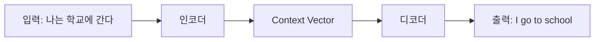

**인코더(Encoder)**  
입력 문장을 읽어서 그 의미를 고정된 크기의 벡터로 압축합니다.<br/>
이 벡터를 Context Vector 또는 Thought Vector라고 부릅니다.

**디코더(Decoder)**  
Context Vector를 받아서 목표 언어의 문장을 한 단어씩 생성합니다.

### 2.2. 순차 처리의 의미

#### 2.2.1. 한국어 예시: "나는 학교에 간다" 처리 과정

Seq2Seq는 RNN(Recurrent Neural Network, 리커런트 뉴럴 네트워크) 기반이므로 순차적으로 처리합니다.

**인코더 단계:**


각 단계에서 Hidden State(히든 스테이트)가 업데이트됩니다.

**시간 t=1:**
- 입력: "나는"
- 이전 상태: h₀ (초기값)
- 새로운 상태: h₁ = f(h₀, "나는")

**시간 t=2:**
- 입력: "학교에"
- 이전 상태: h₁
- 새로운 상태: h₂ = f(h₁, "학교에")

**시간 t=3:**
- 입력: "간다"
- 이전 상태: h₂
- 최종 상태: h₃ = f(h₂, "간다")

이때 h₃가 전체 문장의 의미를 담은 Context Vector가 됩니다.

**디코더 단계:**

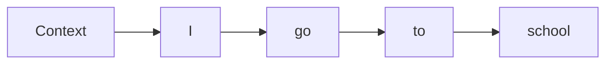

디코더도 순차적으로 단어를 생성합니다.
- Context Vector → "I" 생성
- "I"의 상태 → "go" 생성
- "go"의 상태 → "to" 생성
- "to"의 상태 → "school" 생성

### 2.3. Hidden State를 통한 정보 압축

**Hidden State란?**  
각 시점에서 모델이 기억하고 있는 정보를 담은 벡터입니다.<br/>
이는 지금까지 읽은 모든 단어의 정보를 압축하여 담고 있습니다.

**수식으로 표현:**

$$h_t = \tanh(W_{hh} \cdot h_{t-1} + W_{xh} \cdot x_t + b_h)$$

여기서:
- $h_t$: 현재 시점의 Hidden State
- $h_{t-1}$: 이전 시점의 Hidden State
- $x_t$: 현재 시점의 입력
- $W_{hh}$, $W_{xh}$: 가중치 행렬(Weight Matrix, 웨이트 매트릭스)
- $b_h$: 편향(Bias, 바이어스)
- $\tanh$: 활성화 함수(Activation Function, 액티베이션 펑션)

**직관적 의미:**  
"이전까지 기억한 것" + "지금 들어온 새로운 정보" → "새롭게 업데이트된 기억"

**예시로 이해하기:**

문장: "철수는 어제 도서관에서 공부했다"

- h₁ ("철수는"): [주어가 '철수']
- h₂ ("어제"): [주어가 '철수', 시간이 '과거']
- h₃ ("도서관에서"): [주어가 '철수', 시간이 '과거', 장소가 '도서관']
- h₄ ("공부했다"): [주어가 '철수', 시간이 '과거', 장소가 '도서관', 동작이 '공부']

각 Hidden State는 이전 정보를 유지하면서 새로운 정보를 추가합니다.

### 2.4. Context Vector의 병목 현상

**Context Vector란?**  
인코더의 마지막 Hidden State로, 전체 입력 문장의 의미를 담은 고정 크기의 벡터입니다.

**병목 현상(Bottleneck Problem, 보틀넥 프라블럼):**

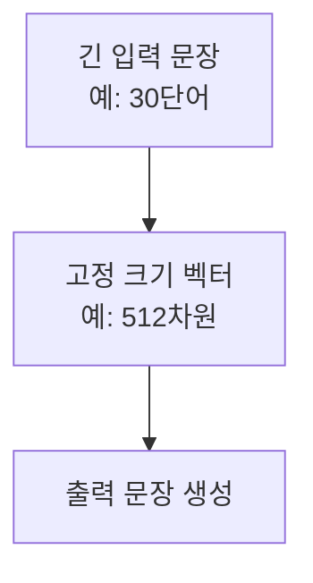

문장이 길어질수록 하나의 벡터에 모든 정보를 압축하기 어려워집니다.

**한국어 긴 문장 예시:**

```
"어제 친구를 만나서 오랜만에 영화를 보고 맛있는 저녁을 먹고 
커피를 마시며 이야기를 나누다가 집에 늦게 돌아왔다"
```

이 문장의 모든 정보(친구, 영화, 저녁, 커피, 늦게 귀가)를 하나의 벡터에 담아야 합니다.<br/>
이 과정에서 일부 정보가 손실될 수 있습니다.

### 2.5. Seq2Seq의 한계

**1. 순차 처리로 인한 속도 저하**

단어를 하나씩 순서대로 처리해야 하므로:
- 병렬 처리(Parallel Processing, 패러럴 프로세싱) 불가
- 긴 문장일수록 처리 시간 증가
- GPU의 병렬 연산 능력을 충분히 활용하지 못함

**2. 장거리 의존성 문제**

문장이 길어질수록 초반 정보가 희석됩니다.

예시:
```
"철수는 영희에게 자신이 어제 친구와 함께 간 영화관에서 본 
영화가 매우 재미있었다고 말했다"
```

"철수는"와 "말했다" 사이의 거리가 멀어질수록, 디코더가 주어를 정확히 파악하기 어려워집니다.

**3. Vanishing Gradient 문제**

역전파(Backpropagation, 백프로퍼게이션) 과정에서 그래디언트(Gradient, 그래디언트)가 점점 작아져 학습이 어려워집니다.

$$\frac{\partial L}{\partial h_1} = \frac{\partial L}{\partial h_T} \times \prod_{t=2}^{T} \frac{\partial h_t}{\partial h_{t-1}}$$

시퀀스가 길수록 곱셈이 반복되어 그래디언트가 0에 가까워집니다(배니싱 그래디언트, Vanishing Gradient).

**4. 정보 압축의 한계**

모든 정보를 하나의 Context Vector에 담으므로:
- 긴 문장의 정보 손실
- 복잡한 문맥 파악 어려움
- 번역 품질 저하

---

## 3. Transformer 모델의 작동 원리

### 3.1. 기본 개념: Attention 중심 구조

Transformer는 RNN을 완전히 제거하고 Attention 메커니즘(어텐션 메커니즘)만으로 구성됩니다.

**핵심 아이디어:**  
"순차적으로 읽지 말고, 필요한 부분에 집중(Attention)하자"

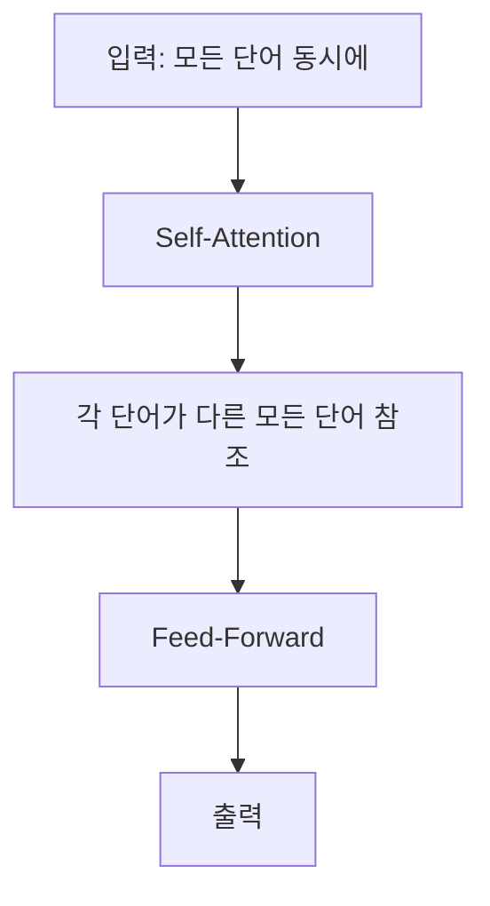

### 3.2. 병렬 처리의 의미

#### 3.2.1. 한국어 예시: "나는 학교에 간다" 처리 과정

Seq2Seq와 달리 Transformer는 모든 단어를 동시에 처리합니다.

**Seq2Seq (순차 처리):**
```
시간 1: "나는" 처리
시간 2: "학교에" 처리
시간 3: "간다" 처리
총 3 단계 소요
```

**Transformer (병렬 처리):**
```
시간 1: "나는", "학교에", "간다" 동시 처리
총 1 단계 소요
```

이는 마치 책을 읽을 때, 페이지를 순서대로 읽는 대신 필요한 페이지를 동시에 펼쳐놓고 비교하는 것과 같습니다.

### 3.3. Self-Attention 메커니즘

#### 3.3.1. Query, Key, Value의 직관적 이해

Self-Attention(셀프-어텐션)은 각 단어가 문장 내 다른 모든 단어와의 관련성을 계산합니다.

**도서관 비유:**
- **Query(쿼리)**: "나는 무엇을 찾고 있는가?" (검색어)
- **Key(키)**: "나는 무엇에 대한 정보인가?" (책의 색인)
- **Value(밸류)**: "실제 정보는 무엇인가?" (책의 내용)

**수식:**

$$\text{Attention}(Q, K, V) = \text{softmax}\left(\frac{QK^T}{\sqrt{d_k}}\right)V$$

여기서:
- $Q$: Query 행렬
- $K$: Key 행렬
- $V$: Value 행렬
- $d_k$: Key의 차원
- $\sqrt{d_k}$: 스케일링 팩터(Scaling Factor, 스케일링 팩터)

**단계별 계산:**

1. **유사도 계산:** $QK^T$  
   각 단어가 다른 단어와 얼마나 관련 있는지 계산

2. **스케일링:** $\frac{QK^T}{\sqrt{d_k}}$  
   값이 너무 커지지 않도록 조정

3. **확률 분포 변환:** $\text{softmax}(\cdot)$  
   유사도를 확률(0~1)로 변환

4. **가중합:** $(\cdot) V$  
   중요한 정보에 가중치를 부여하여 합산

#### 3.3.2. 한국어 예시: "그는 은행에 갔다" (중의성 해소)

"은행"은 두 가지 의미가 있습니다:
- 금융기관 (bank)
- 강둑 (river bank)

**문장 1: "그는 돈을 찾으러 은행에 갔다"**

Attention Score (점수가 높을수록 관련성이 높음):

|        | 그는 | 돈을 | 찾으러 | 은행에 | 갔다 |
|--------|------|------|--------|--------|------|
| 은행에 | 0.1  | 0.4  | 0.3    | 0.1    | 0.1  |

"은행에"가 "돈을"과 높은 연관성 → 금융기관의 의미

**문장 2: "그는 강가 은행에 앉았다"**

|        | 그는 | 강가 | 은행에 | 앉았다 |
|--------|------|------|--------|--------|
| 은행에 | 0.1  | 0.6  | 0.1    | 0.2    |

"은행에"가 "강가"와 높은 연관성 → 강둑의 의미

Self-Attention은 문맥을 통해 단어의 의미를 자동으로 구별합니다.

### 3.4. Positional Encoding이 필요한 이유

병렬 처리는 빠르지만, 단어의 순서 정보가 손실됩니다.

**문제:**
- "개가 고양이를 쫓았다"
- "고양이가 개를 쫓았다"

두 문장의 의미는 완전히 다르지만, 병렬 처리에서는 단어들이 동시에 입력되므로 순서를 구분할 수 없습니다.

**해결: Positional Encoding(포지셔널 인코딩)**

각 단어의 위치 정보를 벡터로 만들어 추가합니다.

$$PE_{(pos, 2i)} = \sin\left(\frac{pos}{10000^{2i/d}}\right)$$

$$PE_{(pos, 2i+1)} = \cos\left(\frac{pos}{10000^{2i/d}}\right)$$

여기서:
- $pos$: 단어의 위치 (0, 1, 2, ...)
- $i$: 차원의 인덱스
- $d$: 임베딩(Embedding, 임베딩) 차원

**직관적 의미:**  
각 위치마다 고유한 '주파수 패턴'을 부여하여, 모델이 단어의 순서를 알 수 있게 합니다.

**시각화:**

```
위치 0: [0.0, 1.0, 0.0, 1.0, ...]
위치 1: [0.84, 0.54, 0.09, 0.99, ...]
위치 2: [0.90, -0.41, 0.18, 0.98, ...]
```

각 위치는 sin/cos 함수 조합으로 고유한 패턴을 가집니다.

### 3.5. Multi-Head Attention의 역할

하나의 Attention만으로는 문장의 다양한 관계를 포착하기 어렵습니다.

**아이디어:**  
여러 개의 Attention을 병렬로 수행하여, 서로 다른 관점에서 문장을 분석합니다.

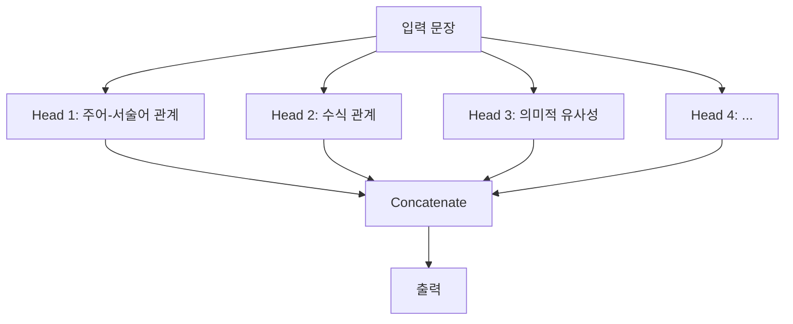

**수식:**

$$\text{MultiHead}(Q, K, V) = \text{Concat}(\text{head}_1, ..., \text{head}_h)W^O$$

$$\text{head}_i = \text{Attention}(QW_i^Q, KW_i^K, VW_i^V)$$

여기서:
- $h$: Head의 개수 (일반적으로 8 또는 16)
- $W_i^Q, W_i^K, W_i^V$: 각 Head의 학습 가능한 가중치
- $W^O$: 출력 가중치

**한국어 예시: "철수는 영희에게 예쁜 꽃을 선물했다"**

- **Head 1 (주어-서술어):**  
  "철수는" ↔ "선물했다" (높은 점수)

- **Head 2 (목적어-동사):**  
  "꽃을" ↔ "선물했다" (높은 점수)

- **Head 3 (수식 관계):**  
  "예쁜" ↔ "꽃을" (높은 점수)

- **Head 4 (간접목적어):**  
  "영희에게" ↔ "선물했다" (높은 점수)

각 Head가 문장의 다른 측면을 학습하여, 더 풍부한 표현을 만듭니다.

---

## 4. 근본적 차이점 비교

### 4.1. 정보 처리 방식

#### 4.1.1. 순차 vs 병렬

**Seq2Seq (순차 처리):**

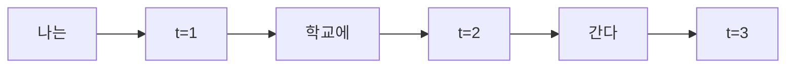

- 단어를 하나씩 순서대로 처리
- 이전 단어 처리가 완료되어야 다음 단어 처리 가능
- 시간 복잡도: O(n) - n은 시퀀스 길이

**Transformer (병렬 처리):**

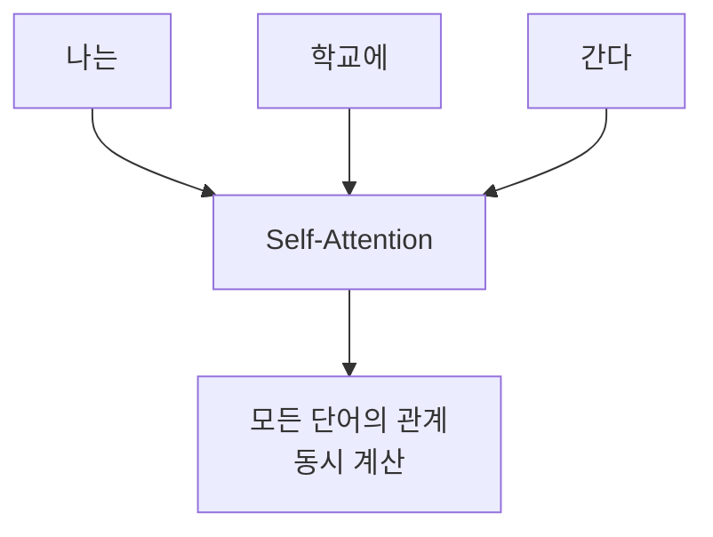

- 모든 단어를 동시에 처리
- 각 단어가 다른 모든 단어와 병렬로 상호작용
- 시간 복잡도: O(1) (시퀀스 길이와 무관)

#### 4.1.2. 시각화 비교

**정보 흐름 다이어그램:**

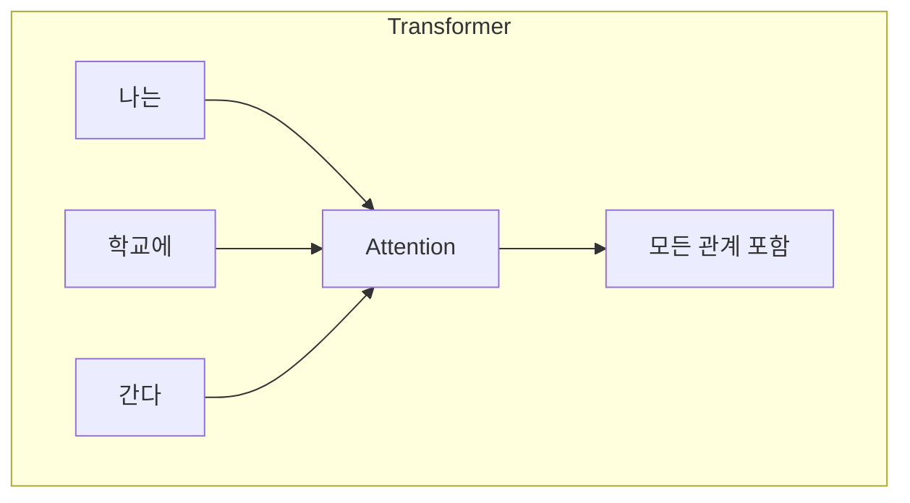


### 4.2. 정보 전달 경로

#### 4.2.1. 압축 vs 직접 참조

**Seq2Seq: 정보 압축 방식**


- 모든 정보를 하나의 벡터로 압축
- 정보 손실 발생 가능
- 긴 문장일수록 성능 저하

**Transformer: 직접 참조 방식**


- 각 단어가 필요한 정보에 직접 접근
- 정보 손실 없음
- 긴 문장에도 강건함

#### 4.2.2. 한국어 장문 예시로 이해하기

**예시 문장:**

```
"어제 친구를 만나서 영화를 보고 저녁을 먹고 커피를 마시며 
이야기를 나누다가 밤 11시에 집에 돌아왔는데 부모님께서 
걱정하셨다고 말씀하셨다"
```

**Seq2Seq의 처리:**

1. "어제" → h₁
2. "친구를" → h₂ (h₁ + "친구를")
3. "만나서" → h₃ (h₂ + "만나서")
4. ... (중간 과정)
5. "말씀하셨다" → h_final

h_final 하나에 모든 정보 (친구, 영화, 저녁, 커피, 11시, 부모님, 걱정)를 담아야 함 → 정보 손실 가능

**Transformer의 처리:**

"말씀하셨다"를 번역할 때:
- "부모님께서"와 직접 연결 (주어 확인)
- "걱정하셨다"와 직접 연결 (내용 확인)
- "어제"와 직접 연결 (시간 확인)

필요한 정보에 직접 접근하여 정확한 번역 가능

### 4.3. 계산 복잡도

#### 4.3.1. 시간 복잡도 비교

**Seq2Seq (RNN 기반):**

- **Sequential Computation(시퀀셜 컴퓨테이션, 순차 계산):** O(n)
  - n개의 단어를 순차적으로 처리
  - 각 단계가 이전 단계에 의존

- **Path Length(패스 렝스, 정보 전달 경로):** O(n)
  - 첫 단어 → 마지막 단어까지 n번의 계산 필요

**Transformer (Self-Attention 기반):**

- **Sequential Computation:** O(1)
  - 모든 단어를 병렬로 처리
  - GPU 활용 극대화

- **Path Length:** O(1)
  - 모든 단어가 직접 연결
  - 단 한 번의 Attention으로 모든 관계 파악

- **Self-Attention Computation:** O(n²)
  - n개 단어 × n개 단어의 관계 계산
  - 하지만 병렬 처리로 실제 시간은 짧음

**비교 표:**

| 특성 | Seq2Seq | Transformer |
|------|---------|-------------|
| 순차 계산 복잡도 | O(n) | O(1) |
| 정보 전달 경로 | O(n) | O(1) |
| Attention 계산 | - | O(n²) |
| 병렬화 가능성 | 불가능 | 가능 |
| GPU 활용도 | 낮음 | 높음 |

#### 4.3.2. 시퀀스 길이 영향

**시퀀스 길이 10 vs 100 비교:**

**Seq2Seq:**
- 길이 10: 10 단계 순차 처리
- 길이 100: 100 단계 순차 처리
- 처리 시간: 10배 증가

**Transformer:**
- 길이 10: 10×10 = 100 관계 계산 (병렬)
- 길이 100: 100×100 = 10,000 관계 계산 (병렬)
- 메모리: 100배 증가, 하지만 실제 처리 시간은 크게 증가하지 않음 (병렬 처리)

**실용적 의미:**

긴 문장일수록 Transformer가 유리합니다:
- Seq2Seq: 문장이 길어질수록 처리 시간 선형 증가
- Transformer: 문장이 길어져도 병렬 처리로 시간 증가 최소화

### 4.4. 장거리 의존성 처리

#### 4.4.1. 한국어 예시: 주어-서술어 호응

**예시 문장:**

```
"철수는 영희에게 자신이 어제 친구와 함께 본 영화가 
매우 재미있었다고 말했다"
```

주어 "철수는"와 서술어 "말했다" 사이에 14개의 단어가 있습니다.

**Seq2Seq의 처리:**


1. "철수는" 정보가 h₁에 저장
2. 14단계를 거치며 h₁₄까지 전달
3. 각 단계마다 정보가 조금씩 희석
4. "말했다"를 처리할 때 "철수는" 정보가 약해짐

**그래디언트 소실:**

$h_{14} = f(f(f(...f(h_1))))$

함수 중첩이 많아질수록 초기 정보의 영향력 감소

**Transformer의 처리:**

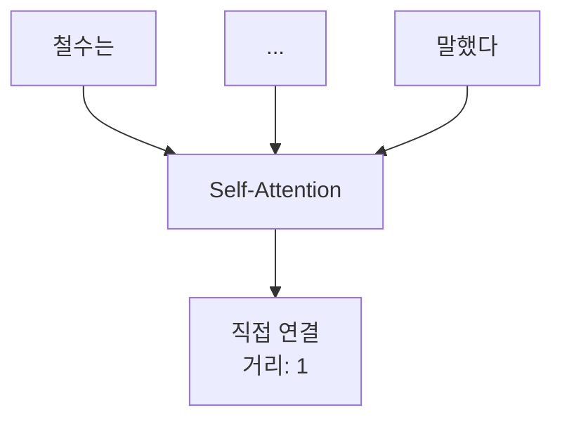

1. "말했다"가 "철수는"에 직접 Attention
2. 중간 단어 수와 무관하게 직접 참조
3. 정보 손실 없음

**Attention Score 예시:**

|          | 철수는 | 영희에게 | 자신이 | ... | 말했다 |
|----------|--------|----------|--------|-----|--------|
| 말했다   | 0.45   | 0.10     | 0.15   | ... | 0.10   |

"말했다"가 "철수는"에 높은 Attention을 부여하여 주어를 정확히 파악

**성능 차이:**

- **Seq2Seq:** 단어 간 거리가 멀수록 정확도 급격히 하락
- **Transformer:** 단어 간 거리와 무관하게 일정한 성능 유지

---

## 5. 실제 학습 과정의 차이

### 5.1. 학습 속도 및 효율성

**Seq2Seq:**

**배치 처리(Batch Processing)의 제약:**

```
배치 1: "나는 학교에 간다" (4단어)
배치 2: "그는 집에 있다" (4단어)
```

두 문장을 동시에 학습하려 해도, 각 문장은 순차적으로 처리되어야 합니다.

- 배치 내 병렬화: 가능
- 문장 내 병렬화: 불가능
- GPU 활용률: 30-50%

**학습 시간:**
- WMT 영어-독일어 데이터셋
- Seq2Seq: 약 2주 (8 GPU)

**Transformer:**

**완전한 병렬 처리:**

```
배치 1: "나는 학교에 간다"
  → ["나는", "학교에", "간다"] 동시 처리
배치 2: "그는 집에 있다"
  → ["그는", "집에", "있다"] 동시 처리
```

- 배치 내 병렬화: 가능
- 문장 내 병렬화: 가능
- GPU 활용률: 80-95%

**학습 시간:**
- WMT 영어-독일어 데이터셋
- Transformer Base: 약 12시간 (8 GPU)
- 약 28배 빠름

**학습 효율성 비교:**

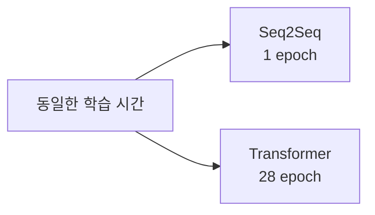

### 5.2. 메모리 요구사항

**Seq2Seq:**

**메모리 사용:**
- Hidden State: O(n × d)
  - n: 시퀀스 길이
  - d: Hidden 차원
- 순차 처리로 메모리 효율적
- 긴 문장도 메모리 부담 적음

**예시:**
- 시퀀스 길이: 50
- Hidden 차원: 512
- 메모리: 50 × 512 = 25,600

**Transformer:**

**메모리 사용:**
- Attention Matrix: O(n² × d)
  - 모든 단어 쌍의 관계 저장
- Self-Attention Score: O(n²)
- 긴 문장일수록 메모리 사용 급증

**예시:**
- 시퀀스 길이: 50
- Hidden 차원: 512
- Attention Matrix: 50 × 50 = 2,500 (각 Head마다)
- Multi-Head (8개): 2,500 × 8 = 20,000

**메모리 비교:**

| 시퀀스 길이 | Seq2Seq | Transformer |
|-------------|---------|-------------|
| 10 | 5,120 | ~10,000 |
| 50 | 25,600 | ~250,000 |
| 100 | 51,200 | ~1,000,000 |
| 512 | 262,144 | ~26,000,000 |

**해결책:**

Transformer는 긴 시퀀스 처리를 위한 다양한 기법 개발:
- **Sparse Attention(스파스 어텐션):** 일부 관계만 계산
- **Linformer(린포머):** 선형 복잡도로 근사
- **Longformer(롱포머):** 로컬 + 글로벌 Attention 조합

### 5.3. 그래디언트 흐름의 차이

**Seq2Seq의 Vanishing Gradient:**

**역전파 경로:**

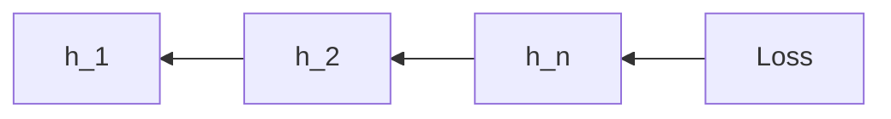

$\frac{\partial L}{\partial h_1} = \frac{\partial L}{\partial h_n} \times \prod_{t=2}^{n} \frac{\partial h_t}{\partial h_{t-1}}$

**문제:**
- n이 클수록 곱셈 반복
- 각 항이 1보다 작으면 그래디언트 소실
- 각 항이 1보다 크면 그래디언트 폭발(Gradient Exploding, 그래디언트 익스플로딩)

**실제 예시:**

만약 $\frac{\partial h_t}{\partial h_{t-1}} = 0.9$ 라면:

- 10 단계: $0.9^{10} = 0.349$
- 20 단계: $0.9^{20} = 0.122$
- 50 단계: $0.9^{50} = 0.005$

50번째 단계에서는 그래디언트가 거의 0에 가까워집니다.

**Transformer의 직접 경로:**

**역전파 경로:**

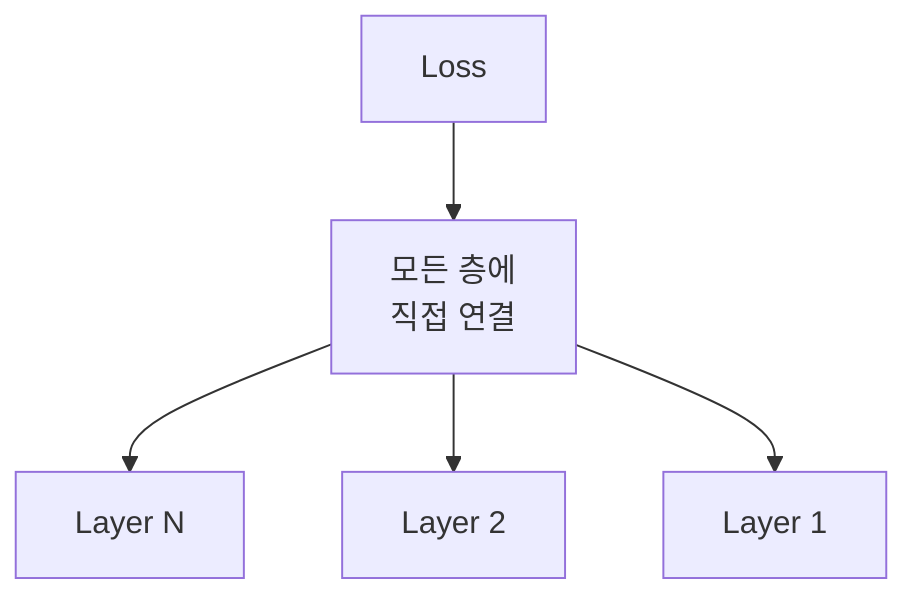

**Self-Attention의 그래디언트 흐름:**

$\frac{\partial L}{\partial \text{input}} = \frac{\partial L}{\partial \text{Attention}} \times \frac{\partial \text{Attention}}{\partial \text{input}}$

- 직접 연결로 그래디언트 소실 최소화
- Residual Connection(레지듀얼 커넥션, 잔차 연결)으로 추가 안정화

**Residual Connection:**

$\text{output} = \text{LayerNorm}(x + \text{Sublayer}(x))$

원본 입력 $x$를 직접 더해줌으로써:
- 그래디언트가 우회 경로 확보
- 깊은 네트워크에서도 안정적 학습

**비교:**

| 특성 | Seq2Seq | Transformer |
|------|---------|-------------|
| 그래디언트 경로 | 순차적, 긴 경로 | 직접, 짧은 경로 |
| 소실 위험 | 높음 | 낮음 |
| 최대 학습 가능 길이 | ~100 | ~512+ |
| 안정성 | 불안정 | 안정적 |

---

## 6. 왜 Transformer가 대세가 되었는가

### 6.1. 성능 향상

**기계 번역 벤치마크 (BLEU Score):**

WMT 2014 영어-독일어 번역 과제:

| 모델 | BLEU Score | 학습 시간 |
|------|-----------|----------|
| Seq2Seq (기본) | 24.5 | ~2주 |
| Seq2Seq + Attention | 26.8 | ~2주 |
| Transformer Base | 27.3 | 12시간 |
| Transformer Big | 28.4 | 3.5일 |

**성능 향상 요인:**

1. **장거리 의존성 처리**  
   긴 문장에서도 정확한 번역 가능

2. **문맥 이해**  
   Self-Attention으로 풍부한 문맥 표현

3. **병렬 학습**  
   더 많은 데이터로 더 빠르게 학습

**한국어-영어 번역 예시:**

```
입력: "철수는 영희에게 자신이 좋아하는 책을 선물했다"
```

**Seq2Seq 번역:**  
"Cheolsu gave a book that himself likes to Younghee"  
(부자연스러운 표현)

**Transformer 번역:**  
"Cheolsu gave Younghee a book that he likes"  
(자연스럽고 정확한 표현)

### 6.2. 확장성

**모델 크기 확장 (Scalability, 스케일러빌리티):**

Transformer는 모델을 크게 만들수록 성능이 향상되는 특성이 있습니다.

**모델 크기 비교:**

| 모델 | 파라미터 수 | 성능 |
|------|------------|------|
| Transformer Base | 65M | 기준 |
| Transformer Big | 213M | +4% |
| BERT Base | 110M | 다양한 태스크 |
| BERT Large | 340M | +5% |
| GPT-2 | 1.5B | 큰 향상 |
| GPT-3 | 175B | 혁신적 |

**Scaling Law(스케일링 로, 스케일링 법칙):**

모델 크기, 데이터 크기, 컴퓨팅 자원을 늘릴수록 성능이 예측 가능하게 향상됩니다.

$\text{Loss} \propto N^{-\alpha}$

여기서:
- $N$: 모델 파라미터 수
- $\alpha$: 스케일링 지수 (약 0.076)

**Seq2Seq의 한계:**

Seq2Seq는 모델을 키워도 성능 향상이 제한적입니다:
- 순차 처리의 병목
- 긴 시퀀스에서 그래디언트 소실
- 확장에 따른 학습 불안정성

### 6.3. 전이 학습의 가능성

**전이 학습(Transfer Learning, 트랜스퍼 러닝)이란?**

하나의 태스크에서 학습한 지식을 다른 태스크에 활용하는 것입니다.

**Transformer 이전 (Seq2Seq):**

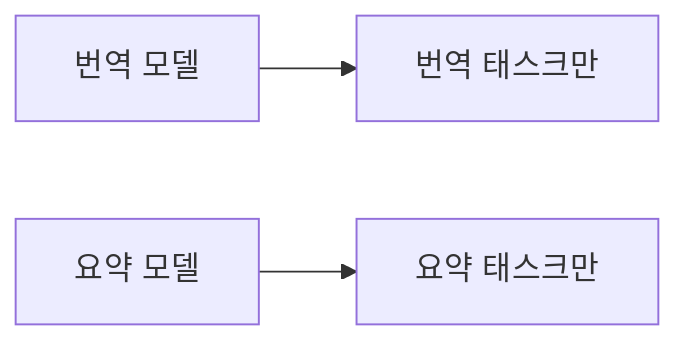

각 태스크마다 별도의 모델을 처음부터 학습해야 했습니다.

**Transformer 이후:**

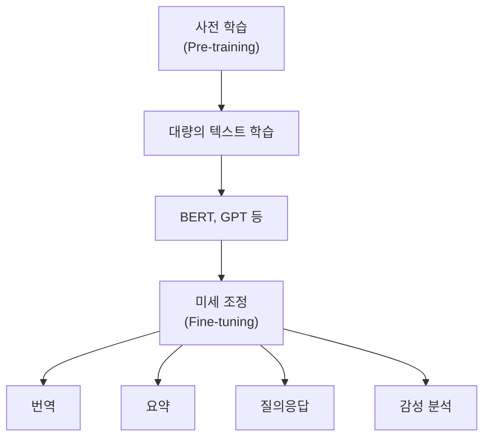

하나의 사전 학습된 모델을 다양한 태스크에 적용 가능합니다.

**실용적 이점:**

1. **학습 시간 단축**  
   - 처음부터 학습: 수주~수개월
   - 미세 조정: 수시간~수일

2. **데이터 효율성**  
   - 적은 데이터로도 좋은 성능
   - 소규모 데이터셋에도 적용 가능

3. **범용성**  
   - 하나의 모델로 다양한 태스크 해결

**한국어 NLP 예시:**

```
사전 학습: 위키피디아, 뉴스 등 대량 한국어 텍스트
         ↓
미세 조정 1: 네이버 영화 리뷰 감성 분석
미세 조정 2: 한국어-영어 번역
미세 조정 3: 법률 문서 요약
미세 조정 4: 의료 개체명 인식
```

### 6.4. 현대 LLM의 기반

**Transformer → BERT → GPT → ChatGPT**

현대의 모든 대형 언어 모델(Large Language Model, LLM)은 Transformer 아키텍처를 기반으로 합니다.

**발전 과정:**

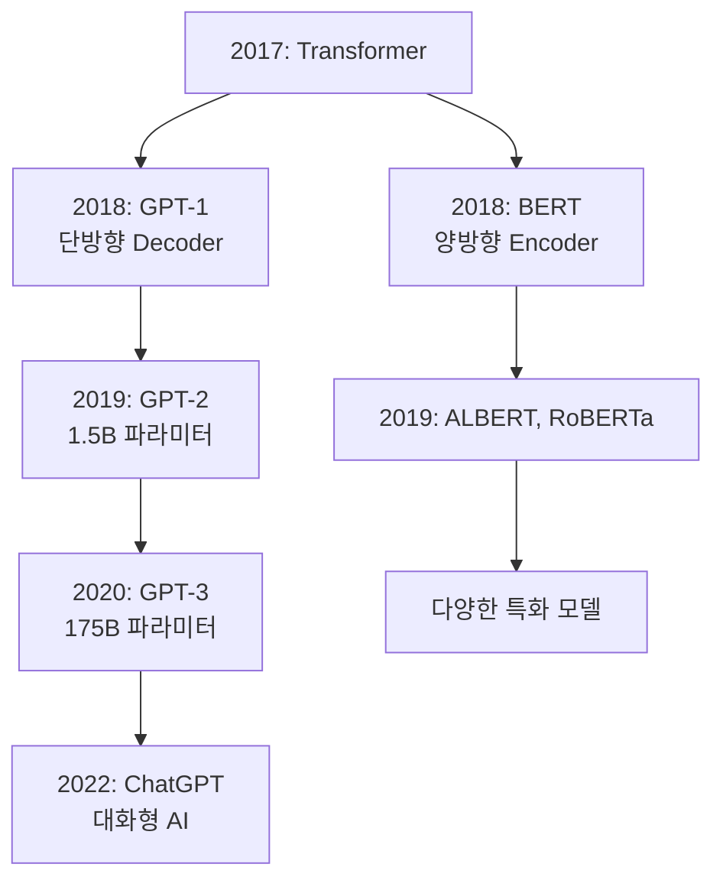

**주요 모델들:**

**BERT (Bidirectional Encoder Representations from Transformers):**
- Transformer의 Encoder만 사용
- 양방향 문맥 학습
- 분류, 개체명 인식 등에 강점

**GPT (Generative Pre-trained Transformer):**
- Transformer의 Decoder만 사용
- 텍스트 생성에 특화
- 자연스러운 문장 생성

**T5 (Text-to-Text Transfer Transformer):**
- 전체 Transformer 구조 사용
- 모든 NLP 태스크를 텍스트 생성으로 통일

**현재 영향력:**

- 검색 엔진: Google BERT 적용
- 번역: Google Translate, DeepL
- 챗봇: ChatGPT, Claude, Bard
- 코드 생성: GitHub Copilot
- 이미지 생성: DALL-E (Transformer 변형)

---

## 7. 결론

### 7.1. 두 모델의 역사적 의의

**Seq2Seq (2014-2017):**

**혁신:**
- 가변 길이 시퀀스 처리의 패러다임 제시
- Encoder-Decoder 구조의 확립
- 기계 번역의 실용화

**기여:**
- End-to-End(엔드-투-엔드) 학습의 가능성 입증
- Attention 메커니즘의 필요성 인식
- 현대 NLP의 기초 마련

**Transformer (2017-현재):**

**혁명:**
- RNN의 완전한 대체
- 병렬 처리로 학습 속도 혁신
- 확장 가능한 아키텍처 제시

**영향:**
- 모든 현대 LLM의 기반
- AI 산업의 폭발적 성장 촉진
- 자연어 처리를 넘어 다양한 분야로 확산

**비유:**

Seq2Seq는 증기 기관차, Transformer는 고속 전철에 비유할 수 있습니다:
- Seq2Seq: 순차적이지만 느림, 짧은 거리에 적합
- Transformer: 병렬적이고 빠름, 장거리에 강점

### 7.2. 적용 분야별 선택 기준

**여전히 Seq2Seq가 유용한 경우:**

1. **제한된 리소스 환경**
   - 메모리가 매우 제한적인 임베디드 시스템
   - 모바일 디바이스에서의 온디바이스 추론
   - 짧은 시퀀스 처리 (10단어 이하)

2. **실시간 스트리밍 처리**
   - 음성 인식 (단어를 순차적으로 받음)
   - 실시간 자막 생성
   - 순차적 데이터 처리가 필수인 경우

3. **교육 목적**
   - RNN의 기본 개념 학습
   - 순차 처리의 이해
   - 간단한 구현 실습

**Transformer가 필수적인 경우:**

1. **장문 처리**
   - 문서 번역 (100단어 이상)
   - 긴 문맥 이해 필요
   - 장거리 의존성 중요

2. **높은 성능 요구**
   - 최신 벤치마크 달성 목표
   - 상용 서비스 개발
   - 경쟁력 있는 모델 필요

3. **전이 학습 활용**
   - 사전 학습된 모델 활용
   - 다양한 태스크 적용
   - 빠른 프로토타이핑

4. **대규모 학습**
   - 충분한 컴퓨팅 자원 보유
   - 대량의 학습 데이터 확보
   - 확장 가능한 모델 필요

**비교 표:**

| 기준 | Seq2Seq 선택 | Transformer 선택 |
|------|--------------|------------------|
| 시퀀스 길이 | < 20 | > 20 |
| 메모리 | < 2GB | > 4GB |
| 학습 시간 | 중요하지 않음 | 빠를수록 좋음 |
| 성능 요구 | 중간 정도 | 최고 수준 |
| 실시간 처리 | 필수 | 배치 처리 가능 |

### 7.3. 앞으로의 방향

**Transformer의 진화:**

**1. 효율성 개선**

긴 시퀀스 처리를 위한 다양한 변형:

- **Linformer:** O(n²) → O(n) 복잡도 감소
- **Reformer(리포머):** Locality-Sensitive Hashing(로컬리티-센시티브 해싱) 활용
- **Longformer:** 로컬 + 글로벌 Attention 조합
- **BigBird:** Sparse Attention 패턴

**2. 멀티모달(Multimodal, 멀티모달) 확장**

텍스트를 넘어 다양한 데이터 처리:

- **Vision Transformer (ViT):** 이미지 분류
- **DALL-E:** 텍스트 → 이미지 생성
- **Whisper:** 음성 인식
- **CLIP:** 이미지-텍스트 통합 이해

**3. 더 큰 모델**

지속적인 스케일 업:

```mermaid
graph LR
    A["GPT-3<br/>175B"] --> B["PaLM<br/>540B"]
    B --> C["GPT-4<br/>추정 1T+"]
    C --> D["미래 모델<br/>???"]
```

**4. 효율적 학습 기법**

- **LoRA (Low-Rank Adaptation):** 파라미터 효율적 미세 조정
- **Quantization(퀀타이제이션):** 모델 경량화
- **Distillation(디스틸레이션):** 작은 모델로 지식 전달

**한국어 NLP의 미래:**

1. **대규모 한국어 모델**
   - KoGPT, HyperCLOVA 등의 발전
   - 한국어 특성을 반영한 최적화

2. **다국어 모델 통합**
   - 한국어를 포함한 범용 모델
   - 언어 간 전이 학습 활용

3. **도메인 특화 모델**
   - 의료, 법률, 금융 등 전문 분야
   - 한국어 문화 컨텍스트 이해

**근본적 질문:**

Transformer를 넘어설 새로운 아키텍처가 나올까요?

현재로서는 Transformer의 핵심 아이디어인 "Attention 메커니즘"이 너무나 강력하여, 완전히 다른 접근법이 나오기는 어려워 보입니다. 하지만 과학의 역사는 항상 예상을 뛰어넘는 혁신을 보여주었습니다.

다음 혁신은 어디서 올까요?
- 뇌과학에서 영감을 받은 새로운 구조?
- 양자 컴퓨팅을 활용한 완전히 새로운 방식?
- 에너지 효율성을 극대화한 새로운 패러다임?

**최종 정리:**

```mermaid
graph TD
    A["Seq2Seq<br/>순차 처리의 시작"] --> B["Transformer<br/>병렬 처리의 혁명"]
    B --> C["BERT, GPT<br/>전이 학습의 확산"]
    C --> D["현대 LLM<br/>AI의 대중화"]
    D --> E["미래<br/>???"]
```

Seq2Seq가 문을 열었고, Transformer가 그 문을 활짝 열어젖혔습니다.<br/>
이제 우리는 AI의 황금기를 살아가고 있으며, 앞으로 어떤 혁신이 올지 기대됩니다.

---

## 8. 용어 목록

### 영문 - 한글 - 설명

| 영문 용어 | 한글 | 설명 |
|-----------|------|------|
| Activation Function | 활성화 함수 | 신경망의 비선형성을 도입하는 함수 (예: tanh, ReLU) |
| Architecture | 아키텍처 | 모델의 전체적인 구조와 설계 방식 |
| Attention Mechanism | 어텐션 메커니즘 | 입력의 특정 부분에 집중하여 가중치를 부여하는 기법 |
| Backpropagation | 역전파 | 손실 함수의 그래디언트를 계층별로 역방향으로 전달하는 학습 알고리즘 |
| Batch Processing | 배치 프로세싱 | 여러 샘플을 묶어서 동시에 처리하는 방식 |
| BERT | 버트 | Bidirectional Encoder Representations from Transformers, 양방향 인코더 기반 사전학습 모델 |
| Bias | 편향 | 신경망에서 활성화 함수에 더해지는 상수 |
| Bidirectional | 양방향 | 순방향과 역방향 모두를 고려하는 처리 방식 |
| BLEU Score | 블루 스코어 | 기계 번역 품질을 평가하는 자동 평가 지표 |
| Bottleneck | 병목 현상 | 정보 전달 경로에서 용량이 제한되어 성능이 저하되는 현상 |
| Computational Complexity | 컴퓨테이셔널 컴플렉시티 | 알고리즘의 계산량을 나타내는 척도 |
| Concatenate | 컨캐터네이트 | 여러 벡터나 행렬을 이어붙이는 연산 |
| Context Dependency | 컨텍스트 디펜던시 | 문맥에 따라 의미가 달라지는 특성 |
| Context Vector | 컨텍스트 벡터 | Seq2Seq에서 인코더의 마지막 상태로, 입력 문장의 의미를 압축한 벡터 |
| Cross-Attention | 크로스 어텐션 | 서로 다른 시퀀스 간의 관계를 계산하는 Attention |
| Decoder | 디코더 | 인코딩된 정보를 받아 출력 시퀀스를 생성하는 부분 |
| Dimensionality | 디멘셔널리티 | 벡터나 행렬의 차원 수 |
| Distillation | 디스틸레이션 | 큰 모델의 지식을 작은 모델로 전달하는 기법 |
| Dot Product | 닷 프로덕트 | 두 벡터의 각 성분을 곱한 후 합산하는 연산 |
| Embedding | 임베딩 | 단어나 토큰을 고정 차원의 벡터로 변환하는 것 |
| Encoder | 인코더 | 입력 시퀀스를 고정된 표현으로 변환하는 부분 |
| Encoder-Decoder | 인코더-디코더 | 입력을 인코딩하고 출력을 디코딩하는 두 단계 구조 |
| End-to-End | 엔드-투-엔드 | 입력부터 출력까지 한 번에 학습하는 방식 |
| Epoch | 에포크 | 전체 학습 데이터를 한 번 학습하는 단위 |
| Feed-Forward Network | 피드-포워드 네트워크 | 순방향으로만 정보가 전달되는 신경망 |
| Fine-tuning | 파인-튜닝 | 사전 학습된 모델을 특정 작업에 맞게 추가 학습하는 것 |
| GPT | 지피티 | Generative Pre-trained Transformer, 생성형 사전학습 트랜스포머 |
| Gradient | 그래디언트 | 손실 함수의 기울기, 파라미터 업데이트 방향을 나타냄 |
| Gradient Descent | 그래디언트 디센트 | 그래디언트를 이용해 손실을 최소화하는 최적화 알고리즘 |
| Gradient Exploding | 그래디언트 익스플로딩 | 역전파 과정에서 그래디언트가 급격히 커지는 현상 |
| Hidden Dimension | 히든 디멘션 | Hidden State의 벡터 크기 |
| Hidden State | 히든 스테이트 | RNN에서 각 시점의 내부 상태를 나타내는 벡터 |
| Hyperparameter | 하이퍼파라미터 | 학습 전에 설정하는 모델의 외부 파라미터 (예: 학습률, 배치 크기) |
| Key | 키 | Attention 메커니즘에서 Query와 매칭되는 벡터 |
| Large Language Model (LLM) | 대형 언어 모델 | 수십억 개 이상의 파라미터를 가진 대규모 언어 모델 |
| Layer Normalization | 레이어 노멀라이제이션 | 각 레이어의 출력을 정규화하여 학습을 안정화하는 기법 |
| Linformer | 린포머 | 선형 복잡도를 가진 Transformer 변형 모델 |
| Locality-Sensitive Hashing | 로컬리티-센시티브 해싱 | 유사한 항목을 효율적으로 찾는 해싱 기법 |
| Longformer | 롱포머 | 긴 시퀀스 처리에 특화된 Transformer 변형 |
| Long-range Dependency | 롱레인지 디펜던시 | 멀리 떨어진 단어 간의 의존 관계 |
| LoRA | 로라 | Low-Rank Adaptation, 파라미터 효율적 미세 조정 기법 |
| Loss Function | 손실 함수 | 모델의 예측과 실제 값의 차이를 측정하는 함수 |
| Matrix | 매트릭스 | 2차원 배열 형태의 수학적 객체 |
| Multi-Head Attention | 멀티-헤드 어텐션 | 여러 개의 Attention을 병렬로 수행하는 기법 |
| Multimodal | 멀티모달 | 여러 종류의 데이터(텍스트, 이미지, 음성 등)를 함께 처리 |
| Natural Language Processing (NLP) | 자연어 처리 | 인간의 언어를 컴퓨터가 이해하고 처리하는 기술 |
| Neural Network | 뉴럴 네트워크 | 뇌의 신경망을 모방한 기계학습 모델 |
| Optimization | 옵티마이제이션 | 손실 함수를 최소화하도록 파라미터를 조정하는 과정 |
| Parallel Processing | 패러럴 프로세싱 | 여러 작업을 동시에 수행하는 방식 |
| Parameter | 파라미터 | 학습을 통해 조정되는 모델의 가중치 |
| Path Length | 패스 렝스 | 정보가 전달되는 경로의 길이 |
| Positional Encoding | 포지셔널 인코딩 | 토큰의 위치 정보를 벡터로 인코딩하는 기법 |
| Pre-training | 프리-트레이닝 | 대량의 데이터로 모델을 먼저 학습하는 단계 |
| Query | 쿼리 | Attention 메커니즘에서 정보를 요청하는 벡터 |
| Quantization | 퀀타이제이션 | 모델의 가중치를 낮은 정밀도로 변환하여 경량화하는 기법 |
| Recurrent Neural Network (RNN) | 리커런트 뉴럴 네트워크 | 순차 데이터 처리를 위한 순환 구조의 신경망 |
| Reformer | 리포머 | 메모리 효율적인 Transformer 변형 모델 |
| Residual Connection | 레지듀얼 커넥션 | 입력을 출력에 직접 더해주는 연결 (Skip Connection) |
| Scalability | 스케일러빌리티 | 모델이나 시스템을 확장할 수 있는 능력 |
| Scaled Dot-Product Attention | 스케일드 닷-프로덕트 어텐션 | 스케일링된 내적 기반 Attention 계산 방식 |
| Scaling Factor | 스케일링 팩터 | 값의 크기를 조정하기 위한 상수 |
| Scaling Law | 스케일링 로 | 모델 크기와 성능 간의 관계를 나타내는 법칙 |
| Self-Attention | 셀프-어텐션 | 같은 시퀀스 내 토큰 간의 관계를 계산하는 Attention |
| Sequence | 시퀀스 | 순서가 있는 데이터의 나열 (예: 문장의 단어들) |
| Sequence-to-Sequence (Seq2Seq) | 시퀀스-투-시퀀스 | 입력 시퀀스를 출력 시퀀스로 변환하는 모델 |
| Sequential Computation | 시퀀셜 컴퓨테이션 | 순차적으로 계산하는 방식 |
| Sequential Processing | 시퀀셜 프로세싱 | 데이터를 순서대로 하나씩 처리하는 방식 |
| Softmax | 소프트맥스 | 벡터를 확률 분포로 변환하는 함수 |
| Sparse Attention | 스파스 어텐션 | 일부 관계만 계산하는 효율적인 Attention |
| Sublayer | 서브레이어 | 신경망의 하위 계층 |
| Tanh | 탄젠트 하이퍼볼릭 | 하이퍼볼릭 탄젠트 활성화 함수 |
| Time Complexity | 타임 컴플렉시티 | 알고리즘의 실행 시간 복잡도 |
| Token | 토큰 | 텍스트를 구성하는 최소 단위 (단어, 서브워드, 문자 등) |
| Transformer | 트랜스포머 | Attention 기반의 병렬 처리 신경망 아키텍처 |
| Transfer Learning | 트랜스퍼 러닝 | 한 작업에서 학습한 지식을 다른 작업에 활용하는 기법 |
| Value | 밸류 | Attention 메커니즘에서 실제 전달되는 정보 벡터 |
| Vanishing Gradient | 배니싱 그래디언트 | 역전파 과정에서 그래디언트가 점점 작아지는 현상 |
| Vector | 벡터 | 1차원 배열 형태의 수학적 객체 |
| Vision Transformer (ViT) | 비전 트랜스포머 | 이미지 처리를 위한 Transformer 변형 |
| Weight Matrix | 웨이트 매트릭스 | 신경망의 가중치를 담은 행렬 |
| Word Order Variation | 워드 오더 베리에이션 | 언어마다 다른 단어 배열 순서 |

---

## 참고 문헌 및 추가 학습 자료

### 주요 논문

1. **Sequence to Sequence Learning with Neural Networks (2014)**
   - Sutskever, I., Vinyals, O., & Le, Q. V.
   - Seq2Seq 모델의 원조 논문
   - [arXiv:1409.3215](https://arxiv.org/abs/1409.3215)

2. **Neural Machine Translation by Jointly Learning to Align and Translate (2014)**
   - Bahdanau, D., Cho, K., & Bengio, Y.
   - Attention 메커니즘 도입
   - [arXiv:1409.0473](https://arxiv.org/abs/1409.0473)

3. **Attention Is All You Need (2017)**
   - Vaswani, A., et al.
   - Transformer 모델 제안
   - [arXiv:1706.03762](https://arxiv.org/abs/1706.03762)

4. **BERT: Pre-training of Deep Bidirectional Transformers for Language Understanding (2018)**
   - Devlin, J., et al.
   - 양방향 사전 학습 모델
   - [arXiv:1810.04805](https://arxiv.org/abs/1810.04805)

5. **Language Models are Few-Shot Learners (2020)**
   - Brown, T. B., et al.
   - GPT-3 논문
   - [arXiv:2005.14165](https://arxiv.org/abs/2005.14165)

### 추천 학습 경로

**초급 (기초 다지기):**
1. RNN과 LSTM의 기본 원리 이해
2. Seq2Seq 구조와 Attention 메커니즘 학습
3. 간단한 번역 모델 구현 실습
4. 벡터와 행렬 연산 복습
5. 역전파 알고리즘 이해

**중급 (심화 학습):**
1. Transformer 아키텍처 상세 분석
2. Self-Attention과 Multi-Head Attention 이해
3. Positional Encoding의 수학적 원리
4. PyTorch/TensorFlow로 Transformer 구현
5. 다양한 Attention 변형 학습

**고급 (응용 및 최신 연구):**
1. BERT, GPT 등 사전 학습 모델 활용
2. 효율적인 Transformer 변형 모델 연구
3. 실제 프로젝트에 적용 및 최적화
4. 최신 논문 읽고 구현하기
5. 한국어 특화 모델 개발

### 온라인 자료

**영문 자료:**
- **Stanford CS224N:** Natural Language Processing with Deep Learning
  - 체계적인 NLP 강의
- **Hugging Face Transformers 문서:** 
  - 실전 구현 가이드 및 사전 학습 모델
- **The Illustrated Transformer (Jay Alammar):**
  - 시각적 설명 블로그
  - [https://jalammar.github.io/illustrated-transformer/](https://jalammar.github.io/illustrated-transformer/)
- **Papers with Code:**
  - 최신 연구 동향 및 코드
  - [https://paperswithcode.com/](https://paperswithcode.com/)

**한국어 자료:**
- **모두를 위한 딥러닝 (DeepLearningZeroToAll)**
  - 기초부터 차근차근 배우는 강의
- **핸즈온 머신러닝 (Hands-On Machine Learning)**
  - 실습 중심의 한국어 번역서
- **한국어 임베딩 (Korean Word Embeddings)**
  - 한국어 NLP 특화 자료
- **KoNLPy:**
  - 한국어 자연어 처리 라이브러리
  - [https://konlpy.org/](https://konlpy.org/)

### 실습 도구

**프레임워크:**
- **PyTorch:** 연구 및 프로토타이핑에 적합
- **TensorFlow/Keras:** 프로덕션 배포에 강점
- **Hugging Face Transformers:** 사전 학습 모델 활용

**개발 환경:**
- **Google Colab:** 무료 GPU 제공
- **Jupyter Notebook:** 대화형 개발 환경
- **VS Code:** 통합 개발 환경

### 데이터셋

**영어:**
- WMT (Workshop on Machine Translation)
- SQuAD (Stanford Question Answering Dataset)
- GLUE (General Language Understanding Evaluation)

**한국어:**
- 모두의 말뭉치 (국립국어원)
- KorQuAD (한국어 질의응답 데이터셋)
- NSMC (네이버 영화 리뷰 감성 분석)

---

## 마치며

이 문서는 Seq2Seq와 Transformer의 근본적인 차이를 이해하기 위한 학습 자료입니다. 

**핵심 요약:**

| 비교 항목 | Seq2Seq | Transformer |
|----------|---------|-------------|
| **처리 방식** | 순차 처리 | 병렬 처리 |
| **정보 전달** | 압축 (Context Vector) | 직접 참조 (Self-Attention) |
| **속도** | 느림 (O(n)) | 빠름 (O(1)) |
| **장거리 의존성** | 약함 | 강함 |
| **메모리** | 효율적 (O(n)) | 많이 필요 (O(n²)) |
| **확장성** | 제한적 | 뛰어남 |
| **현재 사용** | 제한적 | 대세 |

**학습 포인트:**

1. **근본적 차이 이해:** Seq2Seq는 순차 처리와 압축, Transformer는 병렬 처리와 직접 참조
2. **수식의 의미 파악:** 각 수식이 실제로 무엇을 계산하는지 직관적으로 이해
3. **한국어 예시 활용:** 익숙한 한국어 문장으로 개념 체화
4. **트레이드오프 인식:** 속도 vs 메모리, 성능 vs 효율성의 균형
