# BERT와 GPT: 트랜스포머 기반 사전학습 모델의 두 가지 접근법

## 목차
1. [서론](#1-서론)<br/>
2. [트랜스포머 아키텍처 개요](#2-트랜스포머-아키텍처-개요)<br/>
   - 2.1. [인코더(Encoder)](#21-인코더encoder)<br/>
   - 2.2. [디코더(Decoder)](#22-디코더decoder)<br/>
3. [BERT: 양방향 인코더 표현](#3-bert-양방향-인코더-표현)<br/>
   - 3.1. [기본 구조](#31-기본-구조)<br/>
   - 3.2. [사전학습 방식](#32-사전학습-방식)<br/>
   - 3.3. [작동 메커니즘](#33-작동-메커니즘)<br/>
   - 3.4. [적합한 응용 분야](#34-적합한-응용-분야)<br/>
4. [GPT: 생성적 사전학습 트랜스포머](#4-gpt-생성적-사전학습-트랜스포머)<br/>
   - 4.1. [기본 구조](#41-기본-구조)<br/>
   - 4.2. [사전학습 방식](#42-사전학습-방식)<br/>
   - 4.3. [작동 메커니즘](#43-작동-메커니즘)<br/>
   - 4.4. [적합한 응용 분야](#44-적합한-응용-분야)<br/>
5. [BERT와 GPT의 핵심 차이점](#5-bert와-gpt의-핵심-차이점)<br/>
   - 5.1. [아키텍처 차이](#51-아키텍처-차이)<br/>
   - 5.2. [학습 목표 차이](#52-학습-목표-차이)<br/>
   - 5.3. [어텐션 메커니즘 차이](#53-어텐션-메커니즘-차이)<br/>
   - 5.4. [응용 방식 차이](#54-응용-방식-차이)<br/>
6. [실전 응용 사례 비교](#6-실전-응용-사례-비교)<br/>
7. [결론](#7-결론)<br/>
8. [용어 목록](#8-용어-목록)<br/>

---

## 1. 서론

2018년은 자연어 처리(NLP, Natural Language Processing) 분야에 혁명적인 해였습니다.<br/>
구글의 **BERT**(Bidirectional Encoder Representations from Transformers)와 OpenAI의 **GPT**(Generative Pre-trained Transformer)가 등장하면서, 사전학습된 대규모 언어 모델의 시대가 본격적으로 열렸습니다.

두 모델 모두 트랜스포머(Transformer) 아키텍처를 기반으로 하지만, 설계 철학과 작동 방식에서 근본적인 차이를 보입니다.<br/>
이 문서에서는 BERT와 GPT의 구조적 차이, 학습 방식, 그리고 각각이 가장 적합한 응용 분야를 심층적으로 살펴보겠습니다.

---

## 2. 트랜스포머 아키텍처 개요

BERT와 GPT를 이해하기 위해서는 먼저 트랜스포머 아키텍처의 기본 구조를 알아야 합니다.<br/>
2017년 "Attention is All You Need" 논문에서 제안된 트랜스포머는 **인코더(Encoder)**와 **디코더(Decoder)**로 구성됩니다.

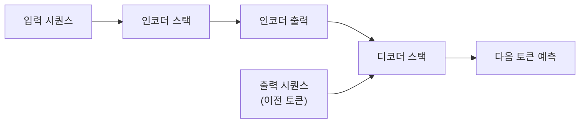

### 2.1. 인코더(Encoder)

인코더는 입력 텍스트를 받아 **문맥적 표현(contextual representation)**을 생성합니다. 인코더의 핵심 특징은:

- **양방향 어텐션(Bidirectional Attention)**: 각 토큰이 문장 내 모든 다른 토큰을 참조할 수 있습니다
- **셀프 어텐션(Self-Attention)**: 입력 시퀀스 내에서 토큰 간의 관계를 학습합니다
- **병렬 처리**: 순차적(sequential) 처리가 아닌 병렬 처리가 가능합니다

인코더 블록의 구조:

$$
\text{Encoder}(X) = \text{LayerNorm}(X + \text{FFN}(\text{LayerNorm}(X + \text{MultiHead}(X, X, X))))
$$

여기서:
- $X$: 입력 임베딩
- $\text{MultiHead}$: 멀티헤드 어텐션
- $\text{FFN}$: 피드포워드 신경망(Feed-Forward Network)
- $\text{LayerNorm}$: 레이어 정규화(Layer Normalization)

### 2.2. 디코더(Decoder)

디코더는 인코더의 출력과 이전에 생성된 토큰을 입력으로 받아 다음 토큰을 생성합니다. 디코더의 핵심 특징은:

- **마스크드 셀프 어텐션(Masked Self-Attention)**: 미래 토큰을 볼 수 없도록 마스킹합니다
- **인코더-디코더 어텐션**: 인코더의 출력에 어텐션을 적용합니다
- **자기회귀적 생성(Autoregressive Generation)**: 순차적으로 토큰을 생성합니다

---

## 3. BERT: 양방향 인코더 표현

BERT(Bidirectional Encoder Representations from Transformers)는 구글에서 2018년 10월 발표한 모델로, 트랜스포머의 **인코더만**을 사용합니다.

### 3.1. 기본 구조

BERT는 여러 개의 트랜스포머 인코더 레이어를 쌓은 구조입니다:

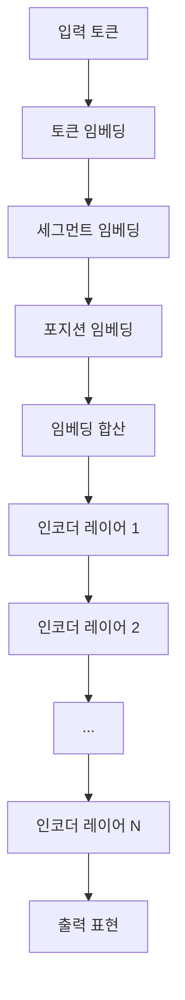

**BERT의 두 가지 버전:**

1. **BERT-Base**
   - 인코더 레이어: 12개
   - 히든 사이즈(Hidden Size): 768
   - 어텐션 헤드: 12개
   - 파라미터(Parameter) 수: 110M

2. **BERT-Large**
   - 인코더 레이어: 24개
   - 히든 사이즈: 1024
   - 어텐션 헤드: 16개
   - 파라미터 수: 340M

### 3.2. 사전학습 방식

BERT는 두 가지 비지도 학습(unsupervised learning) 태스크로 사전학습됩니다:

#### 3.2.1. 마스크드 언어 모델(MLM, Masked Language Model)

입력 토큰의 15%를 무작위로 마스킹하고, 모델이 원래 토큰을 예측하도록 학습합니다.

**마스킹 전략:**
- 80%: `[MASK]` 토큰으로 교체
- 10%: 무작위 토큰으로 교체
- 10%: 원본 토큰 유지

**예시:**
```
원본: "The cat sat on the mat"
마스킹: "The [MASK] sat on the [MASK]"
목표: "cat"과 "mat" 예측
```

손실 함수(Loss Function):

$$
\mathcal{L}_{\text{MLM}} = -\sum_{i \in \mathcal{M}} \log P(x_i | \hat{x})
$$

여기서 $\mathcal{M}$은 마스킹된 토큰의 인덱스 집합입니다.

#### 3.2.2. 다음 문장 예측(NSP, Next Sentence Prediction)

두 문장이 연속된 문장인지 판별하는 이진 분류(binary classification) 태스크입니다.

**학습 데이터 구성:**
- 50%: 실제 연속된 문장 쌍 (레이블: IsNext)
- 50%: 무작위로 선택된 문장 쌍 (레이블: NotNext)

**예시:**
```
[CLS] The cat is sleeping. [SEP] It looks very peaceful. [SEP]
→ IsNext

[CLS] The cat is sleeping. [SEP] Paris is the capital of France. [SEP]
→ NotNext
```

### 3.3. 작동 메커니즘

BERT의 핵심은 **양방향 문맥(bidirectional context)**을 학습한다는 점입니다.

#### 3.3.1. 입력 표현

BERT의 입력은 세 가지 임베딩의 합으로 구성됩니다:

$$
\text{Input} = \text{TokenEmb} + \text{SegmentEmb} + \text{PositionEmb}
$$

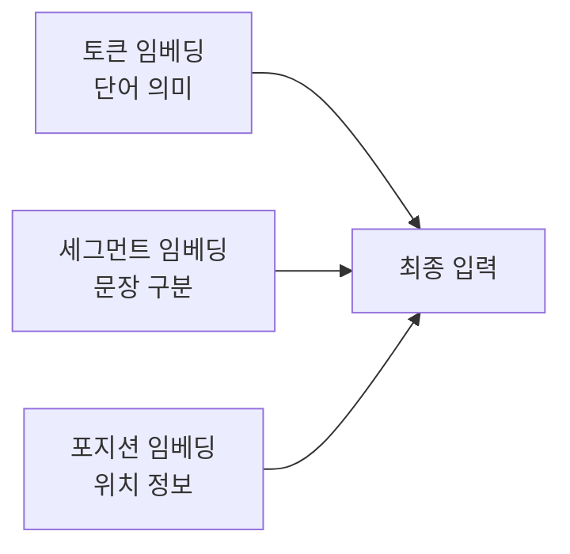

- **토큰 임베딩**: WordPiece 토크나이제이션(tokenization)을 통해 생성
- **세그먼트 임베딩**: 문장 A는 0, 문장 B는 1
- **포지션 임베딩**: 토큰의 위치 정보 (학습 가능한 임베딩)

#### 3.3.2. 셀프 어텐션 메커니즘

BERT의 각 레이어는 멀티헤드 셀프 어텐션을 사용합니다:

$$
\text{Attention}(Q, K, V) = \text{softmax}\left(\frac{QK^T}{\sqrt{d_k}}\right)V
$$

여기서:
- $Q$ (Query): 쿼리 벡터
- $K$ (Key): 키 벡터
- $V$ (Value): 밸류 벡터
- $d_k$: 키 벡터의 차원

**양방향 어텐션의 의미:**

각 토큰이 문장 내 모든 토큰을 볼 수 있으므로, "bank"라는 단어가 "river bank"인지 "financial bank"인지 문맥을 통해 판단할 수 있습니다.

#### 3.3.3. 파인튜닝(Fine-tuning)

사전학습된 BERT는 다양한 다운스트림(downstream) 태스크에 맞춰 파인튜닝됩니다:

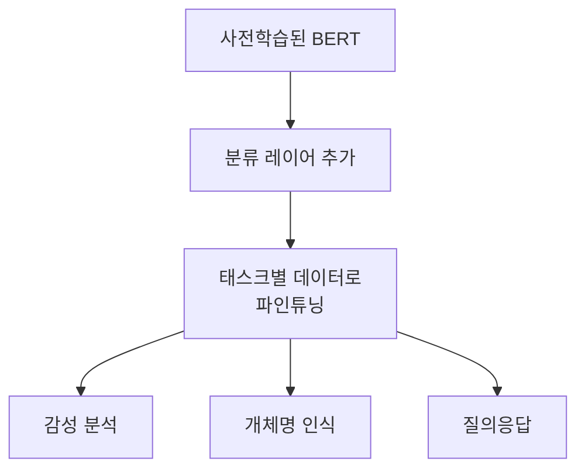

### 3.4. 적합한 응용 분야

BERT는 **이해(understanding)** 중심의 태스크에 최적화되어 있습니다:

#### 3.4.1. 텍스트 분류(Text Classification)
- **감성 분석(Sentiment Analysis)**: 리뷰의 긍정/부정 판별
- **스팸 탐지(Spam Detection)**: 이메일 스팸 분류
- **주제 분류(Topic Classification)**: 뉴스 기사 카테고리 분류

**구현 방식:** `[CLS]` 토큰의 출력을 분류 레이어에 입력

#### 3.4.2. 개체명 인식(NER, Named Entity Recognition)
문장에서 사람, 장소, 조직 등을 식별하고 분류합니다.

**예시:**
```
입력: "Steve Jobs founded Apple in Cupertino."
출력: [Steve Jobs: PERSON] founded [Apple: ORG] in [Cupertino: LOC].
```

#### 3.4.3. 질의응답(Question Answering)
주어진 문맥에서 질문에 대한 답을 추출합니다.

**SQuAD (Stanford Question Answering Dataset) 방식:**
```
문맥: "The Amazon rainforest covers 5.5 million square kilometers."
질문: "How large is the Amazon rainforest?"
답변: "5.5 million square kilometers" (시작/끝 인덱스 예측)
```

#### 3.4.4. 자연어 추론(NLI, Natural Language Inference)
두 문장 간의 논리적 관계를 판별합니다.

**관계 유형:**
- Entailment (함의): 전제가 참이면 가설도 참
- Contradiction (모순): 전제와 가설이 양립 불가
- Neutral (중립): 둘 사이에 논리적 관계 없음

#### 3.4.5. 시맨틱 유사도(Semantic Similarity)
두 문장의 의미적 유사성을 측정합니다.

**응용:**
- 중복 질문 탐지
- 문서 검색(Document Retrieval)
- 패러프레이즈 식별(Paraphrase Identification)

---

## 4. GPT: 생성적 사전학습 트랜스포머

GPT(Generative Pre-trained Transformer)는 OpenAI에서 개발한 모델로, 트랜스포머의 **디코더만**을 사용합니다.

### 4.1. 기본 구조

GPT는 여러 개의 트랜스포머 디코더 레이어를 쌓은 구조입니다:

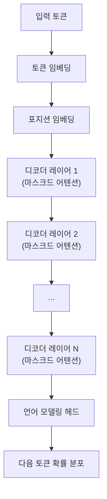

**GPT 모델의 진화:**

1. **GPT-1** (2018)
   - 디코더 레이어: 12개
   - 히든 사이즈: 768
   - 파라미터: 117M

2. **GPT-2** (2019)
   - 디코더 레이어: 48개 (Large)
   - 히든 사이즈: 1600
   - 파라미터: 1.5B

3. **GPT-3** (2020)
   - 디코더 레이어: 96개
   - 히든 사이즈: 12288
   - 파라미터: 175B

### 4.2. 사전학습 방식

GPT는 **언어 모델링(Language Modeling)** 태스크로 사전학습됩니다.

#### 4.2.1. 인과적 언어 모델링(Causal Language Modeling)

주어진 이전 토큰들을 기반으로 다음 토큰을 예측합니다.

**학습 목표:**

$$
\mathcal{L}_{\text{LM}} = -\sum_{i=1}^{n} \log P(x_i | x_1, x_2, \ldots, x_{i-1})
$$

**예시:**
```
입력: "The cat sat on the"
목표: "mat" 예측

입력: "The cat sat on the mat"
목표: "." 예측
```

이 방식은 **자기회귀적(autoregressive)**입니다. 즉, 각 토큰은 오직 이전 토큰들만 참조할 수 있습니다.

#### 4.2.2. 마스킹 전략

GPT는 **인과적 마스킹(causal masking)**을 사용하여 미래 토큰을 볼 수 없도록 합니다:

**어텐션 마스크 예시:**
```
토큰:     [The]  [cat]  [sat]  [on]
[The]      ✓      ✗      ✗     ✗
[cat]      ✓      ✓      ✗     ✗
[sat]      ✓      ✓      ✓     ✗
[on]       ✓      ✓      ✓     ✓
```

이를 수식으로 표현하면:

$$
\text{Attention}(Q, K, V) = \text{softmax}\left(\frac{QK^T}{\sqrt{d_k}} + M\right)V
$$

여기서 $M$은 상삼각 행렬(upper triangular matrix)로, 미래 위치에 $-\infty$를 할당합니다.

### 4.3. 작동 메커니즘

#### 4.3.1. 단방향 어텐션

GPT의 각 토큰은 **오직 왼쪽(이전) 토큰들만** 참조할 수 있습니다:

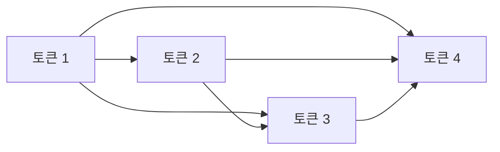

이는 텍스트 생성에 필수적인 특성입니다. 생성 시점에는 미래 토큰을 알 수 없기 때문입니다.

#### 4.3.2. 텍스트 생성 프로세스

GPT는 다양한 디코딩 전략을 사용하여 텍스트를 생성합니다:

**1. 그리디 디코딩(Greedy Decoding)**

매 스텝마다 가장 확률이 높은 토큰을 선택:

$$
x_t = \arg\max_{x} P(x | x_1, \ldots, x_{t-1})
$$

**2. 빔 서치(Beam Search)**

여러 가설(hypothesis)을 동시에 유지하며 탐색:

$$
\text{Score} = \log P(x_1, \ldots, x_n) = \sum_{i=1}^{n} \log P(x_i | x_1, \ldots, x_{i-1})
$$

**3. 샘플링(Sampling) 기법**

- **Top-k 샘플링**: 확률 상위 k개 토큰 중에서 샘플링
- **Top-p (Nucleus) 샘플링**: 누적 확률이 p가 될 때까지의 토큰 중에서 샘플링
- **Temperature 샘플링**: 

$$
P(x_i) = \frac{\exp(z_i / T)}{\sum_j \exp(z_j / T)}
$$

여기서 $T$는 온도 파라미터입니다. $T < 1$이면 더 결정적(deterministic), $T > 1$이면 더 무작위적(random)입니다.

#### 4.3.3. 제로샷, 원샷, 퓨샷 학습

GPT-3부터는 프롬프트(prompt)만으로 태스크를 수행할 수 있게 되었습니다:

**제로샷(Zero-shot):**
```
Translate English to French:
Hello → 
```

**원샷(One-shot):**
```
Translate English to French:
Hello → Bonjour
Goodbye → 
```

**퓨샷(Few-shot):**
```
Translate English to French:
Hello → Bonjour
Good morning → Bonjour
Goodbye → 
```

### 4.4. 적합한 응용 분야

GPT는 **생성(generation)** 중심의 태스크에 최적화되어 있습니다:

#### 4.4.1. 텍스트 생성(Text Generation)
- **창작 글쓰기**: 소설, 시, 대본 등
- **콘텐츠 생성**: 블로그 포스트, 기사 작성
- **스토리텔링**: 이야기 자동 생성

**예시:**
```
프롬프트: "In a distant galaxy, a lone astronaut"
생성: "discovers an ancient alien artifact that holds the key to humanity's future..."
```

#### 4.4.2. 대화 시스템(Dialogue Systems)
- **챗봇(Chatbot)**: 고객 서비스, 개인 비서
- **대화형 AI**: 멀티턴(multi-turn) 대화 유지
- **컨텍스추얼(contextual) 응답**: 이전 대화 내용 반영

#### 4.4.3. 코드 생성(Code Generation)
- **프로그램 합성(Program Synthesis)**: 자연어 설명을 코드로 변환
- **코드 완성(Code Completion)**: IDE 자동완성 기능
- **버그 수정**: 오류 코드 수정 제안

**예시 (GitHub Copilot):**
```python
# Function to calculate fibonacci numbers
def fibonacci(n):
    # [GPT가 자동 완성]
    if n <= 1:
        return n
    return fibonacci(n-1) + fibonacci(n-2)
```

#### 4.4.4. 요약(Summarization)
긴 문서를 짧은 요약문으로 변환합니다.

**추상적 요약(Abstractive Summarization):**
원본 텍스트에 없는 새로운 표현을 사용하여 요약합니다.

#### 4.4.5. 번역(Translation)
소스 언어를 타겟 언어로 변환합니다.

**프롬프트 기반 번역:**
```
Translate the following English text to Korean:
"Machine learning is fascinating."
```

#### 4.4.6. 질문 생성(Question Generation)
주어진 문맥에서 의미 있는 질문을 생성합니다.

---

## 5. BERT와 GPT의 핵심 차이점

### 5.1. 아키텍처 차이

| 특성 | BERT | GPT |
|------|------|-----|
| **기반 구조** | 트랜스포머 인코더 | 트랜스포머 디코더 |
| **어텐션 방향** | 양방향(Bidirectional) | 단방향(Unidirectional) |
| **문맥 활용** | 전체 문장 참조 | 왼쪽 문맥만 참조 |
| **인코더-디코더** | 인코더만 | 디코더만 |

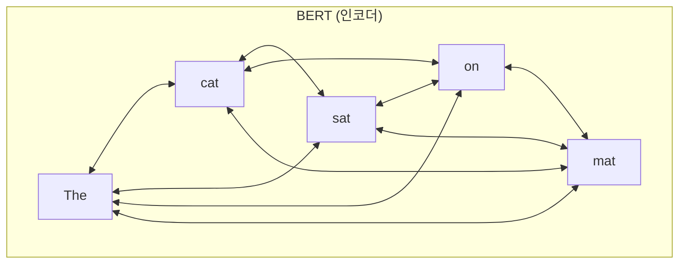

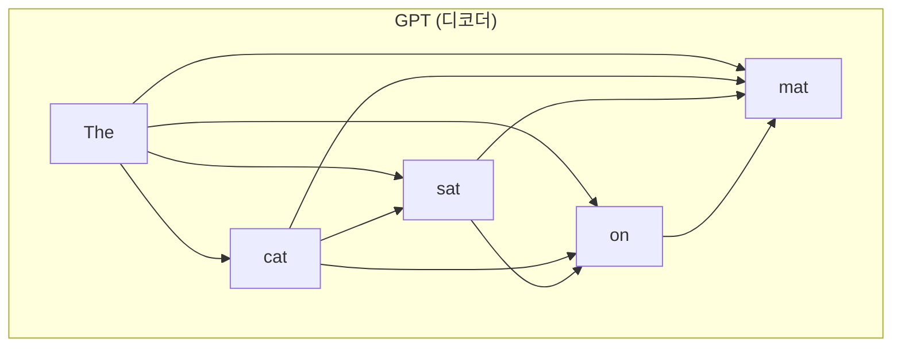

### 5.2. 학습 목표 차이

**BERT의 학습 목표:**

$$
\max_{\theta} \mathbb{E}_{x \sim D} \left[ \sum_{i \in \mathcal{M}} \log P_{\theta}(x_i | \hat{x}) \right]
$$

- 마스킹된 토큰을 양방향 문맥으로 예측
- 비자기회귀적(non-autoregressive)

**GPT의 학습 목표:**

$$
\max_{\theta} \mathbb{E}_{x \sim D} \left[ \sum_{i=1}^{n} \log P_{\theta}(x_i | x_{<i}) \right]
$$

- 다음 토큰을 이전 문맥으로 예측
- 자기회귀적(autoregressive)

### 5.3. 어텐션 메커니즘 차이

**BERT의 양방향 어텐션:**

```
입력: "The cat sat on the mat"

"cat"을 표현할 때:
← "The" 참조
← "sat" 참조
← "on" 참조
← "the" 참조
← "mat" 참조
```

**GPT의 인과적 어텐션:**

```
입력: "The cat sat on the mat"

"cat"을 표현할 때:
← "The" 참조
✗ "sat" 참조 불가
✗ "on" 참조 불가
✗ "the" 참조 불가
✗ "mat" 참조 불가
```

### 5.4. 응용 방식 차이

**BERT의 파인튜닝 패러다임:**

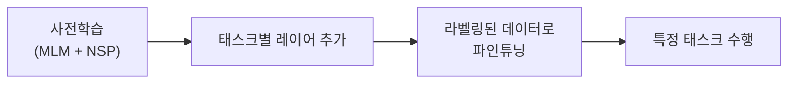

**GPT의 프롬프팅 패러다임 (GPT-3 이후):**

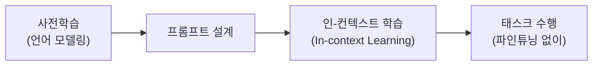

---

## 6. 실전 응용 사례 비교

### 6.1. 감성 분석 태스크

**BERT 접근법:**
```python
# 의사코드(Pseudocode)
input = "[CLS] This movie was amazing! [SEP]"
bert_output = BERT(input)
cls_representation = bert_output[0]  # [CLS] 토큰의 출력
sentiment = classifier(cls_representation)
# 출력: Positive (0.95)
```

**GPT 접근법:**
```python
# 의사코드
prompt = "Classify the sentiment: This movie was amazing! Sentiment:"
gpt_output = GPT(prompt)
# 출력: " Positive"
```

**차이점:**
- BERT: 파인튜닝 필요, 더 정확한 분류
- GPT: 프롬프트만으로 가능, 유연성 높음

### 6.2. 질의응답 태스크

**BERT (Extractive QA):**
```python
context = "The Eiffel Tower is located in Paris, France."
question = "Where is the Eiffel Tower?"

input = "[CLS] " + question + " [SEP] " + context + " [SEP]"
bert_output = BERT(input)

start_index, end_index = predict_span(bert_output)
answer = context[start_index:end_index]
# 출력: "Paris, France"
```

**GPT (Generative QA):**
```python
prompt = """Context: The Eiffel Tower is located in Paris, France.
Question: Where is the Eiffel Tower?
Answer:"""

gpt_output = GPT(prompt)
# 출력: " The Eiffel Tower is located in Paris, France."
```

**차이점:**
- BERT: 문맥에서 정확한 스팬(span)을 추출
- GPT: 자연스러운 문장으로 답변 생성

### 6.3. 텍스트 생성 태스크

**BERT의 한계:**
BERT는 양방향 모델이므로 순차적 텍스트 생성이 어렵습니다. 생성을 위해서는:
- 반복적 마스킹 및 채우기(iterative masking and filling)
- 별도의 디코더 추가 필요

**GPT의 강점:**
```python
prompt = "Once upon a time, in a land far away,"
generated_text = GPT.generate(
    prompt,
    max_length=100,
    temperature=0.8,
    top_p=0.9
)
# 출력: "Once upon a time, in a land far away, there lived 
# a young princess who dreamed of adventure..."
```

### 6.4. 개체명 인식(NER) 태스크

**BERT (최적):**
```python
tokens = ["Steve", "Jobs", "founded", "Apple", "in", "Cupertino"]
input = "[CLS] " + " ".join(tokens) + " [SEP]"
bert_output = BERT(input)

# 각 토큰에 대한 레이블 예측
labels = []
for token_output in bert_output[1:]:  # [CLS] 제외
    label = ner_classifier(token_output)
    labels.append(label)

# 출력: ["B-PER", "I-PER", "O", "B-ORG", "O", "B-LOC"]
```

**GPT (가능하지만 비효율적):**
```python
prompt = """Tag named entities in this sentence:
Steve Jobs founded Apple in Cupertino.
Tagged:"""

gpt_output = GPT(prompt)
# 출력: " [Steve Jobs: PERSON] founded [Apple: ORG] in [Cupertino: LOC]"
```

**차이점:**
- BERT: 토큰 레벨 분류에 최적화, 더 정확
- GPT: 생성 기반 접근, 일관성 낮을 수 있음

---

## 7. 결론

### 7.1. BERT와 GPT의 핵심 철학

**BERT: "이해의 전문가"**
- 문맥의 전체적 이해에 집중
- 양방향 정보 활용으로 깊은 의미 파악
- 분류, 추출, 매칭 태스크에 탁월

**GPT: "생성의 전문가"**
- 자연스러운 텍스트 생성에 집중
- 순차적 예측으로 일관된 출력
- 창작, 대화, 요약 태스크에 탁월

### 7.2. 선택 기준

**BERT를 선택해야 할 때:**
- 텍스트 분류가 주요 목표일 때
- 정확한 정보 추출이 필요할 때
- 라벨링된 데이터가 충분할 때
- 문장 간 관계 파악이 중요할 때
- 실시간 생성이 불필요할 때

**GPT를 선택해야 할 때:**
- 텍스트 생성이 주요 목표일 때
- 창의적 출력이 필요할 때
- 라벨링된 데이터가 부족할 때 (프롬프트 엔지니어링 활용)
- 대화형 인터랙션이 필요할 때
- 멀티태스크 수행이 필요할 때

### 7.3. 하이브리드 접근법

최근에는 두 접근법의 장점을 결합한 모델들이 등장하고 있습니다:

**BART (Bidirectional and Auto-Regressive Transformers):**
- 인코더-디코더 구조 사용
- BERT처럼 양방향 이해 + GPT처럼 자기회귀 생성

**T5 (Text-to-Text Transfer Transformer):**
- 모든 NLP 태스크를 텍스트 생성으로 통일
- 인코더-디코더 구조

**ELECTRA:**
- BERT의 MLM을 개선한 학습 방법
- 더 효율적인 사전학습

### 7.4. 미래 전망

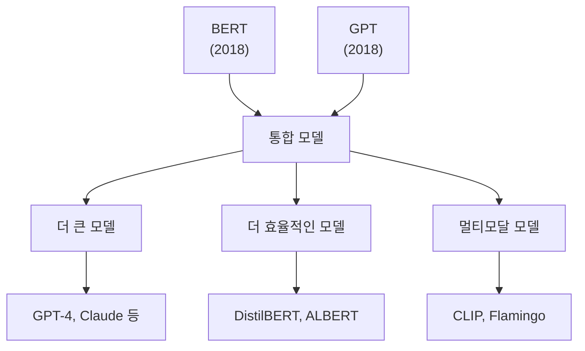

NLP의 미래는:
- **스케일(scale)**: 더 많은 파라미터와 데이터
- **효율성(efficiency)**: 적은 자원으로 높은 성능
- **일반화(generalization)**: 하나의 모델로 모든 태스크
- **멀티모달리티(multimodality)**: 텍스트, 이미지, 오디오 통합

### 7.5. 학습 권장사항

AI 엔지니어로서 두 모델을 모두 이해하는 것이 중요합니다:

1. **실습을 통한 학습:**
   - Hugging Face Transformers로 두 모델 모두 실험
   - 동일한 태스크에 두 접근법 적용 및 비교

2. **아키텍처 깊이 이해:**
   - 어텐션 메커니즘의 수학적 원리
   - 트랜스포머의 각 컴포넌트 역할

3. **최신 연구 동향 파악:**
   - arXiv에서 최신 논문 읽기
   - 새로운 모델 아키텍처와 학습 기법 연구

4. **실전 프로젝트 경험:**
   - 실제 문제에 적절한 모델 선택
   - 파인튜닝 및 프롬프트 엔지니어링 기술 습득

---

## 8. 용어 목록

| 용어 | 영문 | 설명 |
|------|------|------|
| 트랜스포머 | Transformer | 어텐션 메커니즘 기반의 신경망 아키텍처 |
| 인코더 | Encoder | 입력을 고정 크기 표현으로 변환하는 구조 |
| 디코더 | Decoder | 표현을 출력 시퀀스로 변환하는 구조 |
| 어텐션 | Attention | 입력의 중요 부분에 가중치를 부여하는 메커니즘 |
| 셀프 어텐션 | Self-Attention | 동일 시퀀스 내에서 작동하는 어텐션 |
| 멀티헤드 어텐션 | Multi-Head Attention | 여러 어텐션을 병렬로 수행하는 기법 |
| 임베딩 | Embedding | 단어를 벡터 공간에 매핑하는 기법 |
| 토크나이제이션 | Tokenization | 텍스트를 토큰으로 분할하는 과정 |
| 마스킹 | Masking | 특정 토큰을 숨기는 기법 |
| 사전학습 | Pre-training | 대규모 데이터로 모델을 먼저 학습 |
| 파인튜닝 | Fine-tuning | 사전학습된 모델을 특정 태스크에 맞춤 |
| 다운스트림 태스크 | Downstream Task | 사전학습 후 수행하는 구체적 태스크 |
| 자기회귀 | Autoregressive | 이전 출력을 다음 입력으로 사용 |
| 비지도 학습 | Unsupervised Learning | 라벨 없는 데이터로 학습 |
| 레이어 정규화 | Layer Normalization | 레이어 출력을 정규화하는 기법 |
| 피드포워드 네트워크 | Feed-Forward Network | 순방향으로만 정보가 전달되는 신경망 |
| 히든 스테이트 | Hidden State | 신경망 내부의 중간 표현 |
| 감성 분석 | Sentiment Analysis | 텍스트의 감정을 판별하는 태스크 |
| 개체명 인식 | Named Entity Recognition | 텍스트에서 고유명사를 식별하는 태스크 |
| 질의응답 | Question Answering | 질문에 대한 답을 찾는 태스크 |
| 자연어 추론 | Natural Language Inference | 문장 간 논리 관계를 판별하는 태스크 |
| 시맨틱 유사도 | Semantic Similarity | 의미적 유사성을 측정하는 태스크 |
| 언어 모델링 | Language Modeling | 다음 단어를 예측하는 태스크 |
| 인과적 마스킹 | Causal Masking | 미래 토큰을 가리는 마스킹 |
| 빔 서치 | Beam Search | 가장 가능성 높은 시퀀스를 찾는 탐색 알고리즘 |
| 그리디 디코딩 | Greedy Decoding | 매 스텝 최고 확률 토큰을 선택 |
| 샘플링 | Sampling | 확률 분포에서 무작위로 선택 |
| 온도 | Temperature | 샘플링의 무작위성을 조절하는 파라미터 |
| 제로샷 | Zero-shot | 사전 예시 없이 태스크 수행 |
| 퓨샷 | Few-shot | 적은 예시로 태스크 수행 |
| 프롬프트 | Prompt | 모델에 주어지는 입력 텍스트 |
| 인-컨텍스트 러닝 | In-context Learning | 프롬프트 내 예시로 학습하는 방식 |
| 추상적 요약 | Abstractive Summarization | 새로운 표현으로 요약하는 방식 |
| 추출적 요약 | Extractive Summarization | 원문에서 문장을 선택하는 요약 |
| 스팬 | Span | 텍스트의 연속된 토큰 구간 |
| 하이퍼파라미터 | Hyperparameter | 학습 전 설정하는 파라미터 |
| 파라미터 | Parameter | 학습을 통해 업데이트되는 가중치 |
| 배치 | Batch | 한 번에 처리하는 샘플 묶음 |
| 에폭 | Epoch | 전체 데이터를 한 번 학습하는 단위 |
| 손실 함수 | Loss Function | 모델 오차를 측정하는 함수 |
| 옵티마이저 | Optimizer | 파라미터를 업데이트하는 알고리즘 |
| 그래디언트 | Gradient | 손실 함수의 미분값 |
| 역전파 | Backpropagation | 그래디언트를 역방향으로 전파 |
| 활성화 함수 | Activation Function | 비선형성을 추가하는 함수 |
| 소프트맥스 | Softmax | 확률 분포로 변환하는 함수 |
| 크로스 엔트로피 | Cross Entropy | 분류 문제의 손실 함수 |
| 드롭아웃 | Dropout | 과적합 방지를 위한 정규화 기법 |
| 과적합 | Overfitting | 훈련 데이터에 과도하게 적합 |
| 일반화 | Generalization | 새로운 데이터에 대한 성능 |
| 검증 세트 | Validation Set | 모델 성능을 평가하는 데이터 |
| 테스트 세트 | Test Set | 최종 성능을 측정하는 데이터 |

---

**문서 작성일:** 2025년 10월 13일  
**참고 자료:**
- Vaswani et al. (2017). "Attention is All You Need"
- Devlin et al. (2018). "BERT: Pre-training of Deep Bidirectional Transformers"
- Radford et al. (2018). "Improving Language Understanding by Generative Pre-Training"
- Brown et al. (2020). "Language Models are Few-Shot Learners" (GPT-3)

---
