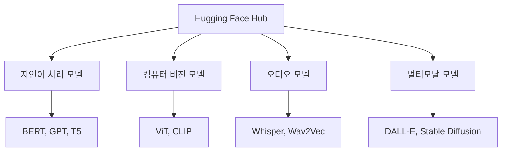
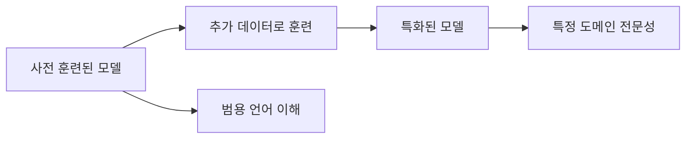
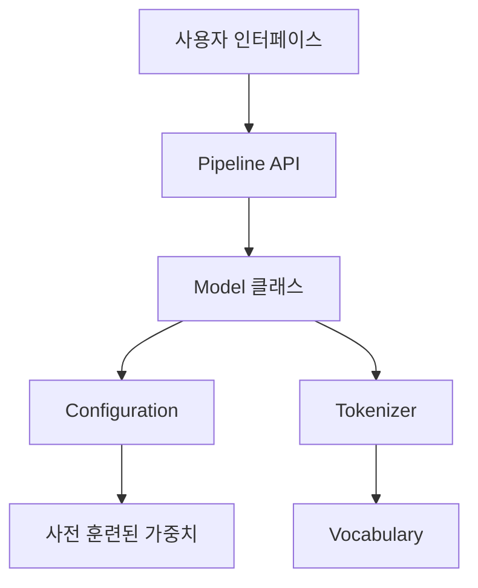
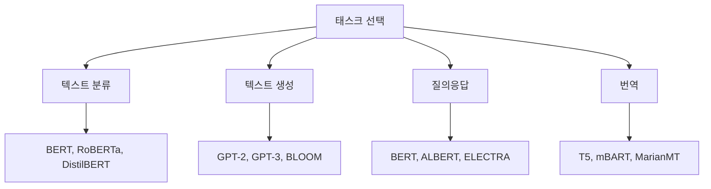
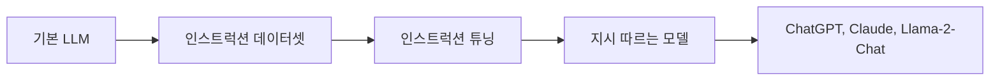
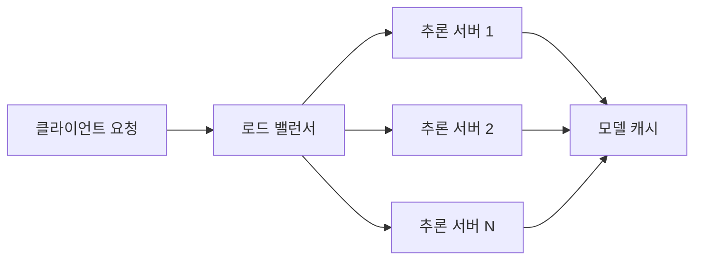

# Hugging Face Transformers 라이브러리 개요

## 핵심 내용 요약

**Hugging Face Transformers**는 사전 훈련된(pre-trained) 트랜스포머 모델들을 쉽게 사용할 수 있게 해주는 오픈소스 라이브러리입니다. 
BERT, GPT, T5 같은 최신 자연어 처리(NLP) 모델부터 비전(Vision), 오디오(Audio) 모델까지 수천 개의 모델을 단 몇 줄의 코드로 사용할 수 있습니다.

---

## 1. Transformers 라이브러리란?

### 1.1. 기본 개념

Transformers 라이브러리는 **Hugging Face**라는 회사에서 개발한 머신러닝 프레임워크입니다. 이 라이브러리의 핵심 목표는 다음과 같습니다:

- **접근성(Accessibility)**: 복잡한 딥러닝 모델을 누구나 쉽게 사용
- **상호운용성(Interoperability)**: PyTorch, TensorFlow, JAX 등 다양한 프레임워크 지원
- **커뮤니티 중심**: 전 세계 개발자들이 모델을 공유하는 허브(Hub) 제공

### 1.2. 왜 중요한가?

트랜스포머 아키텍처(architecture)가 등장한 이후, AI 분야는 급격히 발전했습니다. 하지만 이러한 모델들을 처음부터 구현하고 훈련시키는 것은:

- 막대한 컴퓨팅 리소스가 필요 (수백만 달러 비용)
- 전문적인 기술 지식 요구
- 긴 개발 시간 소요

Transformers 라이브러리는 이미 훈련된 모델을 제공함으로써 이러한 장벽을 낮춥니다.

---

## 2. 주요 기능

### 2.1. 모델 허브(Model Hub)

**모델 허브**는 150,000개 이상의 사전 훈련된 모델을 호스팅합니다. 사용자는:

- 다양한 태스크용 모델 검색 및 다운로드
- 자신의 모델을 업로드하여 공유
- 모델 카드(Model Card)를 통해 상세 정보 확인

### 2.2. 파이프라인(Pipeline) API

**파이프라인**은 모델 사용을 극도로 단순화한 고수준(high-level) 인터페이스입니다. 전처리(preprocessing), 추론(inference), 후처리(postprocessing)를 자동으로 처리합니다.

지원하는 주요 태스크:
- 텍스트 분류(Text Classification)
- 질의응답(Question Answering)
- 텍스트 생성(Text Generation)
- 번역(Translation)
- 요약(Summarization)
- 이미지 분류(Image Classification)
- 객체 탐지(Object Detection)

### 2.3. 토크나이저(Tokenizer)

**토크나이저**는 텍스트를 모델이 이해할 수 있는 숫자로 변환합니다. Transformers 라이브러리는:

- **빠른 토크나이저(Fast Tokenizer)**: Rust 기반으로 구현되어 매우 빠름
- **다양한 토크나이제이션(Tokenization) 방식**: WordPiece, BPE, SentencePiece 등
- **특수 토큰 처리**: [CLS], [SEP], [PAD] 등 자동 추가

수식으로 표현하면, 토크나이제이션은 다음과 같은 매핑 함수입니다:

$$
\text{tokenize}: \mathcal{V}^* \rightarrow \mathbb{Z}^n
$$

여기서 $\mathcal{V}^*$는 문자열의 집합이고, $\mathbb{Z}^n$은 정수 시퀀스입니다.

### 2.4. 파인튜닝(Fine-tuning) 지원

**전이 학습(Transfer Learning)**을 통해 사전 훈련된 모델을 특정 태스크에 맞게 조정할 수 있습니다:

**트레이너(Trainer) API**는 파인튜닝 과정을 단순화합니다:
- 자동 그래디언트(Gradient) 계산
- 체크포인트(Checkpoint) 관리
- 분산 훈련(Distributed Training) 지원
- 로깅(Logging) 및 모니터링(Monitoring)

### 2.5. 다양한 프레임워크 지원

Transformers는 프레임워크 독립적(framework-agnostic)으로 설계되었습니다:

- **PyTorch**: 가장 널리 사용되는 연구용 프레임워크
- **TensorFlow**: 프로덕션(Production) 환경에 강점
- **JAX**: 고성능 수치 계산
- **ONNX**: 모델 최적화 및 배포

### 2.6. 최적화 기능

실제 서비스 배포를 위한 다양한 최적화 기술을 지원합니다:

- **양자화(Quantization)**: 모델 크기를 줄이고 추론 속도 향상
  - INT8, INT4 양자화 지원
  - 모델 크기를 최대 75% 감소 가능

- **지식 증류(Knowledge Distillation)**: 큰 모델의 지식을 작은 모델로 전달
  
  손실 함수(Loss Function)는 일반적으로:
  
  $$
  \mathcal{L} = \alpha \mathcal{L}_{\text{CE}} + (1-\alpha) \mathcal{L}_{\text{KD}}
  $$
  
  여기서 $\mathcal{L}_{\text{CE}}$는 크로스 엔트로피(Cross Entropy) 손실이고, $\mathcal{L}_{\text{KD}}$는 증류 손실입니다.

- **프루닝(Pruning)**: 불필요한 가중치(Weight) 제거
- **동적 양자화(Dynamic Quantization)**: 런타임에 양자화 적용

---

## 3. 아키텍처 구조

### 3.1. 계층적 설계

### 3.2. 주요 컴포넌트(Component)

**설정(Configuration)**: 모델의 하이퍼파라미터(Hyperparameter)를 정의합니다
- 히든 사이즈(Hidden Size): 은닉층(Hidden Layer)의 차원 수
- 어텐션 헤드(Attention Head) 수: 멀티헤드 어텐션(Multi-head Attention)의 헤드 개수
- 레이어(Layer) 수: 트랜스포머 블록의 개수

예를 들어, BERT-base 모델의 설정:
- 히든 사이즈: 768
- 어텐션 헤드: 12
- 레이어 수: 12
- 파라미터(Parameter) 총 개수: 약 110M (백만)

**모델 클래스**: 실제 신경망(Neural Network) 구조를 정의합니다
- `PreTrainedModel`: 모든 모델의 베이스 클래스(Base Class)
- 특정 태스크용 헤드(Head) 추가 가능

**토크나이저 클래스**: 텍스트 전처리를 담당합니다
- `PreTrainedTokenizer`: 기본 토크나이저
- `PreTrainedTokenizerFast`: 고속 토크나이저

---

## 4. 트랜스포머 아키�eksture의 수학적 기초

### 4.1. 셀프 어텐션(Self-Attention) 메커니즘

트랜스포머의 핵심은 **셀프 어텐션** 메커니즘입니다. 이는 시퀀스(Sequence) 내 각 토큰이 다른 모든 토큰과의 관계를 학습합니다.

어텐션 스코어(Attention Score)는 다음과 같이 계산됩니다:

$$
\text{Attention}(Q, K, V) = \text{softmax}\left(\frac{QK^T}{\sqrt{d_k}}\right)V
$$

여기서:
- $Q$ (쿼리, Query): 질문 벡터
- $K$ (키, Key): 참조 벡터
- $V$ (밸류, Value): 실제 값 벡터
- $d_k$: 키 벡터의 차원 수 (스케일링 팩터)

### 4.2. 멀티헤드 어텐션

**멀티헤드 어텐션**은 여러 개의 어텐션을 병렬로 수행합니다:

$$
\text{MultiHead}(Q, K, V) = \text{Concat}(\text{head}_1, ..., \text{head}_h)W^O
$$

$$
\text{head}_i = \text{Attention}(QW_i^Q, KW_i^K, VW_i^V)
$$

이를 통해 모델은 다양한 표현 부분공간(Representation Subspace)에서 정보를 포착할 수 있습니다.

### 4.3. 포지셔널 인코딩(Positional Encoding)

트랜스포머는 순환(Recurrent) 구조가 없어 위치 정보를 명시적으로 추가해야 합니다:

$$
PE_{(pos, 2i)} = \sin\left(\frac{pos}{10000^{2i/d_{\text{model}}}}\right)
$$

$$
PE_{(pos, 2i+1)} = \cos\left(\frac{pos}{10000^{2i/d_{\text{model}}}}\right)
$$

여기서 $pos$는 위치이고, $i$는 차원 인덱스입니다.

---

## 5. 실무 활용 사례

### 5.1. 자연어 처리 태스크

**감성 분석(Sentiment Analysis)**: 텍스트의 긍정/부정 판단
- 고객 리뷰 분석
- 소셜 미디어 모니터링

**개체명 인식(Named Entity Recognition, NER)**: 텍스트에서 사람, 장소, 조직 등을 식별
- 정보 추출 시스템
- 문서 자동 태깅

**텍스트 요약**: 긴 문서를 짧게 압축
- 추상적 요약(Abstractive Summarization): 새로운 문장 생성
- 추출적 요약(Extractive Summarization): 중요 문장 선택

### 5.2. 멀티모달(Multimodal) 애플리케이션

**이미지 캡셔닝(Image Captioning)**: 이미지를 설명하는 텍스트 생성

**비주얼 질의응답(Visual Question Answering, VQA)**: 이미지에 대한 질문에 답변

**텍스트-이미지 생성**: 텍스트 설명으로 이미지 생성
- Stable Diffusion
- DALL-E

### 5.3. 도메인 특화 모델

**의료(Medical)**: BioBERT, ClinicalBERT
- 의학 문헌 분석
- 질병 예측

**법률(Legal)**: LegalBERT
- 계약서 분석
- 판례 검색

**금융(Finance)**: FinBERT
- 시장 감성 분석
- 리스크 평가

---

## 6. 모델 선택 가이드

### 6.1. 태스크별 추천 모델

### 6.2. 성능 vs 효율성 트레이드오프(Trade-off)

모델 선택 시 고려사항:

**정확도(Accuracy) 중심**:
- BERT-large, RoBERTa-large
- 파라미터 수: 300M 이상
- 높은 컴퓨팅 리소스 필요

**속도(Speed) 중심**:
- DistilBERT, ALBERT, TinyBERT
- 파라미터 수: 10M ~ 50M
- 실시간 서비스에 적합

**균형(Balanced)**:
- BERT-base, RoBERTa-base
- 파라미터 수: 100M ~ 150M
- 대부분의 애플리케이션에 적합

### 6.3. 다국어 지원

**다국어 모델(Multilingual Model)**:
- mBERT: 104개 언어 지원
- XLM-RoBERTa: 100개 언어 지원
- mT5: 101개 언어 지원

한국어 특화 모델:
- KoBERT
- KoGPT
- KoELECTRA

---

## 7. 모델 평가 지표

### 7.1. 분류 태스크 지표

**정확도(Accuracy)**:

$$
\text{Accuracy} = \frac{\text{올바른 예측 수}}{\text{전체 예측 수}}
$$

**정밀도(Precision)와 재현율(Recall)**:

$$
\text{Precision} = \frac{TP}{TP + FP}
$$

$$
\text{Recall} = \frac{TP}{TP + FN}
$$

**F1 스코어(F1 Score)**:

$$
F1 = 2 \times \frac{\text{Precision} \times \text{Recall}}{\text{Precision} + \text{Recall}}
$$

여기서 TP는 참 양성(True Positive), FP는 거짓 양성(False Positive), FN은 거짓 음성(False Negative)입니다.

### 7.2. 생성 태스크 지표

**BLEU (Bilingual Evaluation Understudy)**: 기계 번역 평가
- n-gram 정밀도 기반
- 0~100 점수 (높을수록 좋음)

**ROUGE (Recall-Oriented Understudy for Gisting Evaluation)**: 요약 평가
- ROUGE-N: n-gram 겹침
- ROUGE-L: 최장 공통 부분수열(Longest Common Subsequence)

**퍼플렉서티(Perplexity)**: 언어 모델 평가

$$
\text{PPL} = \exp\left(-\frac{1}{N}\sum_{i=1}^{N}\log P(w_i|w_{<i})\right)
$$

낮을수록 모델이 텍스트를 잘 예측한다는 의미입니다.

---

## 8. 최신 트렌드와 발전 방향

### 8.1. 대규모 언어 모델(Large Language Model, LLM)

최근 트렌드는 **규모의 확장(Scaling)**입니다:

- GPT-3: 175B 파라미터
- PaLM: 540B 파라미터
- GPT-4: 추정 1T+ 파라미터

이러한 모델들은 **창발적 능력(Emergent Abilities)**을 보입니다:
- 퓨샷 러닝(Few-shot Learning): 몇 개의 예시만으로 학습
- 제로샷 러닝(Zero-shot Learning): 예시 없이 태스크 수행
- 체인 오브 쏘트(Chain-of-Thought): 단계별 추론

### 8.2. 효율적 학습 방법

**파라미터 효율적 파인튜닝(Parameter-Efficient Fine-Tuning, PEFT)**:

- **LoRA (Low-Rank Adaptation)**: 저랭크(Low-Rank) 행렬 분해를 통해 일부 파라미터만 업데이트
  
  $$
  W' = W + BA
  $$
  
  여기서 $B \in \mathbb{R}^{d \times r}$, $A \in \mathbb{R}^{r \times k}$이고 $r \ll d, k$

- **어댑터(Adapter)**: 작은 신경망 모듈 추가
- **프롬프트 튜닝(Prompt Tuning)**: 입력 프롬프트만 최적화

### 8.3. 인스트럭션 튜닝(Instruction Tuning)

모델이 자연어 지시사항(Instruction)을 따르도록 훈련:

### 8.4. 강화 학습 기반 파인튜닝

**RLHF (Reinforcement Learning from Human Feedback)**:

1. 사전 훈련된 모델로 시작
2. 인간 선호도 데이터 수집
3. 보상 모델(Reward Model) 훈련
4. 강화 학습으로 정책(Policy) 최적화

목적 함수:

$$
\max_{\pi} \mathbb{E}_{x \sim D, y \sim \pi(y|x)}\left[r(x, y) - \beta \log \frac{\pi(y|x)}{\pi_{\text{ref}}(y|x)}\right]
$$

여기서 $r$은 보상 함수, $\beta$는 KL 발산(Divergence) 패널티 계수입니다.

---

## 9. 실전 팁과 모범 사례

### 9.1. 모델 선택 체크리스트

1. **태스크 정의**: 정확히 어떤 문제를 해결하는가?
2. **데이터셋 크기**: 파인튜닝할 데이터가 충분한가?
3. **리소스 제약**: GPU 메모리, 추론 속도 요구사항은?
4. **다국어 지원**: 어떤 언어를 지원해야 하는가?
5. **도메인 특성**: 일반 도메인인가, 전문 도메인인가?

### 9.2. 파인튜닝 시 주의사항

**과적합(Overfitting) 방지**:
- 드롭아웃(Dropout) 사용
- 조기 종료(Early Stopping)
- 데이터 증강(Data Augmentation)

**학습률(Learning Rate) 설정**:
- 사전 훈련된 레이어: 낮은 학습률 (1e-5 ~ 5e-5)
- 새로운 레이어: 높은 학습률 (1e-4 ~ 1e-3)

**배치 크기(Batch Size) 최적화**:
- 그래디언트 누적(Gradient Accumulation) 활용
- 작은 GPU에서 큰 배치 효과 얻기

### 9.3. 배포 최적화

**모델 압축(Model Compression)**:
- 양자화로 메모리 4배 감소 (FP32 → INT8)
- 프루닝으로 불필요한 연결 제거
- 지식 증류로 더 작은 모델 훈련

**추론 가속(Inference Acceleration)**:
- ONNX Runtime 사용
- TensorRT 최적화
- 배치 처리(Batching)

**서빙 아키텍처(Serving Architecture)**:

---

## 10. 커뮤니티와 리소스

### 10.1. 공식 리소스

- **Hugging Face Hub**: https://huggingface.co/models
- **공식 문서(Documentation)**: https://huggingface.co/docs
- **포럼**: https://discuss.huggingface.co
- **GitHub 저장소(Repository)**: https://github.com/huggingface/transformers

### 10.2. 학습 자료

**튜토리얼(Tutorial)**:
- NLP Course (무료): https://huggingface.co/learn/nlp-course
- Deep Learning with Transformers (책)
- Fast.ai Practical Deep Learning

**논문(Paper)**:
- "Attention is All You Need" (2017): 트랜스포머 원본 논문
- "BERT: Pre-training of Deep Bidirectional Transformers" (2018)
- "Language Models are Few-Shot Learners" (2020): GPT-3

### 10.3. 실습 환경

**Google Colab**: 무료 GPU 제공
- Tesla T4 GPU
- 12GB RAM
- 제한적이지만 학습에 충분

**Kaggle Notebooks**: 무료 GPU/TPU
- 주당 30시간 GPU
- 커뮤니티 데이터셋 접근

**로컬 환경**: 개인 GPU
- RTX 3090/4090 권장
- 최소 12GB VRAM

---

## 결론

Hugging Face Transformers 라이브러리는 현대 AI 개발의 핵심 도구입니다. 사전 훈련된 모델을 활용하여 개발 시간을 단축하고, 최첨단 성능을 달성할 수 있습니다.

**핵심 장점**:
- 수천 개의 모델에 즉시 접근
- 간단한 API로 복잡한 작업 수행
- 활발한 커뮤니티와 풍부한 리소스
- 프로덕션 배포까지 지원

**향후 전망**:
- 더 큰 규모의 모델 등장
- 효율적인 학습 방법 발전
- 멀티모달 통합 강화
- 도메인 특화 모델 증가

AI 엔지니어로서 Transformers 라이브러리를 마스터하는 것은 필수적입니다. 이 문서가 여러분의 학습 여정에 도움이 되기를 바랍니다.

---

## 용어 목록

| 용어 | 영문 | 설명 |
|------|------|------|
| 사전 훈련 | Pre-training | 대규모 데이터로 모델을 미리 학습시키는 과정 |
| 파인튜닝 | Fine-tuning | 사전 훈련된 모델을 특정 태스크에 맞게 조정하는 과정 |
| 트랜스포머 | Transformer | 어텐션 메커니즘 기반의 신경망 아키텍처 |
| 토크나이제이션 | Tokenization | 텍스트를 작은 단위(토큰)로 분할하는 과정 |
| 어텐션 | Attention | 입력의 어느 부분에 집중할지 학습하는 메커니즘 |
| 임베딩 | Embedding | 단어나 토큰을 고차원 벡터로 표현 |
| 히든 레이어 | Hidden Layer | 입력과 출력 사이의 중간 계층 |
| 하이퍼파라미터 | Hyperparameter | 학습 전에 설정하는 모델의 설정값 |
| 그래디언트 | Gradient | 손실 함수의 미분값, 최적화 방향 제시 |
| 백프로퍼게이션 | Backpropagation | 역전파, 그래디언트를 계산하는 알고리즘 |
| 옵티마이저 | Optimizer | 모델 파라미터를 업데이트하는 알고리즘 |
| 배치 | Batch | 한 번에 처리하는 데이터 묶음 |
| 에폭 | Epoch | 전체 훈련 데이터를 한 번 순회하는 단위 |
| 체크포인트 | Checkpoint | 훈련 중 저장된 모델 상태 |
| 추론 | Inference | 훈련된 모델로 예측하는 과정 |
| 양자화 | Quantization | 모델 가중치를 낮은 정밀도로 변환 |
| 프루닝 | Pruning | 불필요한 연결이나 뉴런 제거 |
| 지식 증류 | Knowledge Distillation | 큰 모델의 지식을 작은 모델로 전달 |
| 멀티모달 | Multimodal | 여러 종류의 데이터(텍스트, 이미지 등)를 다룸 |
| 제로샷 | Zero-shot | 예시 없이 새로운 태스크 수행 |
| 퓨샷 | Few-shot | 소수의 예시로 새로운 태스크 학습 |
| 프롬프트 | Prompt | 모델에게 주는 입력 지시사항 |
| 인코더 | Encoder | 입력을 표현 벡터로 변환하는 부분 |
| 디코더 | Decoder | 표현 벡터를 출력으로 변환하는 부분 |
| 시퀀스 | Sequence | 순서가 있는 데이터 나열 |
| 컨텍스트 | Context | 주변 정보, 문맥 |
| 어휘집 | Vocabulary | 모델이 알고 있는 모든 단어/토큰의 집합 |
| 손실 함수 | Loss Function | 모델 예측과 실제 값의 차이를 측정하는 함수 |
| 활성화 함수 | Activation Function | 비선형성을 도입하는 함수 (ReLU, GELU 등) |
| 드롭아웃 | Dropout | 과적합 방지를 위해 일부 뉴런을 무작위로 비활성화 |
| 정규화 | Regularization | 과적합을 방지하는 기법 전반 |
| 레이어 정규화 | Layer Normalization | 레이어 출력을 정규화하여 학습 안정화 |
| 잔차 연결 | Residual Connection | 입력을 출력에 더해주는 연결 (스킵 커넥션) |
| 크로스 엔트로피 | Cross Entropy | 분류 문제에서 많이 사용되는 손실 함수 |
| 소프트맥스 | Softmax | 출력을 확률 분포로 변환하는 함수 |
| 로짓 | Logit | 소프트맥스 적용 전의 원시 출력값 |
| 마스킹 | Masking | 특정 토큰을 가려서 모델이 예측하도록 함 |
| 패딩 | Padding | 시퀀스 길이를 맞추기 위해 추가하는 토큰 |
| 트렁케이션 | Truncation | 긴 시퀀스를 잘라내는 과정 |
| 어텐션 헤드 | Attention Head | 멀티헤드 어텐션의 개별 어텐션 메커니즘 |
| 쿼리 | Query | 어텐션에서 질문하는 벡터 |
| 키 | Key | 어텐션에서 참조되는 벡터 |
| 밸류 | Value | 어텐션에서 실제 전달되는 값 벡터 |
| 포지셔널 인코딩 | Positional Encoding | 위치 정보를 인코딩하는 방법 |
| 피드포워드 | Feed-forward | 순방향 신경망, 어텐션 후 적용되는 레이어 |
| 서브워드 | Subword | 단어보다 작은 단위 (BPE, WordPiece) |
| 센텐스피스 | SentencePiece | 언어 독립적 토크나이제이션 알고리즘 |
| 바이트 페어 인코딩 | Byte Pair Encoding (BPE) | 자주 등장하는 문자 쌍을 병합하는 토크나이제이션 |
| 워드피스 | WordPiece | BERT에서 사용하는 토크나이제이션 방식 |
| 전이 학습 | Transfer Learning | 한 태스크에서 학습한 지식을 다른 태스크에 적용 |
| 도메인 적응 | Domain Adaptation | 다른 도메인의 데이터로 모델 조정 |
| 데이터 증강 | Data Augmentation | 기존 데이터를 변형하여 훈련 데이터 확장 |
| 앙상블 | Ensemble | 여러 모델의 예측을 결합 |
| 증류 | Distillation | 큰 모델(교사)이 작은 모델(학생)을 가르침 |
| 양방향 | Bidirectional | 좌우 양쪽 문맥을 모두 고려 (BERT) |
| 단방향 | Unidirectional | 한쪽 방향만 고려 (GPT) |
| 인코더-디코더 | Encoder-Decoder | 인코더와 디코더가 결합된 구조 (T5) |
| 오토인코더 | Autoencoder | 입력을 압축했다가 복원하는 모델 |
| 마스크드 언어 모델 | Masked Language Model (MLM) | 일부 단어를 가리고 예측하는 사전 훈련 방식 |
| 다음 문장 예측 | Next Sentence Prediction (NSP) | 두 문장의 연속성을 예측하는 태스크 |
| 인과적 언어 모델 | Causal Language Model | 이전 토큰으로 다음 토큰 예측 (GPT) |
| 시퀀스 투 시퀀스 | Sequence-to-Sequence (Seq2Seq) | 시퀀스를 입력받아 다른 시퀀스를 출력 |
| 빔 서치 | Beam Search | 생성 시 여러 후보를 동시에 탐색하는 디코딩 전략 |
| 그리디 디코딩 | Greedy Decoding | 매 단계 가장 확률 높은 토큰 선택 |
| 샘플링 | Sampling | 확률 분포에서 무작위로 토큰 선택 |
| 온도 | Temperature | 샘플링 시 확률 분포의 날카로움 조절 |
| 톱-케이 샘플링 | Top-k Sampling | 상위 k개 토큰 중에서만 샘플링 |
| 뉴클리어스 샘플링 | Nucleus Sampling (Top-p) | 누적 확률 p를 넘을 때까지의 토큰에서 샘플링 |
| 어텐션 마스크 | Attention Mask | 어떤 토큰을 어텐션에서 무시할지 지정 |
| 패딩 마스크 | Padding Mask | 패딩 토큰을 무시하기 위한 마스크 |
| 룩어헤드 마스크 | Look-ahead Mask | 미래 토큰을 보지 못하게 하는 마스크 |
| 가중치 | Weight | 신경망의 학습 가능한 파라미터 |
| 바이어스 | Bias | 뉴런의 활성화 임계값 조절 파라미터 |
| 스트라이드 | Stride | 컨볼루션 필터의 이동 간격 |
| 커널 | Kernel | 컨볼루션 연산의 필터 |
| 풀링 | Pooling | 특징 맵의 크기를 줄이는 연산 |
| 글로벌 풀링 | Global Pooling | 전체 특징 맵을 하나의 값으로 축소 |
| 벡터 | Vector | 1차원 배열, 크기와 방향을 가진 양 |
| 행렬 | Matrix | 2차원 배열 |
| 텐서 | Tensor | 다차원 배열 |
| 스칼라 | Scalar | 단일 숫자 값 |
| 차원 | Dimension | 데이터의 축 또는 특징의 수 |
| 랭크 | Rank | 텐서의 차원 수 |
| 형태 | Shape | 텐서 각 차원의 크기 |
| 브로드캐스팅 | Broadcasting | 다른 형태의 텐서 간 연산 시 자동 확장 |
| 내적 | Dot Product | 두 벡터의 곱의 합 |
| 행렬 곱셈 | Matrix Multiplication | 행렬 간의 곱셈 연산 |
| 전치 | Transpose | 행렬의 행과 열을 바꿈 |
| 역행렬 | Inverse Matrix | 곱해서 항등행렬이 되는 행렬 |
| 고유값 | Eigenvalue | 선형 변환의 스케일 팩터 |
| 고유벡터 | Eigenvector | 선형 변환 후에도 방향이 변하지 않는 벡터 |
| 특이값 분해 | Singular Value Decomposition (SVD) | 행렬을 세 행렬의 곱으로 분해 |
| 저랭크 분해 | Low-Rank Decomposition | 행렬을 낮은 랭크의 행렬들로 근사 |
| 정규화 텀 | Regularization Term | 손실 함수에 추가되는 패널티 항 |
| L1 정규화 | L1 Regularization | 가중치의 절댓값 합 패널티 (희소성 유도) |
| L2 정규화 | L2 Regularization | 가중치의 제곱합 패널티 (가중치 감쇠) |
| 모멘텀 | Momentum | 이전 그래디언트 방향을 고려한 최적화 |
| 학습률 스케줄러 | Learning Rate Scheduler | 학습률을 동적으로 조정하는 전략 |
| 웜업 | Warmup | 초기에 학습률을 점진적으로 증가 |
| 코사인 어닐링 | Cosine Annealing | 코사인 함수로 학습률 감소 |
| 아담 | Adam | 적응적 모멘트 추정 옵티마이저 |
| 에스지디 | SGD (Stochastic Gradient Descent) | 확률적 경사 하강법 |
| 배치 정규화 | Batch Normalization | 미니배치 단위로 정규화 |
| 그룹 정규화 | Group Normalization | 채널을 그룹으로 나누어 정규화 |
| 인스턴스 정규화 | Instance Normalization | 각 샘플마다 독립적으로 정규화 |
| 그래디언트 클리핑 | Gradient Clipping | 그래디언트 크기를 제한하여 폭발 방지 |
| 그래디언트 폭발 | Gradient Explosion | 그래디언트 값이 너무 커지는 현상 |
| 그래디언트 소실 | Gradient Vanishing | 그래디언트 값이 너무 작아지는 현상 |
| 과적합 | Overfitting | 훈련 데이터에 과도하게 적응하여 일반화 실패 |
| 과소적합 | Underfitting | 모델이 너무 단순하여 패턴을 학습하지 못함 |
| 일반화 | Generalization | 새로운 데이터에 대한 성능 |
| 검증 세트 | Validation Set | 하이퍼파라미터 튜닝에 사용하는 데이터 |
| 테스트 세트 | Test Set | 최종 성능 평가에 사용하는 데이터 |
| 교차 검증 | Cross Validation | 데이터를 여러 부분으로 나누어 반복 검증 |
| 혼동 행렬 | Confusion Matrix | 예측과 실제 레이블의 조합을 표로 정리 |
| 참 양성 | True Positive (TP) | 양성을 양성으로 올바르게 예측 |
| 거짓 양성 | False Positive (FP) | 음성을 양성으로 잘못 예측 |
| 참 음성 | True Negative (TN) | 음성을 음성으로 올바르게 예측 |
| 거짓 음성 | False Negative (FN) | 양성을 음성으로 잘못 예측 |
| 정밀도 | Precision | 양성 예측 중 실제 양성 비율 |
| 재현율 | Recall | 실제 양성 중 올바르게 예측한 비율 |
| F1 스코어 | F1 Score | 정밀도와 재현율의 조화 평균 |
| ROC 곡선 | ROC Curve | 참 양성률과 거짓 양성률의 관계 |
| AUC | Area Under Curve | ROC 곡선 아래 면적 |
| 퍼플렉서티 | Perplexity | 언어 모델의 불확실성 측정 지표 |
| BLEU | Bilingual Evaluation Understudy | 기계 번역 평가 지표 |
| ROUGE | Recall-Oriented Understudy for Gisting Evaluation | 요약 평가 지표 |
| 임베딩 레이어 | Embedding Layer | 토큰을 벡터로 변환하는 레이어 |
| 출력 레이어 | Output Layer | 최종 예측을 생성하는 레이어 |
| 히든 스테이트 | Hidden State | 중간 레이어의 출력 표현 |
| 컨텍스트 벡터 | Context Vector | 인코더의 요약된 표현 |
| 셀 스테이트 | Cell State | LSTM에서 장기 기억을 저장하는 벡터 |
| 게이트 | Gate | LSTM/GRU에서 정보 흐름을 제어하는 메커니즘 |
| 순환 신경망 | Recurrent Neural Network (RNN) | 시퀀스 데이터를 처리하는 신경망 |
| LSTM | Long Short-Term Memory | 장기 의존성을 학습할 수 있는 RNN 변형 |
| GRU | Gated Recurrent Unit | LSTM을 단순화한 순환 유닛 |
| 컨볼루션 신경망 | Convolutional Neural Network (CNN) | 이미지 처리에 특화된 신경망 |
| 특징 맵 | Feature Map | 컨볼루션 레이어의 출력 |
| 리셉티브 필드 | Receptive Field | 뉴런이 반응하는 입력 영역 |
| 다운샘플링 | Downsampling | 데이터 크기를 줄이는 과정 |
| 업샘플링 | Upsampling | 데이터 크기를 늘리는 과정 |
| 스킵 커넥션 | Skip Connection | 레이어를 건너뛰는 연결 (잔차 연결) |
| 보틀넥 | Bottleneck | 차원을 줄였다가 다시 늘리는 구조 |
| 어텐션 스코어 | Attention Score | 각 토큰에 할당되는 가중치 |
| 스케일드 닷 프로덕트 | Scaled Dot-Product | 스케일링된 내적 어텐션 |
| 크로스 어텐션 | Cross Attention | 인코더-디코더 간 어텐션 |
| 셀프 어텐션 | Self Attention | 자기 자신에 대한 어텐션 |
| 글로벌 어텐션 | Global Attention | 모든 위치를 고려하는 어텐션 |
| 로컬 어텐션 | Local Attention | 일부 위치만 고려하는 어텐션 |
| 희소 어텐션 | Sparse Attention | 선택적으로 일부만 계산하는 어텐션 |
| 선형 어텐션 | Linear Attention | 계산 복잡도를 선형으로 줄인 어텐션 |
| 파라미터 | Parameter | 모델이 학습하는 값 (가중치, 바이어스) |
| 파라미터 수 | Parameter Count | 모델의 전체 파라미터 개수 |
| 플롭스 | FLOPs | 부동소수점 연산 횟수 |
| 처리량 | Throughput | 단위 시간당 처리하는 샘플 수 |
| 지연시간 | Latency | 입력부터 출력까지 걸리는 시간 |
| 메모리 풋프린트 | Memory Footprint | 모델이 사용하는 메모리 크기 |
| GPU | Graphics Processing Unit | 병렬 계산에 특화된 하드웨어 |
| TPU | Tensor Processing Unit | 텐서 연산에 최적화된 구글의 하드웨어 |
| CUDA | Compute Unified Device Architecture | NVIDIA GPU 프로그래밍 플랫폼 |
| 혼합 정밀도 | Mixed Precision | FP16과 FP32를 혼합하여 사용 |
| FP32 | 32-bit Floating Point | 32비트 부동소수점 |
| FP16 | 16-bit Floating Point | 16비트 부동소수점 |
| INT8 | 8-bit Integer | 8비트 정수 (양자화에 사용) |
| 분산 훈련 | Distributed Training | 여러 장치에서 병렬로 훈련 |
| 데이터 병렬화 | Data Parallelism | 데이터를 나누어 병렬 처리 |
| 모델 병렬화 | Model Parallelism | 모델을 나누어 병렬 처리 |
| 파이프라인 병렬화 | Pipeline Parallelism | 레이어를 단계별로 병렬 처리 |
| 그래디언트 누적 | Gradient Accumulation | 여러 배치의 그래디언트를 누적 |
| 체크포인팅 | Checkpointing | 메모리 절약을 위해 중간 활성화 재계산 |
| 오픈소스 | Open Source | 소스 코드가 공개된 소프트웨어 |
| 라이선스 | License | 소프트웨어 사용 조건 |
| 아파치 라이선스 | Apache License | 상업적 사용 허용하는 오픈소스 라이선스 |
| MIT 라이선스 | MIT License | 가장 자유로운 오픈소스 라이선스 |
| 벤치마크 | Benchmark | 표준화된 성능 평가 테스트 |
| 리더보드 | Leaderboard | 모델 성능 순위표 |
| 베이스라인 | Baseline | 비교 기준이 되는 기본 모델 |
| SOTA | State-of-the-Art | 현재 최고 성능 |
| 엔드투엔드 | End-to-End | 입력부터 출력까지 전체를 하나로 학습 |
| 프로덕션 | Production | 실제 서비스 환경 |
| 디플로이먼트 | Deployment | 모델을 서비스에 배포하는 과정 |
| API | Application Programming Interface | 애플리케이션 간 통신 인터페이스 |
| REST API | Representational State Transfer API | HTTP 기반 API |
| 엔드포인트 | Endpoint | API 접근 URL |
| 레이턴시 | Latency | 요청부터 응답까지 시간 |
| 스루풋 | Throughput | 단위 시간당 처리량 |
| 로드 밸런싱 | Load Balancing | 부하를 여러 서버에 분산 |
| 오토스케일링 | Auto-scaling | 부하에 따라 자동으로 서버 확장/축소 |
| 컨테이너 | Container | 애플리케이션을 격리된 환경에서 실행 |
| 도커 | Docker | 컨테이너 플랫폼 |
| 쿠버네티스 | Kubernetes | 컨테이너 오케스트레이션 플랫폼 |
| 캐싱 | Caching | 자주 사용하는 결과를 저장 |
| 배치 처리 | Batch Processing | 여러 요청을 묶어서 처리 |
| 스트리밍 | Streaming | 실시간으로 데이터를 처리 |
| 에이비 테스팅 | A/B Testing | 두 버전을 비교하는 실험 |
| 모니터링 | Monitoring | 시스템 상태를 지속적으로 관찰 |
| 로깅 | Logging | 실행 기록을 파일에 저장 |
| 디버깅 | Debugging | 오류를 찾아 수정하는 과정 |
| 프로파일링 | Profiling | 성능 병목 지점 분석 |

---

**문서 작성 정보**
- 작성일: 2025년 10월 13일
- 목적: Hugging Face Transformers 라이브러리 종합 가이드

