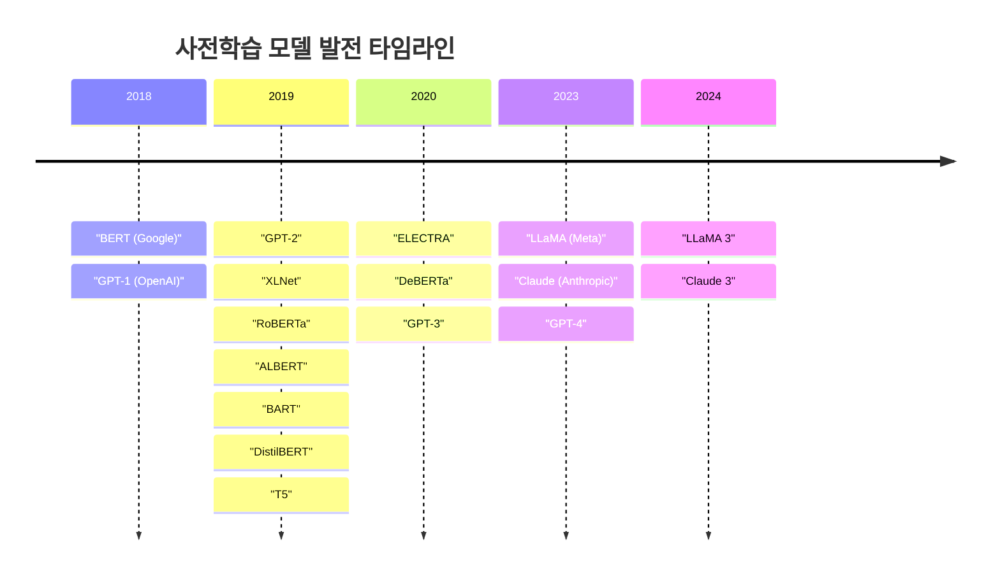
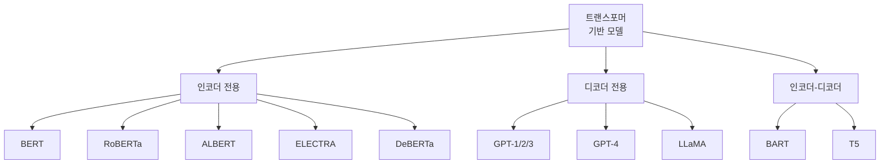
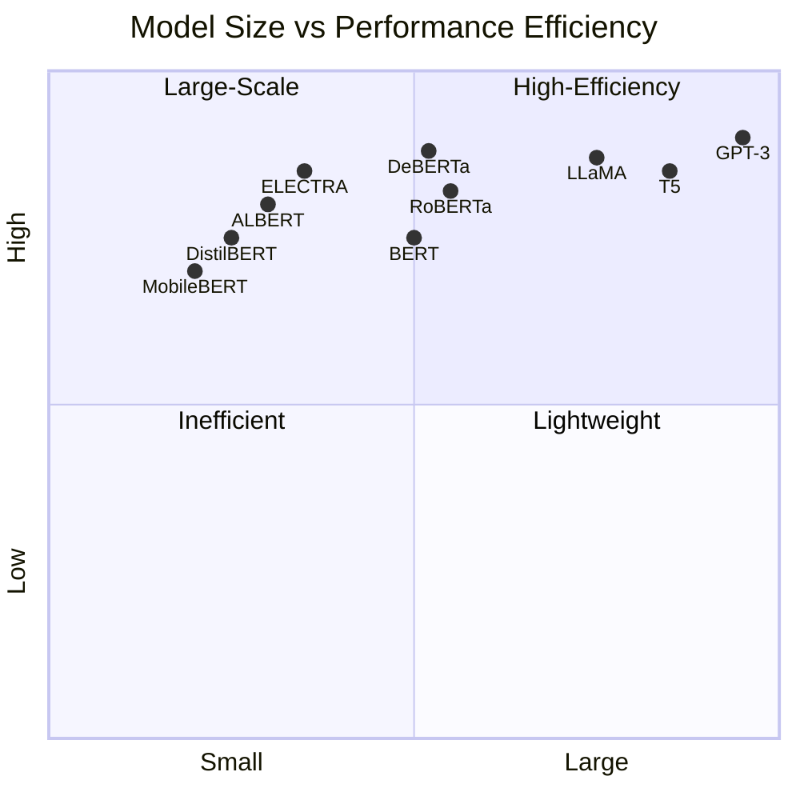

# BERT와 GPT 이후 주요 사전학습 모델 발전사

## 목차

1. [서론](#1-서론) 
   - 1.1. [배경](#11-배경) 
   - 1.2. [문서의 목적](#12-문서의-목적) 
2. [트랜스포머 기반 모델의 진화 방향](#2-트랜스포머-기반-모델의-진화-방향) 
   - 2.1. [개선 방향성 개괄](#21-개선-방향성-개괄) 
   - 2.2. [연대기적 발전](#22-연대기적-발전) 
3. [사전학습 방법론 개선 모델](#3-사전학습-방법론-개선-모델) 
   - 3.1. [RoBERTa](#31-roberta) 
   - 3.2. [SpanBERT](#32-spanbert) 
   - 3.3. [XLNet](#33-xlnet) 
4. [인코더-디코더 결합 모델](#4-인코더-디코더-결합-모델) 
   - 4.1. [BART](#41-bart) 
   - 4.2. [T5](#42-t5) 
5. [효율성 개선 모델](#5-효율성-개선-모델) 
   - 5.1. [ALBERT](#51-albert) 
   - 5.2. [ELECTRA](#52-electra) 
   - 5.3. [경량화 모델군](#53-경량화-모델군) 
6. [위치 인코딩 혁신 모델](#6-위치-인코딩-혁신-모델) 
   - 6.1. [DeBERTa](#61-deberta) 
7. [대규모 언어모델의 부상](#7-대규모-언어모델의-부상) 
   - 7.1. [GPT-3 시리즈](#71-gpt-3-시리즈) 
   - 7.2. [오픈소스 LLM](#72-오픈소스-llm) 
   - 7.3. [멀티모달 모델](#73-멀티모달-모델) 
8. [결론 및 향후 전망](#8-결론-및-향후-전망) 
9. [용어 목록](#9-용어-목록) 
10. [부록: 주요 모델 특성 비교](#부록-주요-모델-특성-비교) 
11. [참고문헌](#참고문헌) 

---

## 1. 서론

### 1.1. 배경

2018년 구글이 발표한 **BERT**(Bidirectional Encoder Representations from Transformers)와 OpenAI의 **GPT**(Generative Pre-trained Transformer)는 자연어처리(NLP, Natural Language Processing) 분야에 패러다임 시프트(paradigm shift)를 가져왔다. 
BERT는 트랜스포머의 인코더(encoder) 구조만을 활용하여 양방향 문맥 이해에 탁월한 성능을 보였으며, GPT는 디코더(decoder) 구조를 기반으로 텍스트 생성에 강점을 드러냈다.

이 두 모델의 등장 이후, 연구 커뮤니티는 폭발적인 속도로 사전학습 언어모델(pre-trained language model)을 개발하기 시작했다. 
각 모델은 사전학습 태스크(task) 개선, 모델 효율성 향상, 아키텍처 혁신 등 다양한 접근법을 통해 성능과 효율의 균형을 추구했다.

### 1.2. 문서의 목적

본 문서는 BERT와 GPT 이후 등장한 주요 사전학습 모델들을 연대기순으로 정리하고, 각 모델의 핵심 특징과 기술적 혁신을 체계적으로 분석한다. 
딥러닝을 공부하는 AI 엔지니어가 현대 자연어처리 모델의 발전 흐름을 이해하는 데 도움을 주고자 한다.

---

## 2. 트랜스포머 기반 모델의 진화 방향

### 2.1. 개선 방향성 개괄

BERT 등장 이후 사전학습 모델 연구는 크게 네 가지 방향으로 전개되었다.

**첫째**, 사전학습 방법론(pre-training methodology) 개선이다. 마스크드 언어 모델링(MLM, Masked Language Modeling)의 한계를 극복하고, 더 효과적인 학습 태스크를 설계하는 연구가 진행되었다. RoBERTa, SpanBERT, XLNet 등이 이 범주에 속한다.

**둘째**, 오토인코딩(Autoencoding, AE)과 오토리그레시브(Autoregressive, AR) 특성을 동시에 활용하는 하이브리드 접근법이다. BART와 T5는 인코더-디코더 구조를 통해 이해와 생성 능력을 모두 확보했다.

**셋째**, 파라미터 수를 줄여 컴퓨테이셔널 코스트(computational cost)를 감소시키는 모델 효율성 개선이다. ALBERT, ELECTRA, DistilBERT, MobileBERT가 대표적이다.

**넷째**, 메타러닝(meta learning) 방식으로 파인튜닝(fine-tuning) 의존도를 낮추고 범용성을 높이는 접근이다. GPT-3와 T5가 이에 해당한다.

### 2.2. 연대기적 발전

---

## 3. 사전학습 방법론 개선 모델

### 3.1. RoBERTa

**RoBERTa**(Robustly Optimized BERT Pre-training Approach)는 페이스북(Facebook, 현 Meta) 연구팀이 2019년 발표한 모델로, BERT의 사전학습 과정을 대폭 개선했다.

#### 3.1.1. 주요 개선사항

RoBERTa는 BERT와 동일한 아키텍처를 사용하지만, 학습 방법을 근본적으로 재설계했다. 
첫째, **NSP**(Next Sentence Prediction) 태스크를 제거했다. 연구진은 NSP가 실제로는 모델 성능 향상에 기여하지 못한다는 것을 실험적으로 증명했다. 
둘째, 더 많은 데이터(160GB)로 더 오랜 기간 학습했다. 
셋째, 더 큰 배치 사이즈(batch size)를 사용했다. 
넷째, 다이나믹 마스킹(dynamic masking) 기법을 도입하여 매 에포크(epoch)마다 다른 마스킹 패턴을 생성했다.

#### 3.1.2. 성능 향상

이러한 개선을 통해 RoBERTa는 GLUE, SQuAD, RACE 등 여러 벤치마크에서 BERT를 능가하는 성능을 달성했다. 특히 BERT-Large와 비교했을 때 다양한 태스크에서 일관되게 높은 점수를 기록했다.

### 3.2. SpanBERT

**SpanBERT**는 2020년 발표된 모델로, 마스킹 전략을 단일 토큰에서 연속된 스팬(span)으로 확장했다.

#### 3.2.1. 스팬 기반 마스킹

BERT가 개별 토큰을 무작위로 마스킹하는 것과 달리, SpanBERT는 연속된 단어 시퀀스(sequence)를 함께 마스킹한다. 스팬의 길이는 기하 분포(geometric distribution)를 따르며, 평균 길이는 약 3.8 토큰이다. 이 접근법은 모델이 더 넓은 문맥 정보를 활용하여 예측하도록 유도한다.

#### 3.2.2. 스팬 바운더리 목적함수

SpanBERT는 스팬 경계(boundary)의 토큰 표현을 활용하여 마스킹된 토큰을 예측하는 추가 목적함수(objective function)를 도입했다. 이는 모델이 스팬 수준의 의미론적(semantic) 정보를 더 잘 학습하도록 돕는다.

### 3.3. XLNet

**XLNet**은 CMU와 구글 브레인이 2019년 공동 개발한 모델로, BERT의 마스킹 기반 학습의 한계를 극복하고자 했다.

#### 3.3.1. 퍼뮤테이션 언어 모델링

XLNet은 **PLM**(Permutation Language Modeling)이라는 혁신적 사전학습 방법을 제안했다. 이 방법은 입력 시퀀스의 모든 가능한 순열(permutation)을 고려하여 각 토큰을 예측한다. 수식으로 표현하면 다음과 같다.

$$\mathbb{E}_{z \sim \mathcal{Z}_T} \left[ \sum_{t=1}^{T} \log p_\theta(x_{z_t} | \mathbf{x}_{z_{<t}}) \right]$$

여기서 $\mathcal{Z}_T$는 길이 $T$인 인덱스 시퀀스의 모든 가능한 순열 집합이고, $z_t$는 $t$번째 위치의 요소이며, $\mathbf{x}_{z_{<t}}$는 순열 $z$에서 $z_t$ 이전의 토큰들을 의미한다.

#### 3.3.2. 양방향 문맥 활용

PLM을 통해 XLNet은 마스크 토큰 없이도 양방향 문맥을 활용할 수 있다. 또한, BERT가 가진 프리트레인(pre-train)과 파인튜닝 간의 불일치 문제를 해결했다. BERT는 학습 시에는 [MASK] 토큰을 사용하지만, 실제 태스크에서는 [MASK]가 존재하지 않는다는 문제가 있었다.

#### 3.3.3. 트랜스포머-XL 통합

XLNet은 Transformer-XL의 세그먼트 리커런스(segment recurrence) 메커니즘과 릴러티브 포지셔널 인코딩(relative positional encoding)을 통합하여 더 긴 문맥을 처리할 수 있다.

---

## 4. 인코더-디코더 결합 모델

### 4.1. BART

**BART**(Bidirectional and Auto-Regressive Transformers)는 페이스북 연구팀이 2019년 발표한 시퀀스-투-시퀀스(sequence-to-sequence) 모델이다.

#### 4.1.1. 디노이징 오토인코더

BART는 **디노이징 오토인코더**(denoising autoencoder) 방식으로 사전학습된다. 원본 텍스트에 다양한 노이즈(noise)를 추가한 후, 모델이 원본을 복원하도록 학습한다. 이는 BERT의 인코딩 능력과 GPT의 생성 능력을 모두 활용하는 전략이다.

#### 4.1.2. 노이징 기법

BART는 다섯 가지 주요 노이징 기법을 제안했다.

- **토큰 마스킹**(Token Masking): BERT와 유사하게 무작위 토큰을 [MASK]로 대체
- **토큰 삭제**(Token Deletion): 무작위로 토큰을 제거하여 모델이 누락 위치를 식별하도록 함
- **텍스트 인필링**(Text Infilling): 포아송 분포($\lambda=3$)에서 샘플링한 길이의 스팬을 하나의 [MASK]로 대체
- **문장 퍼뮤테이션**(Sentence Permutation): 문서를 문장 단위로 나누어 무작위로 섞음
- **도큐먼트 로테이션**(Document Rotation): 무작위 지점을 선택하여 문서를 회전

실험 결과, 텍스트 인필링과 문장 퍼뮤테이션을 조합했을 때 최상의 성능을 보였다.

#### 4.1.3. 성능 및 활용

BART는 자연어 이해(NLU) 태스크에서 RoBERTa와 유사한 성능을 보이면서도, 요약(summarization), 대화(dialogue), 질의응답(question answering) 같은 생성 태스크에서는 탁월한 성능을 발휘했다. CNN/DailyMail 요약 태스크에서는 기존 최고 성능 대비 ROUGE-L 점수를 6점 가까이 향상시켰다.

### 4.2. T5

**T5**(Text-to-Text Transfer Transformer)는 구글 리서치가 2019년 발표한 모델로, 모든 NLP 태스크를 **텍스트-투-텍스트**(text-to-text) 형식으로 통일했다.

#### 4.2.1. 통합 프레임워크

T5의 핵심 아이디어는 모든 NLP 문제를 입력 텍스트에서 출력 텍스트로의 변환으로 캐스팅(casting)하는 것이다. 예를 들어, 번역 태스크는 "translate English to German: That is good."이라는 입력을 "Das ist gut."으로 변환하고, 분류 태스크는 "sentiment: This movie is great!"을 "positive"로 변환한다.

#### 4.2.2. C4 데이터셋

T5는 **Colossal Clean Crawled Corpus**(C4)라는 대규모 데이터셋에서 학습했다. C4는 Common Crawl에서 추출한 750GB 규모의 클린 텍스트(clean text)로 구성되어 있다.

#### 4.2.3. 사전학습 목적함수 비교

T5 연구팀은 다양한 사전학습 목적함수를 체계적으로 비교했다. BERT-style MLM, 디스패처 LM(dispatcher LM), 프리픽스 LM(prefix LM) 등을 실험한 결과, 스팬 코럽션(span corruption) 목적함수가 가장 효과적이었다. 이는 평균 길이 3의 스팬을 마스킹하고 순차적으로 복원하는 방식이다.

#### 4.2.4. 모델 크기 및 성능

T5는 스몰(60M), 베이스(220M), 라지(770M), XL(3B), XXL(11B) 등 다양한 크기로 제공된다. 11B 파라미터를 가진 T5-11B는 당시 SuperGLUE 벤치마크에서 최고 성능을 달성했다. 특히 모델 크기와 학습 데이터를 동시에 확장했을 때 성능이 지속적으로 향상된다는 것을 입증했다.

---

## 5. 효율성 개선 모델

### 5.1. ALBERT

**ALBERT**(A Lite BERT)는 구글 리서치와 도요타 기술 연구소가 2019년 공동 개발한 경량화 모델이다.

#### 5.1.1. 팩토라이즈드 임베딩 파라미터화

ALBERT는 **Factorized Embedding Parameterization**을 도입했다. BERT에서 워드피스(WordPiece) 임베딩 크기 $E$와 히든 레이어 크기 $H$가 동일하게 설정되는데($E = H$), 이는 비효율적이다. ALBERT는 임베딩 레이어를 두 개의 작은 행렬로 분해한다.

$$\text{임베딩 파라미터: } V \times H \rightarrow V \times E + E \times H$$

여기서 $V$는 어휘 크기(vocabulary size)이고, $E \ll H$로 설정하여 파라미터 수를 대폭 줄인다.

#### 5.1.2. 크로스-레이어 파라미터 공유

ALBERT의 가장 혁신적인 특징은 **크로스-레이어 파라미터 공유**(cross-layer parameter sharing)이다. 모든 트랜스포머 레이어가 동일한 파라미터를 공유하여, 레이어 수가 증가해도 파라미터 수는 일정하게 유지된다. 실험 결과, 어텐션 파라미터를 공유해도 성능 저하가 거의 없었지만, 피드포워드 네트워크(FFN) 파라미터 공유는 약간의 성능 저하를 야기했다.

#### 5.1.3. 센텐스 오더 프리딕션

ALBERT는 NSP 태스크를 **SOP**(Sentence Order Prediction)로 대체했다. SOP는 두 문장의 순서가 올바른지 예측하는 태스크로, NSP보다 더 어려운 문제를 다룬다. 이는 문장 간 일관성(coherence) 이해 능력을 향상시켰다.

#### 5.1.4. 성능 대비 효율성

ALBERT-xxlarge는 BERT-large보다 약간 적은 파라미터로 SQuAD 2.0에서 90.9% F1 점수를 기록했다. 반면 ELECTRA는 동일한 태스크에서 91.4% F1을 달성했으나, ALBERT보다 10배 많은 컴퓨테이션을 소모했다.

### 5.2. ELECTRA

**ELECTRA**(Efficiently Learning an Encoder that Classifies Token Replacements Accurately)는 구글 리서치와 스탠포드 대학이 2020년 공개한 모델이다.

#### 5.2.1. 리플레이스드 토큰 디텍션

ELECTRA의 핵심 아이디어는 **RTD**(Replaced Token Detection)이다. MLM은 전체 토큰의 15%만 마스킹하여 학습 효율이 낮다. RTD는 작은 생성기(generator) 모델이 토큰을 생성하고, 판별기(discriminator)가 모든 토큰에 대해 원본인지 생성된 것인지 판별한다.

#### 5.2.2. 학습 프로세스

ELECTRA의 학습은 GAN(Generative Adversarial Network)과 유사하지만, 적대적(adversarial) 학습 대신 최대 우도(maximum likelihood)로 학습한다. 생성기는 작은 MLM 모델이며, 판별기가 실제로 다운스트림(downstream) 태스크에 사용되는 모델이다.

#### 5.2.3. 효율성과 성능

동일한 컴퓨트 버젯(compute budget) 대비, ELECTRA는 RoBERTa와 XLNet의 성능을 계산량의 25% 미만으로 달성했다. 특히 ELECTRA-Large는 RoBERTa보다 약 4배 적은 계산량으로 유사한 GLUE 점수를 기록했다. SQuAD 2.0에서는 당시 SOTA(State-of-the-Art) 성능인 91.4% F1을 달성했다.

### 5.3. 경량화 모델군

#### 5.3.1. DistilBERT

**DistilBERT**는 허깅페이스(Hugging Face)가 2019년 발표한 모델로, **지식 증류**(knowledge distillation) 기법을 활용했다.

DistilBERT는 BERT-base를 교사 모델(teacher model)로, 6개 레이어를 가진 작은 모델을 학생 모델(student model)로 설정했다. 학습 시 세 가지 로스(loss)를 사용한다.

$$\mathcal{L} = \alpha \mathcal{L}_{\text{distill}} + \beta \mathcal{L}_{\text{MLM}} + \gamma \mathcal{L}_{\text{cos}}$$

여기서 $\mathcal{L}_{\text{distill}}$은 교사-학생 출력 간 소프트맥스 증류 로스, $\mathcal{L}_{\text{MLM}}$은 마스크드 언어 모델링 로스, $\mathcal{L}_{\text{cos}}$는 히든 스테이트(hidden state) 간 코사인 임베딩 로스이다.

DistilBERT는 BERT-base 대비 파라미터를 40% 감소시키고, 추론 속도를 60% 향상시키면서도 97%의 성능을 유지했다.

#### 5.3.2. MobileBERT

**MobileBERT**는 구글 리서치가 2020년 발표한 모바일 디바이스(mobile device)용 경량 모델이다.

MobileBERT는 **보틀넥 구조**(bottleneck structure)를 도입하여 블록 내부 히든 사이즈를 블록 간 피처 맵(feature map) 사이즈보다 작게 설정했다. 또한 LayerNorm을 경량화된 NoNorm으로 대체하고, GeLU 대신 ReLU를 사용했다.

MobileBERT는 BERT-base 대비 4.3배 작고, 5.5배 빠르면서도 비슷한 성능을 유지한다. 특히 온디바이스(on-device) 질의응답 애플리케이션에서 BERT보다 71% 빠른 추론 시간을 보였다.

---

## 6. 위치 인코딩 혁신 모델

### 6.1. DeBERTa

**DeBERTa**(Decoding-enhanced BERT with disentangled attention)는 마이크로소프트 리서치가 2020년 발표한 모델로, 포지셔널 인코딩(positional encoding) 방식을 근본적으로 재설계했다.

#### 6.1.1. 디센탱글드 어텐션 메커니즘

DeBERTa의 핵심은 **디센탱글드 어텐션**(disentangled attention)이다. BERT는 단어 임베딩과 위치 임베딩을 더하여 하나의 벡터로 표현하지만, DeBERTa는 이 둘을 분리한다.

각 단어는 콘텐츠 벡터(content vector)와 포지션 벡터(position vector) 두 개로 표현되며, 어텐션 스코어(attention score)는 네 가지 컴포넌트로 계산된다.

$$A_{i,j} = Q_i^c K_j^{c \top} + Q_i^c K_{i,j}^{r \top} + K_j^c Q_{i,j}^{r \top} + Q_{i,j}^r K_{i,j}^{r \top}$$

여기서 $Q_i^c, K_j^c$는 콘텐츠 기반 쿼리/키, $Q_{i,j}^r, K_{i,j}^r$는 상대 위치 기반 쿼리/키이다.

#### 6.1.2. 인핸스드 마스크 디코더

DeBERTa는 **EMD**(Enhanced Mask Decoder)를 도입했다. 모든 트랜스포머 블록을 거친 후, 소프트맥스 레이어 직전에 앱솔루트 포지션(absolute position) 정보를 통합한다. 이는 상대 위치와 절대 위치 정보를 모두 활용하는 전략이다.

#### 6.1.3. 성능 및 효율성

DeBERTa는 유사한 모델 크기에서 RoBERTa, XLNet, ALBERT, ELECTRA를 능가하며, 절반의 학습 데이터만으로도 SOTA 성능을 달성했다. 특히 DeBERTa-1.5B는 11B 파라미터를 가진 T5보다 우수한 성능을 보여, 파라미터 효율성을 입증했다.

---

## 7. 대규모 언어모델의 부상

### 7.1. GPT-3 시리즈

#### 7.1.1. GPT-3

**GPT-3**는 OpenAI가 2020년 발표한 1,750억 개 파라미터를 가진 초거대 언어모델이다.

GPT-3는 **퓨샷 러닝**(few-shot learning), **원샷 러닝**(one-shot learning), **제로샷 러닝**(zero-shot learning) 능력을 선보였다. 태스크별 파인튜닝 없이, 몇 개의 예시만으로도 새로운 태스크를 수행할 수 있다. 이는 프롬프트 엔지니어링(prompt engineering)이라는 새로운 패러다임을 열었다.

GPT-3는 다양한 크기로 제공되며, 최대 버전은 96개 어텐션 레이어, 레이어당 96개 어텐션 헤드, 12,288 차원의 히든 스테이트를 가진다.

#### 7.1.2. GPT-3.5와 ChatGPT

**GPT-3.5**는 2022년 출시된 GPT-3와 Codex의 업데이트 버전이다. Codex는 5,400만 개의 GitHub 리포지토리(repository)로 미세조정되어 코드 생성에 특화되었으며, GitHub Copilot의 핵심 엔진이다.

GPT-3.5-turbo는 채팅에 최적화되었으며, **RLHF**(Reinforcement Learning from Human Feedback)를 통해 인간의 선호도에 맞게 정렬(alignment)되었다. 이를 기반으로 한 ChatGPT는 2022년 11월 출시 후 5일 만에 100만 사용자를 돌파하며 폭발적 관심을 받았다.

#### 7.1.3. GPT-4

**GPT-4**는 2023년 3월 발표된 멀티모달(multimodal) 모델로, 텍스트와 이미지 입력을 모두 처리할 수 있다. OpenAI는 "일부 전문 및 학술 벤치마크에서 인간 수준의 성능"을 달성했다고 주장했다.

GPT-4는 변호사 시험에서 상위 10%, AP 시험 다수 과목에서 5점 만점을 기록하는 등 추론 능력이 크게 향상되었다. 하지만 여전히 환각(hallucination) 문제, 즉 사실이 아닌 정보를 그럴듯하게 생성하는 문제를 완전히 해결하지 못했다.

### 7.2. 오픈소스 LLM

#### 7.2.1. LLaMA

**LLaMA**(Large Language Model Meta AI)는 메타가 2023년 2월 공개한 오픈 웨이트(open-weights) 모델이다.

LLaMA는 7B, 13B, 33B, 65B 네 가지 크기로 출시되었다. 특히 LLaMA-13B는 GPT-3(175B)보다 훨씬 작음에도 대부분의 벤치마크에서 우수한 성능을 보였다. 이는 **치친치라 스케일링 법칙**(Chinchilla scaling law)에 기반한 것으로, 모델 크기를 키우는 것보다 더 많은 데이터로 더 오래 학습하는 것이 효과적임을 입증했다.

LLaMA는 1.4조(trillion) 토큰으로 학습되었으며, 주로 공개 데이터셋(CommonCrawl, C4, Wikipedia, ArXiv, StackExchange 등)을 사용했다.

#### 7.2.2. LLaMA 2

**LLaMA 2**는 2023년 7월 공개되었으며, 상업적 사용이 가능한 라이선스를 채택했다. 7B, 13B, 70B 세 가지 크기로 제공되며, 2조 토큰으로 사전학습되었다.

LLaMA 2-Chat은 RLHF로 미세조정된 대화형 모델로, Claude Sonnet, Mistral Medium, GPT-3.5보다 인간 평가자(human annotator)의 선호를 더 많이 받았다.

#### 7.2.3. LLaMA 3

**LLaMA 3**는 2024년 4월 공개되었으며, 8B와 70B 두 가지 크기로 출시되었다. 가장 큰 변화는 학습 데이터가 15조 토큰으로 확장된 것이다. 이는 LLaMA 2 대비 7배 증가한 규모이며, 코드 데이터가 4배 증가했다.

메타는 400B 이상의 파라미터를 가진 LLaMA 3도 학습 중이며, 초기 체크포인트에서 이미 GPT-4-turbo와 비슷하거나 더 나은 성능을 보인다고 발표했다.

LLaMA 3의 학습 효율성은 주목할 만하다. 16,000개 H100 GPU 클러스터에서 컴퓨트 유틸라이제이션(compute utilization) 40%(400 TFLOPS/GPU)를 달성했으며, 이는 LLaMA 2 대비 3배 향상된 수치이다.

### 7.3. 멀티모달 모델

#### 7.3.1. Claude

**Claude**는 Anthropic이 개발한 대규모 언어모델이다. Anthropic은 OpenAI 출신 연구원들이 2021년 설립한 회사로, AI 안전성(safety)과 해석 가능성(interpretability)에 중점을 둔다.

Claude는 "Constitutional AI"라는 독특한 접근법을 사용한다. 이는 모델이 특정 가치와 원칙을 따르도록 학습시키는 방법으로, RLHF의 대안으로 제안되었다.

Claude 2는 100,000 토큰의 컨텍스트 윈도우(context window)를 지원하여, 수백 페이지의 문서를 한 번에 처리할 수 있다. Claude 3 시리즈(Haiku, Sonnet, Opus)는 2024년 출시되었으며, 멀티모달 기능을 갖추고 있다.

#### 7.3.2. Gemini

**Gemini**는 구글 DeepMind가 2023년 12월 발표한 멀티모달 모델이다. Nano, Pro, Ultra 세 가지 크기로 제공되며, 텍스트, 이미지, 오디오, 비디오를 통합 처리할 수 있도록 네이티브(native) 설계되었다.

Gemini Ultra는 MMLU(Massive Multitask Language Understanding) 벤치마크에서 90.0%를 기록하여 최초로 인간 전문가 성능(89.8%)을 넘어섰다고 주장한다.

Gemini 2.5는 2024년 말 출시되었으며, 멀티모달 추론과 코딩 능력이 크게 향상되었다.

---

## 8. 결론 및 향후 전망

### 8.1. 핵심 트렌드 요약

BERT와 GPT 이후 사전학습 모델의 발전은 세 가지 주요 방향으로 진행되었다.

**첫째**, 효율성 추구다. ALBERT, ELECTRA, DistilBERT 등은 파라미터를 줄이고 학습 효율을 높이면서도 성능을 유지하는 방법을 제시했다. 이는 리소스가 제한된 환경에서도 고성능 모델을 활용할 수 있게 했다.

**둘째**, 범용성 확대다. T5의 텍스트-투-텍스트 프레임워크, GPT-3의 퓨샷 러닝은 태스크별 파인튜닝 필요성을 줄였다. 이는 프롬프트 엔지니어링이라는 새로운 패러다임을 만들어냈다.

**셋째**, 스케일링 법칙의 검증이다. GPT-3, LLaMA 시리즈는 모델과 데이터의 스케일을 체계적으로 확장하며, 더 큰 모델이 더 뛰어난 능력(emergent abilities)을 보인다는 것을 입증했다.

### 8.2. 향후 전망

**멀티모달리티** 통합은 계속 가속화될 것이다. Gemini와 GPT-4V처럼 텍스트, 이미지, 오디오, 비디오를 통합 처리하는 모델이 표준이 될 것이다.

**효율성**과 **지속가능성**은 더욱 중요해질 것이다. 거대 모델의 환경 비용이 부각되면서, LoRA, QLoRA 같은 파라미터 효율적 파인튜닝(PEFT) 기법이 주목받고 있다.

**오픈소스 생태계** 확장도 지속될 것이다. LLaMA, Mistral 같은 오픈 웨이트 모델이 연구와 산업 모두에서 중요한 역할을 할 것이다.

**AI 안전성**과 **정렬** 연구가 더욱 중요해질 것이다. Constitutional AI, RLHF 개선, 해석 가능성 연구가 활발히 진행될 것이다.

---

## 9. 용어 목록

| 용어 | 영문 | 설명 |
|------|------|------|
| 사전학습 | Pre-training | 대규모 비지도 데이터로 모델을 먼저 학습시키는 과정 |
| 파인튜닝 | Fine-tuning | 사전학습된 모델을 특정 태스크에 맞게 재학습하는 과정 |
| 마스크드 언어 모델링 | Masked Language Modeling (MLM) | 일부 토큰을 마스킹하고 예측하는 학습 방법 |
| 어텐션 메커니즘 | Attention Mechanism | 입력의 중요한 부분에 집중하는 신경망 구조 |
| 트랜스포머 | Transformer | 어텐션 메커니즘 기반 신경망 아키텍처 |
| 인코더 | Encoder | 입력을 숫자 표현으로 변환하는 모듈 |
| 디코더 | Decoder | 숫자 표현을 출력 시퀀스로 변환하는 모듈 |
| 임베딩 | Embedding | 단어를 벡터로 표현하는 방법 |
| 토큰 | Token | 텍스트를 구성하는 최소 단위 |
| 파라미터 | Parameter | 학습 가능한 모델의 가중치 |
| 배치 사이즈 | Batch Size | 한 번에 처리하는 데이터 샘플 수 |
| 에포크 | Epoch | 전체 학습 데이터를 한 번 학습하는 단위 |
| 컨텍스트 윈도우 | Context Window | 모델이 한 번에 처리할 수 있는 최대 토큰 수 |
| 벤치마크 | Benchmark | 모델 성능을 평가하는 표준 데이터셋 |
| 다운스트림 태스크 | Downstream Task | 사전학습 후 적용하는 실제 응용 태스크 |
| 퓨샷 러닝 | Few-shot Learning | 소수의 예시만으로 새 태스크를 수행하는 능력 |
| 제로샷 러닝 | Zero-shot Learning | 예시 없이 새 태스크를 수행하는 능력 |
| 환각 | Hallucination | 모델이 사실이 아닌 정보를 생성하는 현상 |
| 지식 증류 | Knowledge Distillation | 큰 모델의 지식을 작은 모델로 전달하는 기법 |
| 노이징 | Noising | 데이터에 인위적으로 노이즈를 추가하는 과정 |
| 디노이징 | Denoising | 노이즈가 있는 데이터를 원본으로 복원하는 과정 |
| 멀티모달 | Multimodal | 여러 종류의 데이터를 처리하는 능력 |
| 스케일링 법칙 | Scaling Law | 모델 크기와 성능 관계를 설명하는 법칙 |
| 컴퓨트 버젯 | Compute Budget | 학습에 사용 가능한 계산 자원의 양 |
| 프롬프트 엔지니어링 | Prompt Engineering | 모델로부터 원하는 출력을 얻기 위한 입력 설계 |
| 오토인코딩 | Autoencoding | 입력을 재구성하도록 학습하는 방식 |
| 오토리그레시브 | Autoregressive | 이전 토큰을 기반으로 다음 토큰을 예측하는 방식 |
| 양방향 | Bidirectional | 문맥을 앞뒤 모두에서 참조하는 방식 |
| 단방향 | Unidirectional | 문맥을 한 방향에서만 참조하는 방식 |
| 상대 위치 인코딩 | Relative Positional Encoding | 토큰 간 상대적 위치를 인코딩하는 방법 |
| 절대 위치 인코딩 | Absolute Positional Encoding | 토큰의 절대적 위치를 인코딩하는 방법 |
| 크로스-엔트로피 | Cross-Entropy | 분류 문제에서 사용하는 손실 함수 |
| 소프트맥스 | Softmax | 벡터를 확률 분포로 변환하는 함수 |
| 히든 스테이트 | Hidden State | 모델 내부의 은닉 표현 |
| 시퀀스-투-시퀀스 | Sequence-to-Sequence | 입력 시퀀스를 출력 시퀀스로 변환하는 구조 |
| 경량화 | Model Compression | 모델 크기를 줄이는 기술 |
| 보틀넥 | Bottleneck | 정보가 압축되는 구조의 좁은 부분 |

---

## 부록: 주요 모델 특성 비교

### A. 모델 아키텍처 분류

### B. 모델 크기와 효율성

### C. 개선 전략별 분류

| 모델 | 주요 개선 전략 | 핵심 기술 | 파라미터 수 |
|------|---------------|----------|-----------|
| RoBERTa | 학습 최적화 | 동적 마스킹, NSP 제거, 대규모 데이터 | 125M / 355M |
| ALBERT | 파라미터 공유 | 임베딩 팩토라이제이션, 레이어 공유 | 12M / 235M |
| ELECTRA | 학습 효율성 | RTD, 판별 학습 | 14M / 335M |
| DistilBERT | 지식 증류 | 교사-학생 학습 | 66M |
| MobileBERT | 경량화 | 보틀넥 구조 | 25M |
| XLNet | 사전학습 방법 | 퍼뮤테이션 LM | 110M / 340M |
| DeBERTa | 위치 인코딩 | 디센탱글드 어텐션 | 86M / 1.5B |
| BART | 하이브리드 구조 | 디노이징 오토인코더 | 140M / 400M |
| T5 | 통합 프레임워크 | 텍스트-투-텍스트 | 60M ~ 11B |
| GPT-3 | 스케일 확장 | 퓨샷 러닝 | 175B |
| LLaMA | 효율적 스케일링 | 치친치라 법칙 | 7B ~ 70B |

### D. 성능 지표 요약

다음은 대표적인 벤치마크에서의 성능을 비교한 것이다. (수치는 발표 당시 기준)

**GLUE 벤치마크 (General Language Understanding Evaluation)**

- BERT-Large: 80.5
- RoBERTa-Large: 88.5
- ALBERT-xxlarge: 89.4
- ELECTRA-Large: 90.0
- DeBERTa-Large: 90.3

**SQuAD 2.0 (질의응답)**

- BERT-Large: 81.9 (F1)
- RoBERTa-Large: 89.8 (F1)
- ALBERT-xxlarge: 90.9 (F1)
- ELECTRA-Large: 91.4 (F1)
- DeBERTa-Large: 91.5 (F1)

---

## 참고문헌

### 핵심 논문

1. **BERT**: Devlin, J., et al. (2018). "BERT: Pre-training of Deep Bidirectional Transformers for Language Understanding." *NAACL*.

2. **GPT-3**: Brown, T., et al. (2020). "Language Models are Few-Shot Learners." *NeurIPS*.

3. **RoBERTa**: Liu, Y., et al. (2019). "RoBERTa: A Robustly Optimized BERT Pretraining Approach." *arXiv*.

4. **ALBERT**: Lan, Z., et al. (2020). "ALBERT: A Lite BERT for Self-supervised Learning of Language Representations." *ICLR*.

5. **ELECTRA**: Clark, K., et al. (2020). "ELECTRA: Pre-training Text Encoders as Discriminators Rather Than Generators." *ICLR*.

6. **XLNet**: Yang, Z., et al. (2019). "XLNet: Generalized Autoregressive Pretraining for Language Understanding." *NeurIPS*.

7. **T5**: Raffel, C., et al. (2020). "Exploring the Limits of Transfer Learning with a Unified Text-to-Text Transformer." *JMLR*.

8. **BART**: Lewis, M., et al. (2020). "BART: Denoising Sequence-to-Sequence Pre-training for Natural Language Generation, Translation, and Comprehension." *ACL*.

9. **DeBERTa**: He, P., et al. (2021). "DeBERTa: Decoding-enhanced BERT with Disentangled Attention." *ICLR*.

10. **DistilBERT**: Sanh, V., et al. (2019). "DistilBERT, a distilled version of BERT: smaller, faster, cheaper and lighter." *arXiv*.

11. **MobileBERT**: Sun, Z., et al. (2020). "MobileBERT: a Compact Task-Agnostic BERT for Resource-Limited Devices." *ACL*.

12. **LLaMA**: Touvron, H., et al. (2023). "LLaMA: Open and Efficient Foundation Language Models." *arXiv*.

13. **LLaMA 2**: Touvron, H., et al. (2023). "Llama 2: Open Foundation and Fine-Tuned Chat Models." *arXiv*.

---

**문서 버전**: 1.0  
**최종 업데이트**: 2025년 10월

